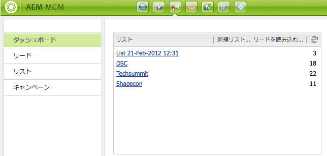

# キャンペーンの設定{#setting-up-your-campaign}

新しいキャンペーンを設定するには、次の（一般的な）手順を実行します。

1. キャンペーンを保持する[ブランドを作成](#creating-a-new-brand)します。
1. 必要に応じて、[新しいブランドのプロパティを定義](#defining-the-properties-for-your-new-brand)します。
1. エクスペリエンス（ティーザーページ、ニュースレターなど）を保持する[キャンペーンを作成](#creating-a-new-campaign)します。
1. 必要に応じて、[新しいキャンペーンのプロパティを定義](#defining-the-properties-for-your-new-campaign)できます。

次に、作成するエクスペリエンスのタイプに応じて、[エクスペリエンスを作成](#creating-a-new-experience)することが必要になります。エクスペリエンスの詳細および作成後の作業は、作成するエクスペリエンスのタイプによって異なります。

* ティーザーを作成する場合：

   1. [ティーザーのエクスペリエンスを作成](/help/sites-classic-ui-authoring/classic-personalization-campaigns.md#creatingateaserexperience)します。
   1. [ティーザーにコンテンツを追加](/help/sites-classic-ui-authoring/classic-personalization-campaigns.md#addingcontenttoyourteaser)します。
   1. [ティーザーのタッチポイントを作成](/help/sites-classic-ui-authoring/classic-personalization-campaigns.md#creatingatouchpointforyourteaser)します（コンテンツページにティーザーを追加します）。

* ニュースレターを作成する場合：

   1. [ニュースレターのエクスペリエンスを作成](/help/sites-classic-ui-authoring/classic-personalization-campaigns.md#creatinganewsletterexperience)します。
   1. [ニュースレターにコンテンツを追加](/help/sites-classic-ui-authoring/classic-personalization-campaigns.md#addingcontenttonewsletters)します。
   1. [ニュースレターを個人用に設定](/help/sites-classic-ui-authoring/classic-personalization-campaigns.md#personalizingnewsletters)します。
   1. [魅力的なニュースレターのランディングページを作成](/help/sites-classic-ui-authoring/classic-personalization-campaigns.md#settingupanewsletterlandingpage)します。
   1. サブスクライバーまたはリードに[ニュースレターを送信します](/help/sites-classic-ui-authoring/classic-personalization-campaigns.md#sendingnewsletters)。

* Adobe Target（旧称 Test&amp;Target）オファーを作成する場合：

   1. [Adobe Target オファーエクスペリエンスを作成](/help/sites-classic-ui-authoring/classic-personalization-campaigns.md#creatingatesttargetofferexperience)します。
   1. [Adobe Target と統合](/help/sites-classic-ui-authoring/classic-personalization-campaigns.md#integratewithadobetesttarget)します。

>[!NOTE]
>
>セグメントの定義に関する詳しい説明は、[セグメント化](/help/sites-administering/campaign-segmentation.md)を参照してください。

## 新しいブランドの作成 {#creating-a-new-brand}

新しいブランドを作成するには：

1. **MCM** を開き、左側のペインで「**キャンペーン**」を選択します。

1. 「**新規...**」を選択して、「**タイトル**」と「**名前**」および新しいブランドに使用するテンプレートを入力します。

   

1. 「**作成**」をクリックします。新しいブランドが（デフォルトのアイコンで）MCM に表示されます。

### 新しいブランドのプロパティの定義 {#defining-the-properties-for-your-new-brand}

1. 左側のペインが「**キャンペーン**」で、右側のペインにある新しいブランドのアイコンを選択し、「**プロパティ...**」をクリックします。

   「**タイトル**」、「**説明**」およびアイコンとして使用する画像を入力できます。

   

1. 「**OK**」をクリックして、保存します。

### 新しいキャンペーンの作成 {#creating-a-new-campaign}

新しいキャンペーンを作成するには：

1. 「**キャンペーン**」で、左側のペインの新しいブランドを選択するか、右側のペインのアイコンをダブルクリックします。

   概要が表示されます（新しいブランドの場合は空白です）。

1. 「**新規...**」をクリックし、「**タイトル**」、「**名前**」および新しいキャンペーンに使用するテンプレートを指定します。

   

1. 「**作成**」をクリックします。新しいキャンペーンが MCM に表示されます。

### 新しいキャンペーンのプロパティの定義 {#defining-the-properties-for-your-new-campaign}

動作を制御するキャンペーンのプロパティを設定します。

* **優先度：**&#x200B;他のキャンペーンと比較した場合の、このキャンペーンの優先度です。複数のキャンペーンを同時にオンにすると、最も優先度の高いキャンペーンが訪問者エクスペリエンスを制御します。
* **オン／オフタイム：**&#x200B;これらのプロパティは、キャンペーンが訪問者エクスペリエンスを制御する期間を制御します。オンタイムプロパティは、キャンペーンがエクスペリエンスの制御を開始する時間を制御します。オフタイムプロパティは、キャンペーンがエクスペリエンスの制御をいつ停止するかを制御します。
* **画像：** AEM でキャンペーンを示す画像
* **クラウドサービス：**&#x200B;キャンペーンを統合するクラウドサービスの設定です（[Adobe Marketing Cloud との統合](/help/sites-administering/marketing-cloud.md)を参照してください）。

* **Adobe Target：** Adobe Target と統合するキャンペーンを設定するプロパティです（[Adobe Target との統合](/help/sites-administering/target.md)を参照してください）。

1. 「**キャンペーン**」からブランドを選択します。右側のウィンドウでキャンペーンを選択し、「**プロパティ**」をクリックします。

   **タイトル**、**説明**、**クラウドサービス**（使用する場合）など、様々なプロパティを入力できます。

   

1. 「**OK**」をクリックして、保存します。

### 新しいエクスペリエンスの作成 {#creating-a-new-experience}

新しいエクスペリエンスを作成する手順は、エクスペリエンスのタイプによって異なります。

* [ティーザーの作成](/help/sites-classic-ui-authoring/classic-personalization-campaigns.md#creatingateaser)
* [ニュースレターの作成](/help/sites-classic-ui-authoring/classic-personalization-campaigns.md#creatinganewsletter)
* [Adobe Target オファーエクスペリエンスの作成](/help/sites-classic-ui-authoring/classic-personalization-campaigns.md#creatingatesttargetoffer)

>[!NOTE]
>
>以前のリリースと同様に、**Web サイト**&#x200B;コンソール内のページとしてエクスペリエンスを作成することは可能です（以前のリリースで作成されたそのようなページも完全にサポートされています）。
>
>現在のリリースでは、エクスペリエンスの作成に MCM を使用することをお勧めします。

### 新しいエクスペリエンスの設定 {#configuring-your-new-experience}

エクスペリエンスの基本スケルトンを作成したら、エクスペリエンスのタイプに応じて、引き続き、次の作業をおこなうことが必要です。

* [ティーザー](/help/sites-classic-ui-authoring/classic-personalization-campaigns.md#teasers):

   * [ティーザーページを訪問者セグメントに接続](/help/sites-classic-ui-authoring/classic-personalization-campaigns.md#applyingasegmenttoyourteaser)します。
   * [ティーザーのタッチポイントを作成](/help/sites-classic-ui-authoring/classic-personalization-campaigns.md#creatingatouchpointforyourteaser)します（コンテンツページにティーザーを追加します）。

* [ニュースレター](/help/sites-classic-ui-authoring/classic-personalization-campaigns.md#newsletters)：

   * [ニュースレターにコンテンツを追加](/help/sites-classic-ui-authoring/classic-personalization-campaigns.md#addingcontenttonewsletters)します。
   * [ニュースレターを個人用に設定](/help/sites-classic-ui-authoring/classic-personalization-campaigns.md#personalizingnewsletters)します。
   * サブスクライバーまたはリードに[ニュースレターを送信します](/help/sites-classic-ui-authoring/classic-personalization-campaigns.md#sendingnewsletters)。
   * [魅力的なニュースレターのランディングページを作成](/help/sites-classic-ui-authoring/classic-personalization-campaigns.md#settingupanewsletterlandingpage)します。

* [Adobe Target オファー](/help/sites-classic-ui-authoring/classic-personalization-campaigns.md#testtargetoffers)：

   * [Adobe Target と統合](/help/sites-administering/target.md)します。

### 新しいタッチポイントの追加 {#adding-a-new-touchpoint}

既存のエクスペリエンスがある場合、MCM のカレンダー表示から直接タッチポイントを追加できます。

1. キャンペーンのカレンダー表示を選択します。

1. 「**タッチポイントを追加...**」をクリックして、ダイアログを開きます。追加するエクスペリエンスを指定します。

   

1. 「**OK**」をクリックして保存します。

## リードの使用 {#working-with-leads}

>[!NOTE]
>
>この機能（リードの管理）がさらに強化される予定はありません。
>[Adobe Campaign や AEM との統合を利用](/help/sites-administering/campaign.md)することをお勧めします。

AEM MCM では、リードの構成および追加を実行できます。これをおこなうには、リードを手動で入力するか、コンマ区切りのリスト（メーリングリストなど）を読み込みます。リードを生成する他の方法として、ニュースレターのサインアップやコミュニティのサインアップから生成する方法があります（設定済みであれば、これらのサインアップによって、リードの情報を入力するワークフローをトリガーすることができます）。

通常、リードは分類され、リストに置かれます。これにより、リスト全体に対するアクションを後で実行することができます。例えば、特定のリストに対してカスタム電子メールを送信できます。

ダッシュボードで、左のウィンドウの「**リード**」をクリックすると、すべてのリードにアクセスします。**リスト**&#x200B;ウィンドウからリードにアクセスすることもできます。

>[!NOTE]
>
>ユーザーのアバターを追加または変更するには、クリックストリームのクラウドを開き（Ctrl + Alt + c キー）、プロファイルを読み込んで、「**編集**」をクリックします。

### 新しいリードの作成 {#creating-new-leads}

新しいリードを作成したら、必ず[それらのリードをアクティベート](#activating-or-deactivating-leads)します。これにより、パブリッシュインスタンスでのリードの行動を追跡し、リードの体験を個別化することができます。

新しいリードを手動で作成するには：

1. AEM で MCM に移動します。ダッシュボードで「**リード**」をクリックします。
1. 「**新規**」をクリックします。**新規作成**&#x200B;ウィンドウが開きます。

   

1. 必要に応じて各フィールドに情報を入力します。「**住所**」タブをクリックします。

   

1. 必要に応じて住所情報を入力します。「**保存**」をクリックして、リードを保存します。他のリードを追加するには、「**保存して新規作成**」をクリックします。

   新しいリードが、リードウィンドウに表示されます。エントリをクリックすると、入力したすべての情報が右のウィンドウに表示されます。リードを作成したら、リストにリードを追加できます。

   

### リードのアクティベートおよびアクティベート解除 {#activating-or-deactivating-leads}

リードをアクティベートすることで、パブリッシュインスタンスでのリードの行動を追跡し、リードの体験を個別化することができます。リードの行動を追跡する必要がなくなった場合は、リードのアクティベートを解除できます。

リードをアクティベートまたはアクティベート解除するには：

1. AEM で、MCM に移動し、「**リード**」をクリックします。

1. アクティベートまたはアクティベート解除するリードを選択し、「**アクティベート**」または「**アクティベートの解除**」をクリックします。

   

   AEM ページの場合と同様に、「**公開済み**」列に公開ステータスが示されます。

   

### 新しいリードの読み込み {#importing-new-leads}

新しいリードを読み込むとき、既存のリストに新しいリードを自動的に追加したり、リードが含まれる新しいリストを作成したりできます。

コンマ区切りのリストからリードを読み込むには：

1. AEM で、MCM に移動し、「**リード**」をクリックします。

   >[!NOTE]
   >
   >次のいずれかを実行して、リードを読み込むこともできます。
   >
   >
   >
   >    * ダッシュボードで、**リスト**&#x200B;ウィンドウの「**リードを読み込む**」をクリックします。
      >
      >    
   * 「**リスト**」をクリックし、**ツール**&#x200B;メニューの「**リードを読み込む**」を選択します。

1. **ツール**&#x200B;メニューの「**リードを読み込む**」を選択します。****

1. 「サンプルデータ」の説明に従って、情報を入力します。読み込むことができるフィールドは、email、familyName、givenName、gender、aboutMe、city、country、phoneNumber、postalCode、region、streetAddress です。

   >[!NOTE]
   >
   >CSV リストの最初の行は事前定義されたラベルで、次の例のとおりに記述する必要があります。
   >
   >
   >`email,givenName,familyName` 例えば、と書かれ `givenname`た場合、システムはそれを認識しない。

   

1. 「**次へ**」をクリックします。リードのプレビューが表示されるので、入力した情報が正しいかどうかを確認します。

   

1. 「**次へ**」をクリックします。リードを含めるリストを選択します。リードをリストに含めない場合は、フィールドの情報を削除します。AEM では、デフォルトで日付と時間を含むリスト名が作成されます。「**読み込み**」をクリックします。

   

   新しいリードが、リードウィンドウに表示されます。エントリをクリックすると、入力したすべての情報が右のウィンドウに表示されます。リードを作成したら、リストにリードを追加できます。

### リストへのリードの追加 {#adding-leads-to-lists}

既存のリストにリードを追加するには：

1. MCM で「**リード**」をクリックし、利用可能なすべのリードを表示します。

1. リードの横にあるチェックボックスを選択して、リストに追加するリードを選択します。リードを必要なだけいくつでも追加できます。

   

1. **ツール**&#x200B;メニューの「**リストに追加**」を選択します。**リストに追加**&#x200B;ウィンドウが開きます。

   

1. リードを追加するリストを選択して、「**OK**」をクリックします。リードが適切なリストに追加されます。

### リード情報の表示 {#viewing-lead-information}

リードの情報を表示するには、MCM で、リードの横にあるチェックボックスをクリックします。右のウィンドウが開き、リードのすべての情報が表示されます。リードが含まれるリストについても表示されます。

### 既存のリードの変更 {#modifying-existing-leads}

既存のリードの情報を変更するには：

1. MCM で「**リード**」をクリックします。リードのリストで、編集するリードの横にあるチェックボックスを選択します。リードのすべての情報が右のウィンドウに表示されます。

   

   >[!NOTE]
   >
   >一度に編集できるリードは 1 つだけです。同一のリストに含まれる複数のリードを変更する場合は、代わりにリストを変更することができます。

1. 「**編集**」をクリックします。**リードを編集**&#x200B;ウィンドウが開きます。

   

1. 必要に応じて編集を行い、「**保存**」をクリックして変更を保存します。

   >[!NOTE]
   >
   >リードのアバターを変更するには、ユーザーのプロファイルに移動します。Ctrl + Alt + c キーを押し、「**Load**」をクリックしてからプロファイルを選択することで、クリックストリームのクラウドにプロファイルを読み込むことができます。

### 既存のリードの削除 {#deleting-existing-leads}

MCM の既存のリードを削除するには、リードの横のチェックボックスをオンにして「**削除**」をクリックします。リードのリストおよび関連するすべてのリストからリードが削除されます。

>[!NOTE]
>
>削除する前に、既存のリードの削除を確認するメッセージが表示されます。削除すると、そのリードは検索できなくなります。

## リストの使用 {#working-with-lists}

>[!NOTE]
>
>この機能（リストの管理）がさらに強化される予定はありません。
>[Adobe Campaign や AEM との統合を利用](/help/sites-administering/campaign.md)することをお勧めします。

リストによって、リードをグループにまとめることができます。リストを使用すると、マーケティングキャンペーンの対象を、選択したリードのグループに設定できます。例えば、対象を設定したニュースレターをリストに送信することができます。MCM では、リストはダッシュボードに表示されます。または、「**リスト**」をクリックすると表示されます。どちらの場合も、リストの名前とメンバーの数が示されます。

「**リスト**」をクリックすると、リストが他のリストのメンバーであるかどうか、およびリストの説明が表示されます。

### 新しいリストの作成 {#creating-new-lists}

新しいリスト（グループ）を作成するには：

1. MCM ダッシュボードで「**New List ...**」をクリックするか、「**リスト**」で「**新規**」をクリックします。リストを作成ウィンドウが表示されます。

   

1. 名前を入力します（必須）。必要であれば説明を入力し、「**保存**」をクリックします。リストが、**リスト**&#x200B;ウィンドウに表示されます。

   

### 既存のリストの変更 {#modifying-existing-lists}

既存のリストを変更するには：

1. MCM で「**リスト**」をクリックします

1. リストの一覧で、編集するリストの横にあるチェックボックスを選択し、「**編集**」をクリックします。**リストを編集**&#x200B;ウィンドウが開きます。

   

   >[!NOTE]
   >
   >一度に編集できるリストは 1 つだけです。

1. 必要に応じて編集を行い、「**保存**」をクリックして変更を保存します。

### 既存のリストの削除 {#deleting-existing-lists}

既存のリストを削除するには、MCM で、リストの横にあるチェックボックスを選択し、「**削除**」をクリックします。リストが削除されます。リストに含まれているリードは削除されません。リストとの関係のみが取り消されます。

>[!NOTE]
>
>削除する前に、既存のリストの削除を確認するメッセージが表示されます。削除すると、そのリストは検索できなくなります。

### リストの統合 {#merging-lists}

既存のリストを他のリストに統合できます。これをおこなうと、統合するリストが他のリストのメンバーになります。統合するリストは個別のエンティティとして引き続き存在し、削除はされません。

以下のように、2 つの異なる場所で同様の会議が開催されるとします。これらの会議を、すべての会議の出席者リストに統合する必要があるとき、リストを統合することができます。

既存のリストを統合するには：

1. MCM で「**リスト**」をクリックします

1. リストの横にあるチェックボックスを選択して、他のリストの統合先となるリストを選択します。

1. **ツール**&#x200B;メニューの「**Merge List**」を選択します。

   >[!NOTE]
   >
   >一度に統合できるリストは 1 つだけです。

1. **Merge List** ウィンドウで、統合されるリストを選択して、「**OK**」をクリックします。

   

   統合先として選択したリストでは、メンバーの数が 1 つ増えます。リストが統合されたことを確認するには、統合先のリストを選択し、**ツール**&#x200B;メニューの「**リードを表示**」を選択します。

1. 必要なリストをすべて統合するまで、上記の手順を繰り返します。

   

>[!NOTE]
>
>統合したリストをメンバーシップから削除する方法は、リストからリードを削除する方法と同じです。**リスト**&#x200B;タブを開き、統合されたリストを含んでいるリストを選択し、リストの横にある赤い円をクリックしてメンバーシップを削除します。

### リスト内のリードの表示 {#viewing-leads-in-lists}

メンバーを参照または検索することで、特定のリストにどのリードが属しているかをいつでも確認できます。

リストに属しているリードを表示するには：

1. MCM で「**リスト**」をクリックします

1. メンバーを表示するリストの横にあるチェックボックスを選択します。

1. **ツール**&#x200B;メニューの「**リードを表示**」を選択します。そのリストのメンバーになっているリードが表示されます。リスト全体に目を通したり、メンバーを検索したりできます。

   >[!NOTE]
   >
   >また、リードを選択して「**Remove Membership**」をクリックすることで、リストからリードを削除できます。

   

1. 「**閉じる**」をクリックして MCM に戻ります。
