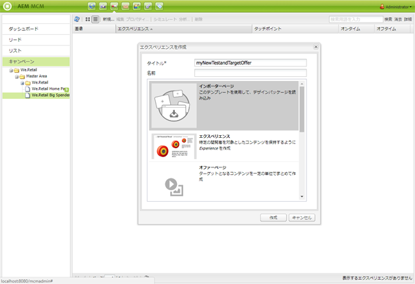

# Target オファー{#target-offers}

## Test&amp;Target オファーのエクスペリエンスの作成 {#creating-a-test-target-offer-experience}

1. 新しいキャンペーンを左側のペインで選択するか、右側のペインでダブルクリックします。
1. 次のアイコンを使用して、リスト表示を選択します。

   

1. 「**新規...**」をクリックします。
1. You can specify the **Title**, **Name** and type of experience to be created; in this case, Test&amp;Target Offer.

   

1. 「**作成**」をクリックします。

   >[!NOTE]
   >
   >Test&amp;Target のエクスペリエンスは、この時点で MCM のリストに表示されていません。「キャンペーン」の下の **Web サイト**&#x200B;コンソールからアクセスできます。

## Adobe Target との統合 {#integrating-with-adobe-target}

See [Integrate with Adobe](/help/sites-administering/target.md) [Target](/help/sites-administering/target.md) for full details.
