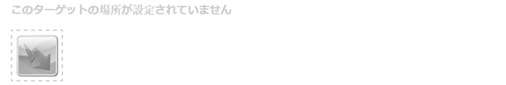
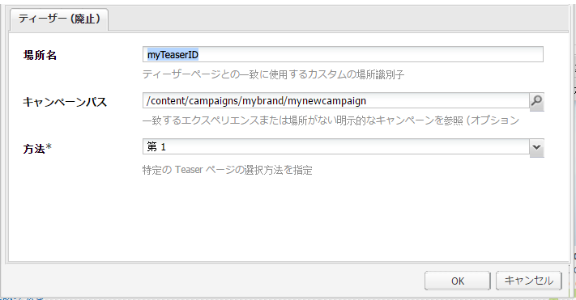
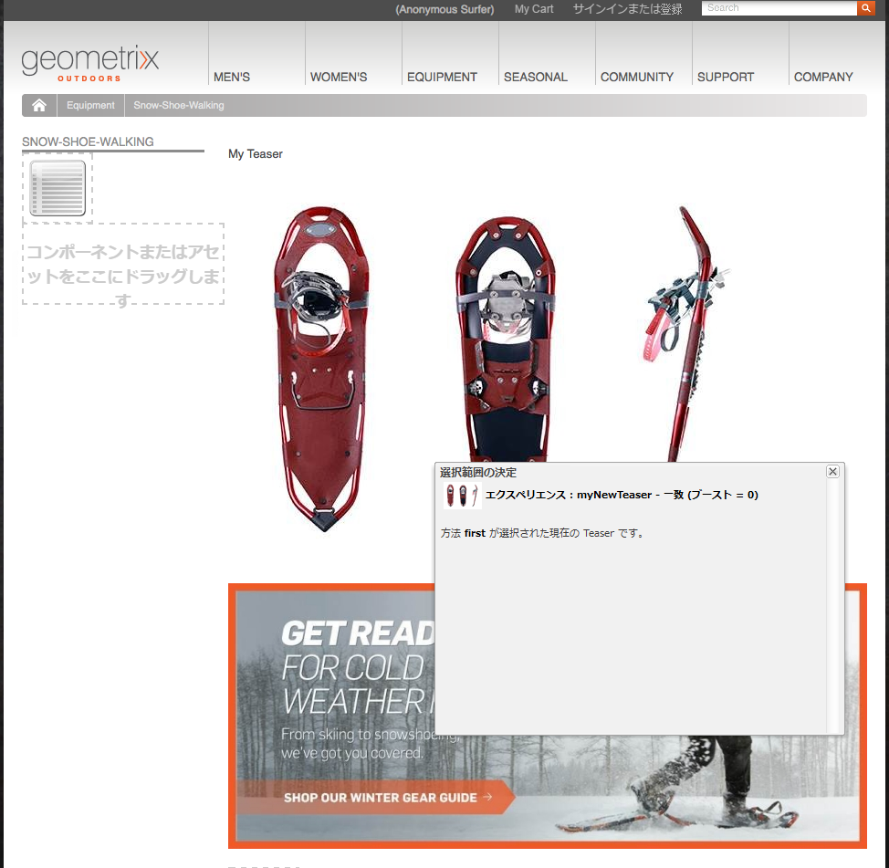
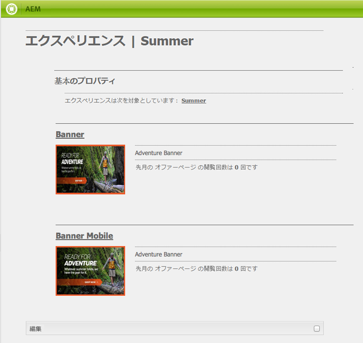

# ティーザーと戦略{#teasers-and-strategies}

キャンペーンでは、多くの場合、特定のセグメントの訪問者の関心事項に焦点を当てたコンテンツによって訪問者の興味を引くためのメカニズムとして、ティーザーを使用します。1 つのキャンペーンには 1 つ以上のティーザーが定義されます。

>[!NOTE]
>
>ティーザーコンポーネントは AEM 6.2 で廃止されました。代わりに [Target コンポーネント](/help/sites-authoring/content-targeting-touch.md)を使用してください。

* **ブランド** ページは、Webサイトのキャンペーンセクション内に保存されます。各ブランドには個々のキャンペーンが含まれます。
* **キャンペーン** ページは、Webサイトの「キャンペーン」セクション内に保存されます。各キャンペーンには個々のページがあり、ティーザー定義が保持されます。コンテナ（概要）ページにも個々のティーザーページに関連する特定の情報と統計情報が保持されます。

AEM 内のティーザーは、以下の複数の部品から構成されます。

* **Teaser** ページは適切なキャンペーンページの下に保存され、特定のキャンペーンで使用できるTeaserのパラグラフの定義が保持されます。これらの定義は、Teaser 段落を表示するときに使用されます。コンテンツのバリエーション、バリエーションやブースト係数の選択に使用するセグメントなどがあります。
* **ティーザーコンポーネント**&#x200B;は設定を変更せずにすぐに使用できます。また、コンテンツページに特定のティーザー段落のインスタンスを作成できます。サイドキックからティーザーコンポーネントをドラッグし、ティーザー定義を指定して独自のティーザー段落を作成できます。**注意： Teaserコンポーネント** はAEM 6.2で非推奨になりました。代わりに、 [ターゲット](/help/sites-authoring/content-targeting-touch.md) コンポーネントを使用してください。
* **ティーザー段落**&#x200B;は、コンテンツページ内にあるティーザーの実インスタンスです。ティーザー段落は、特定の訪問者セグメントを、その人々が関心を持つコンテンツに誘導します。
* 特定の訪問者セグメントに焦点を絞ったキャンペーンコンテンツがあるページ。通常、ティーザー段落はこのようなページに訪問者を誘導します。

## 戦略  {#strategies}

ティーザー段落をページに追加する場合は、**戦略**&#x200B;を定義する必要があります。

これは、選択できるティーザーが複数ある場合に、割り当てられたセグメントがすべて適切に解決されるようにするためです。また、以下のように「**方法**」でティーザーの選択に使用できる追加の条件を指定します。

* **Clickstream のスコア**：訪問者の ClientContext 内に保持されているタグと関連タグのヒットに基づいた値です（各タグを含むページを 1 人の訪問者が何回クリックしたかを示します）。ティーザーページに定義されている複数のタグのヒット率が比較されます。
* **ランダム**（「ランダム」選択用）;は、ページに対して生成されたランダムな要因を使用します。これは、 [クライアントコンテキストで確認できます](/help/sites-administering/client-context.md)。
* **解決** されたセグメントのリストを開きます。この順序は、キャンペーンコンテナページ内のティーザーの順序を指します。

セグメントの[ブースト係数](/help/sites-administering/campaign-segmentation.md#boost-factor)も選択範囲に影響を与えます。 これは、セグメントの定義に追加される重み付け係数であり、選択されるセグメントの相対的確率を増減させます。

多様な選択基準のプロセスと相互関係を示すには、例を使用するのが最も効果的です（必要なユーザーにティーザーが確実に影響を及ぼすためにも使用できる方法です）。

以下のセグメントが作成済みで、それぞれにブースト係数が割り当てられている場合：

| セグメント | ブースト係数 |
|---|---|
| S1 | 0 |
| S2 | 0 |
| S3 | 10 |
| S4 | 30 |
| S5 | 0 |
| S6 | 100 |

以下のティーザー定義を使用します。

<table>
 <tbody>
  <tr>
   <td>キャンペーン</td>
   <td>ティーザー</td>
   <td>割り当てるセグメント</td>
   <td>割り当てられたタグ </td>
  </tr>
  <tr>
   <td>C1</td>
   <td>T1</td>
   <td>S1、S2</td>
   <td>ビジネス、マーケティング</td>
  </tr>
  <tr>
   <td>C1</td>
   <td>T2 </td>
   <td>S1</td>
   <td>  </td>
  </tr>
  <tr>
   <td>C1 </td>
   <td>T3</td>
   <td>S3、S4</td>
   <td>  </td>
  </tr>
  <tr>
   <td>C1 </td>
   <td>T4</td>
   <td>S2、S5</td>
   <td>  </td>
  </tr>
  <tr>
   <td>C1 </td>
   <td>T5</td>
   <td>S1、S2、S6</td>
   <td>マーケティング</td>
  </tr>
  <tr>
   <td>C1 </td>
   <td>T6</td>
   <td>S6</td>
   <td>ビジネス  </td>
  </tr>
 </tbody>
</table>

これを以下の訪問者に適用する場合：

* **S1**、 **S2** 、 **S6** の解決に成功しました

* **マーケティング**&#x200B;タグは 3 回のヒットがあります
* **ビジネス**&#x200B;タグは 6 回のヒットがあります

以下のような結果になります。

* マッチング成功：ティーザーに割り当てられたセグメントのいずれかが、現在の訪問者について適切に解決されているか
* ブースト係数：すべての適用可能なセグメントの最も高いブースト係数
* Clickstream のスコア：すべての適用可能なタグのヒット回数の累積合計

これらの値は、適切な方法を適用する前に計算されます。

<table>
 <tbody>
  <tr>
   <td>キャンペーン</td>
   <td>ティーザー</td>
   <td>割り当てるセグメント</td>
   <td>タグ </td>
   <td>一致は成功するか</td>
   <td>結果のブースト係数</td>
   <td>結果のクリックストリームスコア </td>
  </tr>
  <tr>
   <td>C1</td>
   <td>T1</td>
   <td>S1、S2</td>
   <td>ビジネス、マーケティング</td>
   <td>可</td>
   <td>0</td>
   <td>9</td>
  </tr>
  <tr>
   <td>C1</td>
   <td>T2 </td>
   <td>S1</td>
   <td>  </td>
   <td>可</td>
   <td>0</td>
   <td>  </td>
  </tr>
  <tr>
   <td>C1 </td>
   <td>T3</td>
   <td>S3、S4</td>
   <td>  </td>
   <td>不可</td>
   <td>  </td>
   <td>  </td>
  </tr>
  <tr>
   <td>C1 </td>
   <td>T4</td>
   <td>S2、S5</td>
   <td>  </td>
   <td>可  </td>
   <td>0  </td>
   <td>  </td>
  </tr>
  <tr>
   <td>C1 </td>
   <td>T5</td>
   <td>S1、S2、S6</td>
   <td>マーケティング</td>
   <td>可</td>
   <td>100</td>
   <td>3</td>
  </tr>
  <tr>
   <td>C1 </td>
   <td>T6</td>
   <td>S6</td>
   <td>ビジネス</td>
   <td>可</td>
   <td>100</td>
   <td>6 </td>
  </tr>
 </tbody>
</table>

これらの値は、ティーザー段落に適用する「**方法**」に応じて、訪問者に表示するティーザーを決定するために使用されます。

<table>
 <tbody>
  <tr>
   <td>方法</td>
   <td>結果のティーザー</td>
   <td>コメント</td>
  </tr>
  <tr>
   <td>最初</td>
   <td>T5</td>
   <td>T5 と T6 のみが検討対象となります。これらのセグメントがすべて解決され、かつ、そのブースト係数が最大となるからです。<i></i>リストは、T5、T6 の順序で返されるので、T5 が選択され表示されます。</td>
  </tr>
  <tr>
   <td>ランダム</td>
   <td>T5 または T6</td>
   <td>両方のティーザーで、すべてのセグメントが解決され、これらのブースト係数は同じ値です。そのため、この 2 つのティーザーが同じ比率として表示されます。</td>
  </tr>
  <tr>
   <td>Clickstream のスコア</td>
   <td>T6</td>
   <td>
T1、T4、T5 および T6 のセグメントはすべてその訪問者に対して解決されます。T5 および T6 のブースト係数の方が高いので、T1 および T4 は除外されます。最後に T6 のクリックストリームスコアの方が高いので、T6 が選択されます。
 </td>
  </tr>
 </tbody>
</table>

>[!NOTE]
>
>上記の解決処理の後に、選択できるティーザーが複数ある場合、内部的な選択（ランダム）によって 1 つのティーザーが選択され、表示されます。
>
>例えば、方法が「Clickstream のスコア」で、T5 のクリックストリームスコアが T6 と同じ場合（3 ではなく 6 の場合）、内部的な選択（ランダム）を使用して、この 2 つのいずれかが選択されます。

ティーザーページ／段落を使用して、特定の訪問者セグメントを、その訪問者の関心に基づきフォーカスされたコンテンツに誘導します。訪問者が選択できる選択肢の範囲を示すことも、特定の訪問者セグメントに基づくティーザー段落を 1 つだけ表示することもできます。例えば、ティーザー段落を、訪問者の年齢に応じて表示することができます。

通常、ティーザーページは、次のティーザーページに変わるまでの特定の期間継続する一時的なアクションです。

ブランドとキャンペーンを作成した後で、ティーザーエクスペリエンスの作成と設定をおこなうことができます。

### ティーザーのタッチポイントの作成 {#creating-a-touchpoint-for-your-teaser}

>[!NOTE]
>
>ティーザーコンポーネントは AEM 6.2 で廃止されました。代わりに [Target コンポーネント](/help/sites-authoring/content-targeting-touch.md)を使用してください。

1. キャンペーンページに誘導するティーザー段落を配置するコンテンツページに移動します。
1. **ティーザー**&#x200B;コンポーネント（サイドキックの「**パーソナライズ機能**」セクションで選択）を、必要な位置に追加します。最初に作成したときは、キャンペーンパスが設定されていないと表示されます。

   

1. ティーザーコンポーネントを編集し、次の要素を追加します。

   * **キャンペーンパス**&#x200B;個々のティーザーページが保存されるキャンペーンページへのパス。セグメントによって表示されるティーザーが決まります。

   * **[方法](/help/sites-classic-ui-authoring/classic-personalization-campaigns.md#strategies)** 適切に解決されたセグメントが複数ある場合の選択方法。
   

1. 「**OK**」をクリックして、保存します。ティーザーに設定したセグメントや、現在ログインに使用しているユーザーのプロファイルにより、適切なコンテンツが表示されます。

   

1. ティーザー段落にマウスポインターを置くと、疑問符アイコンが（コンポーネントの右下隅に）表示されます。これをクリックして、適用されるセグメントと、これらのセグメントが現在解決されているかを表示します。

   

### ティーザーの概要 {#teaser-overview}

MCM のキャンペーン表示と同様、キャンペーンページにもキャンペーンに関連付けられている Teaser についての情報が提供されます。

1. **Web サイト**&#x200B;コンソールから、次の例のようにキャンペーンページを開きます。

   `https://localhost:4502/content/campaigns/geometrixx-outdoors/storefront/summer.html`

   このページには、Teaser の定義と閲覧の統計についての概要が表示されます。

   
