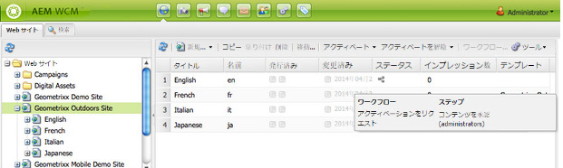

# ページへのワークフローの適用 {#applying-workflows-to-pages}

ワークフローを適用する際には、次の情報を指定します。

* 適用されるワークフロー。

   （AEM 管理者によって割り当てられた、アクセス権限がある）任意のワークフローを適用できます。
* 省略可能：

   * ユーザーがワークフローを開始した理由に関する情報を提供するコメント。
   * ユーザーのインボックス内のワークフローインスタンスの特定に役立つタイトル。

>[!NOTE]
>
>AEM 管理者は[他のいくつかの方法](/help/sites-administering/workflows-starting.md)を使用してワークフローを開始できます。

## ワークフローの適用 {#applying-workflows}

ワークフローは、Web サイトコンソールから、またはページの編集中にはサイドキックから開始できます。

**Web サイト**&#x200B;コンソールの「**ステータス**」列は、ワークフローがページに適用されているかどうかを示します。

### Web サイトコンソールからのワークフローの開始 {#starting-a-workflow-from-the-websites-console}

1. Web サイトコンソールを開きます。（[http://localhost:4502/siteadmin](http://localhost:4502/siteadmin)）
1. Web サイトツリーで、ワークフローを適用するページの親を選択します。
1. ページリストで、ページを選択して「ワークフロー」をクリックします。
1. ワークフローを開始ダイアログで、適用するワークフローを選択します。必要に応じて、コメントとタイトルを入力します。その後、「開始」をクリックします。

### サイドキックからのワークフローの開始 {#starting-a-workflow-using-sidekick}

1. Web サイトコンソールを開きます。
1. 必要なページを開きます。
1. サイドキックの「ワークフロー」タブを選択します。
1. **ワークフロー**&#x200B;ダイアログを展開して「**ワークフロー**」を選択し、必要に応じて、**ワークフロータイトル**&#x200B;と&#x200B;**コメント**&#x200B;を入力します。

   

1. 「**ワークフローを開始**」をクリックして、設定したプロパティで現在のページをペイロードとして新しいワークフローインスタンスを開始します。ワークフローが実行状態になります。
