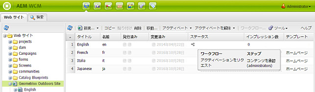
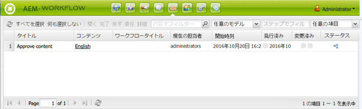
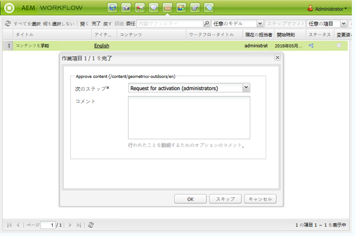
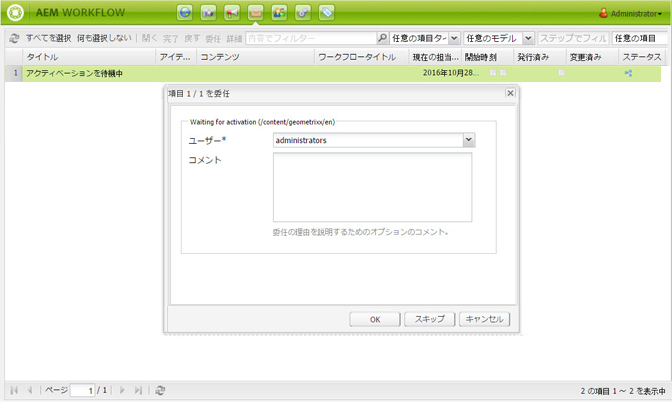
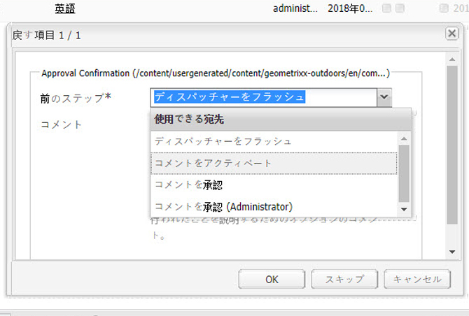

# ワークフローへの参加{#participating-in-workflows}

ワークフローには通常、ページまたはアセットでユーザーがアクティビティを実行する必要があるステップが含まれています。ワークフローでアクティビティを実行するユーザーまたはグループを選択し、その人物やグループに作業項目を割り当てます。

## 作業項目の処理 {#processing-your-work-items}

次のアクションを実行して作業項目を処理できます。

* **完了**

   項目を完了してワークフローを次のステップに進めることができます。

* **委任**

   ステップが割り当てられているが、何らかの理由によってアクションを実行できない場合、そのステップを別のユーザーまたはグループに委任できます。

   委任できるユーザーは、作業項目の割り当て先によって異なります。

   * 作業項目がグループに割り当てられた場合、グループメンバーに委任できます。
   * 作業項目がグループに割り当てられ、ユーザーに委任された場合、グループメンバーおよびグループに委任できます。
   * 作業項目が 1 人のユーザーに割り当てられた場合、作業項目を委任することはできません。

* **戻す**

   あるステップまたは一連のステップを繰り返す必要がある場合は、以前のステップに戻すことができます。これによって、ワークフロー内の以前に発生したステップを、再処理のために選択できます。ワークフローが指定したステップに戻り、そこから続行されます。

## ワークフローへの参加 {#participating-in-a-workflow}

### 割り当てられたワークフローアクションの通知 {#notifications-of-assigned-workflow-actions}

作業項目（**コンテンツを承認**&#x200B;など）が割り当てられると、様々なアラートや通知が表示されます。

* Web サイトコンソールの「**ステータス**」列は、ページがワークフローにあるときを示します。

   

* ユーザーまたはユーザーが属するグループがワークフローの一部として作業項目に割り当てられていると、その作業項目が AEM ワークフローインボックスに表示されます。

   

### 参加者ステップの完了 {#completing-a-participant-step}

指示されたアクションを実行すると、作業項目が完了します。これにより、ワークフローを続行できます。作業項目を完了するには、次の手順を使用します。

1. ワークフローステップを選択し、上部のナビゲーションバーの「**完了**」ボタンをクリックします。
1. 表示されたダイアログで、**次のステップ**（つまり、次に実行するステップ）を選択します。ドロップダウンリストには、すべての該当する移動先が示されます。**コメント**&#x200B;を入力することもできます。

   

   列挙されるステップの数は、ワークフローモデルの設計によって異なります。

1. 「**OK**」をクリックして、アクションを確定します。

### 参加者ステップの委任 {#delegating-a-participant-step}

作業項目を委任するには、次の手順を使用します。

1. 上部のナビゲーションバーの「**委任**」ボタンをクリックします。
1. ダイアログで、ドロップダウンリストを使用して、作業項目を委任する「**ユーザー**」を選択します。「**コメント**」を追加することもできます。

   

1. 「**OK**」をクリックして、アクションを確定します。

### 参加者ステップでの前のステップの実行 {#performing-step-back-on-a-participant-step}

前のステップを実行するには、次の手順を使用します。

1. 上部のナビゲーションバーの「戻す」ボタンをクリックします。
1. 表示されたダイアログで、「前のステップ」を選択します。つまり、次に実行するステップがワークフロー内の以前に発生したステップとなります。ドロップダウンリストには、すべての該当する移動先が示されます。

   

1. 「OK」をクリックして、アクションを確定します。

