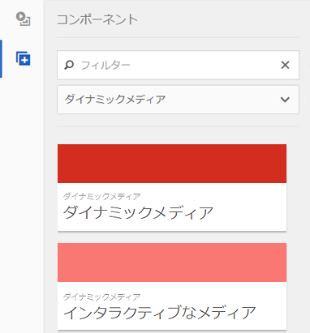
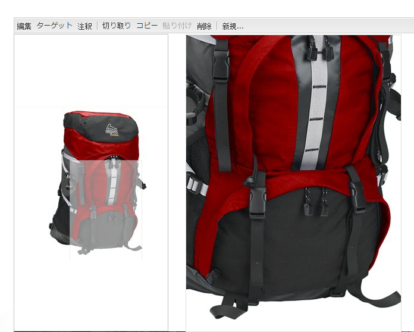
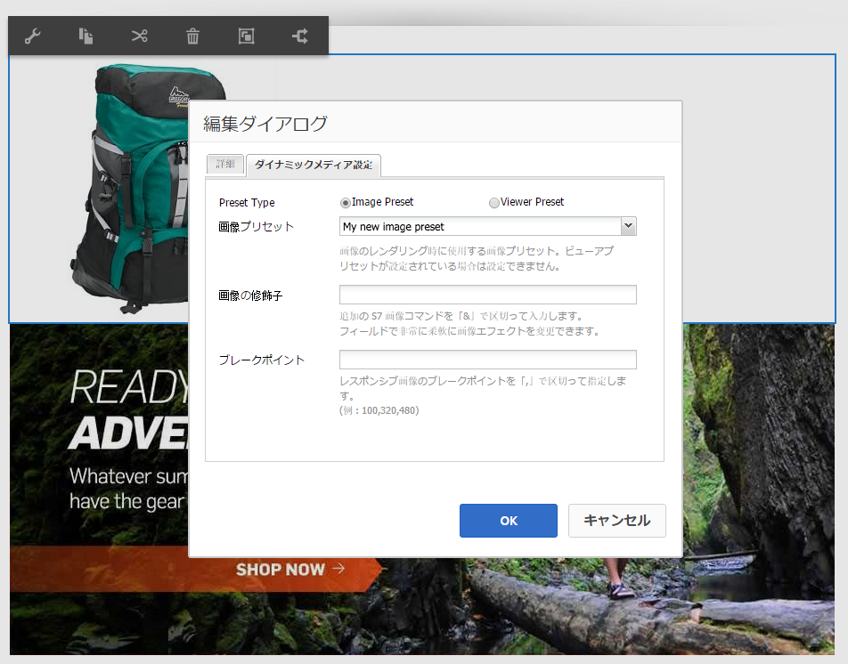
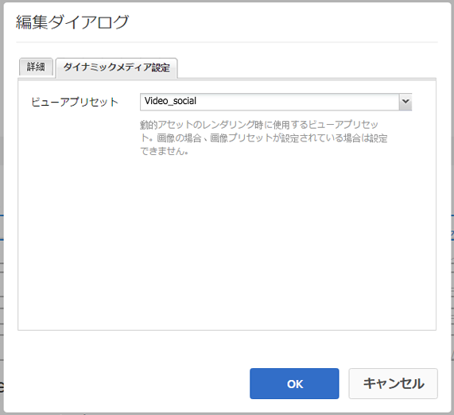

# ページへの Dynamic Media アセットの追加{#adding-dynamic-media-assets-to-pages}

To add the Dynamic Media functionality to assets you use on your websites, you can add the **[!UICONTROL Dynamic Media]** or **[!UICONTROL Interactive Media]** component directly on the page. You do this by entering [!UICONTROL Design] mode and enabling the dynamic media components. 次に、これらのコンポーネントをページに追加し、そのコンポーネントにアセットを追加できます。ダイナミックメディアコンポーネントおよびインタラクティブメディアコンポーネントはスマートであり、追加しているアセットが画像であるかビデオであるかを自動的に把握します。それに従って、使用可能なオプションが変わります。

AEMをWCMとして使用している場合は、ダイナミックメディアアセットを直接ページに追加します。

>[!NOTE]
>
>画像マップは追加設定なしでカルーセルバナーで使用できます。

## ページへの Dynamic Media コンポーネントの追加 {#adding-a-dynamic-media-component-to-a-page}

Adding the [!UICONTROL Dynamic Media] or [!UICONTROL Interactive Media] component to a page is the same as adding a component to any page. The [!UICONTROL Dynamic Media] and [!UICONTROL Interactive Media] components are described in detail in the following sections.

ページにダイナミックメディアコンポーネント／ビューアを追加するには：

1. AEM で、Dynamic Media コンポーネントを追加するページを開きます。
1. If no Dynamic Media component is available, click the ruler in the [!UICONTROL Sidekick] to enter **[!UICONTROL Design]** mode, click **[!UICONTROL Edit]** parsys, and select **[!UICONTROL Dynamic Media]** to make the Dynamic Media components available.

   >[!NOTE]
   >
   >詳しくは、[デザインモードでのコンポーネントの設定](/help/sites-authoring/default-components-designmode.md)を参照してください。

1. Return to **[!UICONTROL Edit]** mode by clicking the pencil icon in the [!UICONTROL Sidekick].
1. Drag the **[!UICONTROL Dynamic Media]** or **[!UICONTROL Interactive Media]** component from the **[!UICONTROL Other]** group in the sidekick onto the page in the desired location.
1. 「**[!UICONTROL 編集]**」をクリックしてコンポーネントを開きます。
1. コンポーネントの編集を必要に応じておこない、「**[!UICONTROL OK]**」をクリックして変更内容を保存します。

## Dynamic Media コンポーネント {#dynamic-media-components}

[!UICONTROL ダイナミックメディア] と [!UICONTROL インタラクティブメディア] は、ダイナミックメディアの [!UICONTROL 下のサイドキックで利用でき]**[!UICONTROL ます。]****[!UICONTROL インタラクティブメディア]**&#x200B;コンポーネントは、すべてのインタラクティブアセット（インタラクティブビデオ、インタラクティブ画像、カルーセルセットなど）に使用します。その他すべてのダイナミックメディアコンポーネントでは、**[!UICONTROL ダイナミックメディア]**&#x200B;コンポーネントを使用します。

>[!NOTE]
>
>これらのコンポーネントはデフォルトでは使用できません。使用する前にデザインモードで選択しておく必要があります。[コンポーネントをデザインモードで使用できるようになったら](/help/sites-authoring/default-components-designmode.md)、他のAEMコンポーネントと同様に、コンポーネントをページに追加できます。

### Dynamic Media コンポーネント {#dynamic-media-component}

ダイナミックメディアコンポーネントはスマートです。画像を追加するかビデオを追加するかに応じて、様々なオプションがあります。 このコンポーネントは画像プリセット、画像ベースのビューア（画像セット、スピンセット、混在メディアセットなど）およびビデオをサポートします。また、ビューアはレスポンシブです。 つまり、画面のサイズは、画面のサイズに基づいて自動的に変更されます。 すべてのビューアはHTML5ベースのビューアです。

>[!NOTE]
>
>When you add the [!UICONTROL Dynamic Media] component, and **[!UICONTROL Dynamic Media Settings]** is blank or you cannot add an asset properly, check the following:
>
>* [Dynamic Media を有効にしている](/help/assets/config-dynamic.md)こと。Dynamic Media はデフォルトで無効になっています。
>* 画像が PTIFF（Pyramid TIFF）ファイルであること。Dynamic Media を有効にする前に読み込まれた画像には、pyramid tiff ファイルはありません。

>

#### 画像を操作する場合 {#when-working-with-images}

The [!UICONTROL Dynamic Media] component lets you add dynamic images, including image sets, spin sets, and mixed media sets. You can zoom in, zoom out, and if applicable turn an image within a spin set or select an image from another type of set.

また、ビューアプリセット、画像プリセットまたは画像形式をコンポーネント内で直接設定することもできます。画像をレスポンシブにするために、ブレークポイントの設定かレスポンシブ画像プリセットの適用のいずれかを実行できます。

You can edit the following Dynamic Media settings by clicking **[!UICONTROL Edit]** in the component and then clicking the **[!UICONTROL Dynamic Media Settings]** tab.

>[!NOTE]
>
>デフォルトでは、Dynamic Media 画像コンポーネントはアダプティブです。If you want to make it a fixed size, set it in the component in the **[!UICONTROL Advanced]** tab with the **[!UICONTROL Width]** and **[!UICONTROL Height]** properties.

**[!UICONTROL ビューアプリセット]** — ドロップダウンメニューから既存のビューアプリセットを選択します。 探しているビューアプリセットが表示されない場合は、表示できるように設定する必要があります。詳しくは、[ビューアプリセットの管理](/help/assets/managing-viewer-presets.md)を参照してください。画像プリセットを使用している場合は、ビューアプリセットを選択できません。逆の場合も同様です。

これは、画像セット、スピンセットまたは混在メディアセットを表示している場合に使用できる唯一のオプションです。表示されるビューアプリセットもスマートで、関連するビューアプリセットのみが表示されます。

**[!UICONTROL 画像プリセット]** — ドロップダウンメニューから既存の画像プリセットを選択します。 探している画像プリセットが表示されない場合は、表示できるように設定する必要があります。[画像プリセットの管理](/help/assets/managing-image-presets.md)を参照してください。画像プリセットを使用している場合は、ビューアプリセットを選択できません。逆の場合も同様です。

このオプションは、画像セット、スピンセットまたは混在メディアセットを表示している場合には使用できません。

**[!UICONTROL 画像修飾子]** — 画像効果を変更するには、追加の画像コマンドを指定します。 These are described in [Managing Image Presets](/help/assets/managing-viewer-presets.md) and the [Command reference](https://docs.adobe.com/content/help/ja-JP/dynamic-media-developer-resources/image-serving-api/image-serving-api/http-protocol-reference/command-reference/c-command-reference.translate.html).

このオプションは、画像セット、スピンセットまたは混在メディアセットを表示している場合には使用できません。

**[!UICONTROL ブレークポイント]** — レスポンシブサイトでこのアセットを使用する場合は、ページのブレークポイントを追加する必要があります。 画像のブレークポイントをコンマ（,）で区切って指定する必要があります。このオプションを使用できるのは、画像プリセットで高さまたは幅が定義されていないときです。

このオプションは、画像セット、スピンセットまたは混在メディアセットを表示している場合には使用できません。

You can edit the following [!UICONTROL Advanced Settings] by clicking **[!UICONTROL Edit]** in the component.

**[!UICONTROL タイトル]** — 画像のタイトルを変更します。

**[!UICONTROL 代替テキスト]** — グラフィックをオフにしているユーザーの画像のタイトル。

このオプションは、画像セット、スピンセットまたは混在メディアセットを表示している場合には使用できません。

**[!UICONTROL URL、開く場所]** — アセットを設定して、リンクを開くことができます。 Set the **[!UICONTROL URL]** and **[!UICONTROL Open in]** to indicate whether you want it to open in the same window or a new window.

このオプションは、画像セット、スピンセットまたは混在メディアセットを表示している場合には使用できません。

**[!UICONTROL 幅と高さ]** — 画像を固定サイズにする場合は、値をピクセル単位で入力します。 これらの値を空にすると、アダプティブなアセットになります。

#### When working with video {#when-working-with-video}

Use the [!UICONTROL Dynamic Media] component to add dynamic video to your web pages. When you edit the component you can choose to use a predefined video viewer preset for playing the video on the page.

You can edit the following [!UICONTROL Dynamic Media Settings] by clicking **[!UICONTROL Edit]** in the component.

>[!NOTE]
>
>デフォルトでは、Dynamic Media ビデオコンポーネントはアダプティブです。ビデオコンポーネントを固定サイズにする場合は、そのコンポーネントで、「**[!UICONTROL 詳細]**」タブの「**[!UICONTROL 幅]**」と「**[!UICONTROL 高さ]**」を使用してサイズを設定します。

**[!UICONTROL ビューアプリセット]** — ドロップダウンメニューから既存のビデオビューアプリセットを選択します。 探しているビューアプリセットが表示されない場合は、表示できるように設定する必要があります。詳しくは、[ビューアプリセットの管理](/help/assets/managing-viewer-presets.md)を参照してください。

You can edit the following [!UICONTROL Advanced] settings by clicking **[!UICONTROL Edit]** in the component.

**[!UICONTROL タイトル]** — ビデオのタイトルを変更します。

**[!UICONTROL 幅と高さ]** — ビデオを固定サイズにする場合は、値をピクセル単位で入力します。 これらの値を空にすると、アダプティブな画像になります。

#### セキュアビデオの配信方法 {#how-to-delivery-secure-video}

AEM 6.2 で [FP-13480](https://experience.adobe.com/#/downloads/content/software-distribution/en/aem.html?package=/content/software-distribution/en/details.html/content/dam/aem/public/adobe/packages/cq620/featurepack/cq-6.2.0-featurepack-13480) をインストールする場合、ビデオをセキュア SSL 接続（HTTPS）と非セキュア接続（HTTP）のどちらで配信するかを制御できます。デフォルトでは、ビデオ配信プロトコルは、埋め込み Web ページのプロトコルから自動的に継承されます。Web ページが HTTPS で読み込まれる場合、ビデオも HTTPS で配信されます。逆の場合も同様です。Web ページが HTTP で読み込まれる場合、ビデオも HTTP で配信されます。ほとんどの場合、このデフォルトの動作で問題ないため、特に設定を変更する必要はありません。ただし、ビデオをセキュアに配信するために、`VideoPlayer.ssl=on` を URL パスの最後に付加するか、または埋め込みコードスニペットにある他のビューアの設定パラメーターのリストに付加して、このデフォルトの動作をオーバーライドすることができます。

ビデオのセキュア配信、および URL パスの `VideoPlayer.ssl` 設定属性の使用について詳しくは、『ビューアリファレンスガイド』の「[ビデオのセキュア配信](https://docs.adobe.com/content/help/en/dynamic-media-developer-resources/library/viewers-aem-assets-dmc/video/c-html5-video-viewer-20-securevideodelivery.html)」を参照してください。ビデオビューアの他に、セキュアビデオ配信は混在メディアビューアとインタラクティブビデオビューアで使用できます。

### インタラクティブメディアコンポーネント {#interactive-media-component}

インタラクティブメディアコンポーネントは、インタラクティビティ（ホットスポットまたは画像マップ）を含むアセット用です。インタラクティブ画像、インタラクティブビデオまたはカルーセルバナーがある場合は、**[!UICONTROL インタラクティブメディア]**&#x200B;コンポーネントを使用します。

The [!UICONTROL Interactive Media] component is smart – depending on whether you add an image or a video, you have various options. また、ビューアはレスポンシブです。 つまり、画面のサイズは、画面のサイズに基づいて自動的に変更されます。 すべてのビューアはHTML5ベースのビューアです。

コンポーネントの「**[!UICONTROL 編集]**」をクリックして、次の&#x200B;**[!UICONTROL 一般]**&#x200B;設定を編集できます。

**[!UICONTROL ビューアプリセット]** — ドロップダウンメニューから既存のビューアプリセットを選択します。 探しているビューアプリセットが表示されない場合は、表示できるように設定する必要があります。ビューアプリセットを使用するには、あらかじめ公開する必要があります。詳しくは、ビューアプリセットの管理を参照してください。

**[!UICONTROL タイトル]** — ビデオのタイトルを変更します。

**[!UICONTROL 幅と高さ]** — ビデオを固定サイズにする場合は、値をピクセル単位で入力します。 これらの値を空にすると、アダプティブな画像になります。

コンポーネントの「**[!UICONTROL 編集]**」をクリックして、次の&#x200B;**[!UICONTROL 買い物かごに追加]**&#x200B;設定を編集できます。

**[!UICONTROL Show Product Asset]** — デフォルトでは、この値は選択されています。 製品アセットには、コマースモジュールで定義された製品の画像が表示されます。製品アセットを表示しない場合はチェックマークをオフにします。

**[!UICONTROL 製品価格の表示]** — デフォルトでは、この値が選択されています。 製品価格には、コマースモジュールで定義されたアイテムの価格が表示されます。製品価格を表示しない場合はチェックマークをオフにします。

**[!UICONTROL 製品フォームを表示]** — デフォルトでは、この値は選択されていません。 製品フォームには、サイズや色など製品のバリエーションが含まれます。製品のバリエーションを表示しない場合はチェックマークをオフにします。
