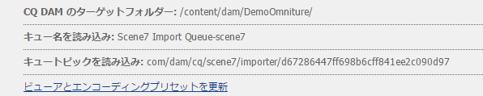
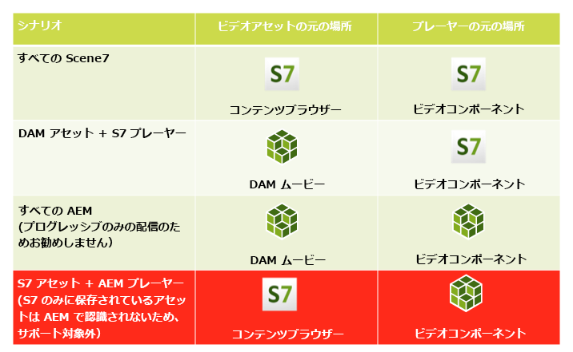

# ビデオ{#video}

アセットを使用すると、ビデオアセット管理を一元化でき、ビデオをアセットに直接アップロードして、Dynamic Media Classicに自動エンコーディングしたり、アセットから直接Dynamic Media Classicビデオにアクセスして、ページを作成したりできます。

ダイナミックMedia Classicビデオ統合により、最適化されたビデオの範囲がすべての画面（自動デバイスおよび帯域幅検出）に拡張されます。

* Dynamic Media Classic(Scene7)ビデオコンポーネントは、デバイスと帯域幅の検出を自動的に実行し、デスクトップ、タブレット、モバイルで適切な形式と品質のビデオを再生します。
* Assets - You can include adaptive video sets rather than only single video assets. An adaptive video set is a container for all video renditions required to playback video seamlessly across multiple screens. An Adaptive Video Set groups versions of the same video that are encoded at different bit rates and formats such as 400 kbps, 800 kbps, and 1000 kbps. You use an Adaptive Video Set, along with S7 video component, for adaptive video streaming across multiple screens including desktop, iOS, Android, Blackberry, and Windows mobile devices. See [Scene7 documentation about adaptive video sets for more information](https://help.adobe.com/en_US/scene7/using/WS53492AE1-6029-45d8-BF80-F4B5CF33EB08.html).

## FFMPEGとダイナミックメディアクラシックについて {#about-ffmpeg-and-scene}

デフォルトのビデオエンコーディングプロセスは、ビデオプロファイルとの FFMPEG ベースの統合の使用に基づいています。Therefore, the out-of-the-box [!UICONTROL DAM Update Asset] workflow contains the following two ffmpeg-based workflow steps:

* FFMPEG のサムネイル
* FFMPEG エンコーディング

Be aware that enabling and configuring the Dynamic Media Classic integration does not automatically remove or deactivate these two workflow steps from the out-of-the-box [!UICONTROL DAM Update Asset] ingestion workflow. FFMPEG ベースのビデオエンコーディングを既に AEM で使用している場合は、オーサリング環境に FFMPEG がインストールされている可能性があります。この場合、Assetsを使用して取り込まれた新しいビデオは2回エンコードされます。FFMPEGエンコーダーとDynamic Media Classic統合から1回のみ。

If you have the FFMPEG-based video encoding in AEM configured and FFMPEG installed, Adobe recommends that you remove the two FFMPEG workflows from your [!UICONTROL DAM Update Asset] workflows.

### サポートされるファイル形式 {#supported-formats}

ダイナミックメディアクラシックビデオコンポーネントでは、次の形式がサポートされています。

* F4V H.264
* MP4 H.264

### ビデオのアップロード先の指定 {#deciding-where-to-upload-your-video}

ビデオアセットのアップロード先の指定は、次の条件によって決まります。

* ビデオアセットのワークフローが必要かどうか
* ビデオアセットのバージョン管理が必要かどうか

これらの質問のいずれかまたは両方に対する回答が「はい」の場合は、ビデオを直接Adobe DAMにアップロードします。 両方の質問に対する回答が「いいえ」の場合は、ビデオを直接Dynamic Media Classicにアップロードします。 各シナリオのワークフローについて、次の節で説明します。

#### ビデオを直接 Adobe Assets にアップロードする場合 {#if-you-are-uploading-your-video-directly-to-adobe-assets}

アセットのワークフローまたはバージョン管理が必要な場合は、まず Adobe Assets にアップロードする必要があります。推奨されるワークフローは次のとおりです。

1. ビデオアセットをAdobe Assetsにアップロードし、自動的にエンコードしてDynamic Media Classicに公開します。
1. AEM の WCM（コンテンツファインダーの「**[!UICONTROL ムービー]**」タブ）で、ビデオアセットにアクセスします。
1. Dynamic Media ClassicビデオまたはFoundationビデオコンポーネントを使用して作成する。

#### ビデオをダイナミックメディアクラシックにアップロードする場合 {#if-you-are-uploading-your-video-to-scene}

アセットのワークフローやバージョン管理が必要ない場合は、アセットをダイナミックメディアクラシックにアップロードする必要があります。 推奨されるワークフローは次のとおりです。

1. Dynamic Media Classicで、Dynamic Media Classic( [システム自動化)にスケジュールされたFTPのアップロードとエンコーディングを設定します](https://help.adobe.com/en_US/scene7/using/WS70B173EC-4CAD-4b4c-BF9C-43A11F3A5950.html)。
1. In AEM, access video assets in WCM in the **[!UICONTROL Dynamic Media Classic]** tab of the Content Finder.
1. Dynamic Media Classicビデオコンポーネントを使用して作成する。

### ダイナミックメディアクラシックビデオとの統合の設定 {#configuring-integration-with-scene-video}

**ユニバーサルプリセットを設定するには**:

1. In **[!UICONTROL Cloud Services]**, navigate to your **[!UICONTROL Dynamic Media Classic]** configuration and click **[!UICONTROL Edit]**.
1. 「**[!UICONTROL ビデオ]**」タブを選択します。

   >[!NOTE]
   >
   >クラウド設定がページにない場合は、「**[!UICONTROL ビデオ]**」タブが表示されません。WCM用のダ [イナミックメディアクラシックの有効化を参照してくださ](#enablingscene7forwcm)い。

1. アダプティブビデオエンコーディングプロファイル、組み込みの単一のビデオエンコーディングプロファイルまたはカスタムビデオエンコーディングプロファイルを選択します。

   >[!NOTE]
   >
   >For more information about what the video presets mean, see the [Dynamic Media Classic documentation](https://help.adobe.com/en_US/scene7/using/WSE86ACF2B-BD50-4c48-A1D7-9CD4405B62D0.html).
   >
   >ユニバーサルプリセットを設定する際に両方のアダプティブビデオセットを選択するか、「**[!UICONTROL アダプティブビデオエンコーディング]**」オプションを選択することをお勧めします。

1. 選択したエンコーディングプロファイルは、このDynamic Media Classicクラウド設定用に設定したCQ DAMターゲットフォルダーにアップロードされたすべてのビデオに自動的に適用されます。 必要に応じて異なるエンコーディングターゲットーを適用するように、異なるフォルダーを持つ複数のDynamic Media Classicクラウド設定を設定できます。

### ビューアとエンコーディングプリセットの更新 {#updating-viewer-and-encoding-presets}

If you need to update the viewer and encoding presets for video in AEM because the presets have been updated in Dynamic Media Classic, navigate to the Dynamic Media Classic configuration in the cloud configuration and click **Update the viewer and encoding presets**.

### マスタービデオのアップロード {#uploading-your-master-video}

Adobe DAMからDynamic Media Classicにマスタービデオをアップロードするには：

1. Dynamic Media Classicエンコーディングターゲットを使用してクラウド設定を設定したCQ DAMプロファイルーに移動します。
1. 「**[!UICONTROL アップロード]**」をクリックして、マスタービデオをアップロードします。Video uploading and encoding is complete after the [!UICONTROL DAM Update Asset] workflow is complete and **[!UICONTROL Publish to Dynamic Media Classic]** has a checkmark.

   >[!NOTE]
   >
   >ビデオのサムネイルの生成にはある程度の時間がかかることがあります。

   Dragging the DAM master video on to the video component accesses *all* of the Dynamic Media Classic encoded proxy renditions for delivery.

### Foundationビデオコンポーネントとダイナミックメディアクラシックビデオコンポーネント {#foundation-video-component-versus-scene-video-component}

AEMを使用する場合、サイトで使用できるビデオコンポーネントと、ダイナミックメディアクラシック(Scene7)ビデオコンポーネントの両方にアクセスできます。 これらのコンポーネントに互換性はありません。

ダイナミックメディアクラシックビデオコンポーネントは、ダイナミックメディアクラシックビデオでのみ機能します。 Foundationコンポーネントは、AEM（ffmpegを使用）およびDynamic Media Classicビデオから保存されたビデオと連携します。

次の表は、どのコンポーネントをどのようなシナリオで使用すべきかを示しています。

>[!NOTE]
>
>初期設定では、ダイナミックメディアクラシックビデオコンポーネントはユニバーサルビデオプロファイルを使用します。 ただし、AEMで使用するHTML5ベースのビデオプレーヤーを取得できます。 Dynamic Media Classicで、あらかじめ用意されているHTML5ビデオプレーヤーの埋め込みコードをコピーし、AEMページに配置します。

## AEM ビデオコンポーネント {#aem-video-component}

Dynamic Media Classicビデオの表示には、Dynamic Media Classicビデオコンポーネントの使用をお勧めする場合でも、完全性を考慮して、 [!UICONTROL AEMの] Foundation Video Componentと共にDynamic Media Classicビデオを使用する方法について説明します。

### AEM Videoとダイナミックメディアクラシックビデオの比較 {#aem-video-and-scene-video-comparison}

次の表は、AEM 基盤ビデオコンポーネントと Scene7 ビデオコンポーネントでサポートされている機能の簡単な比較です。

|  | AEM 基盤ビデオ | ダイナミックメディアクラシックビデオ |
|---|---|---|
| アプローチ | HTML5 における最優先のアプローチです。Flash は HTML5 以外のフォールバックでのみ使用されます。 | ほとんどのデスクトップでは Flash です。HTML5 はモバイルとタブレットで使用されます。 |
| 配信 | プログレッシブ | アダプティブストリーミング |
| 追跡 | はい | はい |
| 拡張性 | 可 | はい（Dynamic Media ClassicビューアSDKを使用） |
| モバイルビデオ | はい | Yes |

### 設定 {#setting-up}

#### ビデオプロファイルの作成 {#creating-video-profiles}

様々なビデオエンコーディングは、Dynamic Media Classicクラウド設定で選択したDynamic Media Classicエンコーディングプリセットに従って作成されます。 Foundationビデオコンポーネントを使用するには、選択した各Dynamic Media Classicエンコーディングプリセットに対してビデオプロファイルを作成する必要があります。 これにより、対応する DAM レンディションをビデオコンポーネントで選択できます。

>[!NOTE]
>
>新しいビデオプロファイルおよびビデオプロファイルに対する変更をアクティベートして公開する必要があります。

1. AEM で、**[!UICONTROL ツール]**&#x200B;に移動し、「**[!UICONTROL 設定コンソール]**」を選択します。In the Configuration Console navigate to **[!UICONTROL Tools]** > **[!UICONTROL Assets]** > **[!UICONTROL Video Profiles]** in the navigation tree.
1. 新しいダイナミックメディアクラシックビデオプロファイルの作成 新し **[!UICONTROL い…]** メニューで「ページを作 **[!UICONTROL 成」を選択し]** 、「ダイナミックメディアクラシックビデオテンプレート」をプロファイルします。 新しいビデオプロファイルページに名前を付け、「作成」をクリ **[!UICONTROL ックしま]**&#x200B;す。

   

1. 新しいビデオプロファイルを編集します。最初にクラウド設定を選択します。次に、クラウド設定で選択したものと同じエンコーディングプリセットを選択します。

   

   | プロパティ | 説明 |
   |---|---|
   | Dynamic Media Classic(Scene7)クラウド設定 | エンコーディングプリセットで使用するクラウド設定です。 |
   | ダイナミックメディアクラシック(Scene7)エンコーディングプリセット | このビデオプロファイルをマップするために使用するエンコーディングプリセットです。 |
   | HTML5 ビデオタイプ | このプロパティを使用すると、HTML5 ビデオのソース要素の type プロパティの値を設定できます。この情報は、Dynamic Media Classicのエンコーディングプリセットでは提供されませんが、HTML5ビデオ要素を使用してビデオを適切にレンダリングするために必要です。 共通の形式用のリストが提供されますが、他の形式用に上書きできます。 |

   ビデオコンポーネントで使用する、クラウド設定で選択したすべてのエンコーディングプリセットについて、この手順を繰り返します。

#### デザインの設定 {#configuring-design}

ビデオソースリストを作成するには、基盤ビデオコンポーネントが、使用するビデオプロファイルについて認識しておく必要があります。ビデオコンポーネントのデザインダイアログを開いて、新しいビデオプロファイルを使用するためのコンポーネントのデザインを設定してください。

>[!NOTE]
>
>基盤ビデオコンポーネントをモバイルページで使用する場合は、ここに示す手順をモバイルページのデザインで繰り返す必要がある可能性があります。

>[!NOTE]
>
>デザインを変更するには、デザインのアクティベーションをおこなって、公開時に変更を有効にする必要があります。

1. 基盤ビデオコンポーネントのデザインダイアログを開き、「**[!UICONTROL プロファイル]**」タブに変更します。その後、あらかじめ用意されているプロファイルを削除し、新しいDynamic Media Classicビデオプロファイルを追加します。 デザインダイアログ内のプロファイルリストの順序は、レンダリング時のビデオソース要素の順序も定義します。
1. HTML5 をサポートしていないブラウザーの場合は、ビデオコンポーネントで Flash フォールバックを設定できます。ビデオコンポーネントのデザインダイアログを開き、「**[!UICONTROL Flash]**」タブに変更します。Flash Player 設定を指定して、Flash Player のフォールバックプロファイルを割り当てます。

#### チェックリスト {#checklist}

1. Dynamic Media Classic(Scene7)クラウド設定を作成します。 ビデオエンコーディングプリセットが設定され、インポーターが実行されていることを確認します。
1. クラウド設定で選択した各ビデオエンコーディングプロファイルに対して、Dynamic Media Classicビデオプリセットを作成します。
1. ビデオプロファイルをアクティベートする必要があります。
1. 目的のページで基盤ビデオコンポーネントの設計を設定します。
1. デザインの変更が完了したら、デザインをアクティベートします。

