# Scene7 機能をページに追加{#adding-scene-features-to-your-page}

[Adobe Scene7](https://help.adobe.com/en_US/scene7/using/WS26AB0D9A-F51C-464e-88C8-580A5A82F810.html) は、リッチメディアアセットを管理および拡張したり、Web、モバイル、電子メール、インターネットに接続されたディスプレイやプリンターにリッチメディアアセットを公開および提供したりするためのホスト型ソリューションです。

Scene7で公開されているExperience Managerアセットは、様々なビューアで表示できます。

* ズーム
* フライアウト
* ビデオ
* 画像テンプレート
* 画像

デジタルアセットはExperience ManagerからScene7に直接公開でき、デジタルアセットはScene7からExperience Managerに公開できます。

このドキュメントでは、Experience ManagerからScene7へ、またはからデジタルアセットを公開する方法について説明します。 また、ビューアについても詳しく説明します。Scene7用のExperience Managerの設定については、[Scene7とExperience Managerの統合](/help/sites-administering/scene7.md)を参照してください。

[画像マップの追加](/help/assets/image-maps.md)も参照してください。

Experience Managerでのビデオコンポーネントの使用について詳しくは、次を参照してください。

* [ビデオ](/help/sites-classic-ui-authoring/manage-assets-classic-s7-video.md)

>[!NOTE]
>
>Scene7のアセットが正しく表示されない場合は、ダイナミックメディアが[無効](/help/assets/config-dynamic.md#disabling-dynamic-media)であることを確認してから、ページを更新してください。

## Assets から手動で Scene7 に公開する {#manually-publishing-to-scene-from-assets}

クラシック UI のアセットコンソールから、またはアセットから直接 Scene7 にデジタルアセットを公開できます。

>[!NOTE]
>
>Experience Managerは、非同期でScene7に発行します。 「**公開**」をクリックした後、アセットを Scene7 に公開するまでに数秒かかる場合があります。

### アセットコンソールからの公開 {#publishing-from-the-assets-console}

アセットが Scene7 のターゲットフォルダー内にある場合に、アセットコンソールから Scene7 への公開をおこなうには：

1. Experience ManagerクラシックUIで、「**デジタルアセット**」をクリックしてデジタルアセットマネージャーにアクセスします。

1. Scene7 に公開するターゲットフォルダー内からアセットまたはフォルダーを選択して右クリックし、「**Scene7 に公開**」を選択します。または、**ツールメニュー**&#x200B;から「**Scene7**&#x200B;に公開」を選択します。

   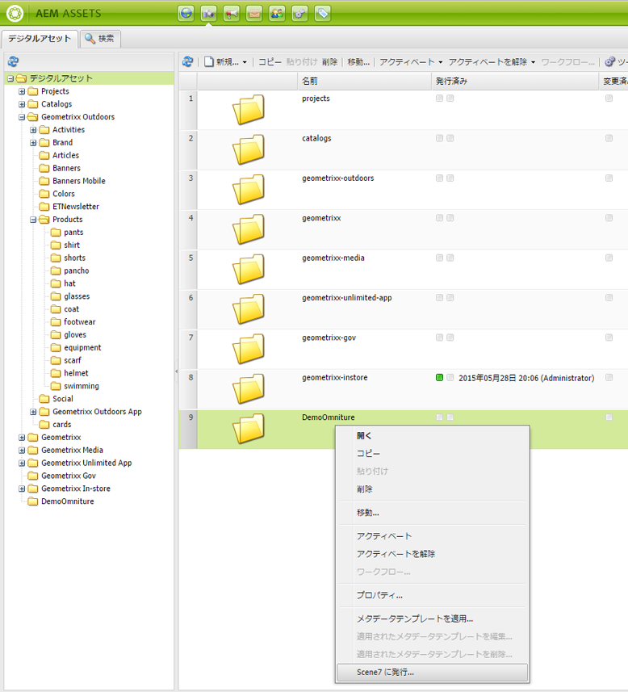

1. Scene7 に移動して、アセットが使用可能であることを確認します。

   >[!NOTE]
   >
   >同期された Scene7 フォルダーにアセットがない場合、どちらのメニューにも「**Scene7 に公開**」が表示されますが、無効になっています。

### アセットからの公開  {#publishing-from-an-asset}

同期された Scene7 フォルダー内にアセットがある場合は、そのアセットを手動で公開できます。

>[!NOTE]
>
>同期された Scene7 フォルダーにアセットがない場合は、「**Scene7 に発行**」へのリンクが表示されません。

デジタルアセットから直接 Scene7 に公開するには：

1. Experience Managerで、「**デジタルアセット**」をクリックしてデジタルアセットマネージャーにアクセスします。

1. アセットをダブルクリックして開きます。

1. アセットの詳細パネルで、「**Scene7 に公開**」を選択します。

   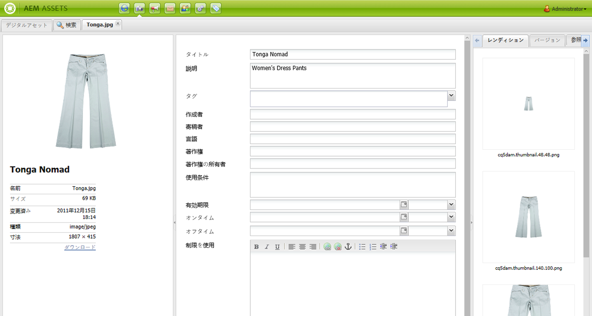

1. リンクが「**公開中**」、「**公開済み**」の順に変わります。Scene7 に移動して、アセットが使用可能であることを確認します。

   >[!NOTE]
   >
   >アセットが Scene7 に適切に公開されない場合は、リンクが「**公開に失敗**」に変わります。アセットが既に Scene7 に公開されている場合は、リンクが「**Scene7 に再公開**」に変わります。再公開を使用すると、Experience Manager内のアセットに変更を加えて再公開できます。

### CQ のターゲットフォルダー以外からのアセットの公開 {#publishing-assets-from-outside-the-cq-target-folder}

Adobeでは、Scene7ターゲットフォルダ内のアセットからのみ、アセットをScene7に発行することをお勧めします。ただし、ターゲットフォルダー外のフォルダーからアセットをアップロードする必要がある場合は、Scene7の&#x200B;**アドホック**&#x200B;フォルダーにアップロードしてアップロードできます。

そのためには、アセットが表示されるページ用のクラウド設定を最初に指定します。次に、Scene7 コンポーネントをページに追加して、そのコンポーネント上にアセットをドラッグ＆ドロップします。そのページのページプロパティが設定されると、**「Scene7に公開」**&#x200B;リンクが表示され、選択するとScene7へのアップロードがトリガーされます。

>[!NOTE]
>
>アドホックフォルダー内のアセットは、Scene7 コンテンツブラウザーには表示されません。

CQ のターゲットフォルダー以外にあるアセットを公開するには：

1. クラシックUIのExperience Managerで、「**Webサイト**」をクリックし、まだScene7に公開されていないデジタルアセットを追加するWebページに移動します。 （通常のページ継承ルールが適用されます）。

1. サイドキックで&#x200B;**ページ**&#x200B;アイコンをクリックし、「**ページのプロパティ**」をクリックします。

1. 「**クラウドサービス**」をクリックし、「**サービスを追加**」をクリックして、「**Scene7**」を選択します。
1. **Adobe Scene7** ドロップダウンリストで必要な設定を選択して、「**OK**」をクリックします。

   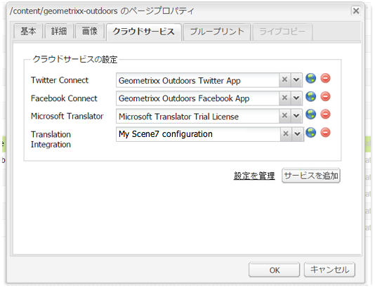

1. Web ページで、必要な場所に Scene7 コンポーネントを追加します。
1. コンテンツファインダーから、デジタルアセットをコンポーネントにドラッグします。「**Scene7 発行ステータスを確認**」のリンクが表示されます。

   >[!NOTE]
   >
   >デジタルアセットがCQターゲットフォルダーにある場合、**Scene7パブリケーションのステータスを確認**&#x200B;へのリンクは表示されません。アセットは、コンポーネント内に配置されるだけです。

   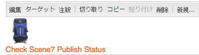

1. 「**Scene7 公開ステータスを確認**」をクリックします。アセットが公開されていない場合、Experience ManagerはアセットをScene7に公開します。 アップロードされたアセットは、アドホックフォルダーに配置されます。デフォルトでは、アドホックフォルダーは **name_of_the_company/CQ5_adhoc** にあります。[必要に応じて、この場所を設定](#configuringtheadhocfolder)できます。

   >[!NOTE]
   >
   >同期された Scene7 フォルダーにアセットがなく、Scene7 クラウド設定が現在のページに関連付けられていない場合は、アップロードが失敗します。

## Scene7 コンポーネント  {#scene-components}

Experience Managerでは、次のScene7コンポーネントを使用できます。

* ズーム
* フライアウト（ズーム）
* 画像テンプレート
* 画像
* ビデオ

>[!NOTE]
>
>これらのコンポーネントはデフォルトでは使用できません。使用する前にデザインモードで選択しておく必要があります。

コンポーネントをデザインモードで使用可能にした後は、他のExperience Managerコンポーネントと同様に、コンポーネントをページに追加できます。 Scene7 にまだ公開されていないアセットは、そのアセットが同期されたフォルダー内またはページ上にあるか、Scene7 クラウド設定を使用していれば、Scene7 に公開されます。

>[!NOTE]
>
>カスタムS7ビューアを作成して開発し、コンテンツファインダーを使用する場合は、**allowfullscreen**&#x200B;パラメーターを明示的に追加する必要があります。

### Flash ビューアのサポート終了に関する通知 {#flash-viewers-end-of-life-notice}

Adobe Scene7 は、Flash ビューアプラットフォームのサポートを 2017 年 1 月 31 日に正式に終了します。

この重要な変更について詳しくは、[Flash ビューアのサポート終了に関する FAQ](https://docs.adobe.com/content/docs/jp/aem/6-1/administer/integration/marketing-cloud/scene7/flash-eol.html) を参照してください。

### ページへの Scene7 コンポーネントの追加  {#adding-a-scene-component-to-a-page}

ページに Scene7 コンポーネントを追加する手順は、他のページにコンポーネントを追加する手順と同じです。以降の節で、Scene7 コンポーネントについて詳しく説明します。

クラシック UI を使用して、ページに Scene7 コンポーネント／ビューアを追加するには：

1. 「Experience Manager」で、Scene7コンポーネントを追加するページを開きます。

1. 使用できる Scene7 コンポーネントがない場合は、サイドキックの定規アイコンをクリックして&#x200B;**デザイン**&#x200B;モードに切り替え、parsys の「**編集**」をクリックし、**Scene7** コンポーネントをすべて選択して使用可能にします。

1. サイドキックの鉛筆をクリックして、**編集**&#x200B;モードに戻ります。

1. サイドキックの **Scene7** グループから目的の場所のページへ、コンポーネントをドラッグします。

1. 「**編集**」をクリックしてコンポーネントを開きます。

1. コンポーネントの編集を必要に応じておこない、「**OK**」をクリックして変更内容を保存します。

### レスポンシブ Web サイトへのインタラクティブな表示エクスペリエンスの追加  {#adding-interactive-viewing-experiences-to-a-responsive-website}

アセットのレスポンシブデザインとは、アセットが表示される場所に適応することを意味します。レスポンシブデザインを使用すると、同じアセットを複数のデバイスで効果的に表示できます。

クラシック UI を使用して、レスポンシブサイトにインタラクティブな表示エクスペリエンスを追加するには：

1. Experience Managerにログインし、[構成済みのAdobe Scene7Cloud Services](/help/sites-administering/scene7.md#configuring-scene-integration)があり、Scene7のコンポーネントが使用可能であることを確認します。

   >[!NOTE]
   >
   >Scene7のWCMコンポーネントが使用できない場合は、デザインモードを使用してコンポーネントを必ず有効にしてください。

1. Scene7 コンポーネントが有効な Web サイトで、**画像**&#x200B;ビューアをページにドラッグします。
1. コンポーネントを編集し、「**Scene7 設定**」タブでブレークポイントを調整します。

   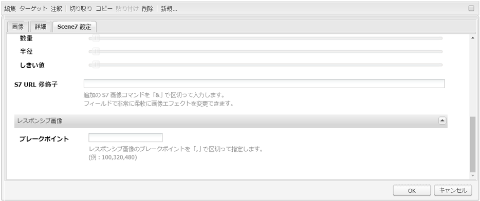

1. ビューアがレスポンシブにサイズ変更され、すべてのインタラクションがデスクトップ、タブレットおよびモバイル用に最適化されていることを確認します。

### Scene7 のすべてのコンポーネントに共通の設定  {#settings-common-to-all-scene-components}

設定オプションはコンポーネントによって異なりますが、次のオプションはすべての Scene7 コンポーネントに共通です。

* **ファイル参照**- 参照するファイルを探します。「ファイル参照」には、アセットの URL が表示されます。これは必ずしも、URL コマンドおよびパラメーターを含む Scene7 の完全な URL ではありません。このフィールドに Scene7 の URL コマンドおよびパラメーターを追加することはできません。それらは、コンポーネントの対応する機能を使用して追加する必要があります。
* **幅** - 幅を設定できます。
* **高さ** - 高さを設定できます。

これらの設定オプションは、Scene7 コンポーネントを開く（ダブルクリックする）ことで設定できます。例えば、**ズーム**&#x200B;コンポーネントを開く場合は、次のようになります。

### ズーム {#zoom}

HTML5 ズームコンポーネントでは、+ ボタンをクリックすると画像のサイズが拡大されます。

アセットの下部にはズームツールが用意されています。拡大するには「**+** 」、縮小するには「**-**」をクリックします。**x**&#x200B;またはズームリセット矢印をクリックすると、画像が読み込み元のサイズに戻ります。 全画面表示にするには、斜め矢印をクリックします。コンポーネントを設定するには、「**編集**」をクリックします。このコンポーネントを使用すると、すべてのScene7コンポーネント](#settings-common-to-all-scene-components)に共通の[設定を構成できます。

### Flyout {#flyout}

HTML5 フライアウトコンポーネントでは、アセットが分割画面として表示されます。左側には、アセットが指定されたサイズで表示され、右側には、ズーム部分が表示されます。コンポーネントを設定するには、「**編集**」をクリックします。このコンポーネントを使用すると、すべてのScene7コンポーネント](/help/sites-administering/scene7.md#settingscommontoallscene7components)に共通の[設定を構成できます。

>[!NOTE]
>
>フライアウトコンポーネントでカスタムサイズを使用する場合は、そのカスタムサイズが使用され、コンポーネントのレスポンシブ設定は無効になります。
>
>デザイン表示で設定されたデフォルトサイズをフライアウトコンポーネントで使用する場合は、デフォルトサイズが使用され、コンポーネントが引き伸ばされ、コンポーネントのレスポンシブセットアップに合わせてページレイアウトサイズが調整されます。ただし、コンポーネントのレスポンシブセットアップには制限があることに注意してください。レスポンシブ設定でフライアウトコンポーネントを使用する場合は、フルページでの拡大縮小で使用しないでください。そうしないと、フライアウトがページの右の境界線を越える場合があります。

### 画像 {#image}

Scene7 画像コンポーネントを使用すると、Scene7 の機能（Scene7 の修飾子、画像またはビューアのプリセット、シャープニングなど）を画像に追加できます。Scene7のイメージコンポーネントは、Experience Manager上の他のイメージコンポーネントと似ており、特別なScene7機能を持っています。 次の例では、Scene7 の URL 修飾子である **&amp;op_invert=1** が画像に適用されています。

**タイトル、代替** テキスト「詳細」タブで、画像にタイトルを追加し、グラフィックをオフにしているユーザーの代替テキストを追加します。

**URL、開くアセ** ットを設定して、リンクを開くことができます。「URL」と「次のウィンドウで開く」で、同じウィンドウで開くか新しいウィンドウで開くかを指定します。

**ビューア** プリセットドロップダウンメニューから既存のビューアプリセットを選択します。探しているビューアプリセットが表示されない場合は、表示できるように設定する必要があります。詳しくは、ビューアプリセットの管理を参照してください。画像プリセットを使用している場合は、ビューアプリセットを選択できません。逆の場合も同様です。

**Scene7** 設定Scene7 Publishing Systemからアクティブな画像プリセットを取得する際に使用するScene7設定を選択します。

**画像** プリセットドロップダウンメニューから既存の画像プリセットを選択します。探している画像プリセットが表示されない場合は、表示できるように設定する必要があります。「画像プリセットの管理」を参照してください。画像プリセットを使用している場合は、ビューアプリセットを選択できません。逆の場合も同様です。

**出力** 形式画像の出力形式を選択します（jpegなど）。選択する出力形式によっては、追加の設定オプションが表示される場合があります。画像プリセットのベストプラクティスを参照してください。

**シ** ャープ画像にシャープを適用する方法を選択します。シャープニングについて詳しくは、画像プリセットのベストプラクティスおよびシャープニングのベストプラクティスを参照してください。

**URL** 修飾子画像効果を変更するには、S7の追加の画像コマンドを指定します。詳しくは、画像プリセットおよび「コマンドリファレンス」を参照してください。

**ブレ** ークポイントWebサイトがレスポンシブな場合は、ブレークポイントを調整する必要があります。ブレークポイントはコンマ（,）で区切って指定してください。

### 画像テンプレート {#image-template}

[Scene7 画像テンプレート](https://help.adobe.com/en_US/scene7/using/WS60B68844-9054-4099-BF69-3DC998A04D3C.html)は、Scene7 に読み込まれた Photoshop コンテンツに重ねて適用されます。Scene7 では、可変性を考慮してコンテンツとプロパティがパラメーター化されています。**画像テンプレート**&#x200B;コンポーネントを使用すると、Experience Manager内で画像を読み込んでテキストを動的に変更できます。 また、ClientContext の値を使用するように&#x200B;**画像テンプレート**&#x200B;コンポーネントを設定できます。これにより、各ユーザーが個別に画像を活用できます。

「**編集**」をクリックして、コンポーネントを設定します。[すべてのScene7コンポーネント](/help/sites-administering/scene7.md#settingscommontoallscene7components)に共通の設定と、この節で説明する他の設定を構成できます。

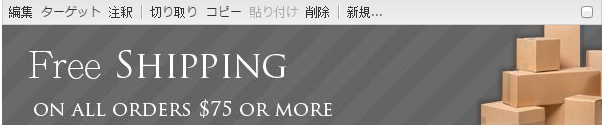

**ファイル参照、幅、** 高さすべてのScene7コンポーネントに共通の設定を参照してください。

>[!NOTE]
>
>Scene7 の URL コマンドおよびパラメーターを「ファイル参照」の URL に直接追加することはできません。これらは、**パラメーター**&#x200B;パネルのコンポーネントの UI でのみ定義できます。

**タイトル、代替** テキスト「Scene7画像テンプレート」タブで、画像にタイトルを追加し、グラフィックをオフにしているユーザ用の代替テキストを追加します。

**URL、開くアセ** ットを設定して、リンクを開くことができます。「URL」と「次のウィンドウで開く」で、同じウィンドウで開くか新しいウィンドウで開くかを指定します。

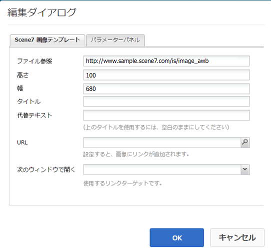

**パラメータ** パネル画像を読み込むと、パラメータに画像の情報が事前に入力されます。動的に変更できるコンテンツがない場合、このウィンドウは空になります。

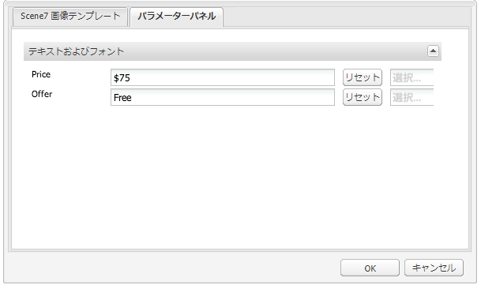

#### テキストの動的な変更 {#changing-text-dynamically}

テキストを動的に変更するには、新しいテキストをフィールドに入力して、「**OK**」をクリックします。この例では、「**価格**」が $50 で、送料が 99 セントです。

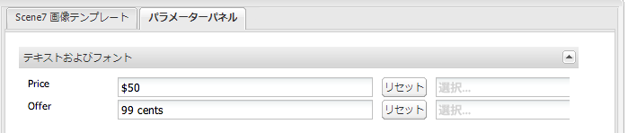

画像内のテキストが変更されます。フィールドの横にある「**リセット**」をクリックすると、テキストを元の値に戻すことができます。

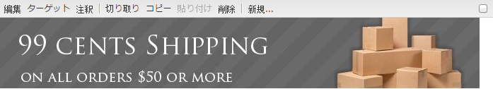

#### ClientContext の値を反映したテキストの変更 {#changing-text-to-reflect-the-value-of-a-client-context-value}

フィールドをクライアントコンテキスト値にリンクするには、「**選択**」をクリックしてクライアントコンテキストメニューを開き、クライアントコンテキストを選択して「**OK**」をクリックします。この例では、名前が、プロファイル内の形式設定された名前と名前をリンクすることに基づいて変更されます。

現在ログインしているユーザーの名前がテキストに反映されます。フィールドの横にある「**リセット**」をクリックすると、テキストを元の値に戻すことができます。

#### Scene7 画像テンプレートのリンク化 {#making-the-scene-image-template-a-link}

Scene7 画像テンプレートコンポーネントをクリック可能なリンクにするには：

1. Scene7 画像テンプレートコンポーネントを含むページで、「**編集**」をクリックします。
1. 「**URL**」フィールドに、ユーザーが画像をクリックしたときに表示される URL を入力します。「**次のウィンドウで開く**」フィールドで、ターゲットを新しいウィンドウと同じウィンドウのどちらで開くかを選択します。

   

1. 「**OK**」をクリックします。

### ビデオコンポーネント {#video-component}

Scene7 **ビデオ**&#x200B;コンポーネント(サイドキックのScene7セクションから入手可能)は、デバイスと帯域幅検出を使用して、各画面に適切なビデオを提供します。このコンポーネントは、HTML5ビデオプレーヤーです。複数のチャネルで使用できる単一のビューアです。

このコンポーネントはアダプティブビデオセット（単一の MP4 ビデオまたは単一の F4V ビデオ）で使用できます。

ビデオと Scene7 統合との連携について詳しくは、[ビデオ](/help/sites-classic-ui-authoring/manage-assets-classic-s7-video.md)を参照してください。また、[**Scene7 ビデオ**&#x200B;コンポーネントと基盤&#x200B;**ビデオ**&#x200B;コンポーネントとの比較](/help/sites-classic-ui-authoring/manage-assets-classic-s7-video.md)も参照してください。

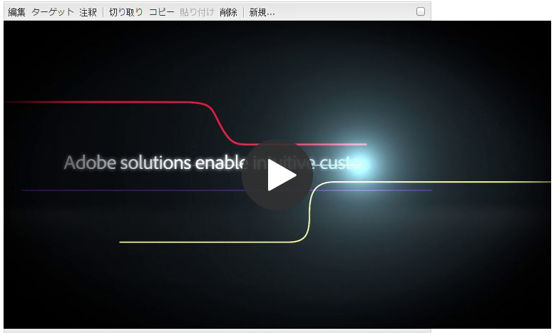

### ビデオコンポーネントに関する既知の制限事項 {#known-limitations-for-the-video-component}

AdobeDAMとWCMは、プライマリソースビデオがアップロードされたかどうかを表示します。 次に示すプロキシアセットは表示されません。

* Scene7 のエンコードされたレンディション
* Scene7 のアダプティブビデオセット

Scene7 ビデオコンポーネントと共にアダプティブビデオセットを使用する場合は、ビデオのサイズに合わせてコンポーネントのサイズを変更する必要があります。

## Scene7 コンテンツブラウザー {#scene-content-browser}

Scene7のコンテンツブラウザーを使用すると、Scene7から直接表示でコンテンツをExperience Managerできます。 コンテンツブラウザーにアクセスするには、コンテンツファインダーで、タッチ操作向けユーザーインターフェイスの&#x200B;**Scene7**&#x200B;またはクラシックユーザーインターフェイスの&#x200B;**S7**&#x200B;アイコンを選択します。 どちらの UI を使用しても機能は同じです。

複数の設定がある場合、Experience Managerはデフォルトで[デフォルトの設定](/help/sites-administering/scene7.md#configuring-a-default-configuration)を表示します。 Scene7 コンテンツブラウザーのドロップダウンメニューで、別の設定を直接選択できます。

>[!NOTE]
>
>* アドホックフォルダー内のアセットは、Scene7 コンテンツブラウザーには表示されません。
>* [セキュアプレビューが有効](/help/sites-administering/scene7.md#configuring-the-state-published-unpublished-of-assets-pushed-to-scene)なときは、Scene7 の公開、非公開の両方のアセットが、Scene7 コンテンツブラウザーに表示されます。
>* コンテンツブラウザーに&#x200B;**Scene7**&#x200B;または&#x200B;**S7**&#x200B;アイコンが表示されない場合は、[Experience Manager](/help/sites-administering/scene7.md)で動作するようにScene7を設定する必要があります。
>* Scene7 コンテンツブラウザーでは、次のビデオがサポートされます。
   >   * アダプティブビデオセット：複数の画面でシームレスに再生するために必要なすべてのビデオレンディションのコンテナ
   >   * 単一の MP4 ビデオ
   >   * 単一の F4V ビデオ

### コンテンツの参照{#browsing-content-in-the-classic-ui}

Scene7 でコンテンツを参照するには、「**S7**」タブをクリックします。

アクセスする設定を変更するには、設定を選択します。選択した設定に応じてフォルダーが変わります。

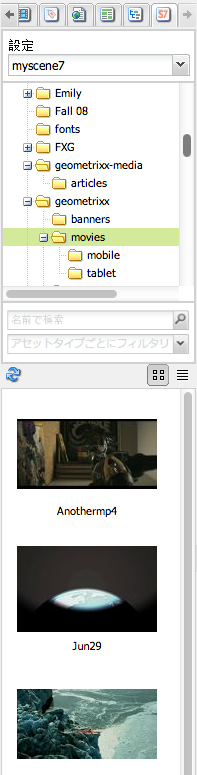

アセット用のコンテンツファインダーと同様に、アセットを検索して、結果にフィルターを適用できます。ただし、アセットファインダーとは異なり、「**S7**」タブでキーワードを入力すると、そのキーワードが&#x200B;**含まれる**&#x200B;ファイル名ではなく、入力した文字列&#x200B;**で始まる**&#x200B;ファイル名が検索されます。

デフォルトでは、アセットはファイル名で表示されます。結果をアセットタイプでフィルタリングすることもできます。

>[!NOTE]
>
>WCM の Scene7 コンテンツブラウザーでは、次のビデオがサポートされます。
>
>* アダプティブビデオセット：複数の画面でシームレスに再生するために必要なすべてのビデオレンディションのコンテナ
>* 単一の MP4 ビデオ
>* 単一の F4V ビデオ

>

### コンテンツブラウザーでの Scene7 アセットの検索 {#searching-for-scene-assets-with-the-content-browser}

Scene7資産の検索は、Experience Manager資産の検索と似ていますが、検索を行うと、実際にはExperience Managerに直接読み込むのではなく、Scene7の表示にある資産が検索されます。

クラシック UI またはタッチ操作向け UI を使用して、アセットを表示および検索できます。インターフェイスによって検索方法は多少異なります。

どちらの UI で検索する場合でも、次の基準でフィルターを適用できます（ここでは、タッチ操作向け UI を示しています）。

**キー** ワードを入力アセットを名前で検索できます。検索時には、入力したキーワードで始まるファイル名が検索されます。例えば、「swimming」という単語を入力すると、入力した順序どおりの文字列で始まるアセットファイルの名前が検索されます。アセットを検索するには、語句を入力した後に Enter キーを押してください。

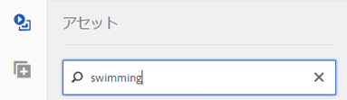

**Folder/** path表示されるフォルダーの名前は、選択した設定に基づきます。下位にドリルダウンするには、フォルダーアイコンをクリックしてサブフォルダーを選択し、チェックマークをクリックして選択します。

キーワードを入力してフォルダを選択すると、Experience Managerはそのフォルダとサブフォルダを検索します。 ただし、検索時にキーワードを入力しない場合は、フォルダーを選択してもそのフォルダー内のアセットしか表示されず、サブフォルダーは含まれません。

デフォルトでは、Experience Managerは選択されたフォルダとすべてのサブフォルダを検索します。

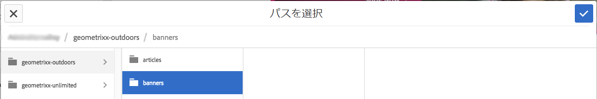

**AssetSelectのタイプ** Scene7のコンテンツを参照するには、Scene7を選択します。このオプションは、Scene7 が設定されている場合にのみ使用できます。

**** 設定Cloud Servicesで複数のScene7設定が定義されている場合は、ここで選択できます。そのため、選択した設定に基づいてフォルダーが変わります。

**アセット** タイプScene7ブラウザ内で、結果をフィルタして次のいずれかを含めることができます。画像、テンプレート、ビデオおよびアダプティブビデオセットを参照してください。アセットタイプを選択しない場合、初期設定では、Experience Managerはすべてのアセットタイプを検索します。

>[!NOTE]
>
>* クラシック UI では、**Flash** と **FXG** も検索できます。現時点では、タッチ対応 UI でのこれらのフィルタリングはサポートされていません。
   >
   >
* ビデオを検索するときは、単一のレンディションが検索されています。結果では、元のレンディション（*.mp4 のみ）と、エンコードされたレンディションが返されます。
* アダプティブビデオセットを検索する場合、フォルダとすべてのサブフォルダが検索されますが、検索にキーワードを追加した場合のみ検索されます。 キーワードを追加していない場合、Experience Managerはサブフォルダを検索しません。

**発行** ステータス発行ステータスに基づいて、アセットをフィルタリングできます。非公開または公開済み。「公開ステータス」を選択しない場合、Experience Managerはデフォルトで、すべての公開ステータスを検索します。

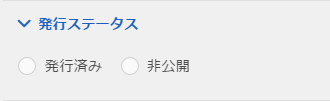
