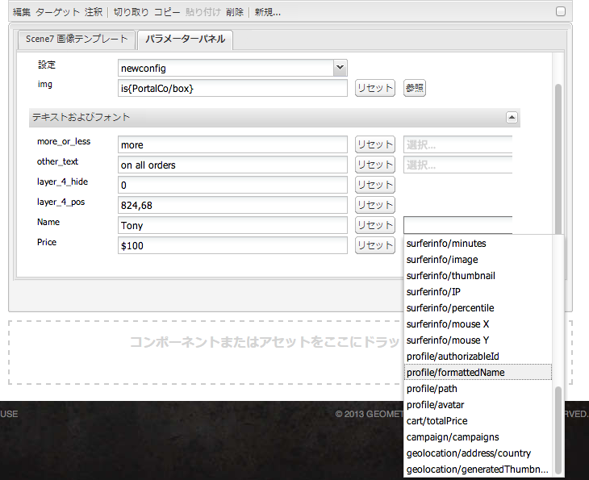
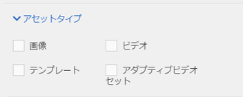

# Dynamic Media Classic(Scene7)機能のページへの追加{#adding-scene-features-to-your-page}

[AdobeDynamic Media Classic(Scene7)](https://experienceleague.adobe.com/docs/dynamic-media-classic/using/home.html) は、Web、モバイル、Eメールおよびインターネットに接続されたディスプレイと印刷物に対するリッチメディアアセットの管理、強化、公開、配信を行うホストソリューションです。

Dynamic Media Classic(Scene7)で公開されたExperience Managerアセットは、様々なビューアで表示できます。

* ズーム
* フライアウト
* ビデオ
* 画像テンプレート
* 画像

デジタルアセットをExperience ManagerからDynamic Media Classic(Scene7)に直接公開したり、Dynamic Media Classic(Scene7)からExperience Managerに公開したりできます。

このドキュメントでは、Experience ManagerからDynamic Media Classic(Scene7)にデジタルアセットを公開する方法と、反対に、 また、ビューアについても詳しく説明します。Dynamic Media Classic(Scene7)のExperience Managerの設定について詳しくは、[Dynamic Media Classic(Scene7)とExperience Manager](/help/sites-administering/scene7.md)の統合を参照してください。

[画像マップの追加](/help/assets/image-maps.md)も参照してください。

ビデオコンポーネントをExperience Managerと共に使用する方法について詳しくは、次を参照してください。

* [ビデオ](/help/sites-classic-ui-authoring/manage-assets-classic-s7-video.md)

>[!NOTE]
>
>Dynamic Media Classic(Scene7)のアセットが正しく表示されない場合は、Dynamic Mediaが[無効](/help/assets/config-dynamic.md#disabling-dynamic-media)になっていることを確認してから、ページを更新してください。

## AssetsからDynamic Media Classic(Scene7)への手動公開 {#manually-publishing-to-scene-from-assets}

クラシックUIのAssetsコンソールから、またはDynamic Media Classic(Scene7)に直接デジタルアセットを公開できます。

>[!NOTE]
>
>Experience Managerは、Dynamic Media Classic(Scene7)に非同期で公開されます。 「**[!UICONTROL 公開]**」を選択した後、アセットがDynamic Media Classic(Scene7)に公開されるまでに、数秒かかる場合があります。

### アセットコンソールからの公開 {#publishing-from-the-assets-console}

アセットがDynamic Media Classic(Scene7)のターゲットフォルダーにある場合は、AssetsコンソールからDynamic Media Classic(Scene7)に公開できます。

1. Experience ManagerクラシックUIで、「**[!UICONTROL デジタルアセット]**」を選択して、Digital Asset Managerにアクセスします。

1. Dynamic Media Classic(Scene7)に公開するターゲットフォルダー内からアセット（またはアセット）またはフォルダーを選択し、右クリックして「**[!UICONTROL Dynamic Media Classic(Scene7)に公開]**」を選択します。 または、**[!UICONTROL ツール]**&#x200B;メニューから「**[!UICONTROL Dynamic Media Classic(Scene7)に公開]**」を選択します。

   

1. Dynamic Media Classic(Scene7)に移動し、アセットが使用可能であることを確認します。

   >[!NOTE]
   >
   >アセットがDynamic Media Classic(Scene7)と同期されたフォルダーにない場合、両方のメニューの「 **[!UICONTROL Dynamic Media Classic(Scene7)に公開]** 」は表示されますが、無効になります。

### アセットからの公開 {#publishing-from-an-asset}

同期されたDynamic Media Classic(Scene7)フォルダー内にアセットがある限り、手動でアセットを公開できます。

>[!NOTE]
>
>アセットがDynamic Media Classic(Scene7)と同期されたフォルダーにない場合、「 **[!UICONTROL Dynamic Media Classic(Scene7)に公開]** 」へのリンクは表示されません。

デジタルアセットからDynamic Media Classic(Scene7)に直接公開するには：

1. 「Experience Manager」で、「**[!UICONTROL デジタルアセット]**」を選択して、Digital Asset Managerにアクセスします。

1. アセットをダブルクリックして開きます。

1. アセットの詳細ウィンドウで、「**[!UICONTROL Dynamic Media Classic(Scene7)に公開]**」を選択します。

   

1. リンクが「**[!UICONTROL 公開中…」に変わります。]**&#x200B;に続いて&#x200B;**[!UICONTROL 公開済み]**。 Dynamic Media Classic(Scene7)に移動し、アセットが使用可能であることを確認します。

   >[!NOTE]
   >
   >アセットがDynamic Media Classic(Scene7)に正しく公開されない場合、リンクは「**[!UICONTROL 公開に失敗]**」に変わります。 アセットが既にDynamic Media Classic(Scene7)に公開されている場合、リンクは「**[!UICONTROL Dynamic Media Classic(Scene7)に再公開]**」となります。 再公開を使用すると、アセット内のExperience Managerを変更し、再公開できます。

### CQターゲットフォルダーの外部からアセットを公開する {#publishing-assets-from-outside-the-cq-target-folder}

Adobeでは、Dynamic Media Classic(Scene7)のターゲットフォルダー内のアセットからのみDynamic Media Classic(Scene7)にアセットを公開することをお勧めします。 ただし、ターゲットフォルダー以外のフォルダーからアセットをアップロードする必要がある場合は、Dynamic Media Classic(Scene7)のオンデマンドフォルダーにアセットをアップロードすることで、アセットをアップロードできます。 まず、アセットを表示するページのクラウド設定を行います。 次に、Dynamic Media Classic(Scene7)コンポーネントをページに追加し、そのコンポーネントにアセットをドラッグ&amp;ドロップします。 そのページのページプロパティを設定した後、Dynamic Media Classic(Scene7)にアップロードするトリガーを選択すると、「Dynamic Media Classic(Scene7)に公開&#x200B;]**」リンクが表示されます。**[!UICONTROL 

>[!NOTE]
>
>オンデマンドフォルダー内のアセットは、Dynamic Media Classic(Scene7)コンテンツブラウザーには表示されません。

**CQターゲットフォルダーの外部からアセットを公開するには：**

1. クラシックUIのExperience Managerで、「**[!UICONTROL Webサイト]**」を選択し、Dynamic Media Classic(Scene7)にまだ公開されていないデジタルアセットを追加するWebページに移動します。 （通常のページ継承ルールが適用されます）。

1. サイドキックで、**[!UICONTROL ページ]**&#x200B;アイコンを選択し、「**[!UICONTROL ページのプロパティ]**」を選択します。

1. **[!UICONTROL Cloud Services]**&#x200B;を選択します。
1. 「**[!UICONTROL サービスを追加]**」を選択します。
1. **[!UICONTROL Dynamic Media Classic(Scene7)]**&#x200B;を選択します。
1. **[!UICONTROL AdobeDynamic Media Classic(Scene7)]**&#x200B;ドロップダウンリストで、目的の設定を選択し、「**[!UICONTROL OK]**」を選択します。

   

1. Webページで、Dynamic Media Classic(Scene7)コンポーネントをページ上の目的の場所に追加します。
1. コンテンツファインダーから、デジタルアセットをコンポーネントにドラッグします。 **[!UICONTROL Dynamic Media Classic(Scene7)の公開ステータスを確認]**&#x200B;するリンクが表示されます。

   >[!NOTE]
   >
   >デジタルアセットがCQターゲットフォルダー内にある場合、**[!UICONTROL Dynamic Media Classic(Scene7)の公開ステータスを確認]**&#x200B;するリンクは表示されません。 アセットがコンポーネントに配置されます。

   

1. 「**[!UICONTROL Dynamic Media Classic(Scene7)公開ステータス]**」を選択します。 アセットが公開されていない場合、Experience ManagerはアセットをDynamic Media Classic(Scene7)に公開します。 アップロード後、アセットはオンデマンドフォルダーにあります。 デフォルトでは、オンデマンドフォルダーは&#x200B;**[!UICONTROL name_of_the_company/CQ5_adhoc]**&#x200B;にあります。 必要に応じて、[オンデマンドフォルダーを設定](#configuringtheadhocfolder)できます。

   >[!NOTE]
   >
   >アセットがDynamic Media Classic(Scene7)と同期されたフォルダーになく、現在のページに関連付けられたDynamic Media Classic(Scene7)クラウド設定がない場合、アップロードは失敗します。

## Dynamic Media Classic(Scene7)コンポーネント {#scene-components}

次のDynamic Media Classic(Scene7)コンポーネントをExperience Managerで使用できます。

* ズーム
* フライアウト（ズーム）
* 画像テンプレート
* 画像
* ビデオ

>[!NOTE]
>
>これらのコンポーネントはデフォルトでは使用できないので、使用する前にデザインモードで選択する必要があります。

デザインモードで使用可能にした後は、他のExperience Managerコンポーネントと同様に、コンポーネントをページに追加できます。 まだDynamic Media Classic(Scene7)に公開されていないアセットは、同期されたフォルダー内またはページ上、またはDynamic Media Classic(Scene7)クラウド設定を使用している場合、Dynamic Media Classic(Scene7)に公開されます。

>[!NOTE]
>
>カスタムS7ビューアを作成および開発し、コンテンツファインダーを使用する場合は、`allowfullscreen`パラメーターを明示的に追加する必要があります。

### Flash ビューアのサポート終了に関する通知 {#flash-viewers-end-of-life-notice}

2017 年 1 月 31 日付けで、Adobe Dynamic Media Classic（Scene7）は Flash ビューアプラットフォームのサポートを正式に終了しました。

### Dynamic Media Classic(Scene7)コンポーネントのページへの追加 {#adding-a-scene-component-to-a-page}

Dynamic Media Classic(Scene7)コンポーネントをページに追加する方法は、任意のページにコンポーネントを追加する方法と同じです。 Dynamic Media Classic(Scene7)コンポーネントについて、以降の節で詳しく説明します。

Dynamic Media Classic(Scene7)コンポーネント/ビューアをクラシックUIのページに追加するには：

1. Experience Managerで、Dynamic Media Classic(Scene7)コンポーネントを追加するページを開きます。

1. 使用可能なDynamic Media Classic(Scene7)コンポーネントがない場合は、サイドキックのルーラーを選択して&#x200B;**デザイン**&#x200B;モードに切り替え、**[!UICONTROL 編集]** parsysを選択し、すべての&#x200B;**[!UICONTROL Dynamic Media Classic(Scene7)]**&#x200B;コンポーネントを選択して使用可能にします。

1. サイドキックで鉛筆を選択して、**編集**&#x200B;モードに戻ります。

1. サイドキックの&#x200B;**[!UICONTROL Dynamic Media Classic(Scene7)]**&#x200B;グループから目的の場所のページにコンポーネントをドラッグします。

1. 「***[!UICONTROL 編集]**」を選択して、コンポーネントを開きます。

1. 必要に応じてコンポーネントを編集し、「**[!UICONTROL OK]**」を選択して変更を保存します。

### レスポンシブWebサイトへのインタラクティブな表示エクスペリエンスの追加 {#adding-interactive-viewing-experiences-to-a-responsive-website}

アセットのレスポンシブデザインとは、アセットが表示される場所に応じて適応することを意味します。 レスポンシブデザインを使用すると、同じアセットを複数のデバイスで効果的に表示できます。

クラシック UI を使用して、レスポンシブサイトにインタラクティブな表示エクスペリエンスを追加するには：

1. Experience Managerにログインし、[AdobeDynamic Media Classic(Scene7)Cloud Services](/help/sites-administering/scene7.md#configuring-scene-integration)が設定され、Dynamic Media Classic(Scene7)コンポーネントが使用可能であることを確認します。

   >[!NOTE]
   >
   >Dynamic Media Classic(Scene7)WCMコンポーネントを使用できない場合は、デザインモードで必ず有効にしてください。

1. Dynamic Media Classic(Scene7)コンポーネントが有効なWebサイトで、**[!UICONTROL 画像]**&#x200B;ビューアをページにドラッグします。
1. コンポーネントを編集し、「**[!UICONTROL Dynamic Media Classic(Scene7)設定]**」タブでブレークポイントを調整します。

   

1. ビューアがレスポンシブにサイズ変更され、すべてのインタラクションがデスクトップ、タブレットおよびモバイル用に最適化されていることを確認します。

### すべてのDynamic Media Classic(Scene7)コンポーネントに共通の設定 {#settings-common-to-all-scene-components}

設定オプションは異なりますが、次の操作はDynamic Media Classic(Scene7)のすべてのコンポーネントに共通です。

* **ファイル参照**- 参照するファイルを探します。ファイル参照は、アセットのURLを表示しますが、必ずしもURLコマンドやパラメーターを含む完全なDynamic Media Classic(Scene7)URLとは限りません。 このフィールドには、Dynamic Media Classic(Scene7)URLコマンドおよびパラメーターを追加できません。 代わりに、コンポーネントの対応する機能を使用して追加する必要があります。
* **幅** - 幅を設定できます。
* **高さ** - 高さを設定できます。

これらの設定オプションを設定するには、例えば&#x200B;**ズーム**&#x200B;コンポーネントを開く際に、Dynamic Media Classic(Scene7)コンポーネントを開く（ダブルクリックする）必要があります。

### ズーム {#zoom}

HTML5 ズームコンポーネントでは、+ ボタンをクリックすると画像のサイズが拡大されます。

アセットの下部にはズームツールが用意されています。拡大するには&#x200B;**[!UICONTROL +]**&#x200B;を選択します。 **[!UICONTROL -]**&#x200B;を選択して減らします。 **[!UICONTROL x]**&#x200B;を選択するか、ズームのリセット矢印を選択すると、画像が元のサイズに戻ります。 斜めの矢印を選択して、全画面表示にします。 「**[!UICONTROL 編集]**」を選択して、コンポーネントを設定できます。 このコンポーネントを使用すると、すべてのDynamic Media Classic(Scene7)コンポーネント](#settings-common-to-all-scene-components)に共通の[設定を構成できます。

### フライアウト {#flyout}

HTML5 フライアウトコンポーネントでは、アセットが分割画面として表示されます。左側には、アセットが指定されたサイズで表示され、右側には、ズーム部分が表示されます。「**[!UICONTROL 編集]**」を選択して、コンポーネントを設定できます。 このコンポーネントを使用すると、すべてのDynamic Media Classic(Scene7)コンポーネント](/help/sites-administering/scene7.md#settingscommontoallscene7components)に共通の[設定を構成できます。

>[!NOTE]
>
>フライアウトコンポーネントでカスタムサイズを使用する場合は、そのカスタムサイズが使用され、コンポーネントのレスポンシブ設定は無効になります。
>
>フライアウトコンポーネントでデフォルトサイズを使用する場合は、デザインビューでの設定に従い、デフォルトサイズが使用されます。 コンポーネントは、コンポーネントのレスポンシブ設定を有効にしてページレイアウトサイズに合わせて拡張されます。 ただし、コンポーネントのレスポンシブ設定には制限があることに注意してください。 レスポンシブ設定でフライアウトコンポーネントを使用する場合は、ページ全体を拡大して使用しないでください。 そうしないと、フライアウトがページの右の境界線を超えて広がる場合があります。

### 画像 {#image}

Dynamic Media Classic(Scene7)の画像コンポーネントを使用すると、Dynamic Media Classic(Scene7)の修飾子、画像またはビューアプリセット、シャープニングなどの機能を画像に追加できます。 Dynamic Media Classic(Scene7)の画像コンポーネントは、特別なDynamic Media Classic(Scene7)機能を備えたExperience Managerの他の画像コンポーネントと似ています。 この例では、画像にDynamic Media Classic(Scene7)URL修飾子`&op_invert=1`が適用されています。

**タイトル、代替テキスト**  - 「詳細」タブで、グラフィックの表示をオフにしているユーザー向けのタイトルと代替テキストを画像に追加します。

**URL、次のウィンドウで開く**  — からアセットを設定して、リンクを開くことができます。「URL」と「次のウィンドウで開く」で、同じウィンドウで開くか新しいウィンドウで開くかを指定します。

**ビューアプリセット**  — ドロップダウンメニューから既存のビューアプリセットを選択します。探しているビューアプリセットが表示されない場合は、表示できるように設定する必要があります。詳しくは、ビューアプリセットの管理を参照してください。画像プリセットを使用している場合は、ビューアプリセットを選択できません。逆の場合も同様です。

**Dynamic Media Classic(Scene7)設定**  - SPSからアクティブな画像プリセットを取得するために使用するDynamic Media Classic(Scene7)設定を選択します。

**画像プリセット**  — ドロップダウンメニューから既存の画像プリセットを選択します。探している画像プリセットが表示されない場合は、表示できるように設定する必要があります。「画像プリセットの管理」を参照してください。画像プリセットを使用している場合は、ビューアプリセットを選択できません。逆の場合も同様です。

**出力形式**  — 画像の出力形式（例：jpeg）を選択します。選択する出力形式によっては、追加の設定オプションが表示される場合があります。画像プリセットのベストプラクティスを参照してください。

**シャープ**  — 画像にシャープを適用する方法を選択します。シャープニングについて詳しくは、画像プリセットのベストプラクティスおよびシャープニングのベストプラクティスを参照してください。

**URL修飾子**  — 追加のS7画像コマンドを指定して、画像効果を変更できます。これらのコマンドについては、画像プリセットおよびコマンドリファレンスで説明します。

**ブレークポイント**  - Webサイトがレスポンシブな場合は、ブレークポイントを調整する必要があります。ブレークポイントはコンマ（,）で区切って指定してください。

### 画像テンプレート {#image-template}

Dynamic Media Classic(Scene7)の画像テンプレートは、Dynamic Media Classic(Scene7)に読み込まれたPhotoshopコンテンツに重ねられています。コンテンツとプロパティは、可変性を考慮してパラメーター化されています。 **[!UICONTROL 画像テンプレート]**&#x200B;コンポーネントを使用すると、画像を読み込み、Experience Managerでテキストを動的に変更できます。 また、ClientContext の値を使用するように&#x200B;**[!UICONTROL 画像テンプレート]**&#x200B;コンポーネントを設定できます。これにより、各ユーザーが個別に画像を活用できます。

「**[!UICONTROL 編集]**」を選択して、コンポーネントを設定します。 すべてのDynamic Media Classic(Scene7)コンポーネント](/help/sites-administering/scene7.md#settingscommontoallscene7components)と、この節で説明するその他の設定に共通の[設定を構成できます。

**ファイル参照、幅、高さ**  — すべての [Dynamic Media Classic(Scene7)コンポーネントに共通の設定を参照してください](/help/sites-administering/scene7.md#settingscommontoallscene7components)。

>[!NOTE]
>
>Dynamic Media Classic(Scene7)URLコマンドおよびパラメーターをファイル参照URLに直接追加することはできません。 これらは、**[!UICONTROL パラメーター]**&#x200B;パネルのコンポーネントの UI でのみ定義できます。

**タイトル、代替テキスト**  - Dynamic Media Classic(Scene7)の「画像テンプレート」タブで、グラフィックの表示をオフにしているユーザー向けのタイトルと代替テキストを画像に追加します。

**URL、次のウィンドウで開く**  — からアセットを設定して、リンクを開くことができます。「URL」と「次のウィンドウで開く」で、同じウィンドウで開くか新しいウィンドウで開くかを指定します。

**パラメーターパネル**  — 画像を読み込む際に、画像の情報がパラメーターに事前に設定されます。動的に変更できるコンテンツがない場合、このウィンドウは空になります。

#### テキストの動的な変更 {#changing-text-dynamically}

テキストを動的に変更するには、フィールドに新しいテキストを入力し、「**[!UICONTROL OK]**」を選択します。 この例では、「**価格**」が $50 で、送料が 99 セントです。

画像内のテキストが変更されます。フィールドの横にある「**[!UICONTROL リセット]**」を選択して、テキストを元の値に戻すことができます。

#### ClientContext値の値を反映するようにテキストを変更する {#changing-text-to-reflect-the-value-of-a-client-context-value}

フィールドをClientContext値にリンクするには、**[!UICONTROL 「]**&#x200B;を選択」を選択してClientContextメニューを開き、ClientContextを選択して「**[!UICONTROL OK]**」を選択します。 この例では、「名前」フィールドとプロファイル内の書式設定された名前とのリンクに基づいて名前が変わります。

現在ログインしているユーザーの名前がテキストに反映されます。フィールドの横にある「**[!UICONTROL リセット]**」を選択して、テキストを元の値に戻すことができます。

#### Dynamic Media Classic(Scene7)画像テンプレートをリンクにする {#making-the-scene-image-template-a-link}

Dynamic Media Classic(Scene7)の画像テンプレートコンポーネントをクリック可能なリンクにすることができます。

1. Dynamic Media Classic(Scene7)画像テンプレートコンポーネントを含むページで、「**[!UICONTROL 編集]**」を選択します。
1. 「**[!UICONTROL URL]**」フィールドに、ユーザーが画像をクリックしたときに表示される URL を入力します。「**[!UICONTROL 次のウィンドウで開く]**」フィールドで、ターゲットを新しいウィンドウと同じウィンドウのどちらで開くかを選択します。

   

1. 「**[!UICONTROL OK]**」を選択します。

### ビデオコンポーネント {#video-component}

Dynamic Media Classic(Scene7)の&#x200B;**[!UICONTROL ビデオ]**&#x200B;コンポーネント(サイドキックのDynamic Media Classic(Scene7)セクションから利用可能)は、デバイスと帯域幅の検出を使用して、適切なビデオを各画面に配信します。 このコンポーネントは HTML5 ビデオプレーヤー（チャネルを超えて使用可能な単一のビューア）です。

このコンポーネントはアダプティブビデオセット（単一の MP4 ビデオまたは単一の F4V ビデオ）で使用できます。

ビデオがDynamic Media Classic(Scene7)統合でどのように動作するかについて詳しくは、[ビデオ](/help/sites-classic-ui-authoring/manage-assets-classic-s7-video.md)を参照してください。 また、[**Dynamic Media Classic(Scene7)ビデオ**&#x200B;コンポーネントと基盤&#x200B;**ビデオ**&#x200B;コンポーネント](/help/sites-classic-ui-authoring/manage-assets-classic-s7-video.md)との比較を参照してください。

### ビデオコンポーネントに関する既知の制限事項 {#known-limitations-for-the-video-component}

AdobeDAMとWCMに、プライマリソースビデオがアップロードされたかどうかが表示されます。 次に示すプロキシアセットは表示されません。

* Dynamic Media Classic(Scene7)のエンコードされたレンディション
* Dynamic Media Classic(Scene7)アダプティブビデオセット

Dynamic Media Classic(Scene7)ビデオコンポーネントでアダプティブビデオセットを使用する場合は、ビデオのサイズに合わせてコンポーネントのサイズを変更する必要があります。

## Dynamic Media Classic(Scene7)コンテンツブラウザー {#scene-content-browser}

Dynamic Media Classic(Scene7)のコンテンツブラウザーを使用すると、Dynamic Media Classic(Scene7)のコンテンツをExperience Managerで直接表示できます。 コンテンツブラウザーにアクセスするには、コンテンツファインダーで、タッチ操作向けUIの&#x200B;**Dynamic Media Classic(Scene7)**&#x200B;またはクラシックUIの&#x200B;**S7**&#x200B;アイコンを選択します。 どちらの UI を使用しても機能は同じです。

複数の設定がある場合、Experience Managerにはデフォルトで[デフォルト設定](/help/sites-administering/scene7.md#configuring-a-default-configuration)が表示されます。 Dynamic Media Classic(Scene7)のコンテンツブラウザーのドロップダウンメニューで、様々な設定を直接選択できます。

>[!NOTE]
>
>* オンデマンドフォルダー内のアセットは、Dynamic Media Classic(Scene7)コンテンツブラウザーに表示されません。
>* [セキュアプレビューを有効にすると](/help/sites-administering/scene7.md#configuring-the-state-published-unpublished-of-assets-pushed-to-scene)、Dynamic Media Classic(Scene7)の公開済みアセットと非公開アセットの両方が、Dynamic Media Classic(Scene7)コンテンツブラウザーに表示されます。
>* コンテンツブラウザーに&#x200B;**[!UICONTROL Dynamic Media Classic(Scene7)]**&#x200B;や&#x200B;**[!UICONTROL S7]**&#x200B;アイコンがオプションとして表示されない場合は、Experience Manager](/help/sites-administering/scene7.md)で動作するように[Dynamic Media Classic(Scene7)を設定する必要があります。
>* ビデオの場合、Dynamic Media Classic(Scene7)コンテンツブラウザーは次の機能をサポートします。
   >   * アダプティブビデオセット：複数の画面でシームレスに再生するために必要なすべてのビデオレンディションのコンテナ
   >   * 単一の MP4 ビデオ
   >   * 単一の F4V ビデオ

### コンテンツの参照 {#browsing-content-in-the-classic-ui}

Dynamic Media Classic(Scene7)で「**[!UICONTROL S7]**」タブを選択して、コンテンツを参照します。

アクセスする設定を変更するには、設定を選択します。 フォルダーは、選択した設定に応じて変わります。

アセット用のコンテンツファインダーと同様に、アセットを検索して、結果にフィルターを適用できます。ただし、アセットファインダーとは異なり、「**S7**」タブでキーワードを入力すると、そのキーワードが&#x200B;**含まれる**&#x200B;ファイル名ではなく、入力した文字列&#x200B;**で始まる**&#x200B;ファイル名が検索されます。

デフォルトでは、アセットはファイル名で表示されます。ただし、アセットタイプで結果をフィルタリングすることもできます。

>[!NOTE]
>
>ビデオの場合、WCMのDynamic Media Classic(Scene7)コンテンツブラウザーは次の機能をサポートします。
>
>* アダプティブビデオセット：複数の画面でシームレスに再生するために必要なすべてのビデオレンディションのコンテナ
>* 単一の MP4 ビデオ
>* 単一の F4V ビデオ

>

### コンテンツブラウザーでのDynamic Media Classic(Scene7)アセットの検索 {#searching-for-scene-assets-with-the-content-browser}

Dynamic Media Classic(Scene7)アセットの検索は、Experience Managerアセットの検索と似ています。 例外は、検索時に、実際にはDynamic Media Classic(Scene7)システムでアセットのリモートビューが表示されるので、Experience Managerに直接読み込むのではなく、例外です。

クラシック UI またはタッチ操作向け UI を使用して、アセットを表示および検索できます。インターフェイスによって検索方法は多少異なります。

どちらの UI で検索する場合でも、次の基準でフィルターを適用できます（ここでは、タッチ操作向け UI を示しています）。

**キーワードを入力**  — アセットを名前で検索できます。キーワードを検索する際に、ファイル名の先頭を入力します。 例えば、「swimming」という単語を入力すると、入力した順序どおりの文字列で始まるアセットファイルの名前が検索されます。アセットを検索する用語を入力した後、必ずEnterキーを押してください。

**フォルダー/パス**  — フォルダーの名前は、選択した設定に基づきます。フォルダーアイコンを選択し、サブフォルダーを選択してから、チェックマークを選択して下位レベルにドリルダウンできます。

キーワードを入力してフォルダーを選択すると、そのExperience Managerーとサブフォルダーが検索されます。 ただし、検索時にキーワードを入力しない場合は、フォルダーを選択するとそのフォルダー内のアセットのみが表示され、サブフォルダーは含まれません。

デフォルトでは、Experience Managerは、選択されたフォルダーとすべてのサブフォルダーを検索します。

**アセットのタイプ**  - Dynamic Media Classic(Scene7)を選択して、Dynamic Media Classic(Scene7)のコンテンツを参照します。このオプションは、Dynamic Media Classic(Scene7)が設定されている場合にのみ使用できます。

**設定**  -Cloud Servicesで複数のDynamic Media Classic(Scene7)設定を定義している場合は、ここで選択できます。その結果、選択した設定に基づいてフォルダーが変わります。

**アセットタイプ**  - Dynamic Media Classic(Scene7)ブラウザー内で、結果をフィルタリングして次のいずれかを含めることができます。画像、テンプレート、ビデオおよびアダプティブビデオセットを参照してください。アセットタイプを選択しない場合、Experience Managerはデフォルトですべてのアセットタイプを検索します。

>[!NOTE]
>
>* クラシック UI では、**Flash** と **FXG** も検索できます。タッチ操作向けUIでのこれら2つの用語のフィルタリングはサポートされていません。
   >
   >
* ビデオを検索するときは、単一のレンディションが検索されています。結果では、元のレンディション（*.mp4 のみ）と、エンコードされたレンディションが返されます。
* アダプティブビデオセットを検索する場合は、検索にキーワードを追加した場合にのみ、フォルダーとすべてのサブフォルダーを検索します。 キーワードを追加していない場合、Experience Managerはサブフォルダーを検索しません。

**公開ステータス**  — 公開ステータスに基づいてアセットをフィルタリングできます。非公開または公開済み。「公開ステータス」を選択しない場合、Experience Managerはデフォルトですべての公開ステータスを検索します。

