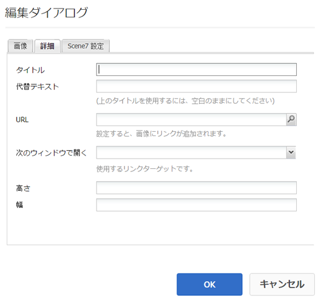
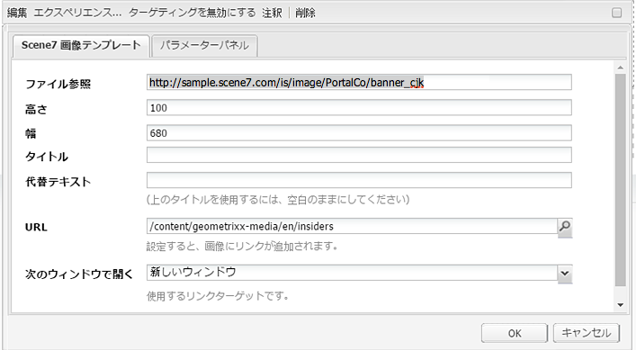

# Scene7 機能をページに追加{#adding-scene-features-to-your-page}

[Adobe Scene7](https://help.adobe.com/en_US/scene7/using/WS26AB0D9A-F51C-464e-88C8-580A5A82F810.html) は、リッチメディアアセットを管理および拡張したり、Web、モバイル、電子メール、インターネットに接続されたディスプレイやプリンターにリッチメディアアセットを公開および提供したりするためのホスト型ソリューションです。

Scene7 で公開された AEM アセットを様々なビューアで表示できます。

* ズーム
* フライアウト
* ビデオ
* 画像テンプレート
* 画像

AEM から Scene7 に直接デジタルアセットを公開できます。また、Scene7 から AEM にもデジタルアセットを公開できます。

ここでは、AEM から Scene7 に、および Scene7 から AEM にデジタルアセットを公開する方法について説明します。また、ビューアについても詳しく説明します。Scene7 用の AEM の設定については、[Scene7 と AEM の統合](/help/sites-administering/scene7.md)を参照してください。

[画像マップの追加](/help/assets/image-maps.md)も参照してください。

AEM でのビデオコンポーネントの使用について詳しくは、以下を参照してください。

* [ビデオ](/help/sites-classic-ui-authoring/manage-assets-classic-s7-video.md)

>[!NOTE]
>
>If Scene7 assets do not display properly, please make sure that Dynamic media is [disabled](/help/assets/config-dynamic.md#disabling-dynamic-media) and then refresh the page.

## Assets から手動で Scene7 に公開する {#manually-publishing-to-scene-from-assets}

クラシック UI のアセットコンソールから、またはアセットから直接 Scene7 にデジタルアセットを公開できます。

>[!NOTE]
>
>AEM は Scene7 へ非同期的に公開します。「**公開**」をクリックした後、アセットを Scene7 に公開するまでに数秒かかる場合があります。

### アセットコンソールからの公開 {#publishing-from-the-assets-console}

アセットが Scene7 のターゲットフォルダー内にある場合に、アセットコンソールから Scene7 への公開をおこなうには：

1. In the AEM classic UI, click **Digital Assets** to access the digital asset manager.

1. Scene7 に公開するターゲットフォルダー内からアセットまたはフォルダーを選択して右クリックし、「**Scene7 に公開**」を選択します。Alternatively, you can select **Publish to Scene7** from the **Tools menu**.

   

1. Scene7 に移動して、アセットが使用可能であることを確認します。

   >[!NOTE]
   >
   >同期された Scene7 フォルダーにアセットがない場合、どちらのメニューにも「**Scene7 に公開**」が表示されますが、無効になっています。

### アセットからの公開 {#publishing-from-an-asset}

同期された Scene7 フォルダー内にアセットがある場合は、そのアセットを手動で公開できます。

>[!NOTE]
>
>同期された Scene7 フォルダーにアセットがない場合は、「**Scene7 に発行**」へのリンクが表示されません。

デジタルアセットから直接 Scene7 に公開するには：

1. AEM で、「**デジタルアセット**」をクリックして、Digital Asset Manager にアクセスします。

1. アセットをダブルクリックして開きます。

1. アセットの詳細パネルで、「**Scene7 に公開**」を選択します。

   

1. リンクが「**公開中**」、「**公開済み**」の順に変わります。Scene7 に移動して、アセットが使用可能であることを確認します。

   >[!NOTE]
   >
   >アセットが Scene7 に適切に公開されない場合は、リンクが「**公開に失敗**」に変わります。アセットが既に Scene7 に公開されている場合は、リンクが「**Scene7 に再公開**」に変わります。再公開を使用すると、AEM でアセットを変更して再公開できます。

### CQ のターゲットフォルダー以外からのアセットの公開 {#publishing-assets-from-outside-the-cq-target-folder}

Adobe recommends that you publish assets to Scene7 only from assets within the Scene7 target folder. However, if you need to upload assets from a folder outside of the target folder, you can still do that by uploading them to an **ad-hoc** folder on Scene7.

そのためには、アセットが表示されるページ用のクラウド設定を最初に指定します。次に、Scene7 コンポーネントをページに追加して、そのコンポーネント上にアセットをドラッグ＆ドロップします。After the page properties are set for that page, a **Publish to Scene7** link appears that when selected triggers uploading to Scene7.

>[!NOTE]
>
>アドホックフォルダー内のアセットは、Scene7 コンテンツブラウザーには表示されません。

CQ のターゲットフォルダー以外にあるアセットを公開するには：

1. AEM のクラシック UI で、「**Web サイト**」をクリックして、Scene7 にまだ発行されていないデジタルアセットを追加する Web ページに移動します（通常のページ継承ルールが適用されます）。

1. サイドキックで&#x200B;**ページ**&#x200B;アイコンをクリックし、「**ページのプロパティ**」をクリックします。

1. 「**クラウドサービス**」をクリックし、「**サービスを追加**」をクリックして、「**Scene7**」を選択します。
1. **Adobe Scene7** ドロップダウンリストで必要な設定を選択して、「**OK**」をクリックします。

   

1. Web ページで、必要な場所に Scene7 コンポーネントを追加します。
1. コンテンツファインダーから、デジタルアセットをコンポーネントにドラッグします。「**Scene7 発行ステータスを確認**」のリンクが表示されます。

   >[!NOTE]
   >
   >If the digital asset is in the CQ target folder, then no link to **Check Scene7 Publication Status** appears. The assets is simply placed in the component.

   

1. 「**Scene7 公開ステータスを確認**」をクリックします。アセットが公開されない場合は、AEM がアセットを Scene7 に公開します。アップロードされたアセットは、アドホックフォルダーに配置されます。デフォルトでは、アドホックフォルダーは **name_of_the_company/CQ5_adhoc** にあります。[必要に応じて、この場所を設定](#configuringtheadhocfolder)できます。

   >[!NOTE]
   >
   >同期された Scene7 フォルダーにアセットがなく、Scene7 クラウド設定が現在のページに関連付けられていない場合は、アップロードが失敗します。

## Scene7 コンポーネント {#scene-components}

AEM では、次の Scene7 コンポーネントを使用できます。

* ズーム
* フライアウト（ズーム）
* 画像テンプレート
* 画像
* ビデオ

>[!NOTE]
>
>これらのコンポーネントはデフォルトでは使用できません。使用する前にデザインモードで選択しておく必要があります。

デザインモードで使用できるようになったら、他の AEM コンポーネントと同様に、コンポーネントをページに追加できます。Scene7 にまだ公開されていないアセットは、そのアセットが同期されたフォルダー内またはページ上にあるか、Scene7 クラウド設定を使用していれば、Scene7 に公開されます。

>[!NOTE]
>
>If you are creating and developing custom S7 viewers and using the Content Finder, you need to explicity add the **allowfullscreen** parameter.

### Flash ビューアのサポート終了に関する通知 {#flash-viewers-end-of-life-notice}

Adobe Scene7 は、Flash ビューアプラットフォームのサポートを 2017 年 1 月 31 日に正式に終了します。

この重要な変更について詳しくは、[Flash ビューアのサポート終了に関する FAQ](https://docs.adobe.com/content/docs/jp/aem/6-1/administer/integration/marketing-cloud/scene7/flash-eol.html) を参照してください。

### ページへの Scene7 コンポーネントの追加 {#adding-a-scene-component-to-a-page}

ページに Scene7 コンポーネントを追加する手順は、他のページにコンポーネントを追加する手順と同じです。以降の節で、Scene7 コンポーネントについて詳しく説明します。

クラシック UI を使用して、ページに Scene7 コンポーネント／ビューアを追加するには：

1. AEM で、Scene7 コンポーネントを追加するページを開きます。

1. 使用できる Scene7 コンポーネントがない場合は、サイドキックの定規アイコンをクリックして&#x200B;**デザイン**&#x200B;モードに切り替え、parsys の「**編集**」をクリックし、**Scene7** コンポーネントをすべて選択して使用可能にします。

1. Return to **Edit** mode by clicking the pencil in the sidekick.

1. サイドキックの **Scene7** グループから目的の場所のページへ、コンポーネントをドラッグします。

1. 「**編集**」をクリックしてコンポーネントを開きます。

1. コンポーネントの編集を必要に応じておこない、「**OK**」をクリックして変更内容を保存します。

### レスポンシブ Web サイトへのインタラクティブな表示エクスペリエンスの追加 {#adding-interactive-viewing-experiences-to-a-responsive-website}

アセットのレスポンシブデザインとは、アセットが表示される場所に適応することを意味します。レスポンシブデザインを使用すると、同じアセットを複数のデバイスで効果的に表示できます。

クラシック UI を使用して、レスポンシブサイトにインタラクティブな表示エクスペリエンスを追加するには：

1. AEM にログインして、[Adobe Scene7 クラウドサービスが設定されている](/help/sites-administering/scene7.md#configuring-scene-integration)ことと、Scene7 コンポーネントが使用可能であることを確認します。

   >[!NOTE]
   >
   >Scene7 WCMコンポーネントが使用できない場合は、デザインモードでコンポーネントを必ず有効にしてください。

1. Scene7 コンポーネントが有効な Web サイトで、**画像**&#x200B;ビューアをページにドラッグします。
1. コンポーネントを編集し、「**Scene7 設定**」タブでブレークポイントを調整します。

   

1. ビューアがレスポンシブにサイズ変更され、すべてのインタラクションがデスクトップ、タブレットおよびモバイル用に最適化されていることを確認します。

### Scene7 のすべてのコンポーネントに共通の設定 {#settings-common-to-all-scene-components}

設定オプションはコンポーネントによって異なりますが、次のオプションはすべての Scene7 コンポーネントに共通です。

* **ファイル参照**- 参照するファイルを探します。「ファイル参照」には、アセットの URL が表示されます。これは必ずしも、URL コマンドおよびパラメーターを含む Scene7 の完全な URL ではありません。このフィールドに Scene7 の URL コマンドおよびパラメーターを追加することはできません。それらは、コンポーネントの対応する機能を使用して追加する必要があります。
* **幅** - 幅を設定できます。
* **高さ** - 高さを設定できます。

これらの設定オプションは、Scene7 コンポーネントを開く（ダブルクリックする）ことで設定できます。例えば、**ズーム**&#x200B;コンポーネントを開く場合は、次のようになります。

### ズーム {#zoom}

HTML5 ズームコンポーネントでは、+ ボタンをクリックすると画像のサイズが拡大されます。

アセットの下部にはズームツールが用意されています。拡大するには「**+** 」、縮小するには「**-**」をクリックします。Clicking the **x** or the reset zoom arrow brings the image back to the original size it was imported as. 全画面表示にするには、斜め矢印をクリックします。コンポーネントを設定するには、「**編集**」をクリックします。With this component, you can configure [settings common to all Scene7 components](#settings-common-to-all-scene-components).

### Flyout {#flyout}

HTML5 フライアウトコンポーネントでは、アセットが分割画面として表示されます。左側には、アセットが指定されたサイズで表示され、右側には、ズーム部分が表示されます。コンポーネントを設定するには、「**編集**」をクリックします。With this component, you can configure [settings common to all Scene7 components](/help/sites-administering/scene7.md#settingscommontoallscene7components).

>[!NOTE]
>
>フライアウトコンポーネントでカスタムサイズを使用する場合は、そのカスタムサイズが使用され、コンポーネントのレスポンシブ設定は無効になります。
>
>デザイン表示で設定されたデフォルトサイズをフライアウトコンポーネントで使用する場合は、デフォルトサイズが使用され、コンポーネントが引き伸ばされ、コンポーネントのレスポンシブセットアップに合わせてページレイアウトサイズが調整されます。 ただし、コンポーネントのレスポンシブセットアップには制限があることに注意してください。 レスポンシブ設定でフライアウトコンポーネントを使用する場合は、フルページでの拡大縮小で使用しないでください。 そうしないと、フライアウトがページの右の境界線を越える場合があります。

### 画像 {#image}

Scene7 画像コンポーネントを使用すると、Scene7 の機能（Scene7 の修飾子、画像またはビューアのプリセット、シャープニングなど）を画像に追加できます。Scene7 画像コンポーネントは、Scene7 の特殊な機能を使用できるという点以外は、AEM の他の画像コンポーネントと同様です。次の例では、Scene7 の URL 修飾子である **&amp;op_invert=1** が画像に適用されています。

**タイトル、代替テキスト** :「詳細」タブで、画像にタイトルを追加し、グラフィックをオフにしているユーザーの代替テキストを追加します。

**URL、開く場所** ：アセットの開く場所を設定し、リンクを開くことができます。 「URL」と「次のウィンドウで開く」で、同じウィンドウで開くか新しいウィンドウで開くかを指定します。

**ビューアプリセット** ：ドロップダウンメニューから既存のビューアプリセットを選択します。 探しているビューアプリセットが表示されない場合は、表示できるように設定する必要があります。詳しくは、ビューアプリセットの管理を参照してください。画像プリセットを使用している場合は、ビューアプリセットを選択できません。逆の場合も同様です。

**Scene7の設定** ：アクティブな画像プリセットをScene7 Publishing Systemから取得するために使用するScene7の設定を選択します。

**画像プリセット** ：ドロップダウンメニューから既存の画像プリセットを選択します。 探している画像プリセットが表示されない場合は、表示できるように設定する必要があります。「画像プリセットの管理」を参照してください。画像プリセットを使用している場合は、ビューアプリセットを選択できません。逆の場合も同様です。

**出力形式** ：画像の出力形式（jpegなど）を選択します。 選択する出力形式によっては、追加の設定オプションが表示される場合があります。画像プリセットのベストプラクティスを参照してください。

**シャープ** ：画像にシャープを適用する方法を選択します。 シャープニングについて詳しくは、画像プリセットのベストプラクティスおよびシャープニングのベストプラクティスを参照してください。

**URL修飾子** :S7の追加の画像コマンドを入力して、画像効果を変更できます。 詳しくは、画像プリセットおよび「コマンドリファレンス」を参照してください。

**ブレークポイント** Webサイトがレスポンシブである場合は、ブレークポイントを調整する必要があります。 ブレークポイントはコンマ（,）で区切って指定してください。

### 画像テンプレート {#image-template}

[Scene7 画像テンプレート](https://help.adobe.com/en_US/scene7/using/WS60B68844-9054-4099-BF69-3DC998A04D3C.html)は、Scene7 に読み込まれた Photoshop コンテンツに重ねて適用されます。Scene7 では、可変性を考慮してコンテンツとプロパティがパラメーター化されています。**画像テンプレート**&#x200B;コンポーネントを使用すると、画像を読み込んで、テキストを AEM で動的に変更できます。また、ClientContext の値を使用するように&#x200B;**画像テンプレート**&#x200B;コンポーネントを設定できます。これにより、各ユーザーが個別に画像を活用できます。

Click **Edit** to configure the component. You can configure [settings common to all Scene7 components](/help/sites-administering/scene7.md#settingscommontoallscene7components) as well as other settings described in this section.

**ファイル参照、幅、高さすべてのScene7コンポーネントに共通の設定を参照してください** 。

>[!NOTE]
>
>Scene7 の URL コマンドおよびパラメーターを「ファイル参照」の URL に直接追加することはできません。これらは、**パラメーター**&#x200B;パネルのコンポーネントの UI でのみ定義できます。

**タイトル、代替テキスト** 「Scene7画像テンプレート」タブで、画像にタイトルを追加し、グラフィックをオフにしているユーザ用の代替テキストを追加します。

**URL、開く場所** ：アセットの開く場所を設定し、リンクを開くことができます。 「URL」と「次のウィンドウで開く」で、同じウィンドウで開くか新しいウィンドウで開くかを指定します。

**パラメータパネル** ：画像を読み込むときに、パラメータに画像の情報が事前に入力されます。 動的に変更できるコンテンツがない場合、このウィンドウは空になります。

#### テキストの動的な変更 {#changing-text-dynamically}

テキストを動的に変更するには、新しいテキストをフィールドに入力して、「**OK**」をクリックします。この例では、「**価格**」が $50 で、送料が 99 セントです。

画像内のテキストが変更されます。フィールドの横にある「**リセット**」をクリックすると、テキストを元の値に戻すことができます。

#### ClientContext の値を反映したテキストの変更 {#changing-text-to-reflect-the-value-of-a-client-context-value}

To link a field to a client context value, click **Select** to open the client-context menu, select the client context, and click **OK**. In this example, the name changes based on linking the Name with the formatted name in the profile.

現在ログインしているユーザーの名前がテキストに反映されます。フィールドの横にある「**リセット**」をクリックすると、テキストを元の値に戻すことができます。

#### Scene7 画像テンプレートのリンク化 {#making-the-scene-image-template-a-link}

Scene7 画像テンプレートコンポーネントをクリック可能なリンクにするには：

1. Scene7 画像テンプレートコンポーネントを含むページで、「**編集**」をクリックします。
1. 「**URL**」フィールドに、ユーザーが画像をクリックしたときに表示される URL を入力します。「**次のウィンドウで開く**」フィールドで、ターゲットを新しいウィンドウと同じウィンドウのどちらで開くかを選択します。

   

1. 「**OK**」をクリックします。

### ビデオコンポーネント {#video-component}

The Scene7 **Video** component (available from the Scene7 section of the sidekick) uses device and bandwidth detection to serve the right video to each screen. This component is an HTML5 video player; it is a single viewer that can be used cross channel.

このコンポーネントはアダプティブビデオセット（単一の MP4 ビデオまたは単一の F4V ビデオ）で使用できます。

ビデオと Scene7 統合との連携について詳しくは、[ビデオ](/help/sites-classic-ui-authoring/manage-assets-classic-s7-video.md)を参照してください。また、[**Scene7 ビデオ**&#x200B;コンポーネントと基盤&#x200B;**ビデオ**&#x200B;コンポーネントとの比較](/help/sites-classic-ui-authoring/manage-assets-classic-s7-video.md)も参照してください。

### ビデオコンポーネントに関する既知の制限事項 {#known-limitations-for-the-video-component}

Adobe DAMとWCMは、プライマリソースビデオがアップロードされたかどうかを表示します。 次に示すプロキシアセットは表示されません。

* Scene7 のエンコードされたレンディション
* Scene7 のアダプティブビデオセット

Scene7 ビデオコンポーネントと共にアダプティブビデオセットを使用する場合は、ビデオのサイズに合わせてコンポーネントのサイズを変更する必要があります。

## Scene7 コンテンツブラウザー {#scene-content-browser}

The Scene7 content browser lets you view content from Scene7 directly in AEM. To access the content browser, in the Content Finder, select **Scene7** in the touch-optimized user interface or the **S7** icon in the classic user interface. Functionality is identical between both user interfaces.

設定が複数ある場合、AEM では既定で[デフォルト設定](/help/sites-administering/scene7.md#configuring-a-default-configuration)が表示されます。Scene7 コンテンツブラウザーのドロップダウンメニューで、別の設定を直接選択できます。

>[!NOTE]
>
>* アドホックフォルダー内のアセットは、Scene7 コンテンツブラウザーには表示されません。
>* [セキュアプレビューが有効](/help/sites-administering/scene7.md#configuring-the-state-published-unpublished-of-assets-pushed-to-scene)なときは、Scene7 の公開、非公開の両方のアセットが、Scene7 コンテンツブラウザーに表示されます。
>* If you do not see **Scene7** or the **S7** icon as an option in the content browser, you need to [configure Scene7 to work with AEM](/help/sites-administering/scene7.md).

   >
   >
* Scene7 コンテンツブラウザーでは、次のビデオがサポートされます。
   >   * アダプティブビデオセット：複数の画面でシームレスに再生するために必要なすべてのビデオレンディションのコンテナ
   >   * 単一の MP4 ビデオ
   >   * 単一の F4V ビデオ

### コンテンツの参照 {#browsing-content-in-the-classic-ui}

Scene7 でコンテンツを参照するには、「**S7**」タブをクリックします。

アクセスする設定を変更するには、設定を選択します。選択した設定に応じてフォルダーが変わります。

アセット用のコンテンツファインダーと同様に、アセットを検索して、結果にフィルターを適用できます。ただし、アセットファインダーとは異なり、「**S7**」タブでキーワードを入力すると、そのキーワードが&#x200B;**含まれる**&#x200B;ファイル名ではなく、入力した文字列&#x200B;**で始まる**&#x200B;ファイル名が検索されます。

デフォルトでは、アセットはファイル名で表示されます。結果をアセットタイプでフィルタリングすることもできます。

>[!NOTE]
>
>WCM の Scene7 コンテンツブラウザーでは、次のビデオがサポートされます。
>
>* アダプティブビデオセット：複数の画面でシームレスに再生するために必要なすべてのビデオレンディションのコンテナ
>* 単一の MP4 ビデオ
>* 単一の F4V ビデオ

>

### コンテンツブラウザーでの Scene7 アセットの検索 {#searching-for-scene-assets-with-the-content-browser}

Scene7 アセットの検索は AEM アセットの検索と同様ですが、検索時に、Scene7 システムではアセットのリモートビューを参照し、AEM ではアセットを直接読み込むという点が異なります。

クラシック UI またはタッチ操作向け UI を使用して、アセットを表示および検索できます。インターフェイスによって検索方法は多少異なります。

どちらの UI で検索する場合でも、次の基準でフィルターを適用できます（ここでは、タッチ操作向け UI を示しています）。

**キーワードの入力** 名前でアセットを検索できます。 検索時には、入力したキーワードで始まるファイル名が検索されます。例えば、「swimming」という単語を入力すると、入力した順序どおりの文字列で始まるアセットファイルの名前が検索されます。アセットを検索するには、語句を入力した後に Enter キーを押してください。

**Folder/path** ：表示されるフォルダーの名前は、選択した設定に基づいています。 下位にドリルダウンするには、フォルダーアイコンをクリックしてサブフォルダーを選択し、チェックマークをクリックして選択します。

キーワードを入力してフォルダーを選択すると、AEM ではそのフォルダーがとすべてのサブフォルダーが検索されます。ただし、検索時にキーワードを入力しない場合は、フォルダーを選択してもそのフォルダー内のアセットしか表示されず、サブフォルダーは含まれません。

デフォルトでは、AEM は、選択したフォルダーとすべてのサブフォルダーを検索します。

**アセットのタイプ** Scene7を選択してScene7のコンテンツを参照します。 このオプションは、Scene7 が設定されている場合にのみ使用できます。

**設定** :Cloud Serviceで定義されているScene7設定が複数ある場合は、ここで選択できます。 そのため、選択した設定に基づいてフォルダーが変わります。

**アセットタイプ** Scene7ブラウザ内で、結果をフィルタして次のいずれかを含めることができます。 画像、テンプレート、ビデオおよびアダプティブビデオセットを参照してください。 アセットタイプを選択しない場合、AEM ではデフォルトですべてのアセットタイプが検索されます。

>[!NOTE]
>
>* クラシック UI では、**Flash** と **FXG** も検索できます。現時点では、タッチ対応 UI でのこれらのフィルタリングはサポートされていません。
   >
   >
* ビデオを検索するときは、単一のレンディションが検索されています。結果では、元のレンディション（*.mp4 のみ）と、エンコードされたレンディションが返されます。
* アダプティブビデオセットを検索する場合、フォルダとすべてのサブフォルダが検索されますが、検索にキーワードを追加した場合のみ検索されます。 キーワードを追加しない場合、AEM はサブフォルダーを検索しません。

**公開ステータス** ：公開ステータスに基づいてアセットをフィルタリングできます。 非公開または公開済み。 公開ステータスを選択しない場合、AEM ではデフォルトですべての公開ステータスが検索されます。

