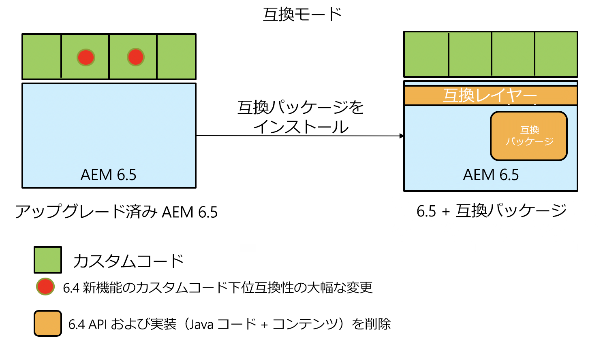
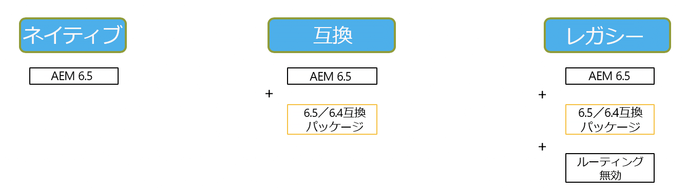

# AEM 6.5 における後方互換性{#backward-compatibility-in-aem}

## 概要 {#overview}

>[!NOTE]
>
>互換パッケージの範囲に含まれないコンテンツおよび設定の変更のリストについては、[AEM におけるリポジトリの再構築](/help/sites-deploying/repository-restructuring.md)を参照してください。

AEM 6.5 では、すべての機能が後方互換性を念頭に置いて開発されています。

ほとんどの場合、AEM 6.3 を実行しているお客様は、アップグレードの際にコードやカスタマイズの修正をおこなう必要はありません。AEM 6.1 および 6.2 のお客様の場合、6.3 にアップグレードする際よりも大きい変更はありません。

機能に下位互換性を維持できない例外が発生した場合は、バンドルとコンテンツの下位互換性の問題を、6.4用の互換性パッケージをインストールすると軽減できます（ダウンロードする場所の詳細は、下の設定方法を参照）。 このコンパクトパッケージは、AEM 6.4に準拠したアプリケーションで、ほとんどの場合の互換性を回復するのに役立ちます。

互換パッケージを使用すると、AEM を互換モードで実行でき、新しい AEM 機能に対するカスタム開発を先送りできます。

>[!NOTE]
>
>互換パッケージは、AEM 6.5 での互換性を確保するために必要な開発作業を先送りする一時的なソリューションであり、アップグレード後すぐに開発をおこなって互換性の問題に対応することができない場合の最終手段としてのみ使用をお勧めします。6.5 をベースにしたカスタム開発を進め、6.5 のすべての機能を利用できるようになったら、ネイティブモードに切り替えて、互換パッケージをアンインストールすることを強くお勧めします。

互換パッケージには、**ルーティング有効**&#x200B;と&#x200B;**ルーティング無効**&#x200B;の 2 つのモードがあります。

これにより、AEM 6.5 は次の 3 つのモードで実行できます。

**ネイティブモード：**

ネイティブモードは、AEM 6.5 のすべての新機能を使用したいお客様、およびすべての新機能のカスタマイズ作業をおこなうための開発をする準備ができているお客様用です。

これは、アップグレード後すぐにアプリケーションの調整をおこなう必要がある可能性があることを意味します。

**互換モード：ルーティング有効で互換パッケージをインストール**

互換モードは、後方互換性のないインターフェイスのカスタマイズがあるお客様用です。これにより、互換モードで AEM を実行でき、カスタムコードの一部と互換性のない新しい AEM 機能に関するカスタム開発を先送りできます。

**レガシーモード：ルーティング無効で互換パッケージをインストール**

レガシーモードは、互換パッケージで移行された AEM のレガシーコードまたは廃止されたコードに基づくカスタムインターフェイスを持つお客様用です。

## 設定方法 {#how-to-set-up}

The AEM 6.3 Compatibility Package will be installable as a package using the Package Manager at this [link](https://www.adobeaemcloud.com/content/marketplace/marketplaceProxy.html?packagePath=/content/companies/public/adobe/packages/cq640/compatpack/aem-compat-cq64-to-cq63).

互換パッケージがインストールされると、次に示すように、OSGI 設定のスイッチを使用して、ルーティングを有効または無効にできます。

互換パッケージがインストールされて設定されると、各機能は選択された互換モードに基づいて使用されるようになります。
