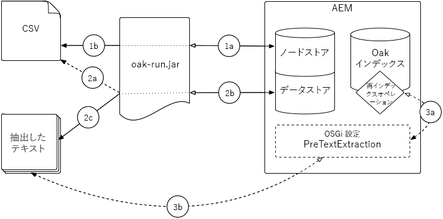

# クエリとインデックスに関するベストプラクティス{#best-practices-for-queries-and-indexing}

AEM 6 での Oak への移行に伴い、クエリとインデックスの管理方法に関して大きな変更がいくつか導入されました。Jackrabbit 2では、すべてのコンテンツのインデックスがデフォルトで作成され、自由にクエリできます。 In Oak, indexes must be created manually under the `oak:index` node. クエリはインデックスなしで実行できますが、大きなデータセットの場合は、実行が非常に遅くなるか、中止されます。

この記事では、インデックスを作成するべき場合とインデックスが不要な場合、クエリが不要な場合にクエリの使用を回避するためのヒント、インデックスとクエリの機能をできる限り最適化するためのヒントを概説します。

さらに、[クエリとインデックスの作成に関する Oak のドキュメント](/help/sites-deploying/queries-and-indexing.md)をお読みください。AEM 6の新しい概念であるインデックスに加え、Oakクエリには構文上の違いがあり、以前のAEMからコードを移行する際に考慮する必要があります。

## クエリを使用する必要がある場合 {#when-to-use-queries}

### リポジトリと分類の設計 {#repository-and-taxonomy-design}

リポジトリの分類を設計する際は、いくつかの要素を考慮する必要があります。要素には、アクセス制御、ローカリゼーション、コンポーネントおよびページプロパティの継承などがあります。

こうした事柄に対応する分類を設計する一方で、インデックス設計の「トラバーサビリティ」についても検討することも重要です。トラバーサビリティとは、この文脈では、パスに基づいて予想どおりにコンテンツにアクセスできるようにする分類の機能を言います。トラバーサビリティは、多数のクエリの実行が必要なシステムに比べて保守が簡単な、よりパフォーマンスの高いシステムの実現に役立ちます。

さらに分類を設計する際は、順序が重要かどうか検討することが重要です。明確な順序が不要な場合および多数の兄弟ノードが予想される場合は、`sling:Folder` や `oak:Unstructured` などの順序がないノードタイプを使用することを推奨します。In cases where ordering is required, `nt:unstructured` and `sling:OrderedFolder` would be more appropriate.

### コンポーネント内のクエリ {#queries-in-components}

クエリは、AEM システムで実行される際の負荷が比較的大きい処理なので、コンポーネント内のクエリはできる限り避けるようにします。ページがレンダリングされるたびに複数のクエリを実行すると、システムのパフォーマンス低下につながります。コンポーネントのレンダリング時にクエリが実行されることを回避するには、**ノードの走査**&#x200B;と&#x200B;**結果の先取り**&#x200B;という 2 つの方法があります。

#### ノードの走査 {#traversing-nodes}

必要なデータの場所を事前に把握できるように設計されたリポジトリの場合は、データを発見するためのクエリを実行する必要はなく、そのデータを必要なパスから取得するコードをデプロイできます。

例として考えられるのは、特定のカテゴリに適合するコンテンツをレンダリングする場合です。これを実現する 1 つの方法は、コンテンツをカテゴリプロパティで整理し、このプロパティをクエリして、カテゴリ内のアイテムを表示するコンポーネントに割り当てることです。

もっと良い方法は、コンテンツをカテゴリ別の分類で構造化し、コンテンツを手動で取得できるようにすることです。

例えば、コンテンツが以下の場所に似た分類で格納されている場合は、

```xml
/content/myUnstructuredContent/parentCategory/childCategory/contentPiece
```

the `/content/myUnstructuredContent/parentCategory/childCategory` node can simply be retrieved, its children can be parsed and used to render the component.

さらに、小規模または一様なデータセットを扱う場合は、同じ結果セットを返すためにクエリを作成するよりも、リポジトリを走査して必要なノードを収集するほうが速い場合があります。一般論として、クエリはできる限り使用せずに済ませることを推奨します。

#### 結果の先取り {#prefetching-results}

コンテンツやコンポーネントの要件によっては、必要なデータを取得する方法としてノードの走査を使用できない場合があります。その場合は、エンドユーザーに最適なパフォーマンスを保証するために、コンポーネントがレンダリングされる前に必要なクエリを実行する必要があります。

コンポーネントで必要とされる結果をオーサリング時にまとめて計算でき、さらにコンテンツがその後も変更されないとわかっている場合は、オーサーがダイアログで設定を適用するときにクエリを実行できます。

データまたはコンポーネントが定期的に変更される場合は、スケジュールに従って、または基礎データの更新リスナーを使用してクエリを実行できます。クエリの結果は、リポジトリ内の共有の場所に書き込むことができます。このデータを必要とするコンポーネントは、実行時にクエリを実行しなくても、この 1 つのノードから値を取り出すことが可能です。

## クエリの最適化 {#query-optimization}

インデックスを使用していないクエリを実行すると、ノードの走査に関する警告がログに記録されます。このクエリが頻繁に実行されるものである場合は、インデックスを作成する必要があります。特定のクエリが使用しているインデックスを確認するには、[クエリの説明を実行ツール](/help/sites-administering/operations-dashboard.md#explain-query)を推奨します。詳しくは、関連する検索APIに対してデバッグログを有効にすることができます。

>[!NOTE]
>
>インデックスの定義を変更したら、インデックスを再構築（再インデックス）する必要があります。インデックスのサイズによっては、この処理を終えるまでにある程度時間がかかることがあります。

複雑なクエリを実行するときは、クエリを複数の小さなクエリに分割し、後からコードによってデータを結合するほうが、パフォーマンスが向上することがあります。その場合は、2 つの方法のパフォーマンスを比較し、当該のユースケースでどちらの選択肢が優れているか確認することを推奨します。

AEM では、次の 3 つの方法でクエリを記述できます。

* Via the [QueryBuilder APIs](/help/sites-developing/querybuilder-api.md) (recommended)
* XPath を使用（推奨）
* SQL2 を使用

すべてのクエリは実行前に SQL2 に変換されますが、クエリ変換のオーバーヘッドはごくわずかなので、クエリ言語を選択するときの主な懸念事項は可読性と開発チームの安心感ということになります。

>[!NOTE]
>
>QueryBuilder を使用する場合、QueryBuilder はデフォルトで結果数を算出します。Oak では、この処理は Jackrabbit の以前のバージョンと比べて低速です。これを補うために、[guessTotal パラメーター](/help/sites-developing/querybuilder-api.md#using-p-guesstotal-to-return-the-results)を使用できます。

### クエリーの説明を実行ツール {#the-explain-query-tool}

どのクエリ言語でも、クエリ最適化の最初の手順は、クエリの実行方法を把握することです。これをおこなうには、操作ダッシュボードにある[クエリの説明を実行ツール](/help/sites-administering/operations-dashboard.md#explain-query)を使用します。このツールを使うと、クエリを接続して説明することができます。 クエリによって、大規模なリポジトリや、実行時間や使用されるインデックスに関する問題が引き起こされる場合は、警告が表示されます。このツールでは、低速なクエリやよく使用されるクエリのリストを読み込み、これらを説明および最適化できます。

### クエリのための DEBUG ログ {#debug-logging-for-queries}

Oak による使用するインデックスの選択方法と、クエリエンジンによるクエリの実際の実行方法に関する追加情報を得るために、**DEBUG** ログ設定を以下のパッケージに追加できます。

* org.apache.jackrabbit.oak.plugins.index
* org.apache.jackrabbit.oak.query
* com.day.cq.search

このロガーは大量のアクティビティを出力し、ログファイルによってディスクが一杯になることがあるので、クエリのデバッグが完了したら、このロガーを削除するようにしてください。

この方法について詳しくは、[ログに関するドキュメント](/help/sites-deploying/configure-logging.md)を参照してください。

### インデックスの統計 {#index-statistics}

Lucene では、インデックス付きのコンテンツに関する詳細（各インデックス内に存在するドキュメントのサイズと数を含む）を提供する JMX Bean が登録されます。

You can reach it by accessing the JMX Console at `https://server:port/system/console/jmx`

JMX コンソールにログインしたら、検索を実行して **Lucene Index Statistics** を探します。他のインデックス統計は、**IndexStats** MBean にあります。

クエリの統計については、**Oak Query Statistics** という名前の MBean を確認してください。

[Luke](https://code.google.com/p/luke/) などのツールを使用してインデックスを詳しく調べる場合は、Oak コンソールを使用して `NodeStore` のインデックスをファイルシステムディレクトリにダンプする必要があります。これを実行する手順については、[Lucene のドキュメント](https://jackrabbit.apache.org/oak/docs/query/lucene.html) を参照してください。

また、JSON 形式でシステム内のインデックスを抽出できます。In order to do this, you need to access `https://server:port/oak:index.tidy.-1.json`

### クエリ制限 {#query-limits}

**開発時**

Set low threshholds for `oak.queryLimitInMemory` (eg. 10000)とoak。 `queryLimitReads` (例： UnsupportedOperationException にヒットして「The query read more than x nodes...」と表示されたときに高負荷のクエリを最適化します。

これにより、リソースを集中的に使用するクエリ（つまり、インデックスのないクエリまたは対応するインデックスが少ないクエリ）を回避することができます。例えば、100 万個のノードを読み取るクエリでは I/O が増加し、アプリケーションの全体的なパフォーマンスに悪影響が生じます。上述のような制限が原因で失敗するクエリは、分析して最適化する必要があります。

#### **デプロイメント後** {#post-deployment}

* クエリが大きなノードトラバーサルまたは大きなヒープメモリの消費をトリガーしているかどうかログを監視します。&quot;

   * `*WARN* ... java.lang.UnsupportedOperationException: The query read or traversed more than 100000 nodes. To avoid affecting other tasks, processing was stopped.`
   * クエリを最適化して、走査するノードの数を減らします。

* ログを監視して、ヒープメモリを大量に消費しているクエリがないかどうかを調べます。

   * `*WARN* ... java.lang.UnsupportedOperationException: The query read more than 500000 nodes in memory. To avoid running out of memory, processing was stopped`
   * クエリを最適化して、ヒープメモリの使用量を減らします。

AEM 6.0 - 6.2バージョンでは、AEM開始スクリプトのJVMパラメーターを使用してノードトラバーサルのしきい値を調整し、大きなクエリが環境をオーバーロードするのを防ぐことができます。

推奨される値は次のとおりです。

* `-Doak.queryLimitInMemory=500000`
* `-Doak.queryLimitReads=100000`

AEM 6.3 では、この 2 つのパラメーターは標準で事前に設定されており、OSGi QueryEngineSettings で保持することができます。

More information available under : [https://jackrabbit.apache.org/oak/docs/query/query-engine.html#Slow_Queries_and_Read_Limits](https://jackrabbit.apache.org/oak/docs/query/query-engine.html#Slow_Queries_and_Read_Limits)

## 効率的なインデックス作成のヒント {#tips-for-creating-efficient-indexes}

### Should I Create an Index? {#should-i-create-an-index}

インデックスを作成または最適化する際にまず考える必要があるのは、その状況でインデックスが本当に必要かどうかという点です。そのクエリを一度またはごくまれにしか実行せず、システムのオフピーク時に一括処理で実行するならば、インデックスをまったく作成しないほうが良いことがあります。

インデックスを作成すると、そのインデックスが付けられたデータを更新するたびに、インデックスも更新する必要が生じます。これはシステムのパフォーマンスに影響を与えるので、インデックスは実際に必要な場合にのみ作成する必要があります。

さらに、インデックスが役に立つのは、そのインデックスのデータが十分な一意性を持っている場合に限られます。このことは、本の索引（インデックス）と、その本が扱うトピックとの関係を考えてみればわかります。本文中の一連のトピックに索引を付けると、通常は数百または数千の索引項目が作成されます。この索引項目を使用して、特定のページを素早く開き、探している情報をすぐに見つけることができます。もし索引項目が 2、3 個しかなく、各項目が数百ものページを指していれば、その索引はほとんど役に立ちません。データベースのインデックスについても同じことが言えます。一意の値がいくつかしか存在しない場合は、インデックスはあまり役立ちません。とはいえ、インデックスが大きすぎて役に立たなくなることもあります。 インデックスの統計を確認するには、前述の[インデックスの統計](/help/sites-deploying/best-practices-for-queries-and-indexing.md#index-statistics)を参照してください。

### Lucene インデックスとプロパティインデックス {#lucene-or-property-indexes}

Lucene インデックスは Oak 1.0.9 で導入され、AEM 6 の最初の公開時に導入されたプロパティインデックスに比べて、強力な最適化機能を提供します。Lucene インデックスとプロパティインデックスのどちらにするかを決定する際は、以下の点を考慮してください。

* Lucene インデックスは、プロパティインデックスよりも数多くの機能を備えています。例えば、プロパティインデックスでは 1 つのプロパティにしかインデックスを付けられませんが、Lucene インデックスでは複数のプロパティを含めることができます。Lucene インデックスで使用できるすべての機能については、こちらの[ドキュメント](https://jackrabbit.apache.org/oak/docs/query/lucene.html)を参照してください。
* Lucene インデックスは非同期式です。そのためパフォーマンスは大幅に向上しますが、データがリポジトリに書き込まれるときと、インデックスが更新されるときに、遅延が生じることがあります。クエリに 100 ％正確な結果を返させることが必要な場合は、プロパティインデックスが必要です。
* Lucene インデックスは、非同期式という特性上、一意性制約を適用できません。これが必要な場合は、プロパティインデックスを配置する必要があります。

一般的には、どうしてもプロパティインデックスを使用しなければならない理由がある場合を除いては、パフォーマンスと柔軟性に優れた Lucene インデックスの使用を推奨します。

### Solr インデックス {#solr-indexing}

AEM は、デフォルトで Solr インデックスにも対応しています。これは主にフルテキスト検索をサポートするために使用されますが、JCR クエリの任意のタイプをサポートするためにも使用できます。同時使用ユーザー数が多い検索型 Web サイトなど、検索が多用されるデプロイメントで必ず発生する多数のクエリを処理するだけの CPU 容量が AEM インスタンスにない場合は、Solr を検討する必要があります。または、Solr はプラットフォームの高度な機能を活用するために、クローラベースのアプローチで導入することもできます。

Solr インデックスは、開発環境用の AEM サーバーに組み込んで実行するような構成にすることも、実稼動環境およびステージング環境の検索のスケーラビリティを向上させるためにリモートインスタンスにオフロードすることもできます。検索のオフロードは、スケーラビリティが向上する一方で遅延が発生することから、どうしても必要な場合以外は推奨されません。Solr 統合の設定方法と Solr インデックスの作成方法について詳しくは、[Oak のクエリとインデックス作成のドキュメント](/help/sites-deploying/queries-and-indexing.md#the-solr-index)を参照してください。

>[!NOTE]
>
>統合型の Solr 検索アプローチを採用すると、インデックス作成を Solr サーバーにオフロードできます。クローラベースのアプローチで Solr サーバーの高度な機能を使用する場合は、追加の設定作業が必要です。このような実装を高速化するために、Headwire が[オープンソースのコネクター](https://www.aemsolrsearch.com/#/)を開発しています。

ただし、このアプローチには 1 つマイナス面があります。AEM のクエリはデフォルトで ACL を適用するので、ユーザーがアクセス権を持たない結果は表示されませんが、検索を Solr サーバーにオフロードするとこの非表示機能が働かなくなります。この方法で検索をオフロードする場合は、ユーザーに見せてはいけない結果を表示していないかを特に注意して確認する必要があります。

このアプローチが適しているユースケースとしては、検索データを複数のソースから集めなければならない場合が考えられます。例えば、AEM でホストされているサイトと、サードパーティのプラットフォームでホストされている 2 つ目のサイトがある場合などです。この場合は、両方のサイトのコンテンツをクロールし、その結果を統合インデックスに格納するよう Solr を設定できます。こうすることで、クロスサイト検索が可能になります。

### 設計上の考慮事項 {#design-considerations}

Lucene インデックスに関する Oak のドキュメントでは、以下のとおり、インデックス設計時の考慮事項をいくつか挙げています。

* クエリで異なるパス制限を使用する場合は、`evaluatePathRestrictions` を使用します。こうすることで、指定したパスの下の結果のサブセットをクエリで返してから、クエリに基づいて結果をフィルタリングできます。そうしない場合は、クエリはリポジトリ内のクエリパラメーターに一致する結果をすべて検索してから、パスに基づいて結果をフィルタリングします。
* クエリで並べ替えを使用する場合は、並べ替えるプロパティの明示的なプロパティ定義を用意し、そのプロパティの `ordered` を `true` に設定します。これにより、結果がインデックスどおりの順番に並ぶので、コストがかかる並べ替え処理をクエリ実行時におこなう必要がなくなります。

* インデックスには必要なものだけを追加します。不要な機能やプロパティを追加すると、インデックスの増大とパフォーマンスの低下につながります。
* プロパティインデックスでは、一意のプロパティ名を使用すると、インデックスのサイズを削減できます。しかし Lucene インデックスでは、統一されたインデックスを実現するために、`nodeTypes` と `mixins` を使用する必要があります。Querying a specific `nodeType` or `mixin` will be more performant than querying `nt:base`. When using this approach, define `indexRules` for the `nodeTypes` in question.

* クエリを特定のパスでのみ実行する場合は、そのパスの下でインデックスを作成します。インデックスにリポジトリのルートを含める必要はありません。
* インデックスを付けるすべてのプロパティが関連しているときは、Lucene ができるだけ多くのプロパティ制限をネイティブで評価できるようにするために、単一のインデックスを使用することを推奨します。また、結合を実行する場合でも、クエリは 1 つのインデックスだけを使用します。

### CopyOnRead {#copyonread}

`NodeStore` がリモートに格納されている場合は、`CopyOnRead` というオプションを有効にできます。このオプションを使用すると、リモートインデックスが読み込まれるときに、リモートインデックスがローカルのファイルシステムに書き込まれます。このオプションは、こうしたリモートインデックスに対して頻繁に実行されるクエリのパフォーマンス向上に役立ちます。

これは OSGi コンソールの **LuceneIndexProvider** サービスで設定でき、Oak 1.0.13 の時点ではデフォルトで有効です。

### インデックスの削除 {#removing-indexes}

インデックスを削除するときは、必ず `type` プロパティを `disabled` に設定して一時的にインデックスを無効にしたうえで、実際に削除する前にテストを実施し、アプリケーションが正しく動作するか確認することを推奨します。インデックスは無効にしている間は更新されないので、再度有効にした場合に正しいコンテンツを含んでいない可能性があり、インデックスの再作成が必要になることがあります。

TarMK インスタンスのプロパティインデックスを削除した後は、使用されていたディスクスペースを再利用するために、圧縮を実行する必要があります。Lucene インデックスの場合、実際のインデックスコンテンツは BlobStore に格納されているので、データストアのガベージコレクションが必要になります。

MongoDB インスタンスのインデックスを削除する場合、削除のコストはインデックスのノードの数に比例します。大量のインデックスを削除すると問題が生じることがあるので、インデックスを無効にしたうえで、メンテナンスウィンドウ中に **oak-mongo.js** などのツールを使用して削除する方法が推奨されます。この方法はデータの不一致を発生させるおそれがあるので、通常のノードコンテンツに対しては使用できません。

>[!NOTE]
>
>oak-mongo.js について詳しくは、Oak のドキュメントの [Command Line Tools のセクション](https://jackrabbit.apache.org/oak/docs/command_line.html)を参照してください。

## 再インデックス {#re-indexing}

This section outlines the **only** acceptable reasons to re-index Oak indexes.

Outside the reasons outlined below, initiating re-indexes of Oak indexes will **not** change behavior or resolve issues, and unncessarily increase load on AEM.

以下の各表に記載されている理由に該当しない限り、Oak インデックスの再インデックスを実行しないでください。

>[!NOTE]
>
>以下の表を参照して再インデックスが有用であるかを判断する前に、**常に**verify:
>
>* クエリが正しい
>* クエリが予期したインデックスに解決されること（[クエリの説明を実行](/help/sites-administering/operations-dashboard.md#diagnosis-tools)を使用）
>* インデックス作成プロセスが完了していること

>


### Oak インデックスの設定の変更 {#oak-index-configuration-changes}

エラーがないときに Oak インデックスの再インデックスが許容される唯一の状況は、Oak インデックスの設定が変更された場合です。

*再インデックスに着手する前には必ず、AEM の全体的なパフォーマンスに対する影響を適切に検討し、アクティビティが少ない期間やメンテナンスウィンドウ中に再インデックスを実行する必要があります。*

以下の節では、発生する可能性がある問題と解決策について詳しく説明します。

* [プロパティインデックスの定義の変更](#property-index-definition-change)
* [Lucene インデックスの定義の変更](#lucene-index-definition-change)

#### プロパティインデックスの定義の変更 {#property-index-definition-change}

* 適用対象：

   * すべての Oak バージョン
   * [プロパティインデックス](https://jackrabbit.apache.org/oak/docs/query/property-index.html)のみ

* 現象：

   * プロパティインデックスの定義を更新する前に存在していたノードが結果に見つからない

* 検証方法：

   * 更新したインデックス定義をデプロイする前に、見つからないノードが作成または変更されていたかどうかを確認します。
   * Verify the `jcr:created` or `jcr:lastModified` properties of any missing nodes against the index&#39;s modified time

* 解決方法：

   * Lucene インデックスの[再インデックス](/help/sites-deploying/best-practices-for-queries-and-indexing.md#how-to-re-index)を実行します。
   * または、見つからないノードについて変更をおこないます（安全な書き込み操作）。

      * 手動処理またはカスタムコードが必要です。
      * 見つからない一連のノードを把握する必要があります。
      * ノードでプロパティを変更する必要があります。

#### Lucene インデックスの定義の変更 {#lucene-index-definition-change}

* 適用対象：

   * すべての Oak バージョン
   * Only [lucene indexes](https://jackrabbit.apache.org/oak/docs/query/lucene.html)

* 現象：

   * 予期した結果が Lucene インデックスに含まれない
   * インデックス定義の予期される動作がクエリ結果に反映されない
   * インデックス定義に基づいて予期される出力がクエリプランで報告されない

* 検証方法：

   * Verify the index definition was changed using the Lucene Index statistics JMX Mbean (LuceneIndex), method `diffStoredIndexDefinition`.

* 解決方法：

   * 1.6 より前の Oak バージョン：

      * Lucene インデックスの[再インデックス](#how-to-re-index)を実行します。
   * 1.6 以降の Oak バージョン

      * 既存の内容が変更の影響を受けない場合は、更新のみが必要です。

         * [oak](https://jackrabbit.apache.org/oak/docs/query/lucene.html#stored-index-definition) :queryIndexDefinition []@refresh=trueを設定して、luceneインデックスを更新します。
      * それ以外の場合は、Lucene インデックスの[再インデックス](#how-to-re-index)を実行します。

         * 注意：新しい再インデックスが実行されるまで、前回の正常な再インデックス（または最初のインデックス作成）のインデックス状態が使用されます。


### エラーと例外の状況 {#erring-and-exceptional-situations}

次の表では、Oak インデックスの再インデックスによって問題が解決されるエラーや例外の状況についてのみ説明しています。

以下に記載する条件と一致しない問題が AEM で発生する場合は、いずれのインデックスについても再インデックスを実行&#x200B;**しない**&#x200B;でください。再インデックスを実行しても、問題は解決しません。

以下の節では、発生する可能性がある問題と解決策について詳しく説明します。

* [Lucene インデックスのバイナリが見つからない](#lucene-index-binary-is-missing)
* [Lucene インデックスのバイナリが破損している](#lucene-index-binary-is-corrupt)

#### Lucene インデックスのバイナリが見つからない {#lucene-index-binary-is-missing}

* 適用対象：

   * すべての Oak バージョン
   * Only [lucene indexes](https://jackrabbit.apache.org/oak/docs/query/lucene.html)

* 現象：

   * 予期した結果が Lucene インデックスに含まれない

* 検証方法：

   * Lucene インデックスのバイナリが見つからないという例外がエラーログファイルに記録されます。

* 解決方法：

   * トラバースリポジトリチェックの実行例：

      [http://localhost:4502/system/console/repositorycheck](http://localhost:4502/system/console/repositorycheck)

      リポジトリ内での移動は、他のバイナリ（luceneファイル以外）がないかどうかを判断する

   * Lucene インデックス以外のバイナリが見つからない場合は、バックアップから復元します。
   * Otherwise, [re-index](#how-to-re-index) *all* lucene indexes
   * 注意：

      この状態は、ANYバイナリ( アセットバイナリ)が見つかりません。

      この場合は、正常であることがわかっている最新のリポジトリバージョンに復元し、見つからないすべてのバイナリを回復します。

#### Lucene インデックスのバイナリが破損している {#lucene-index-binary-is-corrupt}

* 適用対象：

   * すべての Oak バージョン
   * Only [lucene indexes](https://jackrabbit.apache.org/oak/docs/query/lucene.html)

* 現象：

   * 予期した結果が Lucene インデックスに含まれない

* 検証方法：

   * The `AsyncIndexUpdate` (every 5s) will fail with an exception in the error.log:

      `...a Lucene index file is corrupt...`

* 解決方法：

   * Lucene インデックスのローカルコピーを削除します。

      1. AEM を停止します。
      1. Delete the local copy of the lucene index at `crx-quickstart/repository/index`
      1. AEM を再起動します。
   * If this does not resolve the issue, and the `AsyncIndexUpdate` exceptions persist then:

      1. エラーがあるインデックスの[再インデックス](#how-to-re-index)を実行します。
      1. Also file an [Adobe Support](https://helpx.adobe.com/jp/support.html) ticket


### 再インデックスを実行する方法 {#how-to-re-index}

>[!NOTE]
>
>In AEM 6.5, [oak-run.jar is the ONLY supported method](/help/sites-deploying/indexing-via-the-oak-run-jar.md#reindexingapproachdecisiontree) for re-indexing on MongoMK or RDBMK repositories.

#### プロパティインデックスの再インデックス {#re-indexing-property-indexes}

* プロパティインデックスの再インデックスをおこなうには、[oak-run.jar](/help/sites-deploying/oak-run-indexing-usecases.md#usecase3reindexing) を使用します。
* プロパティインデックスで async-reindex プロパティを true に設定します。

   * `[oak:queryIndexDefinition]@reindex-async=true`

* PropertyIndexAsyncReindex **** MBeanを介して、Webコンソールを使用してプロパティインデックスを非同期的に再インデックスします。

   例えば、

   [http://localhost:4502/system/console/jmx/org.apache.jackrabbit.oak%3Aname%3Dasync%2Ctype%3DPropertyIndexAsyncReindex](http://localhost:4502/system/console/jmx/org.apache.jackrabbit.oak%3Aname%3Dasync%2Ctype%3DPropertyIndexAsyncReindex)

#### Lucene プロパティインデックスの再インデックス {#re-indexing-lucene-property-indexes}

* Lucene プロパティインデックスの[再インデックスをおこなうには、oak-run.jar](/help/sites-deploying/oak-run-indexing-usecases.md#usecase3reindexing) を使用します。
* Lucene プロパティインデックスで async-reindex プロパティを true に  ルセン特性指数

   * `[oak:queryIndexDefinition]@reindex-async=true`

>[!NOTE]
>
>以上の節は、[Apache Oak のドキュメント](https://jackrabbit.apache.org/oak/docs/query/indexing.html#reindexing)の内容を要約し、AEM のコンテキストにおける Oak の再インデックスに関するガイダンスをまとめたものです。

### バイナリのテキスト事前抽出 {#text-pre-extraction-of-binaries}

テキスト事前抽出は、分離されたプロセスのデータストアから直接バイナリのテキストを抽出して処理し、抽出されたテキストを後続の Oak インデックスの再インデックス／インデックス作成に直接公開するプロセスです。

* Oak text pre-extraction is recommended for re/indexing Lucene indexes on repositories with large volumes of files (binaries) that contain extractable text (eg. PDFs, Word Docs, PPTs, TXT, etc.) that qualify for full-text search via deployed Oak indexes; for example `/oak:index/damAssetLucene`.
* テキスト事前抽出は、Lucene インデックスの再インデックス／インデックス作成の場合にのみ利点があります。Oak プロパティインデックスの場合、プロパティインデックスはバイナリからテキストを抽出しないので、利点がありません。
* テキスト事前抽出は、大量のテキストを含むバイナリ（PDF、Doc、TXT など）のフルテキスト再インデックスには大きな効果がありますが、画像には抽出可能なテキストが含まれないので、画像のリポジトリでは同様の効果は得られません。
* テキスト事前抽出では、フルテキスト検索に関連するテキストの抽出がきわめて効率的に実行され、きわめて効率的に使用できるような形式で Oak の再インデックス／インデックス作成プロセスに渡されます。

#### When CAN text pre-extraction be used? {#when-can-text-pre-extraction-be-used}

バイナリ抽出が有効な&#x200B;**既存の** Lucene インデックスの再インデックス

* Re-indexing processing **all** candidate content in the repository; when the binaries to extract full-text from are numerous or complex, an increased computational burden to performthefull-text extraction is placed on AEM. テキスト事前抽出では、テキスト抽出の「計算コストが高い作業」が分離されたプロセスに移行され、このプロセスが直接 AEM のデータストアにアクセスするので、AEM におけるオーバーヘッドやリソースの競合が回避されます。

バイナリ抽出が有効になった&#x200B;**新しい** Lucene インデックスの AEM へのデプロイメントのサポート

* 新しいインデックス（バイナリ抽出が有効になった）が AEM にデプロイされると、非同期フルテキストインデックス作成の次回実行時に、すべての候補コンテンツのインデックスが自動的に作成されます。前述の再インデックスの説明と同じ理由で、これにより AEM に過度の負荷がかかる可能性があります。

#### テキスト事前抽出を使用できない状況 {#when-can-text-pre-extraction-not-be-used}

テキスト事前抽出は、リポジトリに追加された新しいコンテンツには使用できません。また、使用する必要もありません。

リポジトリに追加された新しいコンテンツには、非同期フルテキストインデックス作成プロセスによって、インデックスが必然的かつ増分的に作成されます（デフォルトでは 5 秒ごと）。

Web UI を介したアセットのアップロードやプログラムによるアセットの取り込みなど、AEM の通常の操作では、新しいバイナリコンテンツのフルテキストインデックスが自動的かつ増分的に作成されます。データの量は増分であり、比較的少ないので（およそ 5 秒でリポジトリに永続化できるデータの量）、AEM では、全体的なシステムパフォーマンスに影響を及ぼすことなく、インデックス作成時にバイナリからのフルテキスト抽出を実行できます。

#### テキスト事前抽出を使用するための前提条件 {#prerequisites-to-using-text-pre-extraction}

* フルテキストバイナリ抽出を実行する Lucene インデックスの再インデックスの実行、または既存のコンテンツのバイナリのフルテキストインデックスを作成する新しいインデックスのデプロイ
* テキストを事前抽出する元のコンテンツ（バイナリ）がリポジトリ内に存在すること
* CSV ファイルの生成および最終的な再インデックスの実行のためのメンテナンスウィンドウ
* Oak バージョン 1.0.18 以降、1.2.3 以降
* [oak-run.](https://mvnrepository.com/artifact/org.apache.jackrabbit/oak-run/)jarversion 1.7.4+
* インデックス作成AEMインスタンスからアクセス可能な抽出テキストを保存するファイルシステムフォルダ/共有

   * テキスト事前抽出の OSGi 設定には、AEM インスタンスから直接それらのファイルにアクセスできるように、抽出されたテキストファイルへのファイルシステムパスが必要です（ローカルドライブまたはファイル共有マウント）。

#### テキスト事前抽出を実行する方法 {#how-to-perform-text-pre-extraction}

>[!NOTE]
>
>***以下に説明するoak-run.jarコマンドは、https://jackrabbit.apache.org/oak/docs/query/pre-extract-text.htmlに完全に列挙され [ます。](https://jackrabbit.apache.org/oak/docs/query/pre-extract-text.html)***
>
>上の図と後述の手順は、Apache Oak のドキュメントに記載されているテキスト事前抽出の技術的な手順を解説および補足しています。



**事前抽出する内容のリストの生成**

この操作ではノードストアが走査され、システムに大きな負荷がかかる可能性があるので、手順 1（a ～ b）はメンテナンスウィンドウ中やあまり使用されていない時間に実行してください。**

1a.`oak-run.jar --generate` を実行して、テキストを事前抽出するノードのリストを作成します。

1b.ノードのリスト（1a）が CSV ファイルとしてファイルシステムに格納されます。

Note that the entire Node Store is traversed (as specified by the paths in the oak-run command) every time `--generate` is executed, and a **new** CSV file is created. The CSV file is **not** re-used between discrete executions of the text pre-extraction process (Steps 1 - 2).

**ファイルシステムへのテキストの事前抽出**

手順 2（a ～ c）は、AEM の通常の操作中に実行できます。この手順では、データストアのみとやり取りがおこなわれます。**

2a.`oak-run.jar --tika` を実行して、（1b）で生成した CSV ファイルに列挙されているバイナリノードのテキストを事前抽出します。

2b.（2a）で開始されたプロセスが、CSV で定義されているバイナリノードにデータストアで直接アクセスし、テキストを抽出します。

2c.  抽出されたテキストが、Oak の再インデックスプロセス（3a）で取り込み可能な形式でファイルシステムに格納されます。

事前抽出されたテキストは、CSV 内でバイナリのフィンガープリントによって識別されます。バイナリファイルが同じである場合、事前抽出された同じテキストを AEM インスタンス間で使用できます。通常、AEM パブリッシュは AEM オーサーのサブセットなので、多くの場合、AEM オーサーから事前抽出されたテキストを使用して、AEM パブリッシュの再インデックスも実行できます（抽出されたテキストファイルに対するファイルシステムアクセス権を AEM パブリッシュが持っていることを前提とします）。

事前抽出されたテキストは、時間が経つにつれて増分的に追加されることがあります。テキスト事前抽出では、以前に抽出済みのバイナリの抽出がスキップされるので、将来、再インデックスを再び実行する必要が生じた場合に備えて、事前抽出されたテキストを保管しておくことをお勧めします（抽出された内容が過度に大きくないことを前提とします。過度に大きい場合は、テキストが十分に圧縮される zip 形式で内容を暫定的に圧縮することを検討してください）。

**抽出されたテキストファイルからフルテキストを取得して Oak インデックスの再インデックスを実行**

この操作ではノードストアが走査され、システムに大きな負荷がかかる可能性があるので、手順 1（3a ～ b）はメンテナンスウィンドウ中やあまり使用されていない時間に実行してください。**

3a.Lucene インデックスの[再インデックス](#how-to-re-index)が AEM で実行されます。

3b.Apache Jackrabbit Oak DataStore PreExtractedTextProvider OSGi設定（ファイルシステムパスを介して抽出済みテキストを指すように設定）は、抽出済みファイルからフルテキストをソースにするようOakに指示し、リポジトリに保存されたデータを直接ヒットして処理するのを防ぎます。

