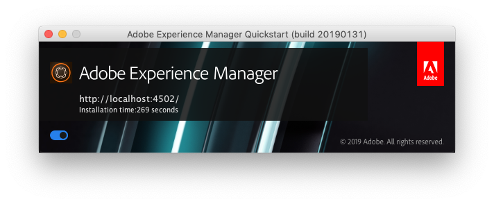

# コマンドラインによる起動と停止{#command-line-start-and-stop}

## コマンドラインからのAdobe Experience Managerの起動 {#starting-adobe-experience-manager-from-the-command-line}

`start` スクリプトは、*&lt;cq-installation>/bin* ディレクトリの下で使用できます。UNIX® と Windows の両方のバージョンが用意されています。 スクリプトは、*&lt;cq-installation>* ディレクトリにインストールされているインスタンスを開始します。

これら 2 つのバージョンでは、Adobe Experience Manager（AEM）インスタンスの開始や調整に使用できる環境変数のリストをサポートしています。

<table>
 <tbody>
  <tr>
   <td><strong>環境変数 </strong></td>
   <td><strong>説明 </strong></td>
  </tr>
  <tr>
   <td>CQ_PORT</td>
   <td>停止および状態スクリプトに使用される TCP ポート<br /> </td>
  </tr>
  <tr>
   <td>CQ_HOST</td>
   <td>ホスト名<br /> </td>
  </tr>
  <tr>
   <td>CQ_INTERFACE</td>
   <td>このサーバーがリッスンするインターフェイス<br /> </td>
  </tr>
  <tr>
   <td>CQ_RUNMODE</td>
   <td>実行モード （コンマ区切り）<br /> </td>
  </tr>
  <tr>
   <td>CQ_JARFILE</td>
   <td>jar ファイルの名前<br /> </td>
  </tr>
  <tr>
   <td>CQ_USE_JAAS</td>
   <td>JAAS の使用（true の場合）<br /> </td>
  </tr>
  <tr>
   <td>CQ_JAAS_CONFIG</td>
   <td>JAAS 設定のパス<br /> </td>
  </tr>
  <tr>
   <td>CQ_JVM_OPTS</td>
   <td>デフォルトの JVM オプション<br /> </td>
  </tr>
 </tbody>
</table>

>[!CAUTION]
>
>実行モードには、オーサーとパブリッシュの中で、最初にAEMを起動する前に設定する必要があるものと、後で変更できないものがあります。 実稼動で使用されるAEM インスタンスを設定する前に、以下を参照してください [実行モードのドキュメント](/help/sites-deploying/configure-runmodes.md) を参照してください。

### Windows プラットフォーム start.bat スクリプトの例 {#windows-platform-start-bat-script-example}

```shell
SET CQ_PORT=1234 & ./start.bat
```

### UNIX® プラットフォーム開始スクリプトの例 {#unix-platform-start-script-example}

```shell
CQ_PORT=1234 ./start
```

>[!NOTE]
>
>start スクリプトは、*&lt;cq-installation>/app* フォルダーの下にインストールされている AEM Quickstart を起動します。

## Adobe Experience Managerの停止 {#stopping-adobe-experience-manager}

AEMを停止するには、次のいずれかの操作を行います。

* 使用するプラットフォームに応じて、次の操作を行います。

   * スクリプトまたはコマンドラインから AEM を起動した場合は、**Ctrl+C**&#x200B;キーを押してサーバーをシャットダウンします。
   * UNIX® で開始スクリプトを使用した場合は、停止スクリプトを使用してAEMを停止する必要があります。

* jar ファイルをダブルクリックしてAEMを起動した場合は、 **日付：** スタートアップウィンドウのボタン（その後、ボタンはに変わります） **オフ**）を選択してサーバーをシャットダウンします。

  

## コマンドラインからの Adobe Experience Manager の停止 {#stopping-adobe-experience-manager-from-the-command-line}

`stop` スクリプトは、*&lt;cq-installation>/bin* ディレクトリの下で使用できます。UNIX® と Windows の両方のバージョンが用意されています。 スクリプトは、*&lt;cq-installation>* ディレクトリにインストールされている実行中のインスタンスを停止します。

### UNIX® プラットフォームの停止スクリプトの例 {#unix-platform-stop-script-example}

```shell
./stop
```

### Windows プラットフォーム stop.bat スクリプトの例 {#windows-platform-stop-bat-script-example}

```shell
./stop.bat
```

リポジトリの再配置を行わずに事前設定のみを行う場合は、次の手順のみで済みます。

* 抽出 `repository.xml` を必要な場所に

* 必要に応じて `repository.xml` を更新する

* `bootstrap.properties` を作成し `repository.config` を定義する

これも、実際のインストールを開始する前におこないます。
