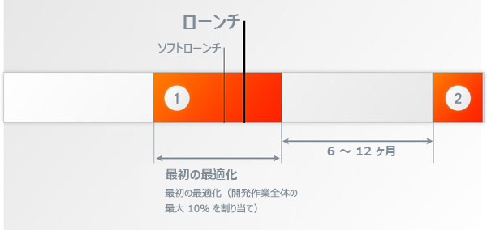
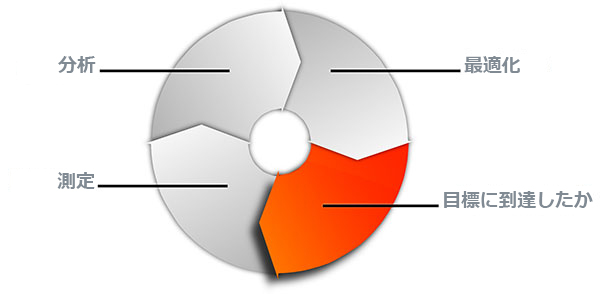
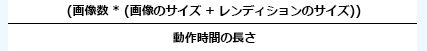
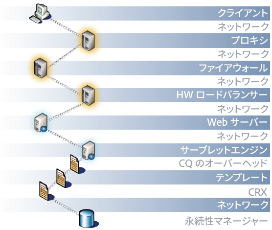
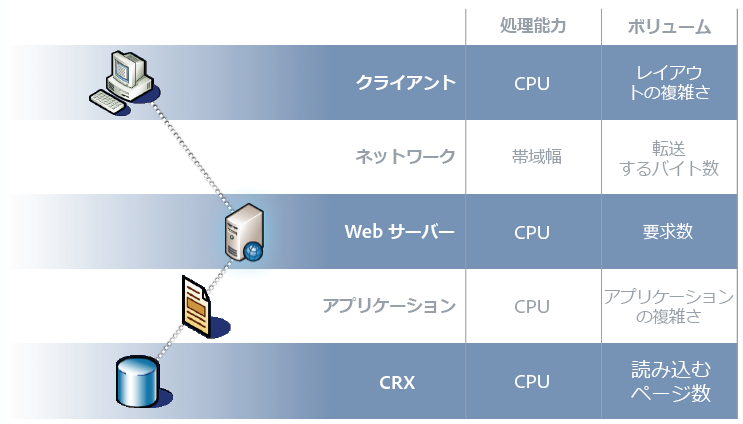
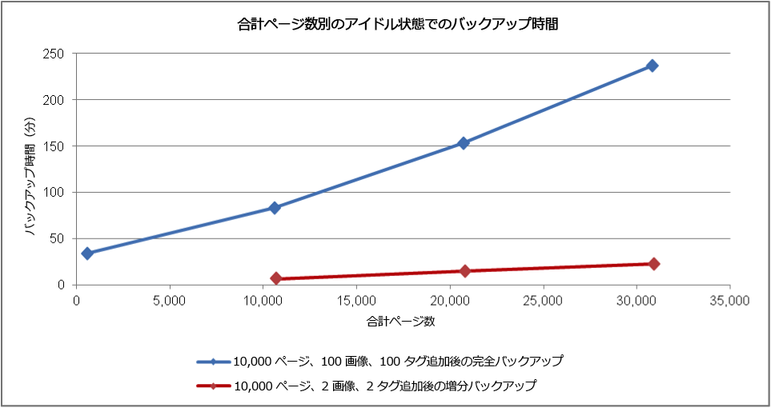
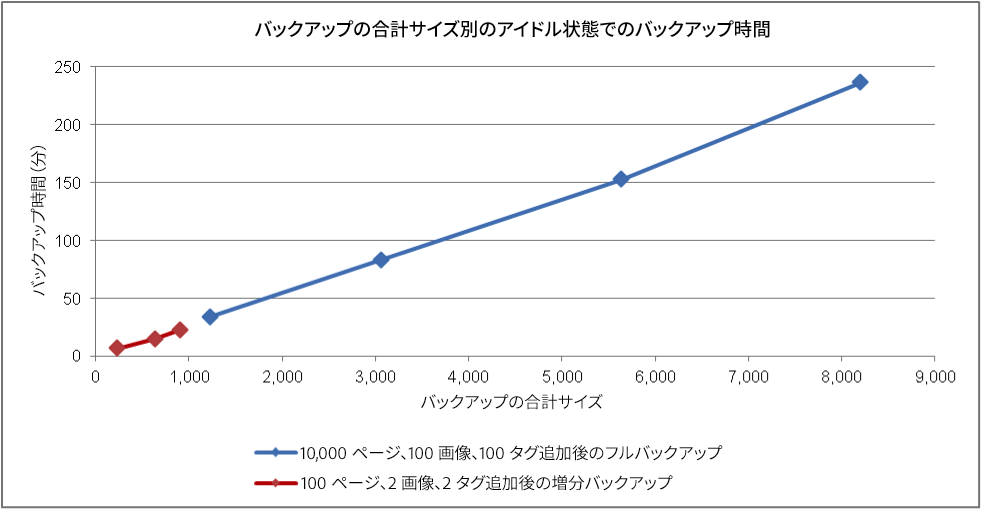
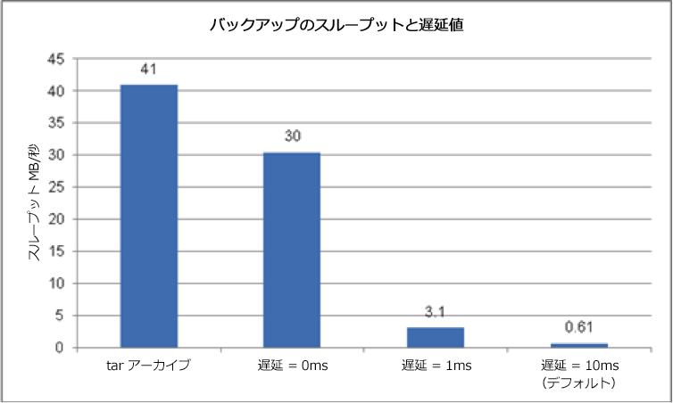

# パフォーマンスの最適化 {#performance-optimization}

>[!NOTE]
>
>パフォーマンスに関する一般的なガイドラインについては、[パフォーマンスガイドライン](/help/sites-deploying/performance-guidelines.md)のページを参照してください。
>
>パフォーマンスに関する問題のトラブルシューティングと修正について詳しくは、[パフォーマンスツリー](/help/sites-deploying/performance-tree.md)も参照してください。
>
>さらに、[パフォーマンスチューニングのヒント](https://helpx.adobe.com/experience-manager/kb/performance-tuning-tips.html)に関するナレッジベースの記事を参照することもできます。

Web サイトが訪問者の要求に応答するまでにどの程度の時間がかかるかは、非常に重要な問題です。当然、応答時間は個々の要求によって異なりますが、平均的なターゲット時間の値を定義することはできます。達成可能かつ維持可能な値を定義したことを確認したうえで、その値に基づいて Web サイトのパフォーマンスを監視すると、潜在的な問題が発生しつつあるときに、その状況を検知することができます。

オーサー環境とパブリッシュ環境では、対象となる利用者の特性が異なるので、目指す応答時間が異なります。

## オーサー環境 {#author-environment}

この環境は、コンテンツを入力および更新する作成者によって使用されます。そのため、少人数のユーザー向けに構築されている必要があります。各ユーザーは、コンテンツページとそのページ上の個々の要素を更新するときに、パフォーマンスに重点を置いた多数の要求を生成します。

## パブリッシュ環境 {#publish-environment}

この環境には、ユーザー向けに提供するコンテンツが置かれます。したがって要求数は非常に多く、速度が非常に重要となります。ただし、それらの要求の性質はさほど動的な内容ではないので、コンテンツのキャッシュや負荷分散などの付加的なパフォーマンス強化メカニズムを適用できます。

>[!NOTE]
>
>* パフォーマンス最適化のための設定が完了したら、[Tough Day](/help/sites-developing/tough-day.md) の手順に従って、高負荷の環境をテストしてください。
>* [パフォーマンスチューニングのヒント](https://helpx.adobe.com/experience-manager/kb/performance-tuning-tips.html)も参照してください。


## パフォーマンスの最適化方法 {#performance-optimization-methodology}

AEM プロジェクトのパフォーマンスを最適化する方法は、5 つの非常に単純なルールに要約されます。それらのルールを守れば、パフォーマンスの問題が発生するのを最初から防ぐことができます。

1. [最適化の計画](#planning-for-optimization)
1. [実際の状況に近いシミュレーション](#simulate-reality)
1. [適切な目標設定](#establish-solid-goals)
1. [妥当性の維持](#stay-relevant)
1. [アジャイルな反復サイクル](#agile-iteration-cycles)

各ルールの内容は一般的な web プロジェクトすべてに当てはまる部分が多く、プロジェクトマネージャーやシステム管理者にとっては、プロジェクトの稼動開始時にパフォーマンスの問題に悩まされないようにするために有効です。

### 最適化の計画 {#planning-for-optimization}



パフォーマンスの最適化フェーズには、プロジェクト全体の作業のうち 10 ％程度を割くことが望ましいと考えられます。もちろん、パフォーマンスの最適化に必要な作業の量は、プロジェクトの複雑さや開発チームの経験によって異なります。プロジェクトによっては、そこまで時間を割く必要がなかったという結果になる可能性もありますが、パフォーマンスの最適化には必ずこの程度の手間を見込んで計画を立てるのが実用的です。

プロジェクトの稼動開始当初は、可能な限り、少ないユーザーを対象として緩やかに運用を開始するのが望ましいと考えられます。そうすれば、全面的なサービス公開による過大なプレッシャーにさらされることなく、本番の経験を蓄積して最適化をいっそう進めることができるからです。

システムが本番に入っても、パフォーマンスの最適化は終わりません。むしろ、サービスを開始して「現実の」システム負荷が判明した後にこそ、再調整をおこなうように計画を立てておくことが重要です。

時が経つにつれて、システム負荷は変化し、システムのパフォーマンスプロファイルは遷移していきます。6 ～ 12 ヶ月おきにパフォーマンスの「チューンアップ」または「ヘルスチェック」を続けていくようにしてください。

### 実際の状況に近いシミュレーション {#simulate-reality}


Web サイトの運用を開始した後で、パフォーマンスの問題が発生することが判明した場合、理由は 1 つしかありません。それは、負荷とパフォーマンスのテストで実際の状況に十分近いシミュレーションができていなかったということです。

実際の状況に近いシミュレーションを行うのは難しいことであり、「実際」の追求にどこまで手間をかけるかは、プロジェクトの性質に応じて無理のない範囲で判断する必要があります。「実際」とは、「実際のコード」や「実際のトラフィック」に限りません。「実際のコンテンツ」、特にコンテンツのサイズや構造が実際的であることも重要です。リポジトリのサイズや構造が変われば、テンプレートの挙動はまったく違ってくる可能性があるということを常に意識してください。

### 適切な目標設定 {#establish-solid-goals}


適切なパフォーマンス目標を設定することの重要性を軽視してはいけません。何らかのパフォーマンス目標に基づく活動を一旦開始すると、たとえその目標に確かな根拠がないとしても、後で軌道修正することは非常に困難です。

どうすれば適切で確実性の高いパフォーマンス目標を設定できるかというのは非常に難しい問題です。多くの場合、最も参考になるのは、類似性がある Web サイト（例えば、前身となったサイト）で採取した実際のログやベンチマーク結果の情報です。

### 妥当性の維持 {#stay-relevant}


ボトルネックの最適化は 1 つずつ適用していくことが重要です。ある対策の影響を検証しないうちに別の作業も並行しておこなうと、どの最適化対策が実際に効果を発揮したのかわからなくなります。

### アジャイルな反復サイクル {#agile-iteration-cycles}



パフォーマンスのチューニングは、目標を達成するまで測定、分析、最適化および検証のサイクルを続ける反復的なプロセスです。この性質を考えると、サイクルを 1 周するごとに後で大がかりなテストプロセスを実施するよりも、最適化フェーズ内でアジャイルな検証プロセスを実施するほうがよいと考えられます。

これはつまり、最適化作業を実施する開発者には、最適化目標が達成された場合にその事実をすぐ把握できる手段が必要だということです。目標の達成は最適化作業の終了を意味するだけに、いつ達成されたかという情報には大きな価値があります。

## 基本的なパフォーマンスのガイドライン {#basic-performance-guidelines}

大まかな目安として、キャッシュされていない HTML 要求の応答時間は 100 ms 未満に抑えます。より具体的には次のようなガイドラインに従うとよいでしょう。

* ページ要求件数の 70 ％に対して 100 ms 未満で応答する。
* ページ要求件数の 25 ％に対して 100 ～ 300 ms の範囲で応答する。
* ページ要求件数の 4 ％に対して 300 ～ 500 ms の範囲で応答する。
* ページ要求件数の 1 ％に対して 500 ～ 1000 ms の範囲で応答する。
* ページ要求への応答時間が 1 秒を超えることはない。

以上の数値は、次の条件を前提としています。

* パブリッシュ環境で測定（オーサー環境に関連するオーバーヘッドがない）
* サーバー上で測定される（ネットワークオーバーヘッドを考慮しない）
* キャッシュなし（ AEM Output キャッシュや Dispatcher キャッシュを考慮しない）
* 多数の依存ファイル（HTML、JS、PDF など）を伴う複雑な要求のみ
* 他のシステム負荷なし

パフォーマンスに影響しやすい要因はいくつかありますが、それらは主に次に関連する問題です。

* Dispatcher キャッシュの非効率性
* 通常の表示テンプレート内で使用されるクエリ

JVM および OS レベルの調整は、通常、大幅なパフォーマンス向上には結び付かないので、最適化サイクルの最後に実行すれば十分です。

コンテンツリポジトリの構造化の方法はパフォーマンスにも影響を及ぼす可能性があります。最適なパフォーマンスを確保するために、コンテンツリポジトリ内の個々のノードに接続される子ノードの数は、通常 1,000 個未満にする必要があります。

通常のパフォーマンス最適化では、次の要素を使用します。

* `request.log`
* コンポーネント別の時間計測
* Java プロファイラー

### デジタルアセットの読み込み時と編集時のパフォーマンス {#performance-when-loading-and-editing-digital-assets}

デジタルアセットの読み込み時と編集時には大量のデータが関係してくるので、パフォーマンスが問題になります。

この場合、パフォーマンスに影響を及ぼす要素は次の 2 つです。

* CPU - 複数のコアがあると、トランスコーディングの際に処理がスムーズに行われます。
* ハードディスク - 並列の RAID ディスクを使用すると、同じ効果がもたらされます。

パフォーマンスを向上するには、次の点を考慮します。

* 1 日にアップロードするアセットの数。次の式を基に概算できます。


* 編集が行われる時間枠（通常は営業日の長さ。海外との業務がある場合はより多くの時間が必要）。
* アップロードする画像の MB 単位の平均サイズ（および 1 つの画像につき生成されるレンディションのサイズ）。
* 平均データレートは次の式で算出されます。



* すべての編集の 80 ％は 20 ％の時間内におこなわれるので、ピーク時には平均データレートが 4 倍になります。これがパフォーマンスの目標です。

## パフォーマンスの監視 {#performance-monitoring}

パフォーマンス（またはパフォーマンスの欠如）はユーザーが最初に認識する点の 1 つなので、ユーザーインターフェイスを使用するアプリケーションと同様に、パフォーマンスは非常に重要です。AEM インストールのパフォーマンスを最適化するには、インスタンスの様々な属性とインスタンスの動作を監視する必要があります。

パフォーマンスの監視を実行する方法について詳しくは、[パフォーマンスの監視](/help/sites-deploying/monitoring-and-maintaining.md#monitoring-performance)を参照してください。

多くの場合、パフォーマンスの問題を引き起こす原因を見つけ出すのは、その影響が明白であったとしても困難です。

基本となる開始点は、通常稼動時のシステムを熟知することです。適切に稼動する環境がどのように「見え」て「動作する」かを把握していない限り、パフォーマンスが低下した際に問題を特定するのは難しくなります。つまり、スムーズに稼動しているシステムの調査に時間を費やし、パフォーマンスの情報を継続して収集する必要があります。この情報に基づいて、パフォーマンスが低下した場合に比較をおこなうことができます。

次の図は、AEM コンテンツの要求のパスおよびパフォーマンスに影響を及ぼす可能性のある様々な要素を示しています。



パフォーマンスは、ボリュームと処理能力のバランスでもあります。

* **ボリューム** - システムが処理および提供する出力の量です。
* **処理能力** - システムがボリュームを提供する能力です。

これを web チェーン全体の様々な場所で示すことができます。



多くの場合、複数の機能領域がパフォーマンスに影響を及ぼす原因となります。

* キャッシュ
* アプリケーション（プロジェクト）コード
* 検索機能

### パフォーマンスに関する基本ルール {#basic-rules-regarding-performance}

パフォーマンスを最適化する場合は、次に示すルールを常に意識してください。

* パフォーマンスのチューニングを各プロジェクトでおこなう&#x200B;*。*
* 開発サイクルの初期に最適化をおこなわない。
* パフォーマンスはシステムの最も弱い部分に左右される。
* 常に処理能力とボリュームを比較して考える。
* 重要な要素を最初に最適化する。
* 必ず現実的な目標を設定してから最適化を実施する&#x200B;*。*

>[!NOTE]
>
>多くの場合、パフォーマンスの測定に使用するメカニズム自体が、測定する内容に影響を及ぼすことを忘れないでください。この矛盾点を必ず考慮して、可能な限りその影響を排除する必要があります。具体的には、ブラウザーのプラグインを可能な限り無効にするなどの手段があります。

## パフォーマンスの設定 {#configuring-for-performance}

パフォーマンスを最適化するために AEM（および基盤となるリポジトリ）の特定の要素を設定できます。設定可能な要素と推奨事項を次に示します。変更を行う前に、記載されている機能を使用するかどうか、またはどのように使用するかを確認しておく必要があります。

>[!NOTE]
>
>詳しくは、[ナレッジベースの記事](https://helpx.adobe.com/experience-manager/kb/performance-tuning-tips.html)を参照してください。

### 検索インデックスの作成 {#search-indexing}

AEM 6.0 から、Adobe Experience Manager では Oak ベースのリポジトリアーキテクチャを使用しています。

更新されたインデックス作成の情報については、次のページを参照してください。

* [クエリとインデックスに関するベストプラクティス](/help/sites-deploying/best-practices-for-queries-and-indexing.md)
* [クエリとインデックス作成](/help/sites-deploying/queries-and-indexing.md)

### ワークフローの同時処理 {#concurrent-workflow-processing}

パフォーマンスを向上するには、同時に実行するワークフロープロセスの数を制限します。デフォルトでは、Java VM で使用可能なプロセッサーの数だけ、ワークフローエンジンがワークフローを並行して処理します。ワークフローのステップで大量の処理リソース（RAM または CPU）が必要な場合は、それらのワークフローの一部を並行して実行する際に、使用可能なサーバーリソースに大きな負担をかけることになります。

例えば、画像（通常は DAM アセット）がアップロードされると、ワークフローではその画像が自動的に DAM に読み込まれます。多くの場合、画像は高解像度であり、処理のために数百 MB のヒープをすぐに消費します。このような画像を並行して処理すると、メモリのサブシステムとガベージコレクターに大きな負荷がかかります。

ワークフローエンジンでは、Apache Sling のジョブキューを使用して、作業項目の処理の対応およびスケジュール設定を行います。デフォルトでは、ワークフロージョブの処理用に、Apache Sling Job Queue Configuration サービスファクトリから次のジョブキューサービスが作成されています。

* Granite Workflow Queue：ワークフローのほとんどのステップ（DAM アセットを処理するステップなど）では、Granite Granite Workflow Queue サービスを使用します。
* Granite Workflow External Process Job Queue：このサービスは、通常は外部システムへのアクセスや結果のポーリングに使用される、特殊な外部ワークフローのステップに使用します。例えば、InDesign のメディア抽出プロセスステップは外部プロセスとして実装されます。ワークフローエンジンでは、ポーリングの処理に外部キューを使用します。（[com.day.cq.workflow.exec.WorkflowExternalProcess](https://helpx.adobe.com/jp/experience-manager/6-5/sites/developing/using/reference-materials/javadoc/com/day/cq/workflow/exec/WorkflowExternalProcess.html) を参照してください）。

これらのサービスを設定して、同時に実行するワークフロープロセスの最大数を制限します。

>[!NOTE]
>
>特定のワークフローモデル用のジョブキューを作成していない限り、このようなジョブキューの設定はすべてのワークフローに影響を及ぼします（[特定のワークフロー用のキューの設定](/help/sites-deploying/configuring-performance.md#configure-the-queue-for-a-specific-workflow)を参照）。

#### リポジトリでの設定 {#configuration-in-the-repo}

[sling:OsgiConfig ノードを使用](/help/sites-deploying/configuring-osgi.md#adding-a-new-configuration-to-the-repository)してサービスを設定する場合は、既存のサービスの PID（例：org.apache.sling.event.jobs.QueueConfiguration.370aad73-d01b-4a0b-abe4-20198d85f705）を特定する必要があります。Web コンソールを使用すると、PID を検出できます。

`queue.maxparallel` という名前のプロパティを設定する必要があります。

#### Web コンソールでの設定 {#configuration-in-the-web-console}

[Web コンソールを使用](/help/sites-deploying/configuring-osgi.md#osgi-configuration-with-the-web-console)してこれらのサービスを設定するには、Apache Sling Job Queue Configuration サービスファクトリで既存の設定項目を特定します。

並列ジョブの最大数という名前のプロパティを設定する必要があります。

### 特定のワークフロー用のキューの設定 {#configure-the-queue-for-a-specific-workflow}

特定のワークフローモデル用のジョブキューを作成して、そのワークフローモデル用のジョブの処理を設定できるようにします。この方法では、設定が特定のワークフロー用の処理に影響を及ぼします。一方、デフォルトの Granite Workflow Queue の設定はその他のワークフローの処理を制御します。

ワークフローモデルの実行時には、特定のトピック用の Sling ジョブが作成されます。デフォルトでは、トピックは、一般的な Granite Workflow Queue または Granite Workflow External Process Job Queue 用に設定されるトピックに一致します。

* `com/adobe/granite/workflow/job*`
* `com/adobe/granite/workflow/external/job*`

ワークフローモデルが生成する実際のジョブトピックには、モデル固有のサフィックスが含まれます。例えば、**DAM アセットの更新**&#x200B;ワークフローモデルでは、次のトピックを含むジョブが生成されます。

`com/adobe/granite/workflow/job/etc/workflow/models/dam/update_asset/jcr_content/model`

そのため、ワークフローモデルのジョブトピックに一致するトピック用のジョブキューを作成できます。キューのパフォーマンス関連のプロパティの設定は、キュートピックに一致するジョブを生成するワークフローモデルにのみ影響を及ぼします。

次の手順では、例として **DAM アセットの更新**&#x200B;ワークフローを使用して、ワークフロー用のジョブキューを作成します。

1. ジョブキューを作成する対象となるワークフローモデルを実行します。これにより、トピックの統計が生成されます。例えば、アセットに画像を追加して、**DAM アセットの更新**&#x200B;ワークフローを実行します。
1. Sling ジョブコンソール（`https://<host>:<port>/system/console/slingevent`）をクリックします。
1. コンソールでワークフロー関連トピックを検出します。DAM アセットの更新の場合は、次のトピックが見つかります。

   * `com/adobe/granite/workflow/external/job/etc/workflow/models/dam/update_asset/jcr_content/model`
   * `com/adobe/granite/workflow/job/etc/workflow/models/dam/update_asset/jcr_content/model`
   * `com/adobe/granite/workflow/job/etc/workflow/models/dam-xmp-writeback/jcr_content/model`

1. これらのトピックごとに 1 つのジョブキューを作成します。ジョブキューを作成するには、Apache Sling Job Queue ファクトリサービス用のファクトリ設定を作成します。

   このファクトリ設定は、Topics プロパティがワークフロージョブのトピックに一致する点を除き、[ワークフローの同時処理](/help/sites-deploying/configuring-performance.md#concurrent-workflow-processing)で説明した Granite Workflow Queue と同様です。

### AEM DAM アセット同期サービス {#cq-dam-asset-synchronization-service}

`AssetSynchronizationService` は、マウントされたリポジトリ（LiveLink、Documentum など）からのアセットの同期に使用します。デフォルトでは、300 秒（5 分）ごとに定期チェックが行われるので、マウントされたリポジトリを使用しない場合は、このサービスを無効にすることができます。

この処理を行うには、[OSGi サービス](/help/sites-deploying/configuring-osgi.md)である **CQ DAM Asset Synchronization Service** を設定して、**同期期間**（`scheduler.period`）を（最低）1 年（秒数で定義）にします。

### 複数の DAM インスタンス {#multiple-dam-instances}

複数の DAM インスタンスをデプロイすると、パフォーマンスの強化に役立ちます。例えば、次のような場合です。

* 作成者環境用の多数のアセットの定期的なアップロードが原因で負荷が高い場合、別の専用の DAM インスタンスが作成者環境にサービスを提供します。
* 世界各国に複数のチームが存在します（米国、ヨーロッパ、アジアなど）。

その他の考慮事項は次のとおりです。

* 作成者の「処理中の作業」と発行の「最終版」を分離する
* オーサーの内部ユーザーとパブリッシュの外部の訪問者／ユーザー（代理人、報道関係者、顧客、受講生など）を分離する

## 品質保証のベストプラクティス {#best-practices-for-quality-assurance}

パブリッシュ環境にとって最も重要なのはパフォーマンスです。そのため、プロジェクトの実装時にパブリッシュ環境に対しておこなうパフォーマンステストについて注意深く計画および分析する必要があります。

ここでは、*パブリッシュ*&#x200B;環境におけるパフォーマンステストに特化したテスト概念の定義に関連する問題の標準化された概要を示します。これは主に QA エンジニア、プロジェクトマネージャーおよびシステム管理者に役立つ情報です。

次に、*公開*&#x200B;環境での AEM アプリケーションのパフォーマンステストへの標準化されたアプローチを説明します。これには、次の 5 つのフェーズが含まれます。

* [知識の検証](#verification-of-knowledge)
* [範囲の定義](#scope-definition)
* [テスト方法](#test-methodologies)
* [パフォーマンスの目標の定義](#defining-the-performance-goals)
* [最適化](#optimization)

包括的な追加のプロセスとして「制御」があります。これは必要なプロセスですが、テストに限定されるものではありません。

### 知識の検証 {#verification-of-knowledge}

最初の手順は、テストの開始前に知っておく必要のある基本情報の文書化です。

* テスト環境のアーキテクチャ
* テストに必要な内部要素を詳細に示したアプリケーションマップ（単体で使用する場合と組み合わせて使用する場合の両方）

#### テスト用のアーキテクチャ {#test-architecture}

パフォーマンステストに使用するテスト環境のアーキテクチャを明確に文書化してください。

計画した実稼働のパブリッシュ環境、Dispatcher およびロードバランサーを再現する必要があります。

#### アプリケーションマップ {#application-map}

概要を明確にするために、アプリケーション全体のマップを作成できます（オーサー環境におけるテストからこの情報を入手できる可能性があります）。

アプリケーションの内部要素を図で表すことで、テスト要件の概要を説明できます。色分けしたマップは、レポートの基盤としての役割も果たします。

### 範囲の定義 {#scope-definition}

通常、アプリケーションは様々な使用事例に対応しています。これらの事例は非常に重要なものと、それほど重要でないものに分けられます。

公開におけるパフォーマンステストの範囲を絞り込むために、次の項目を定義することをお勧めします。

* 最も重要な業務上の事例
* 最も不可欠な技術上の事例

事例の数は状況に応じて異なりますが、管理しやすい数（例えば、5 ～ 10）に制限してください。

主要な事例を選択したら、測定に使用する重要業績評価指標（KPI）とツールを事例ごとに定義できます。一般的な KPI の例を次に示します。

* エンドツーエンドの応答時間
* サーブレットの応答時間
* 単一のコンポーネントに対する応答時間
* サービスに対する応答時間
* スレッドプール内のアイドル状態のスレッドの数
* 自由な接続の数
* システムリソース（CPU、I/O アクセスなど）

### テスト方法 {#test-methodologies}

この概念には、パフォーマンスの目標の定義およびテストに使用する 4 つのシナリオがあります。

* 単一のコンポーネントのテスト
* 組み合わされたコンポーネントのテスト
* 運用開始のシナリオ&#x200B;**
* エラーのシナリオ

基盤となる原則は次のとおりです。

#### コンポーネントのブレークポイント {#component-breakpoints}

* 各コンポーネントには、パフォーマンスに関連する特定のブレークポイント（限界点）があります。つまり、特定のポイントに到達するまではコンポーネントのパフォーマンスが良好で、そのポイントを超えるとパフォーマンスが急激に低下します。
* アプリケーションの概要をすべて把握するには、最初にコンポーネントを検証して、それぞれのブレークポイントを確認しておく必要があります。
* ブレークポイントを検出するために、負荷テストを実施できます。このテストでは、ある特定の期間にわたってユーザー数を増やして負荷を上げていきます。この負荷およびコンポーネントの応答を監視することにより、コンポーネントのブレークポイントに到達したときの特定のパフォーマンスの動作を確認できます。このポイントは、1 秒あたりの同時トランザクションの数および同時ユーザーの数によって制限されます（コンポーネントに対するこの KPI の影響度が高い場合）。
* この情報は引き続き改善のためのベンチマークとなり、使用される測定の効率を示して、テストシナリオの定義に役立てることができます。

#### トランザクション {#transactions}

* トランザクションという用語は、完全な Web ページの要求を表すために使用します。この要求には、ページ自体および後続のすべての呼び出し（ページ要求、AJAX 呼び出し、画像およびその他のオブジェクト）が含まれます。**要求のドリルダウン**
* 各要求をすべて分析するために、コールスタックの各要素を表してから、各要求の平均処理時間の合計を求めることができます。

### パフォーマンスの目標の定義 {#defining-the-performance-goals}

範囲と関連する KPI の定義が完了したら、パフォーマンスの目標を設定できます。この作業には、テストシナリオおよびターゲットとなる値の策定が含まれます。

平均時とピーク時の両方の条件下でパフォーマンスをテストしてください。また、運用開始のシナリオのテストを実施して、運用開始時の Web サイトに対する関心の増加に対応できるようにする必要があります。

既存の Web サイトから収集したエクスペリエンス（統計）も将来の目標を決める際に役立ちます。例えば、本番の Web サイトからの上位のトラフィックなどです。

#### 単一のコンポーネントのテスト {#single-component-tests}

平均時とピーク時の両方の条件下で、不可欠なコンポーネントをテストする必要があります。

どちらの場合も、定義済みの数のユーザーがシステムを使用する際の 1 秒あたりのトランザクションの予想数を定義できます。

| コンポーネント | テストの種類 | いいえ。/ユーザー | トランザクション数/秒（予想） | トランザクション数/秒（テスト済み） | 説明 |
|---|---|---|---|---|---|
| ホームページ：1 ユーザー | 平均 | 1 | 1 |  |  |
|  | ピーク時 | 1 | 3 |  |  |
| ホームページ：100 ユーザー | 平均 | 100 | 3 |  |  |
|  | ピーク時 | 100 | 3 |  |

#### 組み合わされたコンポーネントのテスト {#combined-component-tests}

組み合わされたコンポーネントをテストすると、アプリケーションの動作がより忠実に反映されます。この場合も、平均時とピーク時の両方の条件下でテストを実施する必要があります。

| シナリオ | コンポーネント | いいえ。/ユーザー | トランザクション数/秒（予想） | トランザクション数/秒（テスト済み） | 説明 |
|---|---|---|---|---|---|
| 混在：平均時 | ホームページ | 10 | 1 |  |  |
|  | 検索 | 10 | 1 |  |  |
|  | ニュース | 10 | 2 |  |  |
|  | イベント | 10 | 1 |  |  |
|  | アクティベート | 10 | 3 |  | オーサーの動作のシミュレーション |
| 混在：ピーク時 | ホームページ | 100 | 5 |  |  |
|  | 検索 | 50 | 5 |  |  |
|  | ニュース | 100 | 10 |  |  |
|  | イベント | 100 | 10 |  |  |
|  | アクティベート | 20 | 20 |  | オーサーの動作のシミュレーション |

#### 運用開始のテスト {#going-live-tests}

Web サイトの運用開始後の最初の数日は、関心レベルの増加が予測されます。この値はおそらく、現在テストを進めているピーク時の値よりも大きくなります。運用開始のシナリオをテストして、システムがこの状況に対応できるかどうかを確認しておくことを強くお勧めします。

| シナリオ | テストの種類 | いいえ。/ユーザー | トランザクション数/秒（予想） | トランザクション数/秒（テスト済み） | 説明 |
|---|---|---|---|---|---|
| 運用開始：ピーク時 | ホームページ | 200 | 20 |  |  |
|  | 検索 | 100 | 10 |  |  |
|  | ニュース | 200 | 20 |  |  |
|  | イベント | 200 | 20 |  |  |
|  | アクティベート | 20 | 20 |  | オーサーの動作のシミュレーション |

#### エラーのシナリオのテスト {#error-scenario-tests}

システムによる対応が正しく適切におこなわれるように、エラーのシナリオもテストする必要があります。エラー自体を処理する方法だけでなく、その方法がパフォーマンスに及ぼす可能性のある影響も確認します。次に例を示します。

* ユーザーが検索ボックスに検索用語を入力しようとするとどうなるか
* 検索用語が一般的すぎて、返される結果の数が非常に多い場合はどうなるか

このようなテストの策定時には、すべてのシナリオが定期的に発生するわけではない点に注意してください。ただし、テストがシステム全体に及ぼす影響は重要です。

| エラーのシナリオ | エラータイプ | いいえ。/ユーザー | トランザクション数/秒（予想） | トランザクション数/秒（テスト済み） | 説明 |
|---|---|---|---|---|---|
| 検索コンポーネントの過負荷 | グローバルなワイルドカード（アスタリスク）を使用した検索 | 10 | 1 |  | &amp;ast;&amp;ast;&amp;ast; のみが検索されます。 |
|  | ストップワード | 20 | 2 |  | ストップワードの検索。 |
|  | 空の文字列 | 10 | 1 |  | 空の文字列の検索。 |
|  | 特殊文字 | 10 | 1 |  | 特殊文字の検索。 |

#### 耐久テスト {#endurance-tests}

システムを継続的な期間（数時間または数日）実行した後にのみ発生する問題があります。耐久テストは、必要とされるある一定の期間にわたる、継続的な平均負荷を確認するために使用します。テストの後でパフォーマンスの低下を分析できます。

| シナリオ | テストの種類 | いいえ。/ユーザー | トランザクション数/秒（予想） | トランザクション数/秒（テスト済み） | 説明 |
|---|---|---|---|---|---|
| 耐久テスト（72 時間） | ホームページ | 10 | 1 |  |  |
|  | 検索 | 10 | 1 |  |  |
|  | ニュース | 20 | 2 |  |  |
|  | イベント | 10 | 1 |  |  |
|  | アクティベート | 1 | 3 |  | オーサーの動作のシミュレーション |

### 最適化 {#optimization}

実装の後半の段階では、アプリケーションを最適化して、パフォーマンスの目標を達成または最大化する必要があります。

実施した最適化をすべてテストして、次の点を確認してください。

* 機能に影響を及ぼさない
* リリース前に負荷テストを実施して検証済みである

負荷の生成、パフォーマンスの監視および結果の分析に役立つ様々なツールが用意されています。

* [JMeter](https://jakarta.apache.org/jmeter/)
* [Load Runner](https://www.microfocus.com/en-us/products/loadrunner-load-testing/overview)
* [Determyne](https://www.determyne.com/) InsideApps
* [InfraRED](https://www.infraredsoftware.com/)
* [Java Interactive Profile](https://jiprof.sourceforge.net/)
* その他の様々なツール

最適化の後にもう一度テストを実施して、影響を確認する必要があります。

### レポート {#reporting}

すべてのユーザーが常にステータスを把握できるようにするために、継続的にレポートを作成する必要があります。前述のとおり、色分けしたアーキテクチャマップをこの目的で使用できます。

すべてのテストが完了すると、次の項目についてレポートできます。

* 発生した重大なエラー
* 重大でない問題（詳細な調査は必要）
* テスト中の想定事項
* テストから得られた推奨事項

## Dispatcher の使用時のパフォーマンスの最適化 {#optimizing-performance-when-using-the-dispatcher}

[Dispatcher](https://experienceleague.adobe.com/docs/experience-manager-dispatcher/using/dispatcher.html?lang=ja) は Adobe のキャッシュ／ロードバランシングツールです。Dispatcher を使用する場合は、キャッシュパフォーマンスを確保するために web サイトの最適化を検討する必要があります。

>[!NOTE]
>
>Dispatcher のバージョンは AEM とは無関係ですが、Dispatcher のドキュメントは AEM のドキュメントに組み込まれています。最新バージョンの AEM のドキュメントに組み込まれている Dispatcher のドキュメントを必ず使用してください。
>
>以前のバージョンの AEM のドキュメントに組み込まれている Dispatcher のドキュメントへのリンクをたどると、このページにリダイレクトされる可能性があります。

Dispatcher には、Web サイトで活用するとパフォーマンスが最適化される、複数の組み込みのメカニズムが用意されています。ここでは、キャッシュのメリットを最大化するように Web サイトをデザインする方法について説明します。

>[!NOTE]
>
>まず覚えておいてほしいのは、Dispatcher は標準の Web サーバーにキャッシュを格納するという点です。これは、次のことを意味します。
>
>* URL を使用してページおよび要求として格納できるデータはすべてキャッシュ可能です。
>* cookie、セッションデータ、フォームデータなど、その他のものは格納できません。

>
>通常、多くのキャッシュ戦略は適切な URL の選択を含んでおり、この追加データには依存しないことです。
>
>Dispatcher バージョン 4.1.11 では、応答ヘッダーをキャッシュすることもできます。[HTTP 応答ヘッダーのキャッシュ](https://helpx.adobe.com/jp/experience-manager/dispatcher/using/dispatcher-configuration.html#configuring-the-dispatcher-cache-cache)を参照してください。

### Dispatcher のキャッシュ率の計算 {#calculating-the-dispatcher-cache-ratio}

キャッシュ率の計算式では、システムが受け取った要求の総数のうちキャッシュによって処理された要求の割合（％）が概算されます。キャッシュ率を計算するには、次の情報が必要です。

* 要求の総数。この情報は、Apache の `access.log` で確認できます。詳しくは、[Apache の公式ドキュメント](https://httpd.apache.org/docs/2.4/logs.html#accesslog)を参照してください。

* パブリッシュインスタンスが処理した要求の数。この情報は、インスタンスの `request.log` で確認できます。詳しくは、[request.log の解釈](/help/sites-deploying/monitoring-and-maintaining.md#interpreting-the-request-log)および[ログファイルの検索](/help/sites-deploying/monitoring-and-maintaining.md#finding-the-log-files)を参照してください。

キャッシュ率の計算式は次のとおりです。

* 要求の総数からパブリッシュにおける要求の数を&#x200B;**差し引き**、それを要求の総数で&#x200B;**割ります**。

例えば、要求の総数が 129,491 であり、パブリッシュインスタンスによって処理された要求の数が 58,959 である場合、キャッシュ率は **(129,491 - 58,959)/129,491 = 54.5％**&#x200B;です。

パブリッシャーと Dispatcher が 1 対 1 のペアではない場合、正確な測定値を得るには、すべての Dispatcher とパブリッシャーからの要求を加算する必要があります。[推奨されるデプロイメント](/help/sites-deploying/recommended-deploys.md)も参照してください。

>[!NOTE]
>
>最適なパフォーマンスを確保するには、90％から 95％のキャッシュ率をお勧めします。

#### 一貫性のあるページエンコーディングの使用 {#using-consistent-page-encoding}

Dispatcher バージョン 4.1.11 では、応答ヘッダーをキャッシュできます。Dispatcher で応答ヘッダーをキャッシュしない場合、ページエンコーディング情報をヘッダーに格納すると、問題が生じる可能性があります。この場合、Dispatcher がキャッシュからページを提供すると、Web サーバーのデフォルトのエンコーディングがそのページに使用されます。この問題を回避する方法は 2 つあります。

* 使用するエンコーディングが 1 つだけの場合は、Web サーバーで使用するエンコーディングが AEM の Web サイトのデフォルトのエンコーディングと同じであることを確認します。
* `<META>` タグを HTML の `head` セクションで使用して、エンコーディングを設定します。次に例を示します。

```xml
        <META http-equiv="Content-Type" content="text/html; charset=EUC-JP">
```

#### URL パラメーターの使用回避 {#avoid-url-parameters}

可能な限り、キャッシュするページには URL パラメーターを使用しないでください。例えば、サイトに写真ギャラリーがあるとします。このとき、次の URL はキャッシュされません（Dispatcher が[適切に設定されている](https://helpx.adobe.com/jp/experience-manager/dispatcher/using/dispatcher-configuration.html#configuring-the-dispatcher-cache-cache)場合を除く）。

```xml
www.myCompany.com/pictures/gallery.html?event=christmas&amp;page=1
```

しかし、次のようにして、これらのパラメーターをページ URL に追加することができます。

```xml
www.myCompany.com/pictures/gallery.christmas.1.html
```

>[!NOTE]
>
>この URL は、`gallery.html` と同じページおよび同じテンプレートを呼び出します。テンプレートの定義では、ページをレンダリングするスクリプトを指定できます。または、すべてのページに同じスクリプトを使用できます。

#### URL ごとのカスタマイズ {#customize-by-url}

ユーザーによるフォントサイズの変更（またはその他の任意のレイアウトのカスタマイズ）を許可する場合は、それぞれのカスタマイズが URL に反映されるようにする必要があります。

例えば、cookie はキャッシュされないので、フォントサイズを cookie（または同様のメカニズム）に格納した場合、キャッシュされたページではフォントサイズが維持されません。その結果、Dispatcher は任意のフォントサイズのドキュメントをランダムに返します。

フォントサイズを URL にセレクターとして含めれば、この問題を回避できます。

```xml
www.myCompany.com/news/main.large.html
```

>[!NOTE]
>
>ほとんどのレイアウトの側面では、スタイルシートまたはクライアント側スクリプトを使用することもできます。通常、これらはキャッシュと非常にうまく連携します。
>
>これは印刷版でも役立ちます。次のような URL を使用できます。
>
>`www.myCompany.com/news/main.print.html`
>
>テンプレートの定義のスクリプトグロブを使用すると、印刷ページをレンダリングする個別のスクリプトを指定できます。

#### タイトルとして使用する画像ファイルの無効化 {#invalidating-image-files-used-as-titles}

ページタイトルまたはその他のテキストを写真としてレンダリングする場合は、そのファイルを、ページ上のコンテンツの更新時に自動的に削除されるような方法で格納することをお勧めします。

1. ページと同じフォルダーに画像ファイルを配置します。
1. 画像ファイルに次の命名形式を使用します。


   `<page file name>.<image file name>`

例えば、`file myPage.title.gif` にページ のタイトル `myPage.html` を格納できます。ページが更新されると、このファイルは自動的に削除されるので、ページタイトルに対する変更はキャッシュに自動的に反映されます。

>[!NOTE]
>
>画像ファイルは必ずしも AEM インスタンスに物理的に存在するわけではありません。画像ファイルを動的に作成するスクリプトを使用できます。そのファイルを Dispatcher が Web サーバーに格納します。

#### ナビゲーションに使用する画像ファイルの無効化 {#invalidating-image-files-used-for-navigation}

ナビゲーションエントリ用の写真を使用する場合の方法は、タイトルを使用する場合と基本的に同じですが、若干複雑になります。すべてのナビゲーション画像をターゲットページと共に格納します。通常用とアクティブ用の 2 つの写真を使用する場合は、次のスクリプトを使用できます。

* 通常どおりにページを表示するスクリプト
* 「.normal」要求を処理して、通常の写真を返すスクリプト
* 「.active」要求を処理して、アクティベートされた写真を返すスクリプト

ページと同じ命名ハンドルを使用してこれらの写真を作成し、コンテンツの更新によって写真とページが削除されるようにしてください。

変更されないページの場合、通常、そのページ自体は自動的に無効化されますが、写真はキャッシュに残ります。

#### パーソナライズ機能 {#personalization}

パーソナライズ機能は必要な場所に制限することをお勧めします。その理由は次のとおりです。

* 開始ページを自由にカスタマイズ可能にした場合は、ユーザーからそのページを要求されるたびにページを構築する必要があります。
* 一方、10 個の異なる開始ページのなかから選択するようにした場合は、各ページをキャッシュしてパフォーマンスを強化できます。

>[!TIP]
>Dispatcher キャッシュの設定について詳しくは、[AEM Dispatcher Cache チュートリアル](https://experienceleague.adobe.com/docs/experience-manager-learn/dispatcher-tutorial/overview.html?lang=ja)および[保護されたコンテンツのキャッシュ](https://experienceleague.adobe.com/docs/experience-manager-learn/dispatcher-tutorial/chapter-1.html?lang=ja#dispatcher-tips-and-tricks)の節を参照してください。

各ページをパーソナライズする（例えば、ユーザー名をタイトルバーに挿入する）場合は、パフォーマンスに重大な影響を及ぼす可能性があります。

>[!TIP]
>保護されたコンテンツのキャッシュについては、Dispatcher ガイドの[セキュリティ保護されたコンテンツのキャッシュ](https://experienceleague.adobe.com/docs/experience-manager-dispatcher/using/configuring/permissions-cache.html?lang=ja)を参照してください。

1 つのページに制限付きコンテンツと公開コンテンツを混在させる場合、Dispatcher のサーバーサイドインクルードを利用する方法や、ブラウザーの Ajax 経由でクライアントサイドインクルードを利用する方法を検討できます。

>[!TIP]
>
>公開コンテンツと制限コンテンツが混在している場合の処理については、[Sling ダイナミックインクルードの設定](https://experienceleague.adobe.com/docs/experience-manager-learn/foundation/development/set-up-sling-dynamic-include.html?lang=ja)を参照してください。

#### スティッキー接続 {#sticky-connections}

[スティッキー接続](https://helpx.adobe.com/jp/experience-manager/dispatcher/using/dispatcher.html#the-benefits-of-load-balancing)を使用すると、1 人のユーザー用のドキュメントがすべて同じサーバーで作成されるようになります。ユーザーがそのフォルダーを離れて後から戻ってきた場合も、この接続は維持されます。これをおこなうには、Web サイトのスティッキー接続に必要なすべてのドキュメントを保持するためのフォルダーを 1 つ定義します。このフォルダーには他のドキュメントを格納しないようにします。そうすると、パーソナライズされたページとセッションデータを使用する場合に、ロードバランシングに影響が生じます。

#### MIME タイプ {#mime-types}

ブラウザーがファイル形式を特定する方法は 2 つあります。

1. 拡張子（例：`.html`、`.gif`、`.jpg`）
1. サーバーがファイルと共に送信する MIME タイプ

ほとんどのファイルでは、MIME タイプがファイル拡張子に暗に含まれています。つまり、次の方法でファイル形式を特定できます。

1. 拡張子（例：`.html`、`.gif`、`.jpg`）
1. サーバーがファイルと共に送信する MIME タイプ

ファイル名に拡張子がない場合は、プレーンテキストとして表示されます。

Dispatcher バージョン 4.1.11 では、応答ヘッダーをキャッシュできます。Dispatcher で応答ヘッダーをキャッシュしない場合は、MIME タイプが HTTP ヘッダーに含まれていることに注意してください。つまり、AEM アプリケーションから返されるファイルが、認識されたファイル拡張子を持たず、代わりに MIME タイプに依存する場合は、ファイルが正しく表示されない可能性があります。

ファイルが適切にキャッシュされるようにするには、次のガイドラインに従ってください。

* ファイルに必ず適切な拡張子を含めます。
* `download.jsp?file=2214` のような URL を持つ汎用のファイル提供スクリプトは避けます。スクリプトを書き直して、ファイル仕様を含む URL を使用してください。前の例では、`download.2214.pdf` のようになります。

## バックアップのパフォーマンス {#backup-performance}

この節では、AEMのバックアップのパフォーマンスと、バックアップアクティビティがアプリケーションのパフォーマンスに与える影響を評価するために使用される一連のベンチマークについて説明します。AEM のバックアップは、実行中にシステムに大きな負荷を与えます。これと、これらの影響を調整しようとするバックアップ遅延設定の影響を測定します。目的は、現実的な構成でのバックアップの期待されるパフォーマンスと実稼働データの量に関する参照データを提供し、計画されたシステムのバックアップ時間を見積もる方法に関するガイダンスを提供することです。

### 参照用の環境 {#reference-environment}

#### 物理システム {#physical-system}

このドキュメントで報告された結果は、次の設定を使用した参照環境で実行されたベンチマークから取得されました。この設定は、データセンターの一般的な実稼働環境と似たように設計されています。

* H-P ProLiant DL380 G6、8 CPU x 2.533 GHz
* シリアル接続 SCSI 300 GB 10,000 RPM ドライブ
* ハードウェア RAID コントローラー（RAID0+5 アレイ内に 8 台のドライブ）
* VMware イメージ CPU x 2 Intel Xeon E5540 @ 2.53GHz
* RedHat Linux 2.6.18-194.el5（Java 1.6.0_29）
* 単一のオーサーインスタンス

このサーバーのディスクサブシステムは非常に高速であり、実稼働サーバーで使用可能な高性能 RAID 設定を代表するものです。バックアップのパフォーマンスはディスクのパフォーマンスの影響を受けやすく、この環境の結果は非常に高速な RAID 設定におけるパフォーマンスを反映します。VMWare イメージは、RAID アレイ上のローカルディスクストレージに単一の大きなディスクボリュームを物理的に配置するように設定されます。

AEM の構成により、リポジトリとデータストアが、すべてのオペレーティングシステムと AEM ソフトウェアと共に、同じ論理ボリュームに配置されます。バックアップのターゲットディレクトリも、この論理ファイルシステム上に存在します。

#### データボリューム {#data-volumes}

次の表は、バックアップのベンチマークで使用するデータボリュームのサイズを示しています。初期のベースラインコンテンツが最初にインストールされた後で、バックアップ対象のコンテンツのサイズを増やすために既知量のデータが追加されます。コンテンツの大幅な増加と 1 日に生成されるコンテンツを表すために、バックアップは特定のインクリメントで作成されます。コンテンツ（ページ、画像、タグ）の配布は、大まかには現実的な実稼働アセットの構成に基づいています。ページ、画像およびタグは最大 800 の子ページに制限されます。各ページには、タイトル、Flash、テキスト／画像、ビデオ、スライドショー、フォーム、テーブル、クラウドおよびカルーセルコンポーネントが含まれます。画像は、400 個の固有のファイル（サイズは 37 ～ 594 KB）のプールからアップロードされます。

| コンテンツ | ノード数 | ページ | 画像 | タグ |
|---|---|---|---|---|
| ベースインストール | 69 610 | 562 | 256 | 237 |
| 増分バックアップ用の小さいコンテンツ |  | +100 | +2 | +2 |
| フルバックアップ用の大きいコンテンツ |  | +10 000 | +100 | +100 |

バックアップのベンチマークは、それぞれにコンテンツセットを追加して繰り返されます。

#### ベンチマークのシナリオ {#benchmark-scenarios}

バックアップのベンチマークは 2 つの主要なシナリオに対応しています。1 つはシステムでアプリケーションによる負荷が大きい場合のバックアップで、もう 1 つはシステムがアイドル状態の場合のバックアップです。一般的には、できるだけ AEM がアイドル状態の場合にバックアップを実行することをお勧めしますが、システムに負荷がかかっている際にバックアップを実行しなければならない場合もあります。

* **アイドル状態** - バックアップは、AEM 上の他のアクティビティを使用せずに実行されます。
* **負荷下** - オンラインプロセスから 80 ％の負荷がシステムにかかっている状態でバックアップが実行されます。負荷に対する影響を確認するためにバックアップ遅延を変更しました。

バックアップ時間と生成されるバックアップのサイズは AEM サーバーのログから取得します。通常は、AEM がアイドル状態であるオフタイム（深夜など）にバックアップのスケジュールを設定することをお勧めします。このシナリオは、推奨されるアプローチを代表するものです。

負荷を構成するのは、ページの作成／削除、移動およびクエリーです。負荷の大部分はページの移動とクエリーによるものです。大量のページを追加および削除することでワークスペースのサイズが継続的に増加し、バックアップを完了できなくなります。スクリプトが使用する負荷の分散により、75 ％がページの移動、24 ％がクエリー、1 ％がページの作成に割り当てられます（ネストされたサブページのない単一のレベル）。アイドル状態のシステムで 1 秒あたりの平均トランザクション数がピークに達するのは、4 つのスレッドを同時に使用した場合です。これは、負荷状態でのバックアップのテスト時に使用されます。

バックアップのパフォーマンスに負荷が及ぼす影響は、このアプリケーションによる負荷がある状態とない状態のパフォーマンスの差で見積もることができます。アプリケーションのスループットにバックアップが及ぼす影響は、同時バックアップを実行している状態と実行していない状態でのこのシナリオのトランザクションのスループット（1 時間あたり）と、異なる「バックアップ遅延」設定を使用してバックアップを実行している状態でのトランザクションのスループット（1 時間あたり）を比較して特定されます。

* **ディレイ設定** - いくつかのシナリオでは、バックアップ遅延設定も変更しました。10 ミリ秒（デフォルト）、1 ミリ秒、0 ミリ秒の値を使用して、この設定がバックアップのパフォーマンスに及ぼす影響を確認しました。
* **バックアップの種類** - すべてのバックアップは、tar コマンドが直接使用された場合の比較の場合を除き、zip を作成せずに、バックアップディレクトリに対して行われたリポジトリの外部バックアップでした。増分バックアップを zip ファイルに作成できないので、また、以前の完全バックアップが zip ファイルの場合は、バックアップディレクトリ方式が本番環境で最も頻繁に使用されます。

### 結果のまとめ {#summary-of-results}

#### バックアップ時間とスループット {#backup-time-and-throughput}

これらのベンチマークの主な結果から、バックアップの種類と全体的なデータ量の関数としてバックアップ時間がどのように変化するかを示すことができます。次のグラフは、デフォルトのバックアップ設定を使用して取得したバックアップ時間を、合計ページ数の関数として示しています。



アイドル状態のインスタンスでのバックアップ時間は、フルバックアップか増分バックアップかに関係なく平均 0.608 MB/s でほぼ一定です（下の図を参照）。バックアップ時間は単にバックアップされるデータ量の関数です。フルバックアップの完了に要する時間は、合計ページ数が増加すると明らかに長くなります。増分バックアップの完了に要する時間も合計ページ数が増加すると長くなりますが、はるかに低い割合です。増分バックアップの完了に要する時間が短いのは、バックアップ対象のデータが比較的少量であるためです。

生成されるバックアップのサイズは、バックアップの完了に要する時間の主要な決定要因です。次のグラフは、最終的なバックアップサイズの関数としてバックアップの所要時間を示しています。



このグラフでは、スループットとしての測定が可能なサイズと時間のシンプルな比較パターンに増分バックアップとフルバックアップの両方が従っていることがわかります。アイドル状態のインスタンスでのバックアップ時間は、ベンチマーク環境でフルバックアップと増分バックアップのどちらを実行しているかに関係なく、平均 0.61 MB/s でほぼ一定です。

#### バックアップ遅延 {#backup-delay}

バックアップ遅延パラメーターは、実稼働のワークロードに対するバックアップの影響の度合いを制限するために指定します。このパラメーターでは待機時間をミリ秒単位で指定します。指定した待機時間は、バックアップ操作においてファイル単位で適用されます。全体的な影響は、バックアップ対象のファイルのサイズにある程度左右されます。バックアップのパフォーマンスを MB/s 単位で測定すると、遅延がバックアップに及ぼす影響を合理的に比較できます。

* 通常のアプリケーションによる負荷が存在する状態でバックアップを実行すると、通常の負荷のスループットに悪影響があります。
* 影響がわずかな（5 ％ほど）場合もあれば、非常に大きな影響（75 ％ものスループットの低下）を受ける場合もあります。これを左右するのは、何よりもアプリケーションである可能性が高いと考えられます。
* バックアップが CPU に高い負荷をかけることはありません。そのため、CPU 負荷が高い実稼働のワークロードは、I/O 負荷が高いワークロードよりもバックアップから受ける影響が少なくなります。



比較のため、スループットを取得する際は、ファイルシステムバックアップ（「tar」を使用）を使用して同じリポジトリファイルをバックアップしました。tar のパフォーマンスは同等ですが、遅延をゼロに設定したバックアップよりもわずかに高くなります。わずかな遅延を設定しただけでもバックアップのスループットが大幅に減少します。デフォルトの遅延である 10 ミリ秒を使用すると、スループットはさらに減少します。アプリケーションの全体的な使用率が非常に低いとき、またはアプリケーションが完全にアイドル状態のときにバックアップのスケジュールを設定できる場合は、バックアップをより迅速に続行できるように、遅延をデフォルト値よりも小さくするのが望ましいでしょう。

実行中のバックアップのアプリケーションのスループットが及ぼす実際の影響は、アプリケーションとインフラストラクチャの詳細に左右されます。遅延値の選択はアプリケーションの実証的分析に基づいておこなう必要がありますが、できる限り迅速にバックアップを完了するには、遅延値をできる限り小さくしてください。遅延値の選択とアプリケーションのスループットに及ぼす影響との相関関係は低いので、バックアップが及ぼす全体的な影響を最小限に抑えるには、遅延の選択時に全体的なバックアップ時間が短くなるようにします。完了までに 8 時間かかり、スループットに -20 ％の影響を及ぼすバックアップは、完了までに 2 時間かかり、スループットに -30 ％の影響を及ぼすバックアップよりも全体的な影響が大きくなる可能性があります。

### 参照 {#references}

* [管理 - バックアップと復元](/help/sites-administering/backup-and-restore.md)
* [管理 - 処理能力とボリューム](/help/managing/best-practices-further-reference.md#capacity-and-volume)
