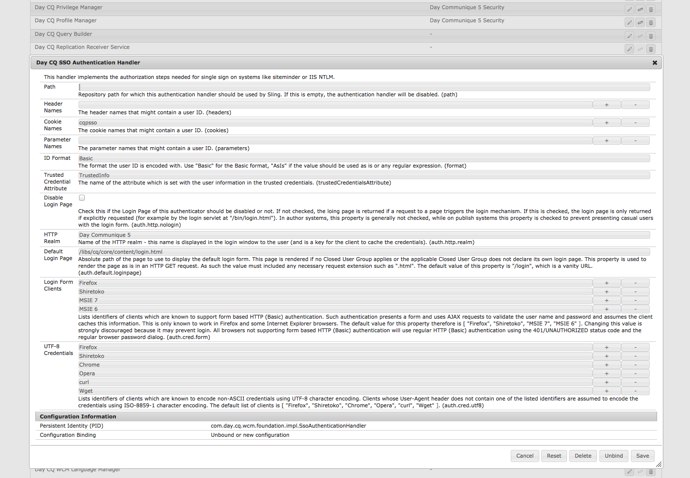
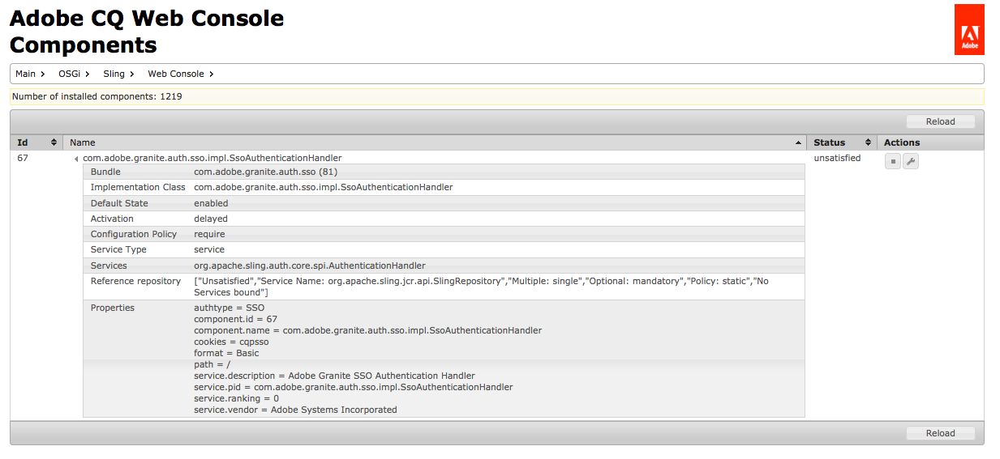

# Web コンソール{#web-console}

AEM の Web コンソールは、[Apache Felix Web Management Console](https://felix.apache.org/documentation/subprojects/apache-felix-web-console.html) に基づいています。Apache Felix は、OSGi R4 サービスプラットフォームを実装するためのコミュニティによる取り組みです。このプラットフォームには、OSGi フレームワークと標準のサービスが含まれています。

>[!NOTE]
>
>Web コンソールでは、デフォルト設定に言及している説明はすべて、Sling のデフォルトに関連しています。
>
>AEM には独自のデフォルト値があるので、設定されるデフォルト値は、コンソールに表示される値と異なる場合があります。

Web コンソールには、OSGi バンドルを保守するための次のような一連のタブがあります。

* [Configuration](#configuration)：OSGi バンドルの設定に使用します。AEM システムパラメーターを設定するための基盤となるメカニズムです。
* [Bundles](#bundles)：バンドルのインストールに使用します。
* [Components](#components)：AEM で必要なコンポーネントのステータスの制御に使用します。

おこなわれた変更は、実行中のシステムにすぐに適用されます。再起動は不要です。

The console can be accessed from `../system/console`; for example:

`http://localhost:4502/system/console/components`

## 設定 {#configuration}

「**Configuration**」タブは、OSGi バンドルの設定に使用します。AEM システムパラメーターを設定するための基盤となるメカニズムです。

>[!NOTE]
>
>詳しくは、[Web コンソールでの OSGi 設定](/help/sites-deploying/configuring-osgi.md#osgi-configuration-with-the-web-console)を参照してください。

「**Configuration**」タブにアクセスするには、次のいずれかを使用します。

* ドロップダウンメニュー：

   **OSGi >**

* URL;例：

   `http://localhost:4502/system/console/configMgr`

設定のリストは次のように表示されます。

この画面のドロップダウンリストから、次の 2 種類の設定を使用できます。

* **設定**

   
既存の設定を更新できます。設定には永続識別子（PID）が割り当てられています。設定は次のいずれかになります。

   * 標準かつ AEM に不可欠な設定。これらの設定は必須であり、削除すると値がデフォルト設定に戻ります。
   * 「Factory Configurations」から作成されたインスタンス。これらのインスタンスはユーザーによって作成され、削除するとインスタンスが削除されます。

* **ファクトリ設定**

   
必要な機能オブジェクトのインスタンスを作成できます。

   このインスタンスには永続識別子が割り当てられます。また、「Configurations」ドロップダウンリストに表示されます。

リストからエントリを選択すると、その設定に関連するパラメーターが表示されます。

必要に応じて、パラメーターを更新し、次の処理をすることができます。

* **保存**

   変更を保存します。

   ファクトリ設定の場合は、永続識別子を持つ新しいインスタンスが作成されます。新しいインスタンスは「Configurations」に表示されます。

* **リセット**

   画面に表示されるパラメータを、最後に保存されたパラメータにリセットします。

* **削除**

   現在の設定を削除します。 標準の場合は、パラメーターがデフォルト設定に戻ります。ファクトリ設定から作成された場合は、特定のインスタンスが削除されます。

* **バインド解除**

   現在の構成をバンドルからバインド解除します。

* **キャンセル**

   現在の変更をすべてキャンセルします。

## バンドル {#bundles}

The **Bundles** tab is the mechanism for installing the OSGi bundles required for AEM. The tab can be accessed by either of the following methods:

* ドロップダウンメニュー：

   **OSGi >**

* URL;例：

   `http://localhost:4502/system/console/bundles`

バンドルのリストは次のように表示されます。

このタブでは、次のことができます。

* **インストールまたは更新**

   You can **Browse** to find the file containing your bundle and specify whether it should **Start** immediately and at which **Start Level**.

* **再読み込み**

   表示されているリストを更新します。

* **パッケージの更新**

   これにより、すべてのパッケージの参照がチェックされ、必要に応じて更新されます。

   例えば、更新後に、以前の参照が原因で古いバージョンと新しいバージョンの両方が引き続き実行される場合などです。このオプションでは、新しいバージョンへの参照をすべて確認して移動します。これにより、古いバージョンを停止できます。

* **開始**

   指定した開始レベルに従ってバンドルを開始します。

* **停止**

   バンドルを停止します。

* **アンインストール**

   バンドルをシステムからアンインストールします。

* **状況を見る**

   リストはバンドルの現在のステータスを指定します。特定のバンドル名をクリックすると、詳細情報が表示されます。

>[!NOTE]
>
>**更新**&#x200B;後に、**パッケージの更新**&#x200B;を実行することをお勧めします。

## コンポーネント {#components}

The **Components** tab allows you to Enable and/or Disable the various components. It can be accessed by either:

* ドロップダウンメニュー：

   **メイン >**

* URL;例：

   `http://localhost:4502/system/console/components`

コンポーネントのリストは次のように表示されます。特定のコンポーネントを有効または無効にしたり、（必要に応じて）コンポーネントの設定の詳細を開いたりするための様々なアイコンがあります。

特定のコンポーネントの名前をクリックすると、そのステータスに関する詳細情報が表示されます。ここで、コンポーネントを有効または無効にしたり、再読み込みしたりすることもできます。

>[!NOTE]
>
>コンポーネントの有効化または無効化が適用されるのは、AEM／CRX が再起動されるまでです。
>
>開始状態はコンポーネントの記述子内で定義されます。この記述子は開発時に生成され、バンドルの作成時にバンドルに格納されます。

