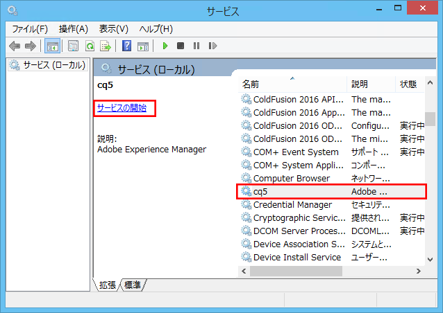
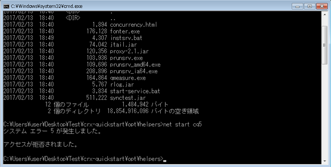
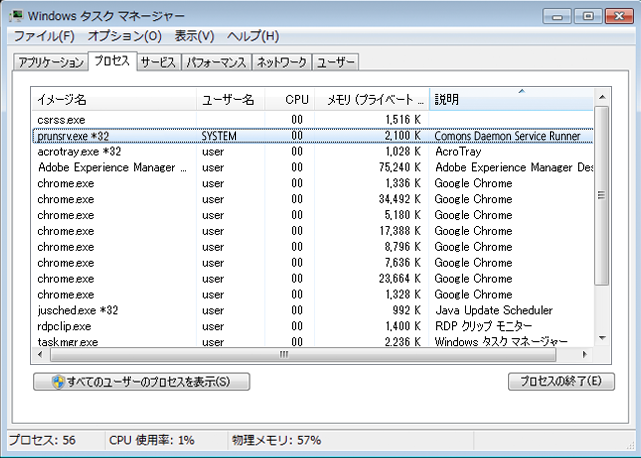
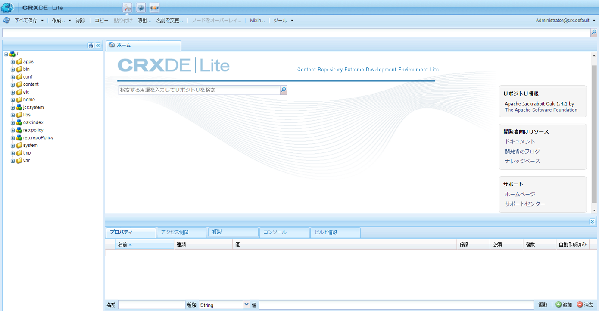
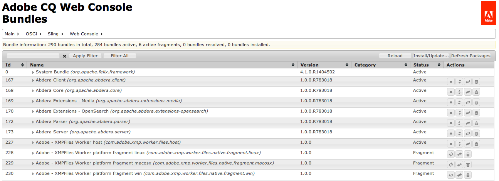

# カスタムスタンドアロンインストール{#custom-standalone-install}

ここでは、スタンドアロン AEM インスタンスのインストール時に使用可能なオプションについて説明します。AEM 6 を新規インストールした後のバックエンドストレージタイプの選択について詳しくは、[ストレージ要素](/help/sites-deploying/storage-elements-in-aem-6.md)も参照してください。

## ファイル名の変更によるポート番号の変更 {#changing-the-port-number-by-renaming-the-file}

The default port for AEM is 4502. If that port is not available or already in use, Quickstart automatically configures itself to use the first available port number as follows: 4502, 8080, 8081, 8082, 8083, 8084, 8085, 8888, 9362, `<*random*>`.

You can also set the port number by renaming the quickstart jar file, so that the file name includes the port number; for example, `cq5-publish-p4503.jar` or `cq5-author-p6754.jar`.

クイックスタート jar ファイル名を変更する際に従わなければならない様々なルールがあります。

* When you rename the file, it must start with `cq;` as in `cq5-publish-p4503.jar`.

* ポート番号の直前には -p を付けることをお勧めします。例えば、cq5-publish-p4503.jar または cq5-author-p6754.jar のように指定します。**

>[!NOTE]
>
>ポート番号の抽出の際には以下の点にご注意ください。
>
>* ポート番号は 4 桁または 5 桁にする
>* ダッシュの後にこれらの数字を指定する
>* if there are any other digits in the filename, then the port number must be prefixed with `-p`
>* ファイル名の先頭のプレフィックス「cq5」は無視される

>


>[!NOTE]
>
>You can also change the port number by using the `-port` option in the start command.

### Java 11 に関する考慮事項 {#java-considerations}

Oracle Java 11（または一般にバージョン 8 より新しい Java）を実行している場合は、AEM の起動時にコマンドラインにさらにスイッチを追加する必要があります。

* The following - `-add-opens` switches need to be added in order to prevent related reflection access WARNING messages in the `stdout.log`

```shell
--add-opens=java.desktop/com.sun.imageio.plugins.jpeg=ALL-UNNAMED --add-opens=java.base/sun.net.www.protocol.jrt=ALL-UNNAMED --add-opens=java.naming/javax.naming.spi=ALL-UNNAMED --add-opens=java.xml/com.sun.org.apache.xerces.internal.dom=ALL-UNNAMED --add-opens=java.base/java.lang=ALL-UNNAMED --add-opens=java.base/jdk.internal.loader=ALL-UNNAMED --add-opens=java.base/java.net=ALL-UNNAMED -Dnashorn.args=--no-deprecation-warning
```

* Additionally, you need to make use of the `-XX:+UseParallelGC` switch in order to mitigate any potential performance issues.

以下は、Java 11 で AEM を起動するときに指定する追加の JVM パラメータのサンプルです。

```shell
-XX:+UseParallelGC --add-opens=java.desktop/com.sun.imageio.plugins.jpeg=ALL-UNNAMED --add-opens=java.base/sun.net.www.protocol.jrt=ALL-UNNAMED --add-opens=java.naming/javax.naming.spi=ALL-UNNAMED --add-opens=java.xml/com.sun.org.apache.xerces.internal.dom=ALL-UNNAMED --add-opens=java.base/java.lang=ALL-UNNAMED --add-opens=java.base/jdk.internal.loader=ALL-UNNAMED --add-opens=java.base/java.net=ALL-UNNAMED -Dnashorn.args=--no-deprecation-warning
```

最後に、AEM 6.3 からアップグレードしたインスタンスを実行する場合は、**で次のプロパティが** true`sling.properties` に設定されていることを確認します。

* `felix.bootdelegation.implicit`

## 実行モード {#run-modes}

**実行モード**&#x200B;を使用すれば、特定の目的（オーサー、パブリッシュ、テスト、開発、イントラネットなど）に合わせてAEM インスタンスを調整できます。これらのモードでは、サンプルコンテンツの使用を制御することもできます。このサンプルコンテンツは、クイックスタートの構築前に定義され、パッケージや設定などを含めることができ、実稼働の準備が完了したインストール環境をサンプルコンテンツを含まないスリムな状態に保つ場合に特に便利です。詳しくは、次のページを参照してください。

* [実行モード](/help/sites-deploying/configure-runmodes.md)

## ファイルインストールプロバイダーの追加 {#adding-a-file-install-provider}

By default the folder `crx-quickstart/install` is watched for files.
このフォルダーは存在しませんが、実行時に作成できます。

このディレクトリに追加されたバンドル、設定またはコンテンツパッケージは自動的に選択およびインストールされます。削除された場合は、アンインストールされます。
これは、バンドル、コンテンツパッケージまたは設定をリポジトリに追加するためのもう 1 つの方法です。

この方法は次に示すいくつかの事例で特に有効です。

* 開発時に、ファイルシステムへの項目の追加が容易になります。
* 問題が発生した場合は、Web コンソールとリポジトリにアクセスできません。その際に、このディレクトリにバンドルを追加してインストールできます。
* クイックスタートを起動する前に `crx-quickstart/install` フォルダーを作成して、そこにパッケージを追加できます。

>[!NOTE]
>
>See also [How to install CRX packages automatically on server startup](https://helpx.adobe.com/experience-manager/kb/HowToInstallPackagesUsingRepositoryInstall.html) for examples.

## Windows サービスとしての Adobe Experience Manager のインストールと起動 {#installing-and-starting-adobe-experience-manager-as-a-windows-service}

>[!NOTE]
>
>管理者としてログオンする際に次の手順を実行するか、またはコンテキストメニューの「**管理者として実行**」オプションを使用して手順を開始／実行してください。
>
>管理者権限を持つユーザーとしてログオンしただけでは&#x200B;**不十分**&#x200B;です。管理者としてログオンしていない状態でこれらの手順の完了すると、「**アクセスが拒否されました**」というエラーが表示されます。

AEM を Windows サービスとしてインストールして起動するには：

1. crx-quickstart\opt\helpers\instsrv.bat ファイルをテキストエディターで開きます。
1. 64ビットWindowsサーバーを設定する場合は、prunsrvのすべてのインスタンスを、オペレーティングシステムに応じて、次のいずれかのコマンドに置き換えます。

   * prunsrv_amd64
   * prunsrv_ia64

   このコマンドは、32ビットJavaではなく64ビットJavaのWindowsサービスデーモンを開始する適切なスクリプトを呼び出します。

1. プロセスが複数のプロセスに分岐しないようにするには、最大ヒープサイズと PermGen JVM パラメーターの値を増やします。Locate the `set jvm_options` command and set the value as follows:

   `set jvm_options=-XX:MaxPermSize=256M;-Xmx1792m`

1. コマンドプロンプトを開き、現在のディレクトリを AEM インストールの crx-quickstart/opt/helpers フォルダーに変更し、次のコマンドを入力してサービスを作成します。

   `instsrv.bat cq5`

   サービスが作成されたことを確認するには、[管理ツール]コントロールパネルで[サービス]を開くか、コマンドプロンプト `start services.msc` でと入力します。 cq5サービスがリストに表示されます。

1. 次のいずれかの方法でサービスを起動します。

   * コントロールパネルの「サービス」で、「cq5」をクリックして、「開始」をクリックします。

   

   * コマンドラインで、&quot;net start cq5&quot; と入力します。

   

1. Windowsは、サービスが実行中であることを示します。AEM開始とprunsrv実行可能ファイルがタスクマネージャーに表示されます。 Webブラウザーで、AEM(AEMを使用している開始など)に移動 `https://localhost:4502` します。

   

>[!NOTE]
>
>instsrv.bat ファイル内のプロパティ値は、Windows サービスの作成時に使用されます。instsrv.bat 内のプロパティ値を編集する場合は、サービスをアンインストールしてから再インストールする必要があります。

>[!NOTE]
>
>When installing AEM as service, you must provide the absolute path for the logs directory in `com.adobe.xmp.worker.files.ncomm.XMPFilesNComm` from Configuration Manager.

サービスをアンインストールするには、コントロールパネルの「**サービス**」で「**停止**」をクリックするか、コマンドラインでフォルダーに移動して、&quot;`instsrv.bat -uninstall cq5`&quot; と入力します。&quot;**&quot; と入力すると、コントロールパネルの「**&#x200B;サービス`net start`」のリストまたはコマンドライン内のリストからサービスが削除されます。

## 一時的な作業ディレクトリの場所の再定義 {#redefining-the-location-of-the-temporary-work-directory}

The default location of the temporary folder of the java machine is `/tmp`. AEM uses this folder too, for example when building packages.

If you want to change the location of the temporary folder (for example, if you need a directory with more free space) then define a * `<new-tmp-path>`* by adding the JVM parameter:

`-Djava.io.tmpdir="/<*new-tmp-path*>"`

定義先は次のいずれかです。

* サーバー起動コマンドライン
* serverctl または start スクリプトの CQ_JVM_OPTS 環境パラメーター

## クイックスタートファイルから使用可能なその他のオプション {#further-options-available-from-the-quickstart-file}

その他のオプションや名前の変更規則については、クイックスタートヘルプファイルを参照してください。このファイルは —helpオプションから利用できます。ヘルプにアクセスするには、次のように入力します。

* `java -jar cq5-<*version*>.jar -help`

```shell
Loading quickstart properties: default
Loading quickstart properties: instance
Setting properties from filename '/Users/Desktop/AEM/cq-quickstart-5.6.0.jar'
--------------------------------------------------------------------------------
Adobe Experience Manager Quickstart (build 20130129)
--------------------------------------------------------------------------------
Usage:
 Use these options on the Quickstart command line.
--------------------------------------------------------------------------------

-help (--help,-h)
         Show this help message
-quickstart.server.port (-p,-port) <port>
         Set server port number
-contextpath (-c,-org.apache.felix.http.context_path) <contextpath>
         Set context path
-debug <port>
         Enable Java Debugging on port number; forces forking
-gui
         Show GUI if running on a terminal
-nobrowser (-quickstart.nobrowser)
         Do not open browser at startup
-unpack
         Unpack installation files only, do not start the server (implies
         -verbose)
-v (-verbose)
         Do not redirect stdout/stderr to files and do not close stdin
-nofork
         Do not fork the JVM, even if not running on a console
-fork
         Force forking the JVM if running on a console, using recommended
         default memory settings for the forked JVM.
-forkargs <args> [<args> ...]
         Additional arguments for the forked JVM, defaults to '-Xmx1024m
         -XX:MaxPermSize=256m '.  Use -- to specify values starting with -,
         example: '-forkargs -- -server'
-a (--interface) <interface>
         Optional IP address (interface) to bind to
-pt <string>
         Process type (main/fork) - do not use directly, used when forking a
         process
-r <string> [<string> [<string> [<string> [<string> [<string> [<string> [<string> [<string> [<string>]]]]]]]]]
         Runmode(s) - Use this to define the run mode(s)
-b <string>
         Base folder - defines the path under which the quickstart work folder
         is created
-low-mem-action <string>
         Low memory action - what to do if memory is insufficient at startup
-use-control-port
         Start a control port
-ll <level>
         Define launchpad log level (1 = error...4 = debug)
--------------------------------------------------------------------------------
Quickstart filename options
--------------------------------------------------------------------------------
Usage:
 Rename the jar file, including one of the patterns shown below, to set the
corresponding option. Command-line options have priority on these filename
patterns.
--------------------------------------------------------------------------------

-NNNN
         Include -NNNN.jar or -pNNNN in the renamed jar filename to run on port
         NNNN, for example: quickstart-8085.jar
-nobrowser
         Include -nobrowser in the renamed jar filename to avoid opening the
         browser at startup, example: quickstart-nobrowser-8085.jar
-publish
         Include -publish in the renamed jar filename to run cq5 in "publish"
         mode, example: cq5-publish-7502.jar
--------------------------------------------------------------------------------
The license.properties file
--------------------------------------------------------------------------------
  The license.properties file stores licensing information, created from the
  licensing form displayed on first startup and stored in the folder from where
  Quickstart is run.
--------------------------------------------------------------------------------
Log files
--------------------------------------------------------------------------------
  Once Quickstart has been unpacked and started, log files can be found under
  ./crx-quickstart/logs.
--------------------------------------------------------------------------------
```

## Amazon EC2 環境への AEM のインストール {#installing-aem-in-the-amazon-ec-environment}

Amazon Elastic Compute Cloud（EC2）インスタンスに AEM をインストールする場合は、EC2 インスタンスに作成者と発行の両方をインストールすると、[AEM マネージャーのインスタンスのインストール](#installinginstancesofaemmanager)の手順に従って、作成者インスタンスが正しくインストールされます。ただし、発行インスタンスは作成者インスタンスになります。

EC2 環境にパブリッシュインスタンスをインストールする前に、次の手順を実行してください。

1. インスタンスを初めて起動する前に、パブリッシュインスタンスの jar ファイルを展開します。ファイルを展開するには、次のコマンドを使用します。

   ```xml
   java -jar quickstart.jar -unpack
   ```

   >[!NOTE]
   >
   >インスタンスを初めて起動した&#x200B;**後**&#x200B;にモードを変更する場合は、実行モードを変更できません。

1. 次のコマンドを実行してインスタンスを起動します。

   ```xml
   java -jar quickstart.jar -r publish
   ```

   >[!CAUTION]
   >
   >上記のコマンドを実行してインスタンスを展開した後は、最初にそのインスタンスを実行してください。そうしないと、quickstart.properties ファイルが生成されません。このファイルが生成されない場合は、以降の AEM のアップグレードが失敗します。

1. **bin** フォルダー内の **start** スクリプトを開いて、次のセクションを確認します。

   ```xml
   # runmode(s)
   if [ -z "$CQ_RUNMODE" ]; then
    CQ_RUNMODE='author'
   fi
   ```

1. 実行モードを&#x200B;**パブリッシュ**&#x200B;に変更して、ファイルを保存します。

   ```xml
   # runmode(s)
   if [ -z "$CQ_RUNMODE" ]; then
    CQ_RUNMODE='publish'
   fi
   ```

1. インスタンスを停止し、**start** スクリプトを実行して再起動します。

## インストールの確認 {#verifying-the-installation}

次のリンクを使用して、インストールが機能していることを確認できます（すべての例では、インスタンスが localhost のポート 8080 で実行されていること、および CRX が /crx に、Launchpad が / の下にインストールされていることを前提としています）。

* `https://localhost:8080/crx/de`
CRXDE Liteコンソール。

* `https://localhost:8080/system/console`
Webコンソール

## インストール後のアクション {#actions-after-installation}

AEM WCM の様々な設定を行うことができますが、インストール直後には特定のアクションを実行するか、または少なくとも確認が必要な項目があります。

* Consult the [Security Checklist](/help/sites-administering/security-checklist.md) for tasks required to ensure that your system remains secure.
* AEM WCM と共にインストールされたデフォルトのユーザーとグループのリストを確認します。また、他のアカウントに対してアクションを実行するかどうかを確認します。詳しくは、[ユーザー管理とセキュリティ](/help/sites-administering/security.md)を参照してください。

## CRXDE Lite および Web コンソールへのアクセス {#accessing-crxde-lite-and-the-web-console}

AEM WCM を起動したら、次の場所にアクセスできます。

* [CRXDE Lite](#accessing-crxde-lite) - リポジトリにアクセスする場合やリポジトリを管理する場合に使用します。
* [Web コンソール](#accessing-the-web-console) - OSGi バンドル（OSGi コンソールとも呼ばれる）を管理または設定する場合に使用します。

### CRXDE Lite へのアクセス {#accessing-crxde-lite}

To open CRXDE Lite you can select **CRXDE Lite** from the welcome screen or use your browser to navigate to

```
 https://<<i>host</i>>:<<i>port</i>>/crx/de/index.jsp
```

次に例を示します。`https://localhost:4502/crx/de/index.jsp`



#### Accessing the Web Console {#accessing-the-web-console}

Adobe CQのWebコンソールにアクセスするには、ようこそ画面から **OSGiコンソール** を選択するか、ブラウザを使用して

```
 https://<host>:<port>/system/console
```

次に例を示します。`https://localhost:4502/system/console`
またはBundlesページ用
`https://localhost:4502/system/console/bundles`



詳しくは、[Web コンソールでの OSGi 設定](/help/sites-deploying/configuring-osgi.md#osgi-configuration-with-the-web-console)を参照してください。

## トラブルシューティング {#troubleshooting}

インストール中に発生する可能性のある問題の処理について詳しくは、以下を参照してください。

* [トラブルシューティング](/help/sites-deploying/troubleshooting.md)

## Adobe Experience Manager のアンインストール {#uninstalling-adobe-experience-manager}

AEM は単一のディレクトリにインストールされるので、アンインストールユーティリティは必要ありません。インストールディレクトリ全体を削除するだけでアンインストールできます。ただし、AEM のアンインストール方法は、その目的および使用している永続ストレージによって変わります。

例えば、デフォルトの TarPM インストールなど、永続ストレージがインストールディレクトリに埋め込まれている場合、フォルダーを削除するとデータも削除されます。

>[!NOTE]
>
>AEM を削除する前にリポジトリをバックアップすることを強く推奨します。&lt;cq-installation-directory> 全体を削除すると、リポジトリも削除されます。削除する前にリポジトリのデータを保管する場合は、&lt;cq-installation-directory>/crx-quickstart/repository フォルダーを他の場所に移動またはコピーしてから、その他のフォルダーを削除するようにしてください。

例えば、データベースサーバーなど、AEM のインストールが外部ストレージを使用している場合、フォルダーを削除してもデータは自動的には削除されませんが、ストレージ設定が削除されるので、JCR コンテンツの復元は困難になります。
