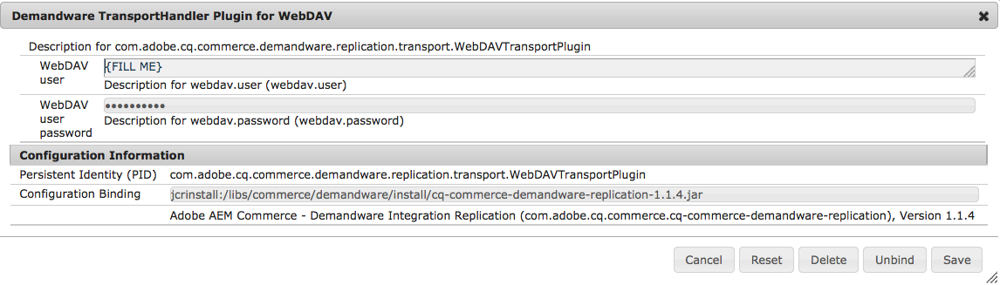

# Salesforce Commerce Cloud{#salesforce-commerce-cloud}

必要なeコマースパッケージの展開は、eコマースフレームワークの全機能と、SalesforceCommerce Cloud/Demandware実装（デモカタログを含む）で提供されるeコマース機能のリファレンス実装を提供します。

## Salesforce Commerce Cloud を使用した e コマースに必要なパッケージ {#packages-needed-for-ecommerce-with-salesforce-commerce-cloud}

e コマース機能をインストールするには、以下が必要です。

* AEM e コマースフレームワーク：

   * AEM の標準インストールの一部です。

* AEM Demandware Commerce コンテンツパッケージ

   * cq-6.4.0-featurepack-10262

>[!NOTE]
>
>この統合は、OCAPI バージョン 17.6 以降を使用するために設定された Salesforce Commerce Cloud／Demandware インスタンスをサポートします。

### Salesforce Commerce Cloud を使用した e コマースのインストール {#installation-of-ecommerce-with-salesforce-commerce-cloud}

（デモカタログ Geometrixx Outdoors を使用して）Demandware コマース統合設定で AEM をインストールするには、次の基本的な手順に従います。

1. [AEM をインストール](/help/sites-deploying/deploy.md)します。
1. Install the content package using the [package manager](/help/sites-administering/package-manager.md):
1. AEM で必要な補助ページを[作成](/help/sites-authoring/page-authoring.md)します。

>[!NOTE]
>
>パッケージをダウンロードするには、[パッケージ共有](/help/sites-administering/package-manager.md#package-share)に移動します。

AEM と Demandware Sandbox の間のサーバー接続を設定する必要があります。ほとんどの設定は、デフォルトパス、ライブラリなどを使用して、提供されたSiteGenisデモコンテンツパッケージと連携するように事前に設定されています。 コネクタを他のサイトやライブラリで使用する場合は、この設定を更新する必要があります。

1. https://localhost:4502/system/console/configMgrに移動し [ます](https://localhost:4502/system/console/configMgr)。
1. 「Demandware Client」をクリックします。****
1. 必要に応じて、インスタンスのエンドポイントの IP またはホスト名を入力します。****

   

1. 「**保存**」をクリックします。
1. 「Demandware TransportHandler Plugin for WebDAV」をクリックします。****
1. 「**WebDAV user**」と「**WebDAV user password**」を設定します。

   

1. 「**保存**」をクリックします。

#### レプリケーション {#replication}

The replication should be enabled after the package installation, you can verify that here: [https://localhost:4502/etc/replication/agents.author/demandware.html](https://localhost:4502/etc/replication/agents.author/demandware.html)

>[!NOTE]
>
>レプリケーションエージェントはデフォルトで情報ログレベルに設定されています。詳しい情報が必要な場合は、ログレベルをデバッグに切り替えることができます。

#### OAuth {#oauth}

OAuth クライアントは Demandware Sandbox インスタンスを使用するように設定されています。テストが目的の場合は、変更する必要はありません。

ステージングおよび実稼動システムの場合、OAuth クライアントに適切なクライアント ID とパスワードを設定する必要があります。

1. https://localhost:4502/system/console/configMgrに移動し [ます](https://localhost:4502/system/console/configMgr)。
1. Click **Demandware Access Token provider**.

   

1. 必要に応じて値を修正し、「Save」をクリックします。****

### Salesforce Commerce Cloud サンドボックス {#salesforce-commerce-cloud-sandbox}

Demandware Sandbox は、新しい Velocity テンプレートエンジンを実行するように設定する必要があります。

>[!NOTE]
>
>次のウィザードは AEM Demandware コネクタに含まれるものではありません。これは、デモコンテンツパッケージの一部としてそのまま提供されており、SiteGenesis デモページをすばやく設定するのに役立ちます。

1. Navigate to [https://localhost:4502/etc/demandware/init.html](https://localhost:4502/etc/demandware/init.html).
1. 「**編集**」をクリックします。
1. 値を確認し、「OK」をクリックします。****
1. 「初期化」をクリックします。****
1. Go to the WebDAV folder and check for published template files, for example under `adobe01-tech-prtnr-na01-dw.demandware.net/on/demandware.servlet/webdav/Sites/Dynamic/SiteGenesis`.

   >[!NOTE]
   >
   >The extension will be `.vs`.

1. Check also for exported JS and CSS files, for example under `adobe01-tech-prtnr-na01-dw.demandware.net/on/demandware.servlet/webdav/Sites/Libraries/SiteGenesisSharedLibrary`.

