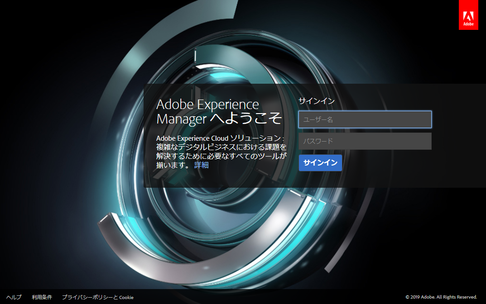

# デプロイとメンテナンス{#deploying-and-maintaining}

このページの内容は次のとおりです。

* [基本概念](#basic-concepts)

   * [AEM とは](#what-is-aem)
   * [典型的な開発](#typical-deployment-scenarios)

      * [オンプレミス](#on-premise)
      * [Cloud Manager を使用した Managed Services](#managed-services-using-cloud-manager)

* [概要](#getting-started)

   * [前提条件](#prerequisites)
   * [ソフトウェアの入手](#getting-the-software)
   * [デフォルトのローカルインストール](#default-local-install)
   * [オーサーとパブリッシュのインストール](#author-and-publish-installs)
   * [展開されたインストールディレクトリ](#unpacked-install-directory)
   * [起動と停止](#starting-and-stopping)

これらの基本を理解したうえで、より高度かつ詳細な情報を習得するには、次のサブページを参照してください。

* [技術要件](/help/sites-deploying/technical-requirements.md)
* [推奨されるデプロイメント](/help/sites-deploying/recommended-deploys.md)
* [カスタムスタンドアロンインストール](/help/sites-deploying/custom-standalone-install.md)
* [アプリケーションサーバーのインストール](/help/sites-deploying/application-server-install.md)
* [トラブルシューティング](/help/sites-deploying/troubleshooting.md)
* [コマンドラインによる起動と停止](/help/sites-deploying/command-line-start-and-stop.md)
* [設定](/help/sites-deploying/configuring.md)
* [AEM 6.5 へのアップグレード](/help/sites-deploying/upgrade.md)
* [e コマース](/help/sites-deploying/ecommerce.md)
* [設定方法に関する記事](/help/sites-deploying/ht-deploy.md)
* [Web コンソール](/help/sites-deploying/web-console.md)
* [レプリケーションのトラブルシューティング](/help/sites-deploying/troubleshoot-rep.md)
* [ベストプラクティス](/help/sites-deploying/best-practices.md)
* [Communities のデプロイ](/help/communities/deploy-communities.md)
* [AEM プラットフォームの概要](/help/sites-deploying/platform.md)
* [パフォーマンスガイドライン](/help/sites-deploying/performance-guidelines.md)
* [AEM Mobile 使用の手引き](/help/mobile/getting-started-aem-mobile.md)
* [AEM Screens とは](https://docs.adobe.com/content/help/ja-JP/experience-manager-screens/user-guide/aem-screens-introduction.html)

## 基本概念 {#basic-concepts}

### AEM とは{#what-is-aem}

Adobe Experience Manager は、商業 Web サイトおよび関連サービスを構築、管理、デプロイするための、Web ベースのクライアントサーバーシステムです。インフラストラクチャレベルおよびアプリケーションレベルの多数の機能を組み合わせて単一の統合パッケージにします。

インフラストラクチャレベルでは、AEM は以下の機能を提供します。

* **Web アプリケーションサーバー**：AEM は、スタンドアロンモード（統合された Jetty Web サーバーを含む）で、またはサードパーティのアプリケーションサーバー内の Web アプリケーションとしてデプロイできます。
* **Web アプリケーションフレームワーク**：AEM には Sling Web アプリケーションフレームワークが組み込まれており、RESTful な、コンテンツ指向の Web アプリケーションを簡単に作成できます。
* **コンテンツリポジトリ**：AEM には、非構造化データおよび半構造化データ専用に設計された階層型データベースの一種である Java コンテンツリポジトリ（JCR）が含まれています。このリポジトリには、ユーザーに表示されるコンテンツだけでなく、アプリケーションで使用されるすべてのコード、テンプレートおよび内部データが格納されます。

この基礎を踏まえて、AEM は以下の管理のためにアプリケーションレベルの機能も数多く提供しています。

* **Web サイト**
* **モバイルアプリケーション**
* **デジタルパブリケーション**
* **フォーム**
* **デジタルアセット**
* **Communities**
* **オンライン商取引**

最後に、ユーザーはこれらのインフラストラクチャレベルおよびアプリケーションレベルの構築ブロックを使用して、独自のアプリケーションを構築することによって、カスタマイズされたソリューションを作成できます。

The AEM server is **Java-based** and runs on most operating systems that support that platform. All client interaction with AEM is done through a **web browser**.

### 典型的なデプロイメントシナリオ {#typical-deployment-scenarios}

AEM の用語では、「インスタンス」は、サーバー上で実行されている AEM のコピーのことです。AEM のインストールには通常少なくとも 2 つのインスタンスが関連し、これらは通常は別々のマシンで実行されます。

* **オーサー**：コンテンツを作成、アップロードおよび編集し、Web サイトを管理する AEM インスタンス。公開する準備ができたコンテンツは、パブリッシュインスタンスにレプリケートされます。
* **パブリッシュ**：発行されたコンテンツを公開する AEM インスタンス。

これらのインスタンスは、インストールされているソフトウェアという点では同一で、違いは設定のみです。また、多くのインストールではディスパッチャーを使用します。

* **ディスパッチャー**：AEM ディスパッチャーモジュールで補強された静的 Web サーバー（Apache httpd、Microsoft IIS など）。パブリッシュインスタンスで生成された Web ページをキャッシュしてパフォーマンスを向上します。

この設定には、多くの高度なオプションと詳細情報がありますが、作成者、発行、ディスパッチャーの基本パターンは、ほとんどのデプロイメントの中核にあります。まず、比較的単純な設定に焦点を当てます。アドバンス展開オプションについては、以下で説明します。

以下のセクションでは、両方のシナリオについて説明します。

* **オンプレミス**：AEM はユーザーの企業環境に配置され管理されます。

* **Managed Services - Adobe Experience Manager のクラウドマネージャー**：AEM は、Adobe Managed Services によってデプロイおよび管理されます。

### オンプレミス {#on-premise}

企業環境内のサーバーに AEM をインストールできます。典型的なインストールインスタンスは、開発、テストおよびパブリッシング環境を含みます。AEM ソフトウェアをローカルにインストールする方法の基本的な詳細については、[はじめに](/help/sites-deploying/deploy.md#getting%20started)セクションを参照してください。

一般的なオンプレミスデプロイメントの詳細については、[推奨されるデプロイメント](/help/sites-deploying/recommended-deploys.md)を参照してください。

### Cloud Manager を使用した Managed Services {#managed-services-using-cloud-manager}

AEM Managed Services は、デジタルエクスペリエンス管理のための完全なソリューションです。オンプレミスデプロイメントの制御、セキュリティ、およびカスタマイズのあらゆる利点を維持しながら、クラウドでエクスペリエンス配信ソリューションの利点を提供します。AEM Managed Services を使用すれば、クラウドへのデプロイによって、また Adobe のベストプラクティスとサポートの活用によって、より迅速にサービスを開始できます。組織や法人ユーザーは、最小限の時間で顧客を獲得し、市場シェアを拡大し、革新的なマーケティングキャンペーンの作成に集中しながらITの負担を軽減できます。

AEM Managed Services を使用すれば、次のようなメリットを享受できます。

**市場投入までの時間の短縮：** Adobe Managed Services の柔軟なクラウドインフラストラクチャにより、組織は成功するデジタルエクスペリエンスを迅速に計画し、立ち上げ、最適化することができます。Adobeは、追加の資本、ハードウェア、ソフトウェアを必要とせずにクラウドアーキテクチャを管理し、AdobeのカスタマーサクセスエンジニアはAEMアーキテクチャ、プロビジョニング、バックエンドアプリへの接続のカスタマイズ、実稼働ベストプラクティスを支援します。

**より高い性能：** 99.5％、99.9％、99.95％、および 99.99％ の 4 つのサービス可用性オプションで、ビジネスに信頼性の高いデジタル体験を提供します。また、自動バックアップおよびマルチモードの災害復旧モデルを使用して、信頼性とコンティンジェンシーの管理を確保できます。

**最適化された IT コスト：**&#x200B;事前のガイダンスと専門知識により、組織は AEM のバージョンを常に最新の状態に保つことができます。Adobe のプラチナメンテナンスおよびサポートは、AMS Enterprise／Basic の新規導入に自動的に組み込まれ、組織がミッションクリティカルなアプリケーションを維持するのに役立つ技術的専門知識と運用経験を提供します。無料の基本的なアナリティクス機能またはターゲット機能は、特に分析とパーソナライゼーションのニーズが限られている中堅企業にさらなる価値を提供します。

**最高のセキュリティ：**&#x200B;カスタマーアプリケーションを、アクセスが制限された施設、ファイアウォールシステムの背後や、仮想プライベートクラウド内でホストすることで、エンタープライズクラスの物理、ネットワーク、およびデータのセキュリティを確保します。堅牢なデータストレージ暗号化、アンチウイルス、およびデータ分離を備えたシングルテナント仮想マシンが含まれます。

**クラウドマネージャー**：Adobe Experience Manager Services 製品の一部である Cloud Manager は、組織がクラウド内で Adobe Experience Manager を自己管理することをさらに可能にするセルフサービスポータルです。これには、IT チームと実装パートナーがパフォーマンスやセキュリティを犠牲にすることなくカスタマイズやアップデートの提供を迅速化できるようにする、最先端の継続的インテグレーションと継続的配信（CI／CD）パイプラインが含まれます。Cloud Manager は、Adobe Managed Service のお客様のみご利用いただけます。

To learn more about Cloud Manger and its resources, please refer to [**Cloud Manager User Guide**](https://docs.adobe.com/content/help/ja-JP/experience-manager-cloud-manager/using/introduction-to-cloud-manager.html).

## 概要 {#getting-started}

### 前提条件 {#prerequisites}

While production instances are usually run on dedicated machines running an officially supported OS (see [Technical Requirements](/help/sites-deploying/technical-requirements.md)), the Experience Manager server will actually run on any system that supports [**Java Standard Edition 8**](https://www.oracle.com/technetwork/java/javase/downloads/jdk8-downloads-2133151.html).

AEM に習熟したい場合や、AEM で開発する場合は、Apple OS X またはデスクトップ版の Microsoft Windows または Linux を実行しているローカルマシンにインストールされたインスタンスを使用するのが一般的です。

On the client-side, AEM works with all modern browsers (**Microsoft Edge**, **Internet Explorer** 11, **Chrome **51+** **, **Firefox **47+, **Safari** 8+) on both desktop and tablet operating systems. See [Supported Client Platforms](/help/sites-deploying/technical-requirements.md#supported-client-platforms) for details.

### ソフトウェアの入手 {#getting-the-software}

Customers with a valid maintenance and support contract should have received a mail notification with a code and be able to download AEM from the [**Adobe Licensing Website**](https://licensing.adobe.com/). Business partners can request download access from [**spphelp@adobe.com**](mailto:spphelp@adobe.com).

AEM ソフトウェアパッケージには、次の 2 つの形式があります。

* **cq-quickstart-6.5.0.jar:** 起動および実行に必要なすべてを含む、スタンドアロンの実行可能な *jar* ファイル。

* **cq-quickstart-6.5.0.war:** サードパーティのアプリケーションサーバーにデプロイする *ための* warファイル。

In the following section we describe the **standalone installation**. For details on installing AEM in an application server see [Application Server Install](/help/sites-deploying/application-server-install.md).

### デフォルトのローカルインストール {#default-local-install}

1. ローカルマシンにインストールディレクトリを作成します。次に例を示します。

   UNIX install location: **/opt/aem**

   Windowsのインストール場所： **`C:\Program Files\aem`**

   同様に、デスクトップ上のフォルダーにサンプルインスタンスをインストールするのが一般的です。いずれの場合も、ここではこの場所を次のように表現します：

   `<aem-install>`

   *ファイルディレクトリのパスには、US ASCII 文字のみを含めてください。*

1. Place the **jar** and **license **files in this directory:

   ```shell
   <aem-install>/
       cq-quickstart-6.5.0.jar
       license.properties
   ```

   If you do not provide a `license.properties` file, AEM will redirect your browser to a **Welcome** screen on startup, where you can enter a license key. アドビの有効なライセンスキーをお持ちでない場合は、依頼する必要があります。

1. To start up the instance in a GUI environment, just double-click the **`cq-quickstart-6.5.0.jar`** file.

   また、AEM はコマンドラインから起動することもできます。32 ビット Java VM の場合は、次のように入力します。

   ```shell
       java -Xmx1024M -jar cq-quickstart-6.5.0.jar
   ```

   64 ビット VM の場合は、次のように入力します。

   ```shell
       java -XX:MaxPermSize=256m -Xmx1024M -jar cq-quickstart-6.5.0.jar
   ```

数分かけて、jar ファイルが展開され、AEM がインストールされ、起動します。上記の手順の結果、

* **AEM オーサー**&#x200B;インスタンスが、
* **localhost** 上の
* ポート **4502** で実行されます。

このインスタンスにアクセスするには、ブラウザーで次のように指定します。

**`https://localhost:4502`**

オーサーインスタンスの結果は、**** 上の&#x200B;**`localhost:4503`**&#x200B;パブリッシュインスタンスに接続するように自動的に設定されます。

### オーサーとパブリッシュのインストール {#author-and-publish-installs}

デフォルトのインストール（**上の**&#x200B;オーサー&#x200B;**`localhost:4502`**&#x200B;インスタンス）は、初めて起動する前に `jar` ファイルの名前を変更することによって変更できます。命名パターンは次のとおりです。

**`cq-<instance-type>-p<port-number>.jar`**

例えば、ファイル名を

**`cq-author-p4502.jar`**

に変更してから起動すると、オーサーインスタンスが **`localhost:4502`** 上で実行されます。

同様に、ファイル名を

**`cq-publish-p4503.jar`**

に変更してから起動すると、パブリッシュインスタンスが **`localhost:4503`** 上で実行されます。

これら 2 つのインスタンスを、例えば次の場所にインストールします。

`<aem-install>/author`および

**`<aem-install>/publish`**

インストールのカスタマイズについて詳しくは、以下を参照してください。

* [カスタムスタンドアロンインストール](/help/sites-deploying/custom-standalone-install.md)
* [実行モード](/help/sites-deploying/configure-runmodes.md)

### 展開されたインストールディレクトリ {#unpacked-install-directory}

When the quickstart jar is launched for the first time it will unpack itself into the same directory under a new sub-directory called `crx-quickstart`. You should end up with the following:

```xml
<aem-install>/
    license.properties
    cq-quickstart-6.5.0.jar
    crx-quickstart/
        app/
        bin/
        conf/
        launchpad/
        logs/
        metrics/
        monitoring/
        opt/
        repository/
        threaddumps/
        eula-de_DE.html
        eula-en_US.html
        eula-fr_FR.html
        eula-ja_JP.html
        readme.txt
```

インスタンスがUIからインストールされている場合は、ブラウザーウィンドウが自動的に開き、デスクトップアプリケーションウィンドウも開き、インスタンスのホストとポートとオン/オフスイッチが表示されます。


>[!NOTE]
>
>シンボリックリンクを使用している場合は、[シンボリックリンクの問題](https://helpx.adobe.com/experience-manager/kb/changing-symlink.html)をご確認ください。

### 起動と停止 {#starting-and-stopping}

AEM が展開され、初めて起動した後は、インストールディレクトリの jar ファイルをダブルクリックしても、インスタンスが開始されるだけで、再インストールはされません。

GUI からインスタンスを停止するには、デスクトップアプリケーションウィンドウで&#x200B;**オン／オフ**&#x200B;スイッチをクリックするだけです。

You can also stop and start AEM from the command line. Assuming you have already installed the instance for the first time, the **command-line scripts** are located here:

**`<aem-install>/crx-quickstart/bin/`**

このフォルダーには、次の Unix bash シェルスクリプトが含まれています。

* **`start`**: インスタンスを開始
* `stop`: インスタンスを停止
* **`status`**: インスタンスのステータスを報告
* **`quickstart`**：必要に応じて開始情報の設定に使用

Windows 用に同等の **`bat`** ファイルもあります。詳しくは、以下を参照してください。

* [コマンドラインによる起動と停止](/help/sites-deploying/command-line-start-and-stop.md)

AEM が起動し、Web ブラウザーが適切なページに自動的にリダイレクトされます。通常は、次のようなログインページが表示されます。

`https://localhost:4502/`



ログインすれば、AEM にアクセスできます。詳しくは、役割に応じて、以下を参照してください。

* [オーサリング](/help/sites-authoring/home.md)
* [管理](/help/sites-administering/home.md)
* [開発](/help/sites-developing/home.md)
* [プロジェクト管理](/help/managing/best-practices.md)

## 高度なデプロイメント {#advanced-deployment}

これまでの節では、AEM インストールの基礎について説明しました。ただし、AEM の完全な実稼動システムのインストールは、より複雑な作業を伴う可能性があります。高度なインストールについて詳しくは、次のサブページを参照してください。

* [技術要件](/help/sites-deploying/technical-requirements.md)
* [推奨されるデプロイメント](/help/sites-deploying/recommended-deploys.md)
* [カスタムスタンドアロンインストール](/help/sites-deploying/custom-standalone-install.md)
* [アプリケーションサーバーのインストール](/help/sites-deploying/application-server-install.md)
* [トラブルシューティング](/help/sites-deploying/troubleshooting.md)
* [コマンドラインによる起動と停止](/help/sites-deploying/command-line-start-and-stop.md)
* [設定](/help/sites-deploying/configuring.md)
* [AEM 6.5 へのアップグレード](/help/sites-deploying/upgrade.md)
* [e コマース](/help/sites-deploying/ecommerce.md)
* [設定方法に関する記事](/help/sites-deploying/ht-deploy.md)
* [Web コンソール](/help/sites-deploying/web-console.md)
* [レプリケーションのトラブルシューティング](/help/sites-deploying/troubleshoot-rep.md)
* [ベストプラクティス](/help/sites-deploying/best-practices.md)
* [Communities のデプロイ](/help/communities/deploy-communities.md)
* [AEM プラットフォームの概要](/help/sites-deploying/platform.md)
* [パフォーマンスガイドライン](/help/sites-deploying/performance-guidelines.md)
* [AEM Mobile 使用の手引き](/help/mobile/getting-started-aem-mobile.md)
* [AEM Screens とは](https://docs.adobe.com/content/help/ja-JP/experience-manager-screens/user-guide/aem-screens-introduction.html)
