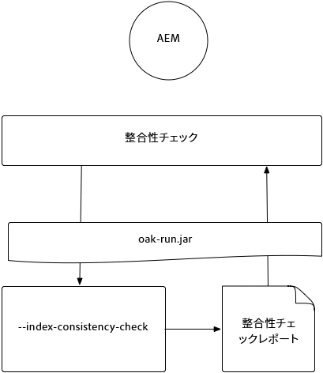

# Oak-run Jar を使用したインデックス作成 {#indexing-via-the-oak-run-jar}

Oak-run は、コマンドラインでのすべてのインデックス作成の使用例をサポートします。JMX レベルで操作する必要はありません。次に Oak-run アプローチのメリットを示します。

1. AEM 6.4 用の新しいインデックス作成ツールセットです。
1. インデックス再作成時間を削減します。より大きいリポジトリでのインデックス再作成時間に有益な影響があります。
1. AEM でのインデックス再作成時のリソース消費を削減します。これにより、他の AEM アクティビティのシステムパフォーマンスが向上します。
1. Oak-runは帯域外サポートを提供：実稼働環境で実稼働インスタンスに対して再インデックスを実行できない場合は、重要なパフォーマンスへの影響を回避するために、クローン環境を再インデックスに使用できます。

次に、`oak-run` ツールを使用したインデックス作成操作を実行する際に活用できる使用例のリストを示します。

## インデックスの整合性チェック {#indexconsistencychecks}

>[!NOTE]
>
>このシナリオについて詳しくは、[使用例 1 - インデックスの整合性チェック](/help/sites-deploying/oak-run-indexing-usecases.md#usercase1indexconsistencycheck)を参照してください。

* `oak-run.jar` は、Lucene Oak インデックスが破損しているかどうかをすばやく判別します。
* 整合性チェックレベル 1 および 2 の場合は、使用中の AEM インスタンスで実行しても安全です。

## インデックスの統計 {#indexstatistics}

>[!NOTE]
>
>このシナリオについて詳しくは、[使用例 2 - インデックス統計](/help/sites-deploying/oak-run-indexing-usecases.md#usecase2indexstatistics)を参照してください。

* `oak-run.jar` は、すべてのインデックス定義、重要なインデックス統計およびオフライン分析用のインデックスコンテンツをダンプします。
* 使用中の AEM インスタンスで実行しても安全です。

## アプローチのデシジョンツリーの再インデックス作成{#reindexingapproachdecisiontree}

次の図に、様々なインデックス再作成アプローチを使用する状況に関するデシジョンツリーを示します。

## MongoMK／RDMBMK のインデックス再作成 {#reindexingmongomk}

>[!NOTE]
>
>このシナリオについて詳しくは、[使用例 3 - インデックス再作成](/help/sites-deploying/oak-run-indexing-usecases.md#usecase3reindexing)を参照してください。

### SegmentNodeStore および DocumentNodeStore のテキスト事前抽出 {#textpre-extraction}

[テキスト事前抽出](/help/sites-deploying/best-practices-for-queries-and-indexing.md#how-to-perform-text-pre-extraction)（AEM 6.3 まで存在した機能）を使用して、インデックス再作成までの時間を削減できます。テキスト事前抽出は、すべてのインデックス再作成アプローチと連携して使用できます。

`oak-run.jar` インデックス作成アプローチに応じて、次の図のインデックス再作成の実行手順のどちらの側にも様々な手順があります。

>[!NOTE]
>
>オレンジは、AEM がメンテナンスウィンドウ内にある必要があるアクティビティを意味します。

### oak-run.jar を使用した MongoMK または RDBMK のオンラインインデックス再作成  {#onlinere-indexingformongomk}

>[!NOTE]
>
>このシナリオについて詳しくは、[インデックス再作成 - DocumentNodeStore](/help/sites-deploying/oak-run-indexing-usecases.md#reindexdocumentnodestore) を参照してください。

これは、MongoMK（および RDBMK）AEM インストールのインデックスを再作成する場合にお勧めする方法です。他の方法は使用しないでください。

このプロセスは、クラスターの単一の AEM インスタンスに対してのみ実行する必要があります。

## TarMK のインデックス再作成 {#re-indexingtarmk}

>[!NOTE]
>
>このシナリオについて詳しくは、[インデックス再作成 - SegmentNodeStore](/help/sites-deploying/oak-run-indexing-usecases.md#reindexsegmentnodestore) を参照してください。

* **コールドスタンバイに関する考慮事項（TarMK）**

   * コールドスタンバイに関して特別な考慮事項はありません。コールドスタンバイインスタンスは、通常どおり変更を同期します。

* **AEM パブリッシュファーム（AEM パブリッシュファームは常に TarMK である必要があります）**

   * パブリッシュファームの場合は、すべてのパブリッシュで実行するか、単一のパブリッシュでこの手順を実行してから他のセットアップのクローンを作成する必要があります（AEM インスタンスのクローンを作成する際には、通常のすべての対策を取ります。sling.id をここの何かにリンクする必要があります）。

### TarMK のオンラインインデックス再作成  {#onlinere-indexingfortarmk}

>[!NOTE]
>
>このシナリオについて詳しくは、[オンラインのインデックス再作成 - SegmentNodeStore](/help/sites-deploying/oak-run-indexing-usecases.md#onlinereindexsegmentnodestore) を参照してください。

これは、oak-run.jar の新しいインデックス作成機能の導入前に使用した方法です。Oak インデックスの `reindex=true` プロパティを設定することによっておこなうことができます。

この方法は、インデックス作成のための時間とパフォーマンスへの影響をお客様が受け入れられる場合に使用できます。これは、小～中規模の AEM インストールでよくある事例です。

### oak-run.jar を使用した TarMK のオンラインインデックス再作成 {#onlinere-indexingtarmkusingoak-run-jar}

>[!NOTE]
>
>このシナリオに関する詳細は、[オンライン再インデックス — SegmentNodeStore - AEMインスタンスは実行中](/help/sites-deploying/oak-run-indexing-usecases.md#onlinereindexsegmentnodestoretheaeminstanceisrunning)を参照してください。

TarMK のオンラインインデックス再作成は、前述の TarkMK オンラインインデックス再作成よりも高速です。ただし、メンテナンスウィンドウ中に実行する必要があり、時間は短くなりますが、インデックス再作成を実行するためにより多くの手順が必要となります。

>[!NOTE]
>
>オレンジは、AEM でメンテナンス期間が実行されている必要がある操作を意味します。

### oak-run.jar を使用した TarMK のオフラインインデックス再作成 {#offlinere-indexingtarmkusingoak-run-jar}

>[!NOTE]
>
>このシナリオについて詳しくは、[オンラインのインデックス再作成 - SegmentNodeStore - AEM インスタンスのシャットダウン](/help/sites-deploying/oak-run-indexing-usecases.md#onlinereindexsegmentnodestoreaeminstanceisdown)を参照してください。

TarMK のオフラインインデックス再作成は、1 つの `oak-run.jar` コメントが必要となる、TarMK 用の最も簡単な `oak-run.jar` ベースのインデックス再作成アプローチです。ただし、AEM インスタンスをシャットダウンする必要があります。

>[!NOTE]
>
>赤は、AEM をシャットダウンする必要がある操作を意味します。

### oak-run.jar を使用した TarMK の Out-of-band インデックス再作成  {#out-of-bandre-indexingtarmkusingoak-run-jar}

>[!NOTE]
>
>このシナリオについて詳しくは、[Out of Band のインデックス再作成 - SegmentNodeStore](/help/sites-deploying/oak-run-indexing-usecases.md#outofbandreindexsegmentnodestore) を参照してください。

Out-of-band インデックス再作成は、使用中の AEM インスタンスに対するインデックス再作成の影響を最小化します。

>[!NOTE]
>
>赤は、AEM をシャットダウンしたほうがよい操作を意味します。

## インデックス作成定義の更新 {#updatingindexingdefinitions}

>[!NOTE]
>
>このシナリオの詳細については、「[使用事例4 — インデックス定義の更新](/help/sites-deploying/oak-run-indexing-usecases.md#usecase4updatingindexdefinitions)」を参照してください。

### ACS Ensure Index を使用した TarMK でのインデックス定義の作成と更新 {#creatingandupdatingindexdefinitionsontarmkusingacsensureindex}

>[!NOTE]
>
>ACS Ensure Index は、コミュニティがサポートするプロジェクトで、アドビサポートはサポートしていません。

これにより、コンテンツパッケージを介したインデックス定義の送信が可能になります。コンテンツパッケージは、reindex フラグを `true` に設定することで、後でインデックスが再作成されます。これは、インデックス再作成に時間がかからない小規模なセットアップで機能します。

詳しくは、[ACS Ensure Index のドキュメント](https://adobe-consulting-services.github.io/acs-aem-commons/features/ensure-oak-index/index.html)を参照してください。

### oak-run.jar を使用した TarMK でのインデックス定義の作成と更新  {#creatingandupdatingindexdefinitionsontarmkusingoak-run-jar}

`oak-run.jar` 以外の方法を使用したインデックス再作成の時間またはパフォーマンスへの影響が大きすぎる場合、次の `oak-run.jar` ベースのアプローチを使用して、TarMK ベースの AEM インストール環境に Lucene インデックス定義を読み込んでインデックスを再作成できます。

### oak-run.jar を使用した MonogMK でのインデックス定義の作成と更新 {#creatingandupdatingindexdefinitionsonmonogmkusingoak-run-jar}

`oak-run.jar` 以外の方法を使用したインデックス再作成の時間またはパフォーマンスへの影響が大きすぎる場合、次の `oak-run.jar` ベースのアプローチを使用して、MongoMK ベースの AEM インストール環境に Lucene インデックス定義を読み込んでインデックスを再作成できます。

