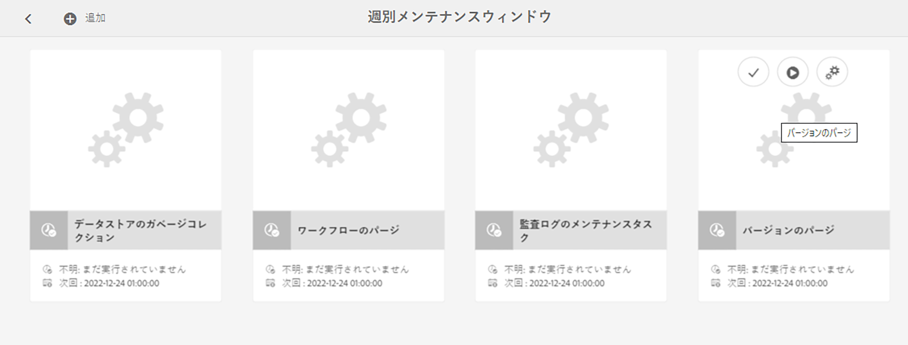

# Adobe Experience Manager インスタンスの監視と保守{#monitoring-and-maintaining-your-aem-instance}

AEM インスタンスがデプロイされた後は、操作、パフォーマンス、統合性を監視および保守する必要があります。

ここで重要なのは、潜在的な問題を認識するために、通常の状態におけるシステムの外観や動作を知っておく必要があるということです。この機能は、システムを監視し、時間をかけて情報を収集することが最適です。

| チェック項目 | 検討事項 | コメント／アクション |
|---|---|---|
| バックアップ計画。 |  | [インスタンスをバックアップ](/help/sites-deploying/monitoring-and-maintaining.md#backups)する方法を参照してください。 |
| 障害回復計画。 | 各社の障害回復ガイドライン。 |  |
| 問題を報告するためのエラー追跡システムが利用可能であること | 例えば、[Bugzilla](https://www.bugzilla.org/)、[Jira](https://www.atlassian.com/software/jira)、その他多数のうちいずれか。 |  |
| ファイルシステムは監視されています。 | 十分な空きディスク容量がない場合、CRX リポジトリは「フリーズ」します。スペースが利用可能になった後に再開されます。 | 空き容量が少なくなると、「`*ERROR* LowDiskSpaceBlocker`」メッセージがログファイルに表示されます。 |
| [ログファイル](/help/sites-deploying/monitoring-and-maintaining.md#working-with-audit-records-and-log-files)が監視されていること |  |  |
| システム監視がバックグラウンドで（一貫して）実行されていること。 | CPU、メモリ、ディスクおよびネットワークの使用状況を含みます。例えば、iostat／vmstat／perfmon などを使用。 | ログに記録されたデータを可視化して、パフォーマンス問題の追跡に使用できます。生のデータにもアクセスできます。 |
| [AEM パフォーマンスが監視されていること](/help/sites-deploying/monitoring-and-maintaining.md#monitoring-performance)。 | トラフィックレベルを監視する[要求カウンター](/help/sites-deploying/monitoring-and-maintaining.md#request-counters)を含みます。 | 重大な、または長期にわたるパフォーマンスの損失が見られる場合は、詳細な調査をする必要があります。 |
| [レプリケーションエージェント](/help/sites-deploying/monitoring-and-maintaining.md#monitoring-your-replication-agents)を監視していること。 |  |  |
| ワークフローインスタンスを定期的にパージすること。 | リポジトリのサイズとワークフローのパフォーマンス。 | [ワークフローインスタンスの定期的なパージ](/help/sites-administering/workflows-administering.md#regular-purging-of-workflow-instances)を参照してください。 |

## バックアップ {#backups}

次のバックアップを実行しておくことをお勧めします。

* ソフトウェアインストール - 設定を大幅に変更した前後
* リポジトリ内に保持されているコンテンツ - 定期的に実行

会社で決められているバックアップポリシーがある場合は、それに従う必要があります。何をいつバックアップするかについては、次の点も考慮してください。

* システムとデータの重要性。
* ソフトウェアまたはデータの変更頻度。
* データのボリューム。バックアップの実行に必要な時間だけでなく、容量も問題になる可能性があります。
* ユーザーがオンライン中にバックアップを実施できるかどうか。可能な場合は、パフォーマンスへの影響。
* ユーザーの地理的分布。つまり、バックアップに最適な（影響が最小限に抑えられる）日時。
* 障害回復ポリシー。バックアップデータの格納場所（オフサイト、特定のメディアなど）に関するガイドラインの有無。

一般的に、完全バックアップを一定の間隔（毎日、毎週、毎月など）で実行し、その合間（毎時、毎日、毎週など）に増分バックアップを実行します。

>[!CAUTION]
>
>実稼動インスタンスのバックアップを実装する場合、バックアップを正常に復元できることを確認するためにテストを行う&#x200B;*必要があります*。
>
>このテストを行わないと、最悪の場合、バックアップが無駄になる可能性があります。

>[!NOTE]
>
>バックアップのパフォーマンスについての詳細情報は、[バックアップのパフォーマンス](/help/sites-deploying/configuring-performance.md#backup-performance)セクションを参照してください。

### ソフトウェアインストールのバックアップ {#backing-up-your-software-installation}

インストール後や、設定を大幅に変更した後で、ソフトウェアインストールのバックアップを作成します。

このタスクを実行するには、[リポジトリ全体をバックアップして](#backing-up-your-repository)、次の手順を実行します。

1. AEM を停止します。
1. ファイルシステムから `<cq-installation-dir>` 全体をバックアップします。

>[!CAUTION]
>
>サードパーティ製のアプリケーションサーバーを使用している場合は、追加のフォルダーが別の場所にある可能性があり、そのフォルダーのバックアップが必要になることもあります。アプリケーションサーバーのインストールについて詳しくは、[アプリケーションサーバーと共に AEM をインストールする方法](/help/sites-deploying/application-server-install.md)を参照してください。

>[!CAUTION]
>
>ファイルデータストアの増分バックアップがサポートされています。その他のコンポーネント（Lucene インデックスなど）の増分バックアップを使用する場合は、削除済みのファイルがバックアップでも削除済みとマークされていることを確認してください。

>[!NOTE]
>
>ディスクミラーリングも、バックアップメカニズムとして使用できます。

### リポジトリのバックアップ {#backing-up-your-repository}

CRX リポジトリのバックアップに関連するすべての問題については、CRX ドキュメントの[バックアップと復元](/help/sites-administering/backup-and-restore.md)セクションで説明しています。

オンラインの「ホット」バックアップの作成について詳しくは、[オンラインバックアップの作成](/help/sites-administering/backup-and-restore.md#online-backup)を参照してください。

## バージョンのパージ {#version-purging}

**バージョンのパージ**&#x200B;ツールを使用すると、リポジトリ内のノードまたはノードの階層のバージョンをパージすることができます。このツールの主な目的は、古いバージョンのノードを削除してリポジトリのサイズを縮小することです。

このセクションでは、AEM のバージョン管理機能に関連するメンテナンス操作について説明します。**バージョンのパージ**&#x200B;ツールを使用すると、リポジトリ内のノードまたはノードの階層のバージョンをパージすることができます。このツールの主な目的は、古いバージョンのノードを削除してリポジトリのサイズを縮小することです。

### 概要 {#overview}

**バージョンのパージ**&#x200B;ツールは、週次メンテナンスタスクとして使用できます。 初めて使用する前に、追加して設定する必要があります。その後はリクエストに応じて、または週間ベースで実行することができます。

### Web サイトのバージョンのパージ {#purging-versions-of-a-web-site}

Web サイトのバージョンをパージするには、次の手順を実行します。

1. **[ツール](/help/sites-administering/tools-consoles.md)** **コンソール**&#x200B;に移動し、**操作**／**メンテナンス**／**週別メンテナンスウィンドウ**&#x200B;を選択します。

1. 上部ツールバーの「**+追加**」を選択します。

   

1. **新規タスクを追加**&#x200B;ダイアログで「**バージョンのパージ**」を選択します。次に「**保存**」します。

   

1. **バージョンのパージ**&#x200B;タスクが追加されます。カードアクションを使用して、以下を実行できます。
   * 選択 - 上部のツールバーに追加のアクションが表示されます
   * 実行 - 設定したパージを直ちに実行します。
   * 設定 - 週次パージタスクを設定します

   

1. **設定**&#x200B;アクションを選択し、**Day CQ WCM バージョンパージタスク**&#x200B;の web コンソールを開いて、以下を設定することができます。

   

   * **パスをパージ**
パージするコンテンツの開始パスを設定します。例： `/content/wknd`.

     >[!CAUTION]
     >
     >アドビでは、web サイトごとに複数のパスを定義することをお勧めします。
     >
     >子が多すぎるパスを定義すると、パージの実行時間が大幅に長くなる可能性があります。

   * **バージョンを再帰的にパージ**

      * パスで定義したノードのみをパージする場合は、選択を解除します。
      * パスで定義したノードおよびその下位のノードをパージする場合に選択します。

   * **バージョンの最大数**
保持するバージョンの（各ノードの）最大数を設定します。 この設定を使用しない場合は、空のままにします。

   * **バージョンの最小数**
保持するバージョンの（各ノードの）最小数を設定します。 この設定を使用しない場合は、空のままにします。

   * **バージョンの最長有効期間**
保持するバージョンの（各ノードに対の）最長有効期間を日数で設定します。 この設定を使用しない場合は、空のままにします。

   次に、 **保存**&#x200B;します。

1. **週別メンテナンスウィンドウ**&#x200B;のウィンドウに移動または戻り、「**実行**」を選択して、プロセスをすぐに起動します。

>[!CAUTION]
>
>クラシック UI ダイアログを使用して、設定した[ドライラン](#analyzing-the-console)を実行することができます。
>
>* http://localhost:4502/etc/versioning/purge.html
>
>パージされたノードを元に戻すには、リポジトリを復元する必要があります。パージの前に必ずドライランを実行して、慎重に設定してください。

#### ドライラン - コンソールの分析 {#analyzing-the-console}

クラシック UI では、次からの&#x200B;**ドライラン**&#x200B;オプションが提供されます。

* http://localhost:4502/etc/versioning/purge.html

この処理では、処理されたすべてのノードがリストされます。 この処理の間、ノードのステータスは次のいずれかになります。

* `ignore (not versionnable)`：ノードはバージョン管理をサポートしないので、処理中は無視されます。

* `ignore (no version)`：ノードにバージョンが含まれていないので、処理中は無視されます。

* `retained`：ノードはパージされません。
* `purged`：ノードはパージされます。

さらに、コンソールでは、バージョンに関して次のような有益な情報が提供されます。

* `V 1.0`：バージョン番号。
* `V 1.0.1`&#42;：星形は、バージョンが現在の（基本）バージョンであり、パージできないことを示しています。

* `Thu Mar 15 2012 08:37:32 GMT+0100`：バージョンの日付。

例を以下に示します。

* **[!DNL Shirts]** のバージョンは、バージョンの期間が 2 日を超えているので、パージされます。
* **[!DNL Tonga Fashions!]** のバージョンは、バージョンの数が 5 を超えているので、パージされます。


## 監査記録とログファイルの操作 {#working-with-audit-records-and-log-files}

Adobe Experience Manager（AEM）に関連する監査記録とログファイルは、様々な場所にあります。次に、検索内容の概要と検索場所を示します。

### ログの使用 {#working-with-logs}

AEM WCM は詳細なログを記録します。クイックスタートを解凍して起動すると、次の場所でログを検索できます。

* `<cq-installation-dir>/crx-quickstart/logs/`

* `<cq-installation-dir>/crx-quickstart/repository/`

#### ログファイルのローテーション {#log-file-rotation}

ログファイルのローテーションとは、定期的に新しいファイルを作成してファイルサイズの拡大を制限するプロセスのことです。AEM では、`error.log` というログファイルが、次の指定されたルールに従って 1 日 1 回ローテーションされます。

* `error.log` ファイルは、{original_filename} `.yyyy-MM-dd` というパターンに従って名前が変更されます。例えば、2010年7月11日に、現在のログファイルの名前が `error.log-2010-07-10` に変更され、新しい `error.og` が作成されます。

* 以前のログファイルは削除されないので、古いログファイルを定期的にクリーンアップして、ディスクの使用量を制限する必要があります。

>[!NOTE]
>
>AEM のインストールをアップグレードすると、AEM で使用されなくなった既存のログファイルがすべてディスクに残ります。安全に削除できます。すべての新しいログエントリは、新しいログファイルに書き込まれます。

### ログファイルの検索 {#finding-the-log-files}

AEM をインストールしたファイルサーバーには、次のような様々なログファイルが保持されます。

* `<cq-installation-dir>/crx-quickstart/logs`

   * `access.log`
AEM WCM とリポジトリに対するすべてのアクセス要求が、ここに登録されます。

   * `audit.log`
モデレートアクションはここに登録されます。

   * `error.log`
エラーメッセージ（様々な深刻度レベル）はここに登録されます。

   * [`ImageServer-<PortId>-yyyy>-<mm>-<dd>.log` ](https://experienceleague.adobe.com/docs/dynamic-media-developer-resources/image-serving-api/image-serving-api/config-admin/server-logging/c-image-server-log.html?lang=ja)
このログは、[!DNL Dynamic Media] が有効になっている場合にのみ使用されます。内部の ImageServer プロセスの動作を分析するための統計情報と分析情報を提供します。

   * `request.log`
各アクセス要求が、応答と共にここに登録されます。

   * [`s7access-<yyyy>-<mm>-<dd>.log` ](https://experienceleague.adobe.com/docs/dynamic-media-developer-resources/image-serving-api/image-serving-api/config-admin/server-logging/c-access-log.html?lang=ja)
このログは、[!DNL Dynamic Media] が有効になっている場合にのみ使用されます。s7access ログには、`/is/image` および `/is/content` 経由で [!DNL Dynamic Media] に対して実行された各リクエストが記録されます。

   * `stderr.log`
起動時に生成される様々な深刻度レベルのエラーメッセージを保持します。デフォルトでは、ログレベルはに設定されています。 `Warning` ( `WARN`)

   * `stdout.log`
起動時のイベントを示すログメッセージを保持します。

   * `upgrade.log`
から実行されるすべてのアップグレード操作のログを提供します。 `com.day.compat.codeupgrade` および `com.adobe.cq.upgradesexecutor` パッケージ。

* `<cq-installation-dir>/crx-quickstart/repository/segmentstore`

   * `journal.log`
リビジョンジャーナル処理の情報。

>[!NOTE]
>
>ImageServer ログと s7access ログは、system/console/status-Bundlelist ページから生成される「すべてダウンロード」パッケージには含まれません。サポート目的で、[!DNL Dynamic Media] の問題がある場合は、カスタマーサポートに連絡する際に ImageServer と s7access のログも添付してください。

### デバッグログレベルのアクティベート {#activating-the-debug-log-level}

デフォルトのログレベル（[Apache Sling Logging Configuration](/help/sites-deploying/osgi-configuration-settings.md#apacheslingloggingconfiguration)）は情報（INFO）なので、デバッグメッセージはログに記録されません。

ロガーのデバッグログレベルをアクティブにするには、リポジトリでプロパティ `org.apache.sling.commons.log.level` をデバッグに設定します。例えば、`/libs/sling/config/org.apache.sling.commons.log.LogManager` で [global Apache Sling Logging](/help/sites-deploying/osgi-configuration-settings.md#apacheslingloggingconfiguration) を設定します。

>[!CAUTION]
>
>デバッグログレベルのログを必要以上に長く残さないでください。これは、多数のログエントリが生成され、リソースを消費するからです。

デバッグファイルの行は、通常は DEBUG で始まり、その後にログレベル、インストーラーのアクション、ログメッセージが示されます。例：

```shell
DEBUG 3 WebApp Panel: WebApp successfully deployed
```

ログレベルは次のとおりです。

| 0 | 重大なエラー | アクションが失敗し、インストーラーの処理を続行できません。 |
|---|---|---|
| 1 | エラー | アクションが失敗しました。インストールは続行しますが、AEM WCM の一部が正常にインストールされなかったので、機能しません。 |
| 2 | 警告 | アクションは成功しましたが、問題が発生しました。AEM WCM は正常に機能する場合と機能しない場合があります。 |
| 3 | 情報 | アクションが成功しました。 |

### カスタムログファイルの作成 {#create-a-custom-log-file}

>[!NOTE]
>
>Adobe Experience Manager を操作しているときは、このようなサービスの設定を管理する方法がいくつかあります。詳細および推奨事項については、[OSGi の設定](/help/sites-deploying/configuring-osgi.md)を参照してください。

状況によっては、別のログレベルでカスタムログファイルを作成する必要があります。リポジトリで、次の操作を実行します。

1. 既存のものがない場合は、設定フォルダー（`sling:Folder`）を、プロジェクト（`/apps/<project-name>/config`）用に作成します。
1. `/apps/<project-name>/config` の下に、新しい [Apache Sling Logging Logger Configuration](/help/sites-deploying/osgi-configuration-settings.md#apacheslingloggingloggerconfigurationfactoryconfiguration) 用のノードを作成します。

   * 名前：`org.apache.sling.commons.log.LogManager.factory.config-<identifier>`

     `<identifier>` の部分は、インスタンスを識別するフリーテキストに置き換えます（この情報は省略できません）。

     例：`org.apache.sling.commons.log.LogManager.factory.config-MINE`

   * 型：`sling:OsgiConfig`

   >[!NOTE]
   >
   >技術的に必須ではありませんが、`<identifier>` は一意にすることをお勧めします。

1. このノードで次のプロパティを設定します。

   * 名前：`org.apache.sling.commons.log.file`

     タイプ：String

     値：ログファイルを指定します。例：`logs/myLogFile.log`

   * 名前：`org.apache.sling.commons.log.names`

     タイプ：文字列[] （文字列 + 複数）

     値：ロガーによってメッセージをログに記録する OSGi サービスを指定します。例えば、以下すべてを指定します。

      * `org.apache.sling`
      * `org.apache.felix`
      * `com.day`

   * 名前：`org.apache.sling.commons.log.level`

     タイプ：String

     値：必要なログレベル（`debug`、`info`、`warn`、`error` のいずれか）例：`debug`

   * 必要に応じてその他のパラメーターを設定します。

      * 名前：`org.apache.sling.commons.log.pattern`

        型：`String`

        値：必要に応じてログメッセージのパターンを指定します。次に例を示します。

        `{0,date,dd.MM.yyyy HH:mm:ss.SSS} *{4}* [{2}] {3} {5}`

   >[!NOTE]
   >
   >`org.apache.sling.commons.log.pattern` では、最大 6 個の引数がサポートされています。
   >
   >{0} タイプ `java.util.Date` のタイムスタンプ
   >
   >{1} ログマーカー
   >
   >{2} 現在のスレッドの名前
   >
   >{3} ロガーの名前
   >
   >{4} ログレベル
   >
   >{5} ログメッセージ
   >
   >ログ呼び出しに `Throwable` が含まれている場合は、スタックトレースがメッセージに付加されます。

   >[!CAUTION]
   >
   >org.apache.sling.commons.log.names には値が必要です。

   >[!NOTE]
   >
   >ログライターのパスは、`crx-quickstart` の場所と相対的です。
   >
   >したがって、ログファイルが
   >
   >`logs/thelog.log`
   >
   >と指定されている場合、書き込み先は以下となります。
   >
   >`<cq-installation-dir>/crx-quickstart/logs/thelog.log`。
   >
   >また、ログファイルが
   >
   >`../logs/thelog.log`
   >
   >と指定されている場合、書き込み先は以下のディレクトリとなります。
   >
   >`<cq-installation-dir>/logs/`\
   >（つまり、`<cq-installation-dir>/crx-quickstart/` の隣）

1. この手順は、新しいライターが必要な場合（つまり、デフォルトのライターとは異なる設定の場合）にのみ必要です。

   >[!CAUTION]
   >
   >新しい Logging Writer Configuration は、既存のデフォルトが適切でない場合にのみ必要です。
   >
   >明示的なライターが設定されていない場合は、デフォルトに基づいて暗黙のライターが自動的に生成されます。

   `/apps/<project-name>/config` の下に、新しい [Apache Sling Logging Writer Configuration](/help/sites-deploying/osgi-configuration-settings.md#apacheslingloggingwriterconfigurationfactoryconfiguration) 用のノードを作成します。

   * 名前：`org.apache.sling.commons.log.LogManager.factory.writer-<identifier>`（Writer）

     Logger の場合のように、`<identifier>` の部分は、インスタンスを識別するフリーテキストに置き換えます（この情報は省略できません）。例：`org.apache.sling.commons.log.LogManager.factory.writer-MINE`

   * 型：`sling:OsgiConfig`

   >[!NOTE]
   >
   >技術的に必須ではありませんが、`<identifier>` は一意にすることをお勧めします。

   このノードで次のプロパティを設定します。

   * 名前：`org.apache.sling.commons.log.file`

     型：`String`

     値：Logger で指定したファイルと一致するようにログファイルを指定します。

     この例の場合は `../logs/myLogFile.log` です。

   * 必要に応じてその他のパラメーターを設定します。

      * 名前：`org.apache.sling.commons.log.file.number`

        型：`Long`

        値：保持するログファイルの数を指定します。例えば、`5` とします。

      * 名前：`org.apache.sling.commons.log.file.size`

        型：`String`

        値：ファイルのローテーションをサイズや日付によって制御するために、必要に応じて指定します。例えば、`'.'yyyy-MM-dd` とします。

   >[!NOTE]
   >
   >`org.apache.sling.commons.log.file.size` は、次のいずれかを設定することによって、ログファイルのローテーションを制御します。
   >
   >* 最大ファイルサイズ
   >* 時刻／日付のスケジュール
   >
   >これにより、新しいファイルを作成する（また、名前のパターンに従って既存のファイルを名前変更する）条件を示します。
   >
   >* サイズの制限は数値で指定できます。サイズインジケーターが指定されていない場合、これはバイト数と見なされます。または、サイズインジケーターの 1 つ（`KB`、`MB`、`GB` のいずれか）を追加できます（大文字と小文字は区別されません）。
   >* 日時スケジュールは、`java.util.SimpleDateFormat` パターンとして指定できます。ファイルが回転されるまでの期間を定義します。また、回転後のファイルに追加されるサフィックス（識別用）です。
   >
   >デフォルトは「.」です。yyyy-MM-dd（毎日のログローテーションの場合）
   >
   >例えば、2010年1月20日午前 0 時（またはこの後の最初のログメッセージが正確になった場合）に、../logs/error.log は ../logs/error.log.2010-01-20 に名前が変更されます。1月21日のログは、次の日の変更時にロールオーバーされるまで、../logs/error.log（新しい空のログ）に出力されます。
   >
   >| `'.'yyyy-MM` | 毎月の初めにローテーション。 |
   >|---|---|
   >| `'.'yyyy-ww` | 毎週最初の日（ロケールによって異なる）にローテーション。 |
   >| `'.'yyyy-MM-dd` | 毎日深夜 12 時にローテーション。 |
   >| `'.'yyyy-MM-dd-a` | 毎日深夜 12 時および正午にローテーション。 |
   >| `'.'yyyy-MM-dd-HH` | 毎正時にローテーション。 |
   >| `'.'yyyy-MM-dd-HH-mm` | 毎分の初めにローテーション。 |
   >
   >メモ：日時を指定する場合：
   >
   >1. 一重引用符（&#39; &#39;）の範囲内で、リテラルテキストを「エスケープ」する必要があります。
   >
   >    特定の文字がパターン文字として解釈されるのを防ぎます。
   >
   >1. オプションの任意の場所で、有効なファイル名に使用できる文字のみを使用します。

1. 任意のツールで新しいログファイルを読み取ります。

   この例で作成されるログファイルは `../crx-quickstart/logs/myLogFile.log` となります。

Felix コンソールでは、`../system/console/slinglog` の Sling ログサポート（例：`https://localhost:4502/system/console/slinglog`）に関する情報も提供されます。

### 監査記録の検索 {#finding-the-audit-records}

監査記録は、誰がいつ何をしたかを記録するために保持されます。AEM WCM と OSGi の両方のイベントに対して、異なる監査レコードが生成されます。

#### ページオーサリング時に表示される AEM WCM の監査記録 {#aem-wcm-audit-records-shown-when-page-authoring}

1. ページを開きます。
1. サイドキックから、ロックアイコンが付いたタブを選択できます。次に、「**監査ログ...**」をダブルクリックします。
1. 新しいウィンドウが開き、現在のページの監査記録のリストが表示されます。

   

1. ウィンドウを閉じるには、「**OK**」をクリックします。

#### リポジトリ内の AEM WCM 監査記録 {#aem-wcm-auditing-records-within-the-repository}

`/var/audit` フォルダー内で、監査レコードは、リソースに応じて保持されます。個々のレコードとそのレコードに含まれる情報が表示されるまでドリルダウンできます。

これらのエントリに保持されている情報は、ページ編集時に表示される情報と同じです。

#### Web コンソールの OSGi 監査記録 {#osgi-audit-records-from-the-web-console}

また、OSGi イベントは監査レコードを生成し、 **設定ステータス** タブ/ **ログファイル** AEM Web コンソールのタブ：


## レプリケーションエージェントの監視 {#monitoring-your-replication-agents}

[レプリケーションキュー](/help/sites-deploying/replication.md)を監視すると、キューのダウンまたはブロックを検出できます。このような場合、発行を行うインスタンスまたは外部システムに問題がある可能性があります。

* 必要なキューがすべて有効になっていますか。
* 無効なキューの中に、まだ必要なものがありますか。
* `enabled`（有効な状態）のキューはすべて、ステータスが `idle` または `active` であり、これは正常な動作を示します。キューを `blocked`（ブロック状態）にしてはいけません。ブロックされている場合、多くは受信者側に問題があります。

* 時間の経過と共にキューのサイズが大きくなる場合は、キューがブロックされている可能性があります。

レプリケーションエージェントを監視するには：

1. AEM の「**ツール**」タブにアクセスします。
1. 「**レプリケーション**」をクリックします。
1. 適切な環境のエージェントへのリンクをダブルクリックします（左右いずれかのウィンドウ）。例えば、「**オーサーのエージェント**」などです。

   結果のウィンドウが開き、オーサー環境のすべてのレプリケーションエージェントの概要が、それぞれのターゲットとステータスを含めて表示されます。

1. 適切なエージェント名（リンク）をクリックして、そのエージェントの詳細情報を表示します。

   

   ここでは、以下のことができます。

   * エージェントが有効かどうかを確認。
   * レプリケーションのターゲットを確認。
   * レプリケーションキューがアクティブ（有効）かどうかを確認。
   * キュー内に項目が含まれているかどうかを確認。
   * 「**更新**」または「**消去**」によりキューエントリの表示を更新。これにより、キューに入る項目とキューから出る項目を確認できます。
   * 「**ログを表示**」でレプリケーションエージェントによるアクションのログにアクセス。
   * ターゲットインスタンスへの&#x200B;**接続をテスト**。
   * 任意のキュー項目で&#x200B;**強制的に再試行**（必要な場合）。

   >[!CAUTION]
   >
   >「接続をテスト」リンクは、パブリッシュインスタンスのリバースレプリケーションアウトボックスでは使用しないでください。
   >
   >アウトボックスキューに対してレプリケーションテストを実行すると、テストレプリケーションより古い項目が、リバースレプリケーションのたびに再処理されます。
   >
   >そのような項目がキュー内に既に存在する場合は、次の XPath JCR クエリを使用して検索し、削除してください。
   >
   >`/jcr:root/var/replication/outbox//*[@cq:repActionType='TEST']`

ここでも、すべてのレプリケーションエージェント（`/etc/replication/author` または `/etc/replication/publish` の下）を検出して、エージェントのステータス（`enabled`、`disabled`）および基になるキューのステータス（`active`、`idle`、`blocked`）を確認するソリューションを開発できます。

## パフォーマンスの監視 {#monitoring-performance}

[パフォーマンスの最適化](/help/sites-deploying/configuring-performance.md)は、開発時に重点的に取り組むインタラクティブなプロセスです。デプロイ後は、特定の間隔またはイベントの後にレビューされます。

最適化のための情報収集に使用する方法は、継続中の監視にも使用できます。

>[!NOTE]
>
>具体的な[パフォーマンス向上のための設定](/help/sites-deploying/configuring-performance.md#configuring-for-performance)も確認できます。

以下のリストは、よく発生するパフォーマンス上の問題と、それらの検出方法および対策についての提案を示したものです。

| 領域 | 症状 | 処理能力を増やすには | ボリュームを減らすには |
|---|---|---|---|
| クライアント | クライアントの CPU 使用率が高い。 | よりパフォーマンスの高いクライアント CPU をインストールする。 | （HTML）レイアウトを簡素化する。 |
|   | サーバーの CPU 使用率が低い。 | より高速なブラウザーにアップグレードする。 | クライアントサイドキャッシュを改善する。 |
|   | 高速のクライアントと低速のクライアントがある。 |  |  |
| サーバー |  |  |  |
| ネットワーク | サーバーとクライアントの両方で CPU 使用率が低い。 | ネットワークボトルネックを解消する。 | クライアントキャッシュの設定を改善または最適化する。 |
|   | サーバー上のローカルブラウジングは（比較的）速い。 | ネットワーク帯域幅を増やす。 | Web ページの「重さ」を軽減する（例：画像を減らす、HTML を最適化する）。 |
| Web サーバー | Web サーバーの CPU 使用率が高い。 | Web サーバーをクラスター化する。 | ページ（訪問）あたりのヒット数を減らす。 |
|   |  | ハードウェアのロードバランサーを使用。 |  |
| アプリケーション | サーバーの CPU 使用率が高い。 | AEM インスタンスをクラスター化する。 | CPU やメモリが集中的に使用されている箇所を検索して解消する（コードレビュー、出力タイミングなどを使用）。 |
|   | メモリ消費率が高い。 |  | すべてのレベルでキャッシュを改善。 |
|   | 応答時間が遅い。 |  | テンプレートおよびコンポーネント（構造、ロジックなど）を最適化する。 |
| リポジトリ |  |  |  |
| キャッシュ |  |  |  |

パフォーマンス上の問題は、接続速度の一時的な遅延、CPU の負荷など、web サイトとは関係のない様々な原因に起因する場合があります。

また、訪問者全員に影響する問題もあれば、一部にのみ影響する問題もあります。

これらの情報をすべて入手し分類と分析を実施して初めて、全体的なパフォーマンスを最適化したり、特定の問題を解決したりできます。

* パフォーマンス上の問題が発生する前に行うべきこと：

   * できる限り多くの情報を収集して、正常な状態のシステムに関する実用的な知識を十分に獲得します。

* パフォーマンス上の問題が発生したときに行うべきこと：

   * 1 つ（できれば 2 つ以上）の標準的な web ブラウザー、通常のパフォーマンスが良好であることがわかっている別のクライアント、または可能であればサーバー自体で、問題の再現を試みます。
   * 該当する期間にシステムに関連する何らかの変更が行われたかどうか、いずれかの変更がパフォーマンスに影響を与えた可能性があるかどうかを確認します。
   * 次の点を確認します。

      * 問題が発生するのは特定の時間のみかどうか。
      * 問題が発生するのは特定のページのみかどうか。
      * その他の要求に影響があるかどうか。

   * できる限り多くの情報を収集し、正常な状態のシステムに関する知識と比較します。

### パフォーマンスの監視と分析のためのツール {#tools-for-monitoring-and-analyzing-performance}

次に、パフォーマンスの監視と分析に使用できるツールのいくつかについて概要を示します。

この中には、オペレーティングシステムに依存するものもあります。

<table>
 <tbody>
  <tr>
   <td>ツール</td>
   <td>分析対象</td>
   <td>使用法／詳細</td>
  </tr>
  <tr>
   <td>request.log</td>
   <td>応答時間と同時実行性。</td>
   <td><a href="#interpreting-the-request-log">request.log の解釈</a>。</td>
  </tr>
  <tr>
   <td>truss/strace</td>
   <td>ページの読み込み</td>
   <td><p>システムコールとシグナルを追跡する Unix/Linux コマンド。 ログレベルをに上げます。 <code>INFO</code>.</p> <p>リクエストごとのページ読み込み数と、読み込んだページを分析します。</p> </td>
  </tr>
  <tr>
   <td>スレッドダンプ</td>
   <td>JVM スレッドを監視します。競合、ロック、長時間実行スレッドを特定します。</td>
   <td><p>オペレーティングシステムによって異なります。<br /> - Unix／Linux：<code>kill -QUIT &lt;<em>pid</em>&gt;</code><br /> - Windows（コンソールモード）：Ctrl キーを押しながら Break キーをクリック<br /> </p> <p><a href="https://github.com/irockel/tda">TDA</a> などの分析ツールも使用できます。<br /> </p> </td>
  </tr>
  <tr>
   <td>ヒープダンプ</td>
   <td>パフォーマンス低下の原因となるメモリ不足の問題。</td>
   <td><p><br /> <code>-XX:+HeapDumpOnOutOfMemoryError</code><br /> オプションを AEM に対する Java 呼び出しに追加します。</p> <p><a href="https://docs.oracle.com/javase/8/docs/technotes/guides/troubleshoot/prepapp002.html#CEGBHDFH">JVM のトラブルシューティングページのオプション／フラグ</a>を参照してください。</p> </td>
  </tr>
  <tr>
   <td>システムコール</td>
   <td>タイミングの問題を特定します。</td>
   <td><p><code>System.currentTimeMillis()</code> または <code>com.day.util</code> に対する呼び出し。タイミングを使用すると、コードから、または <a href="#html-comments">HTML コメント</a>経由で、タイムスタンプを生成できます。</p> <p><strong>メモ：</strong> これらを実装するのは、必要に応じてアクティベートとアクティベートの解除をできるようにするためです。システムが問題なく動作しているときは、オーバーヘッドになるため統計の収集は不要です。</p> </td>
  </tr>
  <tr>
   <td>Apache Bench</td>
   <td>メモリリークを特定し、応答時間を選択的に分析します。</td>
   <td><p>基本的な使用方法は次のとおりです。</p> <p><code>ab -k -n &lt;<em>requests</em>&gt; -c &lt;<em>concurrency</em>&gt; &lt;<em>url</em>&gt;</code></p> <p>詳しくは、<a href="#apache-bench">Apache Bench</a> および <a href="https://httpd.apache.org/docs/2.4/programs/ab.html">ab man ページ</a>を参照してください。</p> </td>
  </tr>
  <tr>
   <td>Search Analysis</td>
   <td> </td>
   <td>検索クエリをオフラインで実行し、クエリの応答時間を特定して、結果のセットをテストおよび確認します。<br /> </td>
  </tr>
  <tr>
   <td>JMeter</td>
   <td>読み込みおよび機能テスト。</td>
   <td><a href="https://jmeter.apache.org/">https://jmeter.apache.org/</a></td>
  </tr>
  <tr>
   <td>JProfiler</td>
   <td>CPU とメモリの詳細なプロファイリング。</td>
   <td><a href="https://www.ej-technologies.com/">https://www.ej-technologies.com/</a></td>
  </tr>
  <tr>
   <td>Java™ Flight Recorder</td>
   <td>Java™ Flight Recorder（JFR）は、実行中の Java アプリケーションに関する診断データとプロファイルデータを収集するためのツールです。</td>
   <td><a href="https://docs.oracle.com/javase/8/docs/technotes/guides/troubleshoot/tooldescr004.html#BABJJEEE">https://docs.oracle.com/javase/8/docs/technotes/guides/troubleshoot/tooldescr004.html#BABJJEEE</a></td>
  </tr>
  <tr>
   <td>JConsole</td>
   <td>JVM の指標とスレッドを監視します。</td>
   <td><p>使用方法：jconsole</p> <p><a href="https://docs.oracle.com/javase/8/docs/technotes/guides/management/jconsole.html">jconsole</a> および <a href="#monitoring-performance-using-jconsole">JConsole を使用したパフォーマンスの監視</a> を参照してください。</p> <p><strong>メモ：</strong>JDK 1.8 では、Top や TDA（Thread Dump Analyzer）などのプラグインを使用して JConsole を拡張できます。</p> </td>
  </tr>
  <tr>
   <td>Java™ VisualVM</td>
   <td>JVM の指標、スレッド、メモリ、プロファイリングを監視します。</td>
   <td><p>使用法：jvisualvm または visualvm<br /> </p> <p><a href="https://docs.oracle.com/javase/8/docs/technotes/guides/visualvm/">visualvm</a> および <a href="#monitoring-performance-using-j-visualvm">(J)VisualVM</a> を使用したパフォーマンスの監視を参照してください。</p> <p><strong>メモ：</strong>JDK 1.8 では、プラグインを使用して VisualVM を拡張できます。VisualVM は JDK 9 以降で廃止されます。その代わりに、Java™ Flight Recorder を使用します。</p> </td>
  </tr>
  <tr>
   <td>truss/strace、lsof</td>
   <td>カーネル呼び出しとプロセスの詳細な分析（UNIX®）。</td>
   <td>Unix／Linux コマンド。</td>
  </tr>
  <tr>
   <td>タイミング統計</td>
   <td>ページレンダリングのタイミング統計を参照してください。</td>
   <td><p>ページレンダリングのタイミング統計を確認するには、<strong>Ctrl と Shift キーを押しながら U キーをクリック</strong>し、URL に <code>?debugClientLibs=true</code> を設定します。</p> </td>
  </tr>
  <tr>
   <td>CPU およびメモリプロファイリングツール<br /> </td>
   <td><a href="#interpreting-the-request-log">開発中に低速の要求を分析する際に使用</a>。</td>
   <td>例えば、<a href="https://www.yourkit.com/">YourKit</a> などです。または <a href="https://docs.oracle.com/javase/8/docs/technotes/guides/troubleshoot/tooldescr004.html#BABJJEEE">Java™ Flight Recorder</a> などです。</td>
  </tr>
  <tr>
   <td><a href="#information-collection">情報収集</a></td>
   <td>インストールの進行中の状態。</td>
   <td>インストール環境についてなるべく多くのことを把握しておくと、パフォーマンスの変化の原因を突き止めたり、その変化が適正であるかどうかを判断できます。インストール環境に関する指標を定期的に収集し、有意な変化を発見しやすくします。</td>
  </tr>
 </tbody>
</table>

### request.log の解釈 {#interpreting-the-request-log}

このファイルには、AEMに対して行われたすべてのリクエストに関する基本情報が記載されます。このことから、貴重な結論を引き出すことができます。

`request.log` は、リクエストにかかる時間を確認するための組み込みの方法を提供します。開発目的では、`request.log` を `tail -f` して、応答時間の遅延を監視することが有用です。より大きな `request.log` を分析するには、[応答時間の並べ替えおよびフィルタリングが可能な `rlog.jar` の使用を推奨します](#using-rlog-jar-to-find-requests-with-long-duration-times)。

アドビでは、`request.log` から「遅い」ページを分離し、個別にチューニングしてパフォーマンスを向上させることをお勧めします。コンポーネントごとにパフォーマンス指標を含めるか、` [yourkit](https://www.yourkit.com/)` などのパフォーマンスプロファイリングツールを使用します。

#### Web サイト上のトラフィックの監視 {#monitoring-traffic-on-your-website}

request.log は、行われた各リクエストを、行われた応答と共に記録します。

```xml
09:43:41 [66] -> GET /author/y.html HTTP/1.1
09:43:41 [66] <- 200 text/html 797ms
```

特定の期間（例えば様々な 24 時間）の GET エントリをすべて集計すると、web サイトの平均トラフィックを把握できます。

#### request.log を使用した応答時間の監視 {#monitoring-response-times-with-the-request-log}

パフォーマンス分析は、request.log から始めることをお勧めします。

`<cq-installation-dir>/crx-quickstart/logs/request.log`

ログは次のようになります（単純にするため、行を短くしています）。

```xml
31/Mar/2009:11:32:57 +0200 [379] -> GET /path/x HTTP/1.1
31/Mar/2009:11:32:57 +0200 [379] <- 200 text/html 33ms
31/Mar/2009:11:33:17 +0200 [380] -> GET /path/y HTTP/1.1
31/Mar/2009:11:33:17 +0200 [380] <- 200 application/json 39ms
```

このログは、リクエストまたは応答ごとに 1 行です。

* リクエストまたは応答が行われた日付。
* リクエスト番号（角括弧の中）。この番号は、リクエストと応答で一致します。
* 矢印は、リクエスト（右向き矢印）か応答（左向き矢印）かを示します。
* リクエストの場合、行には以下が含まれます。

   * メソッド（通常は GET、HEAD または POST）
   * リクエストされたページ
   * プロトコル

* 応答の行には、以下が含まれます。

   * ステータスコード（200 は「成功」、404 は「ページが見つかりません」
   * MIME タイプ
   * 応答時間

小さなスクリプトを使用して、ログファイルから必要な情報を抽出し、望みの統計を組み立てることができます。そうした統計から、どのページやどの種類のページが遅いのか、また全体として満足できるパフォーマンスなのかがわかります。

#### request.log を使用した検索応答時間の監視 {#monitoring-search-response-times-with-the-request-log}

検索リクエストもログファイルに記録されます。

```xml
31/Mar/2009:11:35:34 +0200 [338] -> GET /author/playground/en/tools/search.html?query=dilbert&size=5&dispenc=utf-8 HTTP/1.1
31/Mar/2009:11:35:34 +0200 [338] <- 200 text/html 1562ms
```

そのため、上記のように、スクリプトを使用して関連情報を抽出し、統計を作成できます。

ただし、応答時間を確認した後、そのリクエストになぜそれだけの時間がかかっているのか、応答を改善するために何ができるかを分析する必要があります。

#### 現在のユーザーの数と影響の監視 {#monitoring-the-number-and-impact-of-concurrent-users}

ここでも、`request.log` を使用して、並行性およびそれに対するシステムの反応を監視できます。

テストを実施して、悪影響なくシステムが処理できる同時ユーザー数を特定する必要があります。ここでも、スクリプトを使用してログファイルから結果を抽出できます。

* 特定の時間内（1 分など）に行われたリクエスト数を監視します。
* 特定数のユーザーがすべて同じリクエストを同時に（できるだけ近いタイミングで）行った場合の影響をテストします。例えば、30 人のユーザーが同時に「**保存**」をクリックした場合などです。

```xml
31/Mar/2009:11:45:29 +0200 [333] -> GET /author/libs/Personalize/content/statics.close.gif HTTP/1.1
31/Mar/2009:11:45:29 +0200 [334] -> GET /author/libs/Personalize/content/statics.detach.gif HTTP/1.1
31/Mar/2009:11:45:30 +0200 [335] -> GET /author/libs/CFC/content/imgs/logo.rZMNURccynWcTpCxyuBNiTCoiBMmw000.default.gif HTTP/1.1
31/Mar/2009:11:45:32 +0200 [335] <- 304 text/html 0ms
31/Mar/2009:11:45:33 +0200 [334] <- 200 image/gif 31ms
31/Mar/2009:11:45:38 +0200 [333] <- 200 image/gif 31ms
31/Mar/2009:11:45:42 +0200 [336] -> GET /author/libs/CFC/content/imgs/logo.rZMNURccynWcTZRXunQbbQtvuuCMbRRBuWXz0000.default.gif HTTP/1.1
31/Mar/2009:11:45:43 +0200 [337] -> GET /author/titlebar_bg.gif HTTP/1.1
31/Mar/2009:11:45:43 +0200 [336] <- 304 text/html 0ms
31/Mar/2009:11:45:44 +0200 [337] <- 304 text/html 0ms
```

### rlog.jar を使用した所要時間の長いリクエストの検索 {#using-rlog-jar-to-find-requests-with-long-duration-times}

AEM には、次の場所に様々なヘルパーツールがあります。
`<cq-installation-dir>/crx-quickstart/opt/helpers`

その中の 1 つ、`rlog.jar` を使用すると、`request.log` を素早く並べ替え、所要時間が最長のものから最短のものの順序でリクエストを表示できます。

次のコマンドは、考えられる引数を示しています。

```shell
$java -jar rlog.jar
Request Log Analyzer Version 21584 Copyright 2005 Day Management AG
Usage:
  java -jar rlog.jar [options] <filename>
Options:
  -h               Prints this usage.
  -n <maxResults>  Limits output to <maxResults> lines.
  -m <maxRequests> Limits input to <maxRequest> requests.
  -xdev            Exclude POST request to CRXDE.
```

例えば、`request.log` ファイルをパラメーターとして指定してコマンドを実行すると、所要時間が長いほうから 10 個のリクエストを表示できます。

```shell
$ java -jar ../opt/helpers/rlog.jar -n 10 request.log
*Info * Parsed 464 requests.
*Info * Time for parsing: 22ms
*Info * Time for sorting: 2ms
*Info * Total Memory: 1mb
*Info * Free Memory: 1mb
*Info * Used Memory: 0mb
------------------------------------------------------
     18051ms 31/Mar/2009:11:15:34 +0200 200 GET /content/geometrixx/en/company.html text/ html
      2198ms 31/Mar/2009:11:15:20 +0200 200 GET /libs/cq/widgets.js application/x-javascript
      1981ms 31/Mar/2009:11:15:11 +0200 200 GET /libs/wcm/content/welcome.html text/html
      1973ms 31/Mar/2009:11:15:52 +0200 200 GET /content/campaigns/geometrixx.teasers..html text/html
      1883ms 31/Mar/2009:11:15:20 +0200 200 GET /libs/security/cq-security.js application/x-javascript
      1876ms 31/Mar/2009:11:15:20 +0200 200 GET /libs/tagging/widgets.js application/x-javascript
      1869ms 31/Mar/2009:11:15:20 +0200 200 GET /libs/tagging/widgets/themes/default.js application/x-javascript
      1729ms 30/Mar/2009:16:45:56 +0200 200 GET /libs/wcm/content/welcome.html text/html; charset=utf-8
      1510ms 31/Mar/2009:11:15:34 +0200 200 GET /bin/wcm/contentfinder/asset/view.json/ content/dam?_dc=1238490934657&query=&mimeType=image&_charset_=utf-8 application/json
      1462ms 30/Mar/2009:17:23:08 +0200 200 GET /libs/wcm/content/welcome.html text/html; charset=utf-8
```

大容量のデータサンプルに関してこの処理を行う必要がある場合は、個々の `request.log` ファイルを連結します。

### Apache Bench {#apache-bench}

特殊なケース（ガベージコレクションなど）の影響を最小限にするために、`apachebench`（詳細なドキュメントについては [ab](https://httpd.apache.org/docs/2.4/programs/ab.html) などを参照）などのツールを使用してメモリリークを特定し、応答時間を選択的に分析することをお勧めします。

Apache Bench は次の方法で使用できます。

```shell
$ ab -c 5 -k -n 1000 "https://localhost:4503/content/geometrixx/en/company.html"
This is ApacheBench, Version 2.3 <$Revision: 655654 $>
Copyright 1996 Adam Twiss, Zeus Technology Ltd, https://www.zeustech.net/
Licensed to The Apache Software Foundation, https://www.apache.org/

Benchmarking localhost (be patient)
Completed 100 requests
Completed 200 requests
Completed 300 requests
Completed 400 requests
Completed 500 requests
Completed 600 requests
Completed 700 requests
Completed 800 requests
Completed 900 requests
Completed 1000 requests
Finished 1000 requests

Server Software: Day-Servlet-Engine/4.1.52
Server Hostname: localhost
Server Port: 4503

Document Path: /content/geometrixx/en/company.html
Document Length: 24127 bytes

Concurrency Level: 5
Time taken for tests: 69.766 seconds
Complete requests: 1000
Failed requests: 998
(Connect: 0, Receive: 0, Length: 998, Exceptions: 0)
Write errors: 0
Keep-Alive requests: 0
Total transferred: 24160923 bytes
HTML transferred: 24010923 bytes
Requests per second: 14.33 /sec (mean)
Time per request: 348.828 [ms] (mean)
Time per request: 69.766 [ms] (mean, across all concurrent requests)
Transfer rate: 338.20 [Kbytes/sec] received

Connection Times (ms)
min mean[+/-sd] median max
Connect: 0 1 3.9 0 58
Processing: 138 347 568.5 282 8106
Waiting: 137 344 568.1 281 8106
Total: 139 348 568.4 283 8106

Percentage of the requests served within a certain time (ms)
50% 283
66% 323
75% 356
80% 374
90% 439
95% 512
98% 1047
99% 1132
100% 8106 (longest request)
```

上記の数値は、デフォルトの AEM インストールに含まれている、Geometrixx の会社ページにアクセスする標準の MacBook Pro ラップトップ（2010 年中頃）から取得されたものです。このページは単純ですが、パフォーマンスが最適化されていません。

`apachebench` は、すべての同時リクエストの平均として、リクエストあたりの時間も表示します。`Time per request: 54.595 [ms]`（すべての同時リクエストの平均）を参照してください。同時実行パラメーター `-c` の値（一度に実行する複数リクエストの数）を変更して、影響を確認できます。

### 要求カウンター {#request-counters}

リクエストトラフィック（特定の時間内のリクエスト数）に関する情報で、インスタンスの負荷を示します。この情報は、[request.log](#interpreting-the-request-log) から抽出できますが、カウンターを使用するとデータ収集が自動化され、次のことを確認できます。

* アクティビティの大きな違い（「多数のリクエスト」と「少ないアクティビティ」を区別）
* インスタンスが使用されていない時間帯
* 再起動の発生（カウンターが 0 にリセットされる）

情報の収集を自動化するには、RequestFilter をインストールして、リクエストが行われるたびにカウンター値を増やすこともできます。複数のカウンターを時間帯ごとに使い分けることもできます。

収集された情報を使用して、以下を示すことができます。

* アクティビティの大きな変化
* 冗長なインスタンス
* 再起動の発生（カウンターが 0 にリセットされる）

### HTML コメント {#html-comments}

サーバーのパフォーマンスのために、すべてのプロジェクトに `html comments` を含めることをお勧めします。公開されている優れた事例が多数見つかります。ページを選択し、ページソースを開いて表示し、一番下までスクロールすると、次のようなコードを確認できます。

```xml
</body>
 </html>
        <!--
        Page took 58 milliseconds to be rendered by server
         -->
```

### JConsole を使用したパフォーマンスの監視 {#monitoring-performance-using-jconsole}

ツールコマンド `jconsole` を、JDK で使用できます。

1. AEM インスタンスを起動します。
1. 実行 `jconsole.`
1. AEM インスタンスを選択して「**接続**」をクリックします。

1. `Local` アプリケーション内から、`com.day.crx.quickstart.Main` をダブルクリックします。デフォルトで概要が表示されます。

   

   次に、他のオプションを選択できます。

### （J）VisualVM を使用したパフォーマンスの監視 {#monitoring-performance-using-j-visualvm}

JDK 6～8 の場合、ツールコマンド `visualvm` を使用できます。JDK をインストールすると、以下を実行できます。

1. AEM インスタンスを起動します。

   >[!NOTE]
   >
   >Java™ 5 を使用している場合は、JVM を起動する Java™ コマンドラインに `-Dcom.sun.management.jmxremote` 引数を追加できます。JMX は、Java 6 ではデフォルトで有効になっています。

1. 次のいずれかを実行します。

   * `jvisualvm`：JDK 1.6 bin フォルダー内（テスト済みバージョン）
   * `visualvm`：[VisualVM](https://docs.oracle.com/javase/8/docs/technotes/guides/visualvm/) からダウンロードできます（最先端バージョン）

1. `Local` アプリケーション内から、`com.day.crx.quickstart.Main` をダブルクリックします。デフォルトで概要が表示されます。

   

   次に、監視などのその他のオプションを選択できます。

   

このツールを使用すると、スレッドダンプとメモリヘッドダンプを生成できます。この情報は、テクニカルサポートチームからよく依頼されるものです。

### 情報収集 {#information-collection}

インストールに関する情報をできる限り把握することで、パフォーマンスの変化を引き起こした可能性のある原因を追跡し、その変化が適正であるかどうかを確認することができます。インストール環境に関する指標を定期的に収集し、有意な変化を発見しやすくします。

有益な情報を以下に示します。

* [システムで作業をしている作成者の数](#how-many-authors-are-working-with-the-system)
* [1 日あたりのページアクティベーションの平均数](#what-is-the-average-number-of-page-activations-per-day)
* [このシステムで現在保守しているページ数](#how-many-pages-do-you-currently-maintain-on-this-system)
* [MSM を使用する場合は、1 ヶ月あたりのロールアウトの平均数](#if-you-use-msm-what-is-the-average-number-of-rollouts-per-month)
* [1 ヶ月あたりのライブコピーの平均数](#what-is-the-average-number-of-live-copies-per-month)
* [AEM Assets を使用する場合は、Assets で現在保守しているアセットの数](#ifyouusecqdamhowmanyassetsdoyoucurrentlymaintainincqdam)
* [アセットの平均サイズ](#what-is-the-average-size-of-the-assets)
* [現在使用されているテンプレートの数](#how-many-templates-are-currently-used)
* [現在使用されているコンポーネントの数](#how-many-components-are-currently-used)
* [ピーク時のオーサーシステムの 1 時間あたりの要求数](#how-many-requests-per-hour-do-you-have-on-the-author-system-at-peak-time)
* [ピーク時のパブリッシュシステムの 1 時間あたりの要求数](#how-many-requests-per-hour-do-you-have-on-the-publish-system-at-peak-time)

#### システムで作業をしている作成者の数 {#how-many-authors-are-working-with-the-system}

インストール以降にシステムを使用したことがあるオーサーの数を確認するには、次のコマンドラインを使用します。

```shell
cd <cq-installation-dir>/crx-quickstart/logs
cut -d " " -f 3 access.log | sort -u | wc -l
```

特定の日に動作しているオーサーの数を確認するには、以下を使用します。

```shell
grep "<date>" access.log | cut -d " " -f 3 | sort -u | wc -l
```

#### 1 日あたりのページアクティベーションの平均数 {#what-is-the-average-number-of-page-activations-per-day}

サーバーのインストール以降のページアクティベーションの合計数を確認するには、リポジトリクエリを使用します。CRXDE／ツール／クエリで、次のように指定します。

* **型** `XPath`

* **パス** `/`

* **クエリ** `//element(*, cq:AuditEvent)[@cq:type='Activate']`

その後、インストール以降の経過日数を計算し、平均を計算します。

#### このシステムで現在保守しているページ数 {#how-many-pages-do-you-currently-maintain-on-this-system}

現在サーバー上に存在するページの数を確認するには、リポジトリクエリを使用します。CRXDE／ツール／クエリで、次のように指定します。

* **型** `XPath`

* **パス** `/`

* **クエリ** `//element(*, cq:Page)`

#### MSM を使用する場合は、1 ヶ月あたりのロールアウトの平均数 {#if-you-use-msm-what-is-the-average-number-of-rollouts-per-month}

インストール以降のロールアウトの合計数を確認するには、リポジトリクエリを使用します。CRXDE／ツール／クエリで、次のように指定します。

* **型** `XPath`

* **パス** `/`

* **クエリ** `//element(*, cq:AuditEvent)[@cq:type='PageRolledOut']`

インストール以降の経過月数を計算し、平均を計算します。

#### 1 ヶ月あたりのライブコピーの平均数 {#what-is-the-average-number-of-live-copies-per-month}

インストール以降に作成されたライブコピーの合計数を特定するには、リポジトリクエリを使用します。CRXDE／ツール／クエリで、次のように指定します。

* **型** `XPath`

* **パス** `/`

* **クエリ** `//element(*, cq:LiveSyncConfig)`

ここでも、インストール以降の経過月数を使用して、平均を計算します。

#### AEM Assets を使用する場合は、Assets で現在保守しているアセットの数 {#if-you-use-aem-assets-how-many-assets-do-you-currently-maintain-in-assets}

現在保守している DAM アセットの数を確認するには、リポジトリクエリを使用します。CRXDE のツール／クエリで、次のように指定します。

* **型** `XPath`
* **パス** `/`
* **クエリ** `/jcr:root/content/dam//element(*, dam:Asset)`

#### アセットの平均サイズ {#what-is-the-average-size-of-the-assets}

`/var/dam` フォルダーの合計サイズを特定するには：

1. WebDAV を使用して、 リポジトリをローカルファイルシステムにマップします。

1. 次のコマンドラインを使用します。

   ```shell
   cd /Volumes/localhost/var
   du -sh dam/
   ```

   平均サイズを取得するには、グローバルサイズを、`/var/dam` 内のアセットの合計数（上記で得られた値）で割ります。

#### 現在使用されているテンプレートの数 {#how-many-templates-are-currently-used}

現在サーバー上に存在するテンプレートの数を確認するには、リポジトリクエリを使用します。CRXDE／ツール／クエリで、次のように指定します。

* **型** `XPath`
* **パス** `/`
* **クエリ** `//element(*, cq:Template)`

#### 現在使用されているコンポーネントの数 {#how-many-components-are-currently-used}

現在サーバー上に存在するコンポーネントの数を確認するには、リポジトリクエリを使用します。CRXDE／ツール／クエリで、次のように指定します。

* **型** `XPath`
* **パス** `/`
* **クエリ** `//element(*, cq:Component)`

#### ピーク時のオーサーシステムの 1 時間あたりの要求数 {#how-many-requests-per-hour-do-you-have-on-the-author-system-at-peak-time}

ピーク時のオーサーシステムでの 1 時間あたりのリクエスト数を確認するには、次のようにします。

1. インストール以降のリクエストの合計数を確認するには、次のコマンドラインを使用します。

   ```shell
   cd <cq-installation-dir>/crx-quickstart/logs
   grep -R "\->" request.log | wc -l
   ```

1. 開始日と終了日を特定するには、以下を使用します。

   ```shell
   vim request.log
   G / 1G: for the last/first lines
   ```

   これらの値を使用して、インストール以降の経過時間を計算し、1 時間あたりのリクエスト数の平均を計算します。

#### ピーク時のパブリッシュシステムの 1 時間あたりの要求数 {#how-many-requests-per-hour-do-you-have-on-the-publish-system-at-peak-time}

パブリッシュインスタンスで上記の手順を繰り返します。

## 具体的なシナリオの分析 {#analyzing-specific-scenarios}

パフォーマンス上の特定の問題が発生し始めた場合に確認すべき事項の推奨リストを以下に示します。リストは（残念ながら）完全に網羅的ではありません。

>[!NOTE]
>
詳しくは、以下の記事も参照してください。
>
* [スレッドダンプ](https://experienceleague.adobe.com/docs/experience-cloud-kcs/kbarticles/KA-17452.html?lang=ja)
* [メモリの問題の分析](https://experienceleague.adobe.com/docs/experience-cloud-kcs/kbarticles/KA-17482.html?lang=ja)
* [ビルトインプロファイラーによる分析](https://experienceleague.adobe.com/docs/experience-cloud-kcs/kbarticles/KA-17499.html?lang=ja)
* [低速のプロセスとブロックされたプロセスの分析](https://helpx.adobe.com/jp/experience-manager/kb/AnalyzeSlowAndBlockedProcesses.html)
>

### 100％の CPU 使用率 {#cpu-at}

システムの CPU が常に 100％で稼働している場合は、次の点を確認してください。

* ナレッジベース

   * [遅延しているプロセスおよびブロックされたプロセスの分析](https://helpx.adobe.com/jp/experience-manager/kb/AnalyzeSlowAndBlockedProcesses.html)

### メモリ不足 {#out-of-memory}

このようなエラーは開発時やテスト時に検出されるはずですが、特定のシナリオでは見落とされる可能性があります。

システムがメモリ不足になっている場合、この問題はパフォーマンスの低下や次のサブテキストを含むエラーメッセージなど、様々な形で現れます。

`java.lang.OutOfMemoryError`

このような場合は、以下をチェックします。

* [AEM を起動](/help/sites-deploying/deploy.md#getting-started)するために使用される JVM 設定
* ナレッジベース

   * [メモリの問題の分析](https://experienceleague.adobe.com/docs/experience-cloud-kcs/kbarticles/KA-17482.html?lang=ja)

### ディスク I/O {#disk-i-o}

システムのディスク容量が不足している場合や、ディスクのスラッシングに気付いた場合は、以下を参照してください。

* デバッグ情報の収集を無効にしているかどうかに関わらず、これは、次のような様々な場所で設定できます。

   * [Apache Sling JSP Script Handler](/help/sites-deploying/osgi-configuration-settings.md#apacheslingjspscripthandler)
   * [Apache Sling JavaScript Handler](/help/sites-deploying/osgi-configuration-settings.md#apacheslingjavascripthandler)
   * [Apache Sling Logging Configuration](/help/sites-deploying/osgi-configuration-settings.md#apacheslingloggingconfiguration)
   * [CQ HTML Library Manager](/help/sites-deploying/osgi-configuration-settings.md#daycqhtmllibrarymanager)
   * [CQ WCM Debug Filter](/help/sites-deploying/osgi-configuration-settings.md#daycqwcmdebugfilter)
   * [Logger](/help/sites-deploying/monitoring-and-maintaining.md#activating-the-debug-log-level)

* [バージョンのパージ](/help/sites-deploying/version-purging.md)を設定しているかどうかと、その設定方法
* ナレッジベース

   * [開いているファイルが多すぎる](https://experienceleague.adobe.com/docs/experience-cloud-kcs/kbarticles/KA-17470.html?lang=ja)
   * [ジャーナルの消費ディスク領域が大きすぎる](https://helpx.adobe.com/jp/experience-manager/kb/JournalTooMuchDiskSpace.html)

### 通常のパフォーマンス低下 {#regular-performance-degradation}

再起動するたびに（場合によっては 1 週間後またはそれ以降）インスタンスのパフォーマンスが低下する場合は、次のことを確認します。

* [メモリ不足](#outofmemory)
* ナレッジベース

   * [閉じられていないセッション](https://helpx.adobe.com/jp/experience-manager/kb/AnalyzeUnclosedSessions.html)

### JVM の調整 {#jvm-tuning}

Java™ 仮想マシン（JVM）の調整は改善されました（特に Java™ 7 以降）。そのため、適切な固定 JVM サイズを指定し、デフォルトを使用すればよいことが多いです。

デフォルトの設定が適切でない場合は、GC のパフォーマンスを監視および評価するメソッドを確立することが重要です。JVM の調整を行う前に、これを行ってください。このプロセスには、ヒープサイズ、アルゴリズム、その他の側面を含む要素の監視が含まれる場合があります。

一般的な選択肢は次のとおりです。

* VerboseGC：

  ```
  -verbose:gc \
   -Xloggc:$LOGS/verbosegc.log \
   -XX:+PrintGCDetails \
   -XX:+PrintGCDateStamps
  ```

結果のログは、次のような GC 可視化機能によって取り込み可能です。

` [https://www.ibm.com/developerworks/library/j-ibmtools2/](https://www.ibm.com/developerworks/library/j-ibmtools2/)`

JConsole の場合は以下のとおりです。

* これらの設定は、「広く開放された」JMX 接続用です。

  ```
  -Dcom.sun.management.jmxremote \
   -Dcom.sun.management.jmxremote.port=8889 \
   -Dcom.sun.management.jmxremote.authenticate=false \
   -Dcom.sun.management.jmxremote.ssl=false
  ```

* 次に、JConsole を使用して JVM に接続します。次を参照してください。
  ` [https://docs.oracle.com/javase/8/docs/technotes/guides/management/jconsole.html](https://docs.oracle.com/javase/8/docs/technotes/guides/management/jconsole.html)`

使用されているメモリの量や GC アルゴリズム、実行に要する時間、このプロセスがアプリケーションのパフォーマンスに与える影響を確認できます。これがなければ、調整は単に「ランダムにノブをひねる」だけの作業になります。

>[!NOTE]
>
Oracle の VM に関する情報は、次の場所でも確認できます。
>
[https://docs.oracle.com/javase/8/docs/technotes/guides/vm/server-class.html](https://docs.oracle.com/javase/8/docs/technotes/guides/vm/server-class.html)
