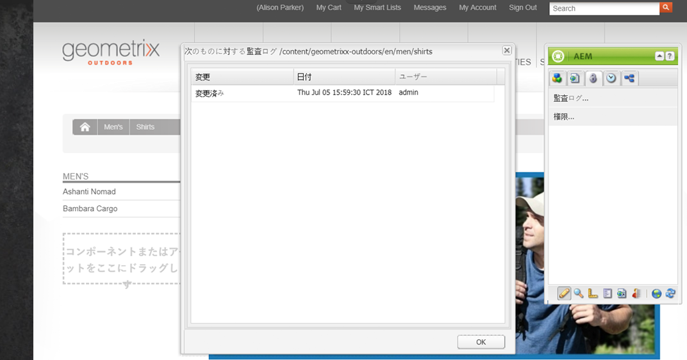
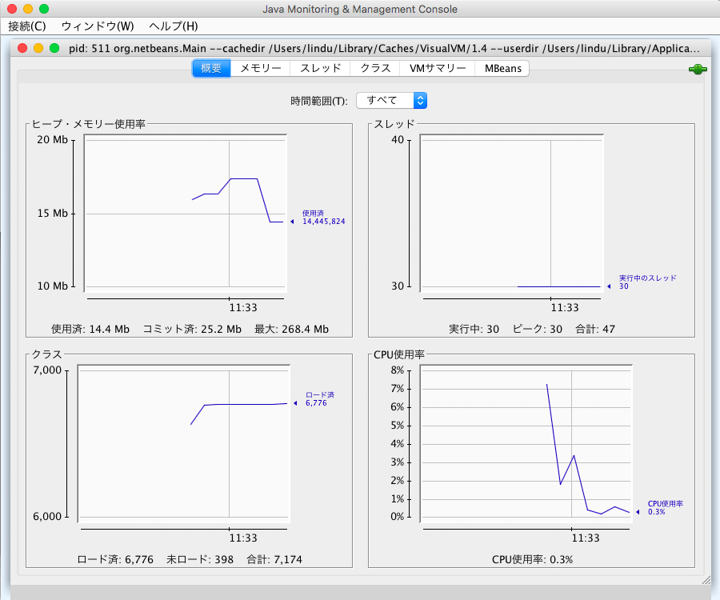

# AEM インスタンスの監視および保守{#monitoring-and-maintaining-your-aem-instance}

AEM インスタンスがデプロイされた後は、操作、パフォーマンス、統合性を監視および保守するために、一定の作業が必要になります。

ここで重要なのは、潜在的な問題を認識するために、通常の状態におけるシステムの外観や動作を知っておく必要があるということです。最善の方法は、システムを一定期間にわたって監視し、情報を収集することです。

| チェック項目 | 検討事項 | 注釈／アクション |
|---|---|---|
| バックアップ計画 |  | [ インスタンスのバックアップ](/help/sites-deploying/monitoring-and-maintaining.md#backups)方法を参照してください。 |
| 障害回復計画 | 各社の障害回復ガイドライン。 |  |
| 問題を報告するためのエラー追跡システムが利用可能であること | 例えば、[bugzilla](https://www.bugzilla.org/)、[jira](https://www.atlassian.com/software/jira/)、その他多数のうちいずれか。 |  |
| ファイルシステムが監視されていること | ディスクの空き容量が不十分な場合、CRX リポジトリは「フリーズ」します。容量が利用可能になると再開します。 | &quot; `*ERROR* LowDiskSpaceBlocker`&quot; messages can be seen in the log file when free space becomes low. |
| [ログファイル](/help/sites-deploying/monitoring-and-maintaining.md#working-with-audit-records-and-log-files)が監視されていること |  |  |
| システム監視がバックグラウンドで（一貫して）実行されていること | CPU、メモリ、ディスクおよびネットワークの使用状況を含みます。例えば、iostat、vmstat、perfmon を使用します。 | ログに記録されたデータを可視化して、パフォーマンス問題の追跡に使用できます。生のデータにもアクセスできます。 |
| [AEM パフォーマンスが監視されていること](/help/sites-deploying/monitoring-and-maintaining.md#monitoring-performance) | トラフィックレベルを監視する[要求カウンター](/help/sites-deploying/monitoring-and-maintaining.md#request-counters)を含みます。 | 重大な、または長期にわたるパフォーマンスの損失が見られる場合は、詳細な調査をする必要があります。 |
| You are monitoring your [Replication Agents](/help/sites-deploying/monitoring-and-maintaining.md#monitoring-your-replication-agents). `` |  |  |
| ワークフローインスタンスを定期的にパージすること | リポジトリのサイズとワークフローのパフォーマンス。 | [ワークフローインスタンスの定期的なパージ](/help/sites-administering/workflows-administering.md#regular-purging-of-workflow-instances)を参照してください。 |

## バックアップ {#backups}

以下のバックアップを取っておくことをお勧めします。

* ソフトウェアインストール - 設定を大幅に変更した前後
* リポジトリ内に保持されているコンテンツ - 定期的に

企業で決められているバックアップポリシーがある場合は、それに従う必要があります。何をいつバックアップするかについては、次の点も考慮してください。

* システムおよびデータの重要度。
* ソフトウェアまたはデータの変更の頻度。
* データのボリューム。バックアップの実施に必要な時間と同様に、容量も問題になる場合があります。
* ユーザーがオンライン中にバックアップを実施できるかどうか。可能な場合は、パフォーマンスへの影響。
* ユーザーの地理的分布。つまり、バックアップに最適な（影響が最小限に抑えられる）時間帯。
* 障害回復ポリシー。バックアップデータの格納場所（オフサイト、特定のメディア、など）に関するガイドラインがあるかどうか。

一般的には、完全バックアップを一定の間隔（例：1 日ごと、週ごと、月ごと）でおこない、その合間に増分バックアップをおこないます（例：1 時間ごと、1 日ごと、週ごと）。

>[!CAUTION]
>
>*実稼動インスタンスのバックアップを実装するときは、バックアップを正常に復元できることを確認するために、テストをおこなう必要があります。*

>そうしないと、最悪の場合、バックアップが無駄になる可能性があります。
>
>[!NOTE]
バックアップのパフォーマンスについて詳しくは、[バックアップのパフォーマンス](/help/sites-deploying/configuring-performance.md#backup-performance)を参照してください。

### ソフトウェアインストールのバックアップ {#backing-up-your-software-installation}

インストール後または設定を大幅に変更した後に、ソフトウェアインストールのバックアップを取ります。

これをおこなうには、[リポジトリ全体をバックアップ](#backing-up-your-repository)する必要があります。その後、以下の手順を実行します。

1. AEM を停止します。
1. Back up the entire `<cq-installation-dir>` from your file system.

>[!CAUTION]
サードパーティ製のアプリケーションサーバーを使用している場合は、追加のフォルダーが別の場所に存在し、そのフォルダーのバックアップも必要になることがあります。アプリケーションサーバーのインストールについて詳しくは、[アプリケーションサーバーと共に AEM をインストールする方法](/help/sites-deploying/application-server-install.md)を参照してください。[](/content/docs/en/aem/6-3/deploy/installing.md#installing adobe experience manager with application server)

>[!CAUTION]
ファイルデータストアの増分バックアップがサポートされています。その他のコンポーネント（Lucene インデックスなど）の増分バックアップを使用する場合は、削除済みのファイルがバックアップでも削除済みとマークされることを確認してください。

>[!NOTE]
ディスクミラーリングも、バックアップメカニズムとして使用できます。

### リポジトリのバックアップ {#backing-up-your-repository}

CRX ドキュメントの[バックアップと復元](/help/sites-administering/backup-and-restore.md)に、CRX リポジトリのバックアップに関連するすべての問題が掲載されています。

オンラインの「ホット」バックアップの作成について詳しくは、[オンラインバックアップの作成](/help/sites-administering/backup-and-restore.md#online-backup)を参照してください。

## バージョンのパージ {#version-purging}

**バージョンのパージ**&#x200B;ツールは、リポジトリ内のノードまたはノードの階層のバージョンをパージします。このツールの主な目的は、古いバージョンのノードを削除して、リポジトリのサイズを削減することです。

ここでは、AEM のバージョン管理機能に関連するメンテナンス操作について説明します。**バージョンのパージ**&#x200B;ツールは、リポジトリ内のノードまたはノードの階層のバージョンをパージします。このツールの主な目的は、古いバージョンのノードを削除して、リポジトリのサイズを削減することです。

### 概要 {#overview}

**バージョンのパージ**&#x200B;ツールは、**[ツール](/help/sites-administering/tools-consoles.md)コンソール&#x200B;**の「**バージョン管理&#x200B;**」の下か、次の場所にあります。

`https://<server>:<port>/etc/versioning/purge.html`


**開始パス** ：パージを実行する必要がある絶対パス。 リポジトリツリーナビゲーターをクリックして、開始パスを選択することができます。

**再帰** ：データを削除する場合は、「再帰」を選択して、1つのノードで操作を実行するか、階層全体で操作を実行するかを選択できます。 最後のケースでは、指定されたパスが階層のルートノードを定義します。

**保持する最大バージョン** ：ノードで保持する最大バージョン数。 この値を超えると、最も古いバージョンが削除されます。

**Maximum version age** ：ノードのバージョンの最大経過時間。 バージョンの経過時間がこの値を超えると、削除されます。

**Dry Run** ：バックアップを復元しない限り、コンテンツのバージョンの削除は確実で元に戻せないので、Purge Versionsツールではドライ実行モードを使用して、削除されたバージョンをプレビューできます。 パージ処理のドライ実行を開始するには、「ドライ実行」をクリックします。

**削除** ：ノードパスで定義されたノード上のバージョンの削除を開始します。

### Web サイトのバージョンのパージ {#purging-versions-of-a-web-site}

Web サイトのバージョンをパージするには、次の手順を実行します。

1. **[ツール](/help/sites-administering/tools-consoles.md)****コンソール**に移動して、「**バージョン管理**」を選択し、「**バージョンのパージ**」をダブルクリックします。
1. Set the start path of the content to be purged (e.g. `/content/geometrixx-outdoors`).

   * パスで定義したノードのみをパージする場合は、「**繰り返し**」の選択を解除します。
   * パスで定義したノードおよびその下位のノードをパージする場合は、「**繰り返し**」を選択します。

1. 保持するバージョンの最大数（ノードごと）を設定します。この設定を使用しない場合は、空のままにします。

1. 保持するバージョンの最長有効期間（ノードごと）を日数で設定します。この設定を使用しない場合は、空のままにします。

1. 「**ドライラン**」をクリックして、パージプロセスによる処理をプレビューします。
1. 「**パージ**」をクリックして処理を開始します。

>[!CAUTION]
パージされたノードを元に戻すには、リポジトリを復元するしかありません。設定は自己管理する必要があるので、パージの前に必ずドライランを実行することをお勧めします。

### コンソールの分析 {#analyzing-the-console}

「**ドライラン**」と「**パージ**」の処理では、処理されたすべてのノードがリストされます。処理の間、ノードのステータスは次のうちいずれかになります。

* `ignore (not versionnable)`:ノードはバージョン管理をサポートしていないので、処理中は無視されます。

* `ignore (no version)`:ノードにはバージョンがないので、処理中は無視されます。&quot;

* `retained`：ノードはパージされません。
* `purged`:ノードが削除されます。

さらに、コンソールでは、バージョンに関して次のような有益な情報が提供されます。

* `V 1.0`:バージョン番号。
* `V 1.0.1`*：星マークは、バージョンが最新であることを示します。

* `Thu Mar 15 2012 08:37:32 GMT+0100`:バージョンの日付。

例を以下に示します。

* **Shirts** のバージョンは、バージョンの期間が 2 日間を超えているので、パージされます。
* **Tonga Fashions!** のバージョンは、バージョンの数が 5 を超えているので、パージされます。


## 監査記録とログファイルの使用 {#working-with-audit-records-and-log-files}

Adobe Experience Manager（AEM）に関連する監査記録とログファイルは、様々な場所にあります。以下では、どこに何があるかについて、概要を説明します。

### ログの使用 {#working-with-logs}

AEM WCM では詳細なログを記録します。クイックスタートを展開して起動すると、次の場所にログが見つかります。

* `<cq-installation-dir>/crx-quickstart/logs/`

* `<cq-installation-dir>/crx-quickstart/repository/`

#### ログファイルのローテーション {#log-file-rotation}

ログファイルのローテーションとは、新しいファイルを定期的に作成することでファイルの増大を制限するプロセスを指します。 AEMでは、というログファイルが `error.log` 、指定された規則に従って1日1回回転されます。

* ファイル `error.log` の名前は、{original_filename}というパターンに従って変更されま `.yyyy-MM-dd`す。 例えば、2010年7月11日に、現在のログファイルの名前が変更され、新 `error.log-2010-07-10`しいログファイルが作成 `error.og` されます。

* 以前のログファイルは削除されないので、古いログファイルを定期的にクリーンアップして、ディスクの使用を制限する必要があります。

>[!NOTE]
AEM をアップグレードする場合は、AEM でこれ以上使用されない既存のログファイルがディスク上に残ることに注意してください。これらは削除しても問題ありません。新しいログエントリはすべて、新しいログファイルに書き込まれます。

### ログファイルの検索 {#finding-the-log-files}

様々なログファイルが、AEM をインストールしたファイルサーバー上に保持されます。

* `<cq-installation-dir>/crx-quickstart/logs`

   * `access.log`
AEM WCM およびリポジトリに対するアクセス要求はすべてここに登録されます。

   * `audit.log`
モデレートアクションはここに登録されます。

   * `error.log`
エラーメッセージ（様々な深刻度レベル）はここに登録されます。

   * [ このロ `ImageServer-<PortId>-yyyy>-<mm>-<dd>.log`](https://marketing.adobe.com/resources/help/en_US/s7/is_ir_api/is_api/c_image_server_log.html)グは、が有効な場合にのみ [!DNL Dynamic Media] 使用されます。 内部ImageServerプロセスの動作を分析するために使用される統計と分析情報を提供します。

   * `request.log`
各アクセス要求が、応答と共にここに登録されます。

   * [ このロ `s7access-<yyyy>-<mm>-<dd>.log`](https://marketing.adobe.com/resources/help/en_US/s7/is_ir_api/is_api/c_Access_Log.html)グは、が有効な場合にのみ [!DNL Dynamic Media] 使用されます。 s7accessログには、およびを介して行われた各リクエストが [!DNL Dynamic Media] 記録さ `/is/image` れま `/is/content`す。

   * `stderr.log`
起動時に生成される様々な重大度のエラー・メッセージを保持します。 デフォルトでは、ログレベルは `Warning` ( `WARN`)に設定されます

   * `stdout.log`
起動時のイベントを示すログメッセージを保持します。

   * `upgrade.log`
およびパッケージから実行されるすべてのアップグレード操作のログ `com.day.compat.codeupgrade` を提供 `com.adobe.cq.upgradesexecutor` します。

* `<*cq-installation-dir*>/crx-quickstart/repository`

   * `revision.log`
リビジョンジャーナリング情報。

>[!NOTE]
ImageServerとs7accessのログは、**system/console/status-Bundlelist **pageから生成される**Download Full **パッケージには含まれません。 サポートの目的で問題が発生した場合 [!DNL Dynamic Media] は、カスタマーサポートに問い合わせる際に、ImageServerとs7accessのログも追加してください。

### デバッグログレベルのアクティベート {#activating-the-debug-log-level}

デフォルトのログレベル（[Apache Sling Logging Configuration](/help/sites-deploying/osgi-configuration-settings.md#apacheslingloggingconfiguration)）は情報（INFO）なので、デバッグメッセージはログに記録されません。

ロガーのデバッグログレベルをアクティブにするには、リポジトリでデバッグす `org.apache.sling.commons.log.level` るプロパティを設定します。 例えば、をオンにして、グ `/libs/sling/config/org.apache.sling.commons.log.LogManager` ローバルApache Sling [ログを設定します](/help/sites-deploying/osgi-configuration-settings.md#apacheslingloggingconfiguration)。

>[!CAUTION]
デバッグログレベルのログを、不必要に長く残さないでください。多くのログエントリが生成され、リソースが消費されます。

デバッグファイルの行は、通常は DEBUG で始まり、その後にログレベル、インストーラーのアクション、ログメッセージが示されます。次に例を示します。

```shell
DEBUG 3 WebApp Panel: WebApp successfully deployed
```

ログレベルは次のとおりです。

| 0 | 重大なエラー | アクションが失敗し、インストーラーの処理を続行できません。 |
|---|---|---|
| 1 | エラー | アクションが失敗しました。インストールは続行しますが、AEM WCM の一部が正常にインストールされなかったので、機能しません。 |
| 2 | 警告 | アクションは成功しましたが、問題が発生しました。AEM WCM は正常に機能する場合と機能しない場合があります。 |
| 3 | 情報 | アクションが成功しました。 |

### カスタムログファイルの作成 {#create-a-custom-log-file}

>[!NOTE]
Adobe Experience Manager を操作しているときは、このようなサービスの設定を管理する方法がいくつかあります。詳細および推奨事項については、[OSGi の設定](/help/sites-deploying/configuring-osgi.md)を参照してください。

状況によっては、別のログレベルでカスタムログファイルを作成する必要があります。これをおこなうには、リポジトリで次の手順を実行します。

1. If not already existing, create a new configuration folder ( `sling:Folder`) for your project `/apps/<*project-name*>/config`.
1. Under `/apps/<*project-name*>/config`, create a node for the new [Apache Sling Logging Logger Configuration](/help/sites-deploying/osgi-configuration-settings.md#apacheslingloggingloggerconfigurationfactoryconfiguration):

   * 名前： `org.apache.sling.commons.log.LogManager.factory.config-<*identifier*>` （ロガーの場合）

      Where `<*identifier*>` is replaced by free text that you (must) enter to identify the instance (you cannot omit this information).

      例：`org.apache.sling.commons.log.LogManager.factory.config-MINE`

   * タイプ: `sling:OsgiConfig`
   >[!NOTE]
   Although not a technical requirement, it is advisable to make `<*identifier*>` unique.

1. このノードで次のプロパティを設定します。

   * 名前: `org.apache.sling.commons.log.file`

      タイプ：String

      値：ログファイルの指定例えば、 `logs/myLogFile.log`

   * 名前: `org.apache.sling.commons.log.names`

      タイプ：文字列[] （文字列+複数）

      値：ロガーがメッセージをログに記録するOSGiサービスを指定する。例えば、次のすべての例を示します。

      * `org.apache.sling`
      * `org.apache.felix`
      * `com.day`
   * 名前: `org.apache.sling.commons.log.level`

      タイプ：String

      値：必要なログレベル(、、ま `debug`たは `info``warn` )を指 `error`定します。例えば `debug`

   * 必要に応じてその他のパラメーターを設定します。

      * 名前: `org.apache.sling.commons.log.pattern`

         タイプ: `String`

         値：必要に応じて、ログメッセージのパターンを指定します。例えば、

         `{0,date,dd.MM.yyyy HH:mm:ss.SSS} *{4}* [{2}] {3} {5}`
   >[!NOTE]
   `org.apache.sling.commons.log.pattern` では、最大 6 個の引数がサポートされています。

   >{0} タイプが `java.util.Date` のタイムスタンプ {1} ログマーカー {2} 現在のスレッドの名前 {3} ロガーの名前 {4} ログレベル {5} ログメッセージ

   >ログ呼び出しに `Throwable` が含まれている場合は、スタックトレースがメッセージに付加されます。

   >[!CAUTION]
   org.apache.sling.commons.log.names には値が必要です。

   >[!NOTE]
   ログライターのパスは、`crx-quickstart` の場所と相対的です。
   したがって、ログファイルが
   `logs/thelog.log`

   >と指定されている場合、書き込み先は以下となります。
   `` ` ` `<*cq-installation-dir*>/``crx-quickstart/logs/thelog.log`.
   また、ログファイルが
   `../logs/thelog.log`

   >と指定されている場合、書き込み先は以下のディレクトリとなります。
   ` <*cq-installation-dir*>/logs/`
&quot;(例： ` `&lt;*cq-installation-dir*>/の横`crx-quickstart/`)

1. この手順は、新しいライターが必要な場合（つまり、デフォルトのライターとは異なる設定の場合）にのみ必要です。

   >[!CAUTION]
   新しい Logging Writer Configuration は、既存のデフォルトが適切でない場合にのみ必要です。

   >明示的なライターが設定されていない場合は、デフォルトに基づいて暗黙のライターが自動的に生成されます。

   Under `/apps/<*project-name*>/config`, create a node for the new [Apache Sling Logging Writer Configuration](/help/sites-deploying/osgi-configuration-settings.md#apacheslingloggingwriterconfigurationfactoryconfiguration):

   * 名前：(こ `org.apache.sling.commons.log.LogManager.factory.writer-<*identifier*>` れは作家なので)

      ロガーと同様、は、イン `<*identifier*>` スタンスを識別するために（必須の）入力する自由なテキストに置き換えられます（この情報は省略できません）。 例：`org.apache.sling.commons.log.LogManager.factory.writer-MINE`

   * タイプ: `sling:OsgiConfig`
   >[!NOTE]
   Although not a technical requirement, it is advisable to make `<*identifier*>` unique.

   このノードで次のプロパティを設定します。

   * 名前: `org.apache.sling.commons.log.file`

      タイプ: `String`

      値：ログファイルを指定して、ロガーで指定されたファイルと一致するようにします。

      例えば、 `../logs/myLogFile.log`「

   * 必要に応じてその他のパラメーターを設定します。

      * 名前: `org.apache.sling.commons.log.file.number`

         タイプ: `Long`

         Value: specify the number of log files you want kept; for example, `5`

      * 名前: `org.apache.sling.commons.log.file.size`

         タイプ: `String`

         Value: specify as required to control file rotation by size/date; for example, `'.'yyyy-MM-dd`
   >[!NOTE]
   `org.apache.sling.commons.log.file.size` は、次のいずれかを設定することによって、ログファイルのローテーションを制御します。
   * 最大ファイルサイズ
   * 時刻／日付のスケジュール
   これにより、新しいファイルを作成する（また、名前のパターンに従って既存のファイルを名前変更する）条件を示します。
   * サイズ制限は数値で指定できます。 サイズインジケーターを指定しない場合は、バイト数と見なされるか、サイズインジケーター(、、または、大文字と小文字の区別な `KB`し) `MB`の1つ `GB` を追加できます。
   * 日時スケジュールは、パターンとして指定で `java.util.SimpleDateFormat` きます。 これは、ファイルの回転が終わるまでの期間を定義します。また、回転されたファイルに追加されるサフィックスも表します（識別用）。
   デフォルトは「。」です。yyyy-MM-dd（日別ログのローテーション用）。
   例えば、2010年1月20日の真夜中（またはこの後の最初のログメッセージが正確である場合）、../logs/error.logの名前は../logs/error.log.2010-01-20に変更されます。 1月21日のログは、次の日の変更時にロールオーバーされるまで、（新しい空の）../logs/error.logに出力されます。
   | `'.'yyyy-MM` | 毎月の初めにローテーション。 |
   |---|---|
   | `'.'yyyy-ww` | 各週の最初の日のローテーション（ロケールによって異なります）。 |
   | `'.'yyyy-MM-dd` | 毎日午前0時のローテーション。 |
   | `'.'yyyy-MM-dd-a` | 毎日午前0時と正午のローテーション。 |
   | `'.'yyyy-MM-dd-HH` | 毎時の最上部での回転。 |
   | `'.'yyyy-MM-dd-HH-mm` | 毎分の最初の回転。 |
   注意：日時を指定する場合：
   1. 一重引用符(&#39; &#39;)のペア内で、リテラルテキストを「エスケープ」する必要があります。これは、特定の文字がパターン文字として解釈されるのを防ぐためです。
   1. オプションの任意の場所で、有効なファイル名に使用できる文字のみを使用します。


1. 任意のツールで新しいログファイルを読み取ります。

   The log file created by this example will be `../crx-quickstart/logs/myLogFile.log`.

The Felix Console also provides information about Sling Log Support at `../system/console/slinglog`; for example `https://localhost:4502/system/console/slinglog`.

### 監査記録の検索 {#finding-the-audit-records}

監査記録は、いつ、誰が、何をしたかの記録を提供するために保持されます。AEM WCM と OSGi の両方のイベントに関して、様々な監査記録が生成されます。

#### ページオーサリング時に表示される AEM WCM の監査記録 {#aem-wcm-audit-records-shown-when-page-authoring}

1. ページを開きます。
1. サイドキックから、ロックアイコンを含むタブを選択できます。次に、「**監査ログ**」をダブルクリックします。
1. 新しいウィンドウが開き、現在のページの監査記録のリストが表示されます。

   

1. ウィンドウを閉じるには、「**OK**」をクリックします。

#### リポジトリ内の AEM WCM 監査記録 {#aem-wcm-auditing-records-within-the-repository}

フォルダ内 `/var/audit` では、リソースに従って監査レコードが保持されます。 個々のレコードとそのレコードに含まれる情報が表示されるまで、ドリルダウンできます。

これらのエントリに保持されている情報は、ページ編集時に表示される情報と同じです。

#### Web コンソールの OSGi 監査記録 {#osgi-audit-records-from-the-web-console}

OSGi events also generate audit records which can be seen from the **Configuration Status** tab -> **Log Files **tab in the AEM Web Console:


## レプリケーションエージェントの監視 {#monitoring-your-replication-agents}

[レプリケーションキュー](/help/sites-deploying/replication.md)を監視すると、キューのダウンまたはブロックを検出できます。このような場合、パブリッシュインスタンスまたは外部システムに問題がある可能性があります。

* 必要なキューがすべて有効になっていますか。
* 無効なキューの中に、まだ必要なものがありますか。
* `enabled`（有効な状態）のキューはすべて、ステータスが `idle` または `active` であり、これは正常な動作を示します。キューを `blocked`（ブロック状態）にしてはいけません。ブロックされている場合、多くは受信者側に問題があります。

* 時間の経過と共にキューのサイズが大きくなる場合は、キューがブロックされている可能性があります。

レプリケーションエージェントを監視するには：

1. AEM の「**ツール**」タブにアクセスします。
1. 「**レプリケーション**」をクリックします。
1. 適切な環境のエージェントへのリンクをダブルクリックします（左右いずれかのウィンドウ）。例えば、「**オーサーのエージェント**」などです。

   ウィンドウが開き、オーサー環境のすべてのレプリケーションエージェントの概要が、それぞれのターゲットとステータスを含めて表示されます。

1. 適切なエージェント名（リンク）をクリックして、そのエージェントの詳細情報を表示します。

   

   ここでは、以下のことができます。

   * エージェントが有効かどうかを確認。
   * レプリケーションのターゲットを確認。
   * レプリケーションキューが現在アクティブ（有効）かどうかを確認。
   * キュー内に項目が含まれているかどうかを確認。
   * **更新**&#x200B;または&#x200B;**消去**&#x200B;して、キューエントリの表示を更新。これは、キューに出入りする項目の確認に役立ちます。

   * **ログを表示**&#x200B;して、レプリケーションエージェントによるアクションのログにアクセス。
   * ターゲットインスタンスへの&#x200B;**接続をテスト**。
   * 必要に応じて、任意のキュー項目で&#x200B;**強制的に再試行**。
   >[!CAUTION]
   パブリッシュインスタンスのリバースレプリケーションアウトボックスには、「接続をテスト」リンクは使用しないでください。
   アウトボックスクエリ用にレプリケーションテストが実行されると、リバースレプリケーションのたびに、テストレプリケーションより古い項目がすべて再処理されます。
   そのような項目がキュー内に既に存在する場合は、次の XPath JCR クエリを使用して検索し、削除する必要があります。
   `/jcr:root/var/replication/outbox//*[@cq:repActionType='TEST']`

Again you can develop a solution to detect all replication agents (located under `/etc/replication/author` or `/etc/replication/publish`), then check the status of the agent ( `enabled`, `disabled`) and the underlying queue ( `active`, `idle`, `blocked`).

## パフォーマンスの監視 {#monitoring-performance}

[パフォーマンスの最適化](/help/sites-deploying/configuring-performance.md)は、開発時に注目を集めるインタラクティブなプロセスです。デプロイメント後、通常は特定の間隔またはイベントの後でレビューされます。

最適化のための情報収集に使用する方法は、継続中の監視にも使用できます。

>[!NOTE]
具体的な[パフォーマンス向上のための設定](/help/sites-deploying/configuring-performance.md#configuring-for-performance)も確認できます。

以下のリストは、よく発生するパフォーマンス上の問題と、それぞれの見分け方および対策を示しています。

| 領域 | 現象 | 容量を増やす方法 | ボリュームを減らす方法 |
|---|---|---|---|
| クライアント | クライアントの CPU 使用率が高い。 | より高性能のクライアント CPU をインストール。 | （HTML）レイアウトを簡素化。 |
|  | サーバーの CPU 使用率が低い。 | より高速なブラウザーにアップグレード。 | クライアント側のキャッシュを改善。 |
|  | 高速のクライアントと低速のクライアントがある。 |  |  |
| サーバー |  |  |  |
| ネットワーク | サーバーとクライアントの両方で CPU 使用率が低い。 | ネットワークのボトルネックを除去。 | クライアントキャッシュの設定を改善／最適化。 |
|  | サーバーのローカルでの参照が（比較的）高速。 | ネットワーク帯域幅を増加。 | Web ページの「重さ」を軽減（例：画像を減らす、HTML を最適化する）。 |
| Web サーバー | Web サーバー上の CPU 使用率が高い。 | Web サーバーをクラスター化。 | ページごとのヒット数（訪問数）を減らす。 |
|  |  | ハードウェアのロードバランサーを使用。 |  |
| アプリケーション | サーバーの CPU 使用率が高い。 | AEM インスタンスをクラスター化します。 | CPU およびメモリが集中的に使用されている箇所を検索して除去（コードレビュー、タイミング出力などを使用）。 |
|  | メモリ消費率が高い。 |  | すべてのレベルでキャッシュを改善。 |
|  | 応答時間が遅い。 |  | テンプレートおよびコンポーネント（構造、ロジックなど）を最適化。 |
| リポジトリ |  |  |  |
| キャッシュ |  |  |  |

パフォーマンス問題は、接続速度の一時的低下、CPU の負荷、その他の、Web サイトとは何ら関係のない多くの問題から生じる場合があります。

また、訪問者全員に影響する問題もあれば、一部のみに影響する問題もあります。

この情報をすべて入手し、分類および分析して初めて、一般的なパフォーマンスを最適化したり、特定の問題を解決したりできます。

* パフォーマンス問題が発生する前の対応：

   * できる限り多くの情報を収集し、正常な状態のシステムに関する十分な実用的知識を構築します。

* パフォーマンス問題が発生した場合の対応：

   * 1 つ（または 2 つ以上を推奨）の標準的な Web ブラウザー、通常のパフォーマンスが良好であることがわかっている別のクライアント、またはサーバー自体（可能であれば）で、問題を再現します。
   * 適切な時間内に（システムに関連する）何かが変更されたかどうかと、いずれかの変更がパフォーマンスに影響した可能性があるかどうかを確認します。
   * 次の点を確認します。

      * 問題が発生するのは特定の時間のみかどうか。
      * 問題が発生するのは特定のページのみかどうか。
      * その他の要求に影響があるかどうか。
   * できる限り多くの情報を収集し、正常な状態のシステムに関する知識と比較します。


### パフォーマンスの監視および分析のツール {#tools-for-monitoring-and-analyzing-performance}

パフォーマンスの監視および分析に使用できるツールの一部について、以下で簡単に概要を説明します。

この中には、オペレーティングシステムに依存するものもあります。

<table>
 <tbody>
  <tr>
   <td>ツール</td>
   <td>分析対象</td>
   <td>使用法／詳細</td>
  </tr>
  <tr>
   <td>request.log</td>
   <td>応答時間および並行性</td>
   <td><a href="#interpreting-the-request-log">request.log の解釈</a>。</td>
  </tr>
  <tr>
   <td>truss／strace</td>
   <td>ページの読み込み</td>
   <td><p>システムの呼び出しおよびシグナルをトレースする Unix／Linux コマンド。ログレベルを <code>INFO</code> に上げます。</p> <p>要求ごとのページの読み込み数、どのページか、などを分析します。</p> </td>
  </tr>
  <tr>
   <td>スレッドダンプ</td>
   <td>JVM スレッドを監視。競合、ロック、長時間の実行を識別。</td>
   <td><p>Dependent on the operating system:<br /> - Unix/Linux: <code>kill -QUIT &lt;<em>pid</em>&gt;</code><br /> - Windows (console mode): Ctrl-Break<br /> </p> <p><a href="https://java.net/projects/tda/">TDA</a> などの分析ツールも使用できます。<br /> </p> </td>
  </tr>
  <tr>
   <td>ヒープダンプ</td>
   <td>パフォーマンス低下の原因となるメモリ不足の問題。</td>
   <td><p>Add the:<br /> <code>-XX:+HeapDumpOnOutOfMemoryError</code><br /> option to the java call to AEM.</p> <p><a href="https://java.sun.com/javase/6/webnotes/trouble/TSG-VM/html/clopts.html#gbzrr">Troubleshooting Guide for Java SE 6 with HotSpot VM</a> を参照してください。</p> </td>
  </tr>
  <tr>
   <td>システム呼び出し</td>
   <td>タイミングの問題を識別。</td>
   <td><p>Calls to <code>System.currentTimeMillis()</code> or <code>com.day.util</code>.Timing are used to generate timestamps from your code, or via <a href="#html-comments">HTML-comments</a>.</p> <p><strong>注意：</strong> これらを実装するのは、必要に応じてアクティベート／アクティベート解除できるようにするためです。システムが問題なく動作しているときは、統計を収集するオーバーヘッドは不要です。</p> </td>
  </tr>
  <tr>
   <td>Apache Bench</td>
   <td>メモリリークを識別し、応答時間を選択分析。</td>
   <td><p>基本的な使用法は次のとおりです。</p> <p><code>ab -k -n &lt;<em>requests</em>&gt; -c &lt;<em>concurrency</em>&gt; &lt;<em>url</em>&gt;</code></p> <p>See <a href="#apache-bench">Apache Bench</a> and the <a href="https://httpd.apache.org/docs/2.2/programs/ab.html">ab man page</a> for full details.</p> </td>
  </tr>
  <tr>
   <td>Search Analysis</td>
   <td> </td>
   <td>検索クエリーをオフラインで実行し、クエリーの応答時間を特定して、結果セットをテストおよび確認します。<br /> </td>
  </tr>
  <tr>
   <td>JMeter</td>
   <td>読み込みおよび機能テスト。</td>
   <td><a href="https://jakarta.apache.org/jmeter/">https://jakarta.apache.org/jmeter/</a></td>
  </tr>
  <tr>
   <td>JProfiler</td>
   <td>CPU およびメモリの詳細なプロファイリング。</td>
   <td><a href="https://www.ej-technologies.com/">https://www.ej-technologies.com/</a></td>
  </tr>
  <tr>
   <td>JConsole</td>
   <td>JVM の指標およびスレッドを監視。</td>
   <td><p>使用法：jconsole</p> <p><a href="https://java.sun.com/developer/technicalArticles/J2SE/jconsole.html">jconsole</a> および <a href="#monitoring-performance-using-jconsole">JConsole を使用したパフォーマンスの監視</a> を参照してください。</p> <p><strong>注意：</strong> JDK 1.6 では、Top や TDA（Thread Dump Analyzer）などのプラグインを使用して JConsole を拡張できます。</p> </td>
  </tr>
  <tr>
   <td>Java VisualVM</td>
   <td>JVM の指標、スレッド、メモリおよびプロファイリングを監視。</td>
   <td><p>使用法：jvisualvm または visualvm<br /> </p> <p><a href="https://java.sun.com/javase/6/docs/technotes/tools/share/jvisualvm.html">jvisualvm</a>、<a href="https://visualvm.dev.java.net/">visualvm</a> および<a href="#monitoring-performance-using-j-visualvm">（J）VisualVM を使用したパフォーマンスの監視</a>を参照してください。</p> <p><strong>注意：</strong> JDK 1.6 では、プラグインを使用して VisualVM を拡張できます。</p> </td>
  </tr>
  <tr>
   <td>truss/strace、lsof</td>
   <td>詳細なカーネル呼び出しおよびプロセス分析（Unix）。</td>
   <td>Unix／Linux コマンド。</td>
  </tr>
  <tr>
   <td>タイミングの統計</td>
   <td>ページレンダリングのタイミングの統計を確認。</td>
   <td><p>To see timing statistics for page rendering you can use <strong>Ctrl-Shift-U</strong> together with <code>?debugClientLibs=true</code> set in the URL.</p> </td>
  </tr>
  <tr>
   <td>CPU およびメモリプロファイリングツール<br /> </td>
   <td><a href="#interpreting-the-request-log">開発中に低速の要求を分析する際に使用</a>。</td>
   <td>例えば、<a href="https://www.yourkit.com/">YourKit</a> などです。</td>
  </tr>
  <tr>
   <td><a href="#information-collection">情報収集</a></td>
   <td>インストールの進行中のステータス。</td>
   <td>インストールについてできる限り知っておくことは、パフォーマンスの変化の原因や、変化が正当かどうかを追跡する上でも役立ちます。これらの指標を一定の間隔で収集し、重大な変化を簡単に確認できるようにする必要があります。</td>
  </tr>
 </tbody>
</table>

### request.log の解釈 {#interpreting-the-request-log}

このファイルには、AEM に対するあらゆるリクエストに関する基本情報が登録されています。このことから、貴重な結論を引き出すことができます。

この `request.log` オファーは、リクエストの所要時間を調べるための組み込みの方法です。 開発目的では、応答時間が遅い `tail -f` 場合に `request.log` 、および監視すると便利です。 より大きな値を分析する `request.log` には、応答時間 [の並べ替えとフ `rlog.jar` ィルタリングを可能にするを使用することをお勧めします](#using-rlog-jar-to-find-requests-with-long-duration-times)。

「遅い」ページをから分離し、それぞれを個別に調整してパフ `request.log`ォーマンスを向上させることをお勧めします。 これは、通常、コンポーネントごとのパフォーマンス指標を含めるか、などのパフォーマンスプロファイルツールを使用して行いま ` [yourkit](https://www.yourkit.com/)`す。

#### Web サイトでのトラフィックの監視 {#monitoring-traffic-on-your-website}

request.log は、実行される各要求を、応答と共に登録します。

```xml
09:43:41 [66] -> GET /author/y.html HTTP/1.1
09:43:41 [66] <- 200 text/html 797ms
```

特定の期間内の（例えば 24 時間の監視を何度かおこなって）すべての GET エントリを合計することにより、Web サイトの平均トラフィックを把握できます。

####  request.log での応答時間の監視 {#monitoring-response-times-with-the-request-log}

パフォーマンス分析は、request.log から始めることをお勧めします。

`<*cq-installation-dir*>/crx-quickstart/logs/request.log`

ログは次のようになっています（簡潔にするために、各行を短縮しています）。

```xml
31/Mar/2009:11:32:57 +0200 [379] -> GET /path/x HTTP/1.1
31/Mar/2009:11:32:57 +0200 [379] <- 200 text/html 33ms
31/Mar/2009:11:33:17 +0200 [380] -> GET /path/y HTTP/1.1
31/Mar/2009:11:33:17 +0200 [380] <- 200 application/json 39ms
```

このログには、要求または応答ごとに 1 行ずつの構成になっています。

* 要求または応答がおこなわれた日付。
* 要求の番号（角括弧内）。この番号は、要求と応答で一致しています。
* 矢印は、要求（右向き矢印）か応答（左向き矢印）かを示しています。
* 要求の行には、以下が含まれます。

   * メソッド（通常は GET、HEAD または POST）
   * 要求されたページ
   * プロトコル

* 応答の行には、以下が含まれます。

   * ステータスコード（200 は「成功」、404 は「ページが見つかりません」）
   * MIME タイプ
   * 応答時間

サイズの小さいスクリプトを使用して、ログファイルから必要な情報を抽出し、必要な統計を取ることができます。これらの統計から、どのページ、またはどんなタイプのページが低速か、全体的なパフォーマンスが十分かどうかを確認できます。

####  request.log での検索応答時間の監視 {#monitoring-search-response-times-with-the-request-log}

検索要求は常にログファイルに登録されます。

```xml
31/Mar/2009:11:35:34 +0200 [338] -> GET /author/playground/en/tools/search.html?query=dilbert&size=5&dispenc=utf-8 HTTP/1.1
31/Mar/2009:11:35:34 +0200 [338] <- 200 text/html 1562ms
```

したがって、上記のように、スクリプトを使用して関連する情報を抽出し、統計を取ることができます。

ただし、応答時間を確認したら、その要求になぜそれだけの時間がかかっているのか、応答を改善するために何ができるかに関する分析が必要になる場合があります。

#### 現在のユーザーの数と影響の監視 {#monitoring-the-number-and-impact-of-concurrent-users}

ここでも、`request.log` を使用して、並行性およびそれに対するシステムの反応を監視できます。

テストを実施して、悪影響なくシステムが処理できる同時ユーザーの数を特定する必要があります。ここでも、スクリプトを使用してログファイルから結果を抽出できます。

* 特定の期間（1 分間など）内におこなわれる要求の数を監視します。
* 特定の数のユーザー全員がほぼ同時に同じ要求をおこなった場合の影響をテストします（例えば、30 人のユーザーが同時に「**保存**」をクリックするなど）。

```xml
31/Mar/2009:11:45:29 +0200 [333] -> GET /author/libs/Personalize/content/statics.close.gif HTTP/1.1
31/Mar/2009:11:45:29 +0200 [334] -> GET /author/libs/Personalize/content/statics.detach.gif HTTP/1.1
31/Mar/2009:11:45:30 +0200 [335] -> GET /author/libs/CFC/content/imgs/logo.rZMNURccynWcTpCxyuBNiTCoiBMmw000.default.gif HTTP/1.1
31/Mar/2009:11:45:32 +0200 [335] <- 304 text/html 0ms
31/Mar/2009:11:45:33 +0200 [334] <- 200 image/gif 31ms
31/Mar/2009:11:45:38 +0200 [333] <- 200 image/gif 31ms
31/Mar/2009:11:45:42 +0200 [336] -> GET /author/libs/CFC/content/imgs/logo.rZMNURccynWcTZRXunQbbQtvuuCMbRRBuWXz0000.default.gif HTTP/1.1
31/Mar/2009:11:45:43 +0200 [337] -> GET /author/titlebar_bg.gif HTTP/1.1
31/Mar/2009:11:45:43 +0200 [336] <- 304 text/html 0ms
31/Mar/2009:11:45:44 +0200 [337] <- 304 text/html 0ms
```

### rlog.jar を使用した所要時間の長い要求の検索 {#using-rlog-jar-to-find-requests-with-long-duration-times}

AEM includes various helper tools located in:
`<*cq-installation-dir*>/crx-quickstart/opt/helpers`

その 1 つ、`rlog.jar` を使用すると、`request.log` を短時間で分類し、所要時間を基準として、最長から最短の順序で要求を表示できます。

次のコマンドは、考えられる引数を示しています。

```shell
$java -jar rlog.jar
Request Log Analyzer Version 21584 Copyright 2005 Day Management AG
Usage:
  java -jar rlog.jar [options] <filename>
Options:
  -h               Prints this usage.
  -n <maxResults>  Limits output to <maxResults> lines.
  -m <maxRequests> Limits input to <maxRequest> requests.
  -xdev            Exclude POST request to CRXDE.
```

例えば、`request.log` ファイルをパラメーターとして指定してコマンドを実行し、所要時間が長いほうから 10 個の要求を表示することができます。

```shell
$ java -jar ../opt/helpers/rlog.jar -n 10 request.log
*Info * Parsed 464 requests.
*Info * Time for parsing: 22ms
*Info * Time for sorting: 2ms
*Info * Total Memory: 1mb
*Info * Free Memory: 1mb
*Info * Used Memory: 0mb
------------------------------------------------------
     18051ms 31/Mar/2009:11:15:34 +0200 200 GET /content/geometrixx/en/company.html text/ html
      2198ms 31/Mar/2009:11:15:20 +0200 200 GET /libs/cq/widgets.js application/x-javascript
      1981ms 31/Mar/2009:11:15:11 +0200 200 GET /libs/wcm/content/welcome.html text/html
      1973ms 31/Mar/2009:11:15:52 +0200 200 GET /content/campaigns/geometrixx.teasers..html text/html
      1883ms 31/Mar/2009:11:15:20 +0200 200 GET /libs/security/cq-security.js application/x-javascript
      1876ms 31/Mar/2009:11:15:20 +0200 200 GET /libs/tagging/widgets.js application/x-javascript
      1869ms 31/Mar/2009:11:15:20 +0200 200 GET /libs/tagging/widgets/themes/default.js application/x-javascript
      1729ms 30/Mar/2009:16:45:56 +0200 200 GET /libs/wcm/content/welcome.html text/html; charset=utf-8
      1510ms 31/Mar/2009:11:15:34 +0200 200 GET /bin/wcm/contentfinder/asset/view.json/ content/dam?_dc=1238490934657&query=&mimeType=image&_charset_=utf-8 application/json
      1462ms 30/Mar/2009:17:23:08 +0200 200 GET /libs/wcm/content/welcome.html text/html; charset=utf-8
```

大容量のデータサンプルに関してこの処理をおこなう必要がある場合は、個々の `request.log` ファイルを連結する必要があります。

### Apache Bench {#apache-bench}

特殊なケース（ガベージコレクションなど）の影響を最小限にするために、`apachebench`（詳細なドキュメントについては [ab](https://httpd.apache.org/docs/2.2/programs/ab.html) などを参照）などのツールを使用してメモリリークを特定し、応答時間を選択分析することをお勧めします。

Apache Bench は次の方法で使用できます。

```shell
$ ab -c 5 -k -n 1000 "https://localhost:4503/content/geometrixx/en/company.html"
This is ApacheBench, Version 2.3 <$Revision: 655654 $>
Copyright 1996 Adam Twiss, Zeus Technology Ltd, https://www.zeustech.net/
Licensed to The Apache Software Foundation, https://www.apache.org/

Benchmarking localhost (be patient)
Completed 100 requests
Completed 200 requests
Completed 300 requests
Completed 400 requests
Completed 500 requests
Completed 600 requests
Completed 700 requests
Completed 800 requests
Completed 900 requests
Completed 1000 requests
Finished 1000 requests

Server Software: Day-Servlet-Engine/4.1.52
Server Hostname: localhost
Server Port: 4503

Document Path: /content/geometrixx/en/company.html
Document Length: 24127 bytes

Concurrency Level: 5
Time taken for tests: 69.766 seconds
Complete requests: 1000
Failed requests: 998
(Connect: 0, Receive: 0, Length: 998, Exceptions: 0)
Write errors: 0
Keep-Alive requests: 0
Total transferred: 24160923 bytes
HTML transferred: 24010923 bytes
Requests per second: 14.33 /sec (mean)
Time per request: 348.828 [ms] (mean)
Time per request: 69.766 [ms] (mean, across all concurrent requests)
Transfer rate: 338.20 [Kbytes/sec] received

Connection Times (ms)
min mean[+/-sd] median max
Connect: 0 1 3.9 0 58
Processing: 138 347 568.5 282 8106
Waiting: 137 344 568.1 281 8106
Total: 139 348 568.4 283 8106

Percentage of the requests served within a certain time (ms)
50% 283
66% 323
75% 356
80% 374
90% 439
95% 512
98% 1047
99% 1132
100% 8106 (longest request)
```

上記の数字は、デフォルトの AEM インストールに含まれている、geometrixx の会社ページにアクセスする標準の MAcBook Pro ラップトップ（2010 年半ば）から取得されたものです。このページは非常に単純ですが、パフォーマンスが最適化されていません。

`apachebench` また、すべての同時リクエストにおける、リクエストあたりの時間を平均として表示します。を参 `Time per request: 54.595 [ms]` 照してください（つまり、すべての同時要求に対して）。 concurrencyパラメーターの値(一度に実行す `-c` る複数のリクエストの数)を変更して、効果を確認できます。

### 要求カウンター {#request-counters}

要求トラフィックに関する情報（特定の期間の要求数）により、インスタンスの負荷の目安がわかります。この情報は [request.log](#interpreting-the-request-log) から抽出できますが、カウンターを使用すると、データ収集を自動化し、以下の情報を確認できます。

* アクティビティの大きな相違点（「多数の要求」と「少ないアクティビティ」を区別）
* インスタンスが使用されていない時間帯
* 再起動（カウンターが 0 にリセット）があるかどうか

情報収集を自動化するには、RequestFilter をインストールして、要求がおこなわれるたびにカウンターの数値を増やすこともできます。複数のカウンターを様々な期間に使用できます。

収集された情報を使用して、以下の内容を示すことができます。

* アクティビティの大きな変化
* 冗長なインスタンス
* 再起動（カウンターが 0 にリセット）があるかどうか

### HTML Comments {#html-comments}

サーバーのパフォーマンスを高めるために、すべてのプロジェクトに `html comments` 含めることをお勧めします。 多くの良い事例が見つかる。ページを選択し、表示するページソースを開き、下までスクロールすると、次のようなコードが表示されます。

```xml
</body>
 </html>
        <!--
        Page took 58 milliseconds to be rendered by server
         -->
```

### Monitoring Performance using JConsole {#monitoring-performance-using-jconsole}

ツールコマンド `jconsole` を、JDK で使用できます。

1. AEM インスタンスを起動します。
1. 実行 `jconsole.`
1. AEM インスタンスを選択して「**接続**」をクリックします。

1. `Local` アプリケーション内から、`com.day.crx.quickstart.Main` をダブルクリックします。「概要」がデフォルトで表示されます。

   

   この後、他のオプションを選択できます。

### Monitoring Performance using (J)VisualVM {#monitoring-performance-using-j-visualvm}

JDK 1.6以降では、toolコマンドを使用で `jvisualvm` きます。 JDK 1.6をインストールすると、次の操作が可能になります。

1. AEM インスタンスを起動します。

   >[!NOTE]
   Java 5を使用している場合は、JVMを開始す `-Dcom.sun.management.jmxremote` るJavaコマンドラインに引数を追加できます。 JMXは、Java 6を使用してデフォルトで有効になっています。

1. 次のいずれかを実行します。

   * `jvisualvm`：JDK 1.6 bin フォルダー内（テスト済みバージョン）
   * `visualvm`：[VisualVM](https://visualvm.dev.java.net/) からダウンロードできます（最先端バージョン）

1. `Local` アプリケーション内から、`com.day.crx.quickstart.Main` をダブルクリックします。「概要」がデフォルトで表示されます。

   

   この後、「監視」など、他のオプションを選択できます。

   

このツールを使用すると、スレッドダンプおよびメモリヘッドダンプを生成できます。これは、テクニカルサポートチームから要求されることの多い情報です。

### 情報収集 {#information-collection}

インストールについてできる限り知っておくことは、パフォーマンスの変化の原因や、変化が正当かどうかを追跡する上で役立ちます。これらの指標を一定の間隔で収集し、重大な変化を簡単に確認できるようにする必要があります。

有益な情報を以下に示します。

* [システムで作業をしている作成者の数](#how-many-authors-are-working-with-the-system)
* [1 日あたりのページアクティベーションの平均数](#what-is-the-average-number-of-page-activations-per-day)
* [このシステムで現在保守しているページ数](#how-many-pages-do-you-currently-maintain-on-this-system)
* [MSM を使用する場合は、1 ヶ月あたりのロールアウトの平均数](#if-you-use-msm-what-is-the-average-number-of-rollouts-per-month)
* [1 ヶ月あたりのライブコピーの平均数](#what-is-the-average-number-of-live-copies-per-month)
* [AEM Assets を使用する場合は、Assets で現在保守しているアセットの数](#ifyouusecqdamhowmanyassetsdoyoucurrentlymaintainincqdam)
* [アセットの平均サイズ](#what-is-the-average-size-of-the-assets)
* [現在使用されているテンプレートの数](#how-many-templates-are-currently-used)
* [現在使用されているコンポーネントの数](#how-many-components-are-currently-used)
* [ピーク時のオーサーシステムの 1 時間あたりの要求数](#how-many-requests-per-hour-do-you-have-on-the-author-system-at-peak-time)
* [ピーク時のパブリッシュシステムの 1 時間あたりの要求数](#how-many-requests-per-hour-do-you-have-on-the-publish-system-at-peak-time)

#### システムで作業をしている作成者の数 {#how-many-authors-are-working-with-the-system}

インストール以降にシステムを使用した作成者の数を確認するには、次のコマンドラインを使用します。

```shell
cd <cq-installation-dir>/crx-quickstart/logs
cut -d " " -f 3 access.log | sort -u | wc -l
```

特定の日付に作業をしている作成者の数を確認するには、以下を使用します。

```shell
grep "<date>" access.log | cut -d " " -f 3 | sort -u | wc -l
```

#### 1 日あたりのページアクティベーションの平均数 {#what-is-the-average-number-of-page-activations-per-day}

サーバーのインストール以降のページアクティベーションの合計数を確認するには、リポジトリクエリを使用します。CRXDE のツール／クエリで、次のように指定します。

* **Type** `XPath`

* **パス** `/`

* **クエリ**`//element(*, cq:AuditEvent)[@cq:type='Activate']`

その後、インストール以降の経過日数を計算し、平均を計算します。

#### このシステムで現在保守しているページ数{#how-many-pages-do-you-currently-maintain-on-this-system}

現在サーバー上にあるページの数を確認するには、リポジトリクエリを使用します。CRXDE のツール／クエリで、次のように指定します。

* **Type** `XPath`

* **パス** `/`

* **クエリ**`//element(*, cq:Page)`

#### MSM を使用する場合は、1 ヶ月あたりのロールアウトの平均数{#if-you-use-msm-what-is-the-average-number-of-rollouts-per-month}

インストール以降のロールアウトの合計数を特定するには、リポジトリクエリを使用します。CRXDE のツール／クエリで、次のように指定します。

* **Type** `XPath`

* **パス** `/`

* **クエリ**`//element(*, cq:AuditEvent)[@cq:type='PageRolledOut']`

インストール以降の経過月数を計算し、平均を計算します。

#### 1 ヶ月あたりのライブコピーの平均数{#what-is-the-average-number-of-live-copies-per-month}

インストール以降におこなわれたライブコピーの合計数を特定するには、リポジトリクエリを使用します。CRXDE のツール／クエリで、次のように指定します。

* **Type** `XPath`

* **パス** `/`

* **クエリ**`//element(*, cq:LiveSyncConfig)`

ここでも、インストール以降の経過月数を使用して、平均を計算します。

#### AEM Assets を使用する場合は、Assets で現在保守しているアセットの数{#if-you-use-aem-assets-how-many-assets-do-you-currently-maintain-in-assets}

現在保守している DAM アセットの数を確認するには、リポジトリクエリを使用します。CRXDE のツール／クエリで、次のように指定します。

* **Type** `XPath`
* **パス** `/`
* **クエリ**`/jcr:root/content/dam//element(*, dam:Asset)`

#### アセットの平均サイズ{#what-is-the-average-size-of-the-assets}

To determine the total size of the `/var/dam` folder:

1. WebDAV を使用して、 リポジトリをローカルファイルシステムにマップします。

1. 次のコマンドラインを使用します。

   ```shell
   cd /Volumes/localhost/var
   du -sh dam/
   ```

   To get the average size, divide the global size by the total number of assets in `/var/dam` (obtained above).

#### 現在使用されているテンプレートの数{#how-many-templates-are-currently-used}

現在サーバー上にあるテンプレートの数を確認するには、リポジトリクエリを使用します。CRXDE のツール／クエリで、次のように指定します。

* **Type** `XPath`
* **パス** `/`
* **クエリ**`//element(*, cq:Template)`

#### 現在使用されているコンポーネントの数{#how-many-components-are-currently-used}

現在サーバー上にあるコンポーネントの数を確認するには、リポジトリクエリを使用します。CRXDE のツール／クエリで、次のように指定します。

* **Type** `XPath`
* **パス** `/`
* **クエリ**`//element(*, cq:Component)`

#### ピーク時のオーサーシステムの 1 時間あたりの要求数{#how-many-requests-per-hour-do-you-have-on-the-author-system-at-peak-time}

ピーク時のオーサーシステムの 1 時間あたりの要求数を特定するには：

1. インストール以降の要求の合計数を特定するには、次のコマンドラインを使用します。

   ```shell
   cd <cq-installation-dir>/crx-quickstart/logs
   grep -R "\->" request.log | wc -l
   ```

1. 開始日と終了日を特定するには、以下を使用します。

   ```shell
   vim request.log
   G / 1G: for the last/first lines
   ```

   これらの値を使用して、インストール以降の経過時間数、さらに 1 時間あたりの要求の平均数を計算します。

#### ピーク時のパブリッシュシステムの 1 時間あたりの要求数 {#how-many-requests-per-hour-do-you-have-on-the-publish-system-at-peak-time}

パブリッシュインスタンスで上記の手順を繰り返します。

## 具体的なシナリオの分析 {#analyzing-specific-scenarios}

以下は、特定のパフォーマンス問題が発生しはじめた場合にチェックするべきことの提案リストです。リストは（残念ながら）完全に網羅的ではありません。

>[!NOTE]
詳しくは、以下の記事も参照してください。
* [スレッドダンプ](https://helpx.adobe.com/jp/experience-manager/kb/TakeThreadDump.html)
* [メモリの問題の分析](https://helpx.adobe.com/experience-manager/kb/AnalyzeMemoryProblems.html)
* [ビルトインプロファイラーによる分析](https://helpx.adobe.com/jp/experience-manager/kb/AnalyzeUsingBuiltInProfiler.html)
* [遅延しているプロセスおよびブロックされたプロセスの分析](https://helpx.adobe.com/experience-manager/kb/AnalyzeSlowAndBlockedProcesses.html)


### CPU 使用率が 100 ％ {#cpu-at}

システムの CPU が常に 100 ％で動作している場合は、以下を参照してください。

* ナレッジベース

   * [遅延しているプロセスおよびブロックされたプロセスの分析](https://helpx.adobe.com/experience-manager/kb/AnalyzeSlowAndBlockedProcesses.html)

### Out of Memory {#out-of-memory}

このようなエラーは開発およびテストの段階で検出されるべきですが、特定のシナリオが見落とされる可能性もあります。

システムがメモリ不足になっている場合、パフォーマンスの低下や、次のサブテキストを含むエラーメッセージなど、様々な方法で確認できます。

`java.lang.OutOfMemoryError`

このような場合は、以下をチェックします。

* [AEM の起動](/help/sites-deploying/deploy.md#getting-started)の際に使用している JVM 設定
* ナレッジベース

   * [メモリの問題の分析](https://helpx.adobe.com/experience-manager/kb/AnalyzeMemoryProblems.html)

### ディスク I/O {#disk-i-o}

システムがディスク容量不足になっている場合や、ディスクスラッシングが始まっていることに気付いた場合は、以下を参照してください。

* デバッグ情報のコレクションを無効にしているかどうか。これは、以下を含む様々な場所で設定できます。

   * [Apache Sling JSP Script Handler](/help/sites-deploying/osgi-configuration-settings.md#apacheslingjspscripthandler)
   * [Apache Sling Java Script Handler](/help/sites-deploying/osgi-configuration-settings.md#apacheslingjavascripthandler)
   * [Apache Sling Logging Configuration](/help/sites-deploying/osgi-configuration-settings.md#apacheslingloggingconfiguration)
   * [CQ HTML ライブラリマネージャー](/help/sites-deploying/osgi-configuration-settings.md#daycqhtmllibrarymanager)
   * [CQ WCM Debug Filter](/help/sites-deploying/osgi-configuration-settings.md#daycqwcmdebugfilter)
   * [ロガー](/help/sites-deploying/monitoring-and-maintaining.md#activating-the-debug-log-level) [](/help/sites-deploying/configuring.md#loggersandwritersforindividualservices)

* [バージョンのパージ](/help/sites-deploying/version-purging.md)を設定しているかどうかと、その設定方法
* ナレッジベース

   * [開いているファイルが多すぎる](https://helpx.adobe.com/experience-manager/kb/TooManyOpenFiles.html)
   * [ジャーナルの消費ディスクスペースが大きすぎる](https://helpx.adobe.com/experience-manager/kb/JournalTooMuchDiskSpace.html)

### 通常のパフォーマンス低下 {#regular-performance-degradation}

リブートのたびにインスタンスのパフォーマンスの低下が確認される場合（場合によって 1 週間後またはそれ以降）は、以下を確認できます。

* [メモリ不足](#outofmemory)
* ナレッジベース

   * [閉じられていないセッション](https://helpx.adobe.com/experience-manager/kb/AnalyzeUnclosedSessions.html)

### JVM のチューニング {#jvm-tuning}

Java 仮想マシン（JVM）のチューニング機能は大幅に改善されています（特に Java 7 以降）。したがって、ある程度の固定の JVM サイズを指定し、デフォルトを使用すれば、たいていの場合に対応できます。

デフォルト設定が適切でない場合は、GC パフォーマンスを監視および査定する方法を確立してから JVM のチューニングを試みることが重要です。これには、ヒープサイズ、アルゴリズム、その他の局面を含む要因の監視が必要になる場合があります。

一般的な選択肢は以下のとおりです。

* VerboseGC:

   ```
   -verbose:gc \
    -Xloggc:$LOGS/verbosegc.log \
    -XX:+PrintGCDetails \
    -XX:+PrintGCDateStamps
   ```

結果のログは、次のような GC 可視化機能によって取り込み可能です。

` [https://www.ibm.com/developerworks/library/j-ibmtools2/](https://www.ibm.com/developerworks/library/j-ibmtools2/)`

JConsole の場合は以下のとおりです。

* 次の設定は、「ワイドオープン」JMX接続用です。

   ```
   -Dcom.sun.management.jmxremote \
    -Dcom.sun.management.jmxremote.port=8889 \
    -Dcom.sun.management.jmxremote.authenticate=false \
    -Dcom.sun.management.jmxremote.ssl=false
   ```

* 次に、JConsoleを使用してJVMに接続します。参照：
   ` [https://docs.oracle.com/javase/6/docs/technotes/guides/management/jconsole.html](https://docs.oracle.com/javase/6/docs/technotes/guides/management/jconsole.html)`

これは、使用されているメモリの量、使用されているGCアルゴリズム、実行に要する時間、およびアプリケーションのパフォーマンスに与える影響を確認するのに役立ちます。これを使わないと、チューニングは「ランダムに回転するノブ」に過ぎません。

>[!NOTE]
Oracle の VM に関しては、以下にも情報があります。
[https://docs.oracle.com/javase/7/docs/technotes/guides/vm/server-class.html](https://docs.oracle.com/javase/7/docs/technotes/guides/vm/server-class.html)
