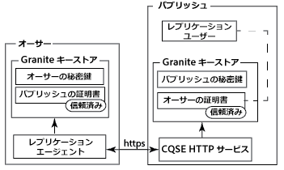
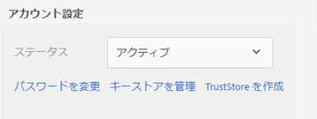
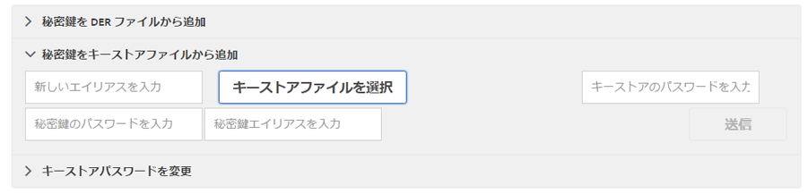
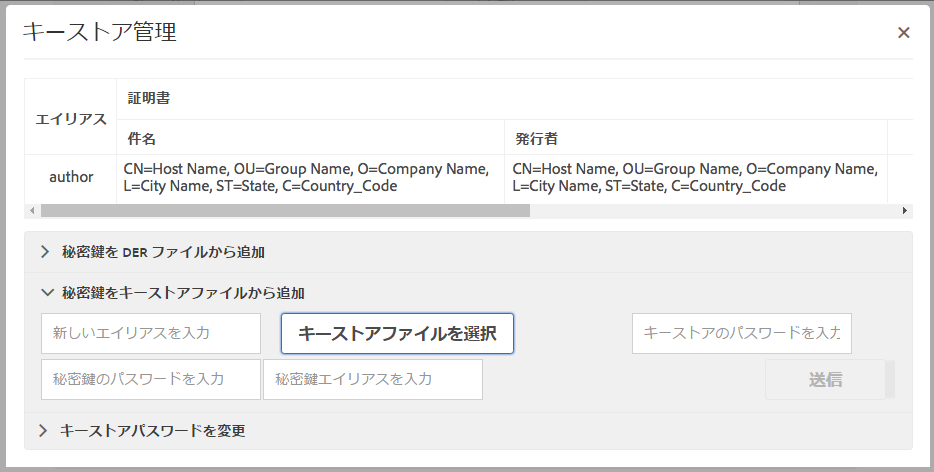
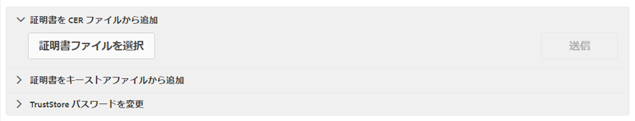
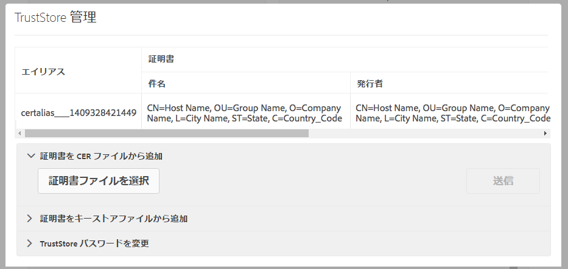
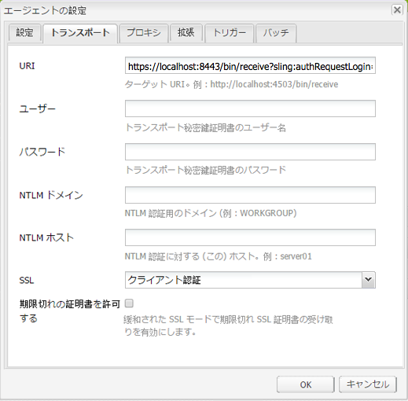

# 相互 SSL を使用したレプリケーション{#replicating-using-mutual-ssl}

オーサーインスタンスのレプリケーションエージェントが相互 SSL（MSSL）を使用してパブリッシュインスタンスに接続するように AEM を設定します。MSSL を使用すると、レプリケーションエージェントとパブリッシュインスタンスの HTTP サービスは証明書を使用して互いに認証されます。

レプリケーション用の MSSL の設定では次の手順を実行します。

1. オーサーインスタンスとパブリッシュインスタンスの秘密鍵および証明書を作成または取得します。
1. オーサーインスタンスとパブリッシュインスタンスに鍵と証明書をインストールします。

   * オーサー：オーサーの秘密鍵とパブリッシュの証明書。
   * パブリッシュ：パブリッシュの秘密鍵とオーサーの証明書。証明書は、レプリケーションエージェントで認証されるユーザーアカウントに関連付けられます。

1. パブリッシュインスタンスで Jetty ベースの HTTP サービスを設定します。
1. レプリケーションエージェントのトランスポートと SSL のプロパティを設定します。



レプリケーションを実行するユーザーアカウントを指定する必要があります。パブリッシュインスタンスに信頼済みオーサー証明書をインストールすると、その証明書がこのユーザーアカウントに関連付けられます。

## MSSL 用の資格情報の取得または作成 {#obtaining-or-creating-credentials-for-mssl}

オーサーインスタンスとパブリッシュインスタンスの秘密鍵および公開証明書が必要です。

* pkcs#12 または JKS 形式の秘密鍵を含める必要があります。
* 証明書は、pkcs#12またはJKS形式で含める必要があります。また、「CER」形式の証明書もGranite Truststoreに追加できます。
* 自己署名証明書または認定された CA が署名した証明書を使用できます。

### JKS 形式 {#jks-format}

JKS 形式の秘密鍵と証明書を生成します。秘密鍵はキーストアファイルに格納され、証明書は TrustStore ファイルに格納されます。これらを作成するには、[Java `keytool`](https://docs.oracle.com/javase/7/docs/technotes/tools/solaris/keytool.html) を使用します。

Java `keytool` を使用して次の手順を実行し、秘密鍵と資格情報を作成します。

1. キーストアで秘密鍵と公開鍵のペアを生成します。
1. 証明書を作成または取得します。

   * 自己署名：キーストアから証明書を書き出します。
   * CA 署名：証明書要求を生成して、CA に送信します。

1. 証明書を TrustStore に読み込みます。

次の手順を使用して、オーサーインスタンスとパブリッシュインスタンスの秘密鍵および自己署名証明書を作成します。コマンドオプションには対応する値を使用してください。

1. コマンドラインウィンドウまたはターミナルを開きます。秘密鍵と公開鍵のペアを作成するには、次のコマンドを入力します。以下の表に示すオプションの値を使用してください。

   ```shell
   keytool -genkeypair -keyalg RSA -validity 3650 -alias alias -keystore keystorename.keystore  -keypass key_password -storepass  store_password -dname "CN=Host Name, OU=Group Name, O=Company Name,L=City Name, S=State, C=Country_ Code"
   ```

   | オプション | オーサー | パブリッシュ |
   |---|---|---|
   | -alias | 作成者 | publish |
   | -keystore | author.keystore | publish.keystore |

1. 証明書を書き出すには、次のコマンドを入力します。以下の表に示すオプションの値を使用してください。

   ```shell
   keytool -exportcert -alias alias -file cert_file -storetype jks -keystore keystore -storepass store_password
   ```

   | オプション | オーサー | パブリッシュ |
   |---|---|---|
   | -alias | 作成者 | publish |
   | -file | author.cer | publish.cer |
   | -keystore | author.keystore | publish.keystore |

### pkcs#12 形式 {#pkcs-format}

pkcs#12 形式の秘密鍵と証明書を生成します。そのためには、[openSSL](https://www.openssl.org/) を使用します。次の手順を使用して、秘密鍵と証明書要求を生成します。証明書を取得するには、秘密鍵を使用して要求に署名するか（自己署名証明書）、CA に要求を送信します。次に、秘密鍵と証明書を格納する pkcs#12 アーカイブを生成します。

1. コマンドラインウィンドウまたはターミナルを開きます。秘密鍵を作成するには、次のコマンドを入力します。以下の表に示すオプションの値を使用してください。

   ```shell
   openssl genrsa -out keyname.key 2048
   ```

   | オプション | オーサー | パブリッシュ |
   |---|---|---|
   | -out | author.key | publish.key |

1. 証明書要求を生成するには、次のコマンドを入力します。以下の表に示すオプションの値を使用してください。

   ```shell
   openssl req -new -key keyname.key -out key_request.csr
   ```

   | オプション | オーサー | パブリッシュ |
   |---|---|---|
   | -key | author.key | publish.key |
   | -out | author_request.csr | publish_request.csr |

   証明書要求に署名するか、CA に要求を送信します。

1. 証明書要求に署名するには、次のコマンドを入力します。以下の表に示すオプションの値を使用してください。

   ```shell
   openssl x509 -req -days 3650 -in key_request.csr -signkey keyname.key -out certificate.cer
   ```

   | オプション | オーサー | パブリッシュ |
   |---|---|---|
   | -signkey | author.key | publish.key |
   | -in | author_request.csr | publish_request.csr |
   | -out | author.cer | publish.cer |

1. 秘密鍵と署名済みの証明書を pkcs#12 ファイルに追加するには、次のコマンドを入力します。以下の表に示すオプションの値を使用してください。

   ```shell
   openssl pkcs12 -keypbe PBE-SHA1-3DES -certpbe PBE-SHA1-3DES -export -in certificate.cer -inkey keyname.key -out pkcs12_archive.pfx -name "alias"
   ```

   | オプション | オーサー | パブリッシュ |
   |---|---|---|
   | -inkey | author.key | publish.key |
   | -out | author.pfx | publish.pfx |
   | -in | author.cer | publish.cer |
   | -name | 作成者 | publish |

## 作成者への秘密鍵と TrustStore のインストール {#install-the-private-key-and-truststore-on-author}

オーサーインスタンスに次の項目をインストールします。

* オーサーインスタンスの秘密鍵
* パブリッシュインスタンスの証明書

次の手順を実行するには、オーサーインスタンスの管理者としてログインする必要があります。

### オーサーの秘密鍵のインストール {#install-the-author-private-key}

1. オーサーインスタンスのユーザー管理ページを開きます（[http://localhost:4502/libs/granite/security/content/useradmin.html](http://localhost:4502/libs/granite/security/content/useradmin.html)）。
1. ユーザーアカウントのプロパティを開くには、ユーザー名をクリックまたはタップします。
1. 「アカウント設定」領域に「キーストアを作成」リンクが表示されたら、そのリンクをクリックします。パスワードを設定して、「OK」をクリックします。
1. 「アカウント設定」領域で、「キーストアを管理」をクリックします。

   

1. 「秘密鍵をキーストアファイルから追加」をクリックします。

   

1. 「キーストアファイルを選択」をクリックし、author.keystore ファイルまたは author.pfx ファイル（pkcs#12 を使用する場合）を探して選択し、「開く」をクリックします。
1. キーストアのエイリアスとパスワードを入力します。秘密鍵のエイリアスとパスワードを入力して、「送信」をクリックします。
1. キーストア管理ダイアログボックスを閉じます。

   

### パブリッシュの証明書のインストール {#install-the-publish-certificate}

1. オーサーインスタンスのユーザー管理ページを開きます（[http://localhost:4502/libs/granite/security/content/useradmin.html](http://localhost:4502/libs/granite/security/content/useradmin.html)）。
1. ユーザーアカウントのプロパティを開くには、ユーザー名をクリックまたはタップします。
1. 「アカウント設定」領域に「TrustStore を作成」リンクが表示されたら、そのリンクをクリックします。TrustStore のパスワードを作成して、「OK」をクリックします。
1. 「アカウント設定」領域で、「TrustStore を管理」をクリックします。
1. 「証明書を CER ファイルから追加」をクリックします。

   

1. 「証明書をユーザーにマップ」チェックボックスをオフにします。「証明書ファイルを選択」をクリックし、publish.cer を選択して、「開く」をクリックします。
1. TrustStore 管理ダイアログボックスを閉じます。

   

## パブリッシュでの秘密鍵と TrustStore のインストール {#install-private-key-and-truststore-on-publish}

パブリッシュインスタンスに次の項目をインストールします。

* パブリッシュインスタンスの秘密鍵
* オーサーインスタンスの証明書。レプリケーションの要求を実行するために使用するユーザーに証明書を関連付けます。

次の手順を実行するには、パブリッシュインスタンスの管理者としてログインする必要があります。

### パブリッシュの秘密鍵のインストール {#install-the-publish-private-key}

1. パブリッシュインスタンスのユーザー管理ページを開きます（[http://localhost:4503/libs/granite/security/content/useradmin.html](http://localhost:4503/libs/granite/security/content/useradmin.html)）。
1. ユーザーアカウントのプロパティを開くには、ユーザー名をクリックまたはタップします。
1. 「アカウント設定」領域に「キーストアを作成」リンクが表示されたら、そのリンクをクリックします。パスワードを設定して、「OK」をクリックします。
1. 「アカウント設定」領域で、「キーストアを管理」をクリックします。
1. 「秘密鍵をキーストアファイルから追加」をクリックします。
1. 「キーストアファイルを選択」をクリックし、publish.keystore ファイルまたは publish.pfx ファイル（pkcs#12 を使用する場合）を探して選択し、「開く」をクリックします。
1. キーストアのエイリアスとパスワードを入力します。秘密鍵のエイリアスとパスワードを入力して、「送信」をクリックします。
1. キーストア管理ダイアログボックスを閉じます。

### オーサーの証明書のインストール {#install-the-author-certificate}

1. パブリッシュインスタンスのユーザー管理ページを開きます（[http://localhost:4503/libs/granite/security/content/useradmin.html](http://localhost:4503/libs/granite/security/content/useradmin.html)）。
1. レプリケーションの要求を実行するために使用するユーザーアカウントを探して、そのユーザー名をクリックまたはタップします。
1. 「アカウント設定」領域に「TrustStore を作成」リンクが表示されたら、そのリンクをクリックします。TrustStore のパスワードを作成して、「OK」をクリックします。
1. 「アカウント設定」領域で、「TrustStore を管理」をクリックします。
1. 「証明書を CER ファイルから追加」をクリックします。
1. 「証明書をユーザーにマップ」チェックボックスがオンになっていることを確認します。「証明書ファイルを選択」をクリックし、author.cer を選択して、「開く」をクリックします。
1. 「送信」をクリックして、TrustStore 管理ダイアログボックスを閉じます。

## パブリッシュでの HTTP サービスの設定 {#configure-the-http-service-on-publish}

Configure the properties of the Apache Felix Jetty Based HTTP Service on the publish instance so that it uses HTTPS while accessing Granite Keystore. The PID of the service is `org.apache.felix.http`.

次の表は、Web コンソールを使用する場合に設定する必要のある OSGi のプロパティを示しています。

| Web コンソールでのプロパティ名 | OSGi のプロパティ名 | 値 |
|---|---|---|
| Enable HTTPS | org.apache.felix.https.enable | true |
| Enable HTTPS To Use Granite KeyStore | org.apache.felix.https.use.granite.keystore | true |
| HTTPS Port | org.osgi.service.http.port.secure | 8443（またはその他の必要なポート） |
| Client Certificate | org.apache.felix.https.clientcertificate | Client Certificate Wanted（クライアント証明書が必要） |

## オーサーでのレプリケーションエージェントの設定 {#configure-the-replication-agent-on-author}

パブリッシュインスタンスへの接続時に HTTPS プロトコルを使用するように、オーサーインスタンスでレプリケーションエージェントを設定します。レプリケーションエージェントの設定について詳しくは、[レプリケーションエージェントの設定](/help/sites-deploying/replication.md#configuring-your-replication-agents)を参照してください。

MSSL を有効にするには、次の表に示すように、「トランスポート」タブでプロパティを設定します。

<table>
 <tbody>
  <tr>
   <th>プロパティ</th>
   <th>値</th>
  </tr>
  <tr>
   <td>URI</td>
   <td><p>https://server_name:SSL_port/bin/receive?sling:authRequestLogin=1</p> <p>次に例を示します。</p> <p>http://localhost:8443/bin/receive?sling:authRequestLogin=1</p> </td>
  </tr>
  <tr>
   <td>User</td>
   <td>値なし</td>
  </tr>
  <tr>
   <td>パスワード</td>
   <td>値なし</td>
  </tr>
  <tr>
   <td>SSL</td>
   <td>クライアント認証</td>
  </tr>
 </tbody>
</table>



レプリケーションエージェントの設定が完了したら、接続をテストして、MSSL が正しく設定されているかどうかを確認します。

```xml
29.08.2014 14:02:46 - Create new HttpClient for Default Agent
29.08.2014 14:02:46 - * HTTP Version: 1.1
29.08.2014 14:02:46 - * Using Client Auth SSL configuration *
29.08.2014 14:02:46 - adding header: Action:Test
29.08.2014 14:02:46 - adding header: Path:/content
29.08.2014 14:02:46 - adding header: Handle:/content
29.08.2014 14:02:46 - deserialize content for delivery
29.08.2014 14:02:46 - No message body: Content ReplicationContent.VOID is empty
29.08.2014 14:02:46 - Sending POST request to http://localhost:8443/bin/receive?sling:authRequestLogin=1
29.08.2014 14:02:46 - sent. Response: 200 OK
29.08.2014 14:02:46 - ------------------------------------------------
29.08.2014 14:02:46 - Sending message to localhost:8443
29.08.2014 14:02:46 - >> POST /bin/receive HTTP/1.0
29.08.2014 14:02:46 - >> Action: Test
29.08.2014 14:02:46 - >> Path: /content
29.08.2014 14:02:46 - >> Handle: /content
29.08.2014 14:02:46 - >> Referer: about:blank
29.08.2014 14:02:46 - >> Content-Length: 0
29.08.2014 14:02:46 - >> Content-Type: application/octet-stream
29.08.2014 14:02:46 - --
29.08.2014 14:02:46 - << HTTP/1.1 200 OK
29.08.2014 14:02:46 - << Connection: Keep-Alive
29.08.2014 14:02:46 - << Server: Day-Servlet-Engine/4.1.64
29.08.2014 14:02:46 - << Content-Type: text/plain;charset=utf-8
29.08.2014 14:02:46 - << Content-Length: 26
29.08.2014 14:02:46 - << Date: Fri, 29 Aug 2014 18:02:46 GMT
29.08.2014 14:02:46 - << Set-Cookie: login-token=3529326c-1500-4888-a4a3-93d299726f28%3ac8be86c6-04bb-4d18-80d6-91278e08d720_98797d969258a669%3acrx.default; Path=/; HttpOnly; Secure
29.08.2014 14:02:46 - << Set-Cookie: cq-authoring-mode=CLASSIC; Path=/; Secure
29.08.2014 14:02:46 - <<
29.08.2014 14:02:46 - << R
29.08.2014 14:02:46 - << eplicationAction TEST ok.
29.08.2014 14:02:46 - Message sent.
29.08.2014 14:02:46 - ------------------------------------------------
29.08.2014 14:02:46 - Replication (TEST) of /content successful.
Replication test succeeded
```

