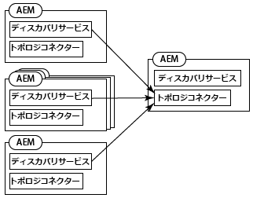
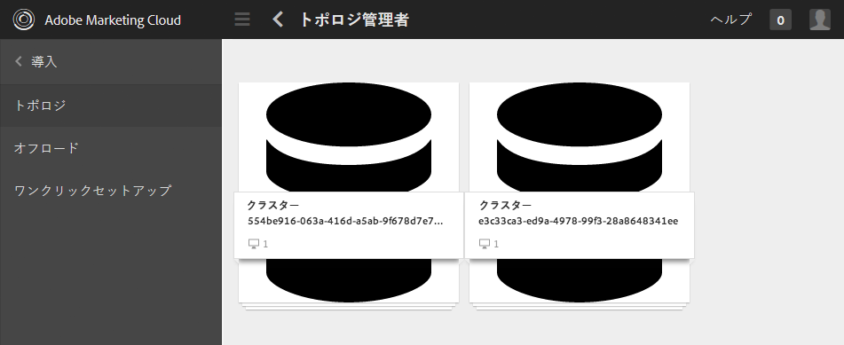
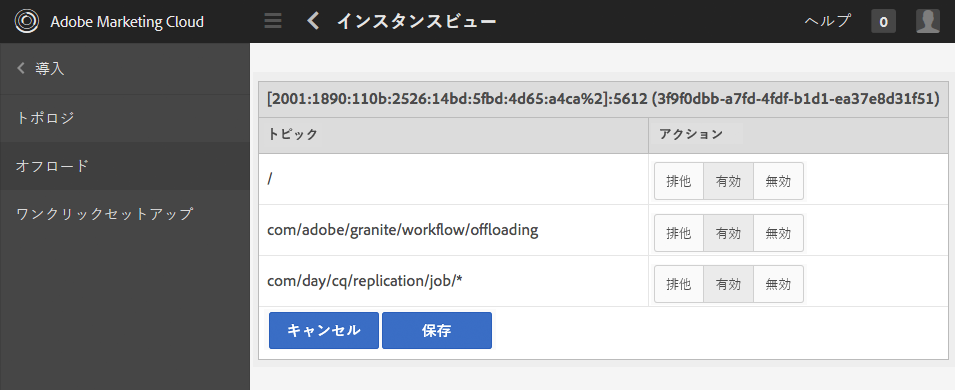
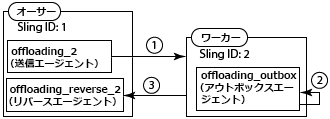
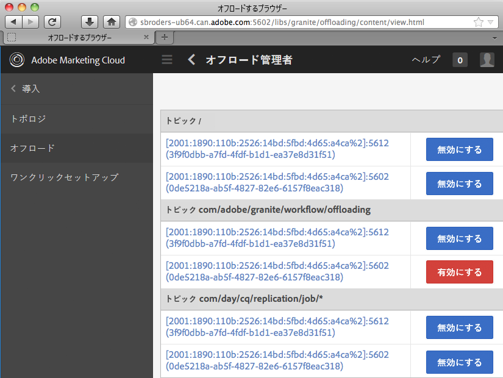

# ジョブのオフロード{#offloading-jobs}

## 概要 {#introduction}

オフロードによって、トポロジ内の Experience Manager インスタンス間で処理タスクが配布されます。オフロードでは、特定の Experience Manager インスタンスを使用して、特定のタイプの処理を実行できます。処理を特化することによって、利用可能なサーバーリソースを最大限に使用できます。

Offloading is based on the [Apache Sling Discovery](https://sling.apache.org/documentation/bundles/discovery-api-and-impl.html) and Sling JobManager features. To use offloading, you add Experience Manager clusters to a topology and identify the job topics that the cluster process. Clusters are comprised of one or more Experience Manager instances, so that a single instance is considered to be a cluster.

トポロジへのインスタンスの追加について詳しくは、[トポロジの管理](/help/sites-deploying/offloading.md#administering-topologies)を参照してください。

### ジョブ配布 {#job-distribution}

Sling JobManager と JobConsumer を使用して、トポロジ内で処理されるジョブを作成できます。

* JobManager：特定のトピックのジョブを作成するサービス。
* JobConsumer：1 つ以上のトピックのジョブを実行するサービス。同じトピックに対して複数の JobConsumer サービスを登録できます。

JobManager でジョブが作成されると、オフロードフレームワークによって、ジョブを実行するトポロジ内の Experience Manager クラスターが選択されます。

* クラスターには、ジョブトピックに対して登録された JobConsumer を実行している 1 つ以上のインスタンスが含まれている必要があります。
* トピックは、クラスター内の少なくとも 1 つのインスタンスに対して有効化されている必要があります。

ジョブ配布の調整について詳しくは、[トピック使用の設定](/help/sites-deploying/offloading.md#configuring-topic-consumption)を参照してください。

オフロードフレームワークによってジョブを実行するクラスターが選択される際に、そのクラスターが複数のインスタンスで構成されていると、Sling 配布によってクラスター内のどのインスタンスがジョブを実行するかが決定されます。

### ジョブペイロード {#job-payloads}

オフロードフレームワークでは、ジョブをリポジトリ内のリソースと関連付けるジョブペイロードがサポートされています。ジョブペイロードは、ジョブがリソースを処理するために作成されたり、別のコンピューターにオフロードされたりする場合に役立ちます。

ジョブの作成時に、ペイロードはそのジョブを作成するインスタンスにのみ配置されることが保証されます。ジョブのオフロード時に、レプリケーションエージェントによって、ペイロードが最終的にジョブを使用するインスタンスで作成されます。ジョブ実行が完了すると、リバースレプリケーションによって、ペイロードのコピーがジョブを作成したインスタンスに戻されます。

## トポロジの管理 {#administering-topologies}

トポロジは、オフロードに参加する疎結合された Experience Manager クラスターです。クラスターは 1 つ以上の Experience Manager サーバーインスタンスで構成されます（単一のインスタンスがクラスターと見なされます）。

各 Experience Manager インスタンスによって、以下のオフロード関連サービスが実行されます。

* Discovery Service：トポロジに参加するために Topology Connector に要求を送信します。
* Topology Connector：参加要求を受信し、各要求を承認または拒否します。

トポロジのすべてのメンバーの Discovery Service は、メンバーのうちの 1 つの Topology Connector を参照しています。以下の節では、このメンバーをルートメンバーと呼びます。

トポロジ内の各クラスターには、リーダーと認識されるインスタンスが含まれています。クラスターリーダーは、クラスターの他のメンバーの代わりにトポロジとやり取りします。リーダーがクラスターから外れると、クラスターの新しいリーダーが自動的に選択されます。

### トポロジの表示 {#viewing-the-topology}

トポロジブラウザーを使用して、Experience Manager インスタンスが参加しているトポロジの状態を調べます。トポロジブラウザーには、トポロジのクラスターおよびインスタンスが表示されます。

クラスターごとに、クラスターメンバーのリストが表示されます。このリストには、各メンバーがクラスターに参加した順序と、どのメンバーがリーダーかが示されています。現在プロパティによって、現在管理しているインスタンスが示されます。

クラスターの各インスタンスについて、複数のトポロジ関連プロパティを確認できます。

* インスタンスの JobConsumer のトピックのホワイトリスト
* トポロジとの接続用に公開されるエンドポイント
* インスタンスがどのジョブトピックについてオフロード用に登録されているか
* インスタンスによって処理されるジョブトピック

1. タッチ UI を使用して、「ツール」タブをクリックします（[http://localhost:4502/tools.html](http://localhost:4502/tools.html)）。
1. Granite の操作エリアで、「オフロードするブラウザー」をクリックします。
1. ナビゲーションパネルで、「トポロジブラウザー」をクリックします。

   トポロジに参加しているクラスターが表示されます。

   

1. クラスターをクリックして、クラスターのインスタンスとそれらの ID、現在ステータスおよびリーダーステータスのリストを表示します。
1. インスタンス ID をクリックして、詳細なプロパティを表示します。

Web コンソールを使用してトポロジ情報を表示することもできます。コンソールには、トポロジのクラスターに関するその他の情報が表示されます。

* どのインスタンスがローカルインスタンスであるか
* このインスタンスがトポロジに接続するために使用する Topology Connector サービス（送信）と、このインスタンスに接続するサービス（受信）
* トポロジおよびインスタンスのプロパティの変更履歴

以下の手順を使用して、Web コンソールのトポロジ管理ページを開きます。

1. ブラウザーで Web コンソールを開きます（[http://localhost:4502/system/console](http://localhost:4502/system/console)）。
1. Main／Topology Management をクリックします。

   

### トポロジメンバーシップの設定 {#configuring-topology-membership}

Experience Manager インスタンスとトポロジとのインタラクション方法を制御するために、Apache Sling のリソースベースの Discovery Service が各インスタンスで実行されます。

Discovery Service によって、トポロジとの接続を確立および維持するために、定期的な POST 要求（ハートビート）が Topology Connector サービスに送信されます。Topology Connector サービスでは、トポロジへの参加が許可される IP アドレスまたはホスト名のホワイトリストが維持されます。

* インスタンスをトポロジに参加させるには、ルートメンバーの Topology Connector サービスの URL を指定します。
* インスタンスがトポロジに参加できるようにするには、ルートメンバーの Topology Connector サービスのホワイトリストにインスタンスを追加します。

Web コンソールまたは sling:OsgiConfig ノードを使用して、org.apache.sling.discovery.impt.Config サービスの以下のプロパティを設定します。

<table>
 <tbody>
  <tr>
   <th>プロパティ名</th>
   <th>OSGi 名</th>
   <th>説明</th>
   <th>デフォルト値</th>
  </tr>
  <tr>
   <td>ハートビートタイムアウト（秒）</td>
   <td>heartbeatTimeout</td>
   <td>ターゲットのインスタンスを使用不可と見なすまでにハートビート応答を待機する時間（秒単位）。 </td>
   <td>20</td>
  </tr>
  <tr>
   <td>ハートビート間隔（秒）</td>
   <td>heartbeatInterval</td>
   <td>ハートビート間の時間（秒単位）。</td>
   <td>15</td>
  </tr>
  <tr>
   <td>最小イベント遅延（秒）</td>
   <td>minEventDelay</td>
   <td>
トポロジに変更が発生した場合、TOPOLOGY_CHANGINGからTOPOLOGY_CHANGEDへの状態の変更を遅延する時間です。状態がTOPOLOGY_CHANGINGの場合に発生する各変更は、この時間だけ遅延を増やします。
 
この遅延によって、リスナーに大量のイベントが送られるのを防ぎます。 
 
遅延を使用しない場合は、0 または負の数を指定します。
 </td>
   <td>3</td>
  </tr>
  <tr>
   <td>Topology Connector URL</td>
   <td>topologyConnectorUrls</td>
   <td>ハートビートメッセージを送信する Topology Connector サービスの URL。</td>
   <td>http://localhost:4502/libs/sling/topology/connector</td>
  </tr>
  <tr>
   <td>Topology Connector ホワイトリスト</td>
   <td>topologyConnectorWhitelist</td>
   <td>ローカル Topology Connector サービスによってトポロジ内で許可される IP アドレスまたはホスト名のリスト。 </td>
   <td>
localhost
 
127.0.0.1
 </td>
  </tr>
  <tr>
   <td>リポジトリ記述子名</td>
   <td>leaderElectionRepositoryDescriptor</td>
   <td> </td>
   <td>&lt;値なし&gt;</td>
  </tr>
 </tbody>
</table>

以下の手順を使用して、CQ インスタンスをトポロジのルートメンバーに接続します。この手順では、インスタンスがルートトポロジメンバーの Topology Connector URL を指すようにします。この手順をトポロジのすべてのメンバーで実行します。

1. ブラウザーで Web コンソールを開きます（[http://localhost:4502/system/console](http://localhost:4502/system/console)）。
1. Main／Topology Management をクリックします。
1. 「 Configure Discovery Service」をクリックします。
1. Topology Connector URL プロパティに項目を追加し、ルートトポロジメンバーの Topology Connector サービスの URL を指定します。URLの形式はhttps://rootservername:4502/libs/sling/topology/connectorです。

トポロジのルートメンバーで以下の手順を実行します。この手順では、その Discovery Service ホワイトリストに他のトポロジメンバーの名前を追加します。

1. ブラウザーで Web コンソールを開きます（[http://localhost:4502/system/console](http://localhost:4502/system/console)）。
1. Main／Topology Management をクリックします。
1. 「 Configure Discovery Service」をクリックします。
1. トポロジの各メンバーについて、Topology Connector ホワイトリストプロパティに項目を追加し、トポロジメンバーのホスト名または IP アドレスを指定します。

## トピック使用の設定 {#configuring-topic-consumption}

オフロードするブラウザーを使用して、トポロジ内の Experience Manager インスタンスのトピック使用を設定します。インスタンスごとに、使用するトピックを指定できます。例えば、1 つのインスタンスのみが特定のタイプのトピックを使用するようにトポロジを設定するには、その 1 つのインスタンスを除くすべてのインスタンスでそのトピックを無効にします。

ジョブは、ラウンドロビンロジックを使用して、関連するトピックが有効なインスタンス間で配布されます。

1. タッチ UI を使用して、「ツール」タブをクリックします（[http://localhost:4502/tools.html](http://localhost:4502/tools.html)）。
1. Granite の操作エリアで、「オフロードするブラウザー」をクリックします。
1. ナビゲーションパネルで、「オフロードするブラウザー」をクリックします。

   オフロードトピックと、トピックを使用できるサーバーインスタンスが表示されます。

   

1. インスタンスのトピック使用を無効にするには、トピック名の下で、インスタンスの横の「無効にする」をクリックします。
1. あるインスタンスのすべてのトピック使用を設定するには、トピックの下にあるインスタンス識別子をクリックします。

   

1. トピックの横にある以下のボタンのいずれかをクリックし、インスタンスの使用動作を設定して、「保存」をクリックします。

   * 有効：このインスタンスはこのトピックのジョブを使用します。
   * 無効：このインスタンスはこのトピックのジョブを使用しません。
   * 排他：このインスタンスはこのトピックのみのジョブを使用します。
   **注意：**&#x200B;あるトピックに対して「排他」を選択すると、他のすべてのトピックは自動的に「無効」に設定されます。

### インストール済みの JobConsumer {#installed-job-consumers}

複数の JobConsumer 実装が Experience Manager とともにインストールされます。これらの JobConsumer が登録されているトピックが、オフロードするブラウザーに表示されます。表示されるその他のトピックは、カスタム JobConsumer で登録されたトピックです。以下の表に、デフォルトの JobConsumer を示します。

| ジョブトピック | サービス PID | 説明 |
|---|---|---|
| ／ | org.apache.sling.event.impl.jobs.deprecated.EventAdminBridge | Apache Sling とともにインストールされます。下位互換性のために、OSGi イベント管理によって生成されたジョブを処理します。 |
| com/day/cq/replication/job/&amp;ast; | com.day.cq.replication.impl.AgentManagerImpl | ジョブペイロードをレプリケートするレプリケーションエージェント。 |
| com/adobe/granite/workflow/offloading | com.adobe.granite.workflow.core.offloading.WorkflowOffloadingJobConsumer | [!UICONTROL DAM Update Asset Offloaderワークフローで生成されるジョブを処理します] 。 |

### インスタンスのトピックの無効化と有効化 {#disabling-and-enabling-topics-for-an-instance}

Apache Sling JobConsumer Manager サービスによって、トピックのホワイトリストおよびブラックリストのプロパティが提供されます。これらのプロパティを設定して、Experience Manager インスタンスでの特定のトピックの処理を有効または無効にします。

**注意：**&#x200B;インスタンスがトポロジに属している場合は、トポロジ内の任意のコンピューターでオフロードするブラウザーを使用して、トピックを有効または無効にすることもできます。

The logic that creates the list of enabled topics first allows all of the topics that are in the whitelist, and then removes topics that are on the blacklist.By default, all topics are enabled (the whitelist value is `*`) and no topics are disabled (the blacklist has no value).

Web コンソールまたは `sling:OsgiConfig` ノードを使用して、以下のプロパティを設定します。`sling:OsgiConfig` ノードの場合、JobConsumer Manager サービスの PID は、org.apache.sling.event.impl.jobs.JobConsumerManager です。

| Web コンソールでのプロパティ名 | OSGi ID | 説明 |
|---|---|---|
| トピックホワイトリスト | job.consumermanager.whitelist | ローカル JobManager サービスによって処理されるトピックのリスト。&amp;ast；のデフォルト値を指定すると、すべてのトピックが登録済みのTopicConsumerサービスに送信されます。 |
| トピックブラックリスト | job.consumermanager.blacklist | ローカル JobManager サービスによって処理されないトピックのリスト。 |

## オフロードのレプリケーションエージェントの作成 {#creating-replication-agents-for-offloading}

オフロードフレームワークでは、作成者とワーカー間のリソースの転送にレプリケーションが使用されます。インスタンスがトポロジに参加すると、オフロードフレームワークによってレプリケーションエージェントが自動的に作成されます。エージェントはデフォルト値を使用して作成されます。エージェントが認証に使用するパスワードを手動で変更する必要があります。

>[!CAUTION]
>
>自動的に生成されるレプリケーションエージェントには既知の問題があるので、新しいレプリケーションエージェントを手動で作成する必要があります。オフロードのエージェントを作成する前に、[自動生成されたレプリケーションエージェントの使用に関する問題](/help/sites-deploying/offloading.md#problems-using-the-automatically-generated-replication-agents)の手順に従ってください。

オフロードのためにインスタンス間でジョブペイロードを転送するレプリケーションエージェントを作成します。以下の図に、作成者からワーカーインスタンスへのオフロードに必要なエージェントを示します。作成者のSling IDは1、ワーカーインスタンスのSling IDは2です。

この設定では、以下の 3 つのエージェントが必要です。

1. ワーカーインスタンスへレプリケートする、オーサーインスタンス上の送信エージェント
1. ワーカーインスタンス上のアウトボックスから引き出す、オーサーインスタンス上のリバースエージェント
1. ワーカーインスタンス上のアウトボックスエージェント

このレプリケーションスキームは、オーサーインスタンスとパブリッシュインスタンスの間で使用されるものと同様です。ただし、オフロードの場合は、関係するすべてのインスタンスはオーサーインスタンスです。

>[!NOTE]
>
>オフロードフレームワークでは、トポロジを使用してオフロードインスタンスの IP アドレスが取得されます。次に、これらの IP アドレスに基づいて、レプリケーションエージェントが自動的に作成されます。オフロードインスタンスの IP アドレスが後で変更された場合、変更はインスタンスの再起動後にトポロジ上で自動的に伝播されます。ただし、オフロードフレームワークでは、新しい IP アドレスを反映するようにレプリケーションエージェントが自動的に更新されることはありません。この状況を回避するには、トポロジ内のすべてのインスタンスに固定 IP アドレスを使用します。

### オフロードのレプリケーションエージェントの命名 {#naming-the-replication-agents-for-offloading}

Use a specific format for the ***Name*** property of the replication agents so that the offloading framework automatically uses the correct agent for specific worker instances.

**オーサーインスタンスの送信エージェントの命名：**

`offloading_<slingid>`は、ワーカ `<slingid>` ーインスタンスのSling IDです。

例: `offloading_f5c8494a-4220-49b8-b079-360a72f71559`

**オーサーインスタンスのリバースエージェントの命名：**

`offloading_reverse_<slingid>`は、ワーカ `<slingid>` ーインスタンスのSling IDです。

例: `offloading_reverse_f5c8494a-4220-49b8-b079-360a72f71559`

**ワーカーインスタンスのアウトボックスの命名：**

`offloading_outbox`

### 送信エージェントの作成 {#creating-the-outgoing-agent}

1. Create a **Replication Agent** on author. (See the [documention for replication agents](/help/sites-deploying/replication.md)). Specify any **Title**. The **Name** must follow the naming convention.
1. 以下のプロパティを使用してエージェントを作成します。

   | プロパティ | 値 |
   |---|---|
   | 設定／シリアル化の種類 | デフォルト |
   | トランスポート／トランスポート URI | https://*`<ip of target instance>`*:*`<port>`*`/bin/receive?sling:authRequestLogin=1` |
   | トランスポート／トランスポートユーザー | ターゲットインスタンスのレプリケーションユーザー |
   | トランスポート／トランスポートパスワード | ターゲットインスタンスのレプリケーションユーザーパスワード |
   | 拡張／HTTP メソッド | POST |
   | トリガー／デフォルトを無視 | True |

### リバースエージェントの作成 {#creating-the-reverse-agent}

1. Create a **Reverse Replication Agent** on author. (See the [documention for replication agents](/help/sites-deploying/replication.md).) Specify any **Title**. The **Name** must follow the naming convention.
1. 以下のプロパティを使用してエージェントを作成します。

   | プロパティ | 値 |
   |---|---|
   | 設定／シリアル化の種類 | デフォルト |
   | トランスポート／トランスポート URI | https://*`<ip of target instance>`*:*`<port>`*`/bin/receive?sling:authRequestLogin=1` |
   | トランスポート／トランスポートユーザー | ターゲットインスタンスのレプリケーションユーザー |
   | トランスポート／トランスポートパスワード | ターゲットインスタンスのレプリケーションユーザーパスワード |
   | 拡張／HTTP メソッド | GET |

### アウトボックスエージェントの作成 {#creating-the-outbox-agent}

1. Create a **Replication Agent** on the worker instance. (See the [documention for replication agents](/help/sites-deploying/replication.md).) Specify any **Title**. The **Name** must be `offloading_outbox`.
1. 以下のプロパティを使用してエージェントを作成します。

   | プロパティ | 値 |
   |---|---|
   | 設定／シリアル化の種類 | デフォルト |
   | トランスポート／トランスポート URI | repo://var/replication/outbox |
   | トリガー／デフォルトを無視 | True |

### Sling ID の検索 {#finding-the-sling-id}

以下のいずれかの方法を使用して、Experience Manager インスタンスの Sling ID を取得します。

* Open the Web Console and, in the Sling Settings, find the value of the Sling ID property ([http://localhost:4502/system/console/status-slingsettings](http://localhost:4502/system/console/status-slingsettings)). This method is usefull if the instance is not yet part of the topology.
* インスタンスが既にトポロジの一部である場合は、トポロジブラウザーを使用します。

## DAM アセットの処理のオフロード {#offloading-the-processing-of-dam-assets}

DAM で追加または更新されたアセットのバックグラウンド処理が特定のインスタンスによって実行されるように、トポロジのインスタンスを設定します。

By default, Experience Manager executes the [!UICONTROL DAM Update Asset] workflow when a DAM asset changes or one is added to DAM. Change the default behavior so that Experience Manager instead executes the [!UICONTROL DAM Update Asset Offloader] workflow. This workflow generates a JobManager job that has a topic of `com/adobe/granite/workflow/offloading`. Then, configure the topology so that the job is offloaded to a dedicated worker.

>[!CAUTION]
>
>ワークフローのオフロードで使用する場合、ワークフローは一時的ではありません。 For example, the [!UICONTROL DAM Update Asset] workflow must not be transient when used for asset offloading. To set/unset the transient flag on a workflow, see [Transient Workflows](/help/assets/performance-tuning-guidelines.md#workflows).

以下の手順では、次の特徴を持つオフロードトポロジを想定しています。

* 1 つ以上の Experience Manager インスタンスがオーサーインスタンスであり、ユーザーは DAM アセットの追加または更新のためにこのインスタンスとやり取りします。
* ユーザーは、DAM アセットを処理する 1 つ以上の Experience Manager インスタンスと直接的にはやり取りしません。これらのインスタンスは、DAM アセットのバックグラウンド処理専用です。

1. 各 Experience Manager インスタンスで、ルート Topology Connector を指すように Discovery Service を設定します（[トポロジメンバーシップの設定](#title4)を参照）。
1. 接続するインスタンスをホワイトリストが含まれるようにルート Topology Connector を設定します。
1. Open Offloading Browser and disable the `com/adobe/granite/workflow/offloading` topic on the instances with which users interact to upload or change DAM assets.

   

1. On each instance that users interact with to upload or change DAM assets, configure workflow launchers to use the [!UICONTROL DAM Update Asset Offloading] workflow:

   1. ワークフローコンソールを開きます。
   1. 「ランチャー」タブをクリックします。
   1. [!UICONTROL DAM Update Assetワークフローを実行する2つのランチャー設定を見つけます] 。1つのランチャー設定イベントタイプは「作成されたノード」、もう1つのタイプは「変更されたノード」です。
   1. Change both event types so that they execute the [!UICONTROL DAM Update Asset Offloading] workflow. (For information about launcher configurations, see [Starting Workflows When Nodes Change](/help/sites-administering/workflows-starting.md).)

1. On the instances that perform the background processing of DAM assets, disable the workflow launchers that execute the [!UICONTROL DAM Update Asset] workflow.

## 参考情報 {#further-reading}

このページで説明した詳細以外に、以下を参照することもできます。

* For information about using Java APIs to create jobs and job consumers, see [Creating and Consuming Jobs for Offloading](/help/sites-developing/dev-offloading.md).
