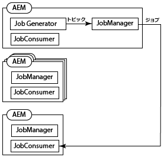
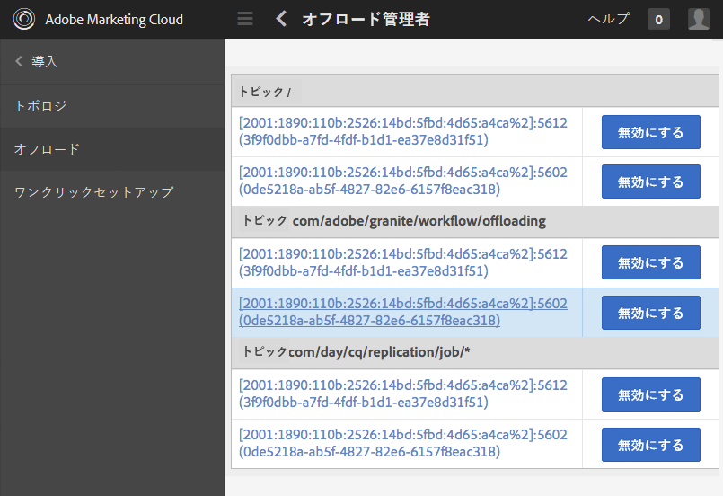

# ジョブのオフロード{#offloading-jobs}

## はじめに {#introduction}

オフロードによって、トポロジ内の Experience Manager インスタンス間で処理タスクが配布されます。オフロードを使用すると、特定のExperience Managerインスタンスを使用して特定のタイプの処理を実行できます。 特殊な処理により、使用可能なサーバーリソースの使用を最大限に活用できます。

オフロードは、[Apache Sling Discovery](https://sling.apache.org/documentation/bundles/discovery-api-and-impl.html) および Sling JobManager の機能に基づきます。オフロードを使用するには、Experience Manager クラスターをトポロジに追加し、クラスターで処理するジョブトピックを特定します。クラスターは 1 つ以上の Experience Manager インスタンスで構成され、単一のインスタンスがクラスターと見なされます。

トポロジへのインスタンスの追加について詳しくは、[トポロジの管理](/help/sites-deploying/offloading.md#administering-topologies)を参照してください。

### ジョブ配布 {#job-distribution}

Sling JobManager と JobConsumer を使用して、トポロジ内で処理されるジョブを作成できます。

* JobManager：特定のトピックのジョブを作成するサービス。
* JobConsumer:1 つ以上のトピックのジョブを実行するサービスです。 同じトピックに対して複数の JobConsumer サービスを登録できます。

JobManager がジョブを作成すると、オフロードフレームワークは、トポロジ内のExperience Managerクラスターを選択してジョブを実行します。

* クラスターには、ジョブトピックに登録された JobConsumer を実行している 1 つ以上のインスタンスを含める必要があります。
* このトピックは、クラスター内の 1 つ以上のインスタンスに対して有効にする必要があります。

ジョブ配布の調整について詳しくは、[トピック使用の設定](/help/sites-deploying/offloading.md#configuring-topic-consumption)を参照してください。

オフロードフレームワークによってジョブを実行するクラスターが選択される際に、そのクラスターが複数のインスタンスで構成されていると、Sling 配布によってクラスター内のどのインスタンスがジョブを実行するかが決定されます。

### ジョブペイロード {#job-payloads}

オフロードフレームワークは、ジョブをリポジトリ内のリソースに関連付けるジョブペイロードをサポートします。 ジョブペイロードは、ジョブがリソースを処理するために作成され、ジョブが別のコンピュータにオフロードされる場合に役立ちます。

ジョブの作成時に、ペイロードはジョブを作成するインスタンス上にのみ配置されることが保証されます。 ジョブのオフロード時に、レプリケーションエージェントは、最終的にジョブを使用するインスタンス上にペイロードが作成されることを確認します。 ジョブの実行が完了すると、リバースレプリケーションによって、ペイロードがジョブを作成したインスタンスにコピーされ直されます。

## トポロジの管理 {#administering-topologies}

トポロジは、オフロードに参加している疎結合Experience Managerクラスタです。 クラスタは、1 つ以上のExperience Managerサーバーインスタンスで構成されます（1 つのインスタンスがクラスターと見なされます）。

各Experience Managerインスタンスは、次のオフロード関連サービスを実行します。

* Discovery Service：トポロジに参加するための要求を Topology Connector に送信します。
* Topology Connector：結合リクエストを受け取り、各リクエストを受け入れるか拒否します。

トポロジのすべてのメンバーの Discovery Service は、いずれかのメンバーの Topology Connector を指します。 以降のセクションでは、このメンバーをルートメンバーと呼びます。

トポロジ内の各クラスターには、リーダーとして認識されるインスタンスが含まれています。 クラスターリーダーは、クラスターの他のメンバーの代わりに、トポロジとやり取りします。 引出線がクラスタから離れると、クラスタの新しい引出線が自動的に選択されます。

### トポロジの表示 {#viewing-the-topology}

トポロジブラウザーを使用して、Experience Managerインスタンスが参加しているトポロジの状態を調べます。 トポロジブラウザーには、トポロジのクラスターとインスタンスが表示されます。

クラスターごとに、クラスターメンバーのリストが表示されます。このリストには、各メンバーがクラスターに参加した順序と、どのメンバーがリーダーかが示されています。現在プロパティによって、現在管理しているインスタンスが示されます。

クラスターの各インスタンスについて、複数のトポロジ関連プロパティを確認できます。

* インスタンスのジョブコンシューマーが担当するトピックの許可リスト。
* トポロジとの接続用に公開されるエンドポイント。
* インスタンスがオフロード用に登録されているジョブトピック。
* インスタンスが処理するジョブトピック。

1. タッチ UI を使用して、「ツール」タブをクリックします。 ([http://localhost:4502/tools.html](http://localhost:4502/tools.html))
1. Granite の操作領域で、「ブラウザーのオフロード」をクリックします。
1. ナビゲーションパネルで、[ トポロジブラウザ ] をクリックします。

   トポロジに参加しているクラスターが表示されます。

   

1. クラスターをクリックすると、クラスター内のインスタンスと、その ID、現在のステータス、リーダーのステータスのリストが表示されます。
1. インスタンス ID をクリックすると、詳細なプロパティが表示されます。

また、Web コンソールを使用してトポロジ情報を表示することもできます。 コンソールには、トポロジクラスターに関する詳細情報が表示されます。

* ローカルインスタンスを表すインスタンス。
* このインスタンスがトポロジへの接続に使用する Topology Connector サービス（送信）と、このインスタンスに接続するサービス（受信）です。
* トポロジおよびインスタンスのプロパティの変更履歴

次の手順を実行して、Web コンソールのトポロジ管理ページを開きます。

1. ブラウザーで Web コンソールを開きます。 ([http://localhost:4502/system/console](http://localhost:4502/system/console))
1. [Main] > [Topology Management] の順にクリックします。

   

### トポロジメンバーシップの設定 {#configuring-topology-membership}

Apache Sling Resource-Based Discovery Service は各インスタンスで実行され、Experience Managerインスタンスとトポロジとのやり取りを制御します。

Discovery Service は、トポロジとの接続を確立し、維持するために、定期的なPOST要求（ハートビート）を Topology Connector サービスに送信します。 Topology Connector サービスでは、トポロジへの参加が許可される IP アドレスまたはホスト名の許可リストを維持管理します。

* インスタンスをトポロジに参加させるには、ルートメンバーの Topology Connector サービスの URL を指定します。
* インスタンスがトポロジに参加できるようにするには、インスタンスをルートメンバーの Topology Connector サービスの許可リストに追加します。

Web コンソールまたは sling:OsgiConfig ノードを使用して、 org.apache.sling.discovery.impt.Config サービスの次のプロパティを設定します。

<table>
 <tbody>
  <tr>
   <th>プロパティ名</th>
   <th>OSGi 名</th>
   <th>説明</th>
   <th>デフォルト値</th>
  </tr>
  <tr>
   <td>ハートビートタイムアウト（秒）</td>
   <td>heartbeatTimeout</td>
   <td>ターゲットのインスタンスを使用不可と見なすまでにハートビート応答を待機する時間（秒単位）。 </td>
   <td>20</td>
  </tr>
  <tr>
   <td>ハートビート間隔（秒）</td>
   <td>heartbeatInterval</td>
   <td>ハートビート間の時間（秒）。</td>
   <td>15</td>
  </tr>
  <tr>
   <td>最小イベント遅延（秒）</td>
   <td>minEventDelay</td>
   <td>
トポロジに対して変更が発生したときに、TOPOLOGY_CHANGING から TOPOLOGY_CHANGED への状態の変更を遅延させる時間。状態が TOPOLOGY_CHANGING のときに発生する変更につき、この時間だけ遅延が大きくなります。
 
この遅延によって、リスナーに大量のイベントが送られるのを防ぎます。 
 
遅延を使用しない場合は、0 または負の数を指定します。
 </td>
   <td>3</td>
  </tr>
  <tr>
   <td>トポロジコネクタの URL</td>
   <td>topologyConnectorUrls</td>
   <td>ハートビートメッセージを送信する Topology Connector サービスの URL です。</td>
   <td>http://localhost:4502/libs/sling/topology/connector</td>
  </tr>
  <tr>
   <td>Topology Connector 許可リスト</td>
   <td>topologyConnectorWhitelist</td>
   <td>トポロジ内でローカル Topology Connector サービスが許可する IP アドレスまたはホスト名のリストです。 </td>
   <td>
localhost
 
127.0.0.1
 </td>
  </tr>
  <tr>
   <td>リポジトリ記述子名</td>
   <td>leaderElectionRepositoryDescriptor</td>
   <td> </td>
   <td>&lt;値なし&gt;</td>
  </tr>
 </tbody>
</table>

CQ インスタンスをトポロジのルートメンバーに接続するには、次の手順を実行します。 この手順では、インスタンスがルートトポロジメンバーの Topology Connector URL を指し示します。 トポロジのすべてのメンバーで、この手順を実行します。

1. ブラウザーで Web コンソールを開きます。 ([http://localhost:4502/system/console](http://localhost:4502/system/console))
1. [Main] > [Topology Management] の順にクリックします。
1. [Configure Discovery Service] をクリックします。
1. Topology Connector URLs プロパティに項目を追加し、ルートトポロジメンバーの Topology Connector サービスの URL を指定します。 URL の形式は、https://rootservername:4502/libs/sling/topology/connector です。

トポロジのルートメンバーで以下の手順を実行します。この手順では、他のトポロジメンバの名前が Discovery Service許可リストに追加されます。

1. ブラウザーで Web コンソールを開きます。 ([http://localhost:4502/system/console](http://localhost:4502/system/console))
1. [Main] > [Topology Management] の順にクリックします。
1. [Configure Discovery Service] をクリックします。
1. トポロジの各メンバーについて、Topology Connector の許可リストプロパティに項目を追加し、トポロジメンバーのホスト名または IP アドレスを指定します。

## トピック消費の設定 {#configuring-topic-consumption}

オフロードブラウザを使用して、トポロジ内のトピックインスタンスのExperience Manager消費を設定します。 各インスタンスについて、使用するトピックを指定できます。 例えば、1 つのインスタンスが特定のタイプのトピックを使用するようにトポロジを設定するには、1 つを除くすべてのインスタンスでトピックを無効にします。

ジョブは、ラウンドロビンロジックを使用して、関連するトピックが有効なインスタンス間で配布されます。

1. タッチ UI を使用して、「ツール」タブをクリックします。 ([http://localhost:4502/tools.html](http://localhost:4502/tools.html))
1. Granite の操作領域で、「ブラウザーのオフロード」をクリックします。
1. ナビゲーションパネルで、[ オフロードするブラウザ ] をクリックします。

   オフロードするトピックと、そのトピックを使用できるサーバーインスタンスが表示されます。

   

1. インスタンスのトピック使用を無効にするには、トピック名の下で、インスタンスの横の「無効にする」をクリックします。
1. あるインスタンスのすべてのトピック使用を設定するには、トピックの下にあるインスタンス識別子をクリックします。

   

1. トピックの横にある次のボタンの 1 つをクリックして、インスタンスの消費動作を設定し、「保存」をクリックします。

   * 有効：このインスタンスは、このトピックのジョブを使用します。
   * 無効：このインスタンスはこのトピックのジョブを使用しません。
   * 排他：このインスタンスはこのトピックのみのジョブを使用します。

   **注意：** トピックに対して [ 除外 ] を選択すると、その他のトピックはすべて自動的に [ 無効 ] に設定されます。

### インストール済みのジョブコンシューマー {#installed-job-consumers}

複数の JobConsumer 実装が、インストールと共にExperience Managerされます。 これらの JobConsumer が登録されているトピックは、オフロードブラウザに表示されます。 表示される追加のトピックは、カスタム JobConsumer が登録したトピックです。 次の表に、デフォルトの JobConsumer を示します。

| ジョブトピック | サービス PID | 説明 |
|---|---|---|
| ／ | org.apache.sling.event.impl.jobs.deprecated.EventAdminBridge | Apache Sling と共にインストールされます。 OSGi イベント管理で生成されたジョブを処理して、後方互換性を確保します。 |
| com/day/cq/replication/job/&amp;ast; | com.day.cq.replication.impl.AgentManagerImpl | ジョブペイロードをレプリケートするレプリケーションエージェント。 |

<!--
| com/adobe/granite/workflow/offloading |com.adobe.granite.workflow.core.offloading.WorkflowOffloadingJobConsumer |Processes jobs that the DAM Update Asset Offloader workflow generates. |
-->

### インスタンスのトピックの無効化と有効化 {#disabling-and-enabling-topics-for-an-instance}

Apache Sling Job Consumer Manager サービスは、トピックの許可リストとブロックリストのプロパティを提供します。 これらのプロパティを設定して、Experience Managerインスタンスでの特定のトピックの処理を有効または無効にします。

**注意：**&#x200B;インスタンスがトポロジに属している場合は、トポロジ内の任意のコンピューターでオフロードするブラウザーを使用して、トピックを有効または無効にすることもできます。

有効化されたトピックのリストを作成するロジックでは、まず許可リスト内のすべてのトピックを許可した後、ブロックリスト内のトピックを削除します。デフォルトでは、すべてのトピックが有効になり（許可リストの値は `*`）、無効になるトピックはありません（ブロックリストの値がありません）。

Web コンソールまたは `sling:OsgiConfig` ノードを使用して、以下のプロパティを設定します。`sling:OsgiConfig` ノードの場合、JobConsumer Manager サービスの PID は、org.apache.sling.event.impl.jobs.JobConsumerManager です。

| Web コンソールのプロパティ名 | OSGi ID | 説明 |
|---|---|---|
| トピック許可リスト | job.consumermanager.whitelist | ローカルの JobManager サービスが処理するトピックのリストです。 デフォルト値の &amp;ast; では、すべてのトピックが登録済み TopicConsumer サービスに送信されます。 |
| トピックブロックリスト | job.consumermanager.blacklist | ローカル JobManager サービスが処理しないトピックのリストです。 |

## オフロード用のレプリケーションエージェントの作成 {#creating-replication-agents-for-offloading}

オフロードフレームワークは、レプリケーションを使用して、オーサーとワーカーの間でリソースを転送します。 オフロードフレームワークは、インスタンスがトポロジに参加すると、レプリケーションエージェントを自動的に作成します。 エージェントはデフォルト値で作成されます。 エージェントが認証に使用するパスワードは手動で変更する必要があります。

>[!CAUTION]
>
>自動的に生成されるレプリケーションエージェントには既知の問題があるので、新しいレプリケーションエージェントを手動で作成する必要があります。

オフロード用にインスタンス間でジョブペイロードを転送するレプリケーションエージェントを作成します。 次の図に、オーサーインスタンスからワーカーインスタンスにオフロードするために必要なエージェントを示します。 オーサーの Sling ID は 1、ワーカーインスタンスの Sling ID は 2 です。

この設定には、次の 3 つのエージェントが必要です。

1. ワーカーインスタンスにレプリケートする、オーサーインスタンス上の送信エージェントです。
1. ワーカーインスタンス上のアウトボックスから取り込む、オーサーインスタンス上のリバースエージェント。
1. ワーカーインスタンス上のアウトボックスエージェント。

このレプリケーションスキームは、オーサーインスタンスとパブリッシュインスタンスの間で使用されるスキームと似ています。 ただし、オフロード状況では、関係するすべてのインスタンスがオーサリングインスタンスです。

>[!NOTE]
>
>オフロードフレームワークは、トポロジを使用してオフロードインスタンスの IP アドレスを取得します。 その後、フレームワークは、これらの IP アドレスに基づいてレプリケーションエージェントを自動的に作成します。 オフロードインスタンスの IP アドレスが後で変更された場合、変更はインスタンスの再起動後にトポロジ上で自動的に伝搬されます。ただし、オフロードフレームワークでは、新しい IP アドレスを反映するようにレプリケーションエージェントが自動的に更新されることはありません。この状況を回避するには、トポロジ内のすべてのインスタンスに固定 IP アドレスを使用します。

### オフロードのレプリケーションエージェントの命名 {#naming-the-replication-agents-for-offloading}

オフロードフレームワークによって特定のワーカーインスタンスに対して適切なエージェントが自動的に使用されるように、レプリケーションエージェントの「***名前***」プロパティに特定のフォーマットを使用します。

**オーサーインスタンスの送信エージェントの命名：**

`offloading_<slingid>`、ここで `<slingid>` は、ワーカーインスタンスの Sling ID です。

例：`offloading_f5c8494a-4220-49b8-b079-360a72f71559`

**オーサーインスタンスのリバースエージェントの命名：**

`offloading_reverse_<slingid>`、ここで `<slingid>` は、ワーカーインスタンスの Sling ID です。

例：`offloading_reverse_f5c8494a-4220-49b8-b079-360a72f71559`

**ワーカーインスタンスのアウトボックスの命名：**

`offloading_outbox`

### 送信エージェントの作成 {#creating-the-outgoing-agent}

1. 作成者で&#x200B;**レプリケーションエージェント**&#x200B;を作成します（[レプリケーションエージェントのドキュメント](/help/sites-deploying/replication.md)を参照してください）。任意の&#x200B;**タイトル**&#x200B;を指定します。**名前**&#x200B;は命名規則に従う必要があります。
1. 以下のプロパティを使用してエージェントを作成します。

   | プロパティ | 値 |
   |---|---|
   | 「設定」>「シリアル化の種類」 | デフォルト |
   | Transport > Transport URI | https://*`<ip of target instance>`*:*`<port>`*`/bin/receive?sling:authRequestLogin=1` |
   | トランスポート/トランスポートユーザー | ターゲットインスタンス上のレプリケーションユーザー |
   | トランスポート／トランスポートパスワード | ターゲットインスタンスのレプリケーションユーザーのパスワード |
   | 拡張/HTTP メソッド | POST |
   | トリガー/デフォルトを無視 | True |

### リバースエージェントの作成 {#creating-the-reverse-agent}

1. 作成者に&#x200B;**リバースレプリケーションエージェント**&#x200B;を作成します。（[レプリケーションエージェントのドキュメント](/help/sites-deploying/replication.md)を参照してください）。任意の&#x200B;**タイトル**&#x200B;を指定します。**名前**&#x200B;は命名規則に従う必要があります。
1. 以下のプロパティを使用してエージェントを作成します。

   | プロパティ | 値 |
   |---|---|
   | 「設定」>「シリアル化の種類」 | デフォルト |
   | Transport > Transport URI | https://*`<ip of target instance>`*:*`<port>`*`/bin/receive?sling:authRequestLogin=1` |
   | トランスポート/トランスポートユーザー | ターゲットインスタンス上のレプリケーションユーザー |
   | トランスポート／トランスポートパスワード | ターゲットインスタンスのレプリケーションユーザーのパスワード |
   | 拡張/HTTP メソッド | GET |

### アウトボックスエージェントの作成 {#creating-the-outbox-agent}

1. ワーカーインスタンス上に&#x200B;**レプリケーションエージェント**&#x200B;を作成します。（[レプリケーションエージェントのドキュメント](/help/sites-deploying/replication.md)を参照してください）。任意の&#x200B;**タイトル**&#x200B;を指定します。**名前**&#x200B;は `offloading_outbox` にする必要があります。
1. 次のプロパティを使用してエージェントを作成します。

   | プロパティ | 値 |
   |---|---|
   | 「設定」>「シリアル化の種類」 | デフォルト |
   | Transport > Transport URI | repo://var/replication/outbox |
   | トリガー/デフォルトを無視 | True |

### Sling ID の検索 {#finding-the-sling-id}

次のいずれかの方法を使用して、Experience Managerインスタンスの Sling ID を取得します。

* Web コンソールを開き、Sling 設定で、Sling ID プロパティの値を検索します（[http://localhost:4502/system/console/status-slingsettings](http://localhost:4502/system/console/status-slingsettings)）。この方法は、インスタンスがまだトポロジの一部ではない場合に役立ちます。
* インスタンスが既にトポロジの一部である場合は、トポロジブラウザーを使用します。

<!--
## Offloading the Processing of DAM Assets {#offloading-the-processing-of-dam-assets}

Configure the instances of a topology so that specific instances perform the background processing of assets that are added or updated in DAM.

By default, Experience Manager executes the [!UICONTROL DAM Update Asset] workflow when a DAM asset changes or one is added to DAM. Change the default behavior so that Experience Manager instead executes the [!UICONTROL DAM Update Asset Offloader] workflow. This workflow generates a JobManager job that has a topic of `com/adobe/granite/workflow/offloading`. Then, configure the topology so that the job is offloaded to a dedicated worker.

>[!CAUTION]
>
>No workflow should be transient when used with workflow offloading. For example, the [!UICONTROL DAM Update Asset] workflow must not be transient when used for asset offloading. To set/unset the transient flag on a workflow, see [Transient Workflows](/help/assets/performance-tuning-guidelines.md#workflows).

The following procedure assumes the following characteristics for the offloading topology:

* One or more Experience Manager instance are authoring instances that users interact with for adding or updating DAM assets.
* Users to do not directly interact with one or more Experience Manager instances that process the DAM assets. These instances are dedicated to the background processing of DAM assets.

1. On each Experience Manager instance, configure the Discovery Service so that it points to the root Topography Connector. (See [Configuring Topology Membership](#title4).)
1. Configure the root Topography Connector so that the connecting instances are on the allow list.
1. Open Offloading Browser and disable the `com/adobe/granite/workflow/offloading` topic on the instances with which users interact to upload or change DAM assets.

   

1. On each instance that users interact with to upload or change DAM assets, configure workflow launchers to use the [!UICONTROL DAM Update Asset Offloading] workflow:

    1. Open the Workflow console.
    1. Click the Launcher tab.
    1. Locate the two Launcher configurations that execute the [!UICONTROL DAM Update Asset] workflow. One launcher configuration event type is Node Created, and the other type is Node Modified.
    1. Change both event types so that they execute the [!UICONTROL DAM Update Asset Offloading] workflow. (For information about launcher configurations, see [Starting Workflows When Nodes Change](/help/sites-administering/workflows-starting.md).)

1. On the instances that perform the background processing of DAM assets, disable the workflow launchers that execute the [!UICONTROL DAM Update Asset] workflow.
-->

## 参考情報 {#further-reading}

このページで説明する詳細に加えて、次の情報もお読みください。

* Java API を使用したジョブおよびジョブコンシューマーの作成について詳しくは、[オフロードのためのジョブの作成と使用](/help/sites-developing/dev-offloading.md)を参照してください。
