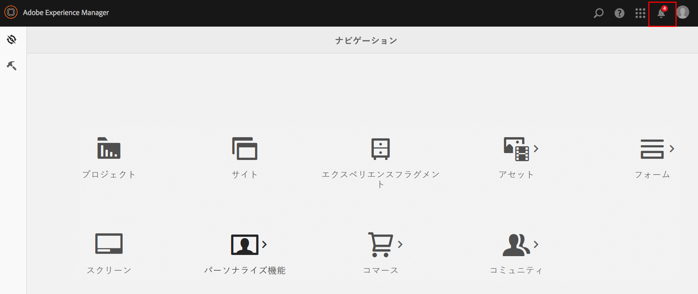
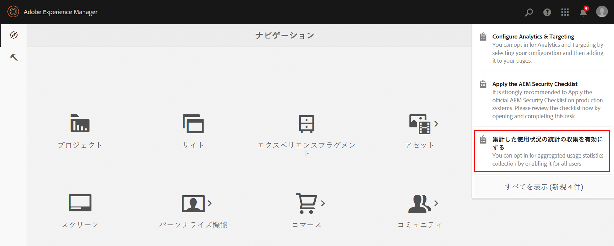
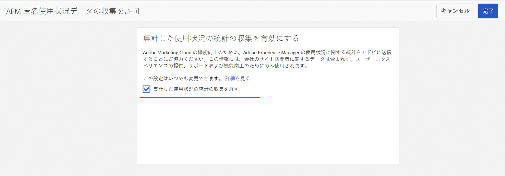
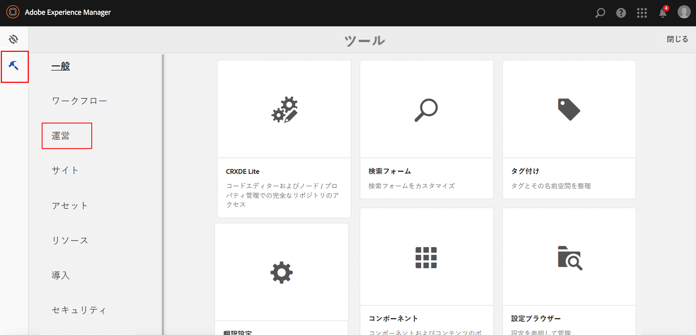
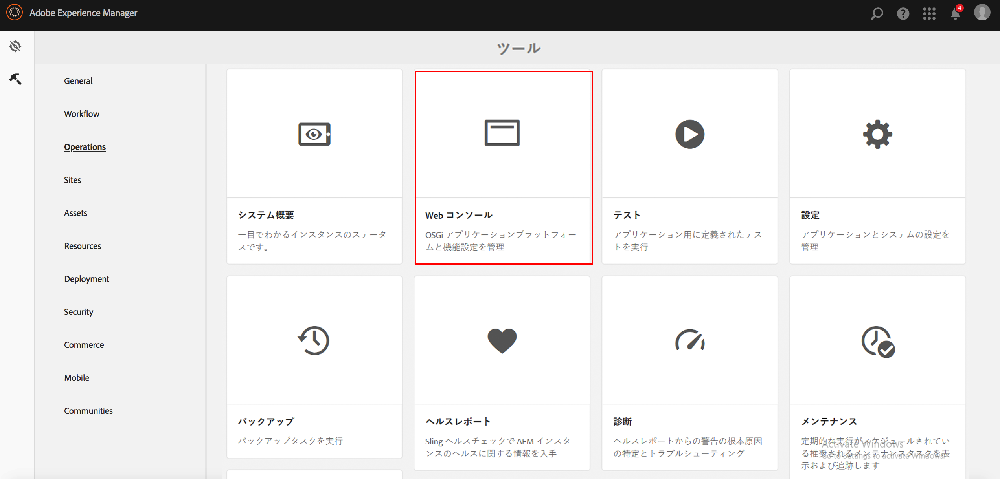

# 集計した使用状況の統計の収集をオプトインする方法{#opting-into-aggregated-usage-statistics-collection}

## 概要 {#introduction}

AEM とのやり取りの状況に関する統計情報をアドビに送信することで、Adobe Marketing Cloud の改善に協力することができます。この情報は、貴社のサイト訪問者に関するデータを含んでおらず、アドビによるユーザーエクスペリエンスの提供、サポート、改善に役立てるためにのみ使用されます。

使用状況に関する統計情報の収集をオプトインするには、タッチ UI または Web コンソールを使用します。

>[!NOTE]
>
>データ保護とプライバシーに関する様々な規制があり、たとえば、GDPRやCCPAを含む。 AEM Sitesは、お客様のデータ保護とプライバシーコンプライアンスの義務を支援する準備が整っています。 このページでは、集計した使用状況の統計の収集をオプトイン（またはオプトアウト）する手順を説明します。
>
>詳しくは、 [Adobeのプライバシーセンターも参照してください](https://www.adobe.com/privacy.html)。

>[!NOTE]
>
>You can also opt-out at anytime by either using the [Web Console](/help/sites-deploying/opt-in-aggregated-usage-statistics.md#opt-in-by-using-the-web-console) or by not selecting the opt-in option on the AEM opt-in screen.

## タッチ UI を使用したオプトイン {#opt-in-by-using-the-touch-ui}

AEM を初めて起動したときに、タッチ UI を次のように使用してオプトインすることができます。

1. AEM ナビゲーション画面で、**インボックス**（ベル）アイコンをクリックします。

   

1. ドロップダウンリストで、「**集計した使用状況の統計の収集を有効にする**」を選択します。

   

1. オプトイン画面で、「**集計した使用状況の統計の収集を許可**」を選択します。

   

1. 「**完了**」をクリックします。

## Web コンソールを使用したオプトイン {#opt-in-by-using-the-web-console}

Web コンソールを次のように使用してオプトイン（またはオプトアウト）することができます。

1. On the AEM Navigation screen, click **Tools** and then **Operations**.

   

1. On the Operations window, click **Web Console**.

   

1. 「**Aggregated Usage Statistics Collection**」を探します。
1. **編集**&#x200B;アイコンをクリックします。

   

1. Select the **Enabled** checkbox. また、使用状況の統計情報の収集をオプトアウトする場合は、このチェックボックスの選択を解除することもできます。

   

1. 「**保存**」をクリックします。

