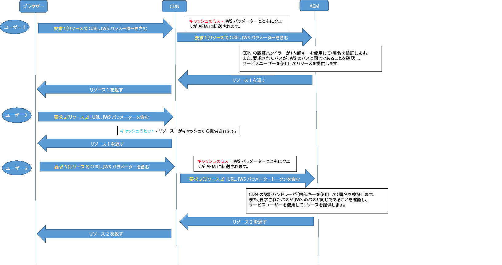

# OSGi 設定{#osgi-configuration-settings}

[OSGi](https://www.osgi.org/) はAEMのテクノロジスタックの基本要素です。AEMの複合バンドルとその設定を制御するために使用されます。

OSGi は標準化されたプリミティブを提供し、小さく再利用が可能で連携機能に優れたコンポーネントを組み合わせてアプリケーションを構築することを可能にします。これらのコンポーネントからアプリケーションを作成し、デプロイすることができます。**

これにより、 バンドルの管理が容易になり、バンドルを個別に停止、インストール、開始できます。相互依存関係は自動的に処理されます。各OSGiコンポーネント( [OSGi仕様を参照](https://www.osgi.org/Specifications/HomePage))は、様々なバンドルの1つに含まれています。 When working with AEM there are several methods of managing the configuration settings for such bundles; see [Configuring OSGi](/help/sites-deploying/configuring-osgi.md) for more details and the recommended practices.

次の OSGi 設定（バンドルに従ったリスト）は、プロジェクトの実装に関連しています。すべての設定に調整が必要なわけではなく、一部の設定は AEM の動作を説明する目的で言及されています。

>[!CAUTION]
>
>このリストはガイドラインの役割を果たすものであり、完全ではありません。すべてのバンドルがリストされているわけではなく、リストされているバンドルに関しても、すべてのパラメーターがリストされているわけではありません。
>
>必要な設定は、プロジェクトによって異なります。
>
>使用する値およびパラメーターの詳細は、Web コンソールを確認してください。

>[!NOTE]
>
>AEMツールの一部であるOSGi設定相違ツールは、 [デフォルトのOSGi設定のリストに使用でき](https://helpx.adobe.com/experience-manager/kb/tools/aem-tools.html)ます。

>[!NOTE]
>
>AEM 内の機能の特定の領域では、さらに多くのバンドルが必要な場合があります。この場合、設定の詳細は、該当する機能の関連ページで確認できます。

**AEMレプリケーションイベントリスナー** 構成：

* レプリケーション・イベントがリスナーに配布される **実行モード**。 たとえば、authorと定義した場合、これはレプリケーションを「開始」するシステムです。

* プロジェクトコードが発行環境で複製イベント（逆複製）を処理する場合は、 **** 発行モードを実行する必要があります。 例えば、ディスパッチャーを使用して発行環境からフラッシュする場合や、他の発行インスタンスへの標準複製が発生する場合などです。

**AEMリポジトリ変更リスナー** ：設定：

* **パス**。リポジトリイベントをリスンして配布できる状態になっている場所です。

**CRX Sling Client Repository** 基礎となるコンテンツリポジトリへのアクセスを設定します。

* インスタンスの **セキュリティを確保するために、** 管理者パスワード [(Admin Password](/help/sites-administering/security-checklist.md) )はインストール後に変更する必要があります。
* その他の変更は必要なく、リポジトリへのアクセスに影響を与える可能性があるので、注意が必要です。

**Wikiメールサービス** : Wikiから送信される電子メールの電子メール設定を構成します。

**Apache Felix OSGi Management Console** Configure:

* **Plugins**：**Apache Felix Web Management Console** で最上位のメニュー項目として使用できる、メインのナビゲーション項目（コンソールプラグイン）です。それぞれ容量とリソースが必要なので、不要なものは無効にしてください。

>[!CAUTION]
>
>必ず以下を設定してください。
>
>**ユーザー名** と **パスワード**。Apache Felix Web Management Consoleにアクセスするための資格情報です。
>The password must be changed after the initial installation to ensure the [security](/help/sites-administering/security-checklist.md) of your instance.

>[!NOTE]
>
>この設定は起動時に必要なので、リポジトリが使用可能になる前に、Felix コンソールを使用して設定する必要があります。

**Apache Slingカスタマイズ可能な要求データロガー** 設定：

* **Logger Name** and **Log Format** ：リクエストおよびアクセスログの場所と形式を設定します(デフォルト： `request.log`)をクリックします。 このログファイルは、Webチェーンに関連するパフォーマンスやデバッグ機能を分析する際に重要です。
これは [Apache Sling Request Logger](#apacheslingrequestlogger) とペアで使用されます。

詳しくは、[AEM のログ](/help/sites-deploying/configure-logging.md)および [Sling のログ](https://sling.apache.org/site/logging.html)に関するページを参照してください。

**Apache Sling Eventing Thread Pool** Configure:

* **Min Pool Size** および **Max Pool Size**：イベントスレッドを保持するために使用するプールのサイズ。

* **Queue Size**：プールを使い果たした場合のスレッドキューの最大サイズ。The recommended value is `-1` as this sets the queue to unlimited; if a limit is set then losses might occur when it is exceeded.

* これらの設定を変更すると、イベント数が非常に多い状況（例：AEM DAM またはワークフローの使用頻度が高い場合）におけるパフォーマンスの強化に役立ちます。
* テストを実施して、状況に応じた値を確立する必要があります。
* これらの設定はインスタンスのパフォーマンスに影響を及ぼす可能性があるので、変更の際は十分な理由と検討が必要です。

**Apache SlingGETサーブレット** ：レンダリングのいくつかの側面を設定します。

* **Auto Index**：閲覧のためのディレクトリのレンダリングを有効または無効にします。
* **Enable**（または Disable）：デフォルトのレンディション（**HTML**、**Plain Text**、**JSON**、**XML** など）を有効または無効にします。JSON を無効にしないでください。

>[!NOTE]
>
>AEM を[実稼動準備完了モード](/help/sites-administering/production-ready.md)で実行している場合は、この設定は自動的に実稼動インスタンス用に設定されます。

**Apache Sling Java Script Handler** Configure settings for compilation of .java files as scripts(servlets).

特定の設定がパフォーマンスに影響を及ぼす可能性があります。可能な場合（特に、実稼動インスタンスの場合）は、それらを無効にしてください。

* **Source VM** および **Target VM**：ランタイム JVM として使用する JDK バージョンを定義します。

* 実稼動インスタンスの場合：

   * 「**Generate Debug Info**」を無効化

**Apache Sling JCR Installer** これらのパラメーターは、設定はおそらく必要ありませんが、開発やデバッグを行う際に知っておくと役立ちます。 例えば、インストールフォルダーはパッケージのチェックイン／チェックアウトまたは作成に役立つ場合があります。

* **インストールフォルダ名regexp** と **Max hierarchy depth of install folders** — インストールするリソースを検索する場所と深さを指定します。ワイルドカードを使用する場合（.など）*/install)を指定すると、およびなど、該当するすべての一致が検索 `/libs/sling/install` され `/libs/cq/core/install`ます。

* **Search Path**：インストールするリソースを jcrinstall が検索するパスのリストです。そのパスの重み付け係数を示す数値も表示されます。

**Apache Slingジョブイベントハンドラ** ：ジョブスケジュールを管理するパラメータを設定します。

* **再試行間隔**、 **最大再試行数**、最大並列ジョブ数 **、**&#x200B;認識待ち時間 ****&#x200B;など。

* これらの設定を変更すると、ジョブ数が多いシナリオでのパフォーマンスが向上します。例えば、AEM DAMやワークフローを大量に使用している場合などです。
* テストを実施して、状況に応じた値を確立する必要があります。
* これらの設定は理由なく変更しないでください。変更は、考慮が必要な場合にのみ行ってください。

**Apache Sling JSPスクリプトハンドラ** JSPスクリプトハンドラのパフォーマンスに関する設定を設定します。 パフォーマンスを向上するには、可能な限り設定を無効にしてください。

特に、実稼動インスタンスの場合は、次の設定を無効にします。

* 「**Generate Debug Info**」を無効化
* **Keep Generated Java**
* **Mapped Content**
* **Display Source Fragments**

>[!NOTE]
>
>AEM を[実稼動準備完了モード](/help/sites-administering/production-ready.md)で実行している場合は、この設定は自動的に実稼動インスタンス用に設定されます。

**Apache Sling Logging Configuration** Configurate:

* **Log Level** および **Log File**：主要なログ設定（error.log）の場所とログレベルを定義します。The level can be set to one of `DEBUG`, `INFO`, `WARN`, `ERROR` and `FATAL`.

* **Number of Log Files** および **Log File Threshold**：ログファイルのサイズとバージョンのローテーションを定義します。

* **Message Pattern**：ログメッセージの形式を定義します。

詳しくは、[AEM のログ](/help/sites-deploying/configure-logging.md#global-logging)および [Sling のログ](https://sling.apache.org/site/logging.html)に関するページを参照してください。

**Apache Sling Logging Logger Configuration（ファクトリ設定）** 設定：

* **Log Level**、**Log File** および **Message Format**：ログファイルとメッセージの詳細を定義します。

* **Logger**：カテゴリを定義します（例：com.day.cq のログのみ）。

* 「**Factory Configurations**」を使用することにより、必要とされる様々なログレベルとカテゴリに応じて、任意の数の設定を追加できます。
* このような設定は開発時に役立ちます。例えば、特定のログファイルで、特定のサービスのトレースメッセージをログに記録する場合などです。
* このような設定は実稼動環境で役立ちます。例えば、特定のサービスに関するメッセージを個々のログファイルに記録して、簡単に監視できるようにする場合などです。

詳しくは、[AEM のログ](/help/sites-deploying/configure-logging.md)および [Sling のログ](https://sling.apache.org/site/logging.html)に関するページを参照してください。

**Apache Sling Logging Writerの設定（工場出荷時の設定）** :

* **Log File**：ログファイルの有無を定義します。
* **Number of Log Files**：バージョンのローテーションを定義します。

* ライターは **Apache Sling Logging Logger Configuration** 設定で使用できます。

* このような設定は開発時に役立ちます。例えば、特定のログファイルで、特定のサービスのトレースメッセージをログに記録する場合などです。
* このような設定は実稼動環境で役立ちます。例えば、特定のサービスに関するメッセージを個々のログファイルに記録して、簡単に監視できるようにする場合などです。

詳しくは、[AEM のログ](/help/sites-deploying/configure-logging.md)および [Sling のログ](https://sling.apache.org/site/logging.html)に関するページを参照してください。

**Apache Sling Main Servlet** Configure:

* **Number of Calls per Request** および **Recursion Depth**：無限再帰および過度のスクリプトの呼び出しからシステムを保護します。

**Apache Sling MIME Type Service** Configure:

* **MIME Types**：プロジェクトで必要な MIME タイプをシステムに追加します。これにより、ファイルに対する `GET` 要求において、ファイル形式とアプリケーションをリンクするための適切な content-type ヘッダーを設定できます。

**Apache Sling転送者フィルタ** CRX WebDAVとApache SlingのCross-Site Request Forgery(CSRF)に関する既知のセキュリティの問題に対処するには、転送者フィルタを設定する必要があります。

リファラーフィルターサービスは OSGi のサービスの 1 つであり、次の設定が可能です。

* フィルター処理する HTTP メソッド
* 空のリファラーヘッダーを使用できるかどうか
* サーバ・ホストに加えて、サーバのリストも許可されます。

詳しくは、[「セキュリティチェックリスト」のクロスサイトのリクエスト偽造に関する問題](/help/sites-administering/security-checklist.md#protect-against-cross-site-request-forgery)を参照してください。

>[!NOTE]
>
>Apache Sling Referrer Filter はクイックフィックスパッケージのインストールに依存します。

**Apache Sling Request Logger** Configure:

* 要求をログに記録する方法を定義するための様々なパラメーター。
* **Enable Request Log**：有効または無効にします。

* **Enable Access Log**：有効または無効にします。

これは [Apache Sling Customizable Request Data Logger](#apacheslingcustomizablerequestdatalogger) とペアで使用されます。

詳しくは、[AEM のログ](/help/sites-deploying/configure-logging.md)および [Sling のログ](https://sling.apache.org/site/logging.html)に関するページを参照してください。

**Apache Sling Resource Resolver Factory** Slingリソース解決の中心的側面を設定します。

* **リソース検索パス**（複数可）、プロジェクト固有のパスを追加します(削除 `/libs` や `/apps`削除はしません)。

* **Virtual URLs**：バニティー URL のマッピングを定義します。

* **URL Mappings** （URLマッピング）：任意のエイリアスを定義します。例えば、から `/content` に変更し `/`ます。

* **マッピングの場所**、で外部化されたマッパー設定 `/etc/map`。

* Use your local installation (for example, use `https://localhost:4502/system/console/jcrresolver`) to determine which Resource Resolver is active.

詳しくは、[https://cwiki.apache.org/confluence/display/SLING/Flexible+Resource+Resolution](https://cwiki.apache.org/confluence/display/SLING/Flexible+Resource+Resolution) を参照してください。

>[!CAUTION]
>
>具体的には、これらのオプションはリポジトリで設定する必要があります。
>
>そうしないと、Felix コンソールでおこなった「**URL Mappings**」に対する変更が、次回の起動時に AEM によって上書きされる可能性があります。

**Apache Slingサーブレット/スクリプトリゾルバーとSlingサーブレットおよびスクリプトリゾルバーのエラーハンドラ** (Error Handler)には複数のタスクがあります。

1. `ServletResolver` として使用され、要求を処理するために呼び出す Servlet または Script を選択します。

1. It acts as the `SlingScriptResolver`.

1. エラー処理を管理します。そのためには、要求処理のサーブレット／スクリプトの解決に使用するのと同じアルゴリズムを使用してエラー処理のサーブレット／スクリプトを選択する `ErrorHandler` インターフェイスを実装します。

次のような様々なパラメーターを設定できます。

* **Execution Paths**：実行可能なスクリプトを検索するパスを表示します。特定のパスを設定することで、実行可能なスクリプトを制限できます。If no path is configured then the default is used ( `/` = root), this allows the execution of all scripts.

設定したパス値がスラッシュで終わる場合は、サブツリー全体が検索されます。末尾にスラッシュを指定しないと、完全一致の場合にのみスクリプトが実行されます。

* **Script User**：このオプションのプロパティでは、スクリプトの読み取りに使用するリポジトリユーザーアカウントを指定できます。アカウントを指定しない場合は、`admin` ユーザーがデフォルトで使用されます。

* **Default Extensions**：デフォルトの動作が使用される拡張子のリストです。つまり、リソースタイプの最後のパスセグメントをスクリプト名として使用できます。

**Day Commons GFX Font Helper** グラフィックをレンダリングする場合、DrawTextを使用してテキストを埋め込むことができます。 そのために、独自のフォントをインストールすることも可能です。

* Define the **Font Path** to be searched for project specific fonts.
For example, `/apps/myapp/fonts`.

**Apache HTTPコンポーネントプロキシ設定** Apache HTTPクライアントを使用するすべてのコードのプロキシ設定。HTTPが作成されたときに使用します。例えば、レプリケーション時に

When creating a new configuration, do not make changes to the factory configuration but instead create a new factory configuration for this component using the configuration manager available here: **https://localhost:4502/system/console/configMgr/**. The proxy configuration is available in **org.apache.http.proxyconfigurator.**

>[!NOTE]
>
>AEM 6.0 以前のリリースでは、プロキシは Day Commons HTTP Client で設定されていました。AEM 6.1 以降のリリースでは、プロキシ設定は、「Day Commons HTTP Client」設定ではなく、「Apache HTTP Components Proxy Configuration」に移動されました。

**Day CQ Antispam** 使用するスパム対策サービス(Akismet)を設定します。 次の項目を登録する必要があります。

* **プロバイダー**
* **API キー**
* **登録済みの URL**

**AdobeGranite HTML Library Manager** ：クライアントライブラリ（cssまたはjs）の処理を制御するように設定します。例えば、基になる構造体の見え方を含む。

* 実稼動インスタンスの場合：

   * 「**Minify**」を有効化（CRLF および空白文字を削除）
   * 「**Gzip**」を有効化（1 回の要求でファイルを gzip してアクセスするため）
   * 「**Debug**」を無効化
   * 「**Timing**」を無効化

* JS 開発の場合（特に、Firebug を使用するか、デバッグをおこなう場合）：

   * 「**Minify**」を無効にします。
   * 「**Debug**」を有効にして、デバッグ用のファイルを分離し、Firebug で使用します。
   * 「**Timing**」を有効にします（タイミングに関する設定をおこなう場合）。
   * **Debug** コンソールを有効にして、JS コンソールのログメッセージを確認します。

>[!CAUTION]
>
>When changing the setting for either **Minify** or **Gzip** you will also need to delete the contents of `/var/clientlibs`. This is a cached version of the clientlibs and will be rebuilt when next requested.

>[!NOTE]
>
>AEM を[実稼動準備完了モード](/help/sites-administering/production-ready.md)で実行している場合は、この設定は自動的に実稼動インスタンス用に設定されます。

**Day CQ HTTP Header Authentication Handler** System wide settings for the basic authentication method of the HTTP request.

[閉じられたユーザーグループ](/help/sites-administering/cug.md)を使用すると、（特に）以下を設定できます。

* **HTTP レルム**
* **デフォルトのログインページ**

**Day CQ Link Checker Service** Checkと必要に応じて次の設定を行います。

* **Scheduler Period**：外部リンクを自動的にチェックする間隔を定義します。

* **Bad Link Tolerance Interval**：失敗した外部リンクが無効と見なされるまでの期間を指定します。
* **Link Check Override Patterns**：リンクチェックから除外するパスを定義します。

**Day CQリンクチェッカータスク** ：単一のリンクチェッカータスク(外部リンクをチェックするタスク)の設定を行います。

* **Good Link Test Interval** および **Bad Link Test Interval で定義されている間隔をチェックします。** 

* リンクをチェックする際に外部アクセスのために必要な、インターネットアクセスおよび NTLM 用のプロキシに関連する様々なパラメーターを設定します。

**Day CQ Mail Service** ：メールサーバーのホスト名とアクセスの詳細を設定します。 「Mail Serviceの設定」の節を参照してください。

**Day CQ MCMニュースレター** ：ニュースレターで使用する様々な設定を指定します。

**Day CQ Root Mapping** Configure:

* **ターゲットパス** : 「 `/`」への要求がリダイレクトされる先を定義します。

AEM では次の 2 つの UI を使用できます。

* タッチ操作対応 UI が標準の UI です。
* 廃止されたクラシック UI も引き続き完全に機能します。

AEM ルートマッピングを使用すると、希望する UI を、インスタンスのデフォルトとして設定できます。

* To have the touch-enabled UI as the default UI the **Target Path** should point to:

   ```
      /projects.html
   ```

* To have the classic UI as the default UI the **Target Path** should point to:

   ```
      /welcome.html
   ```

>[!NOTE]
>
>標準インストールでは、タッチ操作向け UI がデフォルトの UI です。

**AdobeGranite SSO認証ハンドラー** ：シングルサインオン(SSO)の詳細の設定これらは、多くの場合、エンタープライズ作成者の設定で必要となり、LDAPと組み合わせて使用されます。

様々な設定プロパティがあります。

* **Path**&#x200B;この認証ハンドラーをアクティブにする対象のパス。このパラメーターを空のままにすると、認証ハンドラーは無効になります。例えば、/ というパスを指定すると、認証ハンドラーはリポジトリ全体に対して使用されます。

* **サービスのランキング** OSGiフレームワークサービスのランキング値は、このサービスの呼び出しに使用される順序を示すために使用されます。これは、 
`int` 値を大きくすると、優先順位が高くなります。
デフォルト値は `0` です。

* **Header Names**
ユーザー ID を含む可能性のあるヘッダーの名前です。

* **Cookie Names**
ユーザー ID を含む可能性のある cookie の名前です。

* **Parameter Names**
ユーザー ID を指定する可能性のある要求パラメーターの名前です。

* **ユーザーマップ**&#x200B;選択したユーザーに対して、HTTP要求から抽出したユーザー名を、credentialsオブジェクト内の別のユーザー名に置き換えることができます。マッピングはここで定義します。ユーザー名 
`admin` がマップの両側に表示される場合、マッピングは無視されます。 「=」の文字は、先頭に「\」を付けてエスケープする必要があります。

* **Format**
ユーザー ID を指定する際の形式を示します。次のいずれかを使用します。

   * `Basic`：ユーザー ID が HTTP Basic 認証形式でエンコードされている場合
   * `AsIs`：ユーザー ID がプレーンテキストで指定されている場合や、正規表現が適用されている値をそのまま、または正規表現として使用する必要がある場合

**Day CQ WCM Debug Filter** ：これは、ページにアクセスする際に？debug=layoutなどのサフィックスを使用できる開発時に役立ちます。 例えば、https://localhost:4502/cf#/content/geometrixx/en/support.html?debug=layoutは開発者にとって興味のあるレイアウト情報を提供します。

* パフォーマンスとセキュリティを確保するために、実稼動インスタンスではこれを無効にします。

**Day CQ WCM Filter** Configure:

* **WCMモード**を使用して、デフォルトのモードを定義します。
* オーサーインスタンスでは、これは、 `edit`またはの場合があり `disable,preview` ま `analytics`す。
その他のモードは、サイドキックからアクセスできます。または、サフィックスを使用して実稼働環境をエミュレートで `?wcmmode=disabled` きます。

* パブリッシュインスタンスでは、`disabled` に設定して、その他のモードにアクセスできないようにする必要があります。

>[!NOTE]
>
>AEM を[実稼動準備完了モード](/help/sites-administering/production-ready.md)で実行している場合は、この設定は自動的に実稼動インスタンス用に設定されます。

**Day CQ WCM Link Checker Configurator** Configurator:

* **書き換え設定のリスト**：コンテンツベースのリンクチェックツール設定の場所のリストを指定します。設定は実行モードに基づくことができます。これはオーサー環境とパブリッシュ環境を区別するために重要です。それぞれの環境でリンクチェッカーの設定が異なる場合があるからです。

**Day CQ WCM Page Processor** Configure:

* **パス**：システムが `jcr:Event` をトリガーする前にページの変更をリッスンする場所のリストです。

**Adobeページインプレッション数トラッカー** （作成者インスタンス用）は、以下のように設定します。

* **sling.auth.requirements**:このプロパティの値を `-/libs/wcm/stats/tracker`

>[!CAUTION]
>
>この設定では、トラッキングサービスへの匿名リクエストが許可されます。

>[!NOTE]
>
>詳しくは、[ページインプレッション](/help/sites-deploying/configuring.md#enabling-page-impressions)を参照してください。

**Day CQ WCM Page Statistics** For a publish instance設定：

* **URL to send data**：ページ統計の追跡に使用する URL を設定します（トラッカー要求が Dispatcher を経由する場合は必須）。例えば、デフォルトは `https://localhost:4502/libs/wcm/stats/tracker` です。

* **Tracking script enabled**：ページ上の追跡スクリプトのインクルードを有効化（`true`）または無効化（`false`）します。デフォルト値は `false` です。

>[!NOTE]
>
>詳しくは、[ページインプレッション](/help/sites-deploying/configuring.md#enabling-page-impressions)を参照してください。

**Day CQ WCM Version Manager** Control if, and how, versions are managed in your system:

* **Create Version on Activation**：標準インストールで有効になります。
* **Enable Purging**

* **Purge Paths**：検索アクションで検索するパス。
* **Implicit Versioning Paths**：暗黙のバージョン管理がアクティブなパス。

* **Max Version Age**：バージョンの最長有効期間（日数）。

* **Max Number Versions**：保存するバージョンの最大数。

詳しくは、[バージョンのパージ](/help/sites-deploying/version-purging.md)を参照してください。

**Day CQワークフロー電子メール通知サービス** ：ワークフローから送信される通知の電子メール設定を行います。

**Day CQSE HTTP Service** Control the CQ Servlet Engine:

* **HTTPの場合はNIO、**HTTPにNIOを使用するかどうか。デフォルトはtrueです。HTTPが有効な場合にのみ使用されます。
* **接続タイムアウト。**接続タイムアウト（ミリ秒）。このプロパティは、HTTP接続とHTTPS接続の両方に適用されます。初期設定は60秒です。

* **HTTPSを有効にする** （HTTPSが有効かどうかを問わず）。デフォルトはfalseです。
* **Session Timeout**（セッションタイムアウト）。HTTPセッションのデフォルトの有効期間（分単位）です。タイムアウトが0以下の場合、セッションはタイムアウトしません。デフォルトは10分です。
* **デバッグログ**（DEBUGレベルのメッセージを書き込むかどうか）。デフォルトはfalseです。
* **Request Buffer Size**、要求のバッファーのサイズ（バイト単位）。初期設定は8KBです。
* **スレッドの最大数**、要求の処理に使用するスレッドの最大数。初期設定は200です。

以下のプロパティは、HTTPS が有効な場合にのみ適用されます。

* **HTTPSポート**。HTTPS要求をリッスンするポートです。初期設定は433です。
* **HTTPS用のNIO**。HTTPにNIOを使用するかどうか。HTTPプロパティのデフォルト値はNIOです。
* **キーストア**、HTTPSに使用するキーストアの絶対パス。HTTPSが有効な場合は必須です。
* **キーストアパスワード**、キーストアにアクセスするためのパスワード。
* **Key Alias**（キーストア内の秘密鍵のエイリアス）。
* **Key Password**, Password（キーストア内の秘密鍵のロックを解除するためのパスワード）。
* **クライアント証明書**、有効な証明書を提供するためのクライアントの要件。初期設定はnoneです。

See also [Enabling HTTP Over SSL](/help/sites-administering/ssl-by-default.md) for details on the SSL-related options and a complete description on how to enable HTTPS for CQSE.

**CQ Rewriter HTML Parser Factory**

CQ リライターの HTML パーサーを制御します。

* **Additional Tags to Process** - パーサーで処理する HTML タグを追加または削除できます。デフォルトで処理されるタグは、A、IMG、AREA、FORM、BASE、LINK、SCRIPT、BODY、HEAD です。
* **キャメルケースを保持** — デフォルトでは、HTMLパーサーはキャメルケース（eBayなど）の属性を小文字（eBayなど）に変換します。 キャメルケースの属性を保持するには、これをオフにします。これは、Angular 2 などのフロントエンドフレームワークを使用する際に役立ちます。

**Day Commons JDBC Connections Pool** ：コンテンツのソースとして使用されている外部データベースへのアクセスを設定します。

これはファクトリ設定なので、複数のインスタンスを設定できます。

**Adobe CQメディアDPSセッションサービス** ：パブリケーションで使用するDPSセッションを管理します。

具体的には、`dps.session.service.url.name`、  を定義できます。デフォルトは [https://dpsapi2.digitalpublishing.acrobat.com/webservices/sessions](https://dpsapi2.digitalpublishing.acrobat.com/webservices/sessions) に設定されています。

**CDN Rewriter** Communication between AEM and CDN（とCDN間の通信）は、アセット/バイナリがエンドユーザーに安全な方法で配信されるように保証する必要があります。 この方法では 2 つのタスクをおこないます。

* 最初（またはキャッシュ内のリソースが期限切れになった後）に、CDN を介して AEM からリソースにアクセスします。
* CDN にリソースがキャッシュされた後は、CDN にキャッシュされたリソースに安全にアクセスします。要求は AEM に送信されず、そのリソースにアクセスできるすべてのユーザーの処理は CDN でおこなわれます。

AEM は、内部アセットの URL を外部の CDN URL に書き直すリライターを提供しています。これにより、JWS 署名および有効期限を含む、CDN に渡すリンクが書き直され、アセットに安全にアクセスできるようになります。この機能は、オーサーインスタンスで使用されます。

全体的なフローは次のとおりです。

1. ユーザーが AEM で認証をおこない、アセットを含むページを要求します。
1. 要求されたページに、 `/content/dam/geometrixx-media/articles/paladin_trailer.jpg/jcr:content/renditions/cq5dam.thumbnail.319.319.png`
1. リライターがJWS署名を含むCDN URLにリンクを変換します。
   `CDN_domain/content/dam/geometrixx-media/articles/paladin_trailer.jpg/_jcr_content/renditions/cq5dam.thumbnail.319.319.png?cdn_sign=JWS_SIGNATURE`

1. ユーザーのブラウザーによって、CDN サーバーにアセット要求が転送されます。
1. 要求が `cdn_sign` パラメーターと共に AEM に転送されるように、CDN を設定する必要があります。
1. 認証ハンドラーによって `cdn_sign` パラメーターが検証され、CDN にアセットが返された後、アセットがユーザーに配信されます。

次の図に、ユーザーのブラウザー、CDN および AEM の間のフローを示します。



>[!NOTE]
>
>現在、この機能は、AEM オーサーインスタンスでのみ使用できます。

**CDNConfigServiceImpl** CDN設定を提供

The CDN rewriting feature can be enabled by providing **CDN distribution domain name** in the configuration for com.adobe.cq.cdn.rewriter.impl.CDNConfigServiceImpl.

また、このサービスには、CDN 書き直しの有効化／無効化、CDN 書き直しが実行されるパスのプレフィックス、TTL 値、プロトコル（HTTP または HTTPS）など、その他の設定オプションも含まれます。

**CDNRewriter** 内部画像URLをCDN URLに書き換えるためのリライタ

The **Tag Attributes** value in com.adobe.cq.cdn.rewriter.impl.CDNRewriter can be defined so that only selective image links are rewritten.
