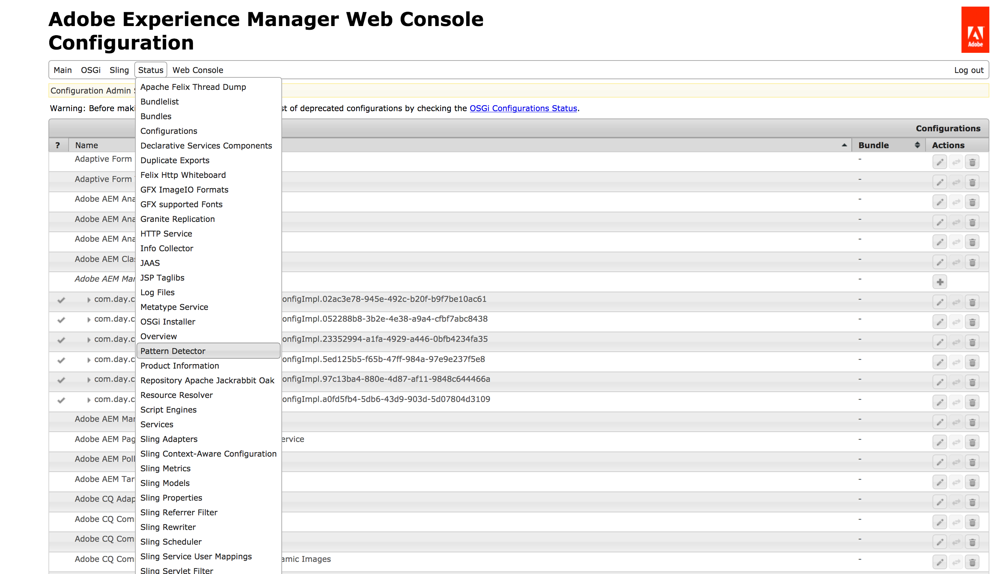

# パターン検出を使用したアップグレードの複雑性の評価

## 概要 {#overview}

この機能を使用すると、次のパターンを検出することで、既存のAEMインスタンスのアップグレード可能性をチェックできます。

1. 特定のルールに違反し、アップグレードによって影響を受ける領域または上書きされる領域で実行される
1. AEM 6.5 との下位互換性のないAEM 6.x 機能または API を使用しており、アップグレード後に動作しなくなる可能性があります。

これは、AEM 6.5 へのアップグレードに関わる開発作業の評価に役立ちます。

## 設定方法 {#how-to-set-up}

パターン検出は、 [1 つのパッケージ](https://experience.adobe.com/#/downloads/content/software-distribution/en/aem.html?package=/content/software-distribution/en/details.html/content/dam/aem/public/adobe/packages/cq650/compatpack/pd-all-aem65) 6.1 から 6.5 への任意のソースAEMバージョンでAEM 6.5 のアップグレードをターゲットとして作業する インストールするには、 [パッケージマネージャー](/help/sites-administering/package-manager.md).

## 使用方法 {#how-to-use}

>[!NOTE]
>
>パターン検出は、環境インスタンスを含む、あらゆるローカル開発で実行できます。 ただし、次の操作を行います。
>
>* 検出率を上げる
>* ビジネスにとって重大なインスタンスの減速を避ける
>
>ユーザーアプリケーション、コンテンツ、設定の分野において、実稼働環境にできるだけ近い&#x200B;**ステージング環境で**&#x200B;実行することをお勧めします。

いくつかの方法を使用して、パターン検出の出力をチェックできます。

* **Felix Inventory コンソールを使用：**

1. AEM web コンソールに移動します（*https://serveraddress:serverport/system/console/configMgr*）。
1. 次の図に示すように、**ステータス - パターン検出**&#x200B;を選択します。

   

* **事後対応テキストベースまたは通常の JSON インターフェイスを使用**
* **事後対応 JSON Lines インターフェイスを使用し、**各行に個別の JSON ドキュメントを生成します。

これらの方法の両方について、以下で詳しく説明します。

## Reactive Interface {#reactive-interface}

リアクティブインターフェイスを使用すると、疑いが検出されたらすぐに違反レポートを処理できます。

出力は現在、次の 2 つの URL で使用できます。

1. プレーンテキストインターフェイス
1. JSON インターフェイス

## プレーンテキストインターフェイスの処理 {#handling-the-plain-text-interface}

出力内の情報は、一連のイベントエントリの形式で表示されます。 違反を公開するチャネルと、現在の進行状況を公開するチャネルの 2 つがあります。

これらは、次のコマンドを使用して取得できます。

```shell
curl -Nsu 'admin:admin' https://localhost:4502/system/console/status-pattern-detector.txt | tee patterns-report.log | grep SUSPICION
```

出力は次のようになります。

```
2018-02-13T14:18:32.071+01:00 [SUSPICION] The pattern=ECU/extraneous.content.usage was found by detector=ContentAccessDetector with id=a07fd94318f12312c165e06d890cbd3c2c8b8dad0c030663db8b4c800dd7c33f message="Cross-boundary overlay of internal marked path /libs/granite/operations/components/commons/commons.jsp/jcr:content referenced at /apps/granite/operations/components/commons/commons.jsp/jcr:content with properties redefined: jcr:lastModifiedBy, jcr:mimeType, jcr:data, jcr:lastModified, jcr:uuid". More info at=https://www.adobe.com/go/aem6_EC
```

進行状況は、`grep` コマンドを使用してフィルタリングできます。

```shell
curl -Nsu 'admin:admin' https://localhost:4502/system/console/status-pattern-detector.txt | tee patterns-report.log | grep PROGRESS
```

これにより、次の出力が得られます。

```
2018-02-13T14:19:26.909+01:00 [PROGRESS] emitted=127731/52 MB patterns (from=6.5), analysed=45780/16 MB items, found=0 suspicions so far in period=PT5.005S (throughput=34667 items/sec)
2018-02-13T14:19:31.904+01:00 [PROGRESS] emitted=127731/52 MB patterns (from=6.5), analysed=106050/39 MB items, found=0 suspicions so far in period=PT10S (throughput=23378 items/sec)
2018-02-13T14:19:35.685+01:00 [PROGRESS] Finished in period=PT13.782
```

## JSON インターフェイスの処理 {#handling-the-json-interface}

同様に、JSON も [jq ツール](https://stedolan.github.io/jq/) 公開され次第。

```shell
curl -Nsu 'admin:admin' https://localhost:4502/system/console/status-pattern-detector.json | tee patterns-report.json | jq --unbuffered -C 'select(.suspicion == true)'
```

出力を次に示します。

```
{
  "timestamp": "2018-02-13T14:20:18.894+01:00",
  "suspicion": true,
  "pattern": {
    "code": "ECU",
    "type": "extraneous.content.usage",
    "detective": "ContentAccessDetector",
    "moreInfo": "https://www.adobe.com/go/aem6_ECU"
  },
  "item": {
    "id": "a07fd94318f12312c165e06d890cbd3c2c8b8dad0c030663db8b4c800dd7c33f",
    "message": "Cross-boundary overlay of internal marked path /libs/granite/operations/components/commons/commons.jsp/jcr:content referenced at /apps/granite/operations/components/commons/commons.jsp/jcr:content with properties redefined: jcr:lastModifiedBy, jcr:mimeType, jcr:data, jcr:lastModified, jcr:uuid"
  }
}
```

進行状況は 5 秒ごとにレポートされ、疑わしいメッセージとしてマークされている以外のメッセージを除外することで、取得できます。

```shell
curl -Nsu 'admin:admin' https://localhost:4502/system/console/status-pattern-detector.json | tee patterns-report.json | jq --unbuffered -C 'select(.suspicion == false)'
```

出力を次に示します。

```
{
  "suspicion": false,
  "timestamp": "2018-02-13T14:21:17.279+01:00",
  "type": "PROGRESS",
  "database": {
    "patternsEmitted": 127731,
    "patternsEmittedSize": "52 MB",
    "databasesEmitted": [
      "6.5"
    ]
  },
  "state": {
    "itemsAnalysed": 57209,
    "itemsAnalysedSize": "26 MB",
    "suspicionsFound": 0
  },
  "progress": {
    "elapsedTime": "PT5.003S",
    "elapsedTimeMilliseconds": 5003,
    "itemsPerSecond": 36965
  }
}
{
  "suspicion": false,
  "timestamp": "2018-02-13T14:21:22.276+01:00",
  "type": "PROGRESS",
  "database": {
    "patternsEmitted": 127731,
    "patternsEmittedSize": "52 MB",
    "databasesEmitted": [
      "6.5"
    ]
  },
  "state": {
    "itemsAnalysed": 113194,
    "itemsAnalysedSize": "46 MB",
    "suspicionsFound": 0
  },
  "progress": {
    "elapsedTime": "PT10S",
    "elapsedTimeMilliseconds": 10000,
    "itemsPerSecond": 24092
  }
}
{
  "suspicion": false,
  "timestamp": "2018-02-13T14:21:25.762+01:00",
  "type": "FINISHED",
  "database": {
    "patternsEmitted": 127731,
    "patternsEmittedSize": "52 MB",
    "databasesEmitted": [
      "6.5"
    ]
  },
  "state": {
    "itemsAnalysed": 140744,
    "itemsAnalysedSize": "63 MB",
    "suspicionsFound": 1
  },
  "progress": {
    "elapsedTime": "PT13.486S",
    "elapsedTimeMilliseconds": 13486,
    "itemsPerSecond": 19907
  }
}
{
  "suspicion": false,
  "type": "SUMMARY",
  "suspicionsFound": 1,
  "totalTime": "PT13.487S"
}
```

>[!NOTE]
>
>curl からの出力全体をファイルに保存した後、`jq` または `grep` を使用して情報タイプをフィルタリングする方法をお勧めします。

## 検出範囲 {#scope}

現在、パターン検出では次の項目を確認できます。

* OSGi バンドルの書き出しと読み込みの不一致
* Sling リソースタイプとスーパータイプ（検索パスコンテンツオーバーレイを使用）のオーバー使用状況
* Oak インデックスの定義（互換性）
* VLT パッケージ（過剰使用）
* rep:User nodes の互換性（OAuth 設定のコンテキスト内）

>[!NOTE]
>
>パターン検出は、アップグレードに関する警告を正確に予測しようとします。 ただし、場合によっては、偽陽性が生成されることがあります。
