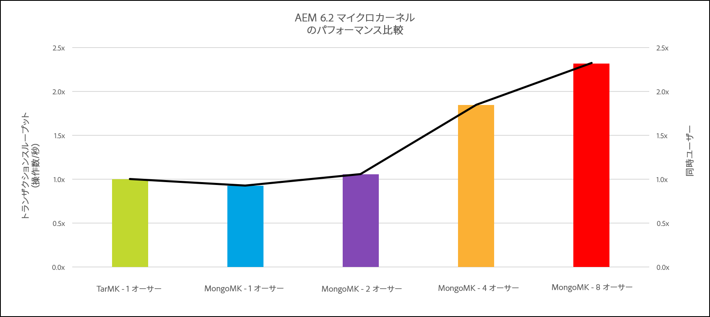

# パフォーマンスガイドライン{#performance-guidelines}

このページでは、AEM デプロイメントのパフォーマンスを最適化する方法に関する一般的なガイドラインを示します。AEM を初めて使用する場合は、パフォーマンスガイドラインを読む前に以下のページを参照してください。

* [AEM の基本概念](/help/sites-deploying/deploy.md#basic-concepts)
* [AEM のストレージの概要](/help/sites-deploying/storage-elements-in-aem-6.md#overview-of-storage-in-aem)
* [推奨されるデプロイメント](/help/sites-deploying/recommended-deploys.md)
* [技術要件](/help/sites-deploying/technical-requirements.md)

次の図に、AEMで使用できるデプロイメントオプションを示します(すべてのオプションを表示するまでスクロール)。

<table>
 <tbody>
  <tr>
   <td>
<strong>AEM</strong>
 
<strong>製品</strong>
 </td>
   <td>
<strong>トポロジ</strong>
 </td>
   <td>
<strong>オペレーティングシステム</strong>
 </td>
   <td>
<strong>アプリケーションサーバー</strong>
 </td>
   <td>
<strong>JRE</strong>
 </td>
   <td>
<strong>セキュリティ</strong>
 </td>
   <td>
<strong>マイクロカーネル</strong>
 </td>
   <td>
<strong>データストア</strong>
 </td>
   <td>
<strong>インデックス作成</strong>
 </td>
   <td>
<strong>Web サーバー</strong>
 </td>
   <td>
<strong>ブラウザー</strong>
 </td>
   <td>
<strong>Marketing Cloud</strong>
 </td>
  </tr>
  <tr>
   <td>
Sites
 </td>
   <td>
非 HA
 </td>
   <td>
Windows
 </td>
   <td>
CQSE
 </td>
   <td>
Oracle
 </td>
   <td>
LDAP
 </td>
   <td>
Tar
 </td>
   <td>
セグメント
 </td>
   <td>
Property
 </td>
   <td>
Apache
 </td>
   <td>
Edge
 </td>
   <td>
ターゲット
 </td>
  </tr>
  <tr>
   <td>
Assets
 </td>
   <td>
パブリッシュ - HA
 </td>
   <td>
Solaris
 </td>
   <td>
WebLogic
 </td>
   <td>
IBM
 </td>
   <td>
SAML
 </td>
   <td>
MongoDB
 </td>
   <td>
File
 </td>
   <td>
Lucene
 </td>
   <td>
IIS
 </td>
   <td>
IE
 </td>
   <td>
分析
 </td>
  </tr>
  <tr>
   <td>
Communities
 </td>
   <td>
オーサー - CS
 </td>
   <td>
Red Hat
 </td>
   <td>
WebSphere
 </td>
   <td>
HP
 </td>
   <td>
OAuth
 </td>
   <td>
RDB／Oracle
 </td>
   <td>
S3/Azure
 </td>
   <td>
Solr
 </td>
   <td>
iPlanet
 </td>
   <td>
Firefox
 </td>
   <td>
Campaign
 </td>
  </tr>
  <tr>
   <td>
フォーム
 </td>
   <td>
オーサー - オフロード
 </td>
   <td>
HP-UX
 </td>
   <td>
Tomcat
 </td>
   <td>
 
 </td>
   <td>
 
 </td>
   <td>
RDB／DB2
 </td>
   <td>
MongoDB
 </td>
   <td>
 
 </td>
   <td>
 
 </td>
   <td>
Chrome
 </td>
   <td>
Social
 </td>
  </tr>
  <tr>
   <td>
モバイル
 </td>
   <td>
オーサー - クラスター
 </td>
   <td>
IBM AIX
 </td>
   <td>
JBoss
 </td>
   <td>
 
 </td>
   <td>
 
 </td>
   <td>
RDB／MySQL
 </td>
   <td>
RDBMS
 </td>
   <td>
 
 </td>
   <td>
 
 </td>
   <td>
Safari
 </td>
   <td>
Audience
 </td>
  </tr>
  <tr>
   <td>
Multi-site
 </td>
   <td>
ASRP
 </td>
   <td>
SUSE
 </td>
   <td>
 
 </td>
   <td>
 
 </td>
   <td>
 
 </td>
   <td>
RDB／SQLServer
 </td>
   <td>
 
 </td>
   <td>
 
 </td>
   <td>
 
 </td>
   <td>
 
 </td>
   <td>
Assets
 </td>
  </tr>
  <tr>
   <td>
Commerce
 </td>
   <td>
MSRP
 </td>
   <td>
Apple OS
 </td>
   <td>
 
 </td>
   <td>
 
 </td>
   <td>
 
 </td>
   <td>
 
 </td>
   <td>
 
 </td>
   <td>
 
 </td>
   <td>
 
 </td>
   <td>
 
 </td>
   <td>
アクティベーション
 </td>
  </tr>
  <tr>
   <td>
Dynamic Media
 </td>
   <td>
JSRP
 </td>
   <td>
 
 </td>
   <td>
 
 </td>
   <td>
 
 </td>
   <td>
 
 </td>
   <td>
 
 </td>
   <td>
 
 </td>
   <td>
 
 </td>
   <td>
 
 </td>
   <td>
 
 </td>
   <td>
モバイル
 </td>
  </tr>
  <tr>
   <td>
Brand Portal
 </td>
   <td>
J2E
 </td>
   <td>
 
 </td>
   <td>
 
 </td>
   <td>
 
 </td>
   <td>
 
 </td>
   <td>
 
 </td>
   <td>
 
 </td>
   <td>
 
 </td>
   <td>
 
 </td>
   <td>
 
 </td>
   <td>
 
 </td>
  </tr>
  <tr>
   <td>
AoD
 </td>
   <td>
 
 </td>
   <td>
 
 </td>
   <td>
 
 </td>
   <td>
 
 </td>
   <td>
 
 </td>
   <td>
 
 </td>
   <td>
 
 </td>
   <td>
 
 </td>
   <td>
 
 </td>
   <td>
 
 </td>
   <td>
 
 </td>
  </tr>
  <tr>
   <td>
LiveFyre
 </td>
   <td>
 
 </td>
   <td>
 
 </td>
   <td>
 
 </td>
   <td>
 
 </td>
   <td>
 
 </td>
   <td>
 
 </td>
   <td>
 
 </td>
   <td>
 
 </td>
   <td>
 
 </td>
   <td>
 
 </td>
   <td>
 
 </td>
  </tr>
  <tr>
   <td>
スクリーン
 </td>
   <td>
 
 </td>
   <td>
 
 </td>
   <td>
 
 </td>
   <td>
 
 </td>
   <td>
 
 </td>
   <td>
 
 </td>
   <td>
 
 </td>
   <td>
 
 </td>
   <td>
 
 </td>
   <td>
 
 </td>
   <td>
 
 </td>
  </tr>
  <tr>
   <td>
Doc Security
 </td>
   <td>
 
 </td>
   <td>
 
 </td>
   <td>
 
 </td>
   <td>
 
 </td>
   <td>
 
 </td>
   <td>
 
 </td>
   <td>
 
 </td>
   <td>
 
 </td>
   <td>
 
 </td>
   <td>
 
 </td>
   <td>
 
 </td>
  </tr>
  <tr>
   <td>
Process Mgt
 </td>
   <td>
 
 </td>
   <td>
 
 </td>
   <td>
 
 </td>
   <td>
 
 </td>
   <td>
 
 </td>
   <td>
 
 </td>
   <td>
 
 </td>
   <td>
 
 </td>
   <td>
 
 </td>
   <td>
 
 </td>
   <td>
 
 </td>
  </tr>
  <tr>
   <td>
デスクトップアプリ
 </td>
   <td>
 
 </td>
   <td>
 
 </td>
   <td>
 
 </td>
   <td>
 
 </td>
   <td>
 
 </td>
   <td>
 
 </td>
   <td>
 
 </td>
   <td>
 
 </td>
   <td>
 
 </td>
   <td>
 
 </td>
   <td>
 
 </td>
  </tr>
 </tbody>
</table>

>[!NOTE]
>
>パフォーマンスガイドラインは主に AEM Sites に適用されます。

## パフォーマンスガイドラインの用途 {#when-to-use-the-performance-guidelines}

パフォーマンスガイドラインは以下の状況で使用してください。

* **初回デプロイメント**：AEM Sites または Assets の初めてのデプロイを計画している場合は、マイクロカーネル、ノードストアおよびデータストアの設定時に使用できるオプションについて理解することが重要です（デフォルト設定と比較して）。例えば、TarMK のデータストアのデフォルト設定をファイルデータストアに変更する場合などです。
* **新バージョンへのアップグレード**：新バージョンにアップグレードする場合は、実行中の環境と比較してパフォーマンスの違いを理解することが重要です。例えば、AEM 6.1 から 6.2 へ、または AEM 6.0 CRX2 から 6.2 OAK にアップグレードする場合などです。
* **応答時間が遅い**：選択したノードストアアーキテクチャが要件を満たさない場合は、他のトポロジオプションと比較してパフォーマンスの違いを理解することが重要です。例えば、MongoMK の代わりに TarMK をデプロイしたり、Amazon S3 または Microsoft Azure データストアの代わりにファイルデータストアを使用したりする場合です。
* **オーサーの追加**：推奨 TarMK トポロジがパフォーマンス要件を満たさず、オーサーノードのサイズ拡張が使用可能な最大容量に達した場合は、3 つ以上のオーサーノードで MongoMK を使用する場合と比較してパフォーマンスの違いを理解することが重要です。例えば、TarMK の代わりに MongoMK をデプロイする場合などです。
* **コンテンツの追加**：推奨データストアアーキテクチャが要件を満たさない場合は、他のデータストアオプションと比較してパフォーマンスの違いを理解することが重要です。例：ファイルデータストアの代わりに、AmazonS3またはMicrosoft Azure Data Storeを使用する。

## 概要 {#introduction}

この章では、AEM のアーキテクチャと AEM の最も重要なコンポーネントの一般的な概要を示します。また、デプロイメントのガイドラインを示し、TarMK と MongoMK のベンチマークテストで使用されるテストシナリオについて説明します。

### AEM のプラットフォーム {#the-aem-platform}

AEM のプラットフォームは、次のコンポーネントで構成されています。

For more information on the AEM platform, see [What is AEM](/help/sites-deploying/deploy.md#what-is-aem).

### AEM のアーキテクチャ {#the-aem-architecture}

AEM のデプロイメントに重要な 3 つのビルディングブロックがあります。**オーサーインスタンス**&#x200B;は、コンテンツ作成者、編集者および承認者がコンテンツの作成およびレビューをおこなうために使用します。コンテンツが承認されると、**パブリッシュインスタンス**&#x200B;という名前の 2 番目のインスタンスタイプに公開され、エンドユーザーはここからコンテンツにアクセスします。The third building block is the **Dispatcher** which is a module that handles caching and URL filtering and is installed on the webserver. AEM のアーキテクチャについて詳しくは、[典型的なデプロイメントシナリオ](/help/sites-deploying/deploy.md#typical-deployment-scenarios)を参照してください。

### マイクロカーネル {#micro-kernels}

マイクロカーネルは AEM で永続性マネージャーとして機能します。AEMで使用されるマイクロカーネルには3種類あります。TarMK、MongoDB、およびリレーショナルデータベース（制限付きサポート下）。 インスタンスの目的と検討しているデプロイメントタイプによって、ニーズに合うマイクロカーネルを選択します。For additional information about Micro Kernels, see the [Recommended Deployments](/help/sites-deploying/recommended-deploys.md) page.

### ノードストア {#nodestore}

AEM では、バイナリデータをコンテンツノードとは別に格納できます。バイナリデータの格納先は&#x200B;**データストア**&#x200B;と呼ばれます。一方、コンテンツノードおよびプロパティの格納先は&#x200B;**ノードストア**&#x200B;と呼ばれます。

>[!NOTE]
>
>アドビでは、AEM オーサーインスタンスとパブリッシュインスタンスの両方について、顧客が使用するデフォルトの永続性技術として TarMK を推奨します。

>[!CAUTION]
>
>リレーショナルデータベースマイクロカーネルは制限付きでサポートされます。このタイプのマイクロカーネルを使用する前に、[アドビカスタマーケア](https://helpx.adobe.com/jp/marketing-cloud/contact-support.html)にお問い合わせください。

### データストア {#data-store}

多数のバイナリを処理する場合は、最大限のパフォーマンスを確保するために、デフォルトのノードストアではなく外部のデータストアを使用することをお勧めします。例えば、プロジェクトに大量のメディアアセットが必要な場合、FileまたはAzure/S3 Data Storeの下に格納すると、MongoDBに直接格納するよりも高速にアクセスできます。

For further details on the available configuration options, see [Configuring Node and Data Stores](/help/sites-deploying/data-store-config.md).

>[!NOTE]
>
>AEM を Azure または Amazon Web Services（AWS）にデプロイする場合は、Adobe Managed Services を使用することをお勧めします。このサービスでは、これらのクラウドコンピューティング環境での AEM のデプロイと運用の経験とスキルを持つチームのサポートを受けられます。Please see our [additional documentation on Adobe Managed Services](https://www.adobe.com/marketing-cloud/enterprise-content-management/managed-services-cloud-platform.html?aemClk=t).
>
>Adobe Managed Services の外部で Azure または AWS に AEM を デプロイする場合は、クラウドプロバイダーまたは使用するクラウド環境への AEM のデプロイメントをサポートするパートナーと直接共同作業することを強くお勧めします。選択したクラウドプロバイダーまたはパートナーは、アーキテクチャのサイズ仕様、設計および実装を担当し、顧客独自のパフォーマンス、負荷、スケーラビリティおよびセキュリティの要件が満たされるように支援します。
>
>For additional details also see the [technical requirements](/help/sites-deploying/technical-requirements.md#supported-platforms) page.

### 検索 {#search-features}

この節では AEM で使用されるカスタムインデックスプロバイダーを示します。To know more about indexing, see [Oak Queries and Indexing](/help/sites-deploying/queries-and-indexing.md).

>[!NOTE]
>
>アドビでは、ほとんどのデプロイメントで Lucene Index を使用することを推奨します。Solr は、特殊で複雑なデプロイメントでスケーラビリティを確保するためにのみ使用してください。

### デプロイメントのガイドライン {#development-guidelines}

AEM は&#x200B;**パフォーマンスとスケーラビリティ**&#x200B;を目標として開発してください。指針にすることができるいくつかのベストプラクティスを次に示します。

**DO**

* 表示、ロジックおよびコンテンツを分離する
* 既存の AEM API（Sling など）およびツール（レプリケーションなど）を使用する
* 実際のコンテンツのコンテキストで開発する
* キャッシュ可能性が最適になるように開発する
* 保存の回数を最小限に抑える（一時的なワークフローなどを使用）
* すべての HTTP エンドポイントが RESTful であるようにする
* JCR 監視の範囲を制限する
* 非同期スレッドに留意する

**DON&#39;T**

* 可能な場合は、JCR API を直接使用しない
* /libs を変更せずに、オーバーレイを使用する
* 可能な限りクエリを使用しない
* Java コードで OSGi サービスを取得する場合は、Sling Binding を使用せずに以下を使用してください。

   * DS コンポーネントの @Reference
   * Sling Model の @Inject
   * Sightly Use クラスの sling.getService()
   * JSP の sling.getService()
   * ServiceTracker
   * OSGi サービスレジストリへの直接アクセス

AEM での開発について詳しくは、[開発の基本](/help/sites-developing/the-basics.md)を参照してください。その他のベストプラクティスについては、[開発のベストプラクティス](/help/sites-developing/best-practices.md)を参照してください。

### ベンチマークのシナリオ {#benchmark-scenarios}

>[!NOTE]
>
>このページに表示されているすべてのベンチマークテストは、ラボ設定でおこなわれています。

以下で説明するテストシナリオは、TarMK、MongoMk および TarMK と MongoMk の章のベンチマークの節で使用されています。To see which scenario was used for a particular benchmark test, read the Scenario field from the [Technical Specifications](/help/sites-deploying/performance-guidelines.md#tarmk-performance-benchmark) table.

**単一製品シナリオ**

AEM Assets:

* ユーザーインタラクション：アセットの参照／アセットの検索／アセットのダウンロード／アセットメタデータの読み取り／アセットメタデータの更新／アセットのアップロード／アセットのアップロードワークフローの実行
* 実行モード：同時ユーザー、ユーザーごとの単一インタラクション

**混合製品シナリオ**

AEM Sites + Assets：

* Sites ユーザーのインタラクション：記事ページの読み取り／ページの読み取り／パラグラフの作成／パラグラフの編集／コンテンツページの作成／コンテンツページのアクティブ化／作成者検索
* Assets ユーザーのインタラクション：アセットの参照／アセットの検索／アセットのダウンロード／アセットメタデータの読み取り／アセットメタデータの更新／アセットのアップロード／アセットのアップロードワークフローの実行
* 実行モード：同時ユーザー、ユーザーごとの混合インタラクション

**垂直方向の使用例のシナリオ**

メディア：

* 記事ページの読み取り（27.4 ％）、ページの読み取り（10.9 ％）、セッションの作成（2.6 ％）、コンテンツページのアクティブ化（1.7 ％）、コンテンツページの作成（0.4 ％）、パラグラフの作成（4.3 ％）、パラグラフの編集（0.9 ％）、画像コンポーネント（0.9 ％）、アセットの参照（20 ％）、アセットメタデータの読み取り（8.5 ％）、アセットのダウンロード（4.2 ％）、アセットの検索（0.2 ％）、アセットメタデータの更新（2.4 ％）、アセットのアップロード（1.2 ％）、プロジェクトの参照（4.9 ％）、プロジェクトの読み取り（6.6 ％）、プロジェクト追加アセット（1.2 ％）、プロジェクト追加サイト（1.2 ％）、プロジェクトの作成（0.1 ％）、作成者検索（0.4 ％）
* 実行モード：同時ユーザー、ユーザーごとの混合インタラクション

## TarMK {#tarmk}

この章では、最小のアーキテクチャ要件および設定を指定した TarMK の一般的なパフォーマンスガイドラインを示します。さらに明確にするためにベンチマークテストも示します。

アドビでは、AEM オーサーインスタンスとパブリッシュインスタンスの両方のすべてのデプロイメントシナリオで、顧客が使用するデフォルトの永続性技術として TarMK を推奨します。

For more information about TarMK, see [Deployment Scenarios](/help/sites-deploying/recommended-deploys.md#deployment-scenarios) and [Tar Storage](/help/sites-deploying/storage-elements-in-aem-6.md#tar-storage).

### TarMK 最小アーキテクチャガイドライン {#tarmk-minimum-architecture-guidelines}

>[!NOTE]
>
>以下に示す最小アーキテクチャガイドラインは、実稼動環境および高トラフィックサイト向けです。These are **not** the [minimum specifications](/help/sites-deploying/technical-requirements.md#prerequisites) needed to run AEM.

TarMK の使用時に優れたパフォーマンスを実現するには、次のアーキテクチャから開始してください。

* 1 つのオーサーインスタンス
* 2 つのパブリッシュインスタンス
* 2 つの Dispatcher

以下に AEM Sites および AEM Assets でのアーキテクチャガイドラインを示します。

>[!NOTE]
>
>ファイルデータストアを共有する場合は、バイナリなしのレプリケーションを&#x200B;**オン**&#x200B;にする必要があります。

**AEM Sites での Tar アーキテクチャガイドライン**

**AEM Assets での Tar アーキテクチャガイドライン**

### TarMK 設定ガイドライン {#tarmk-settings-guideline}

優れたパフォーマンスを実現するためには、以下に示す設定ガイドラインに従う必要があります。For instructions on how to change the settings, [see this page](https://helpx.adobe.com/jp/experience-manager/kb/performance-tuning-tips.html).

<table>
 <tbody>
  <tr>
   <td><strong>設定</strong></td>
   <td><strong>パラメーター</strong></td>
   <td><strong>値</strong></td>
   <td><strong>説明</strong></td>
  </tr>
  <tr>
   <td>Sling ジョブキュー</td>
   <td><code>queue.maxparallel</code></td>
   <td>CPU コア数の半分の値に設定します。 </td>
   <td>デフォルトでは、ジョブキューあたりの同時スレッド数は CPU コア数と同じです。</td>
  </tr>
  <tr>
   <td>Granite 一時的なワークフローキュー</td>
   <td><code>Max Parallel</code></td>
   <td>CPU コア数の半分の値に設定します。</td>
   <td> </td>
  </tr>
  <tr>
   <td>JVM パラメーター</td>
   <td>
<code>Doak.queryLimitInMemory</code>
 
<code>Doak.queryLimitReads</code>
 
<code>Dupdate.limit</code>
 
<code>Doak.fastQuerySize</code>
 </td>
   <td>
500000
 
100000
 
250000
 
True
 </td>
   <td>AEM の起動スクリプトにこれらの JVM パラメーターを追加して、大量のデータを読み込むクエリによってシステムが過負荷になることを防ぎます。</td>
  </tr>
  <tr>
   <td>Lucene インデックス設定</td>
   <td>
<code>CopyOnRead</code>
 
<code>CopyOnWrite</code>
 
<code>Prefetch Index Files</code>
 </td>
   <td>
Enabled
 
Enabled
 
Enabled
 </td>
   <td>利用可能なパラメーターについて詳しくは、<a href="https://jackrabbit.apache.org/oak/docs/query/lucene.html">このページ</a>を参照してください。</td>
  </tr>
  <tr>
   <td>データストア = S3 データストア</td>
   <td>
<code>maxCachedBinarySize</code>
 
<code>cacheSizeInMB</code>
 </td>
   <td>
1048576（1 MB）以下
 
最大ヒープサイズの 2 ～ 10 ％
 </td>
   <td><a href="/help/sites-deploying/data-store-config.md#data-store-configurations">データストアの設定</a>も参照してください。</td>
  </tr>
  <tr>
   <td>DAM アセットの更新ワークフロー</td>
   <td><code>Transient Workflow</code></td>
   <td>checked</td>
   <td>このワークフローではアセットの更新を管理します。</td>
  </tr>
  <tr>
   <td>DAM メタデータの書き戻し</td>
   <td><code>Transient Workflow</code></td>
   <td>checked</td>
   <td>このワークフローでは、元のバイナリへの XMP の書き戻しを管理し、JCR で最終変更日を設定します。</td>
  </tr>
 </tbody>
</table>

### TarMK パフォーマンスベンチマーク {#tarmk-performance-benchmark}

#### 技術仕様 {#technical-specifications}

以下の仕様に基づいてベンチマークテストが実行されました。

|  | **作成者ノード** |
|---|---|
| サーバー | ベアメタルハードウェア(HP) |
| オペレーティングシステム | RedHat Linux |
| CPU/コア | インテル(R) Xeon(R) CPU E5-2407 @2.40GHz、8コア |
| RAM | 32 GB |
| ディスク | 磁気 |
| Java | Oracle JREバージョン8 |
| JVMヒープ | 16 GB |
| 製品 | AEM 6.2 |
| ノードストア | TarMK |
| データストア | ファイルDS |
| シナリオ | 単一製品：アセット/30個の同時スレッド |

#### パフォーマンスベンチマークの結果 {#performance-benchmark-results}

>[!NOTE]
>
>以下に示す数値はベースラインとして 1 に正規化されており、実際のスループット数ではありません。

 

## MongoMK {#mongomk}

永続性バックエンドとして TarMK ではなく MongoMK を選択する主な理由は、水平方向へのインスタンスの拡張です。つまり、2 つ以上のアクティブなオーサーインスタンスを常に実行し、MongoDB を永続性ストレージシステムとして使用します。複数のオーサーインスタンスを実行する必要があるのは、通常、1 台のサーバーの CPU とメモリの処理能力では同時に実行されるすべてのオーサリングアクティビティをサポートできなくなっているためです。

For more information about TarMK, see [Deployment Scenarios](/help/sites-deploying/recommended-deploys.md#deployment-scenarios) and [Mongo Storage](/help/sites-deploying/storage-elements-in-aem-6.md#mongo-storage).

### MongoMK 最小アーキテクチャガイドライン {#mongomk-minimum-architecture-guidelines}

MongoMK の使用時に優れたパフォーマンスを実現するには、次のアーキテクチャから開始する必要があります。

* 3 つのオーサーインスタンス
* 2 つのパブリッシュインスタンス
* 3 つの MongoDB インスタンス
* 2 つの Dispatcher

>[!NOTE]
>
>実稼動環境では、MongoDB は 1 つのプライマリと 2 つのセカンダリを含むレプリカセットとして常に使用されます。プライマリでは読み取りと書き込みをおこない、セカンダリでは読み取りをおこなうことができます。ストレージを利用できない場合、セカンダリの 1 つをアービターで置き換えることができますが、MongoDB レプリカセットは常に奇数のインスタンスで構成する必要があります。

>[!NOTE]
>
>ファイルデータストアを共有する場合は、バイナリなしのレプリケーションを&#x200B;**オン**&#x200B;にする必要があります。

### MongoMK 設定ガイドライン {#mongomk-settings-guidelines}

優れたパフォーマンスを実現するためには、以下に示す設定ガイドラインに従う必要があります。For instructions on how to change the settings, [see this page](https://helpx.adobe.com/jp/experience-manager/kb/performance-tuning-tips.html).

<table>
 <tbody>
  <tr>
   <td><strong>設定</strong></td>
   <td><strong>パラメーター</strong></td>
   <td><strong>値 (default)</strong></td>
   <td><strong>説明</strong></td>
  </tr>
  <tr>
   <td>Sling ジョブキュー</td>
   <td><code>queue.maxparallel</code></td>
   <td>CPU コア数の半分の値に設定します。 </td>
   <td>デフォルトでは、ジョブキューあたりの同時スレッド数は CPU コア数と同じです。</td>
  </tr>
  <tr>
   <td>Granite 一時的なワークフローキュー</td>
   <td><code>Max Parallel</code></td>
   <td>CPU コア数の半分の値に設定します。</td>
   <td> </td>
  </tr>
  <tr>
   <td>JVM パラメーター</td>
   <td>
<code>Doak.queryLimitInMemory</code>
 
<code>Doak.queryLimitReads</code>
 
<code>Dupdate.limit</code>
 
<code>Doak.fastQuerySize</code>
 
<code>Doak.mongo.maxQueryTimeMS</code>
 </td>
   <td>
500000
 
100000
 
250000
 
True
 
60000
 </td>
   <td>AEM の起動スクリプトにこれらの JVM パラメーターを追加して、大量のデータを読み込むクエリによってシステムが過負荷になることを防ぎます。</td>
  </tr>
  <tr>
   <td>Lucene インデックス設定</td>
   <td>
<code>CopyOnRead</code>
 
<code>CopyOnWrite</code>
 
<code>Prefetch Index Files</code>
 </td>
   <td>
Enabled
 
Enabled
 
Enabled
 </td>
   <td>利用可能なパラメーターについて詳しくは、<a href="https://jackrabbit.apache.org/oak/docs/query/lucene.html">このページ</a>を参照してください。</td>
  </tr>
  <tr>
   <td>データストア = S3 データストア</td>
   <td>
<code>maxCachedBinarySize</code>
 
<code>cacheSizeInMB</code>
 </td>
   <td>
1048576（1 MB）以下
 
最大ヒープサイズの 2 ～ 10 ％
 </td>
   <td><a href="/help/sites-deploying/data-store-config.md#data-store-configurations">データストアの設定</a>も参照してください。</td>
  </tr>
  <tr>
   <td>DocumentNodeStoreService</td>
   <td>
<code>cache</code>
 
<code>nodeCachePercentage</code>
 
<code>childrenCachePercentage</code>
 
<code>diffCachePercentage</code>
 
<code>docChildrenCachePercentage</code>
 
<code>prevDocCachePercentage</code>
 
<code>persistentCache</code>
 </td>
   <td>
2048
 
35（25）
 
20（10）
 
30（5）
 
10（3）
 
4（4）
 
。/cache,size=2048,binary=0,-compact,-compress
 </td>
   <td>
キャッシュのデフォルトサイズは 256 MB に設定されます。
 
キャッシュの無効化の実行にかかる時間に影響します。
 </td>
  </tr>
  <tr>
   <td>oak の監視</td>
   <td>
<code>thread pool</code>
 
<code>length</code>
 </td>
   <td>
最小および最大 = 20
 
50000
 </td>
   <td> </td>
  </tr>
 </tbody>
</table>

### MongoMK パフォーマンスベンチマーク {#mongomk-performance-benchmark}

### 技術仕様 {#technical-specifications-1}

以下の仕様に基づいてベンチマークテストが実行されました。

|  | **作成者ノード** | **MongoDBノード** |
|---|---|---|
| サーバー | ベアメタルハードウェア(HP) | ベアメタルハードウェア(HP) |
| オペレーティングシステム | RedHat Linux | RedHat Linux |
| CPU/コア | インテル(R) Xeon(R) CPU E5-2407 @2.40GHz、8コア | インテル(R) Xeon(R) CPU E5-2407 @2.40GHz、8コア |
| RAM | 32 GB | 32 GB |
| ディスク | 磁気 — 1,000 IOPSを超える | 磁気 — 1,000 IOPSを超える |
| Java | Oracle JREバージョン8 | 該当なし |
| JVMヒープ | 16 GB | 該当なし |
| 製品 | AEM 6.2 | MongoDB 3.2 WiredTiger |
| ノードストア | MongoMK | 該当なし |
| データストア | ファイルDS | 該当なし |
| シナリオ | 単一製品：アセット/30個の同時スレッド | 単一製品：アセット/30個の同時スレッド |

### パフォーマンスベンチマークの結果 {#performance-benchmark-results-1}

>[!NOTE]
>
>以下に示す数値はベースラインとして 1 に正規化されており、実際のスループット数ではありません。

 

## TarMK と MongoMK {#tarmk-vs-mongomk}

この 2 つのいずれかを選択する際には、TarMK はパフォーマンスのために設計されているのに対して、MongoMK はスケーラビリティのために使用されるという基本ルールを考慮する必要があります。アドビでは、AEM オーサーインスタンスとパブリッシュインスタンスの両方のすべてのデプロイメントシナリオで、顧客が使用するデフォルトの永続性技術として TarMK を推奨します。

永続性バックエンドとして TarMK ではなく MongoMK を選択する主な理由は、水平方向へのインスタンスの拡張です。つまり、2 つ以上のアクティブなオーサーインスタンスを常に実行し、MongoDB を永続性ストレージシステムとして使用します。複数のオーサーインスタンスを実行する必要があるのは、通常、1 台のサーバーの CPU とメモリの処理能力では同時に実行されるすべてのオーサリングアクティビティをサポートできなくなっているためです。

TarMK と MongoMK について詳しくは、[推奨されるデプロイメント](/help/sites-deploying/recommended-deploys.md#microkernels-which-one-to-use)を参照してください。

### TarMK と MongoMk のガイドライン {#tarmk-vs-mongomk-guidelines}

**TarMK の利点**

* コンテンツ管理アプリケーション専用に作成されています。
* ファイルは常に一貫性が保たれ、任意のファイルベースのバックアップツールを使用してバックアップできます。
* Provides a failover mechanism - see [Cold Standby](/help/sites-deploying/tarmk-cold-standby.md) for more details
* 最小限の運用オーバーヘッドで高パフォーマンスと信頼性の高いデータストレージを提供します。
* TCO（総保有コスト）を削減します。

**MongoMK を選択するための基準**

* 1 日に接続する名前付きユーザーの数（数千人以上）
* 同時ユーザーの数（数百人以上）
* 1 日あたりのアセット収集のボリューム（数十万件以上）
* 1 日あたりのページ編集のボリューム（数十万件以上）
* 1 日あたりの検索のボリューム（数万件以上）

### TarMK と MongoMK のベンチマーク {#tarmk-vs-mongomk-benchmarks}

>[!NOTE]
>
>以下に示す数値はベースラインとして 1 に正規化されており、実際のスループット数ではありません。

### シナリオ 1 技術仕様 {#scenario-technical-specifications}

<table>
 <tbody>
  <tr>
   <td><strong> </strong></td>
   <td><strong>作成者OAKノード</strong></td>
   <td><strong>MongoDBノード</strong></td>
   <td> </td>
  </tr>
  <tr>
   <td>サーバー</td>
   <td>ベアメタルハードウェア(HP)</td>
   <td>ベアメタルハードウェア(HP)</td>
   <td> </td>
  </tr>
  <tr>
   <td>オペレーティングシステム</td>
   <td>RedHat Linux</td>
   <td>RedHat Linux</td>
   <td> </td>
  </tr>
  <tr>
   <td>CPU/コア</td>
   <td>インテル(R) Xeon(R) CPU E5-2407 @2.40GHz、8コア</td>
   <td>インテル(R) Xeon(R) CPU E5-2407 @2.40GHz、8コア</td>
   <td> </td>
  </tr>
  <tr>
   <td>RAM</td>
   <td>32 GB</td>
   <td>32 GB</td>
   <td> </td>
  </tr>
  <tr>
   <td>ディスク</td>
   <td>磁気 — 1,000 IOPSを超える</td>
   <td>磁気 — 1,000 IOPSを超える</td>
   <td> </td>
  </tr>
  <tr>
   <td>Java</td>
   <td>Oracle JREバージョン8</td>
   <td>該当なし</td>
   <td> </td>
  </tr>
  <tr>
   <td>JVMヒープ16GB</td>
   <td>16 GB</td>
   <td>該当なし</td>
   <td> </td>
  </tr>
  <tr>
   <td>製品 </td>
   <td>AEM 6.2</td>
   <td>MongoDB 3.2 WiredTiger</td>
   <td> </td>
  </tr>
  <tr>
   <td>ノードストア</td>
   <td>TarMKまたはMongoMK</td>
   <td>該当なし</td>
   <td> </td>
  </tr>
  <tr>
   <td>データストア</td>
   <td>ファイルDS </td>
   <td>該当なし</td>
   <td> </td>
  </tr>
  <tr>
   <td>シナリオ</td>
   <td>
  単一製品：アセット/実行あたり30個の同時スレッド
 </td>
   <td> </td>
   <td> </td>
  </tr>
 </tbody>
</table>

### シナリオ 1 パフォーマンスベンチマークの結果 {#scenario-performance-benchmark-results}

### シナリオ 2 技術仕様 {#scenario-technical-specifications-1}

>[!NOTE]
>
>MongoDB で 1 つの TarMK システムと同じ数のオーサーを有効にするには、2 つの AEM ノードを含むクラスターが必要です。4 ノードの MongoDB クラスターは、1 つの TarMK インスタンスの 1.8 倍のオーサー数を処理できます。8 ノードの MongoDB クラスターは、1 つの TarMK インスタンスの 2.3 倍のオーサー数を処理できます。

<table>
 <tbody>
  <tr>
   <td><strong> </strong></td>
   <td><strong>作成者TarMKノード</strong></td>
   <td><strong>MongoMKノードの作成者</strong></td>
   <td><strong>MongoDBノード</strong></td>
  </tr>
  <tr>
   <td>サーバー</td>
   <td>AWS c3.8xlarge</td>
   <td>AWS c3.8xlarge</td>
   <td>AWS c3.8xlarge</td>
  </tr>
  <tr>
   <td>オペレーティングシステム</td>
   <td>RedHat Linux</td>
   <td>RedHat Linux</td>
   <td>RedHat Linux</td>
  </tr>
  <tr>
   <td>CPU/コア</td>
   <td>32</td>
   <td>32</td>
   <td>32</td>
  </tr>
  <tr>
   <td>RAM</td>
   <td>60 GB</td>
   <td>60 GB</td>
   <td>60 GB</td>
  </tr>
  <tr>
   <td>ディスク</td>
   <td>SSD - 10,000 IOPS</td>
   <td>SSD - 10,000 IOPS</td>
   <td>SSD - 10,000 IOPS</td>
  </tr>
  <tr>
   <td>Java</td>
   <td>Oracle JREバージョン8</td>
   <td>  Oracle JREバージョン8</td>
   <td>該当なし</td>
  </tr>
  <tr>
   <td>JVMヒープ16GB</td>
   <td>30 GB</td>
   <td>30 GB</td>
   <td>該当なし</td>
  </tr>
  <tr>
   <td>製品 </td>
   <td>AEM 6.2</td>
   <td>AEM 6.2</td>
   <td>  MongoDB 3.2 WiredTiger</td>
  </tr>
  <tr>
   <td>ノードストア</td>
   <td>TarMK </td>
   <td>MongoMK</td>
   <td>  該当なし</td>
  </tr>
  <tr>
   <td>データストア</td>
   <td>ファイルDS </td>
   <td>  ファイルDS</td>
   <td>  該当なし</td>
  </tr>
  <tr>
   <td>シナリオ</td>
   <td>
    縦置き用途：メディア/2000の同時スレッド
 </td>
   <td></td>
   <td></td>
  </tr>
 </tbody>
</table>

### シナリオ 2 パフォーマンスベンチマークの結果 {#scenario-performance-benchmark-results-1}

### AEM Sites および AEM Assets のアーキテクチャスケーラビリティのガイドライン {#architecture-scalability-guidelines-for-aem-sites-and-assets}

## パフォーマンスガイドラインのサマリ  {#summary-of-performance-guidelines}

このページで示したガイドラインは、次のように要約できます。

* **ファイルデータストアを使用する TarMK** は、ほとんどの顧客に対する推奨アーキテクチャです。

   * 最小トポロジ：1 つのオーサーインスタンス、2 つのパブリッシュインスタンス、2 つの Dispatcher。
   * ファイルデータストアを共有する場合は、バイナリなしのレプリケーションをオンにします。

* **ファイルデータストアを使用する MongoMK** は、オーサー層の水平方向のスケーラビリティのための推奨アーキテクチャです。

   * 最小トポロジ：3 つのオーサーインスタンス、3 つの MongoDB インスタンス、2 つのパブリッシュインスタンス、2 つの Dispatcher。
   * ファイルデータストアを共有する場合は、バイナリなしのレプリケーションをオンにします。

* **ノードストア**&#x200B;は、ネットワーク接続ストレージ（NAS）ではなくローカルディスクに格納する必要があります。
* **AmazonS3を使用する場合**:

   * Amazon S3 データストアは、オーサー層とパブリッシュ層の間で共有されます。
   * バイナリなしのレプリケーションをオンにする必要があります。
   * データストアのガベージコレクションは、最初にすべてのオーサーノードとパブリッシュノードに対して実行し、2 回目にオーサーに対して実行する必要があります。

* **デフォルトのインデックスに加えて、最も一般的な検索に基づいてカスタムインデックスを作成します**。

   * カスタムインデックスには Lucene インデックスを使用してください。

* **ワークフローのカスタマイズは、パフォーマンスを大幅に向上させます**。例えば、「アセットを更新」ワークフローのビデオ手順の削除、使用されていないリスナーの無効化など。

詳しくは、[推奨されるデプロイメント](/help/sites-deploying/recommended-deploys.md)のページも参照してください。
