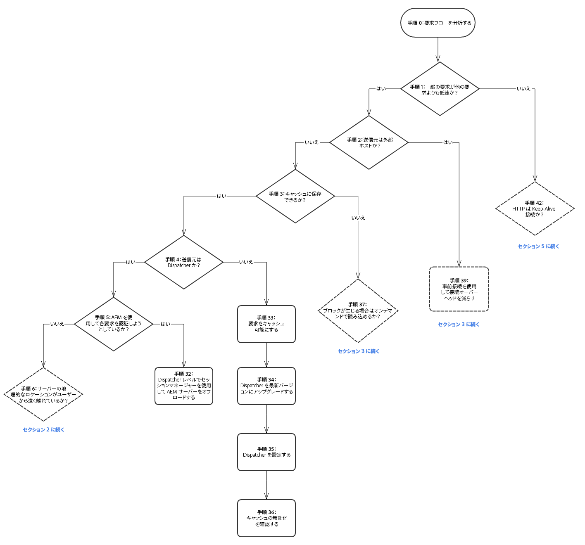
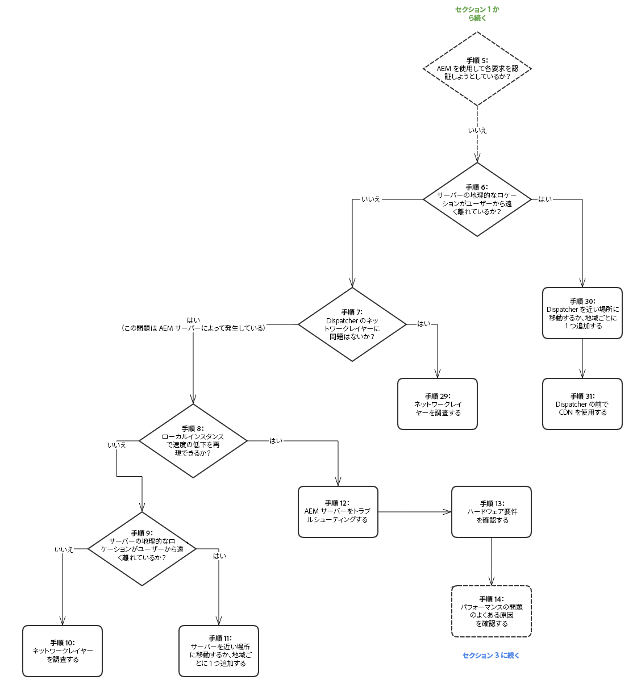
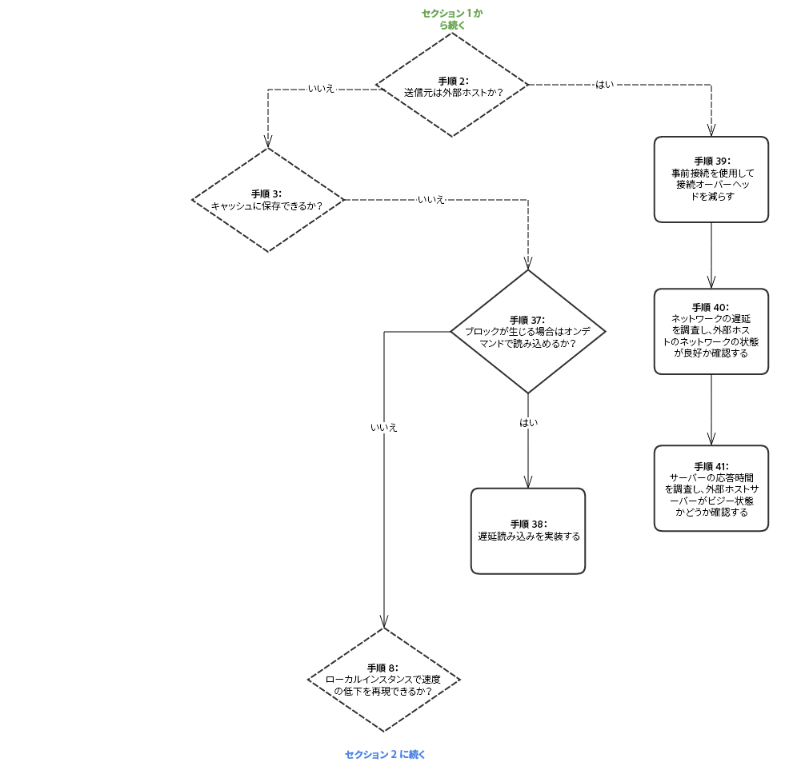
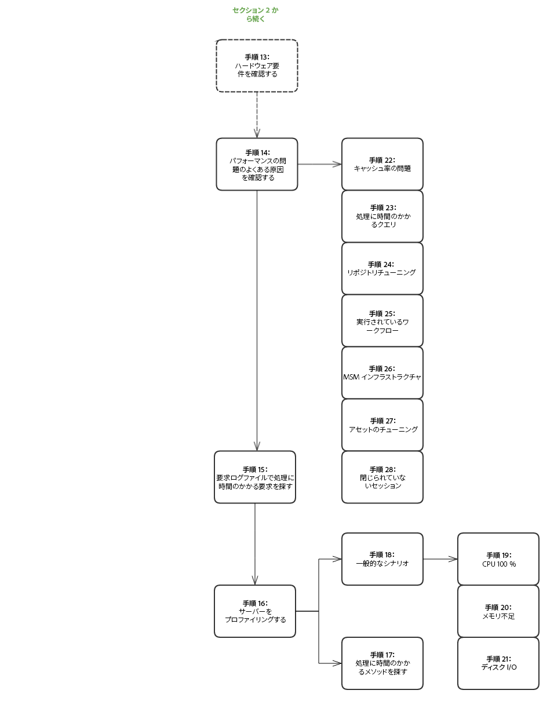
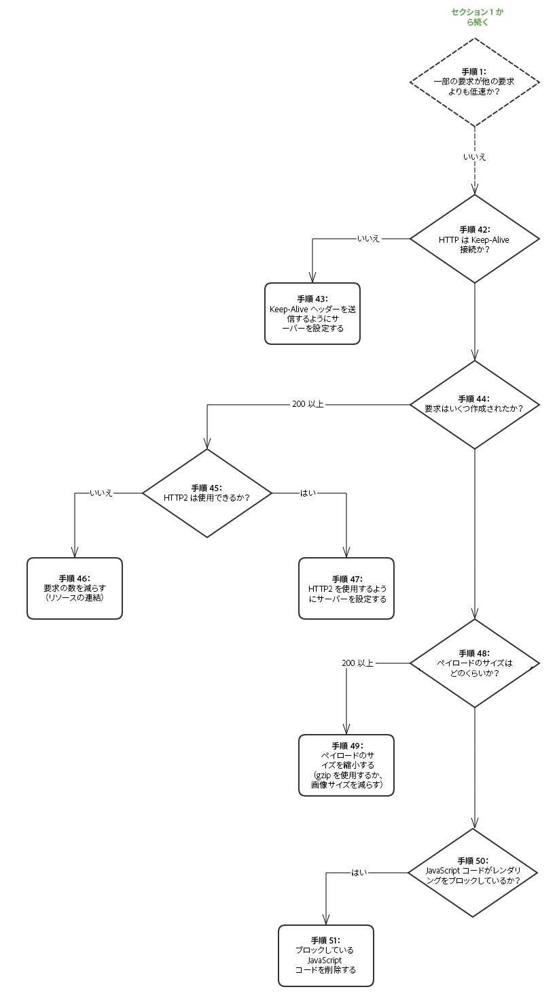

# パフォーマンスツリー{#performance-tree}

## 対象範囲 {#scope}

以下の図は、パフォーマンスの問題をトラブルシューティングするために実行する必要がある手順のガイダンスを示しています。読みやすくするために、これは 5 つのセクションに分けられています。

図の各手順は、ドキュメントリソースまたは推奨事項にリンクされています。

## 前提条件と想定事項 {#prerequisites-and-assumptions}

パフォーマンスの問題は特定のページ（AEM コンソールまたは Web ページ）で発生し、かつ一貫して再現可能であることを想定しています。パフォーマンスをテストまたは監視するための手段があることが、調査を始めるための前提条件となります。

分析は手順 0 から開始されます。目的は、パフォーマンスの問題の原因であるエンティティ（Dispatcher、外部ホストまたは AEM）を特定し、調査する必要がある領域（サーバーまたはネットワーク）を判別することです。

### セクション 1 {#section}

### セクション 2 {#section-1}

### セクション 3 {#section-2}

### セクション 4 {#section-3}

### セクション 5 {#section-4}

## 参照リンク {#reference-links}

<table>
 <tbody>
  <tr>
   <td><strong>ステップ</strong></td>
   <td><strong>タイトル</strong></td>
   <td><strong>リソース</strong></td>
  </tr>
  <tr>
   <td><strong>手順 0</strong></td>
   <td>要求フローを分析します</td>
   <td>
ブラウザーで標準 HTTP 要求分析を使用して、要求フローを分析できます。Chrome でこの手順を実行する方法の詳細は、以下を参照してください。  
 
<a href="https://developers.google.com/web/tools/chrome-devtools/profile/network-performance/resource-loading">https://developers.google.com/web/tools/chrome-devtools/profile/network-performance/resource-loading</a><a href="https://developers.google.com/web/tools/chrome-devtools/profile/network-performance/understanding-resource-timing">  https://developers.google.com/web/tools/chrome-devtools/profile/network-performance/understanding-resource-timing</a>  
 </td>
  </tr>
  <tr>
   <td><strong>ステップ 2</strong></td>
   <td>要求の送信元は外部ホストですか</td>
   <td>ブラウザーで標準 HTTP 要求分析を使用して、要求フローを分析できます。Chrome でこの手順を実行する方法は、上記のリンクを参照してください。  </td>
  </tr>
  <tr>
   <td><strong>ステップ 3</strong></td>
   <td>要求をキャッシュに保存できますか</td>
   <td>キャッシュ可能な要求の詳細および一般的な Dispatcher のパフォーマンス最適化に関するアドバイスは、<a href="/help/sites-deploying/configuring-performance.md#optimizing-performance-when-using-the-dispatcher">Dispatcher のパフォーマンス最適化</a>を参照してください。</td>
  </tr>
  <tr>
   <td><strong>ステップ 4</strong></td>
   <td>要求の送信元は Dispatcher ですか</td>
   <td>
<a href="https://helpx.adobe.com/experience-manager/dispatcher/using/dispatcher-configuration.html#debugging">Dispatcher のデバッグドキュメント</a>を参照して、要求が正しくキャッシュされているか確認してください。  
 </td>
  </tr>
  <tr>
   <td><strong>ステップ 5</strong></td>
   <td>Dispatcher は AEM を使用して各要求を認証しようとしていますか</td>
   <td>Dispatcher が、キャッシュされたリソースを配信する前に、認証のために <code>HEAD</code> 要求を AEM に送信しているかどうか確認します。これをおこなうには、AEM の <code>HEAD</code> で <code>access.log</code> 要求を確認します。詳しくは、<a href="/help/sites-deploying/configure-logging.md">ログ</a>を参照してください。  </td>
  </tr>
  <tr>
   <td><strong>ステップ 6</strong></td>
   <td>Dispatcher の地理的なロケーションがユーザーから遠く離れていますか</td>
   <td>Dispatcher をユーザーの近くに移動します。</td>
  </tr>
  <tr>
   <td><strong>手順 7</strong></td>
   <td>Dispatcher のネットワークレイヤーに問題はありませんか</td>
   <td>  ネットワークレイヤーで、飽和および遅延の問題がないかどうかを調べます。
 
 </td>
  </tr>
  <tr>
   <td><strong>手順 8</strong></td>
   <td>ローカルインスタンスで速度の低下を再現できますか</td>
   <td>  
<a href="/help/sites-developing/tough-day.md">Tough Day</a> を使用して、実稼動インスタンスから「実際の」状況を再現します。使用する開発環境でこのことが現実的でない場合は、別のネットワークコンテキストで実稼動インスタンス（または同一のステージングインスタンス）をテストしてください。  
 </td>
  </tr>
  <tr>
   <td><strong>手順 9</strong></td>
   <td>サーバーの地理的なロケーションがユーザーから遠く離れていますか</td>
   <td>サーバーをユーザーに近い場所に移動します。</td>
  </tr>
  <tr>
   <td><strong>手順 10 および 29</strong></td>
   <td>ネットワークレイヤーを調査します</td>
   <td>
ネットワークレイヤーで、飽和および遅延の問題がないかどうかを調べます。
 
オーサー層の場合は、遅延が 100 ミリ秒を超えないことが推奨されます。
 
パフォーマンスの最適化に関するヒントについて詳しくは、<a href="https://helpx.adobe.com/jp/experience-manager/kb/performance-tuning-tips.html">このページ</a>を参照してください。
 </td>
  </tr>
  <tr>
   <td><strong>手順 11</strong></td>
   <td>サーバーを近い場所に移動するか、地域ごとに 1 つ追加します</td>
   <td> </td>
  </tr>
  <tr>
   <td><strong>手順 12</strong></td>
   <td>AEM サーバーをトラブルシューティングします</td>
   <td>詳しくは、以下の図のサブ手順を参照してください。</td>
  </tr>
  <tr>
   <td><strong>手順 13</strong></td>
   <td>ハードウェア要件を確認します</td>
   <td><a href="/help/managing/hardware-sizing-guidelines.md">ハードウェアのサイズ決定のガイドライン</a>に関するドキュメントを参照してください。  </td>
  </tr>
  <tr>
   <td><strong>手順 14</strong></td>
   <td>パフォーマンスの問題のよくある原因を確認します</td>
   <td> </td>
  </tr>
  <tr>
   <td><strong>手順 15</strong></td>
   <td>処理に時間のかかる要求を見つけます</td>
   <td>
<code>request.log</code> を分析するか、<code>rlog.jar</code> を使用して、処理に時間のかかる要求を確認できます。
 
rlog.jar の使用方法について詳しくは、このページを参照してください。
 
<a href="/help/sites-deploying/monitoring-and-maintaining.md#using-rlog-jar-to-find-requests-with-long-duration-times">rlog.jar を使用した所要時間の長い要求の検索</a>を参照してください。  
 
 
 </td>
  </tr>
  <tr>
   <td><strong>手順 16</strong></td>
   <td>サーバーをプロファイリングします</td>
   <td>
AEM で使用できるプロファイリングツールについて詳しくは、<a href="/help/sites-deploying/monitoring-and-maintaining.md#tools-for-monitoring-and-analyzing-performance">パフォーマンスの監視および分析のツール</a>を参照してください。  
 </td>
  </tr>
  <tr>
   <td><strong>手順 17</strong></td>
   <td>プロファイリングで処理に時間のかかるメソッドを見つけます</td>
   <td> </td>
  </tr>
  <tr>
   <td><strong>手順 18</strong></td>
   <td>プロファイリングの一般的なシナリオ</td>
   <td>パフォーマンスの最適化の節で、<a href="/help/sites-deploying/monitoring-and-maintaining.md#analyzing-specific-scenarios">具体的なシナリオの分析</a>を参照してください。  </td>
  </tr>
  <tr>
   <td><strong>手順 19</strong></td>
   <td>CPU 100 ％</td>
   <td><a href="/help/sites-deploying/monitoring-and-maintaining.md#monitoring-performance">https://helpx.adobe.com/experience-manager/6-3/sites-deploying/monitoring-and-maintaining.html#MonitoringPerformance</a></td>
  </tr>
  <tr>
   <td><strong>手順 20</strong></td>
   <td>メモリ不足</td>
   <td> 
    <ol>
     <li><a href="/help/sites-deploying/monitoring-and-maintaining.md#out-of-memory">メモリ不足</a></li>
     <li><a href="/help/sites-deploying/troubleshooting.md">アプリケーションからメモリ不足エラーがスローされる</a></li>
     <li><a href="https://helpx.adobe.com/experience-manager/kb/AnalyzeMemoryProblems.html">Helpx で「メモリの問題の分析」を参照してください。</a>  </li>
    </ol> </td>
  </tr>
  <tr>
   <td><strong>手順 21</strong></td>
   <td>ディスク I/O</td>
   <td>
監視およびメンテナンスのドキュメントで、<a href="/help/sites-deploying/monitoring-and-maintaining.md#disk-i-o">ディスク I/O</a> の節を参照してください。
 </td>
  </tr>
  <tr>
   <td><strong>手順 22 および 22.1</strong></td>
   <td>キャッシュ率</td>
   <td><a href="/help/sites-deploying/configuring-performance.md#calculating-the-dispatcher-cache-ratio">Dispatcher のキャッシュ率の計算</a>を参照してください。    </td>
  </tr>
  <tr>
   <td><strong>手順 23</strong></td>
   <td>処理に時間のかかるクエリ</td>
   <td><a href="/help/sites-deploying/best-practices-for-queries-and-indexing.md">クエリとインデックスに関するベストプラクティス</a></td>
  </tr>
  <tr>
   <td><strong>手順 24</strong></td>
   <td>リポジトリチューニング</td>
   <td>
    <ul>
     <li><a href="https://helpx.adobe.com/jp/experience-manager/kb/performance-tuning-tips.html">パフォーマンスチューニングのヒント</a></li>
     <li><a href="/help/sites-deploying/configuring-performance.md#configuring-for-performance">パフォーマンスの設定</a></li>
     <li><a href="https://www.slideshare.net/jukka/repository-performance-tuning">Repository Performance Tuning</a></li>
    </ul> </td>
  </tr>
  <tr>
   <td><strong>手順 25</strong></td>
   <td>実行されているワークフロー</td>
   <td>
    <ul>
     <li><a href="/help/sites-deploying/configuring-performance.md#concurrent-workflow-processing">ワークフローの同時処理</a></li>
     <li><a href="/help/sites-deploying/configuring-performance.md#configure-the-queue-for-a-specific-workflow">特定のワークフロー用のキューの設定</a></li>
     <li><a href="/help/sites-administering/workflows-administering.md#regular-purging-of-workflow-instances">ワークフローインスタンスの定期的なパージ</a></li>
     <li><a href="/help/sites-developing/workflows.md#transient-workflows">一時的なワークフロー</a>  </li>
    </ul> 
 
 </td>
  </tr>
  <tr>
   <td><strong>手順 26</strong></td>
   <td>MSM インフラストラクチャ</td>
   <td>
<a href="/help/sites-administering/msm-best-practices.md">Multi Site Manager のベストプラクティス</a>  
 </td>
  </tr>
  <tr>
   <td><strong>手順 27</strong></td>
   <td>アセットのチューニング</td>
   <td>
    <ol>
     <li><a href="/help/sites-deploying/configuring-performance.md#cq-dam-asset-synchronization-service">アセット同期サービス</a></li>
     <li><a href="/help/sites-deploying/configuring-performance.md#multiple-dam-instances">複数の DAM インスタンス</a></li>
     <li><a href="https://helpx.adobe.com/jp/experience-manager/kb/performance-tuning-tips.html">こちら</a>および<a href="https://helpx.adobe.com/jp/experience-manager/kb/performance-tuning-tips.html">こちら</a>にあるパフォーマンスチューニングのヒントに関する記事  </li>
    </ol> </td>
  </tr>
  <tr>
   <td><strong>手順 28</strong></td>
   <td>閉じられていないセッション</td>
   <td>
 
 
<a href="/help/sites-administering/troubleshoot.md#checking-for-unclosed-jcr-sessions">閉じられていない JCR セッションの確認</a>
 
 
 </td>
  </tr>
  <tr>
   <td><strong>手順 30</strong></td>
   <td>Dispatcher を近くに移動します（または地域ごとに 1 つ追加します）</td>
   <td> </td>
  </tr>
  <tr>
   <td><strong>手順 31</strong></td>
   <td>Dispatcher の前で CDN を使用します</td>
   <td><a href="https://helpx.adobe.com/experience-manager/dispatcher/using/dispatcher.html#using-dispatcher-with-a-cdn">CDN での Dispatcher の使用</a>  </td>
  </tr>
  <tr>
   <td><strong>手順 32</strong></td>
   <td>Dispatcher レベルでセッション管理を使用して AEM サーバーをオフロードします</td>
   <td>
<a href="https://helpx.adobe.com/experience-manager/dispatcher/using/dispatcher-configuration.html#enabling-secure-sessions-sessionmanagement">セキュアセッションの有効化</a>
 </td>
  </tr>
  <tr>
   <td><strong>手順 33</strong></td>
   <td>要求をキャッシュ可能にします</td>
   <td>
    <ol>
     <li><a href="https://helpx.adobe.com/experience-manager/dispatcher/using/dispatcher.html">一般的な Dispatcher 設定</a></li>
     <li><a href="https://helpx.adobe.com/experience-manager/dispatcher/using/dispatcher-configuration.html#configuring-the-dispatcher-cache-cache">Dispatcher キャッシュの設定</a></li>
    </ol> 
キャッシュ率を向上させるには、要求をキャッシュ可能にします（Dispatcher のベストプラクティス）。
 
また、キャッシュ設定を最適化するために、以下の設定も考慮してください。  

    <ol>
     <li>GET 以外の HTTP 要求にキャッシュなしルールを設定する</li>
     <li>クエリ文字列をキャッシュ不可に設定する</li>
     <li>拡張子がない URL をキャッシュしない</li>
     <li>認証ヘッダーをキャッシュする（Dispatcher バージョン 4.1.10 以降で可能）</li>
    </ol> </td>
  </tr>
  <tr>
   <td><strong>手順 34</strong></td>
   <td>Dispatcher のバージョンをアップグレードします</td>
   <td>
最新バージョンの Dispatcher は、次の場所でダウンロードできます。
 
<a href="https://helpx.adobe.com/jp/experience-manager/dispatcher/release-notes.html">リンクをたどる</a>
 </td>
  </tr>
  <tr>
   <td><strong>手順 35</strong></td>
   <td>Dispatcher を設定します</td>
   <td><a href="https://helpx.adobe.com/jp/experience-manager/dispatcher/using/dispatcher-configuration.html">Dispatcher の設定</a>  </td>
  </tr>
  <tr>
   <td><strong>手順 36</strong></td>
   <td>キャッシュの無効化を確認します</td>
   <td> 
    <ul>
     <li><a href="https://helpx.adobe.com/experience-manager/dispatcher/using/page-invalidate.html#invalidating-dispatcher-cache-from-the-authoring-environment">オーサー層のキャッシュ無効化</a></li>
     <li><a href="https://helpx.adobe.com/experience-manager/dispatcher/using/page-invalidate.html#invalidating-dispatcher-cache-from-a-publishing-instance">パブリッシュ層のキャッシュ無効化</a></li>
    </ul> </td>
  </tr>
  <tr>
   <td><strong>手順 37 および 38</strong></td>
   <td>読み込みに時間がかかる</td>
   <td><a href="https://docs.adobe.com/ddc/ja/gems/aem-web-performance.html">AEM Web パフォーマンスに関する Gem セッションを参照してください。</a>  </td>
  </tr>
  <tr>
   <td><strong>手順 39</strong></td>
   <td>事前接続を使用して接続オーバーヘッドを減らします</td>
   <td>上記の Gem セッションを参照してください。また、W3c にも preconnect に関する記載があります。<a href="https://www.w3.org/TR/resource-hints/#dfn-preconnect"> https://www.w3.org/TR/resource-hints/#dfn-preconnect</a></td>
  </tr>
  <tr>
   <td><strong>手順 40 および 41</strong>  </td>
   <td>外部ホストの遅延および応答時間</td>
   <td>外部ホストの遅延および応答時間を調べます。</td>
  </tr>
  <tr>
   <td><strong>手順 45  および 47</strong>  </td>
   <td>HTTP/2 の使用</td>
   <td>手順 37、38 および 39 の Gem セッションを参照してください。Also, check out <a href="https://help-forums.adobe.com/content/adobeforums/en/experience-manager-forum/adobe-experience-manager.topic.html/forum__kdzc-does_anyoneknowwhe.html">this</a> forum post on HTTP/2 support.  </td>
  </tr>
  <tr>
   <td><strong>手順 49</strong></td>
   <td>ペイロードのサイズを縮小します</td>
   <td><a href="/help/sites-deploying/osgi-configuration-settings.md">Gzip を有効化</a>して、<a href="https://docs.adobe.com/ddc/ja/gems/aem-web-performance.html">画像サイズを縮小します</a>。  </td>
  </tr>
  <tr>
   <td><strong>手順 42 および 43</strong></td>
   <td>Keep-Alive</td>
   <td>
接続を再利用するために、異なる複数の要求に <code>Keep-Alive</code> ヘッダーが存在しますか。存在しない場合は、要求ごとに別の接続が確立され、不要なオーバーヘッドが発生します。（ブラウザーでの標準 HTTP 要求分析）
 
<a href="/help/sites-administering/proxy-jar.md">プロキシサーバーツール</a>で、Keep-Alive 接続を確認できます。  
 </td>
  </tr>
  <tr>
   <td><strong>手順 44</strong></td>
   <td>要求はいくつ作成されましたか</td>
   <td>ブラウザーで標準 HTTP 要求分析を実行します。</td>
  </tr>
  <tr>
   <td><strong>手順 46</strong></td>
   <td>要求の数を減らします</td>
   <td>
    <ol>
     <li>リソースの連結（画像、CSS スプライト、JSON など）  </li>
     <li>clientlibs の埋め込み
      <ol>
       <li><a href="/help/sites-developing/clientlibs.md#creating-client-library-folders">クライアントライブラリフォルダーの作成</a> — リクエストを最小限に抑えるための埋め込みの使用を参照してください。</li>
      </ol> </li>
    </ol> </td>
  </tr>
  <tr>
   <td><strong>手順 48</strong></td>
   <td>ペイロードのサイズはどのくらいですか</td>
   <td>ブラウザーの標準 HTTP 要求分析</td>
  </tr>
  <tr>
   <td><strong>手順 50 および 51</strong></td>
   <td>JS コードがブロックされています</td>
   <td><a href="https://docs.adobe.com/ddc/ja/gems/aem-web-performance.html">https://docs.adobe.com/ddc/ja/gems/aem-web-performance.html</a></td>
  </tr>
 </tbody>
</table>

