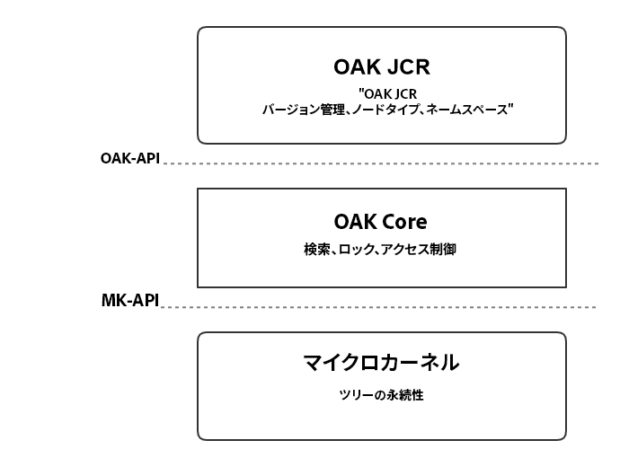
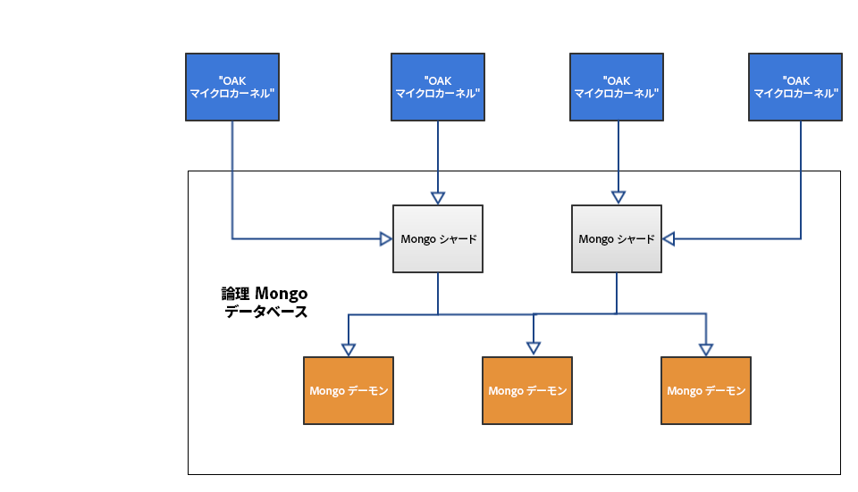

# AEM プラットフォームの概要{#introduction-to-the-aem-platform}

AEM 6 の AEM プラットフォームは、Apache Jackrabbit Oak に基づいています。

Apache Jackrabbit Oak は、昨今の世界規模の Web サイトおよび要求の厳しいその他のコンテンツアプリケーションの基盤として使用する、スケーラビリティとパフォーマンスに優れた階層構造のコンテンツリポジトリを実装するための取り組みです。

これはJackrabbit 2の後継で、AEM 6ではコンテンツリポジトリCRXのデフォルトバックエンドとして使用されます。

## 設計の原則と目的 {#design-principles-and-goals}

Oak は [JSR-283](https://www.day.com/day/en/products/jcr/jsr-283.html)（JCR 2.0）仕様を実装します。その設計の主な目的は次のとおりです。

* 大規模なリポジトリのサポートの強化
* 高可用性を確保するための複数の分散クラスターノード
* パフォーマンスの強化
* 多数の子ノードおよびアクセス制御レベルのサポート

## アーキテクチャの概念 {#architecture-concept}

### ストレージ {#storage}

ストレージレイヤーの目的は次のとおりです。

* ツリーモデルを実装する
* ストレージを接続可能にする
* クラスター化メカニズムを提供する

### Oak Core {#oak-core}

Oak Core は、ストレージレイヤーに複数のレイヤーを追加します。

* アクセスレベル制御
* 検索およびインデックス作成
* 監視

### Oak JCR {#oak-jcr}

Oak JCR の主な目的は、JCR セマンティクスをツリー操作に変換することです。また、次の役割も果たします。

* JCR API の実装
* JCR の制約を実装するコミットフックの格納

また、Oak JCR の概念の一部として、Java 以外の実装も可能になりました。

## ストレージの概要 {#storage-overview}

Oak ストレージレイヤーは、コンテンツの実際のストレージに抽象化レイヤーを提供します。

Currently, there are two storage implementations available in AEM6: **Tar Storage** and **MongoDB Storage**.

### Tar ストレージ {#tar-storage}

Tar ストレージでは tar ファイルを使用します。このストレージは、規模の大きいセグメント内の様々なタイプのレコードとしてコンテンツを格納します。リポジトリの最新の状態の追跡にはジャーナルが使用されます。

設計の中心となる重要な原則を次に示します。

* **不変のセグメント**

コンテンツは、最大 256 KiB のサイズのセグメントに格納されます。このセグメントは不変であり、そのため、頻繁にアクセスされるセグメントを簡単にキャッシュして、リポジトリの破損につながるシステムエラーを削減できます。

各セグメントは一意の識別子（UUID）によって識別されます。各セグメントには、コンテンツツリーの連続したサブセットが格納されます。また、セグメントは他のコンテンツを参照できます。各セグメントには、参照先の他のセグメントの UUID のリストが保持されます。

* **ローカル性**

通常、関連するレコード（ノードやその直下の子など）は同じセグメントに格納されます。これにより、リポジトリの検索が迅速化され、セッションごとに複数の関連ノードにアクセスする一般的なクライアントの大部分のキャッシュミスを回避できます。

* **コンパクト性**

I/O コストを削減し、可能な限りキャッシュにコンテンツを収めるように、レコードの形式がサイズに合わせて最適化されます。

### Mongo ストレージ {#mongo-storage}

MongoDB ストレージは、MongoDB を活用してシャーディングとクラスター化をおこないます。リポジトリツリーは 1 つの MongoDB データベースに保持されます。このデータベースでは、各ノードは個別のドキュメントになります。

このストレージには、次に示すいくつかの特徴があります。

* リビジョン

コンテンツの更新（コミット）ごとに、新しいリビジョンが作成されます。基本的に、リビジョンは次の 3 つの要素で構成される文字列です。

1. リビジョンを生成したマシンのシステム時刻に由来するタイムスタンプ
1. 同じタイムスタンプを使用して作成されたリビジョンを区別するためのカウンター
1. リビジョンが作成されたクラスターノードの ID

* ブランチ

ブランチがサポートされます。ブランチを使用すると、クライアントで複数の変更をステージングして、それらを 1 回のマージの呼び出しで表示できます。

* 以前のドキュメント

MongoDB ストレージは、変更のたびにデータをドキュメントに追加します。ただし、クリーンアップが明示的にトリガーされた場合は、データの削除だけをおこないます。特定のしきい値を満たすと、古いデータが移動されます。以前のドキュメントには、不変のデータだけが格納されます。つまり、コミットおよびマージ済みのリビジョンだけが格納されます。

* クラスターノードのメタデータ

クラスターの操作を容易におこなうために、アクティブおよび非アクティブなクラスターノードに関するデータがデータベースに保持されます。

MongoDB ストレージを使用した一般的な AEM クラスターのセットアップは次のようになります。

## What is different from Jackrabbit 2? {#what-is-different-from-jackrabbit}

Oak は JCR 1.0 標準との下位互換性を確保するように設計されているので、ユーザーレベルでの変更はほとんどありません。ただし、Oak ベースの AEM インストールをセットアップする場合に考慮しなければならない顕著な違いがいくつか存在します。

* Oak ではインデックスが自動作成されません。そのため、必要に応じてカスタムインデックスを作成する必要があります。
* セッションが常にリポジトリの最新の状態を反映する Jackrabbit 2 とは異なり、Oak を使用すると、セッションの取得時からのリポジトリの固定の表示が反映されます。これは、Oak が MVCC モデルを基盤としているためです。
* 同じ名前の兄弟（SNS）は Oak ではサポートされません。

## プラットフォーム関連のその他のドキュメント {#other-platform-related-documentation}

AEM プラットフォームについて詳しくは、以下の記事も参照してください。

* [AEM 6 でのノードストアとデータストアの設定](/help/sites-deploying/data-store-config.md)
* [Oak クエリとインデックス作成](/help/sites-deploying/queries-and-indexing.md)
* [AEM 6 のストレージ要素](/help/sites-deploying/storage-elements-in-aem-6.md)
* [MongoDB を備えた AEM](/help/sites-deploying/aem-with-mongodb.md)

