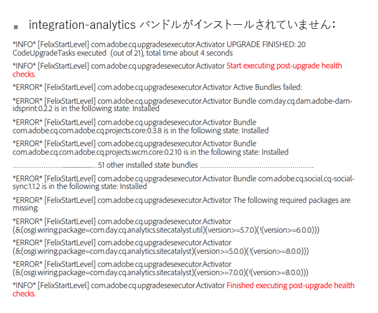

# アップグレード後のチェックおよびトラブルシューティング{#post-upgrade-checks-and-troubleshooting}

## アップグレード後のチェック {#post-upgrade-checks}

[インプレースアップグレード](/help/sites-deploying/in-place-upgrade.md)の後に、次のアクティビティを実行してアップグレードを完了する必要があります。AEM を 6.5 jar で起動し、アップグレードされたコードベースがデプロイされていることを前提としています。

* [ログでアップグレードの成功を確認](#main-pars-header-290365562)

* [OSGi バンドルの確認](#main-pars-header-1637350649)

* [Oak バージョンの確認](#main-pars-header-1293049773)

* [PreUpgradeBackup フォルダーの検査](#main-pars-header-988995987)

* [ページの初期検証](#main-pars-header-20827371)
* [AEM サービスパックの適用](#main-pars-header-215142387)

* [AEM 機能の移行](#main-pars-header-1434457709)

* [スケジュールされたメンテナンス設定の確認](#main-pars-header-1552730183)

* [レプリケーションエージェントの有効化](#main-pars-header-823243751)

* [スケジュール済みカスタムジョブの有効化](#main-pars-header-244535083)

* [テスト計画の実行](#main-pars-header-1167972233)

### ログでアップグレードの成功を確認 {#verify-logs-for-upgrade-success}

**upgrade.log**

以前は、インスタンスのアップグレード後の状態を調べるには、さまざまなログファイル、リポジトリおよび Launchpad の各部を注意深く検査する必要がありました。アップグレード後のレポートを生成すると、不具合があるアップグレードを稼動前に検出できることがあります。

この機能の主な目的は、アップグレードの成功を確認するために必要な、手動による解釈や複数のエンドポイントにわたる複雑な解析ロジックの必要性を減らすことです。このソリューションは、アップグレードの成功または確認された失敗に外部自動システムが反応するための明確な情報を提供することを目的としています。

具体的には、次のことがおこなわれます。

* アップグレードフレームワークによって検出されたアップグレードの失敗が単一のアップグレードレポートにまとめて報告されます。
* アップグレードレポートには、手動で対応する必要がある事項が記載されています。

これに対応するために、`upgrade.log` ファイルにログを生成する方法が変更されました。

アップグレード中にエラーが発生しなかったことを示すサンプルレポートを次に示します。


アップグレードプロセスでインストールされなかったバンドルを示すサンプルレポートを次に示します。



**error.log**

error.log は、ターゲットバージョンの jar を使用した AEM の起動時および起動後に注意深く確認する必要があります。すべての警告やエラーを確認する必要があります。一般に、ログの先頭で問題を探すことをお勧めします。ログの後半で発生したエラーは、実際はファイルの前の方で発生した根本原因の副次的な影響である場合があります。エラーや警告が繰り返し発生する場合は、以下の[アップグレードによる問題の分析](/help/sites-deploying/post-upgrade-checks-and-troubleshooting.md#analyzing-issues-with-the-upgrade)を参照してください。

### OSGi バンドルの確認 {#verify-osgi-bundles}

Navigate to the OSGi console `/system/console/bundles` and look to see if any bundles are not started. If any bundles are in an installed state consult the `error.log` to determine root issue.

### Oak バージョンの確認 {#verify-oak-version}

アップグレード後に、Oak バージョンが **1.10.2** に更新されていることを確認する必要があります。Oakバージョンを確認するには、OSGiコンソールに移動し、Oakバンドルに関連付けられているバージョンを確認します。Oak Core、Oak Commons、Oak Segment Tar。

### PreUpgradeBackup フォルダーの検査 {#inspect-preupgradebackup-folder}

During the upgrade AEM will attempt to backup customizations and store them beneath `/var/upgrade/PreUpgradeBackup/<time-stamp-of-upgrade>`. このフォルダーを CRXDE Lite で表示するには、[CRXDE Lite を一時的に有効にする](/help/sites-administering/enabling-crxde-lite.md)ことが必要となります。

タイムスタンプがあるフォルダーには、`mergeStatus` という名前のプロパティがあり、`COMPLETED` という値である必要があります。**to-process** フォルダーは空であり、**overwritten** ノードはアップグレード中に上書きされたノードを示している必要があります。**leftovers** ノードの下のコンテンツは、アップグレード中に安全に統合できなかったコンテンツを示します。実装が（アップグレードされたコードパッケージによってまだインストールされていない）いずれかの子ノードに依存している場合は、それらの子ノードを手動で統合する必要があります。

ステージング環境または実稼動環境の場合は、この作業の後に CRXDE Lite を無効にします。

### ページの初期検証 {#initial-validation-of-pages}

AEM の複数のページに対して初期検証を実行します。If upgrading an Author environment open the Start page and Welcome page ( `/aem/start.html`, `/libs/cq/core/content/welcome.html`). オーサー環境とパブリッシュ環境の両方で、アプリケーションページをいくつか開き、正しくレンダリングされるかどうかスモークテストをおこないます。問題が発生した場合は、`error.log` を調べてトラブルシューティングをおこないます。

### AEM サービスパックの適用 {#apply-aem-service-packs}

関連する AEM 6.5 のサービスパックがリリースされていたら、それらをすべて適用します。

### AEM 機能の移行 {#migrate-aem-features}

AEM のいくつかの機能では、アップグレード後に追加の手順をおこなう必要があります。これらの機能の完全な一覧およびこれらの機能を AEM 6.5 に移行する手順については、[コードのアップグレードとカスタマイズ](/help/sites-deploying/upgrading-code-and-customizations.md)のページを参照してください。

### スケジュールされたメンテナンス設定の確認 {#verify-scheduled-maintenance-configurations}

#### データストアのガベージコレクションの有効化 {#enable-data-store-garbage-collection}

ファイルデータストアを使用している場合は、データストアのガベージコレクションタスクが有効になっていて、週別メンテナンスリストに追加されていることを確認します。Instructions are outlined [here](/help/sites-administering/data-store-garbage-collection.md).

>[!NOTE]
>
>S3 カスタムデータストアのインストール環境の場合、または共有データストアを使用している場合、この手順はお勧めしません。

#### オンラインでのリビジョンクリーンアップの有効化 {#enable-online-revision-cleanup}

MongoMK または新しい TarMK セグメント形式を使用している場合は、リビジョンクリーンアップタスクが有効になっていて、日別メンテナンスリストに追加されていることを確認します。手順は[こちら](/help/sites-deploying/revision-cleanup.md)を参照してください。

### テスト計画の実行 {#execute-test-plan}

[コードのアップグレードとカスタマイズ](/help/sites-deploying/upgrading-code-and-customizations.md)の&#x200B;**手順のテスト**&#x200B;の節で定義されているとおりに詳細なテスト計画を実行します。

### レプリケーションエージェントの有効化 {#enable-replication-agents}

パブリッシュ環境を完全にアップグレードして検証したら、オーサー環境でレプリケーションエージェントを有効にします。エージェントがそれぞれのパブリッシュインスタンスに接続できることを確認します。イベントの順序について詳しくは、[アップグレード手順](/help/sites-deploying/upgrade-procedure.md)を参照してください。

### スケジュール済みカスタムジョブの有効化 {#enable-custom-scheduled-jobs}

コードベースの一部としてのスケジュール済みジョブをこの時点で有効にすることができます。

## アップグレードによる問題の分析 {#analyzing-issues-with-upgrade}

ここでは、AEM 6.3 へのアップグレード手順で発生する可能性のある問題のシナリオを説明します。

これらのシナリオは、アップグレードに関連する問題の根本原因を追跡するのに役立ちます。また、プロジェクトや製品に固有の問題を識別するためにも役立ちます。

### リポジトリ移行の失敗  {#repository-migration-failing-}

CRX2 から Oak へのデータ移行は、CQ 5.4 ベースのソースインスタンスから開始されるすべてのシナリオで実現可能です。`repository.xml` の準備を含むこのドキュメントのアップグレード手順に正確に従っていること、JAAS 経由でカスタム認証を起動していないこと、および移行を始める前にインスタンスに不整合がないかをチェックしていることを確認してください。

それでも移行が失敗する場合は、`upgrade.log` を調査して根本原因を解明することができます。未知の問題の場合は、カスタマーサポートに報告してください。

### アップグレードが実行されない {#the-upgrade-did-not-run}

準備手順を開始する前に、まず java -jar aem-quickstart.jar コマンドを使用して、**ソース**&#x200B;インスタンスを実行します。これは、quickstart.properties ファイルを正しく生成するために必要な手順です。このファイルがないと、アップグレードはうまくいきません。あるいは、ソースインスタンスのインストールフォルダーの `crx-quickstart/conf` の下を探して、このファイルが存在するかどうかを確認します。また、アップグレードを開始するために AEM を起動する際、java -jar aem-quickstart.jar コマンドを使用して実行する必要があります。起動スクリプトから起動した場合、AEM はアップグレードモードで起動しません。

### パッケージとバンドルを更新できない  {#packages-and-bundles-fail-to-update-}

アップグレード中にパッケージがインストールされなかった場合は、パッケージに含まれるバンドルも更新されません。このような問題は、通常はデータストアの設定の誤りが原因です。また、この問題は、error.log に **ERROR**&#x200B;および **WARN** メッセージとして表示されます。通常、この問題が起きているときはデフォルトのログインが動作しないので、直接 CRXDE を使用して設定の問題を調査、解明することになります。

### 一部の AEM バンドルがアクティブな状態に切り替わらない {#some-aem-bundles-are-not-switching-to-the-active-state}

バンドルが起動しない場合は、未解決の依存関係がないかを確認してください。

パッケージのインストールが失敗したせいでバンドルがアップグレードされず、その結果、新しいバージョンとの互換性がないと見なされ、この問題につながっている可能性もあります。このトラブルシューティングの方法について詳しくは、前述の&#x200B;**パッケージとバンドルを更新できない**&#x200B;を参照してください。

また、新規 AEM 6.5 インスタンスのバンドル一覧とアップグレード後のバンドル一覧を比較して、アップグレードされていないバンドルを検出することを推奨します。この比較によって、`error.log` で検索すべき問題を絞り込むことができます。

### カスタムバンドルがアクティブな状態に切り替わらない {#custom-bundles-not-switching-to-the-active-state}

カスタムバンドルがアクティブな状態に切り替わらない場合は、変更後の API をインポートしていないコードが存在する可能性が疑われます。これは多くの場合、未解決の依存関係につながります。

削除された API は、以前のいずれかのリリースで廃止対象としてマークされているはずです。このような廃止の注記に、コードの直接的な移行に関する指示が含まれている場合があります。アドビはバージョン番号にできる限り意味を持たせるようにしており、バージョンが変わるときは互換性を破る変更がおこなわれている可能性があります。

また、問題の原因となった変更点が本当に必要であるかを確認し、不要なものであればその変更を元に戻すことをお勧めします。パッケージのエクスポートのバージョンが必要以上に増えていないかを確認し、厳密な意味のあるバージョン定義をおこなってください。

### プラットフォーム UI の異常 {#malfunctioning-platform-ui}

アップグレード後に特定の UI 機能が正しく動作していない場合は、まずインターフェイスのカスタムオーバーレイを確認します。一部の構造が変更され、オーバーレイを更新する必要があるか、オーバーレイが古くなっている可能性があります。

次に、クライアントライブラリに含まれているカスタムの追加拡張にまで追跡可能な JavaScript エラーが発生していないかを確認します。AEM レイアウトの問題を引き起こしている可能性があるカスタム CSS についても、同様の確認をおこないます。

最後に、JavaScript では対処できない設定の誤りがないかを確認します。これは通常、不適切にアクティベート解除された拡張により発生する問題です。

### カスタムコンポーネント、テンプレートまたは UI 拡張の異常 {#malfunctioning-custom-components-templates-or-ui-extensions}

ほとんどの場合、これらの問題の根本原因は、起動されていないバンドルやインストールされていないパッケージによる問題と同じですが、異なる点は、問題が最初にコンポーネントを使用した時点で発生することです。

問題のあるカスタムコードへの対処方法としては、まず原因を特定するためのスモークテストを実行します。Once you find it, look at the recommendations in this [link] section of the article for ways of fixing them.

### /etc の下にカスタマイズが存在しない{#missing-customizations-under-etc}

`/apps` とは、アップグレード `/libs` によって適切に処理されますが、での変更 `/etc` は、アップグレード後に手動で復元する必要がある場合があ `/var/upgrade/PreUpgradeBackup` ります。 手動で統合する必要があるコンテンツについては、この場所を確認してください。

### error.log と upgrade.log の分析 {#analyzing-the-error.log-and-upgrade.log}

ほとんどの状況では、問題の原因を特定するために、ログにエラーがないかを確認する必要があります。ただし、アップグレードの場合は、古いバンドルが適切にアップグレードされていない場合があるので、依存関係の問題を監視する必要もあります。

そのための最適な方法は、現在発生している問題には関係がないと思われるメッセージをすべて削除して、error.log の情報を削ることです。次のように grep などのツールを使用して実行できます。

```shell
grep -v UnrelatedErrorString
```

即座に内容がわからないエラーメッセージもあります。その場合は、そのエラーメッセージが発生しているコンテキストを確認すると、エラーの発生場所の理解に役立ちます。以下のように使用してエラーを区別することができます。

* `grep -B` エラーの前に行を追加する

または

* `grep -A` 」をクリックします。

警告メッセージにエラーが見つかることもあります。有効なケースがこの状態になってしまうこともあり、実際にエラーであるかどうかをアプリケーションが常に判断できるとは限りません。これらの警告メッセージについても確認してください。

### アドビサポートのご案内 {#contacting-adobe-support}

このページのアドバイスを実行しても問題が解決されない場合は、アドビサポートにご連絡ください。顧客の問題に対応するサポートエンジニアができるだけ多くの情報を得られるように、アップグレードの upgrade.log ファイルを含めてください。
