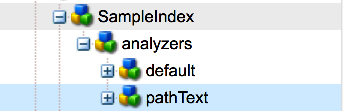

# Oak クエリとインデックス作成{#oak-queries-and-indexing}

>[!NOTE]
>
>この記事は、AEM 6 でのインデックス設定について説明しています。クエリおよびインデックス作成のパフォーマンスの最適化のベストプラクティスについては、[クエリとインデックスに関するベストプラクティス](/help/sites-deploying/best-practices-for-queries-and-indexing.md)を参照してください。

## 概要 {#introduction}

Jackrabbit 2 とは異なり、デフォルトでは、Oak はコンテンツのインデックスを作成しません。従来のリレーショナルデータベースと同様に、必要に応じてカスタムインデックスを作成する必要があります。特定のクエリのためのインデックスがない場合は、多数のノードが走査される可能性があります。クエリが機能しても非常に時間がかかる可能性があります。

Oak では、インデックスが使用されないクエリが実行されると、WARN レベルのログメッセージが出力されます。

```xml
*WARN* Traversed 1000 nodes with filter Filter(query=select ...) consider creating an index or changing the query
```

## サポートされているクエリ言語 {#supported-query-languages}

Oak クエリエンジンでは、次の言語がサポートされています。

* XPath（推奨）
* SQL-2
* SQL（廃止）
* JQOM

## インデクサーのタイプとコスト計算 {#indexer-types-and-cost-calculation}

Apache Oak ベースのバックエンドでは、様々なインデクサーをリポジトリにプラグインすることができます。

インデクサーの 1 つは、**プロパティインデックス**&#x200B;です。このインデクサーでは、インデックス定義がリポジトリ自体に格納されます。

デフォルトでは、**Apache Lucene** および **Solr** の実装も使用できます。どちらもフルテキストのインデックスをサポートしています。

The **Traversal Index** is used if no other indexer is available. つまり、コンテンツにインデックスが作成されず、クエリに一致するものを見つけるために、コンテンツノードが走査されます。

あるクエリに対して複数のインデクサーを使用できる場合、使用できる各インデクサーによってクエリ実行コストが見積もられます。次に、見積もりコストが最も低いインデクサーが Oak によって選択されます。


この図は、Apache Oak のクエリ実行メカニズムに関する概要図です。

まず、クエリが抽象構文ツリーへと解析されます。次に、このクエリがチェックされ、Oak クエリのネイティブ言語である SQL-2 に変換されます。

次に、各インデックスが参照されて、クエリのコストが見積もられます。この見積もりが完了すると、最もコストの低いインデックスの結果が取得されます。最後に、その結果がフィルター処理され、現在のユーザーがその結果の読み取りアクセス権を保持していること、およびその結果がクエリ全体に一致していることが確認されます。

## インデックスの設定 {#configuring-the-indexes}

>[!NOTE]
>
>大規模なリポジトリの場合、インデックスの作成は時間のかかる操作です。 これは、最初にインデックスを作成するときと、再インデックス（定義を変更した後にインデックスを再構築すること）をおこなうときの両方に当てはまります。See also [Troubleshooting Oak Indexes](/help/sites-deploying/troubleshooting-oak-indexes.md) and [Preventing Slow Re-indexing](/help/sites-deploying/troubleshooting-oak-indexes.md#preventing-slow-re-indexing).

非常に大規模なリポジトリで再インデックスが必要な場合、特に MongoDB を使用してフルテキストのインデックスを作成する場合は、テキスト事前抽出と、oak-run を使用した初期インデックス構築および再インデックスを検討してください。

インデックスは、リポジトリ内の **oak:index** ノードの下で、ノードとして設定されます。

インデックスノードのタイプは、**oak:QueryIndexDefinition** とする必要があります。各インデクサーでは、ノードのプロパティとして複数の設定オプションを使用できます。詳しくは、以下の各インデクサータイプに関する設定の詳細説明を参照してください。

### プロパティインデックス {#the-property-index}

プロパティインデックスは通常、プロパティの制約はあるがフルテキスト検索ではないクエリに適しています。このインデックスを設定するには、次の手順に従います。

1. CRXDEを開くには、 `http://localhost:4502/crx/de/index.jsp`
1. **oak:index** の下に新しいノードを作成します。
1. このノードに **PropertyIndex** という名前を付け、ノードタイプを **oak:QueryIndexDefinition** に設定します。
1. 新しいノードに対して次のプロパティを設定します。

   * **type:**  `property` （文字列型）
   * **propertyNames:**  `jcr:uuid` （名前のタイプ）
   この例では、`jcr:uuid` プロパティに対してインデックスを作成します。このプロパティの役割は、関連付けられたノードの Universally Unique Identifier（UUID）を公開することです。

1. 変更内容を保存します。

プロパティインデックスでは次の設定オプションを使用できます。

* **type** プロパティは、インデックスのタイプを指定するものであり、この例の場合は **property** に設定する必要があります。

* **propertyNames** プロパティは、インデックスに保存されるプロパティのリストを示します。この例の場合は存在せず、プロパティ名の参照値としてノード名が使用されます。この例では、**jcr:uuid** プロパティの役割は、インデックスに追加されるノードの一意識別子（UUID）を公開することです。

* **unique** フラグは、**true** に設定されている場合、プロパティインデックスに対して一意性制約を付加します。

* **declaringNodeTypes** プロパティでは、インデックスが唯一適用される特定のノードタイプを指定できます。
* **reindex** フラグは、**true** に設定されている場合、コンテンツ全体の再インデックスをトリガーします。

### 順序付きインデックス {#the-ordered-index}

順序付きインデックスはプロパティインデックスの拡張です。ただし、これは廃止されました。Indexes of this type need to be replaced with the [Lucene Property Index](#the-lucene-property-index).

### Lucene フルテキストインデックス {#the-lucene-full-text-index}

AEM 6 では、Apache Lucene ベースのフルテキストインデクサーを使用できます。

フルテキストインデックスを設定すると、フルテキスト条件を持つすべてのクエリでフルテキストインデックスが使用されます。インデックスが作成されている他の条件がある場合やパスの制約がある場合でもそのように処理されます。

フルテキストインデックスを設定しないと、フルテキスト条件が設定されたクエリは想定どおりに機能しません。

インデックスは、非同期のバックグラウンドスレッドによって更新されるので、一部のフルテキスト検索は、バックグラウンドプロセスが完了するまでの短い期間、使用できない場合があります。

次の手順に従って、Lucene フルテキストインデックスを設定できます。

1. CRXDE を開き、**oak:index** の下に新しいノードを作成します。
1. このノードに **LuceneIndex** という名前を付け、ノードタイプを **oak:QueryIndexDefinition** に設定します。
1. この  ノードに次のプロパティを追加します。

   * **type:**  `lucene` （文字列型）
   * **async:**  `async` （文字列型）

1. 変更内容を保存します。

Lucene インデックスでは次の設定オプションを使用できます。

* インデックスのタイプを指定する **type** プロパティは **lucene** に設定する必要があります。
* **async** プロパティは **async** に設定する必要があります。この設定により、インデックス更新プロセスがバックグラウンドスレッドに送信されます。
* **includePropertyTypes** プロパティ。インデックスに含まれるプロパティタイプのサブセットを定義します。
* The **excludePropertyNames** property which will define a list of property names - properties that should be excluded from the index.
* **reindex** フラグ。**true** に設定されている場合、コンテンツ全体の再インデックスをトリガーします。

### Lucene プロパティインデックス {#the-lucene-property-index}

**Oak 1.0.8** 以降、Lucene を使用して、フルテキストではないプロパティ制約に関するインデックスを作成できます。

Lucene プロパティインデックスを有効にするには、**fulltextEnabled** プロパティを必ず false に設定してください。

次のクエリの例について考えてみます。

```xml
select * from [nt:base] where [alias] = '/admin'
```

このクエリのための Lucene プロパティインデックスを定義するには、**oak:index** の下に新しいノードを作成して、次の定義を追加します。

* **名前：**`LucenePropertyIndex`
* **Type:** `oak:QueryIndexDefinition`

ノードを作成したら、次のプロパティを追加します。

* **type:**

   ```
   lucene (of type String)
   ```

* **非同期:**

   ```
   async (of type String)
   ```

* **fulltextEnabled:**

   ```
   false (of type Boolean)
   ```

* **includePropertyNames:** `["alias"] (of type String)`

>[!NOTE]
>
>通常のプロパティインデックスと比較して、Lucene プロパティインデックスは常に非同期モードで設定されます。そのため、このインデックスから返される結果は、最新のリポジトリ状態を反映していない場合があります。

>[!NOTE]
>
>Lucene プロパティインデックスについて詳しくは、[Apache Jackrabbit Oak Lucene ドキュメントのページ](https://jackrabbit.apache.org/oak/docs/query/lucene.html)を参照してください。

### Lucene アナライザー {#lucene-analyzers}

Oak ではバージョン 1.2.0 以降、Lucene アナライザーをサポートしています。

アナライザーは、ドキュメントのインデックス作成時とクエリの実行時の両方に使用されます。アナライザーは、フィールドのテキストを調査して、トークンストリームを生成します。Lucene アナライザーは、一連のトークナイザークラスおよびフィルタークラスで構成されています。

The analyzers can be configured via the `analyzers` node (of type `nt:unstructured`) inside the `oak:index` definition.

インデックスのデフォルトのアナライザーは、analyzers ノードの子の `default` に設定されます。



>[!NOTE]
>
>使用可能なアナライザーのリストについては、使用中の Lucene バージョンの API ドキュメントを参照してください。

#### アナライザークラスの直接の指定 {#specifying-the-analyzer-class-directly}

標準のアナライザーを使用する場合は、次の手順に従って設定できます。

1. `oak:index` ノードの下で、アナライザーで使用するインデックスを見つけます。

1. Under the index, create a child node called `default` of type `nt:unstructured`.

1. default ノードに次のプロパティを追加します。

   * **名前：**`class`
   * **Type:** `String`
   * **値:** `org.apache.lucene.analysis.standard.StandardAnalyzer`
   この値は、使用するアナライザークラスの名前です。

   また、特定の Lucene バージョンで使用するアナライザーを設定するには、オプションの `luceneMatchVersion` プロパティ（string）を使用することもできます。Lucene 4.7 で使用する場合の有効な構文は次のとおりです。

   * **名前：**`luceneMatchVersion`
   * **Type:** `String`
   * **値:** `LUCENE_47`
   `luceneMatchVersion` が指定されない場合、Oak では出荷時の Lucene のバージョンが使用されます。

1. アナライザー設定にストップワードファイルを追加する場合は、`default` ノードの下に新しいノードを作成し、次のプロパティを設定します。

   * **名前：**`stopwords`
   * **Type:** `nt:file`

#### 構成によるアナライザーの作成 {#creating-analyzers-via-composition}

Analyzers can also be composed based on `Tokenizers`, `TokenFilters` and `CharFilters`. そのためには、アナライザーを指定し、オプションの tokenizer および filtersの子ノードを作成します。これらはリストされた順序で適用されます。See also [https://wiki.apache.org/solr/AnalyzersTokenizersTokenFilters#Specifying_an_Analyzer_in_the_schema](https://wiki.apache.org/solr/AnalyzersTokenizersTokenFilters#Specifying_an_Analyzer_in_the_schema)

例えば、次のノード構造について考えてみます。

* **名前：**`analyzers`

   * **名前：**`default`

      * **名前：**`charFilters`
      * **Type:** `nt:unstructured`

         * **名前：**`HTMLStrip`
         * **名前：**`Mapping`
      * **名前：**`tokenizer`

         * **プロパティ名:** `name`

            * **Type:** `String`
            * **値:** `Standard`
      * **名前：**`filters`
      * **Type:** `nt:unstructured`

         * **名前：**`LowerCase`
         * **名前：**`Stop`

            * **プロパティ名:** `words`

               * **Type:** `String`
               * **値:** `stop1.txt, stop2.txt`
            * **名前：**`stop1.txt`

               * **Type:** `nt:file`
            * **名前：**`stop2.txt`

               * **Type:** `nt:file`


filters、charFilters および tokenizers の名前は、ファクトリのサフィックスを削除したものです。つまり、次のようになります。

* `org.apache.lucene.analysis.standard.StandardTokenizerFactory` becomes `standard`

* `org.apache.lucene.analysis.charfilter.MappingCharFilterFactory` becomes `Mapping`

* `org.apache.lucene.analysis.core.StopFilterFactory` becomes `Stop`

ファクトリに必要な設定パラメーターは、該当するノードのプロパティとして指定されます。

ストップワードの読み込みなど、外部ファイルのコンテンツを読み込む必要がある場合は、対象ファイル用の子ノード（タイプ `nt:file`）を作成することによってコンテンツを指定できます。

### Solr インデックス {#the-solr-index}

Solr インデックスの用途は主にフルテキスト検索ですが、パス、プロパティの制約およびプライマリタイプの制約による検索のインデックス作成にも使用できます。つまり、Oak の Solr インデックスは、あらゆる種類の JCR クエリに使用できます。

AEM での統合はリポジトリレベルで実行されるので、Solr は、Oak（AEM に付属する新しいリポジトリ実装）で使用できるインデックスの候補の 1 つです。

Solr は、組み込みサーバーとして AEM インスタンスと共に動作するか、リモートサーバーとして動作するように設定できます。

### AEM での組み込み Solr サーバーの設定 {#configuring-aem-with-an-embedded-solr-server}

>[!CAUTION]
>
>実稼動環境では組み込み Solr サーバーは使用しないでください。開発環境のみで使用する必要があります。

AEM は、Web コンソール経由で設定可能な組み込み Solr サーバーと共に利用できます。この場合、Solr サーバーは、組み込み先の AEM インスタンスと同じ JVM 内で実行されます。

組み込み Solr サーバーは次の手順で設定できます。

1. Going to the Web Console at `https://serveraddress:4502/system/console/configMgr`
1. 「**Oak Solr server provider**」を検索します。
1. 編集ボタンを押し、表示されたウィンドウのドロップダウンリストで、サーバータイプを「**Embedded Solr**」に設定します。

1. 次に、「**Oak Solr embedded server configuration**」を編集して設定を作成します。設定オプションについて詳しくは、[Apache Solr の Web サイト](https://lucene.apache.org/solr/documentation.html)を参照してください。

   >[!NOTE]
   >
   >Solr ホームディレクトリ（solr.home.path）設定により、AEM インストールフォルダー内の同名のフォルダーが検索されます。

1. CRXDE を開き、Admin でログインします。
1. **solrlndex** というノード（タイプ **oak:QueryIndexDefinition**）を **oak:index** の下に追加し、次のプロパティを設定します。

   * **type:** `solr`（文字列型）
   * **async:** `async`（文字列型）
   * **reindex:** `true`（ブール型）

1. 変更内容を保存します。

### AEM での単一リモート Solr サーバーの設定 {#configuring-aem-with-a-single-remote-solr-server}

AEM は、リモート Solr サーバーインスタンスと連携するように設定することもできます。

1. 最新バージョンの Solr をダウンロードして展開します。この方法について詳しくは、[Apache Solr のインストールドキュメント](https://cwiki.apache.org/confluence/display/solr/Installing+Solr)を参照してください。
1. 2 つの Solr シャードを作成します。そのためには、Solr の展開先フォルダー内に、各シャード用のフォルダーを作成します。

   * 1 つ目のシャード用に、次のフォルダーを作成します。
   `<solrunpackdirectory>\aemsolr1\node1`

   * 2 つ目のシャード用に、次のフォルダーを作成します。
   `<solrunpackdirectory>\aemsolr2\node2`

1. Solr パッケージ内のサンプルインスタンスを探します。通常は、パッケージのルート内の「`example`」というフォルダーにあります。
1. Copy the following folders from the example instance to the two shard folders ( `aemsolr1\node1` and `aemsolr2\node2`):

   * `contexts`
   * `etc`
   * `lib`
   * `resources`
   * `scripts`
   * `solr-webapp`
   * `webapps`
   * `start.jar`

1. 2 つのシャードフォルダーのそれぞれに、「`cfg`」という新しいフォルダーを作成します。
1. 新しく作成した `cfg` フォルダーに、Solr および Zookeeper 設定ファイルを配置します。

   >[!NOTE]
   >
   >Solr および ZooKeeper 設定について詳しくは、[Solr の設定に関するドキュメント](https://wiki.apache.org/solr/ConfiguringSolr)および [ZooKeeper Getting Started Guide](https://zookeeper.apache.org/doc/r3.1.2/zookeeperStarted.html) を参照してください。

1.  つ目のシャードを ZooKeeper サポート付きで起動するために、`aemsolr1\node1`1 に移動し、次のコマンドを実行します。

   ```xml
   java -Xmx2g -Dbootstrap_confdir=./cfg/oak/conf -Dcollection.configName=myconf -DzkRun -DnumShards=2 -jar start.jar
   ```

1.  つ目のシャードを起動するために、`aemsolr2\node2`2 に移動し、次のコマンドを実行します。

   ```xml
   java -Xmx2g -Djetty.port=7574 -DzkHost=localhost:9983 -jar start.jar
   ```

1. 両方のシャードが起動したら、 インターフェイスに接続し（`http://localhost:8983/solr/#/`/solr/#/）、全体的に正しく実行されているかをテストします。
1. Start AEM and go to the Web Console at `http://localhost:4502/system/console/configMgr`
1. 「**Oak Solr remote server configuration**」で次の設定をおこないます。

   * Solr HTTP URL: `http://localhost:8983/solr/`

1. 「**Oak Solr**」サーバープロバイダーのドロップダウンリストで、「**Remote Solr**」を選択します。

1. CRXDE にアクセスし、Admin でログインします。
1. **solrIndex** という新しいノードを **oak:index** の下に作成し、次のプロパティを設定します。

   * **type：** solr（String 型）
   * **async：** async（String 型）
   * **reindex：** true（Boolean 型）

1. 変更内容を保存します。

#### Solr の推奨設定 {#recommended-configuration-for-solr}

この記事で説明した 3 つの Solr デプロイメントのすべてで使用できる基本設定のサンプルを次に示します。この基本設定は、AEM に既に存在する専用のプロパティインデックスに対応するものであり、他のアプリケーションでは使用しないでください。

この設定を適切に使用するには、アーカイブの内容を直接 Solr ホームディレクトリに配置する必要があります。複数のノードから成るデプロイメントの場合は、各ノードの root フォルダー直下に配置してください。

Solr 推奨設定ファイル

[ファイルを入手](assets/recommended-conf.zip)

### AEM インデックス作成ツール {#aem-indexing-tools}

AEM 6.1 では、AEM 6.0 の次の 2 つのインデックス作成ツールが Adobe Consulting Services Commons ツールセットの一部として統合されています。

1. **クエリの説明を実行**：管理者がクエリの実行方法を把握できるようにデザインされたツール。
1. **Oak Index Manager**：既存のインデックスをメンテナンスするための Web ユーザーインターフェイス。

これらのツールには、AEM ようこそ画面から&#x200B;**ツール／運営／ダッシュボード／診断**&#x200B;を選択してアクセスできます。

これらのツールの使用方法について詳しくは、[操作ダッシュボードに関するドキュメント](/help/sites-administering/operations-dashboard.md)を参照してください。

#### OSGi 経由でのプロパティインデックスの作成 {#creating-property-indexes-via-osgi}

ACS Commons パッケージは、プロパティインデックスの作成に使用できる OSGi 設定も公開しています。

この設定には、Web コンソールから「**Ensure Oak Property Index**」を検索してアクセスできます。


### インデックスの問題のトラブルシューティング {#troubleshooting-indexing-issues}

クエリの実行が長くかかる場合や、一般的なシステムの応答時間が長くなる場合があります。

ここでは、そのような問題の原因を詳しく追跡するためにおこなう必要のあること、およびその問題の解決策に関する推奨事項を示します。

#### 分析用のデバッグ情報の準備 {#preparing-debugging-info-for-analysis}

実行中のクエリについて必要な情報を取得する最も簡単な方法は、[クエリの説明を実行ツール](/help/sites-administering/operations-dashboard.md#explain-query)を使用することです。このツールを使用すると、ログレベル情報を参照しなくても、処理に時間のかかるクエリのデバッグに必要な正確な情報を収集できます。これは、デバッグ中のクエリがわかっている場合に望ましいです。

何らかの理由でこのツールを使用できない場合は、インデックスログを単一のファイルで収集し、そのファイルを使用して特定の問題をトラブルシューティングすることができます。

#### ログの有効化 {#enable-logging}

ログを有効にするには、Oak インデックスおよびクエリに関連するカテゴリで **DEBUG** レベルのログを有効にする必要があります。対象のカテゴリは以下のとおりです。

* org.apache.jackrabbit.oak.plugins.index
* org.apache.jackrabbit.oak.query
* com.day.cq.search

**com.day.cq.search** カテゴリは、AEM 付属の QueryBuilder ユーティリティを使用している場合にのみ該当します。

>[!NOTE]
>
>トラブルシューティングするクエリを実行している間のみ、ログを DEBUG レベルに設定することが重要です。そうしないと、大量のイベントが長期間ログに出力されます。このため、必要なログを収集したら、前述のカテゴリを INFO レベルのログに戻してください。

次の手順に従って、ログを有効にすることができます。

1. ブラウザーで `https://serveraddress:port/system/console/slinglog`
1. コンソールの下部にある「**Add new Logger**」ボタンをクリックします。
1. 新しく作成された行で、前述のカテゴリを追加します。「**+**」記号を使用して、1 つのロガーに複数のカテゴリを追加できます。
1. 「**Log level**」ドロップダウンリストから「**DEBUG**」を選択します。
1. 出力ファイルを `logs/queryDebug.log` に設定します。この設定によって、すべての DEBUG イベントが 1 つのログファイルに関連付けられます。
1. デバッグ対象のクエリを実行するか、そのクエリを使用しているページをレンダリングします。
1. クエリを実行したら、ログコンソールに戻って、新しく作成したロガーのログレベルを **INFO** に変更します。

#### インデックス設定 {#index-configuration}

クエリが評価される方法には、インデックス設定が大きく影響します。分析したり、サポートに送信したりする場合は、インデックス設定を取得することが重要です。設定はコンテンツパッケージとして取得するか、JSON レンディションを取得することができます。

Since in most cases, the indexing configuration is stored under the `/oak:index` node in CRXDE, you can get the JSON version at:

`https://serveraddress:port/oak:index.tidy.-1.json`

インデックスが別の場所で設定されている場合は、その場所に従ってパスを変更してください。

#### MBean 出力 {#mbean-output}

インデックス関連の MBean の出力を取得すると、デバッグに役立つことがあります。手順は次のとおりです。

1. JMXコンソール（次の場所）に移動します。
   `https://serveraddress:port/system/console/jmx`

1. 次の MBean を検索します。

   * Lucene Index 統計
   * CopyOnRead サポート統計
   * Oak クエリ統計
   * IndexStats

1. それぞれの MBean をクリックして、パフォーマンス統計を取得します。サポートへの提出が必要な場合に備え、スクリーンショットを取得するか、記録しておきます。

また、これらの統計に関する JSON 形式の情報を、次の URL で取得できます。

* `https://serveraddress:port/system/sling/monitoring/mbeans/org/apache/jackrabbit/oak/%2522LuceneIndex%2522.tidy.-1.json`
* `https://serveraddress:port/system/sling/monitoring/mbeans/org/apache/jackrabbit/oak/%2522LuceneIndex%2522.tidy.-1.json`
* `https://serveraddress:port/system/sling/monitoring/mbeans/org/apache/jackrabbit/oak/%2522LuceneIndex%2522.tidy.-1.json`
* `https://serveraddress:port/system/sling/monitoring/mbeans/org/apache/jackrabbit/oak/%2522LuceneIndex%2522.tidy.-1.json`

You can also provide consolidated JMX output via `https://serveraddress:port/system/sling/monitoring/mbeans/org/apache/jackrabbit/oak.tidy.3.json`. This would include all Oak related MBean details in JSON format.

#### その他の詳細情報 {#other-details}

問題のトラブルシューティングのために、次のようなその他の情報を収集できます。

1. インスタンスが実行されている Oak のバージョン。You can see this by opening CRXDE and looking at the version in the lower right corner of the welcome page, or by checking the version of the `org.apache.jackrabbit.oak-core` bundle.
1. The QueryBuilder Debugger output of the troublesome query. The debugger can be accessed at: `https://serveraddress:port/libs/cq/search/content/querydebug.html`

