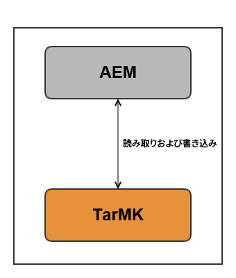
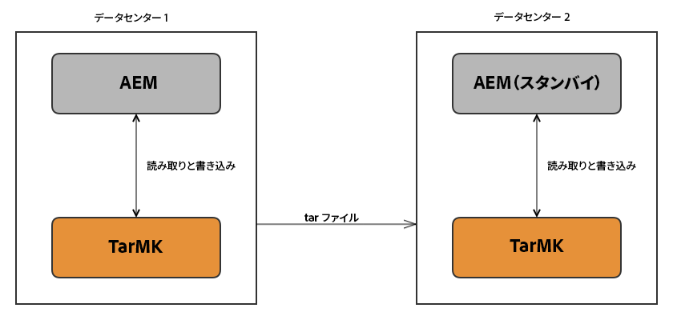
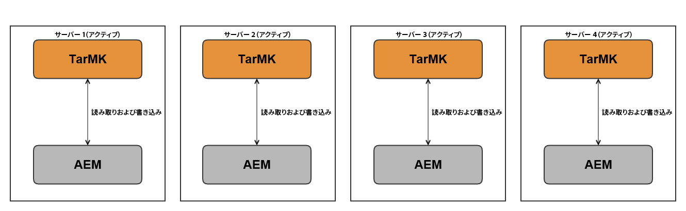
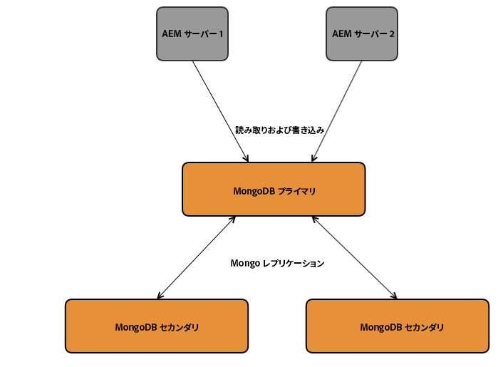
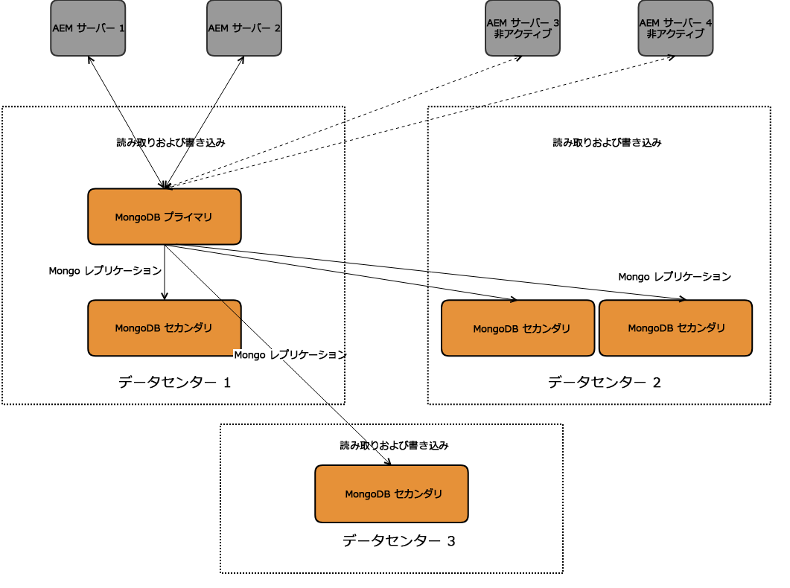
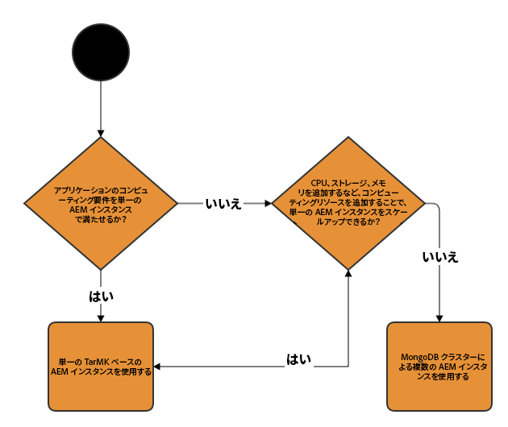
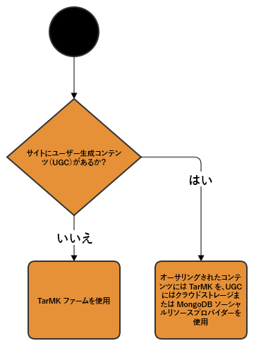

# 推奨されるデプロイメント{#recommended-deployments}

>[!NOTE]
>
>このページでは、AEM の推奨されるトポロジについて説明します。クラスター化機能およびその設定方法について詳しくは、[Apache Sling Discovery API のドキュメント](https://sling.apache.org/documentation/bundles/discovery-api-and-impl.html)を参照してください。

MicroKernelは、AEM 6.2以降の永続性マネージャとして機能します。ニーズに合うように選択する方法は、インスタンスの目的と、検討しているデプロイメントの種類によって異なります。

以下の例は、最も一般的な AEM 設定で推奨される使用法を示しています。

## デプロイメントのシナリオ {#deployment-scenarios}

### 単一の TarMK インスタンス {#single-tarmk-instance}

このシナリオでは、単一の TarMK インスタンスを 1 台のサーバーで実行します。

**これは、オーサーインスタンスのデフォルトのデプロイメントです。**

メリット：

* シンプル
* メンテナンスが容易
* 良好なパフォーマンス

デメリット：

* サーバーの能力の制限を超えたスケーラビリティはない
* フェイルオーバー機能はない

### TarMK コールドスタンバイ {#tarmk-cold-standby}

単一の TarMK インスタンスが、プライマリインスタンスとして機能します。プライマリのリポジトリは、スタンバイフェイルオーバーシステムにレプリケーションされます。

また、リポジトリ全体がフェイルオーバーサーバーに定期的にレプリケートされるので、コールドスタンバイメカニズムをバックアップとして使用することもできます。フェイルオーバーサーバーは、コールドスタンバイモードで実行されます。これは、インスタンスの HttpReceiver のみ実行していることを意味します。

メリット：

* シンプル
* 優れた保守性
* パフォーマンス
* フェイルオーバー

デメリット：

* サーバーの能力の制限を超えたスケーラビリティはない
* 1 台のサーバーがほとんどの時間アイドル状態
* フェイルオーバーは自動ではない（外部で検出されるまで、フェイルオーバーシステムは要求の提供を開始できない）

>[!NOTE]
>
>TarMK コールドスタンバイを使用した AEM の設定方法について詳しくは、[この](/help/sites-deploying/tarmk-cold-standby.md)記事を参照してください。

>[!NOTE]
>
>この TarMK の例のコールドスタンバイデプロイメントでは、フェイルオーバーサーバーに定期的にレプリケートされるので、プライマリインスタンスとスタンバイインスタンスの両方が個別にライセンスされている必要があります。For more information about licensing, please consult the [Adobe General Licensing Terms](https://www.adobe.com/jp/legal/terms/enterprise-licensing.html).

### TarMK ファーム {#tarmk-farm}

複数の Oak インスタンスを、それぞれ単一の TarMK インスタンスと共に実行します。TarMK リポジトリは独立しており、同期が維持されている必要があります。

オーサーサーバーが各ファームメンバーに同じコンテンツを公開することによって、リポジトリの同期が維持されます。詳しくは、[レプリケーション](/help/sites-deploying/replication.md)を参照してください。

AEM Communities の場合、ユーザー生成コンテンツ（UGC）はレプリケーションされません。For supporting UGC on a TarMK Farm, see [considerations for AEM Communities](#considerations-for-aem-communities).

**これは、パブリッシュ環境のデフォルトのデプロイメントです。**

メリット：

* パフォーマンス
* 読み取りアクセスに対するスケーラビリティ
* フェイルオーバー

### 単一のデータセンターで高可用性を確保するための MongoMK フェイルオーバーを備えた Oak クラスター {#oak-cluster-with-mongomk-failover-for-high-availability-in-a-single-datacenter}

このアプローチでは、複数の Oak インスタンスが単一のデータセンター内の MongoDB レプリカセットにアクセスでき、事実上、AEM オーサー環境のアクティブ-アクティブ構成のクラスターになります。MongoDB のレプリカセットは、ハードウェアまたはネットワークに障害が発生した場合に高可用性と冗長性を提供するために使用されます。

メリット：

* 新しい AEM オーサーインスタンスで水平方向に拡張可能
* データレイヤーの高可用性、冗長性、自動フェイルオーバー

デメリット：

* シナリオによっては TarMK 使用時よりパフォーマンスが低下する可能性あり

### 複数のデータセンターにわたる MongoMK フェイルオーバーを備えた Oak クラスター {#oak-cluster-with-mongomk-failover-across-multiple-datacenters}

このアプローチでは、複数の Oak インスタンスが複数のデータセンターをまたいで MongoDB レプリカセットにアクセスできるので、事実上、AEM オーサー環境のアクティブ/アクティブ構成のクラスターになります。MongoDB のレプリケーションでは、複数のデータセンターを使用する場合にも同じ高可用性と冗長性を提供しますが、さらにデータセンターの停止に対処する機能も追加されました。

メリット：

* 新しい AEM オーサーインスタンスで水平方向に拡張可能
* データレイヤーの高可用性、冗長性、自動フェイルオーバー（データセンターが停止した場合も含む）

>[!NOTE]
>
>In the diagram above, AEM Server 3 and AEM Server 4 are presented with an inactive status assuming a network latency in between the AEM Servers in Data Center 2 and the MongoDB primary node in Data Center 1 that is higher than the requirement documented [here](/help/sites-deploying/aem-with-mongodb.md#checklists). 例えば、可用性ゾーンの使用などにより、最大遅延が要件に反しない場合は、データセンター 2 の AEM サーバーもアクティブになることができ、結果として、複数のデータセンターにまたがるアクティブ-アクティブ構成の AEM クラスターとなります。

>[!NOTE]
>
>For additional information on the MongoDB architectural concepts described in this section, see [MongoDB Replication](https://docs.mongodb.org/manual/replication/).

## MicroKernel：どちらを使用すべきか {#microkernels-which-one-to-use}

利用可能な 2 つの MicroKernel 間での選択に際して考慮する必要がある基本ルールは、TarMK はパフォーマンスのために設計されているのに対して、MongoMK はスケーラビリティのために使用されるということです。

要件に最適なタイプのデプロイメントを確立するために、以降に示す意思決定のフローチャートを使用できます。

アドビでは、すべてのデプロイメントのシナリオ（AEM のオーサーインスタンスとパブリッシュインスタンスの両方）で顧客が使用するデフォルトの永続性テクノロジーとして、TarMK を強くお勧めします。ただし、次に示す事例を除きます。

### オーサーインスタンスで TarMK ではなく AEM MongoMK を例外的に選択する場合 {#exceptions-for-choosing-aem-mongomk-over-tarmk-on-author-instances}

永続性バックエンドとして TarMK ではなく MongoMK を選択する主な理由は、水平方向へのインスタンスの拡張です。つまり、2 つ以上のアクティブなオーサーインスタンスを常に実行し、MongoDB を永続性ストレージシステムとして使用します。複数のオーサーインスタンスを実行する必要があるのは、通常、1 台のサーバーの CPU とメモリの処理能力では同時に実行されるすべてのオーサリングアクティビティをサポートできなくなっているためです。

新しいサイトの運用開始後の正確な同時実行モデルを予測するのはほぼ不可能です。そのため、アドビでは、MongoMK と 2 つ以上のオーサーアクティブノードを使用するかどうかを評価する際に次の条件を考慮することをお勧めします。

1. 1 日に接続する名前付きユーザーの数（数千人以上）
1. 同時ユーザーの数（数百人以上）
1. 1 日あたりのアセット収集のボリューム（数十万件以上）
1. 1 日あたりのページ編集のボリューム（数十万件以上）（Multi Site Manager やニュースフィードの収集などによる自動化された更新を含む）
1. 1 日あたりの検索のボリューム（数万件以上）

>[!NOTE]
>
>Tough Day を使用すると、デプロイ済みのハードウェア設定のコンテキストにおける顧客のアプリケーションのパフォーマンスを評価できます。このツールについて詳しくは、[ここ](/help/sites-developing/tough-day.md)を参照してください。

通常、MongoDB を使用した最小限のデプロイメントには次のトポロジが含まれます。

* 1 つのプライマリノードと 2 つのセカンダリノードで構成された MongoDB レプリカセット。各 MongoDB インスタンスは、各ノード間の遅延が 15 ミリ秒未満の可用性ゾーンで実行されます。
* リーダーノードとリーダー以外のノードを 1 つずつ含む（どちらのノードも常にアクティブです）オーサーインスタンスのクラスター。各オーサーインスタンスは、MongoDB のプライマリインスタンスとセカンダリインスタンスが実行されているそれぞれのデータセンターで実行されます。

また、アセットまたはバイナリが MongoDB 内に格納されないように、共有ファイルシステムまたは Amazon S3 にデータストアを設定することを強くお勧めします。これにより、デプロイメント内で最適なパフォーマンスを確保できます。

2 つ以上のオーサーインスタンスのクラスターを含む MongoDB レプリカセットをデプロイするその他のメリットの 1 つとして、オーサーインスタンス、MongoDB レプリカまたはデータセンター全体で障害が発生した場合に、最小限のダウンタイムで自動的にリカバリできる点が挙げられます。そうは言っても、TarMK ではなく MongoMK を選択するのは、単にリカバリ要件だけが理由ではないはずです（制御されたフェイルオーバーメカニズムを備えた最小限のダウンタイムを実現するソリューションは TarMK でも提供されます）。

デプロイメントの最初の 18 ヶ月間に前述の条件を満たすことができないと思われる場合は、最初に TarMK を使用して AEM をデプロイし、後から（前述の条件を適用する際に）設定を再評価して、TarMK をそのまま使用するか、MongoMK に移行するかを最終的に判断することをお勧めします。

### パブリッシュインスタンスに TarMK ではなく AEM MongoMK を選択する例外的な場合 {#exceptions-for-choosing-aem-mongomk-over-tarmk-on-publish-instances}

パブリッシュインスタンス用に MongoMK をデプロイすることはお勧めしません。ほとんどの場合、デプロイメントのパブリッシュ層は、TarMK を実行する、完全に独立したパブリッシュインスタンスのファームとしてデプロイされます。このパブリッシュインスタンスの同期は、オーサーインスタンスからコンテンツをレプリケーションすることで維持されます。この「何も共有しない」アーキテクチャは、パブリッシュインスタンスに適しており、パブリッシュ層のデプロイメントを水平方向に直線的に拡張できます。また、ファームのトポロジによっても、アップデートやアップグレードをパブリッシュインスタンスに周期的に適用するというメリットがもたらされるので、パブリッシュ層に対する変更の際にダウンタイムが発生しません。

これは、複数のパブリッシャーがある場合は常にパブリッシュ層で MongoMK クラスターを使用する AEM Communities には該当しません。If choosing JSRP (see [Community Content Storage](/help/communities/working-with-srp.md)), then a MongoMK cluster would be appropriate, as would any publish side cluster regardless of the MK chosen, such as MongoDB or RDB.

### MongoMK を使用して AEM をデプロイする際の前提条件と推奨事項 {#prerequisites-and-recommendations-when-deploying-aem-with-mongomk}

AEM 用の MongoMK デプロイメントを検討する場合の一連の前提条件と推奨事項があります。

**MongoDBの導入に必要な前提条件：**

1. AEM を熟知したアドビのコンサルタントまたは MongoDB のアーキテクトの支援のもとで、MongoDB デプロイメントのアーキテクチャとサイジングをプロジェクトの実装に含める必要があります。
1. 既存の、または新しい MongoDB 環境を適切に維持および保守できるように、MongoDB の専門知識をパートナーまたはカスタマーチーム内で共有しておく必要があります。
1. 商用バージョンまたはオープンソースバージョンの MongoDB（AEM ではどちらもサポート可）のデプロイを選択できますが、MongoDB のメンテナンスとサポートの契約を MongoDB Inc. から直接購入する必要があります。
1. AEM と MongoDB の全体的なアーキテクチャおよびインフラストラクチャについて明確に定義し、アドビの AEM アーキテクトによる検証を済ませておく必要があります。
1. MongoDB を含む AEM デプロイメントのサポートモデルについて確認しておく必要があります。

**MongoDBの導入に関する強力な推奨事項：**

* MongoDB for Adobe Experience Manager に関する[記事](https://www.mongodb.com/lp/contact/mongodb-adobe-experience-manager)を参照してください。
* MongoDB の本番[チェックリスト](https://docs.mongodb.org/manual/administration/production-checklist/)を確認してください。
* [このページ](https://university.mongodb.com/)から、MongoDB の認定クラスにオンラインで参加できます。

>[!NOTE]
>
>前述のガイドライン、前提条件および推奨事項に関するその他のご質問については、[アドビのカスタマーケア](https://helpx.adobe.com/jp/marketing-cloud/contact-support.html)までお問い合わせください。

### AEM Communities に関する考慮事項 {#considerations-for-aem-communities}

[AEM Communities](/help/communities/overview.md) のデプロイを計画しているサイトでは、パブリッシュ環境から Communities メンバーが投稿した UGC を処理するために最適化された[デプロイメントを選択](/help/communities/working-with-srp.md#characteristicsofstorageoptions)することをお勧めします。

[共通のストア](/help/communities/working-with-srp.md)を使用すると、UGC の一貫した表示を確保するために、オーサーインスタンスとその他のパブリッシュインスタンスとの間で UGC をレプリケートする必要がありません。

デプロイメントに最適な永続性のタイプを選択する際に役立つ、一連の意思決定のフローチャートを次に示します。

#### オーサーインスタンス用のデプロイメントタイプの選択 {#choosing-the-deployment-type-for-author-instances}

#### パブリッシュインスタンス用のデプロイメントタイプの選択 {#choosing-the-deployment-type-for-publish-instances}

>[!NOTE]
>
>MongoDB はサードパーティソフトウェアであり、AEM ライセンスパッケージには含まれていません。詳しくは、[MongoDB のライセンスポリシー](https://www.mongodb.org/about/licensing/)ページを参照してください。
>
>AEM デプロイメントを最大限活用するために、アドビは、プロフェッショナルサポートを受けられる MongoDB Enterprise バージョンのライセンスを取得することを推奨しています。
>
>このライセンスには、標準レプリカセットが含まれます。このレプリカセットは、1 つのプライマリインスタンスと 2 つのセカンダリインスタンスで構成されており、これらのインスタンスは、オーサーとパブリッシュのいずれのデプロイメントにも使用できます。
>
>MongoDB でオーサーとパブリッシュの両方を実行したい場合は、個別の 2 つのライセンスを購入する必要があります。
>
>詳しくは、[MongoDB for Adobe Experience Manager のページ](https://www.mongodb.com/lp/contact/mongodb-adobe-experience-manager)を参照してください。

