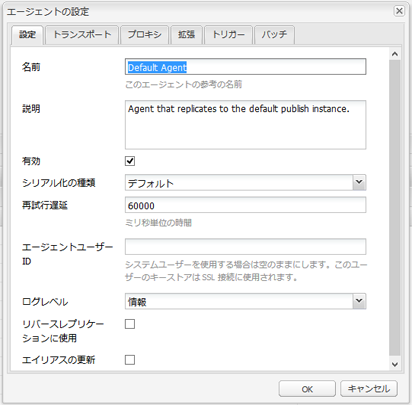

# レプリケーション{#replication}

レプリケーションエージェントは、次の目的で使用されるメカニズムとしてAdobe Experience Manager(AEM) の中心となるものです。

* [公開（アクティベート）](/help/sites-authoring/publishing-pages.md#activatingcontent) オーサー環境からパブリッシュ環境へのコンテンツ。
* Dispatcher キャッシュからコンテンツを明示的にフラッシュします。
* パブリッシュ環境からオーサー環境（オーサー環境の制御下）にユーザー入力（フォーム入力など）を返します。

リクエストは、 [キュー](/help/sites-deploying/osgi-configuration-settings.md#apacheslingjobeventhandler) を適切なエージェントに追加して処理します。

>[!NOTE]
>
>ユーザーデータ（ユーザー、ユーザーグループ、ユーザープロファイル）は、オーサーインスタンスとパブリッシュインスタンスの間でレプリケートされません。
>
>複数のパブリッシュインスタンスの場合、ユーザーデータは次の場合に Sling が配布されます。 [ユーザーの同期](/help/sites-administering/sync.md) が有効になっている。

## オーサーからパブリッシュにレプリケート中 {#replicating-from-author-to-publish}

パブリッシュインスタンスまたは Dispatcher へのレプリケーションは、次のいくつかの手順でおこなわれます。

* 作成者は、特定のコンテンツを公開（アクティブ化）するように要求します。これは、手動のリクエストまたは事前設定された自動トリガーで開始できます。
* リクエストが適切なデフォルトレプリケーションエージェントに渡されます。環境には、そのようなアクションに対して常に選択される複数のデフォルトエージェントを含めることができます。
* レプリケーションエージェントは、コンテンツを「パッケージ化」し、レプリケーションキューに配置します。
* 「Web サイト」タブで、 [色付きステータスインジケーター](/help/sites-authoring/publishing-pages.md#determiningpagepublicationstatus) は個々のページに対して設定されます。
* コンテンツはキューから取り除かれ、設定されたプロトコルを使用してパブリッシュ環境に転送されます。通常、これは HTTP です。
* パブリッシュ環境のサーブレットが要求を受け取り、受け取ったコンテンツを公開します。デフォルトのサーブレットは `https://localhost:4503/bin/receive`.

* 複数のオーサー環境とパブリッシュ環境を設定できます。

### パブリッシュからオーサーにレプリケート中 {#replicating-from-publish-to-author}

一部の機能では、ユーザーはパブリッシュインスタンスでデータを入力できます。

このデータをオーサー環境に返し、他のパブリッシュ環境に再配布するために、リバースレプリケーションと呼ばれる種類のレプリケーションが必要になる場合があります。 セキュリティ上の考慮事項により、パブリッシュ環境からオーサー環境へのトラフィックは厳密に制御する必要があります。

リバースレプリケーションでは、オーサー環境を参照するパブリッシュ環境のエージェントを使用します。 このエージェントは、データをアウトボックスに配置します。 このアウトボックスは、オーサー環境のレプリケーションリスナーと一致します。 リスナーはアウトボックスをポーリングして入力されたデータを収集し、必要に応じて配布します。 これにより、オーサー環境がすべてのトラフィックを制御できます。

コミュニティ機能（フォーラム、ブログ、コメント、レビューなど）の場合など、パブリッシュ環境に入力されるユーザー生成コンテンツ (UGC) の量は、レプリケーションを使用してAEMインスタンス間で効率的に同期するのが困難です。

AEM [Communities](/help/communities/overview.md) では、UGC にレプリケーションを使用しません。その代わりに、Communities のデプロイメントでは UGC 用の共通ストアが必要になります（[コミュニティコンテンツのストレージ](/help/communities/working-with-srp.md)を参照）。

### レプリケーション（デフォルト） {#replication-out-of-the-box}

AEM の標準インストールに含まれている we-retail web サイトを使用して、レプリケーションの仕組みを見ていきましょう。

この例に従い、デフォルトのレプリケーションエージェントを使用するには、 [AEMをインストール](/help/sites-deploying/deploy.md) 次を使用：

* ポート上のオーサー環境 `4502`
* ポートのパブリッシュ環境 `4503`

>[!NOTE]
>
>デフォルトで有効 :
>
>* 作成者のエージェント：デフォルトエージェント (publish)
>
>デフォルトで有効に無効になっています (AEM 6.1 以降 )。
>
>* オーサー上のエージェント：リバースレプリケーションエージェント (publish_reverse)
>* 公開のエージェント：リバースレプリケーション (outbox)
>
>エージェントまたはキューのステータスを確認するには、 **ツール** コンソール。
>[レプリケーションエージェントの監視](#monitoring-your-replication-agents)を参照してください。

#### レプリケーション（オーサー環境からパブリッシュ環境へ） {#replication-author-to-publish}

1. オーサー環境でサポートページに移動します。
   **https://localhost:4502/content/we-retail/us/en/experience.html** `<pi>`
1. ページを編集して、新しいテキストを追加できます。
1. **ページをアクティベート** 変更を公開できます。
1. パブリッシュ環境でサポートページを開きます。
   **https://localhost:4503/content/we-retail/us/en/experience.html**
1. これで、「作成者」に入力した変更を表示できます。

このレプリケーションは、次の場所でオーサー環境から実行されます。

* **デフォルトエージェント (publish)**
このエージェントは、デフォルトのパブリッシュインスタンスにコンテンツをレプリケートします。この詳細（設定とログ）は、オーサー環境のツールコンソールからアクセスできます。または、次の場合にアクセスできます。
  `https://localhost:4502/etc/replication/agents.author/publish.html`。

#### レプリケーションエージェント — 標準搭載 {#replication-agents-out-of-the-box}

標準のAEMインストールでは、次のエージェントを使用できます。

* [デフォルトエージェント](#replication-author-to-publish)
オーサーからパブリッシュにレプリケートするために使用されます。

* Dispatcher フラッシュDispatcher キャッシュの管理に使用します。詳しくは、[オーサリング環境からの Dispatcher キャッシュの無効化](https://experienceleague.adobe.com/docs/experience-manager-dispatcher/using/configuring/page-invalidate.html?lang=ja#invalidating-dispatcher-cache-from-the-authoring-environment)および[パブリッシュインスタンスからの Dispatcher キャッシュの無効化](https://experienceleague.adobe.com/docs/experience-manager-dispatcher/using/configuring/page-invalidate.html?lang=ja#invalidating-dispatcher-cache-from-a-publishing-instance)を参照してください。

* [リバースレプリケーション](#reverse-replication-publish-to-author)
パブリッシュからオーサーにレプリケートするために使用されます。 リバースレプリケーションは、フォーラム、ブログ、コメントなどのコミュニティ機能には使用されません。アウトボックスが有効化されていないので、事実上、この機能は無効になっています。リバースレプリケーションを使用するには、カスタム設定が必要になります。

* 静的エージェント
これは、「ノードの静的な表現をファイルシステムに格納するエージェント」です。例えば、デフォルト設定では、コンテンツページと DAM アセットは、 `/tmp`(HTMLまたは適切なアセット形式 ) 設定については、`Settings` タブと `Rules` タブを参照してください。これは、ページがアプリケーションサーバーから直接要求される場合に、コンテンツを確認できるようにするためのエージェントです。これは特殊なエージェントで、（おそらく）ほとんどのインスタンスでは必要ありません。

## レプリケーションエージェント — 設定パラメーター {#replication-agents-configuration-parameters}

ツールコンソールからレプリケーションエージェントを設定する場合、ダイアログ内に次の 4 つのタブが表示されます。

### 設定 {#settings}

* **名前**

  レプリケーションエージェントの一意の名前。

* **説明**

  このレプリケーションエージェントが提供する目的の説明。

* **Enabled**

  レプリケーションエージェントが有効かどうかを示します。

  エージェントが **有効**&#x200B;を指定した場合、キューは次のように表示されます。

   * **アクティブ**：項目が処理されています。
   * **待機中**：キューが空です。
   * **ブロック**：項目がキュー内にありますが、処理できません。例えば、受信側のキューが無効な場合などです。

* **シリアル化の種類**

  シリアル化の種類：

   * **デフォルト**：エージェントを自動的に選択する場合に設定します。
   * **Dispatcher フラッシュ**：エージェントを使用して Dispatcher キャッシュをフラッシュする場合に選択します。

* **再試行遅延**

  問題が発生した場合の、2 回の再試行の間の遅延（ミリ秒単位の待機時間）。

  デフォルト: `60000`

* **エージェントユーザー ID**

  環境に応じて、エージェントはこのユーザーアカウントを使用して次の操作を行います。

   * オーサー環境からコンテンツを収集し、パッケージ化します。
   * パブリッシュ環境でのコンテンツの作成と書き込み

  システムユーザーアカウント（sling で管理者ユーザーとして定義したアカウント。デフォルトでは、`admin` です）を使用するには、このフィールドを空白のままにします。

  >[!CAUTION]
  >
  >オーサー環境のエージェントの場合、このアカウント *必須* レプリケートするすべてのパスに対する読み取りアクセス権を持っている。

  >[!CAUTION]
  >
  >パブリッシュ環境のエージェントの場合、このアカウント *必須* コンテンツのレプリケーションに必要な作成/書き込みアクセス権を持っている。

  >[!NOTE]
  >
  >これは、レプリケーション用に特定のコンテンツを選択するメカニズムとして使用できます。

* **ログレベル**

  ログメッセージに使用する詳細レベルを指定します。

   * `Error`：エラーのみがログに記録されます
   * `Info`：エラー、警告およびその他の情報メッセージがログに記録されます。
   * `Debug`：主にデバッグ目的で、メッセージで詳細の概要を使用します

  デフォルト: `Info`

* **リバースレプリケーションに使用**

  このエージェントをリバースレプリケーションに使用するかどうかを示します。「オーサー環境に公開」環境からのユーザー入力を返します。

* **エイリアスの更新**

  このオプションを選択すると、Dispatcher に対するエイリアスまたはバニティーパスの無効化要求が有効になります。 [Dispatcher フラッシュエージェントの設定](/help/sites-deploying/replication.md#configuring-a-dispatcher-flush-agent) も参照してください。

#### トランスポート {#transport}

* **URI**

  ターゲットの場所にある受信サーブレットを指定します。 特に、ここでターゲットインスタンスのホスト名（またはエイリアス）とコンテキストパスを指定できます。

  次に例を示します。

   * デフォルトエージェントによるレプリケーション先：`https://localhost:4503/bin/receive`
   * Dispatcher フラッシュエージェントによるレプリケーション先：`https://localhost:8000/dispatcher/invalidate.cache`

  ここで指定するプロトコル（HTTP または HTTPS）によって、トランスポートメソッドが決まります。

  Dispatcher フラッシュエージェントの場合、「URI」プロパティは、パスに基づく virtualhost エントリを使用してファームを区別する場合にのみ使用されます。このフィールドを使用して、無効にするファームをターゲット設定してください。例えば、ファーム #1 の仮想ホストは `www.mysite.com/path1/*` で、ファーム #2 の仮想ホストは `www.mysite.com/path2/*` です。この場合、`/path1/invalidate.cache` の URL を使用して最初のファームをターゲット設定し、`/path2/invalidate.cache` を使用して 2 つ目のファームをターゲット設定できます。

* **ユーザー**

  ターゲットへのアクセスに使用するアカウントのユーザー名です。

* **パスワード**

  ターゲットへのアクセスに使用するアカウントのパスワード。

* **NTLM ドメイン**

  NTML 認証用のドメイン。

* **NTLM ホスト**

  NTML 認証用のホスト。

* **緩和された SSL を有効にする**

  自己証明 SSL 証明書を受け入れる場合は、有効にします。

* **期限切れの証明書を許可する**

  有効期限切れの SSL 証明書を受け入れる場合に有効にします。

#### プロキシ {#proxy}

次の設定は、プロキシが必要な場合にのみ必要です。

* **プロキシホスト**

  トランスポートに使用するプロキシのホスト名。

* **プロキシポート**

  プロキシのポート。

* **プロキシユーザー**

  使用するアカウントのユーザー名。

* **プロキシパスワード**

  使用するアカウントのパスワード。

* **プロキシ NTLM ドメイン**

  プロキシ NTLM ドメイン。

* **プロキシ NTLM ホスト**

  プロキシ NTLM ドメイン。

#### 拡張 {#extended}

* **インターフェイス**

  ここで、バインド先のソケットインターフェイスを定義できます。

  接続を作成する際に使用するローカルアドレスを設定します。 これを設定しない場合は、デフォルトのアドレスが使用されます。 これは、マルチホームまたはクラスター化されたシステムで使用するインターフェイスを指定する場合に便利です。

* **HTTP メソッド**

  使用する HTTP メソッド。

  Dispatcher フラッシュエージェントの場合、これはほとんど常にGETで、変更しないでください (POSTも可能な別の値です )。

* **HTTP ヘッダー**

  これらは Dispatcher フラッシュエージェントに使用され、フラッシュする必要のある要素を指定します。

  Dispatcher フラッシュエージェントの場合、次の 3 つの標準エントリを変更する必要はありません。

   * `CQ-Action:{action}`
   * `CQ-Handle:{path}`
   * `CQ-Path:{path}`

  必要に応じて、ハンドルまたはパスのフラッシュ時に使用するアクションを示すために使用します。 サブパラメーターは動的です。

   * `{action}` はレプリケーションアクションを示します

   * `{path}` はパスを示します

  これらは、リクエストに関連するパス/アクションで置き換えられるので、「ハードコード」する必要はありません。

  >[!NOTE]
  >
  >推奨されるデフォルトのコンテキスト以外のコンテキストにAEMをインストールした場合は、そのコンテキストを HTTP ヘッダーに登録する必要があります。 次に例を示します。
  >`CQ-Handle:/<*yourContext*>{path}`

* **接続を閉じる**

  を有効にして、リクエストのたびに接続を閉じることができます。

* **接続タイムアウト**

  接続を確立しようとした際に適用されるタイムアウト（ミリ秒）。

* **Socket Timeout**

  接続が確立された後にトラフィックを待機する際に適用されるタイムアウト（ミリ秒）。

* **プロトコルのバージョン**

  プロトコルのバージョン。例： `1.0` （HTTP/1.0 用）

#### トリガー {#triggers}

次の設定は、自動レプリケーションのトリガーを定義するために使用します。

* **デフォルトを無視**

  オンにすると、エージェントはデフォルトのレプリケーションから除外されます。つまり、コンテンツ作成者がレプリケーションアクションを実行しても、エージェントは使用されません。

* **変更時**

  ここでは、ページが変更されたときに、このエージェントによるレプリケーションが自動的にトリガーされます。 Dispatcher フラッシュエージェントに使用されますが、リバースレプリケーションにも使用されます。

* **配布時**

  オンにすると、配布用にマークされたコンテンツが変更されたときに、エージェントが自動的に複製します。

* **オン/オフタイムに達しました**

  このトリガーは、ページに対して定義されたオンタイムまたはオフタイムが発生した場合に、（ページを適切にアクティベートまたはアクティベート解除するために）自動レプリケーションを実行します。 これは主に Dispatcher フラッシュエージェントで使用されます。

* **受信時**

  オンにすると、レプリケーションイベントを受け取るたびにエージェントチェーンがレプリケーションされます。

* **ステータス更新がありません**

  オンにすると、エージェントはレプリケーションステータスの更新を強制しません。

* **バージョン管理がありません**

  オンにすると、エージェントはアクティベートされたページのバージョン管理を強制しません。

## レプリケーションエージェントの設定 {#configuring-your-replication-agents}

MSSL を使用してレプリケーションエージェントをパブリッシュインスタンスに接続する方法について詳しくは、 [相互 SSL を使用したレプリケーション](/help/sites-deploying/mssl-replication.md).

### オーサー環境からのレプリケーションエージェントの設定 {#configuring-your-replication-agents-from-the-author-environment}

オーサー環境の「ツール」タブから、オーサー環境 (**作成者のエージェント**) またはパブリッシュ環境 (**公開のエージェント**) をクリックします。 次の手順では、オーサー環境用のエージェントの設定を示しますが、両方に使用できます。

>[!NOTE]
>
>Dispatcher がオーサーインスタンスまたはパブリッシュインスタンスの HTTP 要求を処理する場合、レプリケーションエージェントからの HTTP 要求には PATH ヘッダーを含める必要があります。以下の手順に加えて、PATH ヘッダーをクライアントヘッダーの Dispatcher リストに追加する必要があります。詳しくは、 [/clientheaders （クライアントヘッダー）](https://experienceleague.adobe.com/docs/experience-manager-dispatcher/using/configuring/dispatcher-configuration.html?lang=ja#specifying-the-http-headers-to-pass-through-clientheaders).
>

1. AEM の「**ツール**」タブにアクセスします。
1. クリック **レプリケーション** （フォルダーを開くには左側のペイン）。
1. ダブルクリック **作成者のエージェント** （左側または右側のウィンドウ）。
1. 適切なエージェント名（リンク）をクリックして、そのエージェントの詳細情報を表示します。
1. クリック **編集** 設定ダイアログボックスが開きます。

   

1. 指定した値は、デフォルトのインストールで十分である必要があります。 変更を加えた場合は、 **OK** それらを保存する ( [レプリケーションエージェント — 設定パラメーター](#replication-agents-configuration-parameters) 個々のパラメーターの詳細を参照 )。

>[!NOTE]
>
>AEM の標準インストールでは、`admin` をデフォルトのレプリケーションエージェント内のトランスポート資格情報のユーザーとして指定します。
>
>必要なパスをレプリケートする権限を持つサイト固有のレプリケーションユーザーアカウントに変更する必要があります。

### リバースレプリケーションの設定 {#configuring-reverse-replication}

リバースレプリケーションは、パブリッシュインスタンスで生成されたユーザーコンテンツをオーサーインスタンスに戻すために使用します。 これは、調査や登録フォームなどの機能で一般的に使用されます。

ほとんどのネットワークトポロジは、セキュリティ上の理由により、「非武装地帯（DMZ）」（インターネットなどの信頼できないネットワークに外部サービスを公開するサブネットワーク）からの接続を許可しません&#x200B;*。*

パブリッシュ環境は通常 DMZ にあるので、コンテンツをオーサー環境に戻すには、オーサーインスタンスから接続を開始する必要があります。 この定義を行うには、次の項目を使用します。

* an *送信トレイ* （コンテンツが配置されるパブリッシュ環境）を使用します。
* オーサー環境のエージェント（パブリッシュ）。このエージェントは、アウトボックスを定期的にポーリングして新しいコンテンツを探します。

>[!NOTE]
>
>AEMの場合 [Communities](/help/communities/overview.md)の場合、パブリッシュインスタンス上のユーザー生成コンテンツにレプリケーションは使用されません。 [コミュニティコンテンツのストレージ](/help/communities/working-with-srp.md)を参照してください。

これをおこなうには、次が必要です。

**オーサー環境のリバースレプリケーションエージェント**  — パブリッシュ環境のアウトボックスから情報を収集するアクティブコンポーネントとして機能します。

リバースレプリケーションを使用する場合は、このエージェントがアクティベートされていることを確認します。

**パブリッシュ環境のリバースレプリケーションエージェント（アウトボックス）** - 「outbox」として機能するパッシブ要素。 ユーザー入力はここに配置され、オーサー環境のエージェントによって収集されます。

### 複数のパブリッシュインスタンス用のレプリケーションの設定 {#configuring-replication-for-multiple-publish-instances}

>[!NOTE]
>
>コンテンツのみがレプリケートされます。ユーザーデータはレプリケートされません（ユーザー、ユーザーグループ、ユーザープロファイル）。
>
>複数のパブリッシュインスタンス間でユーザーデータを同期するには、 [ユーザーの同期](/help/sites-administering/sync.md).

インストール後、localhost のポート 4503 で実行されているパブリッシュインスタンスに対するコンテンツのレプリケーション用に、デフォルトエージェントが既に設定されています。

追加のパブリッシュインスタンス用にコンテンツのレプリケーションを設定するには、新しいレプリケーションエージェントを作成して設定します。

1. を開きます。 **ツール** 」タブをAEMでクリックします。
1. 選択 **レプリケーション**&#x200B;を、 **作成者のエージェント** をクリックします。
1. 選択 **新規…**.
1. を設定します。 **タイトル** および **名前**&#x200B;を選択し、「 **レプリケーションエージェント**.
1. クリック **作成** エージェントを作成できます。
1. 新しいエージェント項目をダブルクリックして、設定パネルを開きます。
1. クリック **編集** - **エージェントの設定** ダイアログボックスが開きます — **シリアル化の種類** は既にデフォルトとして定義されています。このままにしておく必要があります。

   * Adobe Analytics の **設定** タブ：

      * 有効化 **有効**.
      * を入力します。 **説明**.
      * 「**再試行遅延**」を `60000` に設定します。

      * **シリアル化のタイプ**&#x200B;は`Default`のままにします。

   * 「**トランスポート**」タブで、次のように設定します。

      * 新しいパブリッシュインスタンスに必要な URI を入力します。例：
        `https://localhost:4504/bin/receive`。

      * レプリケーションに使用するサイト固有のユーザーアカウントを入力します。
      * 必要に応じて、他のパラメーターを設定できます。

1. 「**OK**」をクリックします。

その後、オーサー環境でページを更新し、公開して、操作をテストできます。

更新は、上記のように設定されたすべてのパブリッシュインスタンスに表示されます。

問題が発生した場合は、オーサーインスタンスでログを確認できます。 必要な詳細レベルに応じて、前述の **エージェント設定** ダイアログを使用して、**ログレベル** を `Debug` に設定することもできます。

>[!NOTE]
>
>これは、 [エージェントユーザー ID](#agentuserid) をクリックして、個々のパブリッシュ環境にレプリケートする別のコンテンツを選択します。パブリッシュ環境ごとに、次の手順を実行します。
>
>1. そのパブリッシュ環境にレプリケーションするレプリケーションエージェントを設定します。
>1. 特定のパブリッシュ環境にレプリケートされるコンテンツを読み取るために必要なアクセス権を持つユーザーアカウントを設定します。
>1. ユーザーアカウントを **エージェントユーザー ID** レプリケーションエージェント用。
>

### Dispatcher フラッシュエージェントの設定 {#configuring-a-dispatcher-flush-agent}

デフォルトのエージェントがインストールに含まれます。 ただし、特定の設定が必要です。新しいエージェントを定義する場合も同じことが当てはまります。

1. を開きます。 **ツール** 」タブをAEMでクリックします。
1. クリック **導入**.
1. 選択 **レプリケーション** その後 **公開のエージェント**.
1. 次をダブルクリックします。 **Dispatcher フラッシュ** 「 」項目をクリックして、概要を開きます。
1. クリック **編集** - **エージェントの設定** ダイアログボックスが開きます。

   * Adobe Analytics の **設定** タブ：

      * 有効化 **有効**.
      * を入力します。 **説明**.
      * を残します。 **シリアル化の種類** as `Dispatcher Flush`または、エージェントを作成する場合はそのように設定します。

      * （オプション）**エイリアスの更新**&#x200B;を選択して、Dispatcher に対するエイリアスまたはバニティーパスの無効化要求を有効にします。

   * 「**トランスポート**」タブで、次のように設定します。

      * 新しいパブリッシュインスタンスに必要な URI を入力します。例：
        `https://localhost:80/dispatcher/invalidate.cache`。

      * レプリケーションに使用するサイト固有のユーザーアカウントを入力します。
      * 必要に応じて、他のパラメーターを設定できます。

   Dispatcher フラッシュエージェントの場合、「URI」プロパティは、パスに基づく virtualhost エントリを使用してファームを区別する場合にのみ使用されます。このフィールドを使用して、無効にするファームをターゲット設定してください。例えば、ファーム #1 の仮想ホストは `www.mysite.com/path1/*` で、ファーム #2 の仮想ホストは `www.mysite.com/path2/*` です。この場合、`/path1/invalidate.cache` の URL を使用して最初のファームをターゲット設定し、`/path2/invalidate.cache` を使用して 2 つ目のファームをターゲット設定できます。

   >[!NOTE]
   >
   >推奨されるデフォルトのコンテキスト以外のコンテキストにAEMをインストールした場合は、 [HTTP ヘッダー](#extended) （内） **拡張** タブをクリックします。

1. 「**OK**」をクリックします。
1. に戻ります。 **ツール** タブ、ここから、次の操作が可能です。 **有効化** の **Dispatcher フラッシュ** エージェント (**公開のエージェント**) をクリックします。

The **Dispatcher フラッシュ** オーサーでレプリケーションエージェントがアクティブではありません。 同じページには、パブリッシュ環境で同じ URI を使用してアクセスできます。例えば、 `https://localhost:4503/etc/replication/agents.publish/flush.html`.

### レプリケーションエージェントへのアクセスの制御 {#controlling-access-to-replication-agents}

`etc/replication` ノードに対するユーザーまたはグループのページの権限を使用して、レプリケーションエージェントの設定に使用するページへのアクセスを制御できます。

>[!NOTE]
>
>このような権限を設定しても、（例えば、Web サイトコンソールやサイドキックのオプションから）コンテンツをレプリケートするユーザーには影響しません。 レプリケーションフレームワークは、ページのレプリケーション時に、現在のユーザーの「ユーザーセッション」を使用してレプリケーションエージェントにアクセスしません。

### CRXDE Lite からのレプリケーションエージェントの設定 {#configuring-your-replication-agents-from-crxde-lite}

>[!NOTE]
>
>レプリケーションエージェントの作成は、`/etc/replication` リポジトリの場所でのみサポートされます。関連する ACL を正しく処理するために必要です。 ツリーの別の場所にレプリケーションエージェントを作成すると、不正アクセスにつながる可能性があります。

CRXDE Lite を使用して、レプリケーションエージェントの様々なパラメーターを設定できます。

次に移動した場合： `/etc/replication`に設定すると、次の 3 つのノードが表示されます。

* `agents.author`
* `agents.publish`
* `treeactivation`

2 つの `agents` は、適切な環境に関する設定情報を保持し、その環境が実行中の場合にのみアクティブになります。例： `agents.publish` は、パブリッシュ環境でのみ使用されます。 次のスクリーンショットは、AEM WCM に含まれる、オーサー環境でのパブリッシュエージェントを示しています。

## レプリケーションエージェントの監視 {#monitoring-your-replication-agents}

レプリケーションエージェントを監視するには：

1. AEM の「**ツール**」タブにアクセスします。
1. 「**レプリケーション**」をクリックします。
1. 適切な環境のエージェントへのリンク（左または右のウィンドウ）をダブルクリックします。例： **作成者のエージェント**.

   表示されるウィンドウには、オーサー環境のすべてのレプリケーションエージェントの概要が表示されます。この概要には、ターゲットとステータスも含まれます。

1. 適切なエージェント名（リンク）をクリックして、そのエージェントの詳細情報を表示します。

   

   ここでは、次の操作を実行できます。

   * エージェントが有効かどうかを確認。
   * レプリケーションのターゲットを確認。
   * レプリケーションキューがアクティブ（有効）かどうかを確認。
   * キュー内に項目が含まれているかどうかを確認。
   * 「**更新**」または「**消去**」によりキューエントリの表示を更新。これにより、項目がキューに入り、キューから離れるのを確認できます。

   * 「**ログを表示**」でレプリケーションエージェントによるアクションのログにアクセス。
   * ターゲットインスタンスへの&#x200B;**接続をテスト**。
   * 任意のキュー項目で&#x200B;**強制的に再試行**（必要な場合）。

   >[!CAUTION]
   >
   >パブリッシュインスタンスのリバースレプリケーションアウトボックスには、「接続をテスト」リンクを使用しないでください。
   >
   >
   >アウトボックスキューに対してレプリケーションテストを実行すると、テストレプリケーションより古い項目が、リバースレプリケーションのたびに再処理されます。
   >
   >
   >そのような項目がキュー内に既に存在する場合は、次の XPath JCR クエリを使用して検索し、削除してください。
   >
   >
   >`/jcr:root/var/replication/outbox//*[@cq:repActionType='TEST']`

## バッチレプリケーション {#batch-replication}

バッチレプリケーションは、個々のページやアセットをレプリケートしませんが、時間やサイズに基づいて、2 つの最初のしきい値がトリガーされるのを待ちます。

次に、すべてのレプリケーション項目をパッケージにパックし、1 つのファイルとしてパブリッシャーにレプリケートします。

発行者は、すべての項目を展開し、保存して、作成者に報告します。

### バッチレプリケーションの設定 {#configuring-batch-replication}

1. `http://serveraddress:serverport/siteadmin` に移動します。
1. を押します。 **[!UICONTROL ツール]** 画面の上側にあるアイコン
1. 左側のナビゲーションレールから、に移動します。 **[!UICONTROL レプリケーション — 作成者のエージェント]** をクリックし、ダブルクリックします。 **[!UICONTROL デフォルトエージェント]**.
   * デフォルトのパブリッシュレプリケーションエージェントに直接アクセスする場合は、 `http://serveraddress:serverport/etc/replication/agents.author/publish.html`
1. レプリケーションキューの上にある「**[!UICONTROL 編集]**」ボタンを押します。
1. 次のウィンドウで、「 **[!UICONTROL バッチ]**」タブに移動します。
   
1. エージェントを設定します。

### パラメーター {#parameters}

* `[!UICONTROL Enable Batch Mode]` - バッチレプリケーションモードを有効または無効にします
* `[!UICONTROL Max Wait Time]` - バッチリクエストが開始されるまでの最大待機時間（秒単位）。デフォルト値は 2 秒です。
* `[!UICONTROL Trigger Size]` - このサイズの上限に達したときにバッチレプリケーションを開始します

## その他のリソース {#additional-resources}

トラブルシューティングの詳細については、 [レプリケーションのトラブルシューティング](/help/sites-deploying/troubleshoot-rep.md) ページに貼り付けます。
