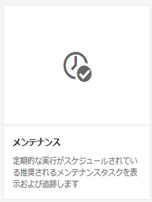
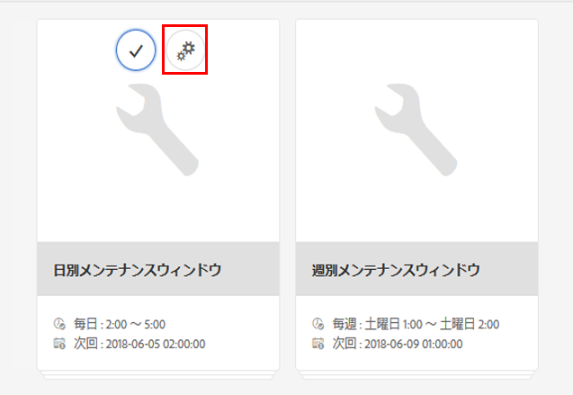
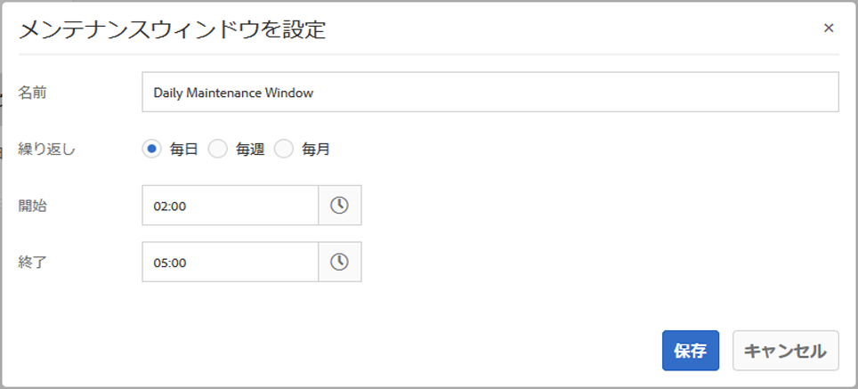
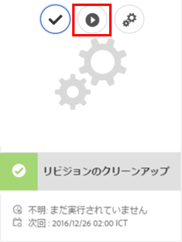
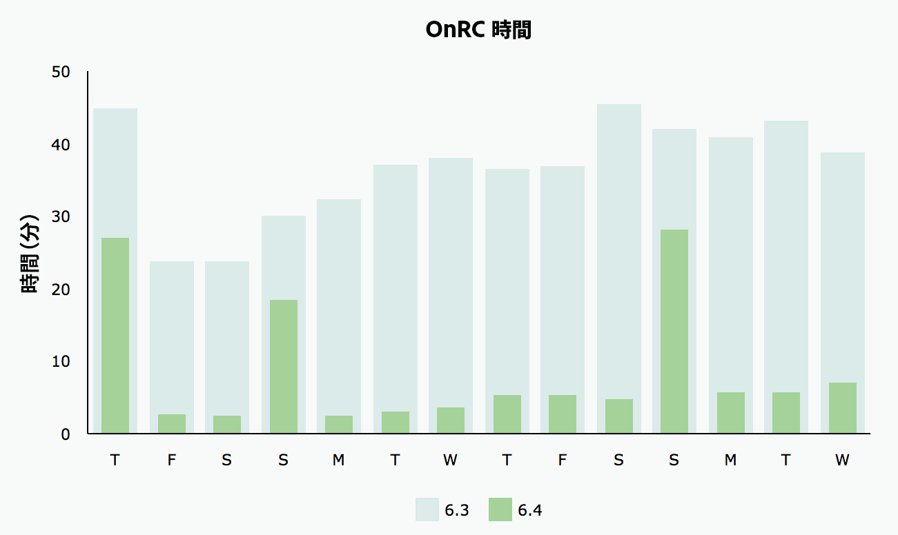
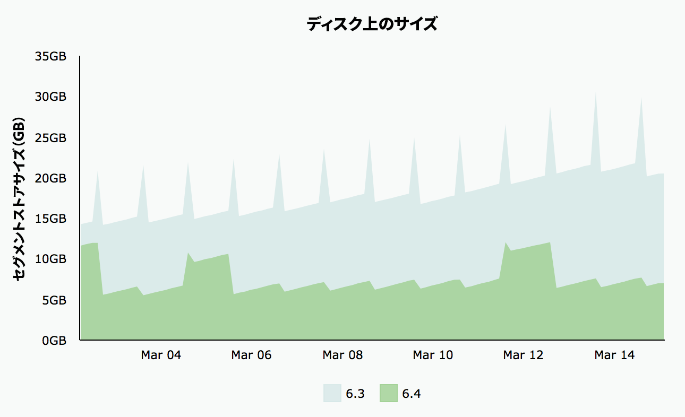

# リビジョンクリーンアップ{#revision-cleanup}

## 概要 {#introduction}

リポジトリが更新されるたびに、新しいコンテンツのリビジョンが作成されます。その結果、更新のたびにリポジトリのサイズが大きくなります。 リポジトリのサイズが無制限に増大しないように、古いリビジョンをクリーンアップして、ディスクリソースを解放する必要があります。このメンテナンス機能は、リビジョンクリーンアップと呼ばれます。AEM 6.0 以降では、この機能をオフラインルーチンとして使用できます。

AEM 6.3 では、この機能のオンラインバージョンである「オンラインでのリビジョンクリーンアップ」が導入されました。AEM インスタンスをシャットダウンする必要があったオフラインのリビジョンクリーンアップとは異なり、オンラインでのリビジョンクリーンアップは AEM インスタンスがオンラインの状態で実行できます。オンラインでのリビジョンクリーンアップはデフォルトで有効になります。リビジョンクリーンアップを実行する際はこの方法を使用することが推奨されます。

**注意**: [オンラインリビジョンのクリーンアップの概要と使用方法については、ビデオ](https://helpx.adobe.com/experience-manager/kt/platform-repository/using/revision-cleanup-technical-video-use.html) （英語）を参照してください。

リビジョンクリーンアップのプロセスは、**見積もり**、**コンパクション**&#x200B;および&#x200B;**クリーンアップ**&#x200B;の 3 つのフェーズで構成されます。見積もりでは、収集される可能性があるガベージの量に基づいて、次のフェーズ（コンパクション）を実行するかどうかが判別されます。コンパクションフェーズでは、セグメントおよび tar ファイルが未使用のコンテンツを除いて再作成されます。次のクリーンアップフェーズでは、含まれているガベージを含め、古いセグメントが削除されます。通常、オフラインモードのほうが多くの領域を再利用できます。これは、オンラインモードでは AEM の作業セットを保持する必要があり、収集されないセグメントがあるためです。

リビジョンクリーンアップについて詳しくは、以下のリンクを参照してください。

* [オンラインでのリビジョンクリーンアップの実行方法](/help/sites-deploying/revision-cleanup.md#how-to-run-online-revision-cleanup)
* [オンラインでのリビジョンクリーンアップに関するよくある質問](/help/sites-deploying/revision-cleanup.md#online-revision-cleanup-frequently-asked-questions)
* [オフラインでのリビジョンクリーンアップの実行方法](/help/sites-deploying/revision-cleanup.md#how-to-run-offline-revision-cleanup)

Additionally, you can also read the [official Oak documentation.](https://jackrabbit.apache.org/oak/docs/nodestore/segment/overview.html)

### When to use Online Revision Cleanup as opposed to Offline Revision Cleanup? {#when-to-use-online-revision-cleanup-as-opposed-to-offline-revision-cleanup}

**推奨されているリビジョンクリーンアップの実行方法は、オンラインでのリビジョンクリーンアップです。** オフラインリビジョンのクリーンアップは、例外的なベースでのみ使用してください。例えば、新しいストレージ形式に移行する前に、またはAdobeカスタマーケアから要求があった場合に使用します。

## オンラインでのリビジョンクリーンアップの実行方法 {#how-to-run-online-revision-cleanup}

オンラインでのリビジョンクリーンアップは、デフォルトで、AEM のオーサーインスタンスとパブリッシュインスタンスの両方で、自動的に 1 日に 1 回実行されるように設定されています。必要な作業は、ユーザーアクティビティが最も少ない時間帯にメンテナンスウィンドウを定義することのみです。オンラインでのリビジョンクリーンアップのタスクを設定するには、以下のようにします。

1. In the main AEM window, go to **Tools - Operations - Dashboard - Maintenance** or point your browser to: `https://serveraddress:serverport/libs/granite/operations/content/maintenance.html`

   

1. Hover over **Daily Maintenance Window** and click the **Settings** icon.

   

1. Enter the desired values (recurrence, start time, end time) and click **Save**.

   

または、リビジョンクリーンアップのタスクを手動で実行する場合は、次の手順を実行します。

1. Go to **Tools - Operations - Dashboard - Maintenance** or browse directly to `https://serveraddress:serverport/libs/granite/operations/content/maintenance.html`
1. Click the **Daily Maintenance Window**.
1. Hover over the **Revision Cleanup** icon.
1. 「**実行**」をクリックします。

   

### オフラインでのリビジョンクリーンアップの実行後にオンラインでのリビジョンクリーンアップを実行した場合 {#running-online-revision-cleanup-after-offline-revision-cleanup}

リビジョンクリーンアップのプロセスでは、古いリビジョンを世代ごとに再利用します。つまり、リビジョンクリーンアップを実行するたびに新しい世代を作成し、ディスク上に保持します。ただし、2種類のリビジョンのクリーンアップには違いがあります。オフラインリビジョンのクリーンアップでは1世代が保持され、オンラインリビジョンのクリーンアップでは2世代が保持されます。 So, when you run online revision cleanup **after** offline revision cleanup the following happens:

1. 最初のオンラインリビジョンのクリーンアップを実行した後、リポジトリのサイズは重複します。 これは、ディスク上に 2 つの世代が保持されるからです。
1. 後続の実行中は、新しい生成が作成される間にリポジトリが一時的に増大し、最初の実行後に元のサイズに再び安定します。オンラインリビジョンのクリーンアッププロセスでは前の生成が再要求されます。

また、コミットの種類と回数に応じて、各世代のサイズが以前の世代とは変わってくる場合があります。したがって、最終的なサイズは実行ごとに変動する可能性があります。

この点を考慮し、最初に予測したリポジトリサイズよりも少なくとも 2 倍または 3 倍大きなディスクサイズにすることをお勧めします。

## フルコンパクションモードとテールコンパクションモード  {#full-and-tail-compaction-modes}

**AEM 6.5** では、オンラインでのリビジョンクリーンアッププロセスの&#x200B;**コンパクション**&#x200B;フェーズ用に **2 つの新しいモード**&#x200B;が導入されています。

* **フルコンパクション**&#x200B;モードでは、リポジトリ全体のすべてのセグメントと tar ファイルが書き換えられます。したがって、後続のクリーンアップフェーズでは、リポジトリ全体の最大量のガベージを削除できます。フルコンパクションはリポジトリ全体に影響を与えるので、完了するにはかなりの量のシステムリソースと時間が必要です。フルコンパクションは、AEM 6.3 のコンパクションフェーズに対応しています。
* **テールコンパクション**&#x200B;モードでは、リポジトリの最新のセグメントと tar ファイルのみが書き換えられます。最新のセグメントと tar ファイルとは、フルコンパクションまたはテールコンパクションの前回の実行以降に追加されたセグメントと tar ファイルのことです。したがって、後続のクリーンアップフェーズでは、リポジトリの新しい部分に含まれるガベージのみを削除できます。テールの圧縮はリポジトリの一部にしか影響しないので、完全圧縮よりも完了に必要なシステムリソースと時間が大幅に少なくなります。

この 2 つのコンパクションモードでは、効果とリソース消費がトレードオフの関係にあります。テールコンパクションは効果は低くなりますが、システムの通常運用に与える影響も少なくなります。これに対し、フルコンパクションは効果は高くなりますが、システムの通常運用に大きな影響を与えます。

また、AEM 6.5 では、コンパクション時のより効率的なコンテンツの重複除外メカニズムが導入されました。これにより、リポジトリのディスク上のフットプリントがさらに削減されます。

次の 2 つの図は、AEM 6.3 と比較した AEM 6.5 の平均実行時間とディスク上の平均フットプリントの減少を示す社内ラボでのテスト結果を示しています。

 

### フルコンパクションとテールコンパクションの設定方法 {#how-to-configure-full-and-tail-compaction}

デフォルト設定では、テールコンパクションを平日に、フルコンパクションを日曜日に実行します。The default configuration can be changed by using the new configuration value `full.gc.days` of the `RevisionCleanupTask` [maintenance task](/help/sites-deploying/revision-cleanup.md#how-to-run-online-revision-cleanup).

When you configure the `full.gc.days` value be aware that full compaction will run during the day(s) defined in the value and tail compaction will run during the days that are not defined in the value. 例えば、フルコンパクションを日曜日に実行するように設定すると、テールコンパクションは月曜日から土曜日に実行されます。例えば、フルコンパクションを毎日実行するように設定すると、テールコンパクションはまったく実行されません。

また、次のことを考慮に入れてください。

* **テールコンパクション**&#x200B;は、効果が低く、システムの通常運用に対する影響が少なくなります。そのため、テールコンパクションは営業日に実行することを意図しています。
* **フルコンパクション**&#x200B;は、効果は高くなりますが、システムの通常運用に大きな影響を与えます。そのため、原則的には休業日に実行します。
* テールコンパクションとフルコンパクションは両方とも、オフピークの時間帯に実行するように計画することをお勧めします。

### トラブルシューティング {#troubleshooting}

新しいコンパクションモードを使用する場合、次の点に注意してください。

* 入出力（I/O）アクティビティ（例：I/O 操作、I/O を待機する CPU、コミットキューサイズ）を監視できます。これは、システムが I/O バウンドになりつつあり、アップサイジングが必要かどうかを特定するのに役立ちます。
* The `RevisionCleanupTaskHealthCheck` indicates the overall health status of the Online Revision Cleanup. AEM 6.3 と同じように機能し、フルコンパクションとテールコンパクションを区別しません。
* ログメッセージは、コンパクションモードについての関連情報を伝えます。例えば、オンラインでのリビジョンクリーンアップを開始する際に、対応するログメッセージはコンパクションモードを示します。また、まれに、テールコンパクションを実行するようスケジュールされていたがシステムがフルコンパクションに戻った場合は、ログメッセージにこの変更が示されます。次のログサンプルは、コンパクションモード、およびテールコンパクションからフルコンパクションへの変更を示しています。

```
TarMK GC: running tail compaction
TarMK GC: no base state available, running full compaction instead
```

### 既知の制限事項 {#known-limitations}

場合によっては、テールとフルのコンパクションモードの変更によりクリーンアッププロセスが遅延します。正確には、フルコンパクションの後にリポジトリが大きくなります（倍のサイズになります）。リポジトリがフルコンパクション前のサイズ以下になると、余分のスペースが後続のテールコンパクションで再利用されます。メンテナンスタスクの並列実行も回避する必要があります。

**最初に予測したリポジトリサイズよりも少なくとも 2 倍または 3 倍大きなディスクサイズにすることをお勧めします。**

## オンラインでのリビジョンクリーンアップに関するよくある質問 {#online-revision-cleanup-frequently-asked-questions}

### AEM 6.5 のアップグレードに関する考慮事項 {#aem-upgrade-considerations}

<table>
 <tbody>
  <tr>
   <td>質問 </td>
   <td>回答</td>
  </tr>
  <tr>
   <td>AEM 6.5 にアップグレードするときの注意点を教えてください。</td>
   <td><p>TarMK の永続性形式が AEM 6.5 で変更されます。これらの変更には、事前の移行手順は必要ありません。既存のリポジトリは、周期的な移行を実行します。これはユーザーに対して透過的です。AEM 6.5（または関連ツール）がリポジトリに初めてアクセスすると、移行プロセスが開始されます。</p> <p><strong>AEM 6.5永続性形式への移行が開始されると、リポジトリを以前のAEM 6.3永続性形式に戻すことはできません。</strong></p> </td>
  </tr>
 </tbody>
</table>

### Oak Segment Tar への移行 {#migrating-to-oak-segment-tar}

<table>
 <tbody>
  <tr>
   <td><strong>質問</strong></td>
   <td><strong>回答</strong></td>
   <td> </td>
  </tr>
  <tr>
   <td><strong>リポジトリを移行する必要があるのはなぜですか。</strong></td>
   <td><p>AEM 6.3では、ストレージ形式の変更が必要でした。特に、オンラインリビジョンクリーンアップのパフォーマンスと有効性を改善するために必要でした。 この変更には後方互換性がないので、古い Oak セグメント（AEM 6.2 以前）で作成されたリポジトリを移行する必要があります。</p> <p>ストレージ形式の変更には、他にも次のような利点があります。</p>
    <ul>
     <li>スケーラビリティの向上（セグメントサイズの最適化）</li>
     <li><a href="/help/sites-administering/data-store-garbage-collection.md" target="_blank">データストアのガベージコレクション</a>の高速化<br /> </li>
     <li>将来の機能拡張に備えた基盤整備</li>
    </ul> </td>
   <td> </td>
  </tr>
  <tr>
   <td><strong>以前の Tar 形式もサポートされますか。</strong></td>
   <td>AEM 6.3 では、新しい OAK Segment Tar のみがサポートされます。</td>
   <td> </td>
  </tr>
  <tr>
   <td><strong>コンテンツの移行は常に必須ですか。</strong></td>
   <td>はい。新しいインスタンスを使用する場合を除き、常にコンテンツを移行する必要があります。</td>
   <td> </td>
  </tr>
  <tr>
   <td><strong>6.3 にアップグレードしてから、（例えば、別のメンテナンスウィンドウを使用して）後で移行を実行できますか。</strong></td>
   <td>できません。前述のとおり、コンテンツの移行は必須です。</td>
   <td> </td>
  </tr>
  <tr>
   <td><strong>移行時のダウンタイムは回避できますか。</strong></td>
   <td>いいえ。これは一度におこなう作業であり、実行中のインスタンスでは実行できません。</td>
   <td> </td>
  </tr>
  <tr>
   <td><strong>誤って不適切なリポジトリ形式に対して移行を実行した場合はどうなりますか。</strong></td>
   <td>If you try to run the oak-segment module against an oak-segment-tar repository (or vice versa), startup will fail with an <em>IllegalStateException</em> with the message "Invalid segment format". データが破損することはありません。</td>
   <td> </td>
  </tr>
  <tr>
   <td><strong>検索インデックスの再作成は必要ですか。</strong></td>
   <td>いいえ。oak-segmentからoak-segment-tarに移行すると、コンテナの形式に変更が加えられます。 含まれているデータに影響はなく、データは変更されません。</td>
   <td> </td>
  </tr>
  <tr>
   <td><strong>移行中および移行後に必要と予想されるディスク領域を計算する最適な方法を教えてください。</strong></td>
   <td>移行とは、セグメントストアを新しい形式で作成し直すことと同義です。これを利用して、移行中に必要な追加のディスク領域を推定できます。移行後は、領域を再利用するために古いセグメントストアを削除できます。</td>
   <td> </td>
  </tr>
  <tr>
   <td><strong>移行時間の最適な見積もり方法を教えてください。</strong></td>
   <td>Migration performance can be greatly improved if <a href="/help/sites-deploying/revision-cleanup.md#how-to-run-offline-revision-cleanup">offline revision cleanup</a> is executed prior to the migration. アップグレードプロセスの前提条件として、オフラインでのリビジョンクリーンアップを実行することをすべての顧客にお勧めします。通常、移行の期間は、オフラインリビジョンのクリーンアップタスクの期間と同じにする必要があります(移行前にオフラインリビジョンのクリーンアップタスクが実行されている場合)。</td>
   <td> </td>
  </tr>
 </tbody>
</table>

### オンラインでのリビジョンクリーンアップの実行 {#running-online-revision-cleanup}

<table>
 <tbody>
  <tr>
   <td><strong>質問</strong></td>
   <td><strong>回答</strong></td>
   <td> </td>
  </tr>
  <tr>
   <td><strong>オンラインでのリビジョンクリーンアップは、どのくらいの頻度で実行する必要がありますか。</strong></td>
   <td>1 日に 1 回です。これが操作ダッシュボードでのデフォルト設定です。</td>
   <td> </td>
  </tr>
  <tr>
   <td><strong>オンラインでのリビジョンクリーンアップのメンテナンスタスクを開始する時間を設定する方法を教えてください。</strong></td>
   <td>See the <a href="/help/sites-deploying/revision-cleanup.md#how-to-run-online-revision-cleanup">How to run Online Revision Cleanup</a> section. </td>
   <td> </td>
  </tr>
  <tr>
   <td><strong>オンラインでのリビジョンクリーンアップには、超過するべきではない実行頻度の上限がありますか。</strong></td>
   <td>オンラインでのリビジョンクリーンアップは、デフォルト設定のとおり、1 日に 1 回実行することをお勧めします。<br /> </td>
   <td> </td>
  </tr>
  <tr>
   <td><strong>オンラインでのリビジョンクリーンアップの実行頻度を決定する主な指標は何ですか。</strong></td>
   <td>オンラインでのリビジョンクリーンアップはメンテナンスタスクとして設定され、毎日自動的に実行されるので、実行頻度を決定する必要はありません。</td>
   <td> </td>
  </tr>
  <tr>
   <td><strong>オンラインでのリビジョンクリーンアップを初めて実行したときに、領域が再利用されないのはなぜですか。</strong></td>
   <td>オンラインでのリビジョンクリーンアップでは、古いリビジョンを世代ごとに再利用します。リビジョンクリーンアップが実行されるたびに、新しい世代が生成されます。2 世代以上前のコンテンツのみが再利用されるので、初回実行時には再利用するコンテンツがありません。</td>
   <td> </td>
  </tr>
  <tr>
   <td><strong>オフラインでのリビジョンクリーンアップの実行後に初めてオンラインでのリビジョンクリーンアップを実行したときに、領域が再利用されないのはなぜですか。</strong></td>
   <td><p>オフラインでのリビジョンクリーンアップでは最新の世代だけを残して他をすべて再利用しますが、オンラインでのリビジョンクリーンアップでは最新の 2 つの世代を残します。新しいリポジトリの場合、オフラインでのリビジョンクリーンアップの実行後に初めてオンラインでのリビジョンクリーンアップが実行されるときには、再利用できる古い世代が存在しないので、領域は再利用されません。</p> <p><a href="/help/sites-deploying/revision-cleanup.md#how-to-run-online-revision-cleanup">この章</a>の「オフラインでのリビジョンクリーンアップの実行後にオンラインでのリビジョンクリーンアップを実行した場合」の節も参照してください。</p> </td>
   <td> </td>
  </tr>
  <tr>
   <td><strong>オンラインでのリビジョンクリーンアップは、通常、オーサーとパブリッシュでは異なる時間帯に実行しますか。</strong></td>
   <td>いつ実行すべきかは、営業時間と顧客のオンラインプレゼンスのトラフィックパターンによって異なります。最適なクリーンアップ効果を実現するために、メインの実稼働時間外にメンテナンスウィンドウを設定する必要があります。 複数のAEM発行インスタンス（TarMKファーム）の場合は、オンラインリビジョンクリーンアップのメンテナンスウィンドウを調整する必要があります。</td>
   <td> </td>
  </tr>
  <tr>
   <td><strong>オンラインでのリビジョンクリーンアップを実行するための前提条件はありますか。</strong></td>
   <td><p>オンラインリビジョンのクリーンアップは、AEM 6.3以降のリリースでのみ利用できます。 また、古いバージョンの AEM を使用している場合は、新しい <a href="/help/sites-deploying/revision-cleanup.md#migrating-to-oak-segment-tar">Oak Segment Tar</a> に移行する必要があります。</p> </td>
   <td> </td>
  </tr>
  <tr>
   <td><strong>オンラインでのリビジョンクリーンアップの時間に作用する要因は何ですか。</strong></td>
   <td>次の要因があります。<br />
    <ul>
     <li>リポジトリのサイズ</li>
     <li>システムの負荷（要求数/分、特に書き込み操作）</li>
     <li>アクティビティのパターン（読み取りと書き込み）</li>
     <li>ハードウェアの仕様（CPU の性能、メモリ、IOPS）</li>
    </ul> </td>
   <td> </td>
  </tr>
  <tr>
   <td><strong>オンラインでのリビジョンクリーンアップの実行中も作成者は作業できますか。</strong></td>
   <td>できます。オンラインでのリビジョンクリーンアップは、同時書き込みに対応しています。ただし、同時書き込みトランザクションがおこなわれていないほうが、オンラインでのリビジョンクリーンアップの動作は高速かつ効率的になります。オンラインでのリビジョンクリーンアップのメンテナンスタスクは、大量のトラフィックがない、比較的処理が少ない時間帯にスケジュールすることをお勧めします。</td>
   <td> </td>
  </tr>
  <tr>
   <td><strong>オンラインでのリビジョンクリーンアップを実行するときのディスク領域とヒープメモリの最小要件を教えてください。</strong></td>
   <td><p>オンラインでのリビジョンクリーンアップ中、ディスク領域は継続的に監視されます。使用可能なディスク領域が臨界値を下回ると、プロセスがキャンセルされます。臨界値はリポジトリの現在のディスクフットプリントの 25 ％で、設定はできません。</p> <p><strong>最初に予測したリポジトリサイズよりも少なくとも 2 倍または 3 倍大きなディスクサイズにすることをお勧めします。</strong></p> <p>クリーンアッププロセス中、空きヒープ領域が継続的に監視されます。空きヒープ領域が臨界値を下回ると、プロセスがキャンセルされます。重要な値は、org.apache.jackrabbit.oak.segment.SegmentNodeStoreService#MEMORY_THRESHOLDを使用して設定されます。 デフォルト値は 15％です。</p> <p>推奨されるコンパクションヒープの最小サイズは、AEM のメモリサイズの推奨値と関係があります。原則として、<strong>AEM インスタンスのサイズが使用例およびそこで予想されるペイロードに対処するために十分なサイズであれば、クリーンアッププロセスで十分なメモリが確保されます。</strong></p> </td>
   <td> </td>
  </tr>
  <tr>
   <td><strong>オンラインでのリビジョンクリーンアップの実行中、パフォーマンスにはどのような影響があると予想されますか。</strong></td>
   <td>オンラインでのリビジョンクリーンアップでは、通常のシステム操作と並行して、リポジトリからの読み取りおよびリポジトリへの書き込みをバックグラウンドプロセスとして実行します。状況によっては、リポジトリに対する短時間の排他的アクセスが必要になり、他のスレッドがリポジトリに書き込めなくなる場合があります。</td>
   <td> </td>
  </tr>
  <tr>
   <td><strong>オンラインでのリビジョンクリーンアップの所要時間はどのくらいですか。</strong></td>
   <td>アドビ内部で実行した最新のパフォーマンステストによると、所要時間は 2 時間以下です。</td>
   <td> </td>
  </tr>
  <tr>
   <td><strong>オンラインでのリビジョンクリーンアップにそれよりも長い時間がかかる場合はどうすればよいですか。</strong></td>
   <td>
    <ul>
     <li>クリーンアップが毎日実行されていることを確認してください。<br /> </li>
     <li>リポジトリのアクティビティを最小限に抑えるために、「Operations」ダッシュボードのメンテナンスウィンドウを適宜設定します。</li>
     <li>システムリソース（CPU、メモリ、I/O）を拡張してください。</li>
    </ul> </td>
   <td> </td>
  </tr>
  <tr>
   <td><strong>設定したメンテナンスウィンドウ中にオンラインでのリビジョンクリーンアップが終わらない場合は、何が起きていますか。</strong></td>
   <td>他のメンテナンスタスクがリビジョンクリーンアップの実行を遅延させていないかを確認してください。これは、同じメンテナンスウィンドウ内で、オンラインでのリビジョンクリーンアップ以外のメンテナンスタスクも実行されている場合に発生することがあります。メンテナンスタスクは順番に実行されますが、順序は設定できないことに注意してください。</td>
   <td> </td>
  </tr>
  <tr>
   <td><strong>リビジョンのガベージコレクションがスキップされるのはなぜですか。</strong></td>
   <td><p>リビジョンクリーンアップでは、まず見積もりフェーズによって、クリーンアップが必要なガベージが累積しているかどうかが判断されます。見積もりでは、最後のコンパクション後のリポジトリサイズと現在のサイズを比較します。このサイズが設定されている差分を超えている場合、クリーンアップが実行されます。サイズの差分は1 GBに設定されます。 これは、前回のクリーンアップの実行以降にリポジトリのサイズが1 GB増えなかった場合、新しいリビジョンのクリーンアップの反復はスキップされることを意味します。 </p> <p>見積もりフェーズに関連するログエントリは以下のとおりです。</p>
    <ul>
     <li>Revision GC will run: <em>Size delta is N% or N/N (N/N bytes), so running compaction</em></li>
     <li>Revision GC will <strong>not</strong> run: <em>Size delta is N% or N/N (N/N bytes), so skipping compaction for now</em></li>
    </ul> </td>
   <td> </td>
  </tr>
  <tr>
   <td><strong>パフォーマンスへの影響が大きすぎる場合に、自動コンパクションを安全に中止できますか。</strong></td>
   <td>はい。AEM 6.3 以降では、操作ダッシュボード内のメンテナンスタスクウィンドウまたは JMX を使用して、安全に停止できます。</td>
   <td> </td>
  </tr>
  <tr>
   <td><strong>スケジュールされたクリーンアップタスクの実行中に AEM インスタンスがシャットダウンされた場合、プロセスは安全に中止されますか。またはコンパクションが終了するまでシャットダウンがブロックされますか。</strong></td>
   <td>リビジョンクリーンアップが中断され、リポジトリは安全にシャットダウンされます。</td>
   <td> </td>
  </tr>
  <tr>
   <td><strong>オンラインでのリビジョンクリーンアップ中にシステムがクラッシュした場合はどうなりますか。</strong></td>
   <td>そのような場合も、データが破損するリスクはありません。ガベージの残りは後続の実行でクリーンアップされます。</td>
   <td> </td>
  </tr>
  <tr>
   <td><strong>オンラインでのリビジョンクリーンアップを実行しないと、どのような影響がありますか。</strong></td>
   <td>時間の経過に伴いパフォーマンスが低下します。</td>
   <td> </td>
  </tr>
  <tr>
   <td><strong>どのリビジョンが収集されますか。</strong></td>
   <td>デフォルトでは、オンラインでのリビジョンクリーンアップで収集されるのは 24 時間以上前のリビジョンのみです。</td>
   <td> </td>
  </tr>
  <tr>
   <td><strong>同時書き込みからリポジトリへの干渉が多すぎる場合、どうなりますか。</strong></td>
   <td><p>同時書き込みが可能なシステムでは、コンパクションサイクルの終了時に変更をコミットできるように、オンラインでのリビジョンクリーンアップで排他書き込みアクセスが必要になる場合があります。The system will go into <strong>forceCompact mode</strong>, as explained in more detail in the <a href="https://jackrabbit.apache.org/oak/docs/nodestore/segment/overview.html" target="_blank">oak documentation</a>. 強制コンパクション中は、同時書き込みによる干渉を受けることなく最終的に変更をコミットするために、排他書き込みロックが取得されます。応答時間に対する影響を制限するために、タイムアウト値を定義できます。デフォルトでは、この値は 1 分に設定されています。これは、1 分以内に強制コンパクションが完了しない場合、同時コミットが優先されてコンパクションプロセスが中止されることを意味します。</p> <p>力のコンパクト化の時間は、次の要因によって異なります。</p>
    <ul>
     <li>ハードウェア（具体的には IOPS）：IOPS が増えると実行時間が短縮されます。</li>
     <li>セグメントストアサイズ：実行時間はセグメントストアのサイズに伴って増大します。</li>
    </ul> </td>
   <td> </td>
  </tr>
  <tr>
   <td><p><strong>スタンバイインスタンスでは、オンラインでのリビジョンクリーンアップはどのように実行されますか。</strong></p> </td>
   <td><p>コールドスタンバイセットアップでは、オンラインでのリビジョンクリーンアップの実行を設定する必要があるのは、プライマリインスタンスのみです。スタンバイ・インスタンスでは、オンライン・リビジョン・クリーンアップを特別にスケジュールする必要はありません。</p> <p>スタンバイインスタンスでの対応する操作は、自動クリーンアップです。これは、オンラインリビジョンクリーンアップのクリーンアップフェーズに対応します。 プライマリインスタンスでオンラインでのリビジョンクリーンアップが実行された後に、スタンバイインスタンスで自動クリーンアップが実行されます。</p> <p>見積もりフェーズとコンパクションフェーズはスタンバイインスタンスでは実行されません。</p> </td>
   <td> </td>
  </tr>
  <tr>
   <td><strong>オフラインでのリビジョンクリーンアップでは、オンラインでのリビジョンクリーンアップよりも多くのディスク領域を解放できますか。</strong></td>
   <td><p>オフラインでのリビジョンクリーンアップでは古いリビジョンをすぐに削除できますが、オンラインでのリビジョンクリーンアップでは、古いリビジョンが引き続きアプリケーションスタックによって参照されていることを考慮する必要があります。そのため、オフラインのほうがオンラインよりも積極的にガベージを削除できますが、ガベージコレクションサイクルを数回経ると、この効果は薄れます。</p> <p><a href="/help/sites-deploying/revision-cleanup.md#how-to-run-online-revision-cleanup">この章</a>の「オフラインでのリビジョンクリーンアップの実行後にオンラインでのリビジョンクリーンアップを実行した場合」の節も参照してください。</p> </td>
   <td> </td>
  </tr>
  <tr>
   <td>メモリマップファイル操作に関する考慮事項はありますか。</td>
   <td>
    <ul>
     <li><strong>Windows環境では</strong>、通常のファイルアクセスが常に適用されるので、メモリマップアクセスは使用されません。 一般的なアドバイスとして、使用可能なすべてのRAMをヒープに割り当て、segmentCacheサイズを増やす必要があります。 segmentCacheを増やすには、org.apache.jackrabbit.oak.segment.SegmentNodeStoreService.configにsegmentCache.sizeオプションを追加します（例：segmentCache.size=20480）。 オペレーティングシステムや他のプロセス用のRAMを忘れないようにしてください。</li>
     <li><strong>Windows 以外の環境</strong>では、物理メモリのサイズを大きくすることで、リポジトリのメモリマップの効率性を向上できます。</li>
    </ul> </td>
   <td>
    <ul>
     <li> </li>
    </ul> </td>
  </tr>
 </tbody>
</table>

### オンラインでのリビジョンクリーンアップの監視 {#monitoring-online-revision-cleanup}

<table>
 <tbody>
  <tr>
   <td><strong>オンラインリビジョンのクリーンアップ中に監視する必要のあるもの</strong></td>
   <td>
    <ul>
     <li>オンラインリビジョンのクリーンアップが有効な場合は、ディスク領域を監視する必要があります。 ディスク領域が不十分な場合、クリーンアップは実行されないか、早期に終了します。</li>
     <li>ログで、オンラインリビジョンのクリーンアップの完了時間を確認します。 これは 2 時間以下である必要があります。</li>
     <li>チェックポイントの数。 コンパクションの実行時にチェックポイントが 4 つ以上ある場合は、チェックポイントをクリーンアップすることをお勧めします。</li>
    </ul> </td>
   <td> </td>
  </tr>
  <tr>
   <td><strong>オンラインリビジョンのクリーンアップが正常に完了したかどうかを確認する方法</strong></td>
   <td><p>オンラインリビジョンのクリーンアップが正常に完了したかどうかを確認するには、ログを確認します。</p> <p>例えば、「<code>TarMK GC #{}: compaction completed in {} ({} ms), after {} cycles</code><code>TarMK GC #{}: compaction gave up compacting concurrent commits after {} cycles</code>」は、「」というメッセージが表示されない限り、圧縮手順が正常に完了したことを意味します。つまり、同時負荷が多すぎることを意味します。</p> <p>それに対応して、クリーンアップ手順が正常に完了したことを示すメッセージ「<code>TarMK GC #{}: cleanup completed in {} ({} ms</code>」が表示されます。</p> </td>
   <td><p> </p> </td>
  </tr>
  <tr>
   <td><strong>最後のオンラインリビジョンのクリーンアップ実行の統計はどこで見つけることができますか？</strong></td>
   <td><p>ステータス、進行状況および統計情報は、JMX(<code>SegmentRevisionGarbageCollection</code> MBean)を介して公開されます。 MBeanの詳細については、 <code>SegmentRevisionGarbageCollection</code> 次の段落を参照してください <a href="https://jackrabbit.apache.org/oak/docs/nodestore/segment/overview.html#monitoring-via-jmx" target="_blank"></a>。</p> <p>進行状況は、 <code>EstimatedRevisionGCCompletion</code> <code>SegmentRevisionGarbageCollection MBean.</code></p> <p>MBeanの参照は、を使用して取得でき <code>ObjectName org.apache.jackrabbit.oak:name="Segment node store revision garbage collection",type="SegmentRevisionGarbageCollection”</code>ます。</p> <p>統計は、最後のシステム開始以降にのみ利用できます。 外部の監視ツールを利用すると、AEM の稼動時間外もデータを監視できます。外部 <a href="/help/sites-administering/operations-dashboard.md#monitoring-with-nagios" target="_blank">の監視ツールの例として、AEMのドキュメントを参照し、Nagiosにヘルスチェックを添付してください</a>。</p> </td>
   <td> </td>
  </tr>
  <tr>
   <td><strong>関連するログエントリとは何ですか。</strong></td>
   <td>
    <ul>
     <li>オンラインリビジョンのクリーンアップが開始/停止されました
      <ul>
       <li>オンラインリビジョンのクリーンアップは、次の3つのフェーズで構成されます。見積もり、圧縮、クリーンアップ。 リポジトリに十分な量のガベージが含まれていない場合は、見積もりによってコンパクションとクリーンアップがスキップされることがあります。最新版のAEMでは、「<code>TarMK GC #{}: estimation started</code>」というメッセージは推定の開始を示し、「<code>TarMK GC #{}: compaction started, strategy={}</code>」は圧縮の開始を示し、「T<code>arMK GC #{}: cleanup started. Current repository size is {} ({} bytes</code>」はクリーンアップの開始を示します。</li>
      </ul> </li>
     <li>リビジョンのクリーンアップによって取得されたディスク領域
      <ul>
       <li>領域は、クリーンアップフェーズが完了した場合にのみ再利用されます。 クリーンアップフェーズの完了は、ログメッセージ「T<code>arMK GC #{}: cleanup completed in {} ({} ms</code>」でマークされます。 クリーンアップ後のサイズは {}（{} バイト）で、再利用された領域は {}（{} バイト）です。コンパクションマップの重み付け／深さは {}／{}（{} バイト／{}）です。</li>
      </ul> </li>
     <li>リビジョンのクリーンアップ中に問題が発生しました
      <ul>
       <li>多くの失敗条件があり、すべて「TarMK GC」で始まるWARNまたはERRORログメッセージでマークされます。</li>
      </ul> </li>
    </ul> <p>後述の「エラーメッセージに基づく <a href="/help/sites-deploying/revision-cleanup.md#troubleshooting-based-on-error-messages">トラブルシューティング</a> 」の節も参照してください。</p> </td>
   <td> </td>
  </tr>
  <tr>
   <td><strong>オンラインリビジョンのクリーンアップが完了した後に再利用された領域の量を確認する方法</strong></td>
   <td>クリーンアップサイクルの最後に、ログに次のメッセージが表示されます。「<code>TarMK GC #3: cleanup completed</code>」。リポジトリのサイズと再生ゴミの量を含みます。</td>
   <td> </td>
  </tr>
  <tr>
   <td><strong>オンラインリビジョンのクリーンアップが完了した後、リポジトリの整合性を確認する方法を教えてください。</strong></td>
   <td><p>オンラインリビジョンのクリーンアップの後は、リポジトリの整合性チェックは必要ありません。 </p> <p>ただし、次の操作を実行して、クリーンアップ後にリポジトリのステータスを確認できます。</p>
    <ul>
     <li>リポジトリ <a href="/help/sites-deploying/consistency-check.md" target="_blank">トラバーサルチェック</a></li>
     <li>クリーンアッププロセスが完了した後、oak-runツールを使用して、不一致を確認します。 この方法の詳細については、 <a href="https://github.com/apache/jackrabbit-oak/blob/trunk/oak-doc/src/site/markdown/nodestore/segment/overview.md#check" target="_blank">Apacheドキュメントを参照してください。</a> ツールを実行する際にAEMをシャットダウンする必要はありません。</li>
    </ul> </td>
   <td> </td>
  </tr>
  <tr>
   <td><strong>オンラインリビジョンのクリーンアップが失敗したかどうかを検出する方法と回復手順を教えてください。</strong></td>
   <td>失敗条件は、「TarMK GC」で始まるWARNまたはERRORログメッセージで示されます。 後述の「エラーメッセージに基づく <a href="/help/sites-deploying/revision-cleanup.md#troubleshooting-based-on-error-messages">トラブルシューティング</a> 」の節も参照してください。</td>
   <td> </td>
  </tr>
  <tr>
   <td><strong>リビジョンクリーンアップのヘルスチェックで公開される情報 ステータスレベルの色分けとの対応も教えてください。 </strong></td>
   <td><p>Revision Clean-up Health Checkは、 <a href="/help/sites-administering/operations-dashboard.md#health-reports" target="_blank">Operationsダッシュボードの一部です</a>。<br /> </p> <p>オンラインリビジョンのクリーンアップメンテナンスタスクの最後の実行が正常に完了した場合、状態は <strong>GREEN</strong> （緑）になります。</p> <p>オンラインリビジョンのクリーンアップメンテナンスタスクが1回キャンセルされた場合は、 <strong>黄色になります</strong> 。<br /> </p> <p>オンラインリビジョンのクリーンアップメンテナンスタスクが3回連続でキャンセルされた場合は、 <strong>RED</strong> （赤）になります。 <strong>この場合は手動での操作が必要</strong> 、またはオンラインリビジョンのクリーンアップが再び失敗する可能性があります。 詳しくは、以下の <a href="/help/sites-deploying/revision-cleanup.md#troubleshooting-online-revision-cleanup">トラブルシューティング</a> の節を参照してください。<br /> </p> <p>また、システムを再起動した後にヘルスチェックのステータスがリセットされることにも注意してください。 そのため、新たに再起動されたインスタンスでは、リビジョンクリーンアップヘルスチェックで緑色のステータスが示されます。外部の監視ツールを利用すると、AEM の稼動時間外もデータを監視できます。外部 <a href="/help/sites-administering/operations-dashboard.md#monitoring-with-nagios">の監視ツールの例として、AEMのドキュメントを参照し、Nagiosにヘルスチェックを添付してください</a>。</p> </td>
   <td> </td>
  </tr>
  <tr>
   <td><p><strong>スタンバイインスタンスの自動クリーンアップを監視する方法</strong></p> </td>
   <td><p>ステータス、進行状況および統計情報は、MBeanを使用してJMXで公開され <code>SegmentRevisionGarbageCollection</code> ます。 次の <a href="https://jackrabbit.apache.org/oak/docs/nodestore/segment/overview.html#monitoring-via-jmx" target="_blank">Oakのドキュメントも参照してください</a>。 </p> <p>MBeanの参照は、を使用して取得でき <code>ObjectName org.apache.jackrabbit.oak:name="Segment node store revision garbage collection",type="SegmentRevisionGarbageCollection”</code>ます。</p> <p>統計情報は、最後のシステム開始以降にのみ利用できます。 外部の監視ツールを利用すると、AEM の稼動時間外もデータを監視できます。また、外部監視ツール <a href="/help/sites-administering/operations-dashboard.md#monitoring-with-nagios" target="_blank">の例として、AEMのドキュメントで、Nagiosにヘルスチェックを添付する方法に関する情報も参照してください</a>。</p> <p>ログファイルは、自動クリーンアップの状態、進行状況、および統計を確認するためにも使用できます。</p> </td>
   <td> </td>
  </tr>
  <tr>
   <td><p><strong>スタンバイ・インスタンスでの自動クリーンアップ中に監視する必要があるのは何ですか。</strong></p> </td>
   <td>
    <ul>
     <li>自動クリーンアップを実行する場合は、ディスク領域を監視する必要があります。</li>
     <li>完了時間（ログ経由）。2時間を超えないことを確認します。</li>
     <li>自動クリーンアップの実行後のセグメントストアのサイズ。 スタンバイインスタンスでのセグメントストアのサイズは、プライマリインスタンスでのサイズとほぼ同じである必要があります。</li>
    </ul> </td>
   <td> </td>
  </tr>
 </tbody>
</table>

### オンラインでのリビジョンクリーンアップのトラブルシューティング {#troubleshooting-online-revision-cleanup}

<table>
 <tbody>
  <tr>
   <td><strong>オンラインでのリビジョンクリーンアップを実行しない場合に起こり得る最悪の状況は何ですか。</strong></td>
   <td>AEM インスタンスのディスク領域が不足し、実稼動が停止します。</td>
   <td> </td>
  </tr>
  <tr>
   <td><strong>パブリッシュインスタンスでオンラインでのリビジョンクリーンアップを実行する場合、ユーザートラフィックが多いことは問題になりますか。</strong></td>
   <td>ユーザートラフィックが多いと、コンパクションフェーズを正常に完了できるかどうかに影響します。<br /> </td>
   <td> </td>
  </tr>
  <tr>
   <td><strong>ヘルスチェックおよびログエントリによると、オンラインでのリビジョンクリーンアップは 3 回連続で正常に完了していません。オンラインでのリビジョンクリーンアップを正常に完了させるには、何が必要ですか。</strong></td>
   <td>問題を検出して修正するには、以下の手順を実行します。<br />
    <ul>
     <li>まず、ログエントリを確認します。<br /> </li>
     <li>ログの情報に基づいて、適切な操作を実行します。
      <ul>
       <li>If the logs show five missed compact cycles and a timeout on the <code>forceCompact</code> cycle, schedule the maintenance window to a quiet time when the amount of repository writes is low. You can check repository writes in the repositoy metrics monitoring tool located at <em>https://serveraddress:serverport/libs/granite/operations/content/monitoring/page.html</em></li>
       <li>メンテナンスウィンドウの終わりにクリーンアップが停止した場合は、メンテナンスタスクのユーザーインターフェイスで、メンテナンスウィンドウの長さの設定が十分であることを確認してください。</li>
       <li>使用可能なヒープメモリが不足している場合は、インスタンスに十分なメモリがあることを確認してください。</li>
       <li>応答が遅い場合は、セグメントストアが大きくなりすぎて、メンテナンスウィンドウを長くしてもオンラインでのリビジョンクリーンアップを完了できない可能性があります。例えば、先週、オンラインでのリビジョンクリーンアップが一度も正常に完了してない場合は、セグメントストアを対処可能なサイズに戻すために、オフラインでのメンテナンスを計画し、オフラインでのリビジョンクリーンアップを実行することをお勧めします。</li>
      </ul> </li>
    </ul> </td>
   <td> </td>
  </tr>
  <tr>
   <td><strong>ヘルスチェックアラートがオンになった場合、何をする必要がありますか。</strong></td>
   <td>この前の項目を参照してください。</td>
   <td> </td>
  </tr>
  <tr>
   <td><strong>スケジュールされたメンテナンスウィンドウ中にオンラインでのリビジョンクリーンアップが時間切れになった場合、どうなりますか。</strong></td>
   <td>オンラインでのリビジョンクリーンアップはキャンセルされ、残りの手順は削除されます。メンテナンスウィンドウが次回スケジュールされたときに、クリーンアップが再度開始されます。</td>
   <td> </td>
  </tr>
  <tr>
   <td><strong>What is causing <code>SegmentNotFoundException</code> instances to be logged in the <code>error.log</code> and how can I recover?</strong></td>
   <td><p>A <code>SegmentNotFoundException</code> is logged by the TarMK when it tries to access a storage unit (a segment) that it can not find. 次の 3 つのシナリオで、この問題が発生する可能性があります。</p>
    <ol>
     <li>アプリケーションが、推奨されるアクセス方法（Sling や JCR API など）を使用せずに、下位レベルの API／SPI を使用してリポジトリにアクセスし、セグメントの保持時間を超えている場合。つまり、アプリケーションがオンラインでのリビジョンクリーンアップで許可される保持時間（デフォルトは 24 時間）よりも長くエンティティへの参照を保持している場合です。この状況は一時的で、データの破損にはつながりません。回復するには、oak-runツールを使用して、例外の一時的な性質を確認する必要があります（oak-runチェックでエラーは報告されません）。 これを行うには、インスタンスをオフラインにして、後で再起動する必要があります。</li>
     <li>外部イベントによってディスクのデータが破損している場合。これは、ディスクの障害、ディスク領域の不足または必要なデータファイルが誤って変更されたことが原因である可能性があります。この場合は、インスタンスをオフラインにして、oak-run チェックを使用して修復する必要があります。For more details on how to perform the oak-run check, read the following <a href="https://github.com/apache/jackrabbit-oak/blob/trunk/oak-doc/src/site/markdown/nodestore/segment/overview.md#check" target="_blank">Apache documentation</a>.</li>
     <li>All other occurrences should addressed through the <a href="https://helpx.adobe.com/jp/marketing-cloud/contact-support.html" target="_blank">Adobe Customer Care</a>.</li>
    </ol> </td>
   <td> </td>
  </tr>
 </tbody>
</table>

### エラーメッセージに基づくトラブルシューティング {#troubleshooting-based-on-error-messages}

オンラインリビジョンのクリーンアッププロセス中にインシデントが発生した場合、error.logは冗長になります。 以下のマトリックスでは、最も一般的なメッセージを説明し、解決策を示しています。

| **フェーズ** | **ログメッセージ** | **説明** | **次の手順** |
|---|---|---|---|
|  |  |  |  |
| 見積 | TarMK GC #2:圧縮が一時停止されたため、推定がスキップされました | コンフィギュレーションによりシステム上で締め固めが無効な場合、見積り段階はスキップされる。 | オンラインでのリビジョンクリーンアップの有効化. |
|  | TarMK GC #2:推定が中断されました：${REASON}. Skipping compaction. | 見積フェーズは途中で終了しました。 見積もりフェーズを中断させる可能性があるイベントの例としては、ホストシステムでのメモリ不足やディスク領域の不足があります。 | 与えられた理由に応じて異なります。 |
| 圧縮 | TarMK GC #2:圧縮一時停止 | コンパクション位相が構成により一時停止される限り、推定位相もコンパクション位相も実行されない。 | オンラインリビジョンのクリーンアップを有効にします。 |
|  | TarMK GC #2:圧縮が取り消されました：${REASON}. | 圧縮フェーズが途中で終了しました。 コンパクションフェーズを中断させる可能性があるイベントの例としては、ホストシステムでのメモリ不足やディスク領域の不足があります。また、圧縮は、システムをシャットダウンするか、[オペレーションダッシュボード]内の[メンテナンス]ウィンドウなどの管理インターフェイスを使用して明示的にキャンセルすることでもキャンセルできます。 | 与えられた理由に応じて異なります。 |
|  | TarMK GC #2:5サイクル後、32.902分(1974140 ms)で圧縮に失敗しました | このメッセージは、回復できないエラーが発生したとは限りませんが、特定の試行の後で圧縮が終了したことを意味します。 また、 [次の段落を読んでください](https://jackrabbit.apache.org/oak/docs/nodestore/segment/overview.html#how-does-compaction-works-with-concurrent-writes)。 | 次の [Oakドキュメント](https://jackrabbit.apache.org/oak/docs/nodestore/segment/overview.html#how-does-compaction-works-with-concurrent-writes)、および [実行中のオンラインリビジョンのクリーンアップに関する最後の質問を読みます](/help/sites-deploying/revision-cleanup.md#running-online-revision-cleanup) 。 |
| クリーンアップ | TarMK GC #2:浄化中断 | リポジトリをシャットダウンすることで、クリーンアップが取り消されました。 整合性への影響はありません。また、多くの場合、ディスク領域は完全には再利用されません。残りの領域は、次のリビジョンクリーンアップサイクルで再利用されます。 | リポジトリがシャットダウンされ、今後はメンテナンス期間中にリポジトリがシャットダウンされないように試みます。 |

## オフラインでのリビジョンクリーンアップの実行方法 {#how-to-run-offline-revision-cleanup}

>[!CAUTION]
>
>AEM のインストールで使用する Oak バージョンに応じて、異なるバージョンの Oak-run ツールを使用する必要があります。ツールを使用する前に、以下のバージョン要件を確認してください。
>
>* For Oak versions **1.0.0 through 1.0.11** or **1.1.0 through 1.1.6**, use Oak-run version** 1.0.11**
   >
   >
* **上述のものよりも新しい** Oak バージョンについては、AEM インストールの Oak コアと一致するバージョンの oak-run を使用します。

>


Adobe provides a tool called **Oak-run** for performing revision cleanup. このツールは以下のページでダウンロードできます。

[https://repo1.maven.org/maven2/org/apache/jackrabbit/oak-run/](https://repo1.maven.org/maven2/org/apache/jackrabbit/oak-run/)

このツールは、リポジトリのコンパクションを実行するために手動で実行できる実行可能 jar です。このプロセスはオフラインでのリビジョンクリーンアップと呼ばれます。これは、ツールを適切に実行するためにリポジトリをシャットダウンする必要があるためです。メンテナンスウィンドウに合わせてクリーンアップを計画してください。

For tips on how to increase the performance of the cleanup process, see [Increasing the Performance of Offline Revision Cleanup](/help/sites-deploying/revision-cleanup.md#increasing-the-performance-of-offline-revision-cleanup).

>[!NOTE]
>
>メンテナンスが発生する前に、古いチェックポイントを削除することもできます（後述の手順 2 および 3）。これは、チェックポイントが 100 個を超えるインスタンスにのみ推奨されます。

1. AEM インスタンスの最新バックアップがあることを必ず確認します。

   AEM をシャットダウンします。

1. （オプション）ツールを使用して古いチェックポイントを探します。

   ```xml
   java -jar oak-run.jar checkpoints install-folder/crx-quickstart/repository/segmentstore
   ```

1. （オプション）次に、参照されていないチェックポイントを削除します。

   ```xml
   java -jar oak-run.jar checkpoints install-folder/crx-quickstart/repository/segmentstore rm-unreferenced
   ```

1. コンパクションを実行して完了するまで待ちます。

   ```xml
   java -jar -Dsun.arch.data.model=32 oak-run.jar compact install-folder/crx-quickstart/repository/segmentstore
   ```

### オフラインでのリビジョンクリーンアップのパフォーマンスの向上 {#increasing-the-performance-of-offline-revision-cleanup}

oak-run ツールには、リビジョンクリーンアッププロセスのパフォーマンスを向上させ、メンテナンスウィンドウをできる限り最短化するための複数の機能が導入されています。

このような機能には、以下に示すコマンドラインパラメーターが含まれます。

* **-mmap。** これは、trueまたはfalseに設定できます。 true に設定すると、メモリマップアクセスが使用されます。false に設定すると、ファイルアクセスが使用されます。指定しない場合、64 ビットシステムではメモリマップアクセスが、32 ビットシステムではファイルアクセスが使用されます。Windows では通常のファイルアクセスが常に強制的に利用されるので、このオプションは無視されます。**-Dtar.memoryMappedパラメーターの代わりに、このパラメーターが使用されています。**

* **-Dupdate.limit**。一時トランザクションをディスクにフラッシュするためのしきい値を定義します。デフォルト値は 10000 です。

* **-Dcompress-interval**。現在のマップを圧縮するまで保持するコンパクションマップエントリの数です。デフォルトは 1000000 です。十分なヒープメモリが使用可能な場合は、スループットを高速化するために、この値をさらに大きい数に増やします。**このパラメーターは Oak バージョン 1.6 で削除され、効果はありません。**

* **-Dcompaction-progress-log**。ログに記録される、コンパクションされたノードの数です。デフォルト値は150000です。つまり、操作中に最初に150000個の圧縮されたノードがログに記録されます。 このパラメーターは、次に示すパラメーターとともに使用します。

* **-Dtar.PersistCompactionMap。** このパラメーターをtrueに設定すると、圧縮マップの永続性にヒープメモリではなくディスク領域が使用されます。 Requires the oak-run tool **versions 1.4** and higher. 詳しくは、[オフラインでのリビジョンクリーンアップに関するよくある質問](/help/sites-deploying/revision-cleanup.md#offline-revision-cleanup-frequently-asked-questions)の節の質問 3 を参照してください。**このパラメーターは Oak バージョン 1.6 で削除され、効果はありません。**

* **--force.** 圧縮を強制し、一致しないセグメントストアのバージョンを無視します。

>[!CAUTION]
>
>Using the `--force` parameter will upgrade the segment store to the latest version, which is incompatible with older Oak versions. また、ダウングレードができなくなる点に注意してください。原則として、これらのパラメーターは、使用方法について確実に把握している場合にのみ慎重に使用してください。

パラメーターの使用例を示します。

```xml
java -Dupdate.limit=10000 -Dcompaction-progress-log=150000 -Dlogback.configurationFile=logback.xml -Xmx8g -jar oak-run-*.jar checkpoints <repository>
```

### リビジョンクリーンアップをトリガーするその他の方法 {#additional-methods-of-triggering-revision-cleanup}

前述の方法に加えて、以下のように JMX コンソールを使用してリビジョンクリーンアップのメカニズムをトリガーすることもできます。

1. [http://localhost:4502/system/console/jmx](http://localhost:4502/system/console/jmx) にアクセスして JMX コンソールを開きます。
1. **RevisionGarbageCollection** MBean をクリックします。
1. 次のウィンドウで、**startRevisionGC()** をクリックし、**起動**&#x200B;して、リビジョンのガベージコレクションジョブを開始します。

### オフラインでのリビジョンクリーンアップに関するよくある質問 {#offline-revision-cleanup-frequently-asked-questions}

<table>
 <tbody>
  <tr>
   <td><strong>オフラインでのリビジョンクリーンアップの時間に作用する要因は何ですか。</strong></td>
   <td><p>クリーンアップの実行時間は、リポジトリサイズとクリーンアップする必要があるリビジョンの数によって決まります。</p> </td>
  </tr>
  <tr>
   <td><strong>リビジョンとページバージョンの違いは何ですか。</strong></td>
   <td>
    <ul>
     <li><strong>Oakリビジョン：</strong> Oakは、すべてのコンテンツをノードとプロパティで構成される大きなツリー階層に編成します。 このコンテンツツリーの各スナップショットまたはリビジョンは不変で、ツリーに対する変更は一連の新しいリビジョンとして表されます。通常は、コンテンツが変更されるたびに新しいリビジョンがトリガーされます。「 <a href="https://jackrabbit.apache.org/dev/ngp.html" target="_blank"> フォローリンク</a>」も参照してください。</li>
     <li><strong>ページのバージョン：</strong> バージョン管理では、特定の時点でのページの「スナップショット」が作成されます。 通常は、ページがアクティベートされたときに新しいバージョンが作成されます。For more information, see <a href="/help/sites-authoring/working-with-page-versions.md" target="_blank">Working with Page Versions</a>.</li>
    </ul> </td>
  </tr>
  <tr>
   <td><strong>オフラインでのリビジョンクリーンアップのタスクが 8 時間以内に完了しない場合に、このタスクを高速化するにはどうすればよいですか。</strong></td>
   <td>If the revision task does not complete within 8 hours and the <a href="/help/sites-administering/operations-dashboard.md#diagnosis-tools" target="_blank">thread dumps</a> reveal that the main hotspot is <code>InMemoryCompactionMap.findEntry</code>, use the following parameter with the oak-run tool <strong>versions 1.4 </strong>or higher: <code>-Dtar.PersistCompactionMap=true</code>. Be aware that the <code>-Dtar.PersistCompactionMap</code> parameter has been removed in Oak version 1.6.</td>
  </tr>
 </tbody>
</table>

