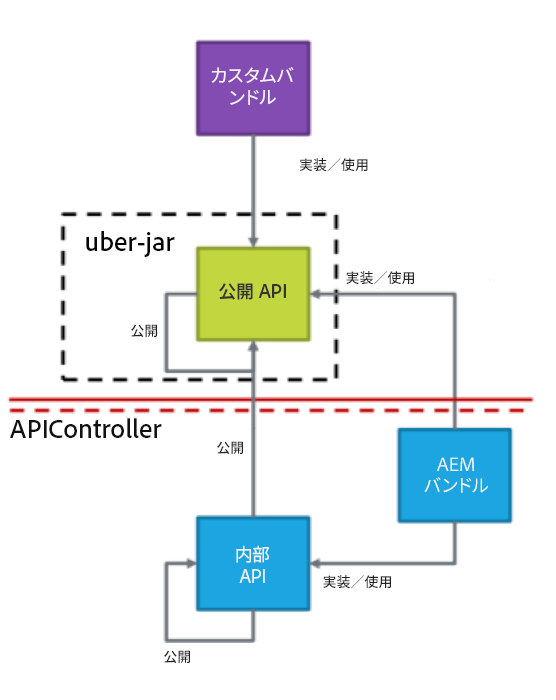
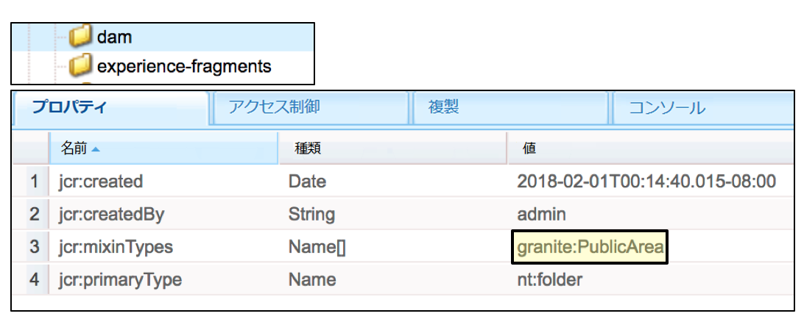
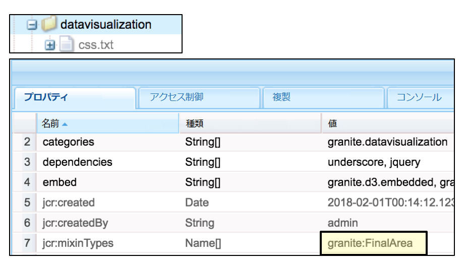
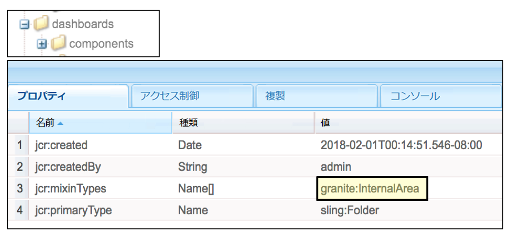
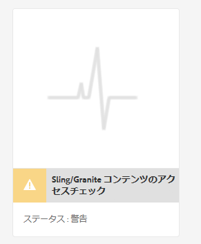
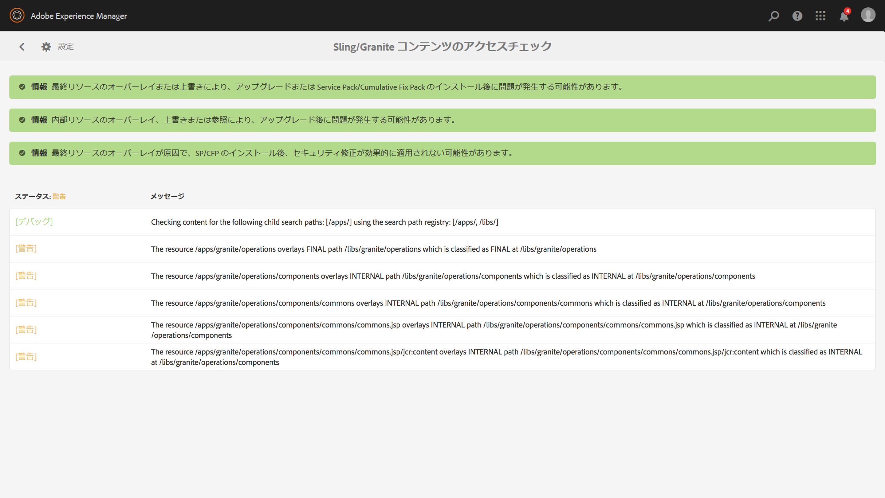
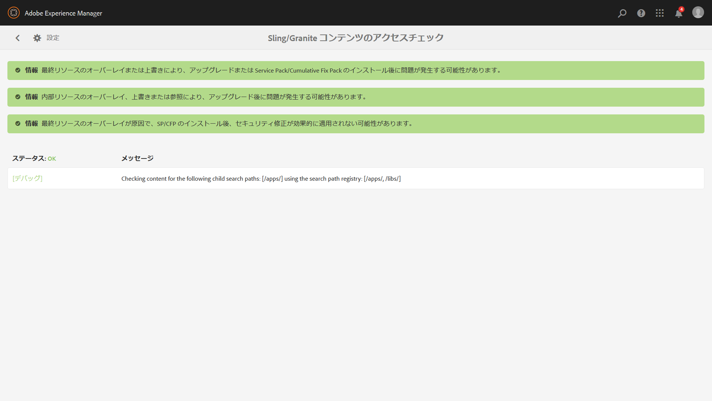

# 持続可能なアップグレード{#sustainable-upgrades}

## カスタマイズフレームワーク {#customization-framework}

### アーキテクチャ（機能／インフラストラクチャ／コンテンツ／アプリケーション）  {#architecture-functional-infrastructure-content-application}

カスタマイズフレームワーク機能は、アップグレードしづらいコード（APIS など）またはコンテンツ（オーバーレイなど）などの拡張できない領域での違反が減少するように設計されています。

カスタマイズフレームワークには、**API サーフェス**&#x200B;と&#x200B;**コンテンツ分類**&#x200B;の 2 つのコンポーネントがあります。

#### API サーフェス {#api-surface}

AEM の以前のリリースでは、多くの API が Uber Jar を介して公開されていました。これらの API の一部は、お客様による使用を意図して公開されたものではなく、複数のバンドルにまたがって AEM 機能をサポートするために公開されたものです。今後は、アップグレードの観点からどの API が安全に使用できるかをお客様に示すために、Java API は、公開または非公開としてマークされます。その以外の詳細を次に示します。

* `Public` としてマークされた Java API は、カスタム実装バンドルによって使用および参照できます。

* 公開 API は、互換性パッケージをインストールすることで後方互換性が保たれます。
* 互換性パッケージには、後方互換性を確保するために互換性 Uber JAR が含まれます。
* `Private` としてマークされた Java API は、AEM の内部バンドルによる使用のみが意図されており、カスタムバンドルでは使用できません。

>[!NOTE]
>
>ここでいう `Private` および `Public` の概念は、Java の public クラスや private クラスの概念と混同しないようにする必要があります。

#### コンテンツ分類 {#content-classifications}

AEM では、以前からオーバーレイの原理と Sling Resource Merger を使用して、ユーザーが AEM の機能の拡張およびカスタマイズをおこなうことができるようになっています。AEM コンソールと UI を強化する事前定義済みの機能は、**/libs** に格納されます。ユーザーは **/libs** の下は何も変更できませんが、**/apps** の下にコンテンツを追加して、**/libs** 内で定義されている機能をオーバーレイおよび拡張できます（詳しくは、「オーバーレイを使用した開発」を参照）。この場合も、AEM のアップグレード時に多数の問題が発生します。**/libs** 内のコンテンツが変更され、オーバーレイ機能が予期しない動作で破損することがあるからです。ユーザーは、`sling:resourceSuperType` を介した継承によって、または sling:resourceType を使用して **/libs** 内のコンポーネントを単に直接参照することによって、AEM コンポーネントを拡張することもできます。同様のアップグレードの問題は、参照およびオーバーライドの使用例で発生する可能性があります。

安全に使用およびオーバーレイできる **/libs** の領域を容易に理解してより安全になるように、**/libs** 内のコンテンツは次の mixin によって分類されています。

* **公開（granite:PublicArea）** - オーバーレイ、継承（`sling:resourceSuperType`）または直接使用（`sling:resourceType`）できるように、ノードを公開として定義します。公開としてマークされた /libs の下のノードは、互換パッケージを追加することで、アップグレードしても安全になります。通常、顧客は公開としてマークされたノードのみを利用する必要があります。

* **抽象（granite:AbstractArea）** - ノードを抽象として定義します。ノードは、オーバーレイおよび継承（`sling:resourceSupertype`）することはできますが、直接使用（`sling:resourceType`）することはできません。

* **最終（granite:FinalArea）** - ノードを最終として定義します。最終として分類されたノードは、オーバーレイまたは継承しないことが望ましいです。最終ノードは、`sling:resourceType` を介して直接使用できます。最終ノードの下のサブノードは、デフォルトで内部と見なされます。

* ***内部（granite:InternalArea）*** - ノードを内部として定義します。内部として分類されたノードは、オーバーレイ、継承、直接使用しないのが理想的です。これらのノードは、AEM の内部機能でのみ使用されます。

* **注釈なし** - ノードはツリー階層に基づいて分類を継承します。/ root はデフォルトで公開です。**親が内部または最終として分類されているノードも、内部として扱われます。**

>[!NOTE]
>
>これらのポリシーは、Sling 検索パスに基づくメカニズムに対してのみ適用されます。クライアントサイドライブラリなど **/libs** の他の領域は、`Internal` としてマークされることがありますが、標準で clientlib を含めることで使用できます。このような場合は、お客様が引き続き内部分類に従うことが重要です。

#### CRXDE Lite コンテンツタイプインジケーター {#crxde-lite-content-type-indicators}

CRXDE Lite で適用される mixin では、`INTERNAL` としてマークされたコンテンツノードとツリーがグレー表示されます。`FINAL` については、アイコンのみがグレー表示されます。これらのノードの子もグレー表示されます。どちらの場合も、オーバーレイノード機能は無効になります。

**公開**

**最終**

**内部**

**コンテンツヘルスチェック**

>[!NOTE]
>
>AEM 6.5 以降では、パターン検出を使用してコンテンツのアクセス違反を検出することをお勧めします。パターン検出レポートは、より多くの問題を検出して詳細を提示できるようになり、誤検出の確率が低減されました。
>
>詳しくは、[パターン検出を使用したアップグレードの複雑性の評価](/help/sites-deploying/pattern-detector.md)を参照してください。

AEM 6.5 にはヘルスチェックが付属しています。オーバーレイまたは参照されたコンテンツがコンテンツ分類と一致しない方法で使用された場合は、このヘルスチェックにより警告が表示されます。

Sling／Granite コンテンツアクセスチェックは、リポジトリを監視して、お客様のコードが AEM の保護されたノードに誤ってアクセスしていないかどうかを確認する新しいヘルスチェックです。

このヘルスチェックは **/apps** をスキャンし、通常は完了するまで数秒かかります。

この新しいヘルスチェックにアクセスするには、次の手順に従います。

1. AEM ホーム画面から、**ツール／運営／ヘルスレポート**&#x200B;に移動します。
1. 次に示すように、「**Sling／Granite コンテンツアクセスチェック**」をクリックします。

   

スキャンが完了すると、警告のリストが表示され、誤って参照されている保護されたノードをエンドユーザーに通知します。

違反を修正すると、緑の状態に戻ります。

ヘルスチェックには、バックグラウンドサービスによって収集された情報が表示されます。バックグラウンドサービスでは、オーバーレイまたはリソースタイプがすべての Sling 検索パスにわたって使用される場合は常に、非同期的にチェックが実行されます。コンテンツ mixin が誤って使用された場合、違反が報告されます。
