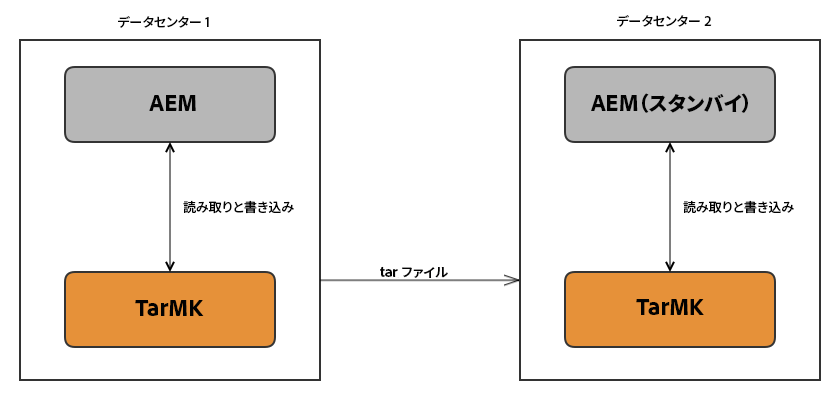

# TarMK コールドスタンバイによる AEM の実行方法{#how-to-run-aem-with-tarmk-cold-standby}

## 概要 {#introduction}

Tar Micro Kernel のコールドスタンバイ機能では、1 つ以上のスタンバイ AEM インスタンスをプライマリインスタンスに接続することができます。同期プロセスは、プライマリインスタンスからスタンバイインスタンスの方向のみ実行されるという意味で単方向です。

スタンバイインスタンスの目的は、マスターリポジトリのライブデータのコピーを保証して、マスターが何らかの理由で利用できなくなった場合にデータ損失なしにすぐに切り替えられるようにすることです。

コンテンツはプライマリインスタンスとスタンバイインスタンス間で線形的に同期されます。この際、ファイルやリポジトリの破損に関する整合性チェックは実行されません。このような設計であるので、スタンバイインスタンスはプライマリインスタンスの完全なコピーであり、プライマリインスタンスの不整合を軽減するものではありません。

>[!NOTE]
>
>コールドスタンバイ機能は、**オーサー**&#x200B;インスタンスで高可用性が求められるシナリオを保護することを目的としています。Tar Micro Kernel を使用する&#x200B;**パブリッシュ**&#x200B;インスタンスで高可用性が求められる状況では、パブリッシュファームを使用することをお勧めします。
>
>利用可能なその他のデプロイメントについて詳しくは、[推奨されるデプロイメント](/help/sites-deploying/recommended-deploys.md)のページを参照してください。

## 仕組み {#how-it-works}

プライマリ AEM インスタンスでは、TCP ポートが開かれて、受信メッセージをリスニングしています。現時点で、スレーブがマスターに送信するメッセージには次の 2 つのタイプがあります。

* 現在のヘッドのセグメント ID を要求するメッセージ
* 指定した ID のセグメントデータを要求するメッセージ

スタンバイは、プライマリの現在のヘッドのセグメント ID を定期的に要求します。そのセグメントがローカルに存在しない場合は、セグメントを取得します。既存のセグメントの場合は、セグメントを比較して、必要に応じて参照先のセグメントも要求します。

>[!NOTE]
>
>スタンバイインスタンスは、同期のみのモードで実行されているので、いかなるタイプの要求も受信しません。スタンバイインスタンスで利用できるセクションは「Web コンソール」だけです（バンドルとサービスの設定を容易にするため）。

一般的な TarMK コールドスタンバイデプロイメント：



## その他の特徴 {#other-characteristics}

### 堅牢性 {#robustness}

接続およびネットワーク関連の問題を自動的に検出して処理するようにデータフローが設計されています。すべてのパケットにチェックサムが付属し、接続の問題やパケットの損失が発生するとただちに再試行メカニズムがトリガーされます。

#### パフォーマンス {#performance}

プライマリインスタンスで TarMK コールドスタンバイを有効にしても、パフォーマンスへの影響はほぼありません。CPU 使用率はほとんど増加せず、追加のハードディスクやネットワーク I/O によるパフォーマンスの問題は発生しない見込みです。

スタンバイでは、同期プロセスの実行中に高い CPU 使用率になることが予想されます。この処理はマルチスレッドではないので、複数のコアの利用による高速化は図れません。変更されたデータや送信されるデータがない場合は、測定可能なアクティビティは発生しません。接続速度は、ハードウェアおよびネットワーク環境によって変わりますが、リポジトリのサイズや SSL の利用とは関係ありません。初期の同期に必要になる時間を推測するときや、プライマリノードでしばらく大量のデータが変更されたときには、この点に注意してください。

#### セキュリティ {#security}

すべてのインスタンスが同じイントラネットのセキュリティゾーン内で実行されると想定すると、セキュリティ侵害のリスクは大幅に軽減されます。それでも、スレーブとマスター間での SSL 通信を有効にして、一層のセキュリティレイヤーを追加できます。この構成によって、データが中間者によって侵害される可能性が低下します。

さらに、受信する要求の IP アドレスを制限することで、接続を許可するスタンバイインスタンスを指定できます。この指定によって、イントラネット内でリポジトリをコピーできないことを保証できます。

>[!NOTE]
>
>Dispatcher と、コールドスタンバイセットアップに含まれるサーバーの間に、ロードバランサーを追加することを推奨します。ロードバランサーは、ユーザートラフィックを&#x200B;**プライマリ**&#x200B;インスタンスにのみ転送するように設定する必要があります。これは、整合性を確保し、コンテンツがコールドスタンバイのメカニズム以外の手段でスタンバイインスタンス上でコピーされることを防ぐための措置です。

## AEM TarMK コールドスタンバイセットアップの作成 {#creating-an-aem-tarmk-cold-standby-setup}

>[!CAUTION]
>
>セグメントノードストアおよびスタンバイストアサービスの PID は、AEM 6.3 では以前のバージョンと比較して次のように変更されました。
>
>* org.apache.jackrabbit.oak.**plugins**.segment.standby.store.StandbyStoreServiceからorg.apache.jackrabbit.oak.segment.standby.store.StandbyStoreServiceへ
>* org.apache.jackrabbit.oak.**plugins**.segment.SegmentNodeStoreServiceからorg.apache.jackrabbit.oak.segment.SegmentNodeStoreServiceへの

>
>
この変更が反映されるように、必要に応じて設定を調整してください。

TarMK コールドスタンバイセットアップを作成するには、まずプライマリのインストールフォルダー全体のファイルシステムコピーを実行して新しい場所にコピーし、スタンバイインスタンスを作成する必要があります。その後、各インスタンスを、その役割を示す実行モード（`primary` または `standby`）で起動することができます。

以下に、1 つのマスターインスタンスと 1 つのスタンバイインスタンスによるセットアップを作成するために実行する必要のある手順を示します。

1. AEM をインストールします。

1. インスタンスをシャットダウンし、コールドスタンバイインスタンスを実行する場所にインストールフォルダーをコピーします。異なるマシンから実行する場合でも、各フォルダーにわかりやすい名前を付けて（*aem-primary* や *aem-standby* など）、各インスタンスを区別するようにしてください。
1. プライマリインスタンスのインストールフォルダーに移動し、次の手順を実行します。

   1. Check and delete any preivous OSGi configurations you might have under `aem-primary/crx-quickstart/install`

   1. Create a folder called `install.primary` under `aem-primary/crx-quickstart/install`

   1. Create the required configurations for the prefered node store and data store under `aem-primary/crx-quickstart/install/install.primary`
   1. `org.apache.jackrabbit.oak.segment.standby.store.StandbyStoreService.config` というファイルを同じ場所に作成し、適切に設定します。設定オプションについて詳しくは、[設定](/help/sites-deploying/tarmk-cold-standby.md#configuration)を参照してください。

   1. If you are using an AEM TarMK instance with an external data store, create a folder named `crx3` under `aem-primary/crx-quickstart/install` named `crx3`

   1. データストア設定ファイルを `crx3` フォルダーに配置します。

   例えば、外部ファイルデータストアを使用して AEM TarMK インスタンスを実行している場合は、次の設定ファイルが必要です。

   * `aem-primary/crx-quickstart/install/install.primary/org.apache.jackrabbit.oak.segment.SegmentNodeStoreService.config`
   * `aem-primary/crx-quickstart/install/install.primary/org.apache.jackrabbit.oak.segment.standby.store.StandbyStoreService.config`
   * `aem-primary/crx-quickstart/install/crx3/org.apache.jackrabbit.oak.plugins.blob.datastore.FileDataStore.config`

   以下に、プライマリインスタンスのサンプル設定を示します。

   **org.apache.jackrabbit.oak.segment.SegmentNodeStoreService.config** **のサンプル**

   ```xml
   org.apache.sling.installer.configuration.persist=B"false"
   customBlobStore=B"true"
   standby=B"false"
   ```

   **org.apache.jackrabbit.oak.segment.standby.store.StandbyStoreService.config のサンプル**

   ```xml
   org.apache.sling.installer.configuration.persist=B"false"
   mode="primary"
   port=I"8023"
   ```

   **org.apache.jackrabbit.oak.plugins.blob.datastore.FileDataStore.config のサンプル**

   ```xml
   org.apache.sling.installer.configuration.persist=B"false"
   path="./crx-quickstart/repository/datastore"
   minRecordLength=I"16384"
   ```

1. プライマリ実行モードを指定して、プライマリを起動します。

   ```shell
   java -jar quickstart.jar -r primary,crx3,crx3tar
   ```

1. **org.apache.jackrabbit.oak.segment** パッケージに対して、新しい Apache Sling Logging Logger を作成します。ログレベルを「デバッグ」に設定し、ログの出力先を個別のログファイル（ */logs/tarmk-coldstandby.log* など）に指定します。詳しくは、[ログ](/help/sites-deploying/configure-logging.md)を参照してください。
1. **スタンバイ**&#x200B;インスタンスの場所に移動し、jar を実行して起動します。
1. プライマリと同じログ設定を作成します。その後、インスタンスを停止します。
1. 次に、スタンバイインスタンスの準備をおこないます。そのためには、プライマリインスタンスの場合と同様の手順を実行します。

   1. Delete any files you might have under `aem-standby/crx-quickstart/install`.
   1. Create a new folder called `install.standby` under `aem-standby/crx-quickstart/install`

   1. 次の 2 つの設定ファイルを作成します。

      * `org.apache.jackrabbit.oak.segment.SegmentNodeStoreService.config`
      * `org.apache.jackrabbit.oak.segment.standby.store.StandbyStoreService.config`
   1. Create a new folder called `crx3` under `aem-standby/crx-quickstart/install`

   1. Create the data store configuration and place it under `aem-standby/crx-quickstart/install/crx3`. この例では、作成する必要があるファイルは次のとおりです。

      * org.apache.jackrabbit.oak.plugins.blob.datastore.FileDataStore.config
   1. ファイルを編集し、必要な設定を作成します。

   以下に、典型的なスタンバイインスタンスのサンプル設定ファイルを示します。

   **org.apache.jackrabbit.oak.segment.SegmentNodeStoreService.config のサンプル**

   ```xml
   org.apache.sling.installer.configuration.persist=B"false"
   name="Oak-Tar"
   service.ranking=I"100"
   standby=B"true"
   customBlobStore=B"true"
   ```

   **org.apache.jackrabbit.oak.segment.standby.store.StandbyStoreService.config のサンプル**

   ```xml
   org.apache.sling.installer.configuration.persist=B"false"
   mode="standby"
   primary.host="127.0.0.1"
   port=I"8023"
   secure=B"false"
   interval=I"5"
   standby.autoclean=B"true"
   ```

   **org.apache.jackrabbit.oak.plugins.blob.datastore.FileDataStore.config のサンプル**

   ```xml
   org.apache.sling.installer.configuration.persist=B"false"
   path="./crx-quickstart/repository/datastore"
   minRecordLength=I"16384"
   ```

1. スタンバイ実行モードを使用して&#x200B;**スタンバイ**&#x200B;インスタンスを起動します。

   ```xml
   java -jar quickstart.jar -r standby,crx3,crx3tar
   ```

このサービスは、次の手順により Web コンソール経由で設定することもできます。

1. Going to the Web Console at: *https://serveraddress:serverport/system/console/configMgr*
1. Looking for a service called **Apache Jackrabbit Oak Segment Tar Cold Standby Service** and double click it to edit the settings.
1. 設定を保存してインスタンスを再起動し、新しい設定を有効にします。

>[!NOTE]
>
>インスタンスの役割は、Sling Settings Web コンソールで **primary** または **standby** 実行モードの存在をチェックすることで、いつでも確認できます。

>This can be done by going to *https://localhost:4502/system/console/status-slingsettings* and checking the **&quot;Run Modes&quot;** line.
>

## 初回の同期 {#first-time-synchronization}

準備が完了した後のスタンバイの初回起動時には、スタンバイがプライマリにキャッチアップすることから、インスタンス間のネットワークトラフィックが大量に発生します。ログを見ながら、同期のステータスを観察することができます。

スタンバイの *tarmk-coldstandby.log* では、次のようなエントリを確認できます。

```xml
    *DEBUG* [defaultEventExecutorGroup-2-1] org.apache.jackrabbit.oak.segment.standby.store.StandbyStore trying to read segment ec1f739c-0e3c-41b8-be2e-5417efc05266

    *DEBUG* [nioEventLoopGroup-3-1] org.apache.jackrabbit.oak.segment.standby.codec.SegmentDecoder received type 1 with id ec1f739c-0e3c-41b8-be2e-5417efc05266 and size 262144

    *DEBUG* [defaultEventExecutorGroup-2-1] org.apache.jackrabbit.oak.segment.standby.store.StandbyStore got segment ec1f739c-0e3c-41b8-be2e-5417efc05266 with size 262144

    *DEBUG* [defaultEventExecutorGroup-2-1] org.apache.jackrabbit.oak.segment.file.TarWriter Writing segment ec1f739c-0e3c-41b8-be2e-5417efc05266 to /mnt/crx/author/crx-quickstart/repository/segmentstore/data00016a.tar
```

スタンバイの *error.log* では、次のようなエントリを確認できます。

```xml
*INFO* [FelixStartLevel] org.apache.jackrabbit.oak.segment.standby.store.StandbyStoreService started standby sync with 10.20.30.40:8023 at 5 sec.
```

このログの *10.20.30.40* は、プライマリの IP アドレスです。

**プライマリ** の *tarmk-coldstandby.log* では、次のようなエントリを確認できます。

```xml
    *DEBUG* [nioEventLoopGroup-3-2] org.apache.jackrabbit.oak.segment.standby.store.CommunicationObserver got message ‘s.d45f53e4-0c33-4d4d-b3d0-7c552c8e3bbd’ from client c7a7ce9b-1e16-488a-976e-627100ddd8cd

    *DEBUG* [nioEventLoopGroup-3-2] org.apache.jackrabbit.oak.segment.standby.server.StandbyServerHandler request segment id d45f53e4-0c33-4d4d-b3d0-7c552c8e3bbd

    *DEBUG* [nioEventLoopGroup-3-2] org.apache.jackrabbit.oak.segment.standby.server.StandbyServerHandler sending segment d45f53e4-0c33-4d4d-b3d0-7c552c8e3bbd to /10.20.30.40:34998

    *DEBUG* [nioEventLoopGroup-3-2] org.apache.jackrabbit.oak.segment.standby.store.CommunicationObserver did send segment with 262144 bytes to client c7a7ce9b-1e16-488a-976e-627100ddd8cd
```

この場合、ログに示されている「client」は&#x200B;**スタンバイ**&#x200B;インスタンスのことです。

これらのエントリがログに記録されなくなったら、同期プロセスが完了したと見なして問題ありません。

前述のエントリはポーリングメカニズムが正常に機能していることを示しますが、多くの場合、ポーリングが発生している間にデータが同期されているかどうかを把握するために役立ちます。これを行うには、次のようなエントリを探します。

```xml
*DEBUG* [defaultEventExecutorGroup-156-1] org.apache.jackrabbit.oak.segment.file.TarWriter Writing segment 3a03fafc-d1f9-4a8f-a67a-d0849d5a36d5 to /<<CQROOTDIRECTORY>>/crx-quickstart/repository/segmentstore/data00014a.tar
```

また、非共有 `FileDataStore` での実行時には、バイナリファイルが正しく送信されていることを示す次のようなメッセージが表示されます。

```xml
*DEBUG* [nioEventLoopGroup-228-1] org.apache.jackrabbit.oak.segment.standby.codec.ReplyDecoder received blob with id eb26faeaca7f6f5b636f0ececc592f1fd97ea1a9#169102 and size 169102
```

### 設定 {#configuration}

Cold Standby サービスでは次の OSGi 設定を利用できます。

* **Persist Configuration：**&#x200B;有効にした場合、従来の OSGi 設定ファイルではなくリポジトリに設定が保存されます。本番システムでは、プライマリ設定がスタンバイによって取得されないように、この設定を無効にすることを推奨します。

* **モード(`mode`):** これにより、インスタンスのrunmodeが選択されます。

* **Port (port)：**&#x200B;通信に使用するポート。デフォルトは、`8023` です。

* **プライマリホスト(`primary.host`):** — プライマリ・インスタンスのホスト。 この設定は、スタンバイにのみ適用されます。
* **同期間隔(`interval`):** — この設定は、同期要求間隔を決定します。この間隔は、スタンバイインスタンスにのみ適用されます。

* **許可されているIP範囲(`primary.allowed-client-ip-ranges`):** — プライマリが接続を許可するIP範囲。
* **セキュア(`secure`):** SSL暗号化を有効にします。 この設定を利用するには、すべてのインスタンスで有効にする必要があります。
* **スタンバイ読み取りタイムアウト(`standby.readtimeout`):** スタンバイインスタンスから発行された要求のタイムアウト（ミリ秒）。 推奨されるタイムアウト設定は 43200000 です。通常、タイムアウトは 12 時間以上の値に設定することをお勧めします。

* **スタンバイ自動クリーンアップ(`standby.autoclean`):** 同期サイクルでストアのサイズが増加した場合は、cleanupメソッドを呼び出します。

>[!NOTE]
Offloading などのサービスがプライマリとスタンバイを個別に識別できるように、これらに異なるリポジトリ ID を付与することを強く推奨します。
この設定を確実におこなうには、スタンバイで *sling.id* ファイルを削除してインスタンスを再起動するのが最も良い方法です。

## フェイルオーバー手順 {#failover-procedures}

何らかの理由でプライマリインスタンスに障害が発生した場合、以下の方法で起動時の実行モードを変更して、プライマリの役割を引き継ぐようにスタンバイインスタンスのいずれかを設定することができます。

>[!NOTE]
設定ファイルについても、プライマリインスタンスに使用される設定と一致するように変更する必要があります。

1. スタンバイインスタンスがインストールされている場所に移動して、そのインスタンスを停止します。

1. このセットアップでロードバランサーを設定している場合は、この時点でロードバランサーの設定からプライマリを削除できます。
1. スタンバイのインストールフォルダーから `crx-quickstart` フォルダーをバックアップします。このフォルダーは、新しいスタンバイのセットアップ時に開始点として使用できます。

1. `primary` 実行モードを使用してインスタンスを再起動します。

   ```shell
   java -jar quickstart.jar -r primary,crx3,crx3tar
   ```

1. ロードバランサーに新しいプライマリを追加します。
1. 新しいスタンバイインスタンスを作成して起動します。詳しくは、前述の [AEM TarMK コールドスタンバイセットアップの作成](/help/sites-deploying/tarmk-cold-standby.md#creating-an-aem-tarmk-cold-standby-setup)を参照してください。

## コールドスタンバイセットアップへのホットフィックスの適用 {#applying-hotfixes-to-a-cold-standby-setup}

コールドスタンバイセットアップにホットフィックスを適用する推奨方法は、ホットフィックスをプライマリインスタンスにインストールし、ホットフィックスがインストールされた新しいコールドスタンバイインスタンスにクローニングすることです。

これをおこなうには、次に示す手順に従います。

1. JMXコンソールに移動し、**org.apache.jackrabbit.oakを使用して、コールドスタンバイインスタンスで同期プロセスを停止します。ステータス（「スタンバイ」）**bean For more information on how to do this, see the section on [Monitoring](#monitoring).
1. コールドスタンバイインスタンスを停止します。
1. プライマリインスタンスにホットフィックスをインストールします。For more details on how to install a hotfix, see [How to Work With Packages](/help/sites-administering/package-manager.md).
1. インストール後の問題についてインスタンスをテストします。
1. コールドスタンバイインスタンスのインストールフォルダーを削除して、コールドスタンバイインスタンスを削除します。
1. プライマリインスタンスを停止し、インストールフォルダー全体をコールドスタンバイの場所にファイルシステムコピーして、クローンを作成します。
1. 新しく作成したクローンをコールドスタンバイインスタンスとして機能するように再設定します。詳しくは、[AEM TarMK コールドスタンバイセットアップの作成](/help/sites-deploying/tarmk-cold-standby.md#creating-an-aem-tarmk-cold-standby-setup)を参照してください。
1. プライマリインスタンスとコールドスタンバイインスタンスの両方を起動します。

## 監視 {#monitoring}

この機能は、JMXまたはMBeanを使用して情報を公開します。その場合は、 [JMXコンソールを使用して、スタンバイとマスターの現在の状態を調べます](/help/sites-administering/jmx-console.md)。 この情報は、 `type org.apache.jackrabbit.oak:type="Standby"`名前の付いたMBeanで確認でき `Status`ます。

**スタンバイ**

スタンバイインスタンスを観察する際には、1 つのノードを公開します。その ID は通常、汎用 UUID です。

このノードには次の 5 つの読み取り専用属性があります。

* `Running:` 同期プロセスが実行中かどうかを示すboolean値。

* `Mode:` クライアント：インスタンスの識別に使用されるUUIDが続きます。 この UUID は、設定が更新されるたびに変更されます。

* `Status:` 現在の状態をテキストで表したもの( `running` やなど `stopped`)。

* `FailedRequests:`連続したエラーの数。
* `SecondsSinceLastSuccess:` サーバーとの最後の通信が成功してからの秒数。 It will display `-1` if no successful communication has been made.

次のような 3 つの呼び出し可能なメソッドもあります。

* `start():` 同期プロセスの開始。
* `stop():` 同期処理を停止します。
* `cleanup():` スタンバイでクリーンアップ操作を実行します。

**プライマリ**

プライマリを観察することで、MBean 経由で一般的な情報を取得できます。この MBean の ID 値は、TarMK スタンバイサービスが使用しているポート番号（デフォルトは 8023）です。メソッドと属性の大部分はスタンバイと同じですが、次の点で一部異なります。

* `Mode:` は常に値を表示し `primary`ます。

さらに、マスターに接続する最大 10 のクライアント（スタンバイインスタンス）の情報を取得できます。MBean ID はインスタンスの UUID です。これらの MBean には呼び出し可能なメソッドはありませんが、次のように非常に便利な読み取り専用属性が存在します。

* `Name:` クライアントのID。
* `LastSeenTimestamp:` テキスト表現での最後の要求のタイムスタンプ。
* `LastRequest:` クライアントの最後のリクエスト。
* `RemoteAddress:` クライアントのIPアドレス。
* `RemotePort:` クライアントが最後の要求に使用したポート。
* `TransferredSegments:` このクライアントに転送されたセグメントの合計数。
* `TransferredSegmentBytes:`このクライアントに転送された合計バイト数。

## コールドスタンバイリポジトリのメンテナンス {#cold-standby-repository-maintenance}

### リビジョンクリーンアップ {#revision-clean}

>[!NOTE]
プライマリインスタンスで[オンラインリビジョンクリーンアップ](/help/sites-deploying/revision-cleanup.md)を実行した場合は、以下に示す手動での手順は必要ありません。Additionally, if you are using Online Revision Cleanup, the `cleanup ()` operation on the standby instance will pe performed automatically.

>[!NOTE]
スタンバイでオフラインリビジョンクリーンアップを実行しないでください。オフラインコンパクションは不要であり、segmentstore のサイズは縮小されません。

Adobeでは、時間の経過とともに過剰なリポジトリの増大を防ぐため、定期的にメンテナンスを実行することを推奨しています。 コールドスタンバイリポジトリのメンテナンスを手動で実行するには、次の手順に従います。

1. JMX コンソールに移動し、**org.apache.jackrabbit.oak: Status（&quot;Standby&quot;）** bean を使用して、スタンバイインスタンスでスタンバイプロセスを停止します。この方法について詳しくは、[監視](/help/sites-deploying/tarmk-cold-standby.md#monitoring)に関する前述の節を参照してください。

1. プライマリ AEM インスタンスを停止します。
1. プライマリインスタンスで oak コンパクションツールを実行します。For more details, see [Maintaining the Repository](/help/sites-deploying/storage-elements-in-aem-6.md#maintaining-the-repository).
1. プライマリインスタンスを起動します。
1. 最初の手順で説明したものと同じ JMX bean を使用して、スタンバイインスタンスでスタンバイプロセスを開始します。
1. ログを監視し、同期が完了するまで待ちます。この時点で、スタンバイリポジトリの大幅な増加が見られる可能性があります。
1. Run the `cleanup()` operation on the standby instance, using the same JMX bean as described in the first step.

オフラインコンパクションではリポジトリ履歴が実質的には書き直されるので、リポジトリでの変更の計算により多くの時間がかかり、スタンバイインスタンスとプライマリとの同期が完了するまで通常より時間がかかる場合があります。また、このプロセスが完了した後は、スタンバイ側のリポジトリのサイズは、プライマリ側のリポジトリとほぼ同じサイズになることに注意してください。

別の方法として、プライマリでコンパクションを実行した後にプライマリリポジトリをスタンバイに手動でコピーすることもできます。つまり、コンパクションを実行するたびにスタンバイを再構築します。

### データストアのガベージコレクション {#data-store-garbage-collection}

ファイルデータストアインスタンスに対してガベージコレクションをときどき実行することが重要です。そうしないと、削除されたバイナリがファイルシステムに残り、最終的にドライブがいっぱいになります。ガベージコレクションを実行するには、次の手順に従います。

1. Run cold standby repository maintenance as described in the section [above](/help/sites-deploying/tarmk-cold-standby.md#cold-standby-repository-maintenance).
1. メンテナンスプロセスが完了し、インスタンスが再起動したら、次の手順を実行します。

   * On the primary, run the data store garbage collection via the relevant JMX bean as described in [this article](/help/sites-administering/data-store-garbage-collection.md#running-data-store-garbage-collection-via-the-jmx-console).
   * On the standby, the data store garbage collection is available only via the **BlobGarbageCollection** MBean - `startBlobGC()`. **RepositoryManagement **MBeanはスタンバイでは使用できません。

   >[!NOTE]
   共有データストアを使用していない場合は、ガベージコレクションを最初にプライマリで実行してから、スタンバイで実行する必要があります。

