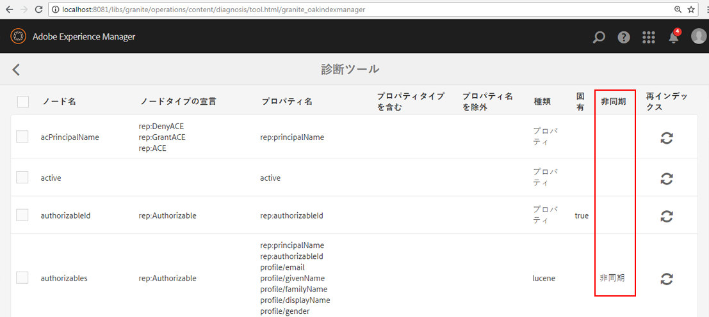

# Oak インデックスのトラブルシューティング{#troubleshooting-oak-indexes}

## インデックス再作成に時間がかかる  {#slow-re-indexing}

AEM の内部インデックス作成プロセスでは、コンテンツを効率的に検索できるように、リポジトリデータが収集され Oak インデックスに保存されます。例外的な状況で、このプロセスが遅くなったり、停止したりすることがあります。このページは、インデックス作成に時間がかかっているかどうかを識別し、原因を特定し、問題を解決するためのトラブルシューティングガイドの役割を果たします。

必要以上に長時間がかかっているインデックス再作成と、コンテンツの量が膨大であるために処理に時間がかかっているインデックス再作成を区別することが重要です。例えば、コンテンツのインデックス作成にかかる時間はコンテンツの量に比例するので、大規模な実稼動リポジトリのインデックスを再作成するには小規模な開発リポジトリよりも時間がかかります。

コンテンツのインデックス再作成のタイミングおよび方法について詳しくは、[クエリとインデックスに関するベストプラクティス](/help/sites-deploying/best-practices-for-queries-and-indexing.md)を参照してください。

## 最初の検出 {#initial-detection}

時間がかかっているインデックス作成を最初に検出するには、`IndexStats` JMX MBean を確認する必要があります。影響を受ける AEM インスタンスで、次の手順を実行します。

1. Open the Web Console and click the JMX tab or go to https://&lt;host>:&lt;port>/system/console/jmx (for example, [http://localhost:4502/system/console/jmx](http://localhost:4502/system/console/jmx)).
1. Navigate to the `IndexStats` Mbeans.
1. 「」と「」の `IndexStats` MBeanを開き `async`ま `fulltext-async`す。

1. For both MBeans, check if the **Done** timestamp and **LastIndexTime** timestamp are less than 45 mins from the current time.

1. いずれかの MBean で、時間値（**Done** または **LastIndexedTime**）が現在の時刻から 45 分以上前である場合は、インデックスジョブが失敗しているか、時間がかかりすぎています。これにより、非同期インデックスが古くなります。

## 強制終了後にインデックス作成が一時停止する {#indexing-is-paused-after-a-forced-shutdown}

強制終了によって、再起動後に AEM で非同期インデックス作成が最大 30 分停止し、通常は最初のインデックス再作成が完了するまでさらに 15 分かかり、合計で約 45 分が必要となります（[最初の検出](/help/sites-deploying/troubleshooting-oak-indexes.md#initial-detection) の 45 分の時間枠を思い出してください）。強制終了後にインデックス作成が一時停止していることが疑われる場合は、次のことをおこなってください。

1. 最初に、AEM インスタンスが強制的に終了した（AEM プロセスが強制的に kill された、または電源障害が発生した）後に再起動したかどうかを確認します。

   * [AEMのログは](/help/sites-deploying/configure-logging.md) 、この目的で確認できます。

1. 強制終了が発生した場合、再起動後 AEM ではインデックス再作成が自動的に最大 30 分停止します。
1. AEM で通常の非同期インデックス作成操作が再開されるまで約 45 分待ってください。

## スレッドプールが過負荷になる {#thread-pool-overloaded}

>[!NOTE]
>
>For AEM 6.1, ensure that [AEM 6.1 CFP 11](https://helpx.adobe.com/experience-manager/release-notes-aem-6-1-cumulative-fix-pack.html) is installed.

例外的な状況で、非同期インデックス作成の管理に使用されるスレッドプールが過負荷になることがあります。インデックス作成プロセスを分離するために、適当な時間でコンテンツにインデックス作成する Oak の機能に他の AEM の処理が干渉しないように、スレッドプールを設定できます。そのためには、次の手順を実行します。

1. Apache Sling Scheduler が非同期インデックス作成に使用する、分離された新しいスレッドプールを定義します。

   * On the affected AEM instance, navigate to AEM OSGi Web Console>OSGi>Configuration>Apache Sling Scheduler or go to https://&lt;host>:&lt;port>/system/console/configMgr (for example, [http://localhost:4502/system/console/configMgr](http://localhost:4502/system/console/configMgr))
   * 「Allowed Thread Pools」フィールドに「oak」という値でエントリを追加します。
   * 右下の「Save」をクリックして変更内容を保存します。

   

1. Apache Sling Scheduler の新しいスレッドプールが登録され、Apache Sling Scheduler のステータス Web コンソールに表示されることを確認します。

   * Navigate to the AEM OSGi Web console>Status>Sling Scheduler or go to https://&lt;host>:&lt;port>/system/console/status-slingscheduler (for example, [http://localhost:4502/system/console/status-slingscheduler](http://localhost:4502/system/console/status-slingscheduler))
   * 次のプールエントリが存在することを確認します。

      * ApacheSlingoak
      * ApacheSlingdefault

   

## 監視キューがいっぱいである {#observation-queue-is-full}

リポジトリに非常に多くの変更とコミットが短時間におこなわれた場合、監視キューがいっぱいになることによってインデックス作成が遅延することがあります。まず、監視キューがいっぱいかどうかを確認します。

1. Go to the Web Console and click the JMX tab or go to https://&lt;host>:&lt;port>/system/console/jmx (for example, [http://localhost:4502/system/console/jmx](http://localhost:4502/system/console/jmx))
1. Oak リポジトリ統計 MBean を開き、いずれかの `ObservationQueueMaxLength` 値が 10,000 より大きいかどうかを確認します。

   * 通常の操作では、この最大値は（特に `per second` セクションでは）最終的に 0 になる必要があるので、`ObservationQueueMaxLength` の秒の指標が 0 であることを確認します。
   * 値が 10,000 以上で、徐々に増加する場合は、少なくとも 1 つ（あるいはそれ以上）のキューを新しい変更（コミット）が発生するのと同じ速さで処理できないことを示しています。
   * 各監視キューには制限（デフォルトは 10,000）があり、キューがこの制限に達すると処理能力が低下します。
   * MongoMK を使用している場合は、キューの長さが長くなるにつれて内部 Oak キャッシュのパフォーマンスが低下します。This correlation can be seen in an increased `missRate` for the `DocChildren` cache in the `Consolidated Cache` statistics MBean.

1. 許容可能な監視キュー制限を超えないようにするには、次のことをお勧めします。

   * 通常時のコミット数を低く抑える。コミットの短時間の急増は許容できますが、通常時のコミット数は低く抑える必要があります。
   * Increase the size of the `DiffCache` as described in [Performance tuning tips > Mongo Storage Tuning > Document cache size](https://helpx.adobe.com/experience-manager/kb/performance-tuning-tips.html#main-pars_text_3).

## 動きがないインデックス再作成プロセスの識別および修正 {#identifying-and-remediating-a-stuck-re-indexing-process}

次の 2 つの状況下において、インデックス再作成は、「完全に動きがない」と見なすことができます。

* インデックス再作成の速度が遅く、走査されたノード数に関する大きな進捗がログファイルで報告されない。

   * 例えば、1 時間以上メッセージが出力されない場合、または進捗が非常に遅く、終了まで 1 週間以上かかる場合。

* インデックス作成スレッドでログファイルに例外（`OutOfMemoryException` など）が繰り返し出力されている場合、インデックス再作成は無限ループで動かなくなっている。ログに同じ例外が繰り返し表示される場合は、Oak が同じコンテンツのインデックスを繰り返し作成しようとして、同じ問題で失敗していることを示しています。

動きがないインデックス再作成プロセスを識別および修正するには、次の手順を実行します。

1. インデックス作成が動かない原因を識別するためには、次の情報を収集する必要があります。

   * 2 秒ごとにスレッドダンプを取得し、5 分間収集します。
   * [アペンダーの DEBUG レベルおよびログを設定します](/help/sites-deploying/configure-logging.md)。

      * *org.apache.jackrabbit.oak.plugins.index.AsyncIndexUpdate*
      * *org.apache.jackrabbit.oak.plugins.index.IndexUpdate*
   * Collect data from the async `IndexStats` MBean:

      * AEM OSGi Web Console>Main>JMX>IndexStat>asyncに移動します。

         or go to [http://localhost:4502/system/console/jmx/org.apache.jackrabbit.oak%3Aname%3Dasync%2Ctype%3DIndexStats](http://localhost:4502/system/console/jmx/org.apache.jackrabbit.oak%3Aname%3Dasync%2Ctype%3DIndexStats)
   * Use [oak-run.jar&#39;s console mode](https://github.com/apache/jackrabbit-oak/tree/trunk/oak-run) to collect the details of what exists under the * `/:async`* node.
   * Collect a list of repository checkpoints by using the `CheckpointManager` MBean:

      * AEM OSGi Web Console>Main>JMX>CheckpointManager>listCheckpoints()

         or go to [http://localhost:4502/system/console/jmx/org.apache.jackrabbit.oak%3Aname%3DSegment+node+store+checkpoint+management%2Ctype%3DCheckpointManager](http://localhost:4502/system/console/jmx/org.apache.jackrabbit.oak%3Aname%3DSegment+node+store+checkpoint+management%2Ctype%3DCheckpointManager)

1. 手順1で説明したすべての情報を収集した後、AEMを再起動します。

   * 同時負荷が大きい場合は（監視キューのオーバーフローや類似の現象）、AEM を再起動すると問題が解決することがあります。
   * If a restart does not solve the problem, open an issue with [Adobe Customer Care](https://helpx.adobe.com/jp/marketing-cloud/contact-support.html) and provide all the information collected in Step 1.

## 非同期のインデックス再作成を安全に中止する {#safely-aborting-asynchronous-re-indexing}

Re-indexing can be safely aborted (stopped before it is completed) via the `async, async-reindex`and f `ulltext-async` indexing lanes ( `IndexStats` Mbean). For more information, also see the Apache Oak documentation on [How to Abort Reindexing](https://jackrabbit.apache.org/oak/docs/query/indexing.html#abort-reindex). また、次の点も考慮してください。

* Lucene および Lucene プロパティインデックスのインデックス再作成は、これらが本来非同期であることから中止できます。
* The re-indexing of Oak Property Indexes can only be aborted if re-indexing was intiated via the `PropertyIndexAsyncReindexMBean`.

インデックス再作成を安全に中止するには、次の手順に従います。

1. 停止する必要があるインデックス再作成レーンを制御する IndexStats MBean を識別します。

   * Navigate to the appropriate IndexStats MBean via the JMX console by going to either AEM OSGi Web Console>Main>JMX or https://&lt;host>:&lt;port>/system/console/jmx (for example, [http://localhost:4502/system/console/jmx](http://localhost:4502/system/console/jmx))
   * Open the IndexStats MBean based on the re-indexing lane that you wish to stop ( `async`, `async-reindex`, or `fulltext-async`)

      * 適切なレーンを識別し、IndexStats MBeanインスタンスを識別するには、Oak Indexesの「async」プロパティを確認します。 The &quot;async&quot; property will contain the lane name: `async`, `async-reindex`, or `fulltext-async`.
      * レーンは、AEM のインデックスマネージャにアクセスして、「非同期」列で識別することもできます。インデックスマネージャにアクセスするには、運営／診断／インデックスマネージャに移動します。

   

1. Invoke the `abortAndPause()` command on the appropriate `IndexStats` MBean.
1. インデックス付けレーンの再開時に再インデックスを再開しないように、Oakインデックス定義を適切にマークします。

   * **既存のインデックスを再インデックスする場合** 、reindexプロパティをfalseに設定します

      * `/oak:index/someExistingIndex@reindex=false`
   * あるいは、**新規**&#x200B;インデックスの場合は次のようにします。

      * type プロパティを無効に設定します。

         * `/oak:index/someNewIndex@type=disabled`
      * または、インデックス定義を完全に削除します。

   完了したら、変更をリポジトリにコミットします。

1. 最後に、中止したインデックス作成レーンで非同期インデックス作成を再開します。

   * In the `IndexStats` MBean that issued the `abortAndPause()` command in Step 2, invoke the `resume()`command.

## 時間のかかるインデックス再作成の回避 {#preventing-slow-re-indexing}

静かな時間帯（大きなコンテンツの取り込み時など）に再インデックスを行うのが最適で、AEMの読み込みと制御が行われるメンテナンス時間帯に最適です。 また、インデックス再作成が他のメンテナンスアクティビティ中に実行されないようにしてください。
