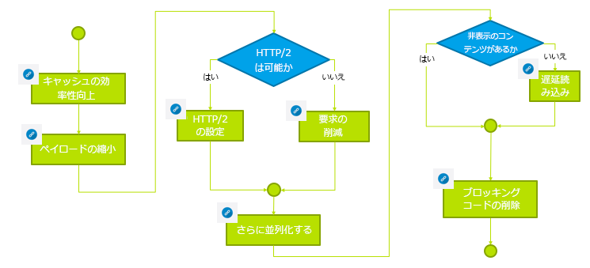

# トラブルシューティング{#troubleshooting}

ここでは、トラブルシューティングに役立つ利用可能なログに関する詳細情報と、AEM で発生する可能性のある問題について説明します。

## オーサーインスタンスのパフォーマンスのトラブルシューティング {#troubleshoot-author-performance}

パフォーマンスが低いオーサーインスタンスの分析は、非常に複雑になる場合があります。最初の手順として、どのテクノロジースタックのレベルでパフォーマンスが低下しているか把握することが必要です。

以下のフローチャートはボトルネックを絞り込む手引きになります。

## 基本的な最適化 {#basic-optimization}

## ログファイルと監査ログの設定 {#configuring-log-files-and-audit-logs}

AEM では詳細ログが記録されます。これらのログは、インストールに関する問題のトラブルシューティングをおこなうために設定できます。詳しくは、[監査記録とログファイルの使用](/help/sites-deploying/monitoring-and-maintaining.md#working-with-audit-records-and-log-files)を参照してください。

## Verbose オプションの使用 {#using-the-verbose-option}

AEM WCMを開始する場合、次のようにコマンドラインに —v（冗長）オプションを追加できます。java -jar cq-wcm-quickstart-&lt;version>.jar -v。

verbose オプションによってコンソールに Quickstart ログの出力が表示されるので、その情報をトラブルシューティングに使用できます。

## 一般的なインストールの問題 {#common-installation-issues}

ここでは、インストールの問題とその解決策について説明します。

### Quickstart jar をダブルクリックしても何も起きないか、jar ファイルが別のプログラム（アーカイブマネージャーなど）で開かれる {#double-clicking-the-quickstart-jar-does-not-have-any-effect-or-opens-the-jar-file-with-another-program-for-example-archive-manager}

通常、これは、拡張子.jarを持つファイルを開くようにオペレーティングシステムのデスクトップ環境が設定されている方法に問題があることを示しています。また、Javaがインストールされていないか、サポートされていないバージョンのJavaを使用している可能性もあります。

jar ファイルは汎用の ZIP 形式を使用しているので、一部のアーカイブプログラムによって、jar ファイルをアーカイブファイルとして開くように自動的にデスクトップが設定されることがあります。

トラブルシューティングには、次の操作をおこないます。

* Java バージョン 1.6 以降をインストールしていることを再確認します。
* AEM WCM Quickstart でコンテキストメニューを使用し（通常はマウスの右クリック）、「プログラムから開く」を選択します。
* Java または Sun Java が表示されるかを確認し、そのプログラムでの AEM WCM の実行を試みます。複数の Java バージョンがインストールされている場合は、サポートされているバージョンを選択します。

   この時点で成功した場合、常に選択したプログラムを使用して .jar ファイルを実行するためのオプションが表示されるので、そのオプションを選択します。これで、ダブルクリックによって起動できるようになります。

* サポートされている Java バージョンを再インストールすることで、適切な関連付けが復元される場合があります。
* 前述のとおり、常にコマンドラインまたは起動／停止スクリプトを使用して CRX を実行することもできます。

### CRX で動作しているアプリケーションでメモリ不足のエラーが発生する {#my-application-running-on-crx-throws-out-of-memory-errors}

>[!NOTE]
>
>[メモリの問題の分析](https://helpx.adobe.com/experience-manager/kb/AnalyzeMemoryProblems.html)も参照してください。

CRX 自体は、非常に少ないメモリフットプリントで動作します。CRX 内部で実行しているアプリケーションで多くのメモリが必要とされる場合や、大量のメモリを使用する操作（長いトランザクションなど）が要求される場合、CRX が稼動する JVM インスタンスの起動時に適切なメモリ設定をおこなう必要があります。

Javaコマンドオプションを使用して、JVMのメモリ設定を定義します（例えば、heapsizeを512MBに設定するには、java -Xmx512m -jar crx&amp;ast;.jar）。

コマンドラインからの AEM WCM の起動時に、メモリ設定オプションを指定します。AEM WCM 起動／停止スクリプトまたは AEM WCM スタートアップの管理用カスタムスクリプトを修正して、必要なメモリ設定を定義することもできます。

既にヒープサイズを 512 MB として定義している場合、次の方法でヒープダンプを作成してメモリの問題を詳細に分析することができます。

メモリ不足の際にヒープダンプを自動的に作成するには、次のコマンドを使用します。

java -Xmx256m -XX:+HeapDumpOnOutOfMemoryError -jar &amp;ast;.jar

このコマンドによって、プロセスがメモリ不足になったときに常にヒープダンプファイル（**java_...hprof**）が生成されます。ヒープダンプの生成後にもプロセスが実行し続ける場合もあります。通常、問題の分析には 1 つのヒープダンプファイルで十分です。

### AEM Quickstart をダブルクリックした後に、ブラウザーで AEM ようこそ画面が表示されない {#the-aem-welcome-screen-does-not-display-in-the-browser-after-double-clicking-aem-quickstart}

特定の状況で、リポジトリ自体が正常に動作していても、AEM WCM ようこそ画面が自動的に表示されないことがあります。オペレーティングシステムの設定、ブラウザーの設定などの要因が考えられます。

一般的な兆候として、AEM WCM Quickstart ウィンドウに「AEM WCM を起動中、サーバーの起動を待機中」と表示されます。このメッセージが比較的長い時間表示される場合は、AEM WCM URL をブラウザーウィンドウに手動で入力してください。その際には、デフォルトの 4502 ポートか、インスタンスが稼動しているポートを使用します（例：http://localhost:4502/）。

また、ブラウザーが起動しない原因がログによってわかることがあります。

AEM WCM Quickstart ウィンドウに「AEM WCM が http://localhost:port/ で実行中です」というメッセージが表示され、ブラウザーが自動的に起動しない場合もあります。その場合は、AEM WCM Quickstart ウィンドウの URL（ハイパーリンク）をクリックするか、手動でブラウザーに URL を入力します。

その他のエラーが発生する場合は、ログをチェックして状況を確認してください。

## アプリケーションサーバーによるインストールのトラブルシューティング {#troubleshooting-installations-with-an-application-server}

### geometrixx-outdoor ページを要求すると「Page Not Found」が返される {#page-not-found-returned-when-requesting-a-geometrixx-outdoor-page}

**WebLogic 10.3.5 および JBoss 5.1 に適用**

geometrixx-outdoors/en ページを要求すると 404（Page Not Found）が返される場合は、これらの特定のアプリケーションサーバーに必要になる、sling.properties ファイルの追加の sling プロパティを設定しているかを再確認してください。

**&#x200B;詳しくは、「AEM Web アプリケーションのデプロイ」の手順を参照してください。

### 応答のヘッダーサイズが 4 Kb を超える場合がある {#response-header-size-can-be-greater-than-kb}

Web サーバーが AEM HTTP 応答ヘッダーのサイズを処理できないときに 502 エラーが返されることがあります。AEM は、4 Kb を超えるサイズの Cookie を含む HTTP 応答ヘッダーを生成します。最大応答ヘッダーサイズが 4 kb を超えられるようにサーブレットコンテナを設定してください。

例えば、Tomcat 7.0 の場合、[HTTP コネクター](https://tomcat.apache.org/tomcat-7.0-doc/config/http.html)の maxHttpHeaderSize 属性によりヘッダーサイズの上限を調整します。

## Adobe Experience Manager のアンインストール {#uninstalling-adobe-experience-manager}

AEM は単一のディレクトリにインストールされるので、アンインストールユーティリティは必要ありません。インストールディレクトリ全体を削除するだけでアンインストールできます。ただし、AEM のアンインストール方法は、その目的および使用している永続ストレージによって変わります。

例えば、デフォルトの TarPM インストールなど、永続ストレージがインストールディレクトリに埋め込まれている場合、フォルダーを削除するとデータも削除されます。

>[!NOTE]
>
>AEM を削除する前にリポジトリをバックアップすることを強く推奨します。&lt;cq-installation-directory> 全体を削除すると、リポジトリも削除されます。削除する前にリポジトリのデータを保管する場合は、&lt;cq-installation-directory>/crx-quickstart/repository フォルダーを他の場所に移動またはコピーしてから、その他のフォルダーを削除するようにしてください。

例えば、データベースサーバーなど、AEM のインストールが外部ストレージを使用している場合、フォルダーを削除してもデータは自動的には削除されませんが、ストレージ設定が削除されるので、JCR コンテンツの復元は困難になります。

### JSP ファイルが JBoss でコンパイルされない {#jsp-files-are-not-compiled-on-jboss}

If you install or update JSP files to Experience Manager on JBoss and the corresponding servlets are not compiled, ensure the JBoss JSP compiler is correclty configured. For information, see the
[JSP Compilation Issues in JBoss](https://helpx.adobe.com/experience-manager/kb/jsps-dont-compile-jboss.html) article.
