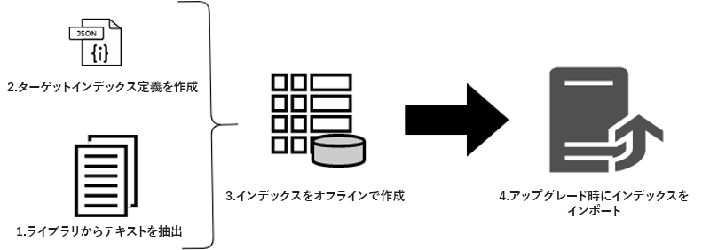

# オフライン再インデックスを使用したアップグレード中のダウンタイムの短縮 {#offline-reindexing-to-reduce-downtime-during-upgrades}

## 概要 {#introduction}

Adobe Experience Managerのアップグレードにおける主な課題の1つは、インプレースアップグレードを実行する際の作成者環境に関連するダウンタイムです。 コンテンツ作成者は、アップグレード中に環境にアクセスできません。 したがって、アップグレードの実行に要する時間を最小限に抑えることが望ましいです。 大規模なリポジトリ、特にAEM Assetsプロジェクトでは、大量のデータストアと1時間あたりの高レベルのアセットのアップロードが行われるので、Oakインデックスの再インデックス作成は、アップグレード時間の大部分を占めます。

このセクションでは、Oak-runツールを使用して、アップグレードを実行する **前にリポジトリのインデックスを再作成し** 、実際のアップグレード中のダウンタイムを削減する方法について説明します。 この手順は、バージョンAEM 6.4以降の [Lucene](https://jackrabbit.apache.org/oak/docs/query/lucene.html) インデックスに適用できます。

## 概要 {#overview}

AEMの新しいバージョンでは、機能セットが拡張されると、Oakインデックス定義に変更が加えられます。 Oakインデックスに変更を加えた場合、AEMインスタンスをアップグレードすると、強制的に再インデックスが作成されます。 アセットのテキスト（pdfファイルのテキストなど）を抽出してインデックスを作成する場合は、アセットのデプロイメントで再インデックスの作成は高価です。 MongoMKリポジトリでは、データはネットワーク上で保持され、再インデックス作成に要する時間がさらに長くなります。

アップグレード中に、ほとんどのお客様が直面する問題は、ダウンタイム時間を短縮することです。 解決策は **、アップグレード中に再インデックスアクティビティを** スキップすることです。 これは、アップグレードを実行する **前に新しいインデックを作成し** 、アップグレード中にインポートするだけで実現できます。

## アプローチ {#approach}



アップグレード前に、 [Oak-run](/help/sites-deploying/indexing-via-the-oak-run-jar.md) ツールを使用して、ターゲットAEMのバージョンのインデックス定義に対してインデックスを作成することをお勧めします。 上の図は、オフライン再インデックスのアプローチを示しています。

さらに、アプローチで説明されている手順の順序は次のとおりです。

1. バイナリからのテキストが最初に抽出される
2. ターゲットインデックス定義が作成されます
3. オフラインインデックスが作成されます
4. 次に、アップグレードプロセス中にインデックスがインポートされます

### テキスト抽出 {#text-extraction}

AEMで完全なインデックス付けを可能にするために、PDFなどのバイナリのテキストを抽出し、インデックスに追加する。 これは、インデックス作成プロセスでは通常、高コストな手順です。 テキスト抽出は、多数のバイナリを格納するアセットリポジトリの再インデックス付けを行う場合に特に提唱される最適化手順です。


システムに保存されているバイナリのテキストは、tikaライブラリを使用して、oak-runツールを使用して抽出できます。 本番システムのクローンは、アップグレード前に取得でき、このテキスト抽出プロセスに使用できます。 次の手順に従って、このプロセスによってテキストストアが作成されます。

**1.リポジトリを調べ、バイナリの詳細を収集する**

この手順では、パスとBLOB IDを含むバイナリのタプルを含むCSVファイルを作成します。

インデックスの作成元のディレクトリから次のコマンドを実行します。 次の例では、リポジトリのホームディレクトリを想定しています。

```
java java -jar oak-run.jar tika <nodestore path> --fds-path <datastore path> --data-file text-extraction/oak-binary-stats.csv --generate
```

は `nodestore path` どこに `mongo_ur` 、または `crx-quickstart/repository/segmentstore/`

プロセスの速度を上げるには、ではなく `--fake-ds-path=temp` パラメーター `–fds-path` を使用します。

**2.既存のインデックスで使用可能なバイナリテキストストアを再利用する**

既存のシステムからインデックスデータをダンプし、テキストストアを抽出します。

次のコマンドを使用して、既存のインデックスデータをダンプできます。

```
java -jar oak-run.jar index <nodestore path> --fds-path=<datastore path> --index-dump
```

は `nodestore path` どこに `mongo_ur` 、または `crx-quickstart/repository/segmentstore/`

次に、上記のインデックスダンプを使用してストアを設定します。

```
java -jar oak-run.jar tika --data-file text-extraction/oak-binary-stats.csv --store-path text-extraction/store --index-dir ./indexing-result/index-dumps/<oak-index-name>/data populate
```

ここ `oak-index-name` で、はフルテキストインデックスの名前（例：「lucene」）です。

**3.上記の手順でミスしたバイナリに対してtikaライブラリを使用して、テキスト抽出プロセスを実行します**

```
java -cp oak-run.jar:tika-app-1.21.jar org.apache.jackrabbit.oak.run.Main tika --data-file text-extraction/oak-binary-stats.csv --store-path text-extraction/store --fds-path <datastore path> extract
```

ここ `datastore path` で、はバイナリデータストアのパスです。

作成したテキストストアは、将来のシナリオで再インデックスを作成する際に更新して再利用できます。

テキスト抽出プロセスの詳細については、 [Oak-runのドキュメントを参照してください](https://jackrabbit.apache.org/oak/docs/query/pre-extract-text.html)。

### オフライン再インデックス {#offline-reindexing}


アップグレード前にLuceneインデックスをオフラインで作成します。 MongoMKを使用する場合は、ネットワークのオーバーヘッドを避けるため、MongoMkノードの1つで直接実行することをお勧めします。

インデックスをオフラインで作成するには、次の手順に従ってください。

**1.ターゲットAEMバージョンのOak Luceneインデックス定義の生成**

既存のインデックス定義をダンプします。 ターゲットのAEMバージョンとoak-runのAdobeGraniteリポジトリバンドルを使用して、変更されたインデックス定義が生成されました。

インデックス定義を **ソース** AEMインスタンスからダンプするには、次のコマンドを実行します。

>[!NOTE]
>
>インデックス定義のダンピングの詳細については、 [Oakのドキュメントを参照してください](https://jackrabbit.apache.org/oak/docs/query/oak-run-indexing.html#async-index-data)。

```
java -jar oak-run.jar index --fds-path <datastore path> <nodestore path> --index-definitions
```

`datastore path` およびは、 `nodestore path` ソースAEMインスタンスのどこにあり **** 、

次に、ターゲットバージョンのGraniteリポジトリバンドルを使用して、 **ターゲット** AEMバージョンからインデックス定義を生成します。

```
java -cp oak-run.jar:bundle-com.adobe.granite.repository.jar org.apache.jackrabbit.oak.index.IndexDefinitionUpdater --in indexing-definitions_source.json --out merge-index-definitions_target.json --initializer com.adobe.granite.repository.impl.GraniteContent
```

>[!NOTE]
>
> 上記のインデックス定義の作成プロセスは、バージョン以降でのみサポートされ `oak-run-1.12.0` ます。 ターゲット設定は、Graniteリポジトリバンドルを使用して行われ `com.adobe.granite.repository-x.x.xx.jar`ます。

上記の手順では、インデックス定義 `merge-index-definitions_target.json` と呼ばれるJSONファイルを作成します。

**2.リポジトリでのチェックポイントの作成**

実稼働 **ソース** AEMインスタンスに長い有効期間のチェックポイントを作成します。 これは、リポジトリをクローンする前に行う必要があります。

にあるJMXコンソール `http://serveraddress:serverport/system/console/jmx`から、に移動し `CheckpointMBean` て、有効期間が十分長いチェックポイント（200日など）を作成します。 この場合、ライフタイム期間（ミリ秒） `CheckpointMBean#createCheckpoint` の引数 `17280000000` としてを指定して、を呼び出します。

この処理が完了したら、新しく作成したチェックポイントIDをコピーし、JMXを使用して有効期間を検証し `CheckpointMBean#listCheckpoints`ます。

>[!NOTE]
>
> このチェックポイントは、インデックスが後でインポートされると削除されます。

詳細については、Oakのドキュメントから [チェックポイントの作成](https://jackrabbit.apache.org/oak/docs/query/oak-run-indexing.html#out-of-band-create-checkpoint) を参照してください。

**生成されたインデックス定義に対してオフラインインデックス作成を実行します**

Luceneの再インデックスは、oak-runを使用してオフラインで実行できます。 このプロセスは、のディスクにインデックスデータを作成し `indexing-result/indices`ます。 リポジトリに **書き込みを行わないため** 、実行中のAEMインスタンスを停止する必要はありません。 作成したテキストストアは、次の処理に入力されます。

```
java -Doak.indexer.memLimitInMB=500 -jar oak-run.jar index <nodestore path> --reindex --doc-traversal-mode --checkpoint <checkpoint> --fds-path <datastore path> --index-definitions-file merge-index-definitions_target.json --pre-extracted-text-dir text-extraction/store

Sample <checkpoint> looks like r16c85700008-0-8
—fds-path: path to data store.
--pre-extracted-text-dir: Directory of pre-extracted text.
merge-index-definitions_target: JSON file having merged definitions for the target AEM instance. indices in this file will be re-indexed.
```

この `--doc-traversal-mode` パラメーターはMongoMKのインストールで使用すると便利です。リポジトリのコンテンツをローカルフラットファイルにスプールすることで、再インデックス時間が大幅に短縮されます。 ただし、リポジトリのサイズと同じ重複領域が追加で必要になります。

MongoMKの場合、この手順がMongoDBインスタンスに近いインスタンスで実行されると、このプロセスが高速化されます。 同じマシン上で実行すると、ネットワークのオーバーヘッドが回避される場合があります。

技術的な詳細については、 [oak-runのドキュメントでインデックス作成に関する詳細を参照してください](https://jackrabbit.apache.org/oak/docs/query/oak-run-indexing.html)。

### インデックスの読み込み {#importing-indices}

AEM 6.4以降のバージョンでは、AEMには、起動シーケンスに基づいてディスクからインデックスを読み込む機能が組み込まれています。 起動中にインデックスデータが存在するかどうかをフォルダー `<repository>/indexing-result/indices` が監視します。 新しいバージョンの [ターゲット](in-place-upgrade.md#performing-the-upgrade)**** AEM jarを使用する前に、アップグレードプロセス中に、事前に作成されたインデックスを上記の場所にコピーできます。 AEMはそれをリポジトリにインポートし、対応するチェックポイントをシステムから削除します。 これにより、再インデックスを完全に回避する。

## その他のヒントとトラブルシューティング {#troubleshooting}

次に、役立つヒントとトラブルシューティングの手順を示します。

### 実稼働システムへの影響の軽減 {#reduce-the-impact-on-the-live-production-system}

本番システムのクローンを作成し、そのクローンを使用してオフラインインデックスを作成することをお勧めします。 これにより、本番システムに与える潜在的な影響を排除できます。 ただし、インデックスのインポートに必要なチェックポイントは、実稼働システムに存在する必要があります。 したがって、クローンを作成する前にチェックポイントを作成することが重要です。

### Runbookと体験版の実行を準備する {#prepare-a-runbook-and-trial-run}

実稼動環境でアップグレードを実行する前に、 [Runbookを準備し](https://docs.adobe.com/content/help/en/experience-manager-65/deploying/upgrading/upgrade-planning.html#building-the-upgrade-and-rollback-runbook) 、いくつかの試用を実行することをお勧めします。

### オフラインインデックス付きDoc Traversalモード {#doc-traversal-mode-with-offline-indexing}

オフラインインデックスの作成には、リポジトリ全体の複数のトランザクションが必要です。 MongoMKのインストールでは、インデックス作成プロセスのパフォーマンスに影響を与えるネットワークを介してリポジトリにアクセスします。 1つは、MongoDBレプリカ自体でオフラインインデックス作成処理を実行する方法です。これにより、ネットワークのオーバーヘッドが解消されます。 もう1つの方法は、doc traversalモードを使用する方法です。

Doc traversalモードは、オフラインインデックスを作成するoak-runコマンドにコマンドラインパラメータ `—doc-traversal` を追加することで適用できます。 このモードは、ローカルディスク内のリポジトリ全体のコピーをフラットファイルとしてスプールし、インデックス作成の実行に使用します。
