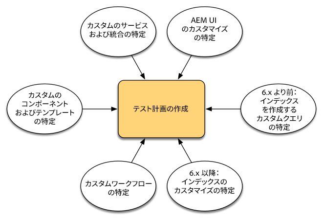
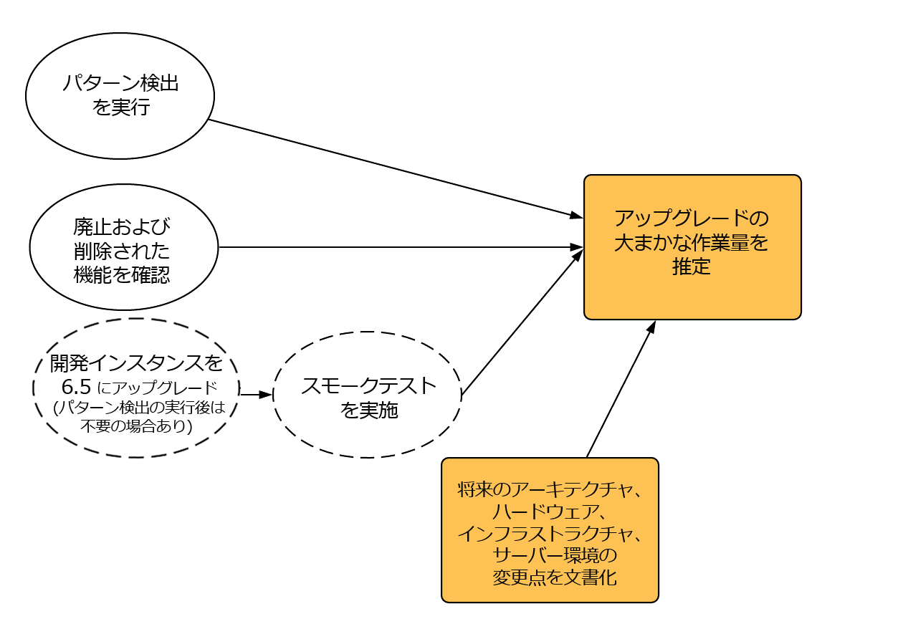
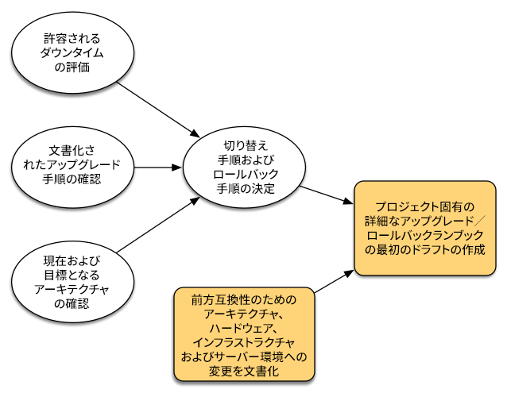
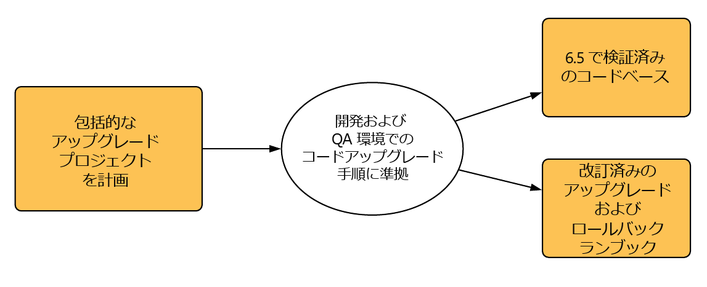
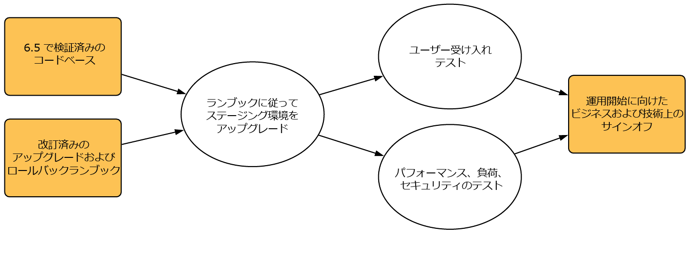

# アップグレードの計画{#planning-your-upgrade}

## AEM プロジェクトの概要 {#aem-project-overview}

AEM は、何百万人ものユーザーにサービスを提供するような、影響の大きいデプロイメントで使用されることがよくあります。ほとんどのケースでは、インスタンスにカスタムアプリケーションがデプロイされ、さらに複雑な構成になっています。このようなデプロイメントをアップグレードするときには、入念な計画が必要です。

ここでは、アップグレードの計画で明確な目標、フェーズ、成果物を定める際に役立つ情報を示します。全体的なプロジェクトの実行とガイドラインに重点を置きます。実際のアップグレード手順の概要を示しますが、入手可能な技術リソースを参照するよう指示する場合もあります。このドキュメントの解説と、入手可能な技術リソースを併せてお読みください。

AEM アップグレードプロセスでは、プランニング、分析および実行のフェーズと、各フェーズで定義される主要成果物を慎重に扱う必要があります。

AEMバージョン6.0から6.5に直接アップグレードできます。5.6.x以下を使用するお客様は、最初にバージョン6.0以降にアップグレードする必要があります。6.0(SP3)を推奨します。 また、6.3 以降は新しい OAK Segment Tar 形式がセグメントノードストアに対して使用されており、この新しい形式へのリポジトリ移行は 6.0、6.1 および 6.2 でも必須です。

>[!CAUTION]
>
>AEM 6.2 から 6.3 にアップグレードする場合は、バージョン（**6.2-SP1-CFP1 - -6.2SP1-CFP12.1**）または&#x200B;**6.2SP1-CFP15** 以降からアップグレードする必要があります。それ以外で、**6.2SP1-CFP13/6.2SP1CFP14** から AEM 6.3 にアップグレードする場合は、少なくともバージョン **6.3.2.2** にアップグレードする必要があります。そうしないと、AEM Sites はアップグレード後に失敗します。

## アップグレードの範囲と要件 {#upgrade-scope-requirements}

一般的な AEM アップグレードプロジェクトで影響を受ける領域の一覧を以下に示します。

<table>
 <tbody>
  <tr>
   <td><strong>コンポーネント</strong></td>
   <td><strong>影響</strong></td>
   <td><strong>説明</strong></td>
  </tr>
  <tr>
   <td>オペレーティングシステム</td>
   <td>不明確だが影響はわずか</td>
   <td>AEM をアップグレードするときに、オペレーティングシステムもアップグレードすべき場合があり、多少の影響が考えられます。</td>
  </tr>
  <tr>
   <td>Java Runtime</td>
   <td>中</td>
   <td>AEM 6.3 には JRE 1.7.x（64 ビット）以降が必要です。JRE 1.8 は、現在 Oracle によってサポートされている唯一のバージョンです。</td>
  </tr>
  <tr>
   <td>ハードウェア</td>
   <td>中</td>
   <td>オンラインリビジョンクリーンアップが正常に完了するには、リポジトリサイズの 25 ％の空きディスク領域と 15 ％の空きヒープ領域が必要です。  オンラインリビジョンクリーンアップを完全に実行するための十分なリソースを確保するために、ハードウェアをアップグレードする必要がある場合があります。  また、AEM 6 よりも前のバージョンからアップグレードする場合、追加のストレージ要件がある場合があります。 </td>
  </tr>
  <tr>
   <td>コンテンツリポジトリ（CRX または Oak）</td>
   <td>大</td>
   <td>バージョン 6.1 以降では CRX2 がサポートされなくなるので、古いバージョンからアップグレードする場合は Oak（CRX3）への移行が必要となります。 AEM 6.3 では、同じく移行が必要な新しいセグメントノードストアが実装されています。 移行には crx2oak ツールを使用します。 </td>
  </tr>
  <tr>
   <td>AEM コンポーネント／コンテンツ</td>
   <td>中</td>
   <td><code>/libs</code> and <code>/apps</code> are easily handled through the upgrade, but <code>/etc</code> usually requires some manual re-application of customizations.</td>
  </tr>
  <tr>
   <td>AEM サービス</td>
   <td>小</td>
   <td>ほとんどの AEM コアサービスは、アップグレードのテスト済みです。これは影響の小さい領域です。</td>
  </tr>
  <tr>
   <td>カスタムアプリケーションサービス</td>
   <td>小～大</td>
   <td>アプリケーションとカスタマイズによっては、JVM、オペレーティングシステムのバージョン、および（Oak ではインデックスが自動的に生成されないので）インデックス関連の変更に依存関係がある場合があります。  </td>
  </tr>
  <tr>
   <td>カスタムアプリケーションコンテンツ</td>
   <td>小～大</td>
   <td>アップグレードで処理されないコンテンツは、アップグレードの実行前にバックアップしておき、リポジトリに戻すことができます。  大部分のコンテンツは、移行ツールを使用して処理できます。</td>
  </tr>
 </tbody>
</table>

サポート対象のオペレーティングシステム、Java ランタイム、httpd および Dispatcher バージョンを実行していることを確認することが重要です。詳しくは、[AEM 6.5 の技術要件ページ](/help/sites-deploying/technical-requirements.md)を参照してください。これらのコンポーネントのアップグレードをプロジェクト計画で明確にする必要があり、AEM をアップグレードする前に実行する必要があります。

## プロジェクトフェーズ {#project-phases}

AEM アップグレードの計画および実行には、多数の作業が含まれます。このプロセスに含まれる様々な作業を明確にするために、計画および実行の作業を個別のフェーズに分割しました。以下の節では、各フェーズで成果物が生成され、それらは多くの場合プロジェクトのその後のフェーズで利用されます。

### 作成者トレーニングの計画 {#planning-for-author-training}

新しいリリースでは、UI およびユーザーワークフローの変更が導入される可能性があります。また、新しいリリースには新機能が導入されており、ビジネスで活用すると役に立つことがあります。導入された機能変更を確認し、それらが効果的に利用されるようにユーザーをトレーニングする計画を立てることをお勧めします。

AEM 6.5 の新機能は、[adobe.com の AEM セクション](/help/release-notes/release-notes.md)に記載されています。組織内で一般的に使用されている UI または製品機能の変更に注意してください。新機能を調べて、組織にとって役立つ可能性がある機能にも注意してください。AEM 6.5 での変更内容を確認したら、作成者向けのトレーニング計画を作成します。この計画には、helpx 機能ビデオのような無料で使用できるリソースや[アドビデジタルラーニングサービス](https://www.adobe.com/training.html)で提供される公式トレーニングを利用できます。

### テスト計画の作成 {#creating-a-test-plan}

顧客の AEM の実装はそれぞれ固有のものであり、ビジネス要件に合うようにカスタマイズされています。そのため、システムに対しておこなわれたすべてのカスタマイズを判別し、それらがテスト計画に含まれるようにすることが重要です。このテスト計画により、アップグレードされたインスタンスに対して実行する QA プロセスが強化されます。

すべてのアプリケーションとカスタムコードが引き続き想定どおりに動作することを確認するには、実稼動環境を正確に複製してアップグレードした後に、その環境でテストを実行する必要があります。すべてのカスタマイズを元に戻し、パフォーマンス、負荷およびセキュリティのテストを実行する必要があります。テスト計画を立てるときは、日々の運用で利用されている標準の UI およびワークフローに加えて、システムに対しておこなわれたすべてのカスタマイズを対象にします。カスタム OSGI サービスとサーブレット、Adobe Marketing Cloud への統合、AEM コネクタによるサードパーティとの統合、サードパーティとのカスタム統合、カスタムコンポーネントとテンプレート、AEM でのカスタム UI オーバーレイ、およびカスタムワークフローが含まれる場合があります。AEM 6 よりも前のバージョンから移行するお客様は、カスタムクエリにインデックスを作成する必要がある場合があるので、カスタムクエリを分析する必要があります。既に AEM 6.x バージョンを使用しているお客様も、これらのクエリをテストして、アップグレード後にインデックスが引き続き機能することを確認する必要があります。

### アーキテクチャおよびインフラストラクチャで必要な変更の判別 {#determining-architectural-and-infrastructure-changes-needed}

アップグレード時に、オペレーティングシステムや JVM など、技術スタックの他のコンポーネントのアップグレードも必要になる可能性があります。また、リポジトリ構成の変更により、追加ハードウェアが必要になる可能性があります。通常、これは 6.x よりも前のインスタンスから移行する顧客にのみ発生しますが、考慮しておくことが重要です。最後に、監視、メンテナンスなどの運用作業やバックアップおよび障害回復プロセスに対する変更が必要になる場合があります。

AEM 6.5 の技術要件を確認し、現在のハードウェアおよびソフトウェアで十分かどうかを確認します。運用プロセスに関して考えられる変更については、以下のドキュメントを参照してください。

**監視およびメンテナンス：**

[操作ダッシュボード](/help/sites-administering/operations-dashboard.md)

[Assets の監視のベストプラクティス](/help/assets/assets-monitoring-best-practices.md)

[JMX コンソールを使用したサーバーリソースの監視](/help/sites-administering/jmx-console.md)

[リビジョンクリーンアップ](/help/sites-deploying/revision-cleanup.md)

**バックアップ／復元および障害回復：**

[バックアップと復元](/help/sites-administering/backup-and-restore.md)

[パフォーマンスとスケーラビリティ](/help/sites-deploying/performance.md)

[TarMK コールドスタンバイによる AEM の実行方法](/help/sites-deploying/tarmk-cold-standby.md)

#### コンテンツの再構築に関する考慮事項 {#content-restructuring-considerations}

AEM では、よりシームレスなアップグレードを可能にするために、リポジトリの構造が変更されました。この変更の一環として、コンテンツが /etc フォルダーから /libs、/apps、/content などのフォルダーに移動されます。Adobe の所有コンテンツとお客様の所有コンテンツが分けて管理されるようになるので、リリース中にコンテンツを上書きしてしまう危険が低減します。リポジトリの再構築は、6.5アップグレード時にコードの変更を必要としないように行われました。ただし、アップグレードを計画する際には、AEMの [リポジトリの再構築で詳細を確認すること](/help/sites-deploying/repository-restructuring.md) をお勧めします。

### アップグレードの複雑性の評価 {#assessing-upgrade-complexity}

顧客が AEM 環境に適用するカスタマイズの量および性質は様々なので、あらかじめ時間をかけて、アップグレードで予期される全体的な作業量を判断することが重要です。

アップグレードの複雑性の評価には、2 つの方法があります。予備的な段階では、新たに導入されたパターン検出の機能を使用できます。これは、AEM 6.1、6.2 および 6.3 インスタンスで実行できます。パターン検出は、アップグレードの全体的な複雑性を最も簡単に評価できる方法です。レポートされたパターンを使用して複雑性を予測できます。パターン検出レポートには、カスタムコードベースで使用されている、利用できない API を特定するためのパターンが含まれています（6.3 では、アップグレード前の互換性チェックを使用しておこなわれていました）。

初期評価後、より包括的な次の手順として、テストインスタンスでアップグレードを実行し、基本的なスモークテストをおこなうことができます。アドビは も提供しています。また、アップグレード先のバージョンだけでなくソースバージョンとターゲットバージョンの間のバージョンについても、[廃止および削除された機能](/help/release-notes/deprecated-removed-features.md)のリストを確認する必要があります。例えば、AEM 6.2 から 6.5 にアップグレードする場合、AEM 6.5 以外に AEM 6.3 の廃止および削除された機能を確認することが重要です。

最近導入されたパターン検出は、ほとんどの場合に、アップグレード中に予想される作業について非常に正確な予測を提供します。However, for more complex customizations and deployments where you have incompatible changes you can upgrade a development instance to AEM 6.5 according to the instructions in [Performing an In-Place Upgrade](/help/sites-deploying/in-place-upgrade.md). 完了したら、この環境で全体的なスモークテストを実行します。これを実施する目的は、テストケース一覧をすべて完了して不具合の正式な一覧を生成することではなく、6.5 と互換性が保たれるようにコードをアップグレードするために必要となる作業量の大まかな見積もりを示すことです。プロジェクト管理チームは、[パターン検出](/help/sites-deploying/pattern-detector.md)と、前の節で特定したアーキテクチャの変更を組み合わせることで、アップグレード計画のためのおおよその見積もりを得ることができます。

### アップグレードおよびロールバックのランブックの作成 {#building-the-upgrade-and-rollback-runbook}

アドビは AEM インスタンスをアップグレードするためのプロセスを文書化していますが、それぞれの顧客のネットワークレイアウト、デプロイメントアーキテクチャおよびカスタマイズに合わせて、このアプローチの調整が必要になります。このため、提供されているドキュメントをすべて確認し、それを使用して、環境内で実行する具体的なアップグレードおよびロールバック手順を示すプロジェクト固有のランブックを作成することをお勧めします。CRX2 からアップグレードする場合は、CRX2 から Oak への移行時にコンテンツ移行にかかる時間を評価してください。大きいリポジトリの場合は、かなり時間がかかります。

アップグレードおよびロールバック手順については[アップグレード手順](/help/sites-deploying/upgrade-procedure.md)で、アップグレードを適用するためのステップごとの手順については[インプレースアップグレードの実行](/help/sites-deploying/in-place-upgrade.md)で説明しています。これらの手順を確認し、システムアーキテクチャ、カスタマイズおよびダウンタイム許容度とともに考慮して、アップグレード時に実行する適切な切り替え手順およびロールバック手順を決定する必要があります。カスタマイズしたランブックのドラフト作成時には、アーキテクチャまたはサーバーサイズの変更を含める必要があります。これを最初のドラフトとして扱う必要があることに注意することが重要です。チームが QA と開発のサイクルを完了してアップグレードをステージング環境にデプロイするときに、追加手順が必要になることがよくあります。理想的には、このドキュメントが運用スタッフのメンバーに渡された場合に、含まれている情報によってアップグレードを完全に完了できるくらいに、このドキュメントに十分な情報が含まれている必要があります。

### プロジェクト計画の作成 {#developing-a-project-plan}

これまでの作業の成果物を使用して、テスト作業または開発作業の予期されるタイムライン、トレーニングおよび実際のアップグレード実行を含むプロジェクト計画を作成できます。

包括的なプロジェクト計画には、以下が含まれています。

* 開発計画およびテスト計画の確定
* 開発環境および QA 環境のアップグレード
* AEM 6.5 のカスタムコードベースの更新
* QA テストおよび修正サイクル
* ステージング環境のアップグレード
* 統合、パフォーマンスおよび負荷テスト
* 環境認定
* 実稼動

### 開発および QA の実行 {#performing-development-and-qa}

AEM 6.5 と互換性を確保するために[コードのアップグレードとカスタマイズ](/help/sites-deploying/upgrading-code-and-customizations.md)手順を提供します。この反復プロセスが実行されると、必要に応じてランブックに変更を加える必要があります。Also see [Backward Compatibility in AEM 6.5](/help/sites-deploying/backward-compatibility.md) on information on how your customizations can stay backward compatible in most cases without requiring development immediately after upgrade.

通常、開発とテストのプロセスは繰り返されます。カスタマイズが原因となり、アップグレード時におこなわれる変更によって製品のセクション全体が使用できなくなることがあります。開発者が問題の根本原因に対処してから、テストチームがこれらの機能にアクセスしてテストすると、別の問題が見つかる可能性があります。アップグレードプロセスの調整が必要な問題が見つかった場合は、それをカスタムアップグレードランブックに追加してください。テストと修正が何回か繰り返された後、コードベースは完全に検証され、ステージング環境へのデプロイメントの準備が整います。

### 最終テスト {#final-testing}

コードベースが組織の QA チームによって認定された後に、最後のテストを実施することをお勧めします。このテストには、ステージング環境でのランブックの検証と、それに続くユーザー受け入れ、パフォーマンスおよびセキュリティのテストが含まれます。

この手順は、ランブックの手順を実稼動に近い環境で検証できる唯一の機会であるので重要です。環境がアップグレードされたら、エンドユーザーが一定の時間ログインして、日々のアクティビティでシステムを使用するときに実行するアクティビティを体験できるようにすることが重要です。これまで考慮されなかったシステムの一部をユーザーが利用することは珍しいことではありません。このような領域で実稼動の前に問題を見つけて修正することは、損害が大きくなる実稼働での停止を防ぐために役立ちます。新しいバージョンの AEM では基盤となるプラットフォームが大きく変更されているので、初めて導入する場合と同様に、パフォーマンス、負荷およびセキュリティのテストをシステムで実行することも重要です。

### アップグレードの実行 {#performing-the-upgrade}

すべての関係者から最終承認を受けたら、定義されたランブック手順に基づいて実行します。アップグレードおよびロールバックの手順は[アップグレード手順](/help/sites-deploying/upgrade-procedure.md)で、インストール手順は[インプレースアップグレードの実行](/help/sites-deploying/in-place-upgrade.md)を参照してください。

アップグレード手順では、環境を検証するためのいくつかの手順が提供されています。これらの手順には、アップグレードログの調査やすべての OSGi バンドルが正しく起動することの確認のような基本的なチェックが含まれていますが、ビジネスプロセスに基づいて独自のテストケースを検証することもお勧めします。また、AEM のオンラインリビジョンクリーンアップおよび関連する定期的な作業のスケジュールをチェックして、それらが処理の少ない時間帯に実行されることを確認することもお勧めします。これらの定期的な作業は、AEM の長期的なパフォーマンスにとって重要です。
