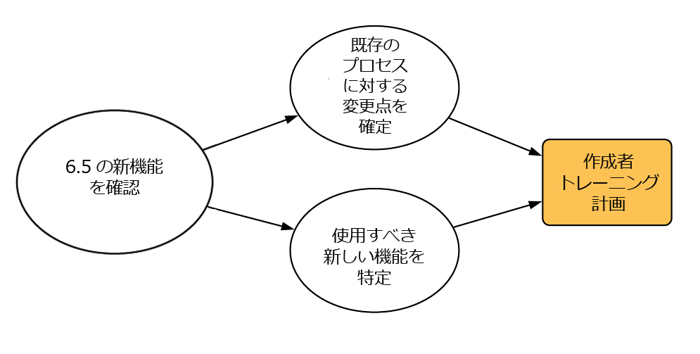
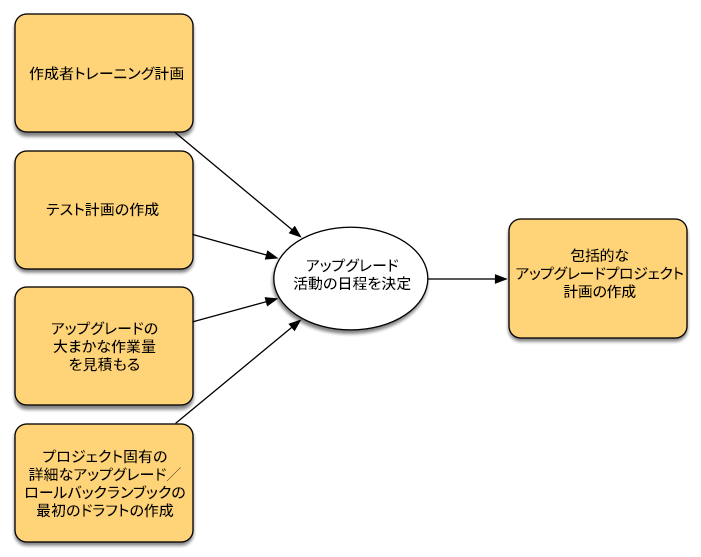

# アップグレードの計画{#planning-your-upgrade}

## AEM Project の概要 {#aem-project-overview}

AEMは、多くの場合、数百万人のユーザーに役立つ可能性のある、影響の大きいデプロイメントで使用されます。 通常、インスタンスにデプロイされるカスタムアプリケーションがあり、その結果、複雑さが増します。 このようなデプロイメントをアップグレードする際の作業は、体系的に処理する必要があります。

このガイドは、アップグレードを計画する際に明確な目標、フェーズ、成果物を確立する際に役立ちます。 全体的なプロジェクトの実行とガイドラインに焦点を当てます。 実際のアップグレード手順の概要は示されますが、必要に応じて利用可能な技術リソースを指します。 ドキュメントで参照されている、利用可能な技術リソースと共に使用する必要があります。

AEMアップグレードプロセスでは、計画、分析および実行フェーズを慎重に処理し、各フェーズで定義された主な成果物を使用する必要があります。

AEMバージョン 6.0 および 6.5 に直接アップグレードできます。5.6.x 以下を実行しているお客様は、最初にバージョン 6.0 以降にアップグレードする必要があります。6.0(SP3) をお勧めします。 また、6.3 以降の Segment Node Store では、新しい Oak Segment Tar 形式が使用されるようになりました。6.0、6.1 および 6.2 でも、この新しい形式へのリポジトリ移行は必須です。

>[!CAUTION]
>
>AEM 6.2 から 6.3 にアップグレードする場合は、バージョンからアップグレードする必要があります (**6.2-SP1-CFP1 - -6.2SP1-CFP12.1**) または **6.2SP1-CFP15** 以降 それ以外の場合は、 **6.2SP1-CFP13/6.2SP1CFP14** AEM 6.3 には、少なくともバージョンにアップグレードする必要があります。 **6.3.2.2**. そうしないと、AEM Sitesはアップグレード後に失敗します。

## アップグレードの範囲と要件 {#upgrade-scope-requirements}

一般的なAEM Upgrade プロジェクトで影響を受ける領域のリストを次に示します。

<table>
 <tbody>
  <tr>
   <td><strong>コンポーネント</strong></td>
   <td><strong>影響</strong></td>
   <td><strong>説明</strong></td>
  </tr>
  <tr>
   <td>オペレーティングシステム</td>
   <td>不確かで微妙な効果</td>
   <td>AEMのアップグレード時に、オペレーティングシステムもアップグレードする時期が来る場合があり、その場合は多少の影響が出る場合があります。</td>
  </tr>
  <tr>
   <td>Java™ Runtime</td>
   <td>影響を緩やかに</td>
   <td>AEM 6.3 には JRE 1.7.x（64 ビット）以降が必要です。 JRE 1.8 は、Oracleで現在サポートされている唯一のバージョンです。</td>
  </tr>
  <tr>
   <td>ハードウェア</td>
   <td>影響を緩やかに</td>
   <td>オンラインリビジョンクリーンアップが正常に完了するには、 リポジトリサイズの 25 ％の空きディスク領域と 15 ％の空きヒープ領域が必要です。 ハードウェアを  オンラインでのリビジョンクリーンアップが完全に完了するのに十分なリソースを確保する  実行 また、AEM 6 より前のバージョンからアップグレードする場合は、次の場所にあります。  追加のストレージ要件が必要になる場合があります。</td>
  </tr>
  <tr>
   <td>コンテンツリポジトリ（CRX または Oak）</td>
   <td>大きな影響</td>
   <td>バージョン 6.1 以降では、AEMは CRX2 をサポートしていないので、  古いバージョンからアップグレードする場合は、Oak(CRX3) が必要です。 AEM 6.3 は  移行も必要な新しいセグメントノードストアが実装されました。 この  この目的では、crx2oak ツールを使用します。</td>
  </tr>
  <tr>
   <td>AEM Components/Content</td>
   <td>影響を緩やかに</td>
   <td><code>/libs</code> および <code>/apps</code> は、アップグレードを通じて簡単に処理できますが、 <code>/etc</code> 通常は、カスタマイズを手動で再適用する必要があります。</td>
  </tr>
  <tr>
   <td>AEM Services</td>
   <td>低影響</td>
   <td>ほとんどのAEMコアサービスは、アップグレードのテストが実施されています。 ここは衝撃が少ない領域です。</td>
  </tr>
  <tr>
   <td>カスタムアプリケーションサービス</td>
   <td>低～高影響</td>
   <td>アプリケーションとカスタマイズに応じて、次のことが可能です。  JVM、オペレーティングシステムのバージョン、およびインデックス作成関連の依存関係  インデックスは Oak で自動的に生成されないので、変更します。</td>
  </tr>
  <tr>
   <td>カスタムアプリケーションコンテンツ</td>
   <td>低～高影響</td>
   <td>アップグレードで処理されないコンテンツは、バックアップできます  アップグレードが実行され、リポジトリに戻される前に、次の手順を実行します。  ほとんどのコンテンツは、移行ツールを使用して処理できます。</td>
  </tr>
 </tbody>
</table>

サポート対象のオペレーティングシステム、Java™ランタイム、httpd、Dispatcher の各バージョンを実行していることを確認することが重要です。 詳しくは、 [AEM 6.5 技術要件ページ](/help/sites-deploying/technical-requirements.md). これらのコンポーネントのアップグレードは、プロジェクト計画で考慮する必要があり、AEMをアップグレードする前に実行する必要があります。

## プロジェクトフェーズ {#project-phases}

AEMのアップグレードの計画と実行には、多くの作業が必要になります。 このプロセスに伴う様々な取り組みを明確にするため、Adobeは計画と実行の演習を別々のフェーズに分けています。 以下のセクションでは、各フェーズで成果物が作成され、プロジェクトの将来のフェーズで頻繁に使用されます。

### 作成者トレーニングの計画 {#planning-for-author-training}

新しいリリースでは、UI とユーザーワークフローに潜在的な変更が加えられる可能性があります。 また、新しいリリースでは、ビジネスで役立つ新機能が導入されました。 Adobeでは、導入された機能の変更を確認し、ユーザーに対して効果的な使用に関するトレーニングを実施する計画を策定することをお勧めします。

AEM 6.5 の新機能は、 [adobe.com のAEMセクション](/help/release-notes/release-notes.md). 組織で一般的に使用される UI や製品機能に対する変更を必ずメモしておきます。 新機能を確認する際は、組織にとって価値のあるものをメモしておきます。 AEM 6.5 での変更点を確認したら、作成者向けのトレーニング計画を作成します。 これには、ヘルプ機能のビデオや、 [Adobeデジタルラーニングサービス](https://learning.adobe.com/).

### テスト計画の作成 {#creating-a-test-plan}

各お客様のAEMの実装は一意で、ビジネス要件に合わせてカスタマイズされています。 その結果、テスト計画に含めることができるように、システムに対して行われたすべてのカスタマイズを特定することが重要です。 このテスト計画は、アップグレードされたインスタンスでAdobeが実行する QA プロセスを強化します。

正確な実稼動環境を複製し、アップグレード後にテストを実行して、すべてのアプリケーションとカスタムコードが引き続き必要に応じて実行されることを確認する必要があります。 すべてのカスタマイズを取り消し、パフォーマンス、読み込み、セキュリティのテストを実行します。 テスト計画を編成する際は、標準搭載の UI や日々の操作で使用されるワークフローに加えて、システムに対しておこなわれたすべてのカスタマイズをカバーするようにします。 これには、カスタム OSGi サービスおよびサーブレット、Adobe Experience Cloudへの統合、AEMコネクタを介したサードパーティとの統合、カスタムサードパーティ統合、カスタムコンポーネントとテンプレート、AEMのカスタム UI オーバーレイ、カスタムワークフローが含まれます。 AEM 6 より前のバージョンから移行するお客様の場合は、カスタムクエリのインデックスを作成する必要がある場合があるので、カスタムクエリを分析する必要があります。 既にAEM 6.x バージョンを使用しているお客様の場合、アップグレード後もインデックスが引き続き効果的に動作することを確認するために、これらのクエリをテストする必要があります。

### 必要なアーキテクチャとインフラストラクチャの変更の決定 {#determining-architectural-and-infrastructure-changes-needed}

アップグレード時に、オペレーティングシステムや JVM など、技術スタック内の他のコンポーネントをアップグレードする必要が生じる場合があります。 また、リポジトリ構成の変更により、追加のハードウェアが必要になる場合があります。 これは、6.x 以前のインスタンスから移行するお客様向けにのみ提供されますが、考慮すべき重要な作業です。 最後に、監視、保守、バックアップ、災害復旧のプロセスを含む、運用上の慣行に必要な変更が存在する場合があります。

AEM 6.5 の技術要件を確認し、現在のハードウェアおよびソフトウェアで十分であることを確認します。 運用プロセスに関して考えられる変更については、以下のドキュメントを参照してください。

**監視およびメンテナンス：**

[操作ダッシュボード](/help/sites-administering/operations-dashboard.md)

[Assets の監視のベストプラクティス](/help/assets/assets-monitoring-best-practices.md)

[JMX コンソールを使用したサーバーリソースの監視](/help/sites-administering/jmx-console.md)

[リビジョンクリーンアップ](/help/sites-deploying/revision-cleanup.md)

**バックアップ／復元および障害回復：**

[バックアップと復元](/help/sites-administering/backup-and-restore.md)

[パフォーマンスとスケーラビリティ](/help/sites-deploying/performance.md)

[TarMK コールドスタンバイによる AEM の実行方法](/help/sites-deploying/tarmk-cold-standby.md)

#### コンテンツの再構築に関する考慮事項 {#content-restructuring-considerations}

AEMでは、よりシームレスにアップグレードをおこなう際に役立つ、リポジトリ構造が変更されました。 この変更の一環として、コンテンツが /etc フォルダーから /libs、/apps、/content などのフォルダーに移動されます。Adobe の所有コンテンツとお客様の所有コンテンツが分けて管理されるようになるので、リリース中にコンテンツを上書きしてしまう危険が低減します。リポジトリの再構築は、6.5 へのアップグレード時にコードを変更する必要がないようにおこなわれました。ただし、詳細は [AEMでのリポジトリの再構築](/help/sites-deploying/repository-restructuring.md) アップグレードの計画中に

### アップグレードの複雑性の評価 {#assessing-upgrade-complexity}

Adobeのお客様がAEM環境に適用するカスタマイズの量と特性は様々なので、アップグレードで予想される全体的な作業レベルを判断するためには、事前に少し時間を割くことが重要です。

アップグレードの複雑さの評価には、2 つの方法があります。事前段階では、AEM 6.1、6.2 および 6.3 インスタンスで実行できる、新しく導入されたパターン検出を使用できます。 パターン検出は、報告されたパターンを使用して、アップグレードの全体的な複雑さを評価する最も簡単な方法です。 パターン検出レポートには、カスタムコードベースで使用中の、使用できない API を識別するためのパターンが含まれています（これは、6.3 のアップグレード前の互換性チェックを使用しておこなわれました）。

最初の評価の後、より包括的な次のステップは、テストインスタンスのアップグレードを実行し、いくつかの基本的なスモークテストを実行することです。 Adobeには、もいくつか用意されています。 また、 [廃止および削除された機能](/help/release-notes/deprecated-removed-features.md) アップグレード先のバージョンだけでなく、ソースバージョンとターゲットバージョンの間のすべてのバージョンも確認する必要があります。 例えば、AEM 6.2 から 6.5 にアップグレードする場合、AEM 6.5 以外に AEM 6.3 の廃止および削除された機能を確認することが重要です。

最近導入されたパターン検出は、ほとんどの場合に、アップグレード中に予想される作業について非常に正確な予測を提供します。ただし、互換性のない変更点が存在する、より複雑なカスタマイズやデプロイメントの場合は、[インプレースアップグレードの実行](/help/sites-deploying/in-place-upgrade.md)の手順に従い開発インスタンスを AEM 6.5 にアップグレードできます。完了したら、この環境で高レベルのスモークテストを実行します。 この演習の目的は、テストケースのインベントリを完全に完了し、欠陥の正式なインベントリを作成するのではなく、6.5 互換性のためにコードをアップグレードするために必要な作業量を大まかに見積もることです。 を [パターン検出](/help/sites-deploying/pattern-detector.md) また、前の節で決定したアーキテクチャの変更については、プロジェクト管理チームに大まかな見積もりを提供し、アップグレードを計画できます。

### アップグレードおよびロールバックランブックの構築 {#building-the-upgrade-and-rollback-runbook}

AdobeではAEMインスタンスのアップグレードプロセスを説明していますが、各顧客のネットワークレイアウト、デプロイメントアーキテクチャおよびカスタマイズには、このアプローチの微調整とカスタマイズが必要です。 このため、Adobeでは、提供されているすべてのドキュメントを確認し、それを使用して、お使いの環境で従う特定のアップグレードおよびロールバック手順の概要を示すプロジェクト固有の Runbook に通知することを推奨します。 CRX2 からアップグレードする場合は、CRX2 から Oak に移行する際にコンテンツ移行に要する時間を必ず評価してください。 大規模なリポジトリの場合は、相当量が存在する可能性があります。

Adobeは、 [アップグレード手順](/help/sites-deploying/upgrade-procedure.md) アップグレードを適用する手順については、 [インプレースアップグレード](/help/sites-deploying/in-place-upgrade.md). これらの手順は、アップグレード時に実行する適切な切り替えおよびロールバック手順を決定するために、システムアーキテクチャ、カスタマイズ、およびダウンタイムの許容範囲を確認し、考慮する必要があります。 カスタマイズした Runbook の作成時に、アーキテクチャやサーバーサイズの変更を含める必要があります。 これは最初の下書きとして扱う必要があることに注意してください。 チームが QA および開発サイクルを完了し、ステージング環境にアップグレードをデプロイすると、追加の手順が必要になる場合があります。 このドキュメントには、オペレーションスタッフに渡された場合に、内の情報から完全にアップグレードを完了できるような十分な情報を含めることが理想的です。

### プロジェクト計画の作成 {#developing-a-project-plan}

前の演習の出力を使用して、テストまたは開発作業、トレーニング、実際のアップグレード実行に必要なタイムラインをカバーするプロジェクト計画を作成できます。

包括的なプロジェクト計画には、以下が含まれています。

* 開発計画およびテスト計画の確定
* 開発環境および QA 環境のアップグレード
* AEM 6.5 のカスタムコードベースの更新
* QA テストおよび修正サイクル
* ステージング環境のアップグレード
* 統合、パフォーマンス、負荷テスト
* 環境認定
* 運用開始

### 開発および QA の実行 {#performing-development-and-qa}

Adobeが～に対して手続きを行った [コードのアップグレードとカスタマイズ](/help/sites-deploying/upgrading-code-and-customizations.md) AEM 6.5 との互換性を保つには、この反復プロセスを実行する際に、必要に応じてランブックに変更を加える必要があります。 関連トピック [AEM 6.5 の後方互換性](/help/sites-deploying/backward-compatibility.md) 通常、アップグレード後に開発を行う必要がなく、カスタマイズ部分の後方互換性を維持する方法に関する情報を紹介します。

通常、開発とテストのプロセスは反復的なプロセスです。 カスタマイズが原因で、アップグレード中に加えられた変更により、製品のセクション全体が使用できなくなる場合があります。 開発者が問題の根本原因に対処し、テストチームがこれらの機能をテストできるようになると、問題がさらに発生する可能性があります。 アップグレードプロセスの調整が必要な問題が見つかったので、必ずカスタムアップグレード Runbook に追加してください。 テストと修正を数回繰り返した後、コードベースは完全に検証され、ステージング環境にデプロイする準備が整う必要があります。

### 最終テスト {#final-testing}

Adobeでは、コードベースが組織の QA チームによって認定された後に、最終的なテストラウンドをお勧めします。 この一連のテストでは、ステージング環境での Runbook の検証に続いて、ユーザーの受け入れ、パフォーマンス、セキュリティのテストが行われます。

実稼動環境に対してランブックの手順を検証できるのは、この手順だけなので、この手順は重要です。 環境がアップグレードされたら、エンドユーザーがログインして、日々のアクティビティでシステムを使用する際におこなうアクティビティを実行できるようにすることが重要です。 ユーザーが、以前は考えられていなかったシステムの一部を使用することは珍しくありません。 運用開始前にこれらの領域で問題を見つけて修正すると、コストのかかる生産停止を防ぐのに役立ちます。 新しいバージョンのAEMには、基盤となるプラットフォームに対する大幅な変更が含まれているので、初めて起動した場合と同様に、システムでパフォーマンス、負荷、セキュリティのテストを実行することも重要です。

### アップグレードの実行 {#performing-the-upgrade}

すべての関係者から最終的な承認が受け取られたら、定義された Runbook 手順を実行する番です。 Adobeでは、 [アップグレード手順](/help/sites-deploying/upgrade-procedure.md) と、 [インプレースアップグレード](/help/sites-deploying/in-place-upgrade.md) を参照点として使用します。

Adobeは、環境の検証のためのアップグレード手順にいくつかの手順を提供しています。 これには、アップグレードログのスキャンや、すべての OSGi バンドルが正しく開始されたことの確認などの基本的なチェックが含まれますが、Adobeは、ビジネスプロセスに基づいて、独自のテストケースで検証することもお勧めします。 Adobeでは、AEM Online でのリビジョンクリーンアップのスケジュールや関連するルーチンを確認して、会社の静かな時間帯に実行されることを確認することもお勧めします。 これらのルーチンは、AEMの長期的なパフォーマンスに不可欠です。
