# アップグレード手順 {#upgrade-procedure}

>[!NOTE]
>
>ほとんどのAdobe Experience Manager(AEM) アップグレードはインプレースで実行されるので、アップグレードにはオーサー層のダウンタイムが必要です。 これらのベストプラクティスに従うことで、パブリッシュ層のダウンタイムを最小限に抑えたり、なくしたりできます。

AEM環境をアップグレードする際は、オーサー環境またはパブリッシュ環境のアップグレード方法の違いを考慮して、オーサーとエンドユーザーの両方のダウンタイムを最小限に抑える必要があります。 このページでは、AEM 6.x のバージョンで現在実行中のAEMトポロジをアップグレードするための高レベルの手順について説明します。プロセスは、オーサー層とパブリッシュ層、Mongo と TarMK ベースのデプロイメントとで異なるので、各層とマイクロカーネルは別の節に記載されています。 デプロイメントを実行する場合は、まずオーサー環境をアップグレードし、成功を判断してから、パブリッシュ環境に進むことをお勧めします。

<!--
>[!IMPORTANT]
>
>The downtime during the upgrade can be significally reduced by indexing the repository before performing the upgrade. For more information, see [Using Offline Reindexing To Reduce Downtime During an Upgrade](/help/sites-deploying/upgrade-offline-reindexing.md)
-->

## TarMK オーサー層 {#tarmk-author-tier}

### トポロジの開始 {#starting-topology}

この節で想定されるトポロジは、TarMK 上で実行され、コールドスタンバイを使用するオーサーサーバーで構成されます。 オーサーサーバーから TarMK パブリッシュファームへのレプリケーションが発生します。 ここでは説明しませんが、この方法は、オフロードを使用するデプロイメントにも使用できます。 オーサーインスタンスでレプリケーションエージェントを無効にした後、再度有効にする前に、新しいバージョンでオフロードインスタンスをアップグレードまたは再構築してください。

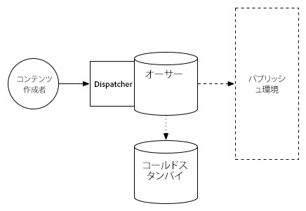

### アップグレードの準備 {#upgrade-preparation}

1. コンテンツのオーサリングを停止します。。

1. スタンバイインスタンスを停止します。

1. 作成者のレプリケーションエージェントを無効にします。

1. を実行します。 [アップグレード前のメンテナンスタスク](/help/sites-deploying/pre-upgrade-maintenance-tasks.md).

### アップグレードの実行 {#upgrade-execution}

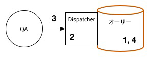

1. [インプレースアップグレード](/help/sites-deploying/in-place-upgrade.md)を実行します。。
1. Dispatcher モジュールの更新 *必要に応じて*.

1. QA がアップグレードを検証します。

1. オーサーインスタンスをシャットダウンします。

### 成功した場合 {#if-successful}

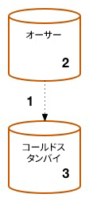

1. アップグレードしたインスタンスをコピーして、コールドスタンバイを作成します。

1. オーサーインスタンスを起動します。

1. スタンバイインスタンスを起動します。

### 失敗した場合（ロールバック） {#if-unsuccessful-rollback}

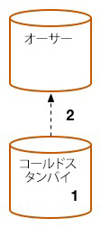

1. コールドスタンバイインスタンスを新しいプライマリとして起動します。。

1. コールドスタンバイからオーサー環境を再構築します。

## MongoMK オーサークラスター {#mongomk-author-cluster}

### トポロジの開始 {#starting-topology-1}

この節で想定されるトポロジは、少なくとも 2 つの MongoMK データベースをベースとする、2 つ以上の AEM オーサーインスタンスを持つ MongoMK オーサークラスターで構成されます。 すべてのオーサーインスタンスは 1 つのデータストアを共有します。 以下の手順は、S3 とファイルの両方のデータストアに適用する必要があります。 オーサーサーバーから TarMK パブリッシュファームへのレプリケーションが発生します。

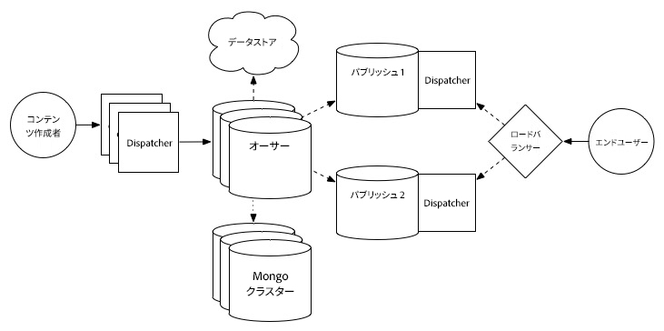

### アップグレードの準備 {#upgrade-preparation-1}

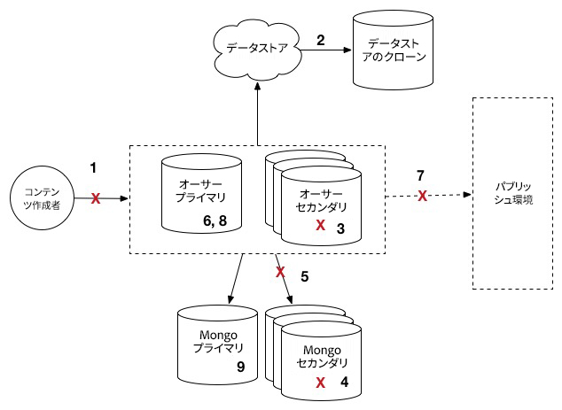

1. コンテンツのオーサリングを停止します。。
1. バックアップ用にデータストアのクローンを作成します。
1. 1 つの AEM オーサーインスタンス（プライマリオーサー）以外をすべて停止します。
1. 1 つ以外の MongoDB ノードを、プライマリ Mongo インスタンスのレプリカセットからすべて削除します。
1. を更新します。 `DocumentNodeStoreService.cfg` ファイルをプライマリオーサー上に置き、単一のメンバレプリカセットを反映させます。
1. プライマリオーサーを再起動し、正しく再起動するかを確認します。
1. プライマリオーサーでレプリケーションエージェントを無効にします。
1. 実行 [アップグレード前のメンテナンスタスク](/help/sites-deploying/pre-upgrade-maintenance-tasks.md) をプライマリオーサーインスタンスに設定します。
1. 必要に応じて、プライマリ Mongo インスタンスの MongoDB を、WiredTiger を使用したバージョン 3.2 にアップグレードします。

### アップグレードの実行 {#Upgrade-execution-1}

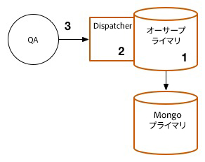

1. プライマリオーサーで[インプレースアップグレード](/help/sites-deploying/in-place-upgrade.md)を実行します。。
1. Dispatcher または Web モジュールの更新 *必要に応じて*.
1. QA がアップグレードを検証します。

### 成功した場合 {#if-successful-1}

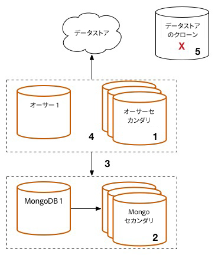

1. アップグレードされた Mongo インスタンスに接続する新しい 6.5 オーサーインスタンスを作成します。。

1. クラスターから削除した MongoDB ノードを再構築します。

1. を更新します。 `DocumentNodeStoreService.cfg` フルレプリカセットを反映するファイル。

1. オーサーインスタンスを 1 つずつ再起動します。

1. クローン作成されたデータストアを削除します。

### 失敗した場合（ロールバック）  {#if-unsuccessful-rollback-2}

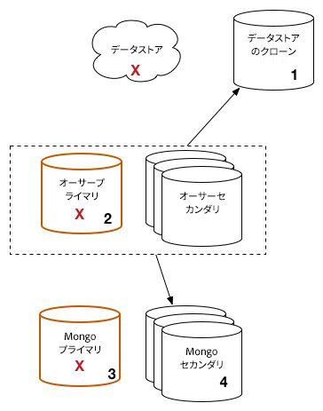

1. クローン作成されたデータストアに接続するために、セカンダリオーサーインスタンスを再設定します。。

1. アップグレードしたオーサープライマリインスタンスをシャットダウンします。

1. アップグレードされた Mongo プライマリインスタンスをシャットダウンします。

1. セカンダリ Mongo インスタンスを起動し、そのうちの 1 つを新しいプライマリとして設定します。。

1. の設定 `DocumentNodeStoreService.cfg` セカンダリオーサーインスタンス上のファイルが、まだアップグレードされていない Mongo インスタンスのレプリカセットを指している。

1. セカンダリオーサーインスタンスを起動します。

1. アップグレードされたオーサーインスタンス、Mongo ノード、データストアをクリーンアップします。

## TarMK パブリッシュファーム {#tarmk-publish-farm}

### TarMK パブリッシュファーム {#tarmk-publish-farm-1}

この節で想定されるトポロジは、2 つの TarMK パブリッシュインスタンスで構成され、Dispatcher がフロントし、ロードバランサーがフロントします。 オーサーサーバーから TarMK パブリッシュファームへのレプリケーションが発生します。

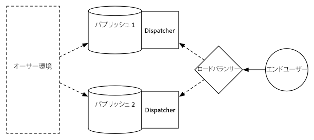

### アップグレードの実行 {#upgrade-execution-2}

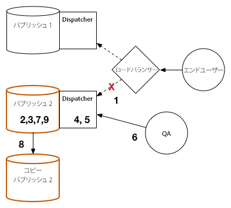

1. ロードバランサーで Publish 2 インスタンスへのトラフィックを停止します。。
1. 実行 [アップグレード前のメンテナンス](/help/sites-deploying/pre-upgrade-maintenance-tasks.md) 公開 2.
1. の実行 [インプレースアップグレード](/help/sites-deploying/in-place-upgrade.md) 公開 2.
1. Dispatcher または Web モジュールの更新 *必要に応じて*.
1. Dispatcher キャッシュをフラッシュします。
1. QA は、ファイアウォールの背後にある Dispatcher を介して Publish 2 を検証します。
1. 公開 2 をシャットダウンします。
1. Publish 2 インスタンスをコピーします。
1. Publish 2 を起動します。

### 成功した場合 {#if-successful-2}

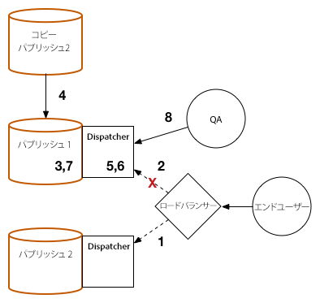

1. Publish 2 へのトラフィックを有効にします。。
1. Publish 1 へのトラフィックを停止します。
1. Publish 1 インスタンスを停止します。
1. Publish 1 インスタンスを Publish 2 のコピーに置き換えます。
1. Dispatcher または Web モジュールの更新 *必要に応じて*.
1. Publish 1 の Dispatcher キャッシュをフラッシュします。
1. Publish 1 を起動します。
1. QA は、ファイアウォールの背後にある Dispatcher を介して Publish 1 を検証します。

### 失敗した場合（ロールバック） {#if-unsuccessful-rollback-1}

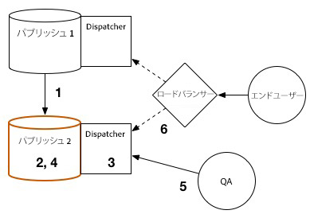

1. Publish 1 のコピーを作成します。。
1. Publish 2 インスタンスを Publish 1 のコピーに置き換えます。
1. Publish 2 の Dispatcher キャッシュをフラッシュします。
1. Publish 2 を起動します。
1. QA は、ファイアウォールの背後にある Dispatcher を介して Publish 2 を検証します。
1. Publish 2 へのトラフィックを有効にします。

## アップグレードの最終手順 {#final-upgrade-steps}

1. Publish 1 へのトラフィックを有効にします。。
1. QA は、公開 URL から最終的な検証を実行します。
1. オーサー環境からレプリケーションエージェントを有効にします。
1. コンテンツのオーサリングを再開します。
1. [アップグレード後のチェック](/help/sites-deploying/post-upgrade-checks-and-troubleshooting.md)を実行します。

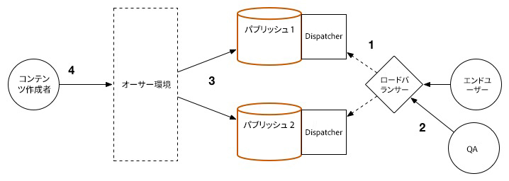
