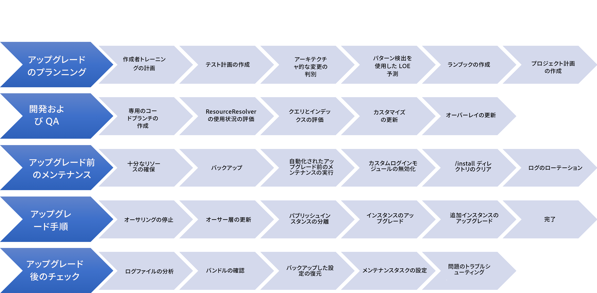
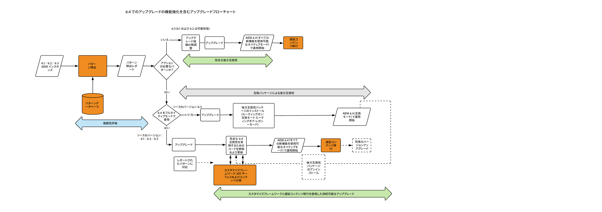

# AEM 6.5 へのアップグレード {#upgrading-to-aem}

この節では、AEM 6.5 への AEM インストール環境のアップグレードについて説明します。

* [アップグレードの計画](/help/sites-deploying/upgrade-planning.md)
* [パターン検出を使用したアップグレードの複雑性の評価](/help/sites-deploying/pattern-detector.md)
* [AEM 6.5 における後方互換性](/help/sites-deploying/backward-compatibility.md)

<!--* [Using Offline Reindexing To Reduce Downtime During an Upgrade](/help/sites-deploying/upgrade-offline-reindexing.md)-->
* [アップグレード手順](/help/sites-deploying/upgrade-procedure.md)
* [コードのアップグレードとカスタマイズ](/help/sites-deploying/upgrading-code-and-customizations.md)
* [アップグレード前のメンテナンスタスク](/help/sites-deploying/pre-upgrade-maintenance-tasks.md)
* [インプレースアップグレードの実行](/help/sites-deploying/in-place-upgrade.md)
* [アップグレード後のチェックおよびトラブルシューティング](/help/sites-deploying/post-upgrade-checks-and-troubleshooting.md)
* [持続可能なアップグレード](/help/sites-deploying/sustainable-upgrades.md)
* [遅延コンテンツ移行](/help/sites-deploying/lazy-content-migration.md)
* [AEM 6.5 におけるリポジトリの再構築](/help/sites-deploying/repository-restructuring.md)

この手順に出てくる AEM インスタンスをわかりやすく区別するために、以下のように呼ぶことにします。

* アップグレード元の AEM インスタンスを「ソース」インスタンスと呼びます。**
* アップグレード先のインスタンスを「ターゲット」インスタンスと呼びます。**

>[!NOTE]
>
>アップグレードの信頼性を向上させるための取り組みの一環として、AEM は包括的なリポジトリの再構築を実施しました。新しい構造体に合わせる方法の詳細は、[AEM におけるリポジトリ再構成](/help/sites-deploying/repository-restructuring.md)を参照してください。

## What Has Changed? {#what-has-changed}

以下に、AEM の最近のいくつかのリリースでの注目すべき主な変更点を示します。

AEM 6.0 で、新しい Jackrabbit Oak リポジトリが導入されました。Persistence Manager は、[マイクロカーネル](/help/sites-deploying/platform.md#contentbody_title_4)で置き換えられました。バージョン 6.1 から CRX2 がサポートされなくなりました。5.6.1 のインスタンスから CRX2 リポジトリを移行するには、crx2oak という移行ツールを実行する必要があります。詳しくは、[CRX2OAK 移行ツールの使用](/help/sites-deploying/using-crx2oak.md)を参照してください。

アセットインサイトを使用し、AEM 6.2 より前のバージョンからアップグレードする場合は、アセットを移行し、JMX Bean で ID を生成する必要があります。アドビの内部テストでは TarMK 環境の 12.5 万個のアセットが 1 時間で移行されましたが、ユーザーの結果は異なる場合があります。

6.3 では、TarMK 実装の基礎となる `SegmentNodeStore` の新しい形式が導入されました。AEM 6.3より古いバージョンからアップグレードする場合は、システムのダウンタイムを伴う、アップグレードの一環としてリポジトリの移行が必要になります。

アドビのエンジニアリング部は、この移行には約 20 分かかると予測しています。インデックスの再作成は必要ないことに注意してください。また、新しいリポジトリ形式で機能するように crx2oak ツールの新しいバージョンがリリースされました。

**AEM 6.3 から AEM 6.5 へのアップグレード時には、この移行は必要ありません。**

アップグレード前のメンテナンスタスクは、自動化をサポートするように最適化されました。

crx2oak ツールのコマンドライン使用オプションは、自動化しやすく、より多くのアップグレードパスをサポートするように変更されました。

アップグレード後のチェックも自動化しやすくなりました。

リビジョンの定期的ガベージコレクションと、データストアのガベージコレクションは、一定期間ごとに実行する必要がある定期メンテナンスタスクです。AEM 6.3 の導入に伴い、アドビはオンラインリビジョンクリーンアップをサポートし、推奨するようになりました。これらのタスクの設定方法については、[リビジョンクリーンアップ](/help/sites-deploying/revision-cleanup.md)を参照してください。

AEM では最近、アップグレードの計画時に役立つ、アップグレードの複雑性評価のための[パターン検出](/help/sites-deploying/pattern-detector.md)が導入されました。また、6.5 では、機能の[後方互換性](/help/sites-deploying/backward-compatibility.md)が非常に重視されています。[持続可能なアップグレード](/help/sites-deploying/sustainable-upgrades.md)のためのベストプラクティスも追加されています。

最近の AEM バージョンの変更点について詳しくは、完全版のリリースノートを参照してください。

* [https://helpx.adobe.com/jp/experience-manager/6-2/release-notes.html](https://helpx.adobe.com/jp/experience-manager/6-2/release-notes.html)
* [https://helpx.adobe.com/jp/experience-manager/6-3/release-notes.html](https://helpx.adobe.com/jp/experience-manager/6-3/release-notes.html)
* [https://helpx.adobe.com/jp/experience-manager/6-4/release-notes.html](https://helpx.adobe.com/jp/experience-manager/6-4/release-notes.html)
* [https://helpx.adobe.com/jp/experience-manager/6-5/release-notes.html](https://helpx.adobe.com/jp/experience-manager/6-5/release-notes.html)

## アップグレードの概要 {#upgrade-overview}

AEM のアップグレードには複数の段階があり、場合によっては数ヶ月のプロセスとなります。以下に、アップグレードプロジェクトに含まれる作業、およびこのドキュメントに含まれる内容の概要を示します。

## アップグレードフロー {#upgrade-overview-1}

以下の図は、アップグレードの方法を示す、全体的なアップグレード推奨フローです。導入された新機能も示されています。The upgrade should start with the Pattern Detector(see [Assessing the Upgrade Complexity with Pattern Detector](/help/sites-deploying/pattern-detector.md)) which should let you decide the path you want to take for compatibility with AEM 6.4 based on the patterns in the generated report.

There was a big focus in 6.5 to keep all the new features backward compatible, but in cases where you still see some backward compatibility issues, the compatibility mode allows you to temporarily defer development to keep your custom code compliant with 6.5. This approach helps you avoid development effort immediately after the upgrade(see [Backward Compatibility in AEM 6.5](/help/sites-deploying/backward-compatibility.md)).

Finally, in your 6.5 development cycle, features introduced under Sustainable Upgrades(see [Sustainable Upgrades](/help/sites-deploying/sustainable-upgrades.md)) help you follow best practices to make future upgrades even more efficient and seamless.

