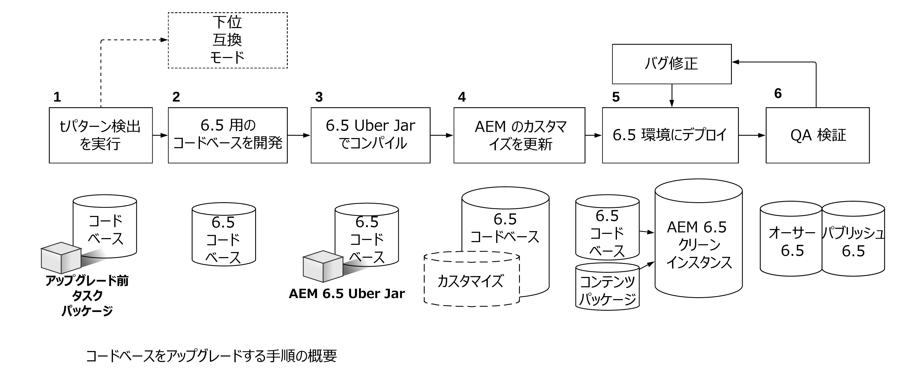

# コードのアップグレードとカスタマイズ{#upgrading-code-and-customizations}

アップグレードを計画するときは、実装の次の領域を調査して対処する必要があります。

* [コードベースのアップグレード](#upgrade-code-base)
* [6.5 のリポジトリ構造への準拠](#align-repository-structure)
* [AEM のカスタマイズ](#aem-customizations)
* [手順のテスト](#testing-procedure)

## 概要 {#overview}

1. **パターン検出** - アップグレード計画や詳しく[このページ](/help/sites-deploying/pattern-detector.md)で説明しているように、パターン検出を実行すると、対処する必要がある領域や、Target バージョンの AEM で利用できない API やバンドルについての詳細を含むパターン検出レポートを取得できます。パターン検出レポートには、コードで互換性のない箇所が示されます。互換性のない箇所がない場合、デプロイされているコードは既に 6.5 と互換性があります。互換性を維持するためだけの開発作業は必要なく、6.5 の機能を利用するための新規開発を行うことができます。互換性のない箇所が見つかった場合は、a）互換モードで実行して新規の 6.5 機能または互換性維持のための開発を先送りにするか、b）アップグレード後に開発作業を行うことを決め、手順 2 に進みます。詳しくは、[AEM 6.5 における後方互換性](/help/sites-deploying/backward-compatibility.md)を参照してください。

1. **6.5 のコードベースの開発** - Target バージョンのコードベース専用のブランチまたはリポジトリを作成します。アップグレード前の互換性の情報を使用して、更新するコードの領域を計画します。
1. **6.5 Uber Jar でのコンパイル** - 6.5 Uber Jar を指すようにコードベース POM を更新し、これに対してコードをコンパイルします。
1. **AEM カスタマイズの更新*** - *AEM のカスタマイズまたは拡張を更新して、6.5 で機能することを検証し、6.5 コードベースに追加する必要があります。UI 検索フォーム、Assets のカスタマイズ、/mnt/overlay を使用するすべてのものを含みます。

1. **6.5 環境へのデプロイ** - AEM 6.5 のクリーンなインスタンス（オーサー + パブリッシュ）を開発環境と QA 環境で立ち上げる必要があります。更新したコードベースと、現在の実稼動環境にある代表的なコンテンツのサンプルをデプロイする必要があります。
1. **QA 検証とバグ修正** - QA では、6.5 のオーサーインスタンスとパブリッシュインスタンスの両方でアプリケーションを検証する必要があります。検出されたすべてのバグを修正して、6.5 コードベースにコミットする必要があります。すべてのバグが修正されるまで、必要に応じて開発サイクルを繰り返します。

アップグレードに進む前に、アプリケーションコードベースを AEM のターゲットバージョンに対して十分テストし、安定したものにしておく必要があります。テストで得られた見解に基づいて、様々な方法でカスタムコードを最適化できます。リポジトリの走査を回避するためのコードのリファクタリング、検索を最適化するカスタムインデックス作成、JCR での順序なしノードの使用などが含まれます。

コードベースのアップグレードや、新しい AEM バージョンに合わせたカスタマイズをおこなうオプションに加えて、6.5 では[このページ](/help/sites-deploying/backward-compatibility.md)で説明する後方互換性機能を使用して、より効率的にカスタマイズの管理をおこなえます。

上記の説明および下の図に示したように、最初の手順で[パターン検出](/help/sites-deploying/pattern-detector.md)を実行することで、アップグレードの全体的な複雑性を評価し、互換モードで実行するか、すべての新しい AEM 6.5 の機能を使用するようにカスタマイズを更新するかを決定できます。詳しくは、[AEM 6.5 における後方互換性](/help/sites-deploying/backward-compatibility.md)のページを参照してください。
[ ](assets/upgrade-code-base-highlevel.png)

## コードベースのアップグレード {#upgrade-code-base}

### バージョン管理での 6.5 コード専用のブランチの作成 {#create-a-dedicated-branch-for-6.5-code-in-version-control}

AEM 実装に必要なすべてのコードおよび設定は、何らかの形式のバージョン管理を使用して管理する必要があります。AEM のターゲットバージョンのコードベースに必要な変更を管理するために、バージョン管理に専用ブランチを作成する必要があります。AEM のターゲットバージョンに対するコードベースの繰り返しテストとその後のバグ修正は、このブランチで管理されます。

### AEM Uber Jar バージョンの更新 {#update-the-aem-uber-jar-version}

AEM Uber Jar では、すべての AEM API を単一の依存関係として Maven プロジェクトの `pom.xml` に含めます。個々の AEM API の依存関係を含めるのではなく、Uber Jar を単一の依存関係として含めることが常にベストプラクティスです。コードベースをアップグレードするときは、AEM のターゲットバージョンを指すように Uber Jar のバージョンを変更する必要があります。Uber Jar が存在する以前の AEM のバージョンで開発されたプロジェクトについては、個々の AEM API のすべての依存関係を削除して、AEM のターゲットバージョン用の単一の Uber Jar を含めることで置き換える必要があります。さらに、Uber Jar の新しいバージョンに対してコードベースを再コンパイルする必要があります。廃止された API またはメソッドは、AEM のターゲットバージョンとの互換性を確保するためにアップデートする必要があります。

```
<dependency>
    <groupId>com.adobe.aem</groupId>
    <artifactId>uber-jar</artifactId>
    <version>6.5.0</version>
    <classifier>apis</classifier>
    <scope>provided</scope>
</dependency>
```

### 管理リソースリゾルバの使用の段階的廃止 {#phase-out-use-of-administrative-resource-resolver}

`SlingRepository.loginAdministrative()` と `ResourceResolverFactory.getAdministrativeResourceResolver()` を介して管理セッションを使用することは、AEM 6.0 より前のコードベースでは一般的でした。これらのメソッドは過度に幅広いレベルのアクセスを提供するので、セキュリティ上の理由から廃止されました。[Sling の今後のバージョンで、これらのメソッドは削除されます](https://sling.apache.org/documentation/the-sling-engine/service-authentication.html#deprecation-of-administrative-authentication)。代わりにサービスユーザーを使用するようにコードをリファクタリングすることを強くお勧めします。サービスユーザー、および[管理セッションを段階的に廃止する方法について詳しくは、こちらを参照してください](/help/sites-administering/security-service-users.md#how-to-phase-out=admin-sessions)。

### クエリと Oak インデックス {#queries-and-oak-indexes}

コードベースでクエリを使用する場合は、コードベースのアップグレードの一環として詳細にテストする必要があります。Jackrabbit 2（6.0 より古い AEM のバージョン）からアップグレードするユーザーの場合、Oak では、コンテンツのインデックスが自動的に作成されず、カスタムインデックスを作成する必要があるので、このことは特に重要になります。AEM 6.x バージョンからアップグレードすると、デフォルトの Oak インデックス定義が変更され、既存のクエリに影響を与える可能性があります。

クエリパフォーマンスを分析および調査するためのツールが複数用意されています。

* [AEM インデックスツール](/help/sites-deploying/queries-and-indexing.md)

* [運用診断ツール - クエリパフォーマンス](/help/sites-administering/operations-dashboard.md#diagnosis-tools)

* [Oak ユーティリティ](https://oakutils.appspot.com/)。これは、アドビによって管理されないオープンソースツールです。

### クラシック UI オーサリング {#classic-ui-authoring}

AEM 6.5 でも引き続きクラシック UI オーサリングを利用できますが、この機能は廃止される予定です。詳しくは、[こちら](/help/release-notes/deprecated-removed-features.md#pre-announcement-for-next-release)を参照してください。アプリケーションが現在クラシック UI オーサー環境で実行されている場合は、AEM 6.5 にアップグレードして、クラシック UI を引き続き使用することをお勧めします。タッチ UI への移行は、複数の開発サイクルをおこなう個別プロジェクトとして計画できます。AEM 6.5 でクラシック UI を使用するには、複数の OSGi 設定をコードベースにコミットする必要があります。この設定方法について詳しくは、[こちら](/help/sites-administering/enable-classic-ui.md)を参照してください。

## 6.5 のリポジトリ構造との整合 {#align-repository-structure}

アップグレードを容易にし、アップグレード中に設定が上書きされることを防ぐため、6.4 ではリポジトリの構造が見直され、コンテンツと設定が分離されました。

そのため、これまでのように `/etc` に存在しないように、いくつかの設定を移動する必要があります。AEM 6.4 に更新する際に確認および対応が必要になる、リポジトリの再構築に関する一連の注意事項については、[AEM 6.4 におけるリポジトリの再構築](/help/sites-deploying/repository-restructuring.md)を参照してください。

## AEM のカスタマイズ  {#aem-customizations}

ソースバージョンの AEM の AEM オーサリング環境に対するすべてのカスタマイズは、識別する必要があります。識別した後は、各カスタマイズをバージョン管理に保存するか、少なくともコンテンツパッケージの一部としてバックアップすることをお勧めします。すべてのカスタマイズは、実稼動環境でアップグレードする前に、Target バージョンの AEM を実行している QA 環境またはステージング環境にデプロイして、検証する必要があります。

### 一般的なオーバーレイ {#overlays-in-general}

AEM の標準の機能を拡張する場合は、/libs の下のノードやファイルを /apps の下の追加ノードでオーバーレイすることが一般的です。これらのオーバーレイは、バージョン管理で追跡し、AEM のターゲットバージョンに対してテストする必要があります。ファイル（JS、JSP、HTL）をオーバーレイする場合は、AEM のターゲットバージョンでより簡単に回帰テストを実行できるように、拡張した機能に関するコメントを残しておくことをお勧めします。一般的なオーバーレイについて詳しくは、[こちら](/help/sites-developing/overlays.md)を参照してください。特定の AEM のオーバーレイの説明については、以下を参照してください。

### カスタム検索フォームのアップグレード {#upgrading-custom-search-forms}

カスタム検索フォームを正しく機能させるには、アップグレード後に手動での変更が必要です。詳しくは、[カスタム検索フォームのアップグレード](/help/sites-deploying/upgrading-custom-search-forms.md)を参照してください。

### アセット UI のカスタマイズ {#assets-ui-customizations}

>[!NOTE]
>
>この手順は、AEM 6.2 よりも前のバージョンからのアップグレードにのみ必要です。

カスタマイズされたアセットデプロイメントを含んでいるインスタンスを、アップグレード用に準備する必要があります。これは、カスタマイズされたすべてのコンテンツに 6.4 の新しいノード構造との互換性を持たせるために必要な作業です。

Assets UI のカスタマイズを準備するには、次の手順を実行します。

1. アップグレードする必要があるインスタンス上で、*https://server:port/crx/de/index.jsp* に移動して CRXDE Lite を開きます。

1. 次のノードに移動します。

   * `/apps/dam/content`

1. content ノードの名前を **content_backup** に変更します。画面の左側にあるエクスプローラーパネルを右クリックして、「**名前を変更**」を選択すると変更できます。

1. ノードの名前を変更したら、**content** という名前の新しいノードを `/apps/dam` の下に作成し、ノードタイプを **sling:Folder** に設定します。

1. **content_backup** のすべての子ノードを、新しく作成した content ノードに移動します。そのためには、エクスプローラーパネルで個々の子ノードを右クリックし、「**移動**」を選択します。

1. **content_backup** ノードを削除します。

1. `/apps/dam` の下にある、正しいノードタイプ `sling:Folder` で更新されたノードは、理想的にはバージョン管理に保存してコードベースでデプロイするか、少なくともコンテンツパッケージとしてバックアップする必要があります。

### 既存アセットのアセット ID の生成 {#generating-asset-ids-for-existing-assets}

既存のアセットのアセット ID を生成するには、AEM 6.5 を実行するように AEM インスタンスをアップグレードする際にアセットをアップグレードします。これは、[アセットインサイト機能](/help/assets/asset-insights.md)を有効にするために必要な手順です。詳しくは、[埋め込みコードの追加](/help/assets/use-page-tracker.md#add-embed-code)を参照してください。

アセットをアップグレードするには、JMX コンソールで Associate Asset IDs パッケージを設定します。リポジトリ内のアセットの数によっては、`migrateAllAssets` に長い時間がかかることがあります。TarMK に 125,000 のアセットがある場合は、内部テストに約 1 時間かかります。


アセット全体のサブセットに対してアセット ID が必要な場合は、`migrateAssetsAtPath` API を使用します。

その他すべての目的には、`migrateAllAssets()` API を使用してください。

### InDesign スクリプトのカスタマイズ {#indesign-script-customizations}

Adobe では、カスタムスクリプトを `/apps/settings/dam/indesign/scripts` に配置することを推奨しています。InDesign スクリプトのカスタマイズについて詳しくは、[こちら](/help/assets/indesign.md#configuring-the-aem-assets-workflow)を参照してください。

### ContextHub 設定の復元 {#recovering-contexthub-configurations}

ContextHub 設定は、アップグレードの影響を受けます。既存の ContextHub 設定の復元方法については、[こちら](/help/sites-developing/ch-configuring.md#recovering-contexthub-configurations-after-upgrading)を参照してください。

### ワークフローのカスタマイズ {#workflow-customizations}

必要な機能を追加したり、必要のない機能を削除したりするには、標準のワークフローを更新または変更することが一般的な方法です。カスタマイズ対象として一般的なワークフローは、[!UICONTROL DAM アセットの更新]ワークフローです。カスタム実装に必要なすべてのワークフローは、アップグレード中に上書きされる可能性があるので、バックアップしてバージョン管理に保存する必要があります。

### 編集可能なテンプレート {#editable-templates}

>[!NOTE]
>
>この手順は、AEM 6.2 から編集可能テンプレートを使用して Sites をアップグレードする場合にのみ必要になります。

AEM 6.2 と 6.3 では、編集可能なテンプレートの構造が異なります。6.2 以前からアップグレードする場合で、編集可能なテンプレートを使用してサイトコンテンツを作成している場合は、[レスポンシブノードのクリーンアップツール](https://github.com/Adobe-Marketing-Cloud/aem-sites-template-migration)を使用する必要があります。このツールは、アップグレード&#x200B;**後**&#x200B;に実行して、コンテンツをクリーンアップすることを目的としています。このツールは、オーサー層とパブリッシュ層の両方に対して実行する必要があります。

### CUG 実装の変更 {#cug-implementation-changes}

AEM の以前のバージョンのパフォーマンスおよびスケーラビリティの制限に対処するために、閉じられたユーザーグループの実装が大幅に変更されました。CUG の以前のバージョンは 6.3 で廃止され、新しい実装はタッチ UI でのみサポートされます。6.2 以前からアップグレードする場合の新しい CUG の実装への移行方法については、[こちら](/help/sites-administering/closed-user-groups.md#upgradetoaem63)の説明を参照してください。

## 手順のテスト {#testing-procedure}

アップグレードをテストするための包括的なテスト計画を準備する必要があります。アップグレードされたコードベースおよびアプリケーションのテストは、最初に下位レベルの環境で実行する必要があります。コードベースが安定するまで、検出されたすべてのバグを繰り返し修正します。より上位レベルの環境は、その後にアップグレードする必要があります。

### アップグレード手順のテスト {#testing-the-upgrade-procedure}

ここで説明されているアップグレード手順は、カスタマイズしたランブックに記載されているとおりに開発環境および QA 環境でテストする必要があります（[アップグレードの計画](/help/sites-deploying/upgrade-planning.md)を参照してください）。アップグレード手順は、すべてのステップがアップグレードランブックに記載され、アップグレードプロセスが問題なく実行されるようになるまで繰り返す必要があります。

### テスト領域の実装  {#implementation-test-areas-}

環境がアップグレードされ、アップグレードされたコードベースがデプロイされた後のテスト計画でカバーする必要がある AEM 実装の重要な領域を次に示します。

<table>
 <tbody>
  <tr>
   <td><strong>機能テスト領域</strong></td>
   <td><strong>説明</strong></td>
  </tr>
  <tr>
   <td>公開されたサイト</td>
   <td>AEM 実装および関連するコードを<br /> Dispatcher を介してパブリッシュ層でテストします。ページの更新および<br />キャッシュの無効化についての基準を含める必要があります。</td>
  </tr>
  <tr>
   <td>オーサリング</td>
   <td>AEM 実装と関連するコードをオーサー層でテストします。ページ、コンポーネントオーサリングおよびダイアログを含める必要があります。</td>
  </tr>
  <tr>
   <td>Marketing Cloud ソリューションとの統合</td>
   <td>Analytics、DTM、Target などの製品との統合を検証します。</td>
  </tr>
  <tr>
   <td>サードパーティシステムとの統合</td>
   <td>サードパーティとの統合は、オーサー層とパブリッシュ層の両方で検証する必要があります。</td>
  </tr>
  <tr>
   <td>認証、セキュリティおよび権限</td>
   <td>LDAP ／ SAML などの認証メカニズムを検証する必要があります。<br /> 権限およびグループは、オーサー層とパブリッシュ<br />層の両方でテストする必要があります。</td>
  </tr>
  <tr>
   <td>クエリ</td>
   <td>カスタムインデックスおよびクエリは、クエリパフォーマンスと共にテストする必要があります。</td>
  </tr>
  <tr>
   <td>UI のカスタマイズ</td>
   <td>オーサー環境での AEM UI の拡張またはカスタマイズ。</td>
  </tr>
  <tr>
   <td>ワークフロー</td>
   <td>カスタムまたは標準のワークフローおよび機能。</td>
  </tr>
  <tr>
   <td>パフォーマンステスト</td>
   <td>実際のシナリオをシミュレートするオーサー層とパブリッシュ層の両方で負荷テストを実行する必要があります。</td>
  </tr>
 </tbody>
</table>

### テスト計画の作成および結果 {#document-test-plan-and-results}

前述の実装テスト領域をカバーするテスト計画を作成する必要があります。多くの場合、テスト計画をオーサーのタスクリストとパブリッシュのタスクリストに分けることをお勧めします。このテスト計画は、実稼動環境をアップグレードする前に、開発環境、QA 環境およびステージング環境で実行する必要があります。ステージング環境および実稼動環境をアップグレードするときに比較できるように、下位レベルの環境でテスト結果およびパフォーマンス指標を取得する必要があります。
