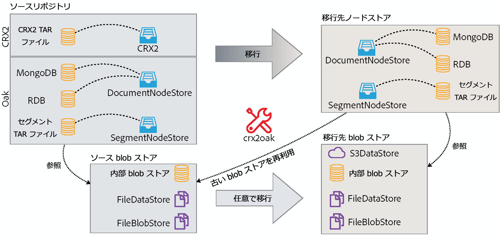
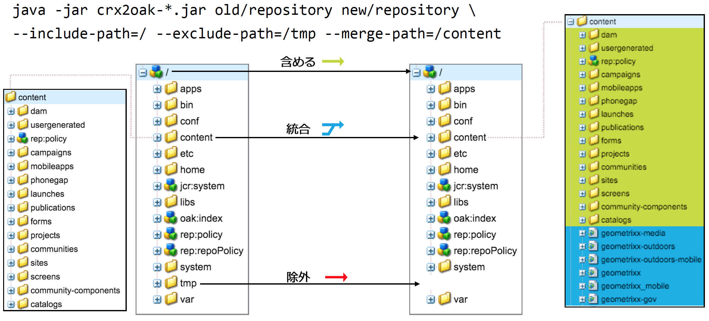
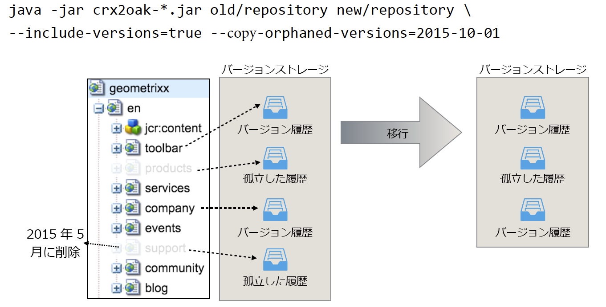

# CRX2Oak 移行ツールの使用{#using-the-crx-oak-migration-tool}

## 概要 {#introduction}

CRX2Oak は、異なるリポジトリ間でデータを移行するために設計されたツールです。

このツールを使用して、Apache Jackrabbit 2 をベースとする以前の CQ バージョンから Oak にデータを移行したり、Oak リポジトリ間でデータをコピーしたりできます。

最新バージョンの crx2oak は、次の場所で公開されているアドビリポジトリからダウンロードできます。[ https://repo.adobe.com/nexus/content/groups/public/com/adobe/granite/crx2oak/](https://repo.adobe.com/nexus/content/groups/public/com/adobe/granite/crx2oak/)

最新バージョンの変更点と修正点の一覧は、[CRX2Oak のリリースノート](https://docs.adobe.com/content/help/en/experience-manager-64/release-notes/crx2oak.html)にあります。

>[!NOTE]
>
>Apache Oak と AEM の永続性の主要な概念について詳しくは、[AEM プラットフォームの紹介](/help/sites-deploying/platform.md)を参照してください。

## 移行のユースケース {#migration-use-cases}

このツールでは以下のことが可能です。

* 以前の CQ 5 バージョンから AEM 6 への移行
* 複数の Oak リポジトリ間でのデータのコピー
* 異なる Oak マイクロカーネル実装間でのデータの変換

外部の BLOB ストア（一般的にはデータストアとして知られる）を使用したリポジトリ移行のサポートは、様々な組み合わせで提供されています。考えられる移行パスの 1 つは、外部 `FileDataStore` を使用する CRX2 リポジトリから `S3DataStore` を使用する Oak リポジトリへの移行です。

下の図は、CRX2Oak がサポートしているすべての移行の組み合わせを示したものです。



## 特長 {#features}

CRX2Oak は AEM のアップグレード中に呼び出され、このとき、永続性モードの再設定を自動化する事前定義済みの移行プロファイルをユーザーが指定できます。これはクイックスタートモードと呼ばれます。

より詳細なカスタマイズが必要な場合は、CRX2Oak を個別に実行することもできます。ただし、このモードでは、変更はリポジトリに対してのみ加えられるので、その他の AEM の再設定は手動で実行する必要があります。これはスタンドアロンモードと呼ばれます。

また、スタンドアロンモードのデフォルト設定では、ノードストアのみが移行され、新しいリポジトリは古いバイナリストレージを再使用することにも注意してください。

### 自動クイックスタートモード {#automated-quickstart-mode}

AEM 6.3 以降、CRX2Oak はユーザー定義の移行プロファイルを処理できるようになりました。このプロファイルには、既に使用可能なすべての移行オプションを設定できます。これにより、柔軟性が向上すると同時に、AEM の設定を自動化できます。スタンドアロンモードでこのツールを使用している場合は、このような機能は使用できません。

CRX2Oak をクイックスタートモードに切り替えるには、次のオペレーティングシステム環境変数を使用して、AEM インストールディレクトリの crx-quickstart フォルダーへのパスを定義する必要があります。

**UNIX ベースのシステムおよび Mac OS の場合**

```shell
export SLING_HOME="/path/to/crx-quickstart"
```

**Windows の場合**

```shell
SET "SLING_HOME=/path/to/crx-quickstart"
```

#### サポートの再開 {#resume-support}

移行はいつでも中断でき、後で再開することができます。

#### カスタマイズ可能なアップグレードロジック {#customizable-upgrade-logic}

Custom Java logic cand also be implemented using `CommitHooks`. カスタム `RepositoryInitializer` クラスを実装して、カスタム値でリポジトリを初期化できます。

#### メモリマップ操作のサポート {#support-for-memory-mapped-operations}

CRX2Oak はデフォルトで、メモリマップ操作もサポートしています。メモリマップはパフォーマンスを大幅に向上させるので、可能な場合は常に使用する必要があります。

>[!CAUTION]
>
>ただし、メモリマップ操作は Windows プラットフォームではサポートされないことに注意してください。Therefore, it is recommended to add the **--disable-mmap** parameter when performing the migration on Windows.

#### コンテンツの選択的移行 {#selective-migration-of-content}

By default, the tool migrates the whole repository under the `"/"` path. しかし、どのコンテンツを移行するかは完全に制御できます。

If there is any part of the content that is not required on the new instance, you can use the `--exclude-path` parameter to exclude the content and optimize the upgrade procedure.

#### パスの結合 {#path-merging}

If data needs to be copied between two repositories and you have a content path that is different on both instances, you can define it in the `--merge-path` parameter. 定義すると、CRX2Oak は新しいノードのみをコピー先リポジトリにコピーし、古いノードは元の場所に保持します。



#### バージョンのサポート {#version-support}

デフォルトでは、AEM は変更されたノードまたはページごとにバージョンを作成し、リポジトリ内に保存します。これらのバージョンを使用して、ページを以前の状態に復元できます。

ただし、元のページが削除されても、これらのバージョンはパージされません。長時間使用されているリポジトリを扱う場合は、孤立したバージョンによって生じた多数の冗長なデータを移行で処理しなければならないことがあります。

A useful feature for these types of situations is the addition of the `--copy-versions` parameter. リポジトリの移行またはコピーの際にバージョンノードをスキップする場合に使用します。

You can also choose whether to copy orphaned versions by adding `--copy-orphaned-versions=true`.

特定の日付までのバージョンをコピーする場合、どちらのパラメーターも日付形式 `YYYY-MM-DD` をサポートしています。



#### オープンソース版 {#open-source-version}

オープンソース版の CRX2Oak は、oak-upgrade の形で入手できます。このツールは、次の機能を除くすべての機能をサポートしています。

* CRX2 サポート
* 移行プロファイルのサポート
* 自動 AEM 再設定のサポート

詳しくは、[Apache に関するドキュメント](https://jackrabbit.apache.org/oak/docs/migration.html)を参照してください。

## パラメーター {#parameters}

### ノードストアオプション {#node-store-options}

* `--cache`:キャッシュサイズ（MB単位）(デフォルト `256`)

* `--mmap`:セグメントストアのメモリマップファイルアクセスの有効化
* `--src-password:` ソースRDBデータベースのパスワード

* `--src-user:` ソースRDBのユーザー

* `--user`:ターゲットRDBのユーザー

* `--password`:ターゲットRDBのパスワード。

### 移行オプション {#migration-options}

* `--early-shutdown`:ノードのコピー後、およびコミットフックの適用前に、ソースJCR2リポジトリをシャットダウンします。
* `--fail-on-error`:ノードをソースリポジトリから読み取れない場合に、移行の失敗を強制します。
* `--ldap`:LDAPユーザーをCQ 5.xインスタンスからOakベースのインスタンスに移行します。 この機能を有効にするには、Oak 設定内の ID プロバイダーを ldap という名前にする必要があります。詳しくは、[LDAP に関するドキュメント](/help/sites-administering/ldap-config.md)を参照してください。

* `--ldap-config:` これは、認証に複数のLDAPサーバーを使用したCQ 5.xリポジトリの `--ldap` パラメーターと組み合わせて使用します。 You can use it to point to the CQ 5.x `ldap_login.conf` or `jaas.conf` configuration files. 形式はで `--ldapconfig=path/to/ldap_login.conf`す。

### バージョンストアオプション {#version-store-options}

* `--copy-orphaned-versions`:孤立したバージョンをコピーするのをスキップします。 Parameters supported are: `true`, `false` and `yyyy-mm-dd`. Defaults to `true`.

* `--copy-versions:` バージョンストレージをコピーします。 パラメーター: `true`, `false`, `yyyy-mm-dd`. Defaults to `true`.

#### パスオプション {#path-options}

* `--include-paths:` コピー時に含めるパスのコンマ区切りリスト
* `--merge-paths`:コピー中に結合するパスのコンマ区切りリスト
* `--exclude-paths:` コピー時に除外するパスのコンマ区切りリスト。

### コピー元 BLOB ストアオプション {#source-blob-store-options}

* `--src-datastore:` ソースとして使用するデータストアディレクトリ `FileDataStore`

* `--src-fileblobstore`:ソースとして使用するデータストアディレクトリ `FileBlobStore`

* `--src-s3datastore`:ソースに使用するデータストアディレクトリ `S3DataStore`

* `--src-s3config`:ソースの設定ファイル `S3DataStore`。

### コピー先 BLOB ストアオプション {#destination-blobstore-options}

* `--datastore:` ターゲットとして使用するデータストアディレクトリ `FileDataStore`

* `--fileblobstore:` ターゲットとして使用するデータストアディレクトリ `FileBlobStore`

* `--s3datastore`:ターゲットに使用するデータストアディレクトリ `S3DataStore`

* `--s3config`:ターゲットの設定ファイル `S3DataStore`。

### ヘルプオプション {#help-options}

* `-?, -h, --help:` ヘルプ情報を表示します。

## デバッグ {#debugging}

処理中に発生する可能性があるすべての問題をトラブルシューティングするために、移行プロセス用のデバッグ情報を有効にすることもできます。有効にする方法は、ツールを実行するモードによって異なります。

<table>
 <tbody>
  <tr>
   <td><strong>CRX2Oak モード</strong></td>
   <td><strong>アクション</strong></td>
  </tr>
  <tr>
   <td>クイックスタートモード</td>
   <td>You can add the <strong>--log-level TRACE</strong> or <strong>--log-level DEBUG </strong>options to the command line when running CRX2Oak. In this mode logs are automatically redirected to the <strong>upgrade.log file</strong>.</td>
  </tr>
  <tr>
   <td>スタンドアロンモード</td>
   <td><p>Add the <strong>--trace</strong> options to the CRX2Oak command line to show TRACE events on standard output (you need to redirect logs yourself using redirection character: '&gt;' or 'tee' command for later inspection).</p> </td>
  </tr>
 </tbody>
</table>

## その他の注意点 {#other-considerations}

MongoDB 複製セットに移行する場合は、Mongo データベースへのすべての接続で、`WriteConcern` パラメーターを `2` に設定します。

次のように、接続文字列の末尾に `w=2` パラメーターを付加することによって設定できます。

```xml
java -Xmx4092m -XX:MaxPermSize=1024m -jar crx2oak.jar crx-quickstart/repository/ mongodb://localhost:27017/aem-author?replicaset=replica1&w=2
```

>[!NOTE]
>
>詳しくは、MongoDB の接続文字列に関するドキュメントで[書き込み確認](https://docs.mongodb.org/manual/reference/connection-string/#write-concern-options)について参照してください。

