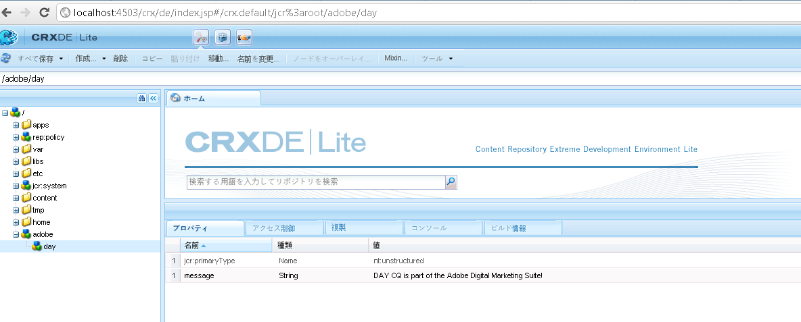

# AEM JCR へのプログラムからのアクセス方法{#how-to-programmatically-access-the-aem-jcr}

Adobe Marketing Cloud に搭載されている Adobe CQ リポジトリ内にあるノードとプロパティを、プログラムから変更できます。CQ リポジトリにアクセスするには、Java Content Repository（JCR）API を使用します。Java JCR API を使用すれば、Adobe CQ リポジトリ内にあるコンテンツに対して、作成、置換、更新および削除（CRUD）の操作を実行できます。For more information about the Java JCR API, see [https://jackrabbit.apache.org/jcr/jcr-api.html](https://jackrabbit.apache.org/jcr/jcr-api.html).

>[!NOTE]
>
>この開発向けの記事では、外部 Java アプリケーションから Adobe CQ JCR を変更します。これに対して、OSGi バンドル内から JCR API を使用して JCR を変更することもできます。For details, see [Persisting CQ data in the Java Content Repository](https://helpx.adobe.com/experience-manager/using/persisting-cq-data-java-content1.html).

>[!NOTE]
>
>To use the JCR API, add the `jackrabbit-standalone-2.4.0.jar` file to your Java application’s class path. You can obtain this JAR file from the Java JCR API web page at [https://jackrabbit.apache.org/jcr/jcr-api.html](https://jackrabbit.apache.org/jcr/jcr-api.html).

>[!NOTE]
>
>JCR Query API を使用して Adobe CQ JCR へのクエリーを実行する方法については、[JCR API を使用した Adobe Experience Manager データのクエリー](https://helpx.adobe.com/experience-manager/using/querying-experience-manager-data-using1.html)を参照してください。

## Repository インスタンスの作成 {#create-a-repository-instance}

リポジトリに接続して接続を確立するには様々な方法がありますが、この開発向け記事では、`org.apache.jackrabbit.commons.JcrUtils` クラスに属する静的メソッドを使用します。このメソッドの名前は `getRepository` です。このメソッドは、Adobe CQ サーバーの URL を表す文字列パラメーターを受け取ります。例えば、`http://localhost:4503/crx/server` のように指定します。

`getRepository`   メソッドは、`Repository`   インスタンスを返します。次に、このコード例に示します。

```java
//Create a connection to the AEM JCR repository running on local host
Repository repository = JcrUtils.getRepository("http://localhost:4503/crx/server");
```

## Session インスタンスの作成 {#create-a-session-instance}

この `Repository`インスタンスは、CRXリポジトリを表します。 この `Repository`インスタンスを使用して、リポジトリとのセッションを確立します。 セッションを作成するには、 `Repository`インスタンスの `login`メソッドを呼び出し、 `javax.jcr.SimpleCredentials` オブジェクトを渡します。 この `login`メソッドは、インスタンスを返し `javax.jcr.Session` ます。

You create a `SimpleCredentials`object by using its constructor and passing the following string values:

* ユーザー名
* 対応するパスワード

2番目のパラメーターを渡す場合は、Stringオブジェクトの `toCharArray`メソッドを呼び出します。 次のコードは、を返す `login`メソッドを呼び出す方法を示してい `javax.jcr.Sessioninstance`ます。

```java
//Create a Session instance
javax.jcr.Session session = repository.login( new SimpleCredentials("admin", "admin".toCharArray()));
```

## Node インスタンスの作成 {#create-a-node-instance}

インスタンスを使用して `Session`インスタンスを作成し `javax.jcr.Node` ます。 イン `Node`スタンスを使用して、ノード操作を実行できます。 例えば、新しいノードを作成できます。 ルートノードを表すノードを作成するには、次のコード行に示すように、 `Session`インスタンスの `getRootNode` メソッドを呼び出します。

```java
//Create a Node
Node root = session.getRootNode();
```

インスタンスを作成したら、別の `Node`ノードを作成し、そのノードに値を追加するなどのタスクを実行できます。 例えば、次のコードは2つのノードを作成し、2番目のノードに値を追加します。

```java
// Store content
Node day = adobe.addNode("day");
day.setProperty("message", "Adobe CQ is part of the Adobe Digital Marketing Suite!");
```

## ノードの値の取得 {#retrieve-node-values}

ノードとその値を取得するには、 `Node`インスタンスの `getNode`メソッドを呼び出し、ノードへの完全修飾パスを表す文字列値を渡します。 前のコードの例で作成したノード構造を考えてみましょう。 dayノードを取得するには、次のコードに示すように、adobe/dayを指定します。

```java
// Retrieve content
Node node = root.getNode("adobe/day");
System.out.println(node.getPath());
System.out.println(node.getProperty("message").getString());
```

## Adobe CQ リポジトリ内でのノードの作成 {#create-nodes-in-the-adobe-cq-repository}

次のJavaコードの例は、Adobe CQに接続し、 `Session`インスタンスを作成して新しいノードを追加するJavaクラスを表しています。 ノードにデータ値が割り当てられ、ノードの値とパスがコンソールに書き出されます。 セッションが終了したら、必ずログアウトします。

```java
/*
 * This Java Quick Start uses the jackrabbit-standalone-2.4.0.jar
 * file. See the previous section for the location of this JAR file
 */

import javax.jcr.Repository;
import javax.jcr.Session;
import javax.jcr.SimpleCredentials;
import javax.jcr.Node;

import org.apache.jackrabbit.commons.JcrUtils;
import org.apache.jackrabbit.core.TransientRepository;

public class GetRepository {

public static void main(String[] args) throws Exception {

try {

    //Create a connection to the CQ repository running on local host
    Repository repository = JcrUtils.getRepository("http://localhost:4503/crx/server");

   //Create a Session
   javax.jcr.Session session = repository.login( new SimpleCredentials("admin", "admin".toCharArray()));

  //Create a node that represents the root node
  Node root = session.getRootNode();

  // Store content
  Node adobe = root.addNode("adobe");
  Node day = adobe.addNode("day");
  day.setProperty("message", "Adobe CQ is part of the Adobe Digital Marketing Suite!");

  // Retrieve content
  Node node = root.getNode("adobe/day");
  System.out.println(node.getPath());
  System.out.println(node.getProperty("message").getString());

  // Save the session changes and log out
  session.save();
  session.logout();
  }
 catch(Exception e){
  e.printStackTrace();
  }
 }
}
```

After you run the full code example and create the nodes, you can view the new nodes in the **[!UICONTROL CRXDE Lite]**, as shown in the following illustration.



