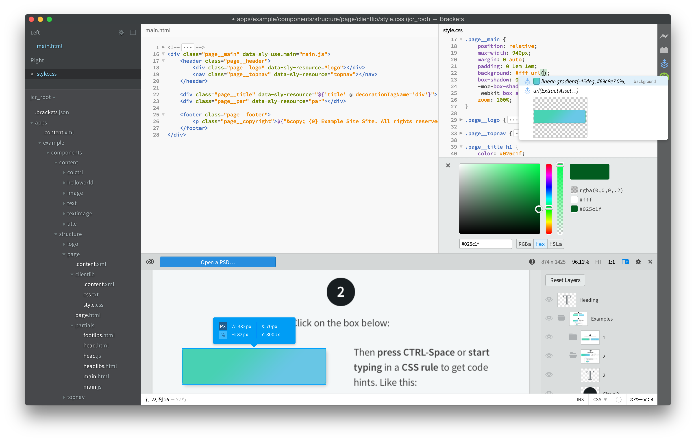
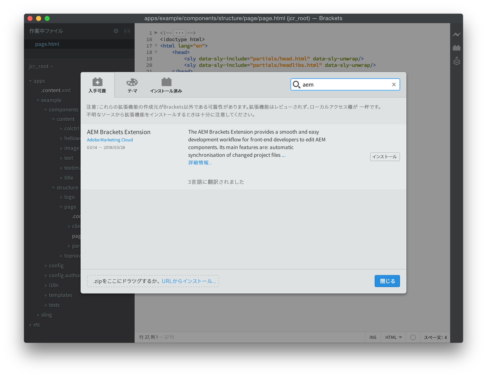
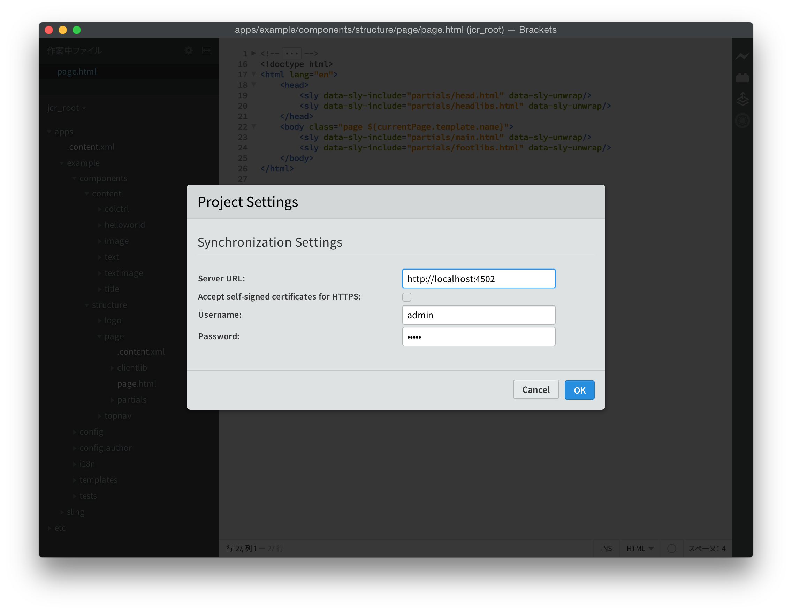
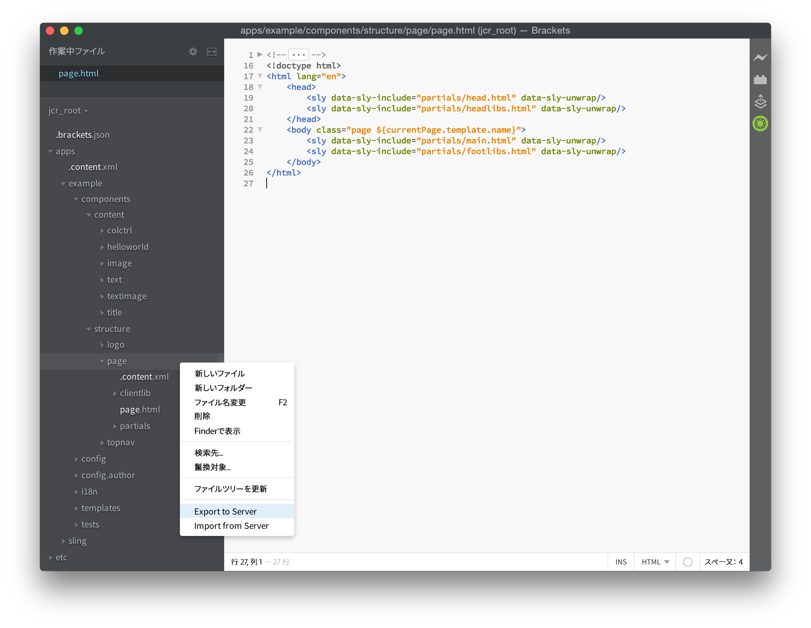
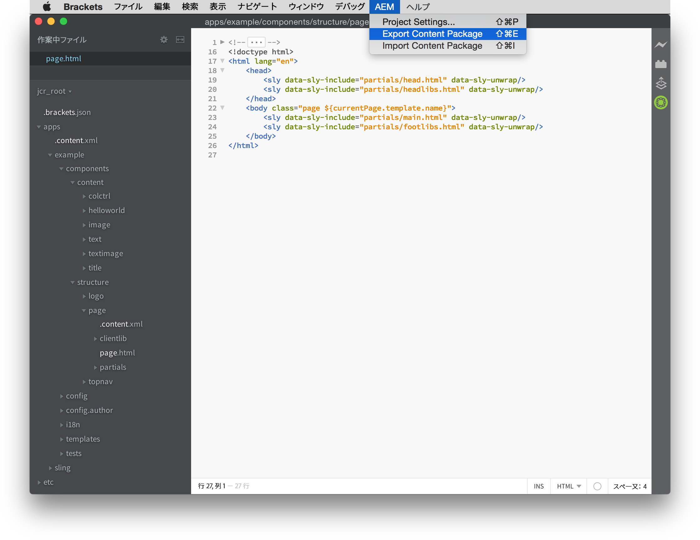
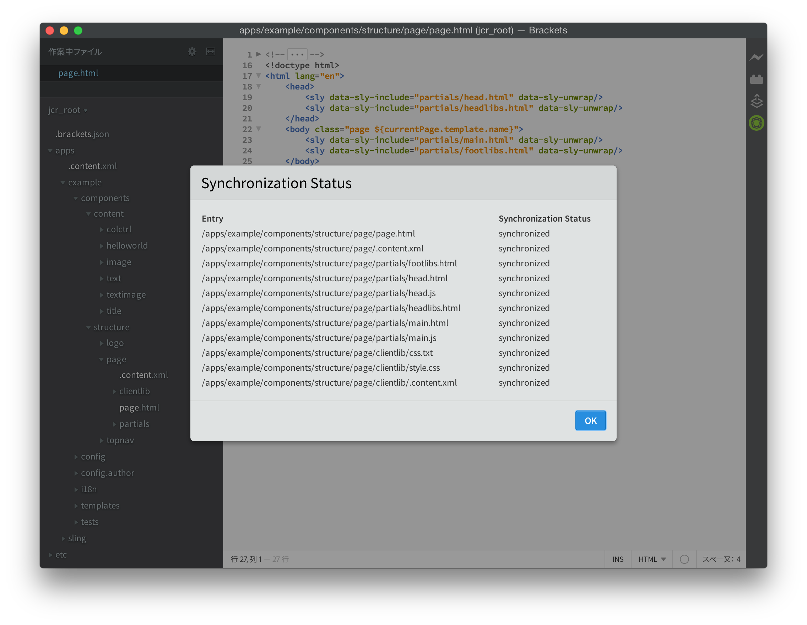

# AEM Brackets Extension{#aem-brackets-extension}

## 概要 {#overview}

AEM Brackets Extension は、AEM コンポーネントとクライアントライブラリを編集するためのスムーズなワークフローを提供し、[Brackets](https://brackets.io/) コードエディターのパワーを活用して、コードエディター内から Photoshop ファイルおよびレイヤーにアクセスできるようにします。この拡張機能によって（Maven や File Vault は不要です）同期が容易になるので、開発者の効率性が向上すると共に、AEM に関する知識が限られているフロントエンド開発者もプロジェクトに参加できます。この拡張機能は、[HTML Template Language (HTL)](https://docs.adobe.com/content/help/ja-JP/experience-manager-htl/using/overview.html)もサポートします。これにより、コンポーネントの開発を容易にし、より安全にするためにJSPの複雑さが解消されます。

### 特長 {#features}

AEM Brackets Extension の主な機能には次のものがあります。

* 変更されたファイルをAEM開発インスタンスに自動で同期します。
* ファイルとフォルダーの手動の双方向同期。
* プロジェクトの完全なコンテンツパッケージの同期。
* 式および`data-sly-*`ブロック文のHTLコード補完

さらに、Brackets には AEM フロントエンド開発者の役に立つ機能が数多く付属しています。

* レイヤー、測定値、色、フォント、テキストなどの情報を PSD ファイルから抽出するための Photoshop ファイルサポート。
* 抽出されたこれらの情報をコード内で再利用しやすくするための PSD からのコードヒント。
* LESSやSCSSなど、CSSプリプロセッサのサポート。
* より具体的なニーズに対応する何百もの追加の拡張。

## インストール {#installation}

### Brackets {#brackets}

AEM Brackets Extension は、Brackets バージョン 1.0 以上をサポートしています。

[brackets.io](https://brackets.io/)から最新のBracketsバージョンをダウンロードします。

### AEM Brackets Extension {#the-extension}

この拡張をインストールするには、次の手順を実行します。

1. Brackets を開きます。**File** メニューで、「**Extension Manager**」を選択します。
1. **検索**&#x200B;バーに「**AEM**」と入力し、AEM Brackets Extension を探します。

   

1. 「**インストール**」をクリックします。
1. インストールが完了したら、ダイアログと Extension Manager を閉じます。

## はじめに {#getting-started}

### コンテンツパッケージプロジェクト {#the-content-package-project}

拡張をインストールしたら、Brackets を使用してファイルシステムのコンテンツパッケージフォルダーを開き、AEM コンポーネントの開発を始めることができます。

プロジェクトには、少なくとも次のものが必要です。

1. `jcr_root`フォルダー(例：`myproject/jcr_root`)

1. `filter.xml`ファイル(例：`myproject/META-INF/vault/filter.xml`);`filter.xml`ファイルの構造の詳細については、[ワークスペースフィルター定義](https://jackrabbit.apache.org/filevault/filter.html)を参照してください。

Brackets の **File** メニューで「**Open Folder**」を選択し、`jcr_root` フォルダーまたは親プロジェクトフォルダーを選択します。

>[!NOTE]
>
>コンテンツパッケージを持つプロジェクトがない場合は、[HTL TodoMVCの例](https://github.com/Adobe-Marketing-Cloud/aem-sightly-sample-todomvc)を試してみてください。 GitHubで、「**ZIPをダウンロード**」をクリックし、ファイルをローカルに展開します。上記の指示に従って、Bracketsの`jcr_root`フォルダーを開きます。 次に、次の手順に従って&#x200B;**プロジェクト設定**&#x200B;を設定し、最後に、「コンテンツパッケージ全体の同期」セクションの指示に従って&#x200B;**コンテンツパッケージを書き出し**&#x200B;を実行し、AEM開発インスタンスにパッケージ全体をアップロードします。
>
>これらの手順を実行すると、AEM開発インスタンスの`/content/todo.html` URLにアクセスできるはずです。Brackets内のコードを変更する開始は、Webブラウザーでの更新後に変更がAEMサーバーに直ちに同期された方法を確認できます。

### プロジェクト設定 {#project-settings}

コンテンツを AEM 開発インスタンスに、または AEM 開発インスタンスから同期するには、プロジェクト設定を定義する必要があります。これを行うには、**AEM**&#x200B;メニューに移動し、**プロジェクト設定…**&#x200B;を選択します。

プロジェクト設定を使用して、次のものを定義できます。

1. サーバーのURL(例：`http://localhost:4502`)
1. 有効なHTTPS証明書を持たないサーバーを許容するかどうか（必要な場合を除き、チェックを外しておく）
1. コンテンツの同期に使用するユーザー名（例：`admin`）
1. ユーザーのパスワード(`admin`)

## コンテンツの同期 {#synchronizing-content}

AEM Brackets Extensionは、`filter.xml`で定義されたフィルタリング規則で許可されるファイルおよびフォルダに対して、次の種類のコンテンツ同期を提供します。

### 変更されたファイルの自動同期 {#automated-synchronization-of-changed-files}

これは、変更内容を Brackets から AEM インスタンスへという方向にのみ同期するもので、逆方向には同期しません。

### 手動双方向同期  {#manual-bidirectional-synchronization}

Project Explorerで、任意のファイルまたはフォルダーを右クリックしてコンテキストメニューを開き、**Export to Server**&#x200B;または&#x200B;**Import from Server**&#x200B;オプションにアクセスできます。

>[!NOTE]
>
>選択したエントリが`jcr_root`フォルダー外にある場合、**Export to Server**&#x200B;と&#x200B;**Import from Server**&#x200B;コンテキストメニューのエントリは無効になります。

### コンテンツパッケージ全体の同期 {#full-content-package-synchronization}

**AEM**&#x200B;メニューでは、「**コンテンツパッケージを書き出し**」または「**コンテンツパッケージを読み込み**」オプションを使用して、プロジェクト全体をサーバーと同期できます。

### 同期ステータス {#synchronization-status}

AEM Brackets Extension によって、Brackets ウィンドウの右側のツールバーに、最新の同期ステータスを示す通知アイコンが追加されます。

* 緑 - すべてのファイルが正常に同期されました
* 青 - 同期操作中です
* 黄 - 一部のファイルが同期されませんでした
* 赤 - ファイルがすべて同期されませんでした

通知アイコンをクリックすると、同期された各ファイルのステータスすべてを一覧表示する同期ステータスレポートダイアログが開きます。

>[!NOTE]
>
>使用する同期方法にかかわらず、`filter.xml` のフィルタリングルールによって「含める」とマークされているコンテンツのみが同期されます。
>
>また、`.vltignore`ファイルは、リポジトリとの同期およびリポジトリとの同期からのコンテンツの除外に対してサポートされています。

## HTL コードの編集 {#editing-htl-code}

AEM Brackets Extension によって、HTL 属性および式の作成を容易にするオートコンプリートも導入されます。

### 属性のオートコンプリート {#attribute-auto-completion}

1. HTML 属性に「`sly`」と入力します。この属性は、「`data-sly-`」-」にオートコンプリートされます。
1. ドロップダウンリストでこの HTL 属性を選択します。

### 式のオートコンプリート  {#expression-auto-completion}

式`${}`内では、共通の変数名は自動入力されます。

## 詳細情報 {#more-information}

AEM Brackets Extension はオープンソースのプロジェクトで、Apache License バージョン 2.0 に従って、[Adobe Marketing Cloud](https://github.com/Adobe-Marketing-Cloud) チームにより GitHub にホストされています。

* コードリポジトリ：[https://github.com/Adobe-Marketing-Cloud/aem-sightly-brackets-extension](https://github.com/Adobe-Marketing-Cloud/aem-sightly-brackets-extension)
* Apacheライセンス、バージョン2.0:[https://www.apache.org/licenses/LICENSE-2.0.html](https://www.apache.org/licenses/LICENSE-2.0.html)

Bracketsコードエディターもオープンソースプロジェクトで、[Adobe Systems Incorporated](https://github.com/adobe)組織がGitHub上でホストしています。

* コードリポジトリ：[https://github.com/adobe/brackets](https://github.com/adobe/brackets)

ご自由に投稿してください。
