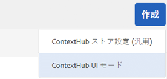
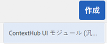
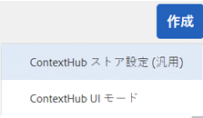
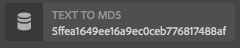

# ContextHub の設定 {#configuring-contexthub}

ContextHub は、コンテキストデータを保存、操作および表示するためのフレームワークです。ContextHub について詳しくは、 [開発者向けドキュメント](/help/sites-developing/contexthub.md). ContextHub に代わる機能 [ClientContext](/help/sites-administering/client-context.md) （タッチ UI）

の設定 [ContextHub](/help/sites-developing/contexthub.md) ツールバーを使用して、プレビューモードで表示するかどうかを制御し、ContextHub ストアを作成し、タッチ操作向け UI を使用して UI モジュールを追加します。

## ContextHub の無効化 {#disabling-contexthub}

デフォルトでは、AEMのインストールで ContextHub が有効になっています。 ContextHub を無効にして、js/css の読み込みと初期化を防ぐことができます。

<!--
There are two options to disable ContextHub:

* Edit the ContextHub's configuration and check the option **Disable ContextHub**

    1. In the rail click or tap **Tools &gt; Sites &gt; ContextHub**
    1. Click or tap the appropriate **Configuration Container**
    1. Select the **ContextHub Configuration** and click or tap **Edit Selected Element**
    1. Click or tap **Disable ContextHub** and click or tap **Save**

or
-->

* CRXDE Lite を使用して、`/libs/settings/cloudsettings/legacy/contexthub` の `disabled` プロパティを **true** に設定します。

>[!NOTE]
>
>[AEM 6.4 でのリポジトリの再構築に伴い](/help/sites-deploying/repository-restructuring.md)、ContextHub 構成の場所が `/etc/cloudsettings` から次のように変更されました。
>
>* `/libs/settings/cloudsettings`
>* `/conf/global/settings/cloudsettings`
>* `/conf/<tenant>/settings/cloudsettings`


## ContextHub UI の表示と非表示 {#showing-and-hiding-the-contexthub-ui}

Adobe Granite ContextHub OSGi サービスを設定して、ページで [ContextHub UI](/help/sites-authoring/ch-previewing.md) を表示または非表示にします。このサービスの PID は、`com.adobe.granite.contexthub.impl.ContextHubImpl.` です。

このサービスは、[Web コンソール](/help/sites-deploying/configuring-osgi.md#osgi-configuration-with-the-web-console)または[リポジトリ内の JCR ノード](/help/sites-deploying/configuring-osgi.md#osgi-configuration-in-the-repository)を使用して設定できます。

* **Web コンソール：** UI を表示するには、Show UI プロパティを選択します。 UI を非表示にするには、「 UI を非表示」プロパティをオフにします。
* **JCR ノード：** UI を表示するには、`com.adobe.granite.contexthub.show_ui` ブール値プロパティを `true` に設定します。UI を非表示にするには、プロパティを `false` に設定します。

ContextHub UI を表示すると、AEMオーサーインスタンスのページにのみ表示されます。 この UI は、パブリッシュインスタンスのページには表示されません。

## ContextHub UI のモードとモジュールの追加 {#adding-contexthub-ui-modes-and-modules}

ContextHub ツールバーに表示される UI のモードとモジュールをプレビューモードで設定します。

* UI モード：関連モジュールのグループ
* モジュール：ストアからのコンテキストデータを公開し、作成者がコンテキストを操作できるようにするウィジェット

UI モードは、ツールバーの左側に一連のアイコンとして表示されます。 選択すると、UI モードのモジュールが右側に表示されます。


アイコンは、 [Coral UI アイコンライブラリ](https://helpx.adobe.com/jp/experience-manager/6-4/sites/developing/using/reference-materials/coral-ui/coralui3/Coral.Icon.html#availableIcons).

### UI モードの追加 {#adding-a-ui-mode}

関連する ContextHub モジュールをグループ化するための UI モードを追加します。 UI モードを作成する際に、ContextHub ツールバーに表示されるタイトルとアイコンを指定します。

1. Experience Managerレールで、ツール/サイト/Context Hub をクリックまたはタップします。
1. デフォルトの設定コンテナをクリックまたはタップします。
1. 「ContextHub 設定」をクリックまたはタップします。
1. 「作成」ボタンをクリックまたはタップし、「ContextHub UI モード」をクリックまたはタップします。

   

1. 次のプロパティの値を指定します。

   * UI モードのタイトル：UI モードを識別するタイトル。
   * モードアイコン：使用する [Coral UI アイコン](https://helpx.adobe.com/jp/experience-manager/6-4/sites/developing/using/reference-materials/coral-ui/coralui3/Coral.Icon.html#availableIcons)のセレクター（例：`coral-Icon--user`）。
   * 有効：UI モードを ContextHub ツールバーに表示する場合に選択します。

1. 「保存」をクリックまたはタップします。

### UI モジュールの追加 {#adding-a-ui-module}

ContextHub UI モジュールを UI モードに追加し、それを ContextHub ツールバーに表示して、ページコンテンツをプレビューできるようにします。UI モジュールを追加する場合、ContextHub に登録されているモジュールタイプのインスタンスを作成します。 UI モジュールを追加するには、関連付けられたモジュールタイプの名前を把握しておく必要があります。

AEMには、基本 UI モジュールタイプと、UI モジュールのベースとなるいくつかのサンプル UI モジュールタイプが用意されています。 次の表に、それぞれの簡単な説明を示します。 カスタム UI モジュールの開発について詳しくは、 [ContextHub UI モジュールの作成](/help/sites-developing/ch-extend.md#creating-contexthub-ui-module-types).

UI モジュールのプロパティには詳細設定が含まれており、モジュール固有のプロパティの値を指定できます。 詳細な設定は JSON 形式で指定します。 表の「モジュールタイプ」列には、各 UI モジュールタイプに必要な JSON コードに関する情報へのリンクが表示されます。

| モジュールの種類 | 説明 | ストア |
|---|---|---|
| [contexthub.base](/help/sites-developing/ch-samplemodules.md#contexthub-base-ui-module-type) | 汎用の UI モジュールタイプ | UI モジュールのプロパティで設定されます |
| [contexthub.browserinfo](/help/sites-developing/ch-samplemodules.md#contexthub-browserinfo-ui-module-type) | ブラウザーに関する情報が表示されます | surferinfo |
| [contexthub.datetime](/help/sites-developing/ch-samplemodules.md#contexthub-datetime-ui-module-type) | 日付と時間の情報が表示されます | datetime |
| [contexthub.device](/help/sites-developing/ch-samplemodules.md#contexthub-device-ui-module-type) | クライアントデバイスが表示されます。 | emulators |
| [contexthub.location](/help/sites-developing/ch-samplemodules.md#contexthub-location-ui-module-type) | クライアントの緯度と経度、およびマップ上の位置を表示します。 場所を変更できます。 | geolocation |
| [contexthub.screen-orientation](/help/sites-developing/ch-samplemodules.md#contexthub-screen-orientation-ui-module-type) | デバイスの画面の向きが表示されます（横置きまたは縦置き） | emulators |
| [contexthub.tagcloud](/help/sites-developing/ch-samplemodules.md#contexthub-tagcloud-ui-module-type) | ページのタグに関する統計が表示されます | tagcloud |
| [granite.profile](/help/sites-developing/ch-samplemodules.md#granite-profile-ui-module-type) | authorizableID、displayName、familyName など、現在のユーザーのプロファイル情報を表示します。 displayName と familyName の値は変更できます。 | プロファイル |

1. Experience Managerレールで、ツール/サイト/ContextHub をクリックまたはタップします。
1. UI モジュールを追加する設定コンテナをクリックまたはタップします。
1. UI モジュールを追加する ContextHub 設定をクリックまたは入力します。
1. UI モジュールを追加する UI モードをクリックまたはタップします。
1. 「作成」ボタンをクリックまたはタップし、「ContextHub UI モジュール（汎用）」をクリックまたはタップします。

   

1. 次のプロパティの値を指定します。

   * UI モジュールのタイトル：UI モジュールを識別するタイトル
   * モジュールタイプ：モジュールタイプ
   * 有効：UI モジュールを ContextHub ツールバーに表示する場合に選択します

1. （オプション）デフォルトのストア設定を上書きするには、UI モジュールを設定する JSON オブジェクトを入力します。
1. 「保存」をクリックまたはタップします。

## ContextHub ストアの作成 {#creating-a-contexthub-store}

Context Hub ストアを作成してユーザーデータを保持し、必要に応じてデータにアクセスします。 ContextHub ストアは、登録されたストア候補に基づいています。 ストアを作成する際には、ストア候補が登録された storeType の値が必要です。 ( [カスタムストア候補の作成](/help/sites-developing/ch-extend.md#creating-custom-store-candidates).)

### 詳細なストア設定 {#detailed-store-configuration}

ストアを設定すると、詳細設定プロパティによりストア固有のプロパティの値を指定できます。値は、ストアの `config` 関数の `init` パラメーターに基づきます。このため、この値を指定する必要があるかどうかと、指定する値の形式はストアによって変わります。

詳細設定プロパティの値は、JSON 形式の `config` オブジェクトです。

### サンプルのストア候補 {#sample-store-candidates}

AEMには、ストアのベースとなる次のサンプルストア候補が用意されています。

| ストアの種類 | 説明 |
|---|---|
| [aem.segmentation](/help/sites-developing/ch-samplestores.md#aem-segmentation-sample-store-candidate) | 解決された ContextHub セグメントと未解決の ContextHub セグメントを保存します。 ContextHub SegmentManager からセグメントを自動的に取得します |
| [aem.resolvedsegments](/help/sites-developing/ch-samplestores.md#aem-resolvedsegments-sample-store-candidate) | 現在解決されているセグメントが格納されます。 ContextHub SegmentManager サービスをリッスンしてストアを自動的に更新します。 |
| [contexthub.geolocation](/help/sites-developing/ch-samplestores.md#contexthub-geolocation-sample-store-candidate) | ブラウザーの場所の緯度と経度が格納されます。 |
| [contexthub.datetime](/help/sites-developing/ch-samplestores.md#contexthub-datetime-sample-store-candidate) | ブラウザーの場所の日付、時間、季節を格納します。 |
| [granite.emulators](/help/sites-developing/ch-samplestores.md#granite-emulators-sample-store-candidate) | 多数のデバイスのプロパティと機能を定義し、現在のクライアントデバイスを検出します |
| [contexthub.generic-jsonp](/help/sites-developing/ch-samplestores.md#contexthub-generic-jsonp-sample-store-candidate) | JSONP サービスからデータを取得して格納します。 |
| [granite.profile](/help/sites-developing/ch-samplestores.md#granite-profile-sample-store-candidate) | 現在のユーザーのプロファイルデータを格納します |
| [contexthub.surferinfo](/help/sites-developing/ch-samplestores.md#contexthub-surferinfo-sample-store-candidate) | デバイス情報、ブラウザーの種類、画面の向きなど、クライアントに関する情報を格納します |
| [contexthub.tagcloud](/help/sites-developing/ch-samplestores.md#contexthub-tagcloud-sample-data-store) | ページのタグとタグの数を格納します。 |

1. Experience Managerレールで、ツール/サイト/ContextHub をクリックまたはタップします。
1. デフォルトの設定コンテナをクリックまたはタップします。
1. 「 Contexthub 設定」をクリックまたはタップします。
1. ストアを追加するには、作成アイコンをクリックまたはタップし、「ContextHub ストア設定」をクリックまたはタップします。

   

1. 基本的な設定プロパティの値を指定し、「次へ」をクリックまたはタップします。

   * **設定のタイトル：** ストアを識別するタイトル
   * **ストアの種類：** ストアのベースとなるストア候補の storeType プロパティの値
   * **必須：**&#x200B;オン。
   * **有効：** 選択してストアを有効にします

1. （オプション）デフォルトのストア設定を上書きするには、「詳細設定 (JSON) 」ボックスに JSON オブジェクトを入力します。
1. 「保存」をクリックまたはタップします。

## JSONP サービスの使用例  {#example-using-a-jsonp-service}

この例は、ストアを設定して UI モジュールにデータを表示する方法を示します。この例では、ストアのデータソースとして jsontest.com サイトの MD5 サービスが使用されています。サービスが指定の文字列の MD5 ハッシュコードを JSON 形式で返します。

contexthub.generic-jsonp ストアがサービスコール `https://md5.jsontest.com/?text=%22text%20to%20md5%22` のデータを格納するように設定されます。このサービスは、UI モジュールに表示される次のデータを返します。

```xml
{
   "md5": "919a56ab62b6d5e1219fe1d95248a2c5",
   "original": "\"text to md5\""
}
```

### contexthub.generic-jsonp ストアの作成 {#creating-a-contexthub-generic-jsonp-store}

contexthub.generic-jsonp のサンプルのストア候補を使用すると、JSON データを返す JSONP サービスまたは Web サービスからデータを取得できます。 このストア候補では、そのストア設定を使用して、使用する JSONP サービスに関する詳細を指定します。

[ Javascript クラスの ](/help/sites-developing/contexthub-api.md#init-name-config)init`ContextHub.Store.JSONPStore` 関数は、このストア候補を初期化する `config` オブジェクトを定義します。`config` オブジェクトには JSONP サービスに関する情報が含まれる `service` オブジェクトが含まれています。ストアを設定するには、詳細設定プロパティの値として `service` オブジェクトを JSON 形式で指定します。

jsontest.com サイトの MD5 サービスからのデータを保存するには、次のプロパティを使用して [ContextHub ストアの作成](/help/sites-developing/ch-configuring.md#creating-a-contexthub-store)の手順に従います。

* **設定のタイトル：** md5
* **ストアの種類：** contexthub.generic-jsonp
* **必須：**&#x200B;オン。
* **有効：**&#x200B;オン
* **詳細設定（JSON）：**

   ```xml
   {
    "service": {
    "jsonp": false,
    "timeout": 1000,
    "ttl": 1800000,
    "secure": false,
    "host": "md5.jsontest.com",
    "port": 80,
    "params":{
    "text":"text to md5"
        }
      }
    }
   ```

### md5 データの UI モジュールの追加 {#adding-a-ui-module-for-the-md-data}

ContextHub ツールバーに UI モジュールを追加して、サンプルの md5 ストアに格納されているデータを表示します。この例では、contexthub.base module が次の UI モジュールの生成に使用されています。



[UI モジュールの追加](#adding-a-ui-module)手順に従って、サンプルのペルソナ UI モードなどの既存の UI モードに UI モジュールを追加します。UI モジュールでは、次のプロパティ値を使用します。

* **UI モジュールのタイトル：** MD5
* **モジュールの種類：** contexthub.base
* **詳細設定（JSON）：**

   ```xml
   {
    "icon": "coral-Icon--data",
    "title": "MD5 Converstion",
    "storeMapping": { "md5": "md5" },
    "template": "<p> {{md5.original}}</p>;
                 <p>{{md5.md5}}</p>"
   }
   ```

## ContextHub のデバッグ {#debugging-contexthub}

ContextHub のデバッグモードを有効にして、トラブルシューティングをおこなうことができます。 デバッグモードは、ContextHub 設定を通じて有効にするか、CRXDE を通じて有効にすることができます。

### 設定を使用 {#via-the-configuration}

ContextHub の設定を編集し、「**デバッグ**」オプションをオンにします。

1. レールで、「 」をクリックまたはタップします。 **ツール/サイト/ ContextHub**
1. デフォルトの **設定コンテナ**
1. を選択します。 **ContextHub 設定** をクリックまたはタップします。 **選択した要素を編集**
1. 「**デバッグ**」をクリックまたはタップし、「**保存**」をクリックまたはタップします。

### CRXDE による有効化 {#via-crxde}

CRXDE Lite を使用して、`debug` プロパティを **true** に設定します。

* `/conf/global/settings/cloudsettings` または
* `/conf/<tenant>/settings/cloudsettings`

>[!NOTE]
>
>ContextHub 設定が従来のパスの下に残っている場合は、 `debug property` を設定する場所は `/libs/settings/cloudsettings/legacy/contexthub` になります。

### サイレントモード {#silent-mode}

サイレントモードでは、すべてのデバッグ情報が無効になります。各 ContextHub 設定に対して個別に設定可能な通常のデバッグオプションとは異なり、サイレントモードは、ContextHub 設定レベルのあらゆるデバッグ設定より優先されるグローバル設定です。

これは、デバッグ情報をまったく必要としないパブリッシュインスタンスに便利なモードです。これはグローバル設定なので、OSGi を介して有効にします。

1. `http://<host>:<port>/system/console/configMgr` で **Adobe Experience Manager Web コンソール設定**&#x200B;を開きます。
1. **Adobe Granite ContextHub** を検索します。
1. 設定「**Adobe Granite ContextHub**」をクリックして、そのプロパティを編集します。
1. 「**サイレントモード**」チェックボックスをオンにし、「**保存**」をクリックします。

## アップグレード後の ContextHub 設定の復元 {#recovering-contexthub-configurations-after-upgrading}

実行時に [AEMへのアップグレード](/help/sites-deploying/upgrade.md) を実行すると、ContextHub 設定がバックアップされ、安全な場所に保存されます。 アップグレード中に、デフォルトの ContextHub 設定がインストールされ、既存の設定が置き換えられます。 バックアップは、行った変更や追加を保持する必要があります。

ContextHub 構成は、次のノードの下の `contexthub` という名前のフォルダーに保存されます。

* `/conf/global/settings/cloudsettings`
* `/conf/<tenant>/settings/cloudsettings`

アップグレード後、バックアップは、次の名前のノードの下にある `contexthub` という名前のフォルダーに保存されます。

`/conf/global/settings/cloudsettings/default-pre-upgrade_yyyymmdd_xxxxxxx` か `/conf/<tenant>/settings/cloudsettings/default-pre-upgrade_yyyymmdd_xxxxxxx` のどちらかにする必要があります。

ノード名の `yyyymmdd` の部分は、アップグレードが実行された日付になります。

ContextHub の設定を復元するには、CRXDE Lite を使用してストア、UI モード、UI モジュールを表すノードを `default-pre-upgrade_yyyymmdd_xxxxxx` ノードの下から次の下にコピーします。

* `/conf/global/settings/cloudsettings` または
* `/conf/<tenant>/settings/cloudsettings`
