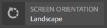

# ContextHub UI モジュールタイプのサンプル {#sample-contexthub-ui-module-types}

ContextHub には、ソリューションで利用できる UI モジュールのサンプルが用意されています。次の情報が提供されます。

* UI モジュールの主な機能。
* 学習用に参照できるソースコードの場所。
* UI モジュールの設定方法。

UI モジュールの ContextHub への追加については、[UI モジュールの追加](ch-configuring.md#adding-a-ui-module)を参照してください。UI モジュールの作成については、[ContextHub UI モジュールタイプの作成](/help/sites-developing/ch-extend.md#creating-contexthub-ui-module-types)を参照してください。

## contexthub.base UI モジュールタイプ {#contexthub-base-ui-module-type}

contexthub.base UI モジュールタイプは、その他すべての UI モジュールタイプのベースタイプです。したがって、ストアデータをレンダリングするための汎用的な機能を提供します。

次の機能を使用できます。

* **タイトルとアイコン：** UI モジュールのタイトルとアイコンを指定します。アイコンは、URL を使用して、または Coral UI アイコンライブラリから参照できます。
* **ストアデータ：**&#x200B;データの取得元とするストアを 1 つ以上指定します。
* **コンテンツ：** UI モジュールが ContextHub のツールバーに表示されるときに UI モジュールに表示するコンテンツを指定します。
* **ポップオーバーのコンテンツ：** UI モジュールをクリックまたはタップするとポップオーバーに表示されるコンテンツを指定します。
* **全画面モード：**&#x200B;全画面モードを許可するかどうかを制御します。

ソースコードは/libs/granite/contexthub/code/ui/container/js/ContextHub.UI.BaseModuleRenderer.jsにあります。

### 設定 {#configuration}

contexthub.base UI モジュールは、JSON 形式の JavaScript オブジェクトを使用して設定します。UI モジュールの機能を設定するには、次のいずれかのプロパティを含めます。

* **image:** アイコンとして表示する画像のURL。
* **icon:** Coral UIアイコン [クラスの名前](https://helpx.adobe.com/experience-manager/6-4/sites/developing/using/reference-materials/coral-ui/coralui3/Coral.Icon.html) 。 icon プロパティと image プロパティの両方に値を指定した場合は、image が使用されます。

* **title:** UIモジュールのタイトル。 タイトルは、ポインターを UI モジュールアイコンに合わせると表示されます。
* **fullscreen:** UIモジュールがフルスクリーンモードをサポートするかどうかを示すboolean値です。 Use `true` to support fullscreen and `false` to prevent fullscreen mode.

* **template：** ContextHub のツールバーにレンダリングするコンテンツを指定する [Handlebars](https://handlebarsjs.com/) テンプレート。Use at most two `<p>` tags.

* **storeMapping：**&#x200B;キーとストアのマッピング。関連するContextHubストアデータにアクセスするには、ハンドルテンプレートのキーを使用します。
* **リスト:** UIモジュールがクリックされたときにプロバーでリストとして表示する項目の配列です。 この項目を含める場合は、popoverTemplate を含めないでください。値は、次のキーを持つオブジェクトの配列です。

   * title：この項目に対して表示するテキスト
   * image：（オプション）左側に表示する画像への URL
   * icon：（オプション）左側に表示する CUI アイコンクラス。image が指定されている場合は無視されます。
   * selected：（オプション）選択された場合（true = 選択）にこの項目を表示するかどうかを指定するブール値。デフォルトでは、選択された項目は太字のフォントで表示されます。その他の外観を設定するには、`listType` プロパティを使用します（以下を参照）。

* **listType：**&#x200B;ポップオーバーリスト項目に使用するスタイル。次のいずれかの値を使用します。

   * checkmark
   * チェックボックス
   * radio

* **poverTemplate:** UIモジュールがクリックされたときにプローバーでレンダリングするコンテンツを指定するハンドルテンプレートです。 この項目を含める場合は、`list` 項目を含めないでください。

### 例 {#example}

次の例では、[contexthub.emulators](/help/sites-developing/ch-samplestores.md#granite-emulators-sample-store-candidate) ストアからの情報を表示するように contexthub.base UI モジュールを設定しています。`template` 項目は、`storeMapping` 項目が作成するキーを使用することによって、このストアからデータを取得する方法を示しています。

```xml
{
   "icon": "coral-Icon--move",
    "title": "Screen Resolution",
    "storeMapping": {
      "emulator": "emulators"
    },
    "template": "<p>{{{ i18n \"Resolution\"}}}</p><p>{{{emulator.currentDevice.width}}} x {{{emulator.currentDevice.height}}}</p>"
}
```


## contexthub.browserinfo UI モジュールタイプ {#contexthub-browserinfo-ui-module-type}

contexthub.browserinfo UI モジュールは、クライアント Web ブラウザーとオペレーティングシステムに関する情報を表示します。情報は、[contexthub.surferinfo](/help/sites-developing/ch-samplestores.md#contexthub-surferinfo-sample-store-candidate) ストア候補をベースとする surferinfo ストアから取得されます。


UIモジュールのソースコードは、/libs/granite/contexthub/components/modules/browserinfoにあります。 contexthub.browserinfo は contexthub.base UI モジュールを拡張したものですが、追加の関数を上書きまたは提供しません。この実装は、ブラウザー情報をレンダリングするためのデフォルトの設定を提供します。

### 設定 {#configuration-1}

contexthub.browserinfo UI モジュールのインスタンスには、詳細設定用の値は必要ありません。次の JSON テキストは、モジュールのデフォルトの設定を表しています。

```xml
{
   "icon":"coral-Icon--globe",
   "title":"Browser/OS Information",
   "storeMapping":{"surferinfo":"surferinfo"},
   "template":"<p>{{surferinfo.browser.family}} {{surferinfo.browser.version}}</p><p>{{surferinfo.os.name}} {{surferinfo.os.version}}</p>"
}
```

## contexthub.datetime UI モジュールタイプ {#contexthub-datetime-ui-module-type}

contexthub.datetime UI モジュールは、[contexthub.datetime](/help/sites-developing/ch-samplestores.md#contexthub-datetime-sample-store-candidate) ストア候補をベースとする、datetime という名前のストアに格納されている日時を表示します。


このモジュールは、ストア内の日時を変更できるポップオーバーフォームを提供します。

contexthub.datetime UIモジュールのソースは、/libs/granite/contexthub/components/modules/datetimeにあります。

### 設定 {#configuration-2}

contexthub.datetime UI モジュールのインスタンスは、詳細設定用の値を必要としません。次の JSON テキストは、モジュールのデフォルトの設定を表しています。

```xml
{
   "icon":"coral-Icon--clock",
   "title":"DATE&TIME",
   "clickable":true,
   "storeMapping":{"d":"datetime"},
   "template":"<p class=\"contexthub-module-line1\">{{i18n \"Date&Time\"}}</p><p class=\"contexthub-module-line2\">{{d.formatted.locale.date}} {{d.formatted.locale.time}}</p>",
   "popoverTemplate":"<div class=\"datetime center\"><div class=\"coral-DatePicker-calendar\" data-init=\"datepicker\"><input class=\"coral-Textfield\" type=\"datetime\" value=\"{{d.formatted.iso}}\"><button class=\"coral-Button coral-Button--secondary coral-Button--square\" title=\"{{i18n \"Datetime picker\"}}\"><i class=\"coral-Icon coral-Icon--calendar coral-Icon--sizeS\"></i></button></div></div>"
}
```

## contexthub.location UI モジュールタイプ {#contexthub-location-ui-module-type}

contexthub.location UI モジュールは、クライアントの緯度と経度を表示します。このモジュールは、クリックして現在の位置を変更できる Google マップを表示するポップオーバーを提供します。このモジュールは、[contexthub.geolocation](/help/sites-developing/ch-samplestores.md#contexthub-geolocation-sample-store-candidate) ストア候補をベースとする、geolocation という名前の ContextHub ストアから情報を取得します。


UIモジュールのソースは、/etc/cloudsettings/default/contexthub/geolocationにあります。

### 設定 {#configuration-4}

contexthub.location UI モジュールのインスタンスには、詳細設定用の値は必要ありません。次の JSON テキストは、モジュールのデフォルトの設定を表しています。

```xml
{
 "icon":"coral-Icon--compass",
 "title":"Location",
 "clickable":true,
 "editable":{"key":"/geolocation","disabled":[],"hidden":["/geolocation/generatedThumbnail","/geolocation/city","/geolocation/country"]},
 "fullscreen":true,
 "storeMapping":{"g":"geolocation"},
 "template":"<p>{{i18n \"Location\"}}</p><p>{{g.address.postalCode}} {{g.address.city}}{{#if g.address.city}}{{#if g.address.region}},{{/if}}{{/if}} {{g.address.region}}</p>",
 "list":[
  {"title":"Basel, Switzerland",
  "data":{"longitude":7.58929,"latitude":47.554746,"city":"Basel","country":"Switzerland"}},
  {"title":"Melbourne, Australia",
  "data":{"longitude":144.96328,"latitude":-37.814107,"city":"Melbourne","country":"Australia"}},
  {"title":"Beijing, China",
  "data":{"longitude":116.407526,"latitude":39.90403,"city":"Beijing","country":"China"}},
  {"title":"New York, NY, USA",
  "data":{"longitude":-74.005973,"latitude":40.714353,"city":"New York","country":"United States"}},
  {"title":"Paris, France",
  "data":{"longitude":2.352222,"latitude":48.856614,"city":"Paris","country":"France"}},
  {"title":"Rio de Janeiro, Brazil",
  "data":{"longitude":-43.20071,"latitude":-22.913395,"city":"Rio","country":"Brazil"}},
  {"title":"San Jose, CA, USA",
  "data":{"longitude":-121.894955,"latitude":37.339386,"city":"San Jose","country":"United States"}},
  {"title":"Tokyo, Japan",
  "data":{"longitude":139.691706,"latitude":35.689487,"city":"Shinjuku","country":"Japan"}}
 ],
 "listType":"checkmark"
}
```

## contexthub.screen-orientation UI モジュールタイプ {#contexthub-screen-orientation-ui-module-type}

contexthub.screen-orientation UI モジュールは、クライアントの現在の画面の向きを表示します。デフォルトでは無効になっていますが、このモジュールは向きを選択できるポップオーバーを提供します。このモジュールは、[granite.emulators](/help/sites-developing/ch-samplestores.md#granite-emulators-sample-store-candidate) ストア候補をベースとする、emulators という名前の ContextHub ストアから情報を取得します。



UIモジュールのソースは、/libs/granite/contexthub/components/modules/screen-orientationにあります。

### 設定 {#configuration-5}

contexthub.screen-orientation UI モジュールのインスタンスには、詳細設定用の値は必要ありません。次の JSON テキストは、モジュールのデフォルトの設定を表しています。Note that the `clickable` property is `false` by default. If you override the default configuration to set `clickable` to `true`, clicking the module reveals a popup where you can select the orientation.

```xml
{
   "icon":"coral-Icon--rotateRight",
   "title":"Screen Orientation",
   "clickable":false,
   "storeMapping":{"emulator":"emulators"},
   "template":"<p>{{{ i18n \"Screen Orientation\" }}}</p><p>{{{ emulator.currentDevice.orientation }}}",
   "listReference":"/emulators/orientations",
   "listType":"checkmark"
}
```

## contexthub.tagcloud UI モジュールタイプ {#contexthub-tagcloud-ui-module-type}

contexthub.tagcloud UI モジュールは、タグに関する情報を表示します。この UI モジュールは、ツールバーに多数のタグを表示します。ポップアップには、タグクラウドと新しいタグを追加するためのテキストボックスが表示されます。この UI モジュールは、[contexthub.tagcloud](/help/sites-developing/ch-samplestores.md#contexthub-tagcloud-sample-data-store) ストア候補をベースとする、tagcloud という名前の ContextHub ストアから情報を取得します。


UIモジュールのソースは、/libs/granite/contexthub/components/modules/tagcloudにあります。

### 設定 {#configuration-6}

contexthub.tagcloud UI モジュールのインスタンスには、詳細設定用の値は必要ありません。次の JSON テキストは、モジュールのデフォルトの設定を表しています。

```xml
{
   "icon":"coral-Icon--tag",
   "title":"TagCloud",
   "clickable":true,
   "storeMapping":{"t":"tagcloud"},
   "maxTags":20,
   "template":"<p class=\"contexthub-module-line1\">{{i18n \"TagCloud\"}}</p><p class=\"contexthub-module-line2\">{{stats.total}} {{i18n \"Tags\"}}</p>",
   "popoverTemplate":"<div class=\"contexthub-popover-content center\"><p class=\"stats\">{{stats.total}} {{i18n \"Tags\"}} | {{stats.hits}} {{i18n \"Hits\"}} | {{i18n \"Last tag\"}}: {{#if stats.recent}}{{stats.recent}}{{else}}{{i18n \"Unknown\"}}{{/if}}</p><p class=\"tagcloud\">{{#each tags}}<span class=\"tag{{this.weight}}\">{{this.name}}</span> {{/each}}</p><div class=\"coral-InputGroup\"><input type=\"text\" class=\"coral-InputGroup-input coral-Textfield tag-name\" placeholder=\"{{i18n \"Add a namespace:my/tag\"}}\" pattern=\"^[A-Za-z0-9_\\-]+(:[A-Za-z0-9_\\-\\/]+)?$\" title=\"{{i18n \"namespace:my/tag\"}}\"><span class=\"coral-InputGroup-button\"><button class=\"coral-Button coral-Button--secondary coral-Button--square contexthub-new-tag\" type=\"button\" title=\"{{i18n \"increment\"}}\"><i class=\"coral-Icon coral-Icon--sizeS coral-Icon--add\"></i></button></span></div></div>"
}
```

## granite.profile UI モジュールタイプ {#granite-profile-ui-module-type}

granite.profile ContextHub UI モジュールは、現在のユーザーの表示名を表示します。ポップアップにはユーザーのログイン名が表示され、表示名の値を変更できます。この UI モジュールは、[granite.profile](/help/sites-developing/ch-samplestores.md#granite-profile-sample-store-candidate) ストア候補をベースとする、profile という名前の ContextHub ストアから情報を取得します。


UIモジュールのソースは/libs/granite/contexthub/components/modules/modules/プロファイルにあります。

### 設定 {#configuration-7}

contexthub.profile UI モジュールのインスタンスには、詳細設定用の値は必要ありません。次の JSON テキストは、モジュールのデフォルトの設定を表しています。

```xml
{
   "icon":"coral-Icon--user",
   "title":"Profile",
   "clickable":true,
   "editable":{
      "key":"/profile",
      "disabled":["/profile/authorizableId"],
      "hidden":["/profile/avatar","/profile/path"]},
   "storeMapping":{"p":"profile"},
   "template":"<p class=\"contexthub-module-line1\">{{i18n \"Persona\"}}</p><p class=\"contexthub-module-line2\">{{p.displayName}}</p>",
   "listType":"checkmark"
}
```
